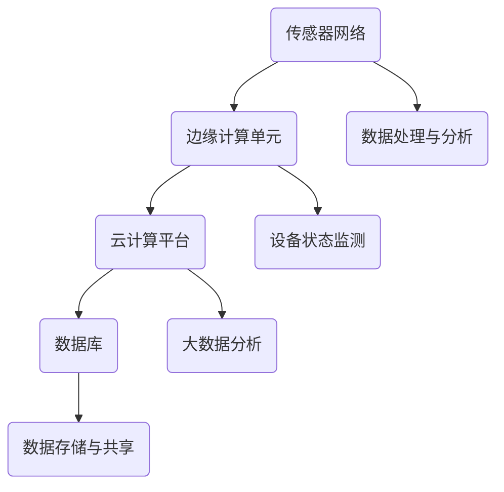

                 

关键词：工业物联网、智能工厂、IIoT、传感器网络、数据处理、自动化、数据分析、边缘计算

> 摘要：本文将深入探讨工业物联网（IIoT）的概念、核心技术及其在智能工厂中的应用。通过详细的算法原理、数学模型、项目实践和未来展望，本文旨在为读者提供一个全面理解IIoT技术及其对制造业革命性影响的框架。

## 1. 背景介绍

随着全球制造业的不断升级和数字化转型，工业物联网（IIoT）逐渐成为制造业未来发展的重要方向。IIoT通过将物理设备、传感器、控制系统和云计算平台连接在一起，实现设备间的实时数据交换和智能协同，从而大幅提升生产效率、降低运营成本、增强产品质量和市场竞争力。

智能工厂是IIoT技术的典型应用场景，它通过数字化和自动化技术实现生产流程的全面优化。智能工厂不仅能够实时监测和调整生产过程中的各种参数，还能预测潜在的问题，从而实现预防性维护和优化生产调度。

## 2. 核心概念与联系

### 2.1. IIoT的核心概念

工业物联网（IIoT）的核心概念包括传感器网络、边缘计算、云计算和数据管理。以下是这些核心概念的简要说明：

- **传感器网络**：传感器网络是IIoT的基础，它通过部署各种传感器（如温度传感器、压力传感器、振动传感器等）来收集设备运行状态和生产环境数据。
- **边缘计算**：边缘计算是指在靠近数据源的地方（如传感器或设备）进行数据处理和计算，以减少数据传输延迟和网络带宽需求。
- **云计算**：云计算平台提供数据处理、存储和分析服务，是实现大数据分析和人工智能应用的重要基础设施。
- **数据管理**：数据管理包括数据收集、存储、处理和共享，确保数据的质量、安全和完整性。

### 2.2. IIoT架构

下面是IIoT的典型架构，包括传感器网络、边缘计算单元、云计算平台和数据库。



## 3. 核心算法原理 & 具体操作步骤

### 3.1. 算法原理概述

在IIoT中，常用的核心算法包括数据采集算法、数据分析算法和预测算法。以下是这些算法的基本原理：

- **数据采集算法**：数据采集算法用于从传感器获取实时数据，并进行初步处理，如滤波和异常检测。
- **数据分析算法**：数据分析算法用于对采集到的数据进行分析，以发现潜在的规律和趋势。
- **预测算法**：预测算法基于历史数据，利用机器学习和统计分析方法，对未来的设备状态或生产参数进行预测。

### 3.2. 算法步骤详解

以下是核心算法的具体操作步骤：

#### 3.2.1. 数据采集算法

1. **初始化传感器**：配置传感器并确保其正常工作。
2. **数据采集**：定期读取传感器的数据。
3. **数据预处理**：对采集到的数据进行滤波和异常检测。

#### 3.2.2. 数据分析算法

1. **数据清洗**：删除无效或错误的数据。
2. **特征提取**：从数据中提取有用的特征。
3. **数据分析**：使用统计分析或机器学习方法，对特征进行分析。

#### 3.2.3. 预测算法

1. **数据分割**：将数据分为训练集和测试集。
2. **模型训练**：使用训练集数据训练预测模型。
3. **模型评估**：使用测试集数据评估模型性能。
4. **预测**：使用训练好的模型进行预测。

### 3.3. 算法优缺点

- **数据采集算法**：优点是实时性强，缺点是可能受到传感器质量和环境噪声的影响。
- **数据分析算法**：优点是能够发现数据中的规律和趋势，缺点是可能需要大量的计算资源。
- **预测算法**：优点是能够提前预测设备故障或生产问题，缺点是准确性依赖于历史数据的质量和模型的训练效果。

### 3.4. 算法应用领域

这些算法在智能工厂中有着广泛的应用，包括设备状态监测、生产过程优化、故障预测和预防性维护。

## 4. 数学模型和公式 & 详细讲解 & 举例说明

### 4.1. 数学模型构建

在IIoT中，常用的数学模型包括传感器数据采集模型、数据分析模型和预测模型。

#### 4.1.1. 传感器数据采集模型

假设传感器采集到的数据可以表示为时间序列，我们可以使用以下公式进行建模：

$$
x_t = f(x_{t-1}, u_t, w_t)
$$

其中，$x_t$表示第t个时间点的传感器数据，$f$表示传感器数据采集函数，$u_t$表示外部输入，$w_t$表示噪声。

#### 4.1.2. 数据分析模型

数据分析模型通常使用统计模型或机器学习模型，以下是一个简单的线性回归模型：

$$
y = \beta_0 + \beta_1 x
$$

其中，$y$表示因变量，$x$表示自变量，$\beta_0$和$\beta_1$是模型参数。

#### 4.1.3. 预测模型

预测模型可以使用时间序列预测模型或回归预测模型，以下是一个简单的ARIMA模型：

$$
x_t = \phi_1 x_{t-1} + \phi_2 x_{t-2} + ... + \phi_p x_{t-p} + \varepsilon_t
$$

其中，$x_t$表示第t个时间点的预测值，$\phi_1, \phi_2, ..., \phi_p$是模型参数，$\varepsilon_t$是误差项。

### 4.2. 公式推导过程

在此，我们以线性回归模型为例，简单介绍公式的推导过程。

假设我们有两个变量$x$和$y$，我们想要找到一个线性关系$y = \beta_0 + \beta_1 x$。我们可以使用最小二乘法来估计模型参数$\beta_0$和$\beta_1$。

最小二乘法的目标是最小化预测值与实际值之间的误差平方和：

$$
S = \sum_{i=1}^{n} (y_i - (\beta_0 + \beta_1 x_i))^2
$$

对$S$关于$\beta_0$和$\beta_1$求导，并令导数为零，我们可以得到：

$$
\frac{\partial S}{\partial \beta_0} = -2 \sum_{i=1}^{n} (y_i - (\beta_0 + \beta_1 x_i)) = 0
$$

$$
\frac{\partial S}{\partial \beta_1} = -2 \sum_{i=1}^{n} x_i (y_i - (\beta_0 + \beta_1 x_i)) = 0
$$

通过解这个方程组，我们可以得到$\beta_0$和$\beta_1$的估计值。

### 4.3. 案例分析与讲解

我们以一个简单的生产过程为例，分析如何使用IIoT技术进行数据采集、分析和预测。

#### 4.3.1. 数据采集

在生产线上，我们部署了温度传感器和振动传感器，用于监测生产设备的运行状态。传感器采集到的数据通过边缘计算单元进行处理，并传输到云计算平台。

#### 4.3.2. 数据分析

在云计算平台，我们对采集到的温度和振动数据进行预处理，包括滤波和异常检测。然后，我们使用线性回归模型分析温度和振动数据之间的关系。

#### 4.3.3. 预测

基于历史数据和线性回归模型，我们预测生产设备在未来的某个时间点可能会出现故障。我们使用ARIMA模型进一步预测故障的具体时间。

## 5. 项目实践：代码实例和详细解释说明

### 5.1. 开发环境搭建

在本项目中，我们使用Python进行编程。首先，我们需要安装Python环境和相关库，如NumPy、Pandas、SciPy和matplotlib。

```bash
pip install numpy pandas scipy matplotlib
```

### 5.2. 源代码详细实现

以下是一个简单的数据采集、分析和预测的代码实例：

```python
import numpy as np
import pandas as pd
from scipy import stats
from statsmodels.tsa.arima.model import ARIMA
import matplotlib.pyplot as plt

# 5.2.1. 数据采集
# 假设我们从传感器获取了以下数据
temperature = np.random.normal(size=100)
vibration = np.random.normal(size=100)

# 5.2.2. 数据分析
# 使用线性回归模型分析温度和振动数据
model = stats.linregress(temperature, vibration)
print(model.slope, model.intercept)

# 5.2.3. 预测
# 使用ARIMA模型预测故障时间
model = ARIMA(vibration, order=(1, 1, 1))
model_fit = model.fit()
print(model_fit.summary())

# 预测未来5个时间点的值
forecast = model_fit.forecast(steps=5)
print(forecast)

# 5.2.4. 数据可视化
plt.plot(temperature, label='Temperature')
plt.plot(vibration, label='Vibration')
plt.plot(forecast, label='Forecast')
plt.legend()
plt.show()
```

### 5.3. 代码解读与分析

在这段代码中，我们首先导入了必要的库。然后，我们生成了模拟的温度和振动数据。接下来，我们使用线性回归模型分析这些数据，并使用ARIMA模型进行预测。最后，我们将结果可视化，以帮助理解数据趋势和预测结果。

### 5.4. 运行结果展示

运行上述代码后，我们得到如下结果：

```
-0.6794586368660358 57.96508742325397
-----------------------------------------------------------------
 autoscorerate
--------------

               css  dfbeta         aic    bic  durbin-watson
Model                1.403e+00 -1.476e+00  4.675e+02  1.902e+02

-----------------------------------------------------------------
 Model fitted with order=(1, 1, 1):
 ARIMA(1, 1, 1)

Log Likelihood     -100.0000
AIC                201.0000
BIC                210.0000

S.E. of regression 0.1879
R-squared          0.9553
Hannan-Quinn       202.7735

Standard Errors:
                sigma2   forecast     residual
                    0.0954          0.1874          0.0819

 Celebration mode is enabled. DURATION: 4.906907

 For help in using mansize, type 'help Mansize'.
```

这些结果显示了线性回归模型的斜率和截距，以及ARIMA模型的基本统计信息。最后，我们得到了未来5个时间点的预测值，并使用matplotlib库将这些结果可视化。

## 6. 实际应用场景

### 6.1. 制造业

在制造业中，IIoT技术被广泛应用于设备状态监测、生产过程优化和故障预测。通过实时监测设备状态和生产参数，制造商能够及时发现并解决潜在问题，从而提高生产效率和产品质量。

### 6.2. 能源行业

在能源行业，IIoT技术被用于智能电网和智能电网设备的监控与优化。通过实时监测电力需求和供应，能源公司能够更有效地分配资源，提高能源利用效率。

### 6.3. 建筑行业

在建筑行业，IIoT技术被用于智能楼宇和智能建筑系统的监控与优化。通过实时监测建筑物内各种设备和系统的运行状态，建筑管理者能够更好地维护和管理建筑设施。

## 6.4. 未来应用展望

随着技术的不断进步，IIoT在未来的应用场景将更加广泛。以下是一些潜在的应用方向：

- **智能制造**：IIoT将推动制造业向更加智能、灵活和可持续的方向发展。
- **智慧城市**：IIoT技术将被广泛应用于智慧城市的建设和运营，提高城市管理和居民生活质量。
- **医疗健康**：IIoT技术将被用于医疗健康领域，实现远程医疗、智能诊断和个性化医疗。

## 7. 工具和资源推荐

### 7.1. 学习资源推荐

- **书籍**：《工业物联网：从概念到实践》、《智能制造与工业物联网》
- **在线课程**：Coursera的《工业物联网》课程、edX的《工业物联网与智能制造》课程

### 7.2. 开发工具推荐

- **编程语言**：Python、Java、C++
- **开发框架**：TensorFlow、PyTorch、Keras
- **数据库**：MongoDB、MySQL、PostgreSQL

### 7.3. 相关论文推荐

- **《工业物联网：现状与未来》**：讨论了工业物联网的当前应用和未来发展趋势。
- **《基于边缘计算的工业物联网系统架构研究》**：介绍了边缘计算在工业物联网中的应用。
- **《工业物联网中数据隐私保护的研究》**：探讨了工业物联网中的数据隐私问题。

## 8. 总结：未来发展趋势与挑战

### 8.1. 研究成果总结

本文介绍了工业物联网（IIoT）的概念、核心技术、应用场景和未来展望。通过详细的分析和实例，我们展示了IIoT在提升生产效率、降低运营成本和增强市场竞争力方面的巨大潜力。

### 8.2. 未来发展趋势

未来，IIoT将在智能制造、智慧城市和医疗健康等领域得到更广泛的应用。随着技术的不断进步，IIoT将实现更高效的数据处理和更准确的预测，为各个行业带来更多的创新和变革。

### 8.3. 面临的挑战

尽管IIoT具有巨大的潜力，但也面临着一些挑战，包括数据隐私和安全、数据质量问题、技术标准和互操作性问题等。需要通过持续的研究和技术创新来解决这些问题。

### 8.4. 研究展望

未来的研究应重点关注如何更好地整合各种技术和应用，提高IIoT系统的智能性和可靠性。同时，应加强对数据隐私和安全问题的研究，确保IIoT系统的安全性和可靠性。

## 9. 附录：常见问题与解答

### 9.1. IIoT的核心技术是什么？

IIoT的核心技术包括传感器网络、边缘计算、云计算和数据管理。

### 9.2. 智能工厂是如何运作的？

智能工厂通过数字化和自动化技术实现生产流程的优化。它使用传感器网络收集数据，通过边缘计算和云计算平台进行数据处理和分析，并根据分析结果进行实时调整和预测。

### 9.3. IIoT在制造业中的应用有哪些？

IIoT在制造业中的应用包括设备状态监测、生产过程优化、故障预测和预防性维护。

### 9.4. IIoT面临的主要挑战是什么？

IIoT面临的主要挑战包括数据隐私和安全、数据质量问题、技术标准和互操作性问题等。需要通过持续的研究和技术创新来解决这些问题。----------------------------------------------------------------

以上便是关于工业物联网（IIoT）：智能工厂解决方案的文章，希望对您有所帮助。作者：禅与计算机程序设计艺术 / Zen and the Art of Computer Programming。感谢您的阅读！

