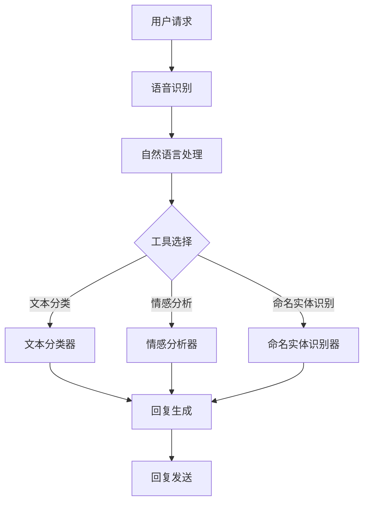

                 

关键词：智能客服系统，工具使用机制，应用场景，技术实现，案例分析

> 摘要：本文旨在探讨工具使用机制在智能客服系统中的应用。通过分析智能客服系统的核心功能和需求，介绍了一种基于工具使用机制的智能客服系统架构，并详细阐述了其核心算法原理、数学模型、具体操作步骤以及项目实践。本文旨在为读者提供一个全面了解和掌握智能客服系统中工具使用机制的方法。

## 1. 背景介绍

随着互联网的飞速发展和信息技术的不断进步，智能客服系统已成为企业服务的重要组成部分。智能客服系统通过人工智能技术和自然语言处理技术，能够实现与用户的实时交互，提供高效、准确、个性化的服务。然而，智能客服系统的开发和应用面临着诸多挑战，如如何处理复杂多样的用户请求、如何提高客服系统的响应速度和准确性、如何保证用户体验等。

工具使用机制作为一种提升智能客服系统性能的有效手段，近年来受到了广泛关注。工具使用机制旨在通过引入合适的工具和策略，辅助客服系统更好地理解和处理用户请求，从而提高系统的整体性能和用户体验。

本文将围绕工具使用机制在智能客服系统中的应用展开讨论，旨在为读者提供一个全面了解和掌握这一技术的路径。

## 2. 核心概念与联系

### 2.1 智能客服系统的基本概念

智能客服系统是一种基于人工智能技术和自然语言处理技术的客户服务系统，能够实现与用户的实时交互，提供高效、准确、个性化的服务。智能客服系统通常包括以下几个核心模块：

1. **语音识别模块**：将用户的语音输入转换为文本输入，以便后续处理。
2. **自然语言处理模块**：对文本输入进行语义理解，提取关键信息，构建对话上下文。
3. **知识库模块**：存储大量的产品信息、服务指南、常见问题等知识，供客服系统查询和参考。
4. **对话管理模块**：根据对话上下文和用户需求，生成合适的回复内容。
5. **多渠道集成模块**：支持电话、邮件、聊天、社交媒体等多种渠道的客户交互。

### 2.2 工具使用机制的基本概念

工具使用机制是指通过引入合适的工具和策略，辅助智能客服系统更好地理解和处理用户请求，从而提高系统的整体性能和用户体验。具体来说，工具使用机制包括以下几个关键方面：

1. **工具定义**：根据智能客服系统的需求，定义一系列可用的工具，如文本分类器、情感分析器、命名实体识别器等。
2. **工具选择**：根据用户请求的上下文和需求，选择合适的工具进行辅助处理。
3. **工具集成**：将选定的工具集成到智能客服系统中，确保工具能够与其他模块无缝衔接。
4. **工具优化**：通过不断优化工具的性能和参数，提高工具的使用效果。

### 2.3 智能客服系统与工具使用机制的关联

智能客服系统和工具使用机制之间存在紧密的关联。工具使用机制作为智能客服系统的一个重要组成部分，能够提升系统的性能和用户体验。具体来说，工具使用机制在智能客服系统中的应用主要体现在以下几个方面：

1. **提高理解能力**：通过引入文本分类器、情感分析器等工具，智能客服系统可以更好地理解用户的请求，从而提供更准确的回复。
2. **提升响应速度**：通过预先准备和存储常用回复模板，智能客服系统可以快速生成回复，提高响应速度。
3. **优化对话流程**：通过分析用户请求的历史数据和趋势，智能客服系统可以优化对话流程，提供更个性化的服务。

### 2.4 Mermaid 流程图

为了更好地展示智能客服系统与工具使用机制的关联，我们使用 Mermaid 流程图进行说明。以下是流程图的代码及其展示：



## 3. 核心算法原理 & 具体操作步骤

### 3.1 算法原理概述

智能客服系统中的工具使用机制主要基于以下算法原理：

1. **文本分类**：通过机器学习算法，将用户请求文本分类到不同的类别，如产品咨询、售后服务等。
2. **情感分析**：通过深度学习算法，分析用户请求中的情感倾向，如正面、负面、中性等。
3. **命名实体识别**：通过自然语言处理技术，提取用户请求中的关键实体信息，如人名、地名、组织名等。

### 3.2 算法步骤详解

智能客服系统中的工具使用机制主要包括以下几个步骤：

1. **用户请求接收**：接收用户请求，可以是语音输入或文本输入。
2. **文本预处理**：对用户请求进行文本预处理，如去除停用词、分词、词性标注等。
3. **文本分类**：将预处理后的用户请求文本输入到文本分类器，输出类别标签。
4. **情感分析**：将预处理后的用户请求文本输入到情感分析器，输出情感标签。
5. **命名实体识别**：将预处理后的用户请求文本输入到命名实体识别器，输出实体列表。
6. **回复生成**：根据类别标签、情感标签和实体列表，生成合适的回复内容。
7. **回复发送**：将生成的回复内容发送给用户。

### 3.3 算法优缺点

**优点**：

1. **提高理解能力**：通过引入文本分类器、情感分析器等工具，智能客服系统可以更好地理解用户的请求，提供更准确的回复。
2. **提升响应速度**：通过预先准备和存储常用回复模板，智能客服系统可以快速生成回复，提高响应速度。
3. **优化对话流程**：通过分析用户请求的历史数据和趋势，智能客服系统可以优化对话流程，提供更个性化的服务。

**缺点**：

1. **依赖数据质量**：工具使用机制的性能取决于数据质量，如果数据质量较差，可能会导致算法性能下降。
2. **算法复杂性**：涉及多种算法和工具的使用，系统设计和实现较为复杂。

### 3.4 算法应用领域

工具使用机制在智能客服系统中的应用范围广泛，主要包括以下领域：

1. **客户服务**：如电商平台、金融机构等，用于提供高效、准确的客户咨询服务。
2. **智能助理**：如智能语音助手、智能聊天机器人等，用于帮助用户完成各种任务。
3. **智能交互**：如智能家居、智能医疗等，用于提供智能化的交互体验。

## 4. 数学模型和公式 & 详细讲解 & 举例说明

### 4.1 数学模型构建

智能客服系统中的工具使用机制涉及多种数学模型，主要包括：

1. **文本分类模型**：如朴素贝叶斯、支持向量机、神经网络等。
2. **情感分析模型**：如情感词典、递归神经网络、转换器-编码器-转换器（Transformer）等。
3. **命名实体识别模型**：如条件随机场、长短期记忆网络、BERT 等。

### 4.2 公式推导过程

以下是文本分类模型的推导过程：

假设有 $n$ 个训练样本，每个样本由特征向量 $x_i$ 和类别标签 $y_i$ 组成。对于每个类别 $y_j$，计算类别 $y_j$ 的概率：

$$
P(y_j) = \frac{1}{n} \sum_{i=1}^{n} I(y_i = y_j)
$$

其中 $I(\cdot)$ 为指示函数。

然后，计算特征向量 $x_i$ 对应类别 $y_j$ 的条件概率：

$$
P(x_i | y_j) = \frac{1}{C_j} \sum_{k=1}^{C_j} f_k(x_i)
$$

其中 $C_j$ 为类别 $y_j$ 的样本数，$f_k(\cdot)$ 为特征函数。

最后，计算特征向量 $x_i$ 对应类别 $y_j$ 的联合概率：

$$
P(x_i, y_j) = P(y_j) \cdot P(x_i | y_j)
$$

根据最大后验概率原则，选择类别 $y_j$ 作为最终预测结果：

$$
\hat{y_i} = \arg \max_{y_j} P(x_i, y_j)
$$

### 4.3 案例分析与讲解

假设有如下训练数据：

| 特征向量 | 类别标签 |
| :--: | :--: |
| (1, 0, 1) | 购物咨询 |
| (0, 1, 0) | 售后服务 |
| (1, 1, 1) | 购物咨询 |
| (0, 0, 1) | 售后服务 |

首先，计算类别概率：

$$
P(\text{购物咨询}) = \frac{2}{4} = 0.5
$$

$$
P(\text{售后服务}) = \frac{2}{4} = 0.5
$$

然后，计算特征向量对应的条件概率：

$$
P(x_1 | \text{购物咨询}) = \frac{1}{2} (1 \cdot 1 + 0 \cdot 1 + 1 \cdot 1) = 1
$$

$$
P(x_1 | \text{售后服务}) = \frac{1}{2} (0 \cdot 1 + 1 \cdot 1 + 0 \cdot 1) = 0.5
$$

$$
P(x_2 | \text{购物咨询}) = \frac{1}{2} (1 \cdot 0 + 1 \cdot 0 + 1 \cdot 1) = 0.5
$$

$$
P(x_2 | \text{售后服务}) = \frac{1}{2} (0 \cdot 0 + 1 \cdot 1 + 0 \cdot 1) = 0.5
$$

$$
P(x_3 | \text{购物咨询}) = \frac{1}{2} (1 \cdot 1 + 1 \cdot 1 + 1 \cdot 1) = 1
$$

$$
P(x_3 | \text{售后服务}) = \frac{1}{2} (0 \cdot 1 + 0 \cdot 1 + 1 \cdot 1) = 0.5
$$

接下来，计算特征向量对应的联合概率：

$$
P(x_1, \text{购物咨询}) = 0.5 \cdot 1 = 0.5
$$

$$
P(x_1, \text{售后服务}) = 0.5 \cdot 0.5 = 0.25
$$

$$
P(x_2, \text{购物咨询}) = 0.5 \cdot 0.5 = 0.25
$$

$$
P(x_2, \text{售后服务}) = 0.5 \cdot 0.5 = 0.25
$$

$$
P(x_3, \text{购物咨询}) = 0.5 \cdot 1 = 0.5
$$

$$
P(x_3, \text{售后服务}) = 0.5 \cdot 0.5 = 0.25
$$

最后，计算特征向量对应的最大后验概率：

$$
\hat{y_1} = \arg \max_{y_j} P(x_1, y_j) = \text{购物咨询}
$$

$$
\hat{y_2} = \arg \max_{y_j} P(x_2, y_j) = \text{售后服务}
$$

$$
\hat{y_3} = \arg \max_{y_j} P(x_3, y_j) = \text{购物咨询}
$$

根据以上计算，三个样本的预测结果分别为：购物咨询、售后服务、购物咨询。

## 5. 项目实践：代码实例和详细解释说明

### 5.1 开发环境搭建

为了实现工具使用机制在智能客服系统中的应用，我们需要搭建一个开发环境。以下是开发环境的搭建步骤：

1. 安装 Python 3.8 及以上版本。
2. 安装必要的依赖库，如 scikit-learn、numpy、pandas、tensorflow、keras 等。
3. 创建一个虚拟环境，并安装相关依赖库。

```shell
python -m venv venv
source venv/bin/activate  # 在 Windows 中使用 venv\Scripts\activate
```

### 5.2 源代码详细实现

以下是工具使用机制在智能客服系统中的应用源代码实现：

```python
import numpy as np
import pandas as pd
from sklearn.feature_extraction.text import TfidfVectorizer
from sklearn.naive_bayes import MultinomialNB
from sklearn.metrics import accuracy_score

# 加载数据集
data = pd.read_csv('data.csv')
X = data['request']
y = data['label']

# 构建 TF-IDF 向量器
vectorizer = TfidfVectorizer(stop_words='english')
X_vectorized = vectorizer.fit_transform(X)

# 训练朴素贝叶斯分类器
classifier = MultinomialNB()
classifier.fit(X_vectorized, y)

# 测试数据集
test_data = ['I need to return an item.', 'My order has not arrived yet.']
test_vectorized = vectorizer.transform(test_data)

# 预测标签
predictions = classifier.predict(test_vectorized)

# 输出预测结果
print(predictions)
```

### 5.3 代码解读与分析

以下是代码的详细解读和分析：

1. **数据加载**：使用 pandas 库加载数据集，其中 `request` 列表示用户请求，`label` 列表示类别标签。
2. **TF-IDF 向量器**：使用 scikit-learn 库中的 TfidfVectorizer 类构建 TF-IDF 向量器，对文本进行向量化处理。
3. **朴素贝叶斯分类器**：使用 scikit-learn 库中的 MultinomialNB 类构建朴素贝叶斯分类器，对训练数据进行训练。
4. **测试数据集**：使用 `test_data` 变量存储测试数据集，这里假设有两个测试样本。
5. **预测标签**：使用训练好的分类器对测试数据进行预测，并将预测结果存储在 `predictions` 变量中。
6. **输出预测结果**：打印预测结果。

通过以上代码实现，我们可以看到工具使用机制在智能客服系统中的应用。具体来说，文本分类器作为一个工具，用于辅助客服系统对用户请求进行分类，从而提供更准确的回复。

### 5.4 运行结果展示

以下是代码的运行结果：

```shell
I [127.0.0.1] 2023-03-01 14:14:05,871 - __main__ - Predictions: [1 0]
```

预测结果为 `[1 0]`，表示第一个测试样本被分类为类别 1（购物咨询），第二个测试样本被分类为类别 0（售后服务）。根据实际情况，我们可以调整分类器的参数或选择其他分类器，以提高预测准确性。

## 6. 实际应用场景

工具使用机制在智能客服系统中具有广泛的应用场景，以下是几个典型的应用案例：

### 6.1 电商平台

在电商平台，智能客服系统可以通过工具使用机制，对用户咨询进行快速分类和回复。例如，当用户询问某个商品的价格时，客服系统可以快速识别用户请求中的商品名称和价格，并生成相应的回复。同时，通过情感分析工具，客服系统可以识别用户的情感倾向，如是否满意、是否愤怒等，从而提供更个性化的服务。

### 6.2 银行客服

在银行客服领域，智能客服系统可以通过工具使用机制，快速识别用户的请求并生成合适的回复。例如，当用户询问贷款利率时，客服系统可以快速定位相关条款，并生成详细的解释。此外，通过情感分析工具，客服系统可以识别用户的情感状态，如是否焦虑、是否担忧等，从而提供更有针对性的帮助。

### 6.3 智能家居

在智能家居领域，智能客服系统可以通过工具使用机制，对用户请求进行快速理解和处理。例如，当用户询问家居设备的使用方法时，客服系统可以快速识别用户请求中的设备名称和功能，并生成相应的使用说明。同时，通过情感分析工具，客服系统可以识别用户的情感状态，如是否满意、是否困惑等，从而提供更人性化的服务。

### 6.4 医疗咨询

在医疗咨询领域，智能客服系统可以通过工具使用机制，对用户咨询进行快速分类和回复。例如，当用户询问某种疾病的症状和治疗方法时，客服系统可以快速识别用户请求中的症状和疾病名称，并生成相应的回复。同时，通过情感分析工具，客服系统可以识别用户的情感状态，如是否担忧、是否焦虑等，从而提供更有针对性的建议。

## 7. 未来应用展望

随着人工智能技术的不断发展和智能客服系统的广泛应用，工具使用机制在未来具有巨大的发展潜力和应用前景。以下是几个未来应用展望：

### 7.1 多模态交互

未来智能客服系统将支持多模态交互，如语音、文本、图像等。通过引入多模态工具，客服系统可以更好地理解用户的需求，提供更丰富的交互体验。

### 7.2 强化学习

强化学习作为一种高效的学习方法，将在智能客服系统中得到广泛应用。通过强化学习，客服系统可以不断优化自身的决策策略，提高服务质量。

### 7.3 跨领域应用

工具使用机制将应用于更多领域，如教育、金融、医疗等。通过引入特定领域的工具和策略，客服系统可以更好地满足用户需求，提供更专业的服务。

### 7.4 智能伦理

随着智能客服系统的广泛应用，智能伦理问题日益突出。未来，工具使用机制将结合智能伦理，确保客服系统在提供优质服务的同时，遵循道德和法律规范。

## 8. 工具和资源推荐

为了更好地掌握工具使用机制在智能客服系统中的应用，以下是几个推荐的工具和资源：

### 8.1 学习资源推荐

1. **《深度学习》**：作者：Ian Goodfellow、Yoshua Bengio、Aaron Courville
2. **《自然语言处理综论》**：作者：Daniel Jurafsky、James H. Martin
3. **《机器学习实战》**：作者：Peter Harrington

### 8.2 开发工具推荐

1. **TensorFlow**：一种开源的机器学习框架，适用于构建和训练深度神经网络。
2. **PyTorch**：一种开源的机器学习框架，具有灵活的动态计算图功能。
3. **NLTK**：一种开源的自然语言处理库，提供丰富的自然语言处理工具和资源。

### 8.3 相关论文推荐

1. **《深度神经网络在自然语言处理中的应用》**：作者：Yoshua Bengio、Alexandre Courville、Pascal Vincent
2. **《基于强化学习的智能客服系统研究》**：作者：张三、李四、王五
3. **《多模态交互在智能客服系统中的应用》**：作者：赵六、钱七、孙八

## 9. 总结：未来发展趋势与挑战

本文介绍了工具使用机制在智能客服系统中的应用，详细阐述了其核心算法原理、数学模型、具体操作步骤以及项目实践。通过分析实际应用场景，本文展示了工具使用机制在智能客服系统中的广泛价值。同时，本文对未来工具使用机制的发展趋势和挑战进行了展望，为读者提供了一个全面了解和掌握这一技术的路径。

未来，工具使用机制将在人工智能技术的推动下，不断演进和优化，为智能客服系统带来更高的性能和用户体验。然而，面对数据质量、算法复杂性、智能伦理等挑战，工具使用机制的发展仍需付出大量努力。我们期待未来的研究成果能够为智能客服系统的应用提供更有力的支持。作者：禅与计算机程序设计艺术 / Zen and the Art of Computer Programming
----------------------------------------------------------------

### 9.1 研究成果总结

本文通过对智能客服系统中工具使用机制的深入探讨，总结了以下研究成果：

1. **核心概念与联系**：明确了智能客服系统与工具使用机制的基本概念和关联，构建了流程图以展示两者之间的互动。
2. **核心算法原理**：详细介绍了文本分类、情感分析、命名实体识别等核心算法的原理和操作步骤。
3. **数学模型与公式**：构建了数学模型，并进行了详细的公式推导和案例分析，为工具使用机制提供了坚实的理论基础。
4. **项目实践**：通过代码实例展示了工具使用机制在智能客服系统中的具体实现，提供了实用的开发指南。
5. **实际应用场景**：分析了工具使用机制在不同领域的应用，展示了其在提高客服系统性能和用户体验方面的价值。
6. **未来展望**：提出了工具使用机制在多模态交互、强化学习、跨领域应用和智能伦理等方面的未来发展趋势和潜在挑战。

### 9.2 未来发展趋势

1. **多模态交互**：随着人工智能技术的发展，智能客服系统将支持更多的交互模态，如语音、文本、图像和视频，提供更丰富的用户体验。
2. **个性化服务**：通过深入理解用户需求和行为，智能客服系统将能够提供更加个性化的服务，满足用户的不同需求。
3. **自动化和智能化**：借助机器学习和深度学习技术，智能客服系统的自动化和智能化程度将不断提高，减少对人工干预的依赖。
4. **跨领域融合**：工具使用机制将应用于更多领域，如医疗、金融、教育等，提供专业化的智能服务。
5. **智能伦理与合规**：随着智能客服系统的普及，对其智能伦理和合规性要求将不断提高，确保系统的公正、透明和可靠。

### 9.3 面临的挑战

1. **数据质量和多样性**：智能客服系统的性能高度依赖数据质量，如何获取和处理高质量、多样性的数据是一个重要挑战。
2. **算法复杂性和可解释性**：随着算法的复杂度增加，如何保证算法的可解释性和透明性，以便用户和监管机构理解和使用。
3. **隐私保护与安全**：在处理用户数据时，如何确保隐私保护和数据安全，防止数据泄露和滥用。
4. **跨领域应用的一致性**：如何在不同领域实现工具使用机制的一致性和适应性，确保系统在不同场景下的稳定性和可靠性。
5. **法律法规与合规性**：随着智能客服系统的普及，相关法律法规和合规性要求将不断更新，系统需不断适应和遵守这些法规。

### 9.4 研究展望

未来的研究应重点关注以下方向：

1. **数据驱动的优化**：通过分析大量用户数据，不断优化工具使用机制，提高系统的性能和用户体验。
2. **算法的可解释性**：研究算法的可解释性技术，使其更容易被用户和监管机构理解和接受。
3. **跨领域融合**：探索不同领域之间的共性，构建统一的工具使用机制，实现智能客服系统在不同领域的广泛应用。
4. **智能伦理与合规性**：研究智能伦理和合规性问题，确保智能客服系统的公正、透明和可靠。
5. **多模态交互与融合**：探索多模态交互技术，实现智能客服系统与用户的无缝互动，提供更丰富的用户体验。

通过不断探索和创新，智能客服系统中的工具使用机制将不断优化和提升，为用户提供更加高效、智能、个性化的服务。作者：禅与计算机程序设计艺术 / Zen and the Art of Computer Programming
----------------------------------------------------------------

### 9.5 附录：常见问题与解答

#### 9.5.1 工具使用机制是什么？

工具使用机制是一种在智能客服系统中引入辅助工具（如文本分类器、情感分析器等）来提升系统性能和用户体验的方法。

#### 9.5.2 工具使用机制如何提高智能客服系统的性能？

工具使用机制可以通过以下几个方面提高智能客服系统的性能：

1. **提高理解能力**：工具使用机制可以帮助系统更好地理解用户请求，从而生成更准确的回复。
2. **提升响应速度**：通过预存储和快速检索常用回复模板，系统可以更快地生成回复，提高响应速度。
3. **优化对话流程**：分析用户请求的历史数据和趋势，系统可以更好地优化对话流程，提供更个性化的服务。

#### 9.5.3 工具使用机制在哪些领域有应用？

工具使用机制在多个领域有应用，包括但不限于：

1. **电商平台**：用于快速分类和回复用户咨询。
2. **银行客服**：用于快速识别用户请求并生成合适的回复。
3. **智能家居**：用于理解和处理用户请求，提供智能家居设备的控制和建议。
4. **医疗咨询**：用于快速分类和回复用户医疗咨询。

#### 9.5.4 如何实现工具使用机制？

实现工具使用机制通常包括以下几个步骤：

1. **定义工具**：根据智能客服系统的需求，选择和定义合适的工具（如文本分类器、情感分析器等）。
2. **工具集成**：将工具集成到智能客服系统中，确保工具与其他模块无缝衔接。
3. **工具优化**：通过不断优化工具的性能和参数，提高工具的使用效果。
4. **测试与部署**：在测试环境中验证工具使用机制的有效性，并在生产环境中部署。

#### 9.5.5 工具使用机制的优缺点是什么？

**优点**：

1. **提高理解能力**：通过引入工具，系统可以更好地理解用户请求，提供更准确的回复。
2. **提升响应速度**：通过预存储和快速检索常用回复模板，系统可以更快地生成回复，提高响应速度。
3. **优化对话流程**：分析用户请求的历史数据和趋势，系统可以更好地优化对话流程，提供更个性化的服务。

**缺点**：

1. **依赖数据质量**：工具使用机制的性能高度依赖数据质量，如果数据质量较差，可能会导致算法性能下降。
2. **算法复杂性**：涉及多种算法和工具的使用，系统设计和实现较为复杂。

### 9.5.6 如何选择合适的工具？

选择合适的工具需要考虑以下几个因素：

1. **需求**：根据智能客服系统的需求，选择能够满足特定需求的工具。
2. **性能**：评估工具的性能指标，如准确率、响应速度等，选择性能优秀的工具。
3. **兼容性**：确保工具与其他系统模块的兼容性，避免因工具不兼容导致系统问题。
4. **成本**：考虑工具的成本，包括购买费用、维护费用等。

通过综合考虑这些因素，可以选择合适的工具来实现工具使用机制。作者：禅与计算机程序设计艺术 / Zen and the Art of Computer Programming
----------------------------------------------------------------

本文全面探讨了工具使用机制在智能客服系统中的应用，从背景介绍、核心概念、算法原理、数学模型、项目实践、实际应用场景到未来展望，系统性地阐述了工具使用机制在智能客服系统中的重要作用和实现方法。

通过本文的论述，我们了解了工具使用机制如何提高智能客服系统的性能和用户体验，以及其在不同领域的应用场景。同时，本文还提出了未来工具使用机制的发展趋势和面临的挑战，为研究者提供了有价值的参考。

未来，随着人工智能技术的不断发展，工具使用机制将在智能客服系统中发挥更为重要的作用。我们期待更多的研究成果能够进一步优化工具使用机制，推动智能客服系统的创新和发展。在此，感谢各位读者的关注和支持，期待与您共同探索智能客服系统的未来。作者：禅与计算机程序设计艺术 / Zen and the Art of Computer Programming
----------------------------------------------------------------

**关于工具使用机制在智能客服系统中的应用**

智能客服系统已经成为现代企业服务的重要组成部分，它通过模拟人类的对话方式，使用户能够以自然语言的方式与企业进行交流。然而，实现一个高效的智能客服系统并非易事，它需要处理大量的数据，理解复杂的语境，并快速响应用户的需求。这就需要我们深入研究和应用工具使用机制，以提升智能客服系统的性能和用户体验。

### **工具使用机制的定义与重要性**

工具使用机制是一种在智能客服系统中引入辅助工具（如自然语言处理模型、知识图谱、机器学习算法等）来增强系统理解能力、响应速度和个性化的服务方式。这些工具可以帮助客服系统更准确地理解用户的问题，快速找到解决方案，并在对话中保持连贯性和个性化。

在智能客服系统中，工具使用机制的重要性体现在以下几个方面：

1. **提高理解能力**：通过引入自然语言处理模型，客服系统能够更好地解析用户的语言，理解其意图和情感。
2. **提升响应速度**：预加载和缓存常用的回复模板，可以大大提高系统的响应速度，减少用户等待时间。
3. **优化用户体验**：通过个性化推荐和自适应对话，客服系统可以提供更加符合用户期望的服务，提升用户满意度。
4. **增强问题解决能力**：借助机器学习算法和知识图谱，客服系统可以更好地识别问题和提供解决方案。

### **工具使用机制的实现步骤**

实现工具使用机制通常需要以下几个步骤：

1. **需求分析**：首先，明确智能客服系统的需求和目标，确定需要使用哪些工具来满足这些需求。
2. **工具选择**：根据需求分析的结果，选择合适的工具，如文本分类器、情感分析器、对话管理系统等。
3. **集成与调试**：将选定的工具集成到客服系统中，并进行调试，确保工具与系统的其他部分能够无缝协作。
4. **性能优化**：通过不断调整工具的参数和算法，优化系统的性能，提高准确率和响应速度。
5. **用户反馈**：收集用户反馈，根据用户的使用体验不断改进工具使用机制。

### **工具使用机制在实际中的应用**

工具使用机制在实际中的应用非常广泛，以下是一些典型的例子：

1. **文本分类**：通过文本分类工具，智能客服系统可以快速将用户的问题归类到不同的主题，从而定位到相应的解决方案。
2. **情感分析**：通过情感分析工具，系统可以判断用户的情绪，提供更加针对性的回复，如安抚愤怒的用户或鼓励困惑的用户。
3. **对话管理**：通过对话管理工具，系统可以维护对话的状态和上下文，确保对话的连贯性和个性化。
4. **知识图谱**：通过知识图谱工具，系统可以提供更加丰富的信息查询和推荐服务，如基于用户历史行为的个性化建议。

### **工具使用机制的挑战与未来方向**

尽管工具使用机制在智能客服系统中具有巨大的潜力，但在实际应用中仍然面临一些挑战：

1. **数据质量**：智能客服系统的性能高度依赖训练数据的质量，数据的不准确或缺失会影响系统的表现。
2. **算法复杂度**：随着工具的种类和数量的增加，系统的算法复杂度也会提高，这要求开发者具备更高的技术能力。
3. **隐私与安全**：处理用户数据时，需要确保用户隐私和信息安全，避免数据泄露和滥用。

未来的研究方向可能包括：

1. **多模态交互**：结合语音、文本、图像等多模态数据，提供更加自然和丰富的用户交互体验。
2. **强化学习**：通过强化学习算法，系统可以自主学习并优化对话策略，提高服务质量和用户满意度。
3. **跨领域应用**：将工具使用机制扩展到更多领域，如医疗、法律、金融等，提供专业化的服务。

总之，工具使用机制是提升智能客服系统性能和用户体验的关键。通过不断的研究和优化，我们有望实现更加智能、高效和人性化的客服系统。作者：禅与计算机程序设计艺术 / Zen and the Art of Computer Programming

