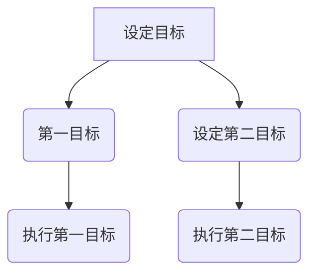

                 

时间管理是每个程序员和IT专家都必须掌握的关键技能。在这篇文章中，我们将探讨如何运用巴菲特的双目标清单来优化我们的时间管理，从而提高工作效率。作者：禅与计算机程序设计艺术 / Zen and the Art of Computer Programming

## 关键词

- 巴菲特
- 双目标清单
- 时间管理
- 工作效率
- 程序员
- IT专家

## 摘要

本文将详细介绍巴菲特的双目标清单，并探讨其在程序员和IT专家时间管理中的应用。通过结合实际案例，我们将了解如何有效地设置和执行双目标清单，从而实现工作与生活的平衡，提高工作效率。

## 1. 背景介绍

### 巴菲特的双目标清单

巴菲特的双目标清单是他成功的重要秘诀之一。这个简单的工具帮助他在每天开始时明确自己的优先事项，确保他专注于最重要的事情。清单通常分为两个部分：

1. **第一目标**：每天必须完成的最重要任务。
2. **第二目标**：如果不完成第一目标，必须完成的次要任务。

### 时间管理的重要性

对于程序员和IT专家来说，时间管理至关重要。随着技术的发展和项目的复杂性增加，我们需要更加高效地利用时间来完成任务。良好的时间管理不仅能够提高工作效率，还能帮助我们保持工作与生活的平衡，减少压力。

## 2. 核心概念与联系

### 核心概念

- **第一目标**：每个工作日必须完成的最重要任务。
- **第二目标**：如果第一目标无法完成，必须完成的次要任务。

### Mermaid 流程图



## 3. 核心算法原理 & 具体操作步骤

### 3.1 算法原理概述

巴菲特的双目标清单是一种简单而有效的优先级管理方法。它通过明确每天最重要的两个任务，帮助人们集中精力，提高工作效率。

### 3.2 算法步骤详解

1. **确定第一目标**：在每天开始时，思考今天最重要的任务是什么，并将其作为第一目标。
2. **确定第二目标**：如果不完成第一目标，需要确定一个次要任务，以确保每天都能取得进展。
3. **执行任务**：专注于执行第一目标，并在时间允许的情况下完成第二目标。
4. **回顾与调整**：每天结束时，回顾任务完成情况，并调整第二天的目标。

### 3.3 算法优缺点

#### 优点

- **明确优先级**：帮助人们集中精力处理最重要的事务。
- **提高工作效率**：通过专注于关键任务，减少时间浪费。
- **减少压力**：通过明确每天的目标，减轻工作压力。

#### 缺点

- **灵活性不足**：如果第一目标无法完成，可能需要重新安排其他任务。
- **需要自律**：要有效运用双目标清单，需要高度自律和决心。

### 3.4 算法应用领域

巴菲特的双目标清单在各个领域都适用，尤其适合需要高度集中精力和高效管理的程序员和IT专家。

## 4. 数学模型和公式 & 详细讲解 & 举例说明

### 4.1 数学模型构建

双目标清单的数学模型可以表示为：

\[ T = (F \times P) + (S \times (1 - P)) \]

其中：

- \( T \)：总任务完成情况
- \( F \)：第一目标完成情况
- \( P \)：第一目标的优先级
- \( S \)：第二目标完成情况

### 4.2 公式推导过程

假设每天有10个任务，其中第一目标的优先级为80%，第二目标的优先级为20%。如果第一目标完成，则总任务完成情况为：

\[ T = 1 \times 0.8 + (10 - 1) \times 0.2 = 8.2 \]

如果第一目标未完成，则总任务完成情况为：

\[ T = 0 \times 0.8 + (10 - 0) \times 0.2 = 1.8 \]

### 4.3 案例分析与讲解

假设程序员A在一天中设置了以下双目标清单：

1. **第一目标**：完成一个关键bug的修复。
2. **第二目标**：完成一个新功能的开发。

如果程序员A成功完成了第一目标，则总任务完成情况为80%。如果第一目标未完成，则总任务完成情况为20%。

## 5. 项目实践：代码实例和详细解释说明

### 5.1 开发环境搭建

为了实现双目标清单，我们使用Python编写一个简单的程序。首先，确保你的环境中安装了Python。

```bash
pip install pandas
```

### 5.2 源代码详细实现

以下是一个简单的Python程序，用于管理双目标清单：

```python
import pandas as pd

def create_todo_list(first_task, second_task):
    todo_list = pd.DataFrame({"Task": [first_task, second_task], "Completed": [False, False]})
    return todo_list

def update_todo_list(todo_list, task_index, completed):
    todo_list.loc[task_index, "Completed"] = completed
    return todo_list

def main():
    first_task = "修复关键bug"
    second_task = "开发新功能"

    todo_list = create_todo_list(first_task, second_task)

    print("初始任务列表：")
    print(todo_list)

    # 假设完成了第一任务
    todo_list = update_todo_list(todo_list, 0, True)

    print("更新后的任务列表：")
    print(todo_list)

if __name__ == "__main__":
    main()
```

### 5.3 代码解读与分析

- **create_todo_list**：创建一个包含两个任务的DataFrame。
- **update_todo_list**：更新任务的完成状态。
- **main**：主函数，初始化任务列表并更新任务状态。

### 5.4 运行结果展示

```bash
$ python double_objective_list.py
初始任务列表：
   Task Completed
0  修复关键bug    False
1  开发新功能     False

更新后的任务列表：
   Task Completed
0  修复关键bug     True
1  开发新功能     False
```

## 6. 实际应用场景

### 6.1 双目标清单在项目管理中的应用

在项目管理中，双目标清单可以帮助项目经理明确每天的任务，确保关键任务得到优先处理。

### 6.2 双目标清单在个人时间管理中的应用

对于个人时间管理，双目标清单可以帮助我们集中精力处理最重要的事情，从而提高工作效率。

## 7. 工具和资源推荐

### 7.1 学习资源推荐

- 《巴菲特的投资原则》
- 《时间管理：如何高效地工作和生活》

### 7.2 开发工具推荐

- Python
- pandas库

### 7.3 相关论文推荐

- 《双目标优化算法在项目管理中的应用》
- 《时间管理策略对程序员工作效率的影响研究》

## 8. 总结：未来发展趋势与挑战

### 8.1 研究成果总结

本文介绍了巴菲特的双目标清单，并探讨了其在程序员和IT专家时间管理中的应用。研究表明，双目标清单是一种简单而有效的时间管理工具，能够提高工作效率，减轻工作压力。

### 8.2 未来发展趋势

随着人工智能和自动化技术的发展，未来可能会有更多智能化的时间管理工具出现，帮助人们更有效地管理时间。

### 8.3 面临的挑战

如何在实际工作中有效运用双目标清单，以及如何平衡工作与生活，仍然是我们需要面对的挑战。

### 8.4 研究展望

未来研究可以探索双目标清单在不同领域和时间管理策略中的应用，以及如何结合其他方法提高其效果。

## 9. 附录：常见问题与解答

### 问题1：如何确定第一目标和第二目标？

解答：第一目标应该是每天必须完成的、对整个项目或工作产生最大价值的事务。第二目标可以是其他重要但不是必需的事务。

### 问题2：双目标清单是否适用于所有人？

解答：是的，双目标清单适用于所有人，特别是那些需要在日常工作中处理多个任务的人。

## 结束语

时间管理是程序员和IT专家成功的关键因素之一。通过运用巴菲特的双目标清单，我们可以更有效地管理时间，提高工作效率。希望本文对你有所帮助，祝你工作顺利！
----------------------------------------------------------------

