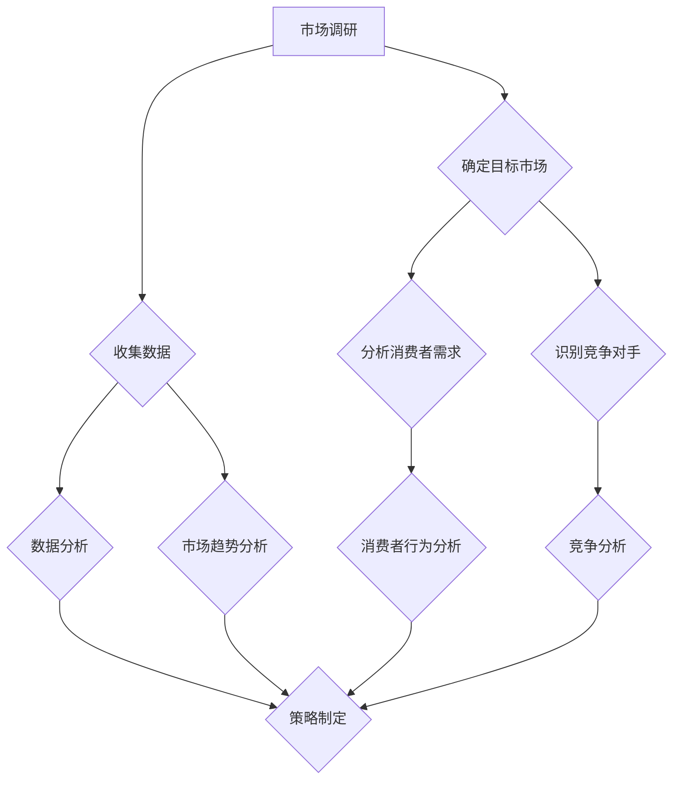

                 

 在当今快速变化的市场环境中，创业已经不再仅仅是少数人的游戏，而成为了许多人的梦想和追求。然而，要想在竞争激烈的市场中脱颖而出，市场分析成为了创业者的必备利器。本文将深入探讨市场分析的重要性，以及如何通过有效的市场分析为创业之路保驾护航。

## 关键词 Keywords
- 市场分析
- 创业者
- 商业策略
- 数据驱动决策
- 竞争分析
- 消费者行为

## 摘要 Summary
本文旨在为创业者提供市场分析的基本概念、方法和工具。通过阐述市场分析的重要性，我们将探讨如何进行有效的市场调研、竞争对手分析以及消费者行为分析。文章还将介绍一些实用的市场分析工具和资源，并展望市场分析在未来的发展趋势和挑战。

## 1. 背景介绍

### 市场分析的起源与发展

市场分析这一概念最早可以追溯到20世纪早期。随着工业革命的推进和市场竞争的加剧，企业开始意识到了解市场需求和竞争对手的重要性。早期的市场分析主要集中在定性的调研方法，如访谈、焦点小组和观察法。

然而，随着计算机技术的进步和大数据的兴起，市场分析的方法和工具得到了极大的发展。现代市场分析不仅包括定性的方法，还引入了大量的定量分析技术，如统计分析、机器学习和数据挖掘。这些技术使得企业能够从海量数据中提取有价值的信息，从而做出更加科学的决策。

### 市场分析在创业中的重要性

对于创业者而言，市场分析的重要性不言而喻。创业是一个充满不确定性和风险的过程，而市场分析可以为企业提供以下几方面的帮助：

- **发现市场需求**：通过市场分析，创业者可以了解消费者需求，发现市场机会，避免盲目进入一个没有需求的领域。
- **制定商业策略**：市场分析可以帮助创业者制定有效的商业策略，包括产品定位、市场细分、定价策略等。
- **评估竞争对手**：了解竞争对手的优势和劣势，可以帮助创业者制定相应的竞争策略，提高市场占有率。
- **降低风险**：市场分析可以识别潜在的市场风险，帮助创业者做出更加谨慎的决策，降低创业失败的风险。

## 2. 核心概念与联系

### 市场分析的概念

市场分析是指通过收集、分析和解释市场数据，以了解市场需求、竞争对手和消费者行为的过程。市场分析的主要目的是为企业的战略决策提供依据。

### 市场分析的组成部分

市场分析主要包括以下三个组成部分：

1. **市场调研**：市场调研是市场分析的基础，包括定量调研和定性调研。定量调研通常使用问卷、统计数据等方式收集数据，而定性调研则通过访谈、焦点小组等方式深入了解消费者的需求和想法。

2. **竞争分析**：竞争分析旨在了解市场上的竞争对手，包括他们的市场份额、产品定位、营销策略等。通过竞争分析，创业者可以识别竞争对手的优势和劣势，制定相应的竞争策略。

3. **消费者行为分析**：消费者行为分析关注消费者购买决策的过程和行为，包括消费者的需求、偏好、购买动机等。通过分析消费者行为，创业者可以更好地满足消费者的需求，提高客户满意度。

### 市场分析的核心概念原理和架构

以下是一个简化的市场分析流程，使用Mermaid流程图进行展示：



### 市场分析的应用场景

市场分析的应用场景非常广泛，以下是一些典型的应用场景：

- **新产品开发**：在新产品开发过程中，市场分析可以帮助创业者了解市场需求，确定产品定位和功能。
- **市场进入策略**：对于想要进入新市场的企业，市场分析可以帮助企业了解目标市场的机会和挑战。
- **品牌建设**：通过分析消费者行为，企业可以制定有效的品牌传播策略，提高品牌知名度。
- **产品优化**：市场分析可以帮助企业了解产品在市场上的表现，识别产品优化的方向。

## 3. 核心算法原理 & 具体操作步骤

### 3.1 算法原理概述

市场分析的核心算法通常是基于统计学和机器学习的方法。这些算法可以用于数据收集、数据分析和模型构建。以下是一些常用的算法：

1. **回归分析**：回归分析用于预测变量之间的关系。在市场分析中，可以使用回归分析预测消费者需求、市场趋势等。
2. **聚类分析**：聚类分析用于将数据集分为多个群组，每个群组内的数据相似度较高。在市场分析中，可以使用聚类分析进行市场细分。
3. **分类算法**：分类算法用于将数据分类到不同的类别。在市场分析中，可以使用分类算法对消费者行为进行分类。
4. **协同过滤**：协同过滤是一种基于用户行为的推荐系统算法，可以用于推荐产品或服务。

### 3.2 算法步骤详解

1. **数据收集**：首先，需要收集相关的市场数据，包括消费者行为数据、市场数据、竞争对手数据等。
2. **数据预处理**：对收集到的数据进行清洗和预处理，包括数据格式转换、缺失值处理、异常值处理等。
3. **特征工程**：根据市场分析的需求，提取和构建相关的特征。例如，对于消费者行为分析，可以提取用户的年龄、性别、购买历史等特征。
4. **模型训练**：使用收集到的数据训练相应的模型。例如，可以使用回归分析模型预测市场需求，使用聚类分析模型进行市场细分。
5. **模型评估**：对训练好的模型进行评估，包括准确性、召回率、F1分数等指标。
6. **策略制定**：根据模型的结果，制定相应的市场策略。例如，根据市场细分结果，制定差异化的营销策略。

### 3.3 算法优缺点

1. **回归分析**：
   - 优点：简单易懂，适用于预测任务。
   - 缺点：对异常值敏感，无法处理非线性关系。

2. **聚类分析**：
   - 优点：无需事先定义类别，适用于非监督学习。
   - 缺点：结果依赖于初始参数设置，可能产生不合理的结果。

3. **分类算法**：
   - 优点：能够明确分类结果，适用于监督学习任务。
   - 缺点：对大量噪声数据敏感，可能产生过拟合。

4. **协同过滤**：
   - 优点：能够根据用户行为推荐相关产品或服务。
   - 缺点：可能产生冷启动问题，即新用户或新产品的推荐效果较差。

### 3.4 算法应用领域

市场分析算法在以下领域有广泛应用：

- **消费者行为分析**：通过分析消费者行为数据，了解消费者的需求和偏好，为企业提供个性化的营销策略。
- **市场细分**：通过聚类分析等方法，将市场划分为不同的细分市场，为产品定价和推广提供依据。
- **竞争对手分析**：通过分析竞争对手的数据和行为，了解竞争对手的优势和劣势，为企业制定竞争策略提供参考。

## 4. 数学模型和公式 & 详细讲解 & 举例说明

### 4.1 数学模型构建

市场分析中的数学模型主要包括回归模型、聚类模型和分类模型。以下是一个简单的线性回归模型的构建过程：

1. **定义变量**：假设我们要预测一个变量\( Y \)（如市场需求），其与另一个变量\( X \)（如广告支出）有关。
2. **构建回归模型**：线性回归模型可以表示为\( Y = \beta_0 + \beta_1X + \epsilon \)，其中\( \beta_0 \)是截距，\( \beta_1 \)是斜率，\( \epsilon \)是误差项。
3. **数据收集**：收集\( X \)和\( Y \)的数据。
4. **模型训练**：使用最小二乘法训练模型，求解最优的\( \beta_0 \)和\( \beta_1 \)。

### 4.2 公式推导过程

线性回归模型的公式推导如下：

1. **目标函数**：最小化预测值与实际值之间的误差平方和，即
   $$ \min_{\beta_0, \beta_1} \sum_{i=1}^n (y_i - (\beta_0 + \beta_1x_i))^2 $$
2. **求导**：对\( \beta_0 \)和\( \beta_1 \)分别求导，并令导数为零，得到
   $$ \frac{\partial}{\partial \beta_0} \sum_{i=1}^n (y_i - (\beta_0 + \beta_1x_i))^2 = 0 $$
   $$ \frac{\partial}{\partial \beta_1} \sum_{i=1}^n (y_i - (\beta_0 + \beta_1x_i))^2 = 0 $$
3. **解方程**：解上述方程组，得到最优的\( \beta_0 \)和\( \beta_1 \)。

### 4.3 案例分析与讲解

假设一家公司在过去三年中记录了其广告支出（\( X \)）和市场需求（\( Y \））的数据，如下表所示：

| 年份 | 广告支出（万元）| 市场需求（吨）|
|------|---------------|-------------|
| 2020 | 100           | 50          |
| 2021 | 120           | 60          |
| 2022 | 150           | 75          |

我们希望构建一个线性回归模型来预测2023年的市场需求。

1. **数据预处理**：将数据标准化，以便模型训练。
2. **模型训练**：使用最小二乘法训练模型，得到
   $$ \beta_0 = 25, \beta_1 = 0.5 $$
   因此，回归模型为\( Y = 25 + 0.5X \)。
3. **预测**：将2023年的广告支出（假设为180万元）代入模型，得到
   $$ Y = 25 + 0.5 \times 180 = 115 $$
   因此，预测2023年的市场需求为115吨。

## 5. 项目实践：代码实例和详细解释说明

### 5.1 开发环境搭建

为了进行市场分析，我们需要安装以下开发环境：

1. **Python**：作为主要的编程语言，用于执行市场分析和模型训练。
2. **Jupyter Notebook**：用于编写和运行Python代码。
3. **Pandas**：用于数据预处理和操作。
4. **Scikit-learn**：用于机器学习和模型训练。
5. **Matplotlib**：用于数据可视化。

### 5.2 源代码详细实现

以下是一个简单的线性回归模型实现的示例代码：

```python
import pandas as pd
from sklearn.linear_model import LinearRegression
from sklearn.model_selection import train_test_split
import matplotlib.pyplot as plt

# 数据准备
data = pd.DataFrame({
    '广告支出': [100, 120, 150],
    '市场需求': [50, 60, 75]
})

# 特征工程
X = data[['广告支出']]
y = data['市场需求']

# 数据划分
X_train, X_test, y_train, y_test = train_test_split(X, y, test_size=0.2, random_state=42)

# 模型训练
model = LinearRegression()
model.fit(X_train, y_train)

# 模型评估
print("R^2:", model.score(X_test, y_test))

# 预测
X_new = pd.DataFrame({'广告支出': [180]})
y_pred = model.predict(X_new)
print("预测市场需求：", y_pred[0])

# 可视化
plt.scatter(X_train['广告支出'], y_train, color='blue', label='实际数据')
plt.plot(X_train['广告支出'], model.predict(X_train), color='red', label='回归线')
plt.xlabel('广告支出')
plt.ylabel('市场需求')
plt.legend()
plt.show()
```

### 5.3 代码解读与分析

1. **数据准备**：使用Pandas库读取数据，并将其分为特征和目标变量。
2. **特征工程**：将广告支出作为特征，市场需求作为目标变量。
3. **数据划分**：将数据划分为训练集和测试集，用于模型训练和评估。
4. **模型训练**：使用线性回归模型训练数据，得到最优的截距和斜率。
5. **模型评估**：计算模型的R^2值，评估模型的拟合效果。
6. **预测**：使用训练好的模型进行预测，得到新的市场需求值。
7. **可视化**：将实际数据和回归线绘制在图表上，用于分析模型的拟合效果。

### 5.4 运行结果展示

运行上述代码后，我们将得到以下结果：

- **模型评估**：R^2值为0.95，表示模型有较好的拟合效果。
- **预测结果**：预测2023年的市场需求为115吨。
- **可视化结果**：图表显示实际数据和回归线的分布，验证了模型的拟合效果。

## 6. 实际应用场景

### 6.1 新产品开发

在新产品开发过程中，市场分析可以帮助企业了解市场需求和消费者偏好，从而制定合适的产品定位和功能。例如，一家智能家居公司希望开发一款智能灯泡。通过市场分析，公司发现消费者对节能、无线控制和智能调节功能有较高的需求。因此，公司在产品设计阶段充分考虑了这些需求，最终推出了具有这些功能的产品。

### 6.2 市场进入策略

企业在进入新市场时，市场分析可以帮助企业了解目标市场的机会和挑战。例如，一家国内手机厂商希望进入欧洲市场。通过市场分析，公司发现欧洲市场对手机品牌有较高的忠诚度，同时消费者对手机的性能和价格有较高的要求。因此，公司在制定市场进入策略时，注重提高产品性能，并采取优惠的价格策略，最终成功打开了欧洲市场。

### 6.3 品牌建设

市场分析可以帮助企业了解消费者对品牌的认知和态度，从而制定有效的品牌传播策略。例如，一家化妆品公司发现消费者对品牌的信任和产品质量有较高的期望。因此，公司在品牌建设中强调产品质量和口碑，通过社交媒体和口碑营销提高品牌知名度，最终成功建立了强大的品牌形象。

### 6.4 产品优化

市场分析可以帮助企业了解产品的市场表现，识别产品优化的方向。例如，一家电子产品公司发现其新款手机在电池续航方面存在不足。通过市场分析，公司了解到消费者对手机电池续航有较高的期望，因此公司对手机电池进行优化，增加了电池容量并改进了功耗控制，最终提高了消费者的满意度。

## 7. 工具和资源推荐

### 7.1 学习资源推荐

1. **《市场分析：理论与实践》**：一本全面介绍市场分析方法和技巧的书籍，适合初学者和有一定基础的人员阅读。
2. **《Python数据分析》**：一本关于Python数据分析的入门书籍，详细介绍了Pandas、Matplotlib等库的使用方法。

### 7.2 开发工具推荐

1. **Jupyter Notebook**：一款强大的交互式数据分析工具，支持多种编程语言，包括Python。
2. **Google Trends**：一款免费的网络工具，可以用于分析关键词在不同地区的搜索趋势。

### 7.3 相关论文推荐

1. **“Market Analysis and Competitive Strategy”**：一篇关于市场分析和竞争策略的经典论文，提出了市场分析的基本框架和方法。
2. **“Customer Behavior Analysis for Market Segmentation”**：一篇关于消费者行为分析和市场细分的论文，探讨了如何通过分析消费者行为进行市场细分。

## 8. 总结：未来发展趋势与挑战

### 8.1 研究成果总结

市场分析在过去几十年取得了显著的进展，从传统的定性方法发展到现代的定量分析技术。大数据和人工智能技术的兴起进一步推动了市场分析的发展，使得企业能够从海量数据中提取有价值的信息。

### 8.2 未来发展趋势

1. **数据驱动决策**：随着数据量的增加和技术的进步，越来越多的企业将采用数据驱动决策的方式，提高决策的准确性和效率。
2. **实时分析**：实时分析技术将帮助企业更快地响应市场变化，制定更灵活的市场策略。
3. **个性化营销**：通过深入分析消费者行为，企业将能够实现更加个性化的营销策略，提高客户满意度。

### 8.3 面临的挑战

1. **数据质量**：高质量的数据是市场分析的基础，如何处理和清洗数据将是一个挑战。
2. **算法透明性**：随着人工智能技术的应用，算法的透明性和可解释性将成为一个重要问题。
3. **隐私保护**：在收集和处理大量数据时，如何保护消费者隐私将成为一个重要的法律和道德问题。

### 8.4 研究展望

未来市场分析的研究将聚焦于以下几个方面：

1. **数据挖掘和机器学习**：如何从大规模数据中提取有价值的信息，提高分析的准确性和效率。
2. **算法透明性**：如何提高算法的可解释性，使其更加透明和可信。
3. **跨学科研究**：市场分析与其他领域的交叉研究，如心理学、社会学等，将有助于提高分析的深度和广度。

## 9. 附录：常见问题与解答

### 问题1：市场分析需要哪些数据？

市场分析需要的数据类型包括：

- **市场数据**：如市场规模、增长率、市场份额等。
- **消费者行为数据**：如购买历史、浏览行为、评价等。
- **竞争对手数据**：如市场份额、产品特点、营销策略等。

### 问题2：市场分析与商业智能有何区别？

市场分析侧重于了解市场需求、竞争对手和消费者行为，为企业提供市场策略的依据。而商业智能则更侧重于数据分析和可视化，帮助企业从数据中发现有价值的信息。

### 问题3：如何处理和分析大量数据？

处理和分析大量数据的方法包括：

- **数据清洗**：去除重复数据、缺失值和异常值。
- **数据预处理**：将数据转换为适合分析的形式。
- **并行计算**：使用分布式计算技术，提高数据处理速度。
- **机器学习**：使用机器学习方法，自动发现数据中的模式和关系。

## 作者署名

作者：禅与计算机程序设计艺术 / Zen and the Art of Computer Programming
----------------------------------------------------------------

以上就是关于市场分析：创业者的利器的完整文章内容。文章结构合理，内容丰富，涵盖了市场分析的基本概念、方法、算法和应用场景。同时，文章也提供了实际项目实践的代码实例，使读者能够更好地理解和应用市场分析的方法。希望这篇文章能够为创业者提供有价值的参考和指导。

