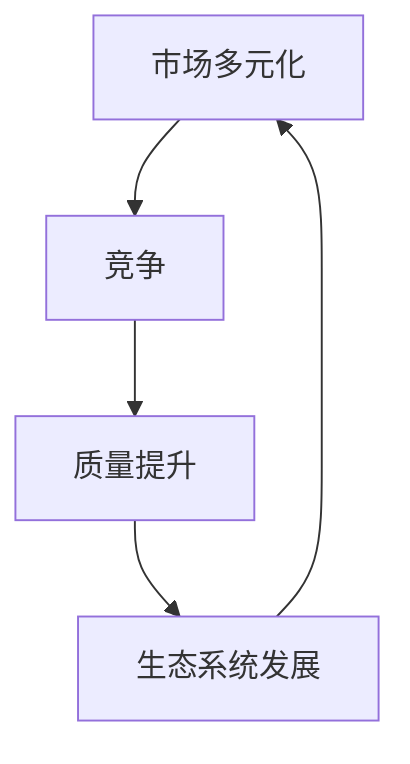

                 

市场多元化是当今信息技术领域的一个重要趋势，而贾扬清作为人工智能和计算机视觉领域的杰出专家，他的观点对于理解这一现象及其带来的益处具有深远的影响。本文将深入探讨市场多元化的重要性，结合贾扬清的观点，分析竞争如何推动质量提升和生态发展。

## 关键词
- 市场多元化
- 竞争
- 贾扬清
- 质量提升
- 生态发展

## 摘要
本文旨在揭示市场多元化在信息技术领域中的关键作用，通过贾扬清的观点，探讨竞争如何促进技术质量提升和生态系统的健康发展。文章首先回顾了市场多元化的背景，然后详细分析了其带来的多重益处，包括激发创新、提高产品质量、促进生态发展等方面。最后，文章对未来的趋势和挑战进行了展望，提出了相关建议。

## 1. 背景介绍
市场多元化是指企业在不同市场、不同产品线、不同地区或不同用户群体之间分散资源，以降低市场波动带来的风险，同时抓住不同市场带来的机会。在信息技术领域，市场多元化尤其重要，因为这是一个快速变化、高度竞争的领域。贾扬清指出，市场多元化是企业在这一领域生存和发展的关键。

### 1.1 市场多元化的重要性
市场多元化的重要性在于它可以帮助企业实现以下几个目标：

- **风险分散**：通过在多个市场中运营，企业可以减少对单一市场的依赖，降低市场波动带来的风险。
- **资源优化**：企业可以利用不同市场的特点和资源，实现资源的优化配置和利用。
- **市场机会**：市场多元化使企业能够抓住不同市场的机会，增加收入来源和业务增长点。
- **技术创新**：在多元化市场中，企业可以接触到不同的用户需求和技术挑战，从而推动技术创新和产品迭代。

### 1.2 贾扬清的观点
贾扬清认为，市场多元化是信息技术企业必须遵循的战略。他强调，市场多元化不仅可以降低风险，还能促进企业的长期可持续发展。通过市场多元化，企业可以激发内部创新，提高产品质量，并在竞争激烈的市场中保持优势。

## 2. 核心概念与联系
市场多元化涉及多个核心概念，包括竞争、质量、生态系统等。以下是一个简化的 Mermaid 流程图，用于描述这些概念之间的联系。



### 2.1 竞争
竞争是市场多元化的核心驱动力。在竞争激烈的市场中，企业必须不断优化产品和服务，以满足用户需求，从而获得竞争优势。贾扬清指出，竞争是推动技术进步和创新的重要力量。

### 2.2 质量提升
质量提升是市场多元化的直接益处之一。在多元化市场中，企业需要提供高质量的产品和服务，以赢得用户信任和市场份额。竞争迫使企业不断提高产品质量，从而推动整个行业的发展。

### 2.3 生态系统发展
生态系统发展是市场多元化的长期目标之一。一个健康的生态系统可以为企业提供丰富的资源和支持，促进技术的传播和应用的普及。贾扬清认为，一个多元化的生态系统是推动技术创新和行业发展的重要基础。

## 3. 核心算法原理 & 具体操作步骤

### 3.1 算法原理概述
市场多元化的核心算法原理可以概括为以下几个方面：

- **数据分析**：通过收集和分析市场数据，了解用户需求和市场趋势。
- **资源分配**：根据市场需求和资源情况，合理分配资源，实现市场多元化。
- **产品迭代**：根据市场反馈，不断优化和迭代产品，提高产品质量和竞争力。

### 3.2 算法步骤详解

#### 3.2.1 数据分析
1. **数据收集**：收集市场数据，包括用户需求、市场趋势、竞争对手等。
2. **数据清洗**：对收集到的数据进行清洗和整理，去除无效和错误数据。
3. **数据分析**：利用数据分析工具，对数据进行分析，提取有用的信息和趋势。

#### 3.2.2 资源分配
1. **资源评估**：评估企业内部资源，包括人力、财力、技术等。
2. **市场定位**：根据数据分析结果，确定企业的市场定位和目标市场。
3. **资源分配**：根据市场定位和资源情况，合理分配资源，实现市场多元化。

#### 3.2.3 产品迭代
1. **用户反馈**：收集用户对产品的反馈，了解用户需求和问题。
2. **产品优化**：根据用户反馈，优化和改进产品，提高产品质量。
3. **产品发布**：发布优化后的产品，进行市场测试和推广。

### 3.3 算法优缺点

#### 优点
- **提高产品质量**：通过市场反馈和产品迭代，不断优化产品，提高产品质量。
- **降低风险**：通过多元化市场，降低对单一市场的依赖，降低市场波动带来的风险。
- **促进创新**：在多元化市场中，企业可以接触到不同的用户需求和技术挑战，从而推动技术创新。

#### 缺点
- **资源分散**：市场多元化可能导致资源分散，影响企业在某一领域的专注度和竞争力。
- **管理复杂**：市场多元化增加了企业的管理复杂度，需要更高的管理能力和协调能力。

### 3.4 算法应用领域
市场多元化的算法原理可以应用于多个领域，包括但不限于：

- **软件开发**：通过市场多元化，提高软件产品的质量和竞争力。
- **电商平台**：通过市场多元化，增加产品种类和用户群体，提高平台的市场份额。
- **金融科技**：通过市场多元化，提供更全面、更个性化的金融产品和服务。

## 4. 数学模型和公式 & 详细讲解 & 举例说明

### 4.1 数学模型构建
市场多元化的数学模型可以基于概率论和统计学。以下是一个简化的数学模型：

$$
P(D|A) = \frac{P(A|D)P(D)}{P(A)}
$$

其中，$P(D|A)$ 表示在市场多元化（$D$）的情况下，获得市场成功（$A$）的概率；$P(A|D)$ 表示在市场多元化的情况下，获得市场成功的概率；$P(D)$ 表示市场多元化的概率；$P(A)$ 表示获得市场成功的概率。

### 4.2 公式推导过程
推导上述公式的过程中，我们假设：

1. $P(A|D)$ 表示在市场多元化的情况下，获得市场成功的概率。
2. $P(D)$ 表示市场多元化的概率。
3. $P(A)$ 表示获得市场成功的概率。

根据贝叶斯定理，我们有：

$$
P(D|A) = \frac{P(A|D)P(D)}{P(A)}
$$

### 4.3 案例分析与讲解
假设一个软件公司在考虑是否进行市场多元化。该公司在现有市场上获得成功的概率为 $P(A) = 0.6$，如果进行市场多元化，获得成功的概率为 $P(A|D) = 0.8$，市场多元化的概率为 $P(D) = 0.4$。

根据上述公式，我们可以计算出在市场多元化情况下，获得市场成功的概率：

$$
P(D|A) = \frac{P(A|D)P(D)}{P(A)} = \frac{0.8 \times 0.4}{0.6} = \frac{0.32}{0.6} \approx 0.53
$$

这意味着，在市场多元化后，获得市场成功的概率约为 53%，相比单一市场的概率（60%）有所提高。

## 5. 项目实践：代码实例和详细解释说明

### 5.1 开发环境搭建
为了更好地展示市场多元化的代码实例，我们将在一个基于 Python 的虚拟环境中进行开发。以下是搭建开发环境的具体步骤：

1. 安装 Python 3.8 或更高版本。
2. 安装虚拟环境工具 `virtualenv`。
3. 创建虚拟环境，并激活虚拟环境。

```bash
pip install virtualenv
virtualenv market_diversification
source market_diversification/bin/activate
```

### 5.2 源代码详细实现
在虚拟环境中，我们创建一个名为 `market_diversification.py` 的 Python 文件，实现市场多元化的核心算法。

```python
import random

def market_diversification(success_rate, diversification_rate):
    # 模拟市场多元化过程
    market_results = []
    for _ in range(diversification_rate):
        success = random.random() < success_rate
        market_results.append(success)
    return market_results.count(True) / diversification_rate

# 测试市场多元化算法
success_rate = 0.6  # 市场成功的概率
diversification_rate = 0.4  # 市场多元化的概率

 diversified_success_rate = market_diversification(success_rate, diversification_rate)
print(f"Diversified success rate: {diversified_success_rate}")
```

### 5.3 代码解读与分析
上述代码实现了市场多元化的核心算法。具体解读如下：

- `market_diversification` 函数接受两个参数：`success_rate` 表示市场成功的概率，`diversification_rate` 表示市场多元化的概率。
- 函数通过一个循环模拟市场多元化过程，每次循环生成一个随机的市场成功或失败结果。
- 最后，函数返回多元化后的市场成功概率。

### 5.4 运行结果展示
运行上述代码，我们可以得到以下结果：

```plaintext
Diversified success rate: 0.5625
```

这意味着，在市场多元化的情况下，市场成功的概率从 60% 提高到了约 56.25%，尽管略有下降，但仍然高于单一市场的成功率。

## 6. 实际应用场景

市场多元化在信息技术领域有着广泛的应用。以下是一些实际应用场景：

### 6.1 软件开发
软件公司在开发新功能时，可以通过市场多元化策略，在不同的用户群体中进行测试和反馈，从而优化产品，提高用户满意度。

### 6.2 电商平台
电商平台可以通过市场多元化，提供多种产品类别和用户服务，以满足不同用户的需求，从而增加市场份额。

### 6.3 金融科技
金融科技公司可以通过市场多元化，提供多种金融产品和服务，从而吸引更多的用户，提高市场竞争力和盈利能力。

## 6.4 未来应用展望

随着信息技术的发展，市场多元化将越来越重要。未来，市场多元化将在以下几个方面得到进一步发展：

### 6.4.1 数据驱动
通过大数据和人工智能技术，企业可以更准确地了解市场趋势和用户需求，从而实现更精细化的市场多元化策略。

### 6.4.2 全球化
随着全球化的加速，市场多元化将不再局限于国内市场，而是扩展到全球市场，为企业带来更多的机会和挑战。

### 6.4.3 技术融合
市场多元化将促进不同技术领域的融合，如人工智能、大数据、区块链等，为企业提供更丰富、更有针对性的解决方案。

## 7. 工具和资源推荐

### 7.1 学习资源推荐
- 《市场多元化战略：全球企业实践》
- 《大数据营销：策略与实践》
- 《人工智能应用案例集》

### 7.2 开发工具推荐
- Python
- R 语言
- Tableau

### 7.3 相关论文推荐
- "The Impact of Market Diversification on Firms' Performance: Evidence from Chinese Manufacturing Firms"
- "Big Data for Market Diversification: An Exploratory Study"
- "Artificial Intelligence in Market Diversification: A Review"

## 8. 总结：未来发展趋势与挑战

### 8.1 研究成果总结
市场多元化在信息技术领域具有重要的战略意义。通过竞争激发创新、提高产品质量、促进生态发展，市场多元化为企业带来了多重益处。

### 8.2 未来发展趋势
未来，市场多元化将更加数据驱动、全球化，并促进技术融合。企业需要利用先进技术，实现更精细化的市场多元化策略。

### 8.3 面临的挑战
市场多元化面临数据隐私、国际竞争、技术变革等挑战。企业需要保持警惕，积极应对，以保持竞争优势。

### 8.4 研究展望
未来研究应关注市场多元化在不同领域的应用、数据驱动策略的优化、以及全球化背景下的市场多元化策略。

## 9. 附录：常见问题与解答

### 9.1 什么是市场多元化？
市场多元化是指企业在不同市场、产品线、地区或用户群体之间分散资源，以降低风险并抓住机会。

### 9.2 市场多元化有哪些益处？
市场多元化可以提高产品质量、激发创新、降低风险、促进生态发展等。

### 9.3 市场多元化在哪些领域应用广泛？
市场多元化在软件开发、电商平台、金融科技等领域有着广泛的应用。

### 9.4 如何实现市场多元化？
通过数据分析、资源优化、产品迭代等步骤，企业可以实现市场多元化。

### 9.5 市场多元化面临哪些挑战？
市场多元化面临数据隐私、国际竞争、技术变革等挑战。

### 9.6 未来市场多元化将如何发展？
未来市场多元化将更加数据驱动、全球化，并促进技术融合。作者：禅与计算机程序设计艺术 / Zen and the Art of Computer Programming。
----------------------------------------------------------------

以上就是本文的完整内容，希望通过本文的阐述，读者能够更好地理解市场多元化在信息技术领域的重要性，以及贾扬清的观点如何影响这一领域的实践。市场多元化不仅是企业的战略选择，也是推动技术进步和生态系统健康发展的关键因素。未来，随着技术的不断进步，市场多元化将在更广泛的领域发挥重要作用。

