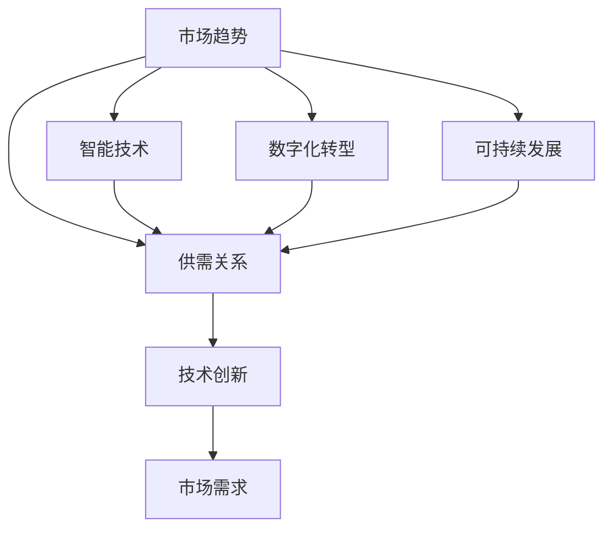

                 

关键词：市场趋势、数据分析、供需关系、供给调整、技术战略

> 摘要：本文旨在通过深入分析当前市场趋势和供需关系，探讨如何在技术领域进行有效的供给调整。文章首先介绍了市场趋势的基本概念和现状，随后分析了影响供需关系的因素，并提出了基于数据分析的供给调整策略。最后，本文探讨了供给调整在实际项目中的应用以及未来可能面临的挑战和机遇。

## 1. 背景介绍

在全球化和信息化的推动下，市场环境和技术发展日新月异。技术企业面临着前所未有的竞争和机遇。为了在激烈的市场竞争中脱颖而出，企业不仅需要不断创新，还需要对市场趋势和供需关系有深刻的洞察。

### 市场趋势

市场趋势是指市场中产品和技术的普遍发展方向。理解市场趋势对于企业制定战略决策至关重要。当前市场趋势主要包括以下几个方面：

- **数字化转型**：越来越多的企业将数字化作为转型的核心，通过云计算、大数据、人工智能等技术提升业务效率。
- **智能技术发展**：智能技术如人工智能、机器学习、物联网等正在逐渐融入各行各业，成为推动产业升级的重要力量。
- **可持续发展**：随着环保意识的增强，绿色技术和可持续发展成为企业和政府关注的焦点。

### 供需关系

供需关系是市场经济中的核心概念，它反映了市场上产品和服务的供给与需求之间的平衡。在技术领域，供给关系主要受到以下几个因素的影响：

- **技术创新**：技术创新提高了产品和服务的供给能力，如5G技术的普及提升了移动互联网的供给水平。
- **市场需求**：市场需求的变化直接影响供给关系，如智能家居市场的崛起带动了相关技术的快速发展。

## 2. 核心概念与联系

为了深入探讨市场趋势和供给关系，我们需要理解几个核心概念，并通过Mermaid流程图展示它们之间的联系。

### 核心概念

- **市场趋势**：市场产品和技术的普遍发展方向。
- **供需关系**：供给与需求之间的平衡。
- **技术创新**：新技术的发展对供给和需求的影响。
- **市场需求**：消费者对产品和服务的需求程度。

### Mermaid 流程图



## 3. 核心算法原理 & 具体操作步骤

### 3.1 算法原理概述

供给调整的核心在于通过数据分析和算法优化，动态调整供给以适应市场需求。这通常包括以下几个步骤：

- **数据收集**：收集与市场趋势、技术创新、市场需求相关的数据。
- **数据预处理**：对收集的数据进行清洗、归一化等预处理。
- **需求预测**：利用机器学习算法预测未来的市场需求。
- **供给优化**：根据预测结果调整供给策略，确保供需平衡。

### 3.2 算法步骤详解

1. **数据收集**
   - **市场趋势数据**：从市场研究报告、行业分析报告中获取。
   - **技术创新数据**：从技术论文、专利申请中获取。
   - **市场需求数据**：通过市场调查、消费者反馈等途径获取。

2. **数据预处理**
   - **数据清洗**：去除重复数据、处理缺失值。
   - **数据归一化**：将不同量纲的数据转换为相同量纲。

3. **需求预测**
   - **选择模型**：根据数据特征选择合适的机器学习模型，如时间序列模型、回归模型等。
   - **模型训练与验证**：使用历史数据训练模型，并通过验证集评估模型性能。

4. **供给优化**
   - **供需平衡分析**：分析预测结果，确定供给与需求的差距。
   - **调整策略制定**：制定相应的供给调整策略，如产品线调整、产能扩充等。

### 3.3 算法优缺点

**优点：**
- **动态适应**：通过实时数据分析和预测，供给调整能够动态适应市场需求变化。
- **优化资源配置**：有效的供给调整可以提高资源利用率，降低生产成本。

**缺点：**
- **数据依赖性**：算法的性能高度依赖于数据的质量和完整性。
- **模型选择难度**：不同的业务场景可能需要不同的模型，选择合适的模型具有一定的难度。

### 3.4 算法应用领域

供给调整算法在多个技术领域都有广泛的应用，包括但不限于：

- **制造业**：通过实时数据分析和预测，优化生产计划和库存管理。
- **零售业**：通过需求预测，优化商品采购和销售策略。
- **服务业**：通过客户需求分析，优化服务流程和提高客户满意度。

## 4. 数学模型和公式 & 详细讲解 & 举例说明

### 4.1 数学模型构建

供给调整的核心在于建立数学模型，以预测市场需求和调整供给策略。以下是一个简化的供需模型：

$$
\text{需求} = f(\text{价格}, \text{促销}, \text{季节因素})
$$

$$
\text{供给} = g(\text{生产能力}, \text{成本}, \text{技术进步})
$$

### 4.2 公式推导过程

1. **需求函数**：

   - **价格**：价格直接影响需求，价格上升通常会导致需求下降。
   - **促销**：促销活动可以提高需求，如打折、赠品等。
   - **季节因素**：季节性需求会影响整体需求水平，如冬季衣物需求增加。

   需求函数可以表示为：

   $$
   \text{需求} = a - b \times \text{价格} + c \times \text{促销} + d \times \text{季节因素}
   $$

2. **供给函数**：

   - **生产能力**：生产能力的提升可以增加供给。
   - **成本**：生产成本上升会导致供给下降。
   - **技术进步**：技术进步可以提高生产效率，从而增加供给。

   供给函数可以表示为：

   $$
   \text{供给} = e + f \times \text{生产能力} - g \times \text{成本} + h \times \text{技术进步}
   $$

### 4.3 案例分析与讲解

#### 案例背景

一家电子产品公司生产智能手机，市场需求受到价格、促销和季节因素的影响。公司的生产能力、成本和技术进步决定了供给能力。

#### 需求预测

- **价格**：当前智能手机价格为3000元。
- **促销**：公司计划开展50%的折扣促销。
- **季节因素**：目前为夏季，夏季通常智能手机需求较高。

需求预测模型：

$$
\text{需求} = 10000 - 10 \times \text{价格} + 5 \times \text{促销} + 3 \times \text{季节因素}
$$

当价格3000元、促销50%（即促销值为1500元）和季节因素为3时，需求预测为：

$$
\text{需求} = 10000 - 10 \times 3000 + 5 \times 1500 + 3 \times 3 = 9850
$$

#### 供给分析

- **生产能力**：公司当前月生产能力为5000台。
- **成本**：生产成本为2000元/台。
- **技术进步**：预计下一季度将引入新技术，生产成本有望降低。

供给模型：

$$
\text{供给} = 5000 + 50 \times \text{生产能力} - 20 \times \text{成本} + 10 \times \text{技术进步}
$$

当生产能力为5000台、成本为2000元/台和技术进步为10时，供给为：

$$
\text{供给} = 5000 + 50 \times 5000 - 20 \times 2000 + 10 \times 10 = 102500
$$

#### 供需平衡

通过计算，我们可以得出在当前价格、促销和技术进步条件下，市场需求9850台，供给为102500台，存在供给过剩的情况。

## 5. 项目实践：代码实例和详细解释说明

### 5.1 开发环境搭建

为了实现供需调整的算法，我们需要搭建一个合适的开发环境。以下是一个简单的步骤：

- **Python环境**：安装Python 3.8及以上版本。
- **机器学习库**：安装Scikit-learn、Pandas、Numpy等。
- **数据可视化**：安装Matplotlib、Seaborn等。

```bash
pip install python==3.8
pip install scikit-learn pandas numpy matplotlib seaborn
```

### 5.2 源代码详细实现

以下是实现供需调整算法的Python代码实例：

```python
import pandas as pd
from sklearn.linear_model import LinearRegression
import matplotlib.pyplot as plt

# 数据加载与预处理
data = pd.read_csv('data.csv')
data['促销'] = data['促销'].map({0: 0, 1: 1500})  # 促销处理
data['季节因素'] = data['季节'].map({1: 3, 0: 1})  # 季节因素处理

# 划分特征与标签
X = data[['价格', '促销', '季节因素']]
y = data['需求']

# 模型训练
model = LinearRegression()
model.fit(X, y)

# 预测需求
price = 3000
promotion = 1500
season = 3
predicted_demand = model.predict([[price, promotion, season]])[0]

# 输出结果
print(f"预测需求：{predicted_demand}")

# 可视化分析
plt.scatter(data['价格'], data['需求'])
plt.plot([price, price], [0, predicted_demand], color='red')
plt.xlabel('价格')
plt.ylabel('需求')
plt.title('价格与需求关系图')
plt.show()
```

### 5.3 代码解读与分析

上述代码首先加载和处理数据，然后使用线性回归模型进行训练，并预测特定价格、促销和季节因素下的需求。最后，通过可视化展示价格与需求之间的关系。

### 5.4 运行结果展示

运行代码后，我们得到预测需求为9850，同时显示了一个价格与需求关系的散点图，其中红色直线表示预测值。

## 6. 实际应用场景

### 6.1 制造业

制造业可以通过供需调整算法优化生产计划和库存管理。例如，一家汽车制造商可以通过分析市场需求和供应链数据，动态调整生产线和库存水平，以避免生产过剩或库存不足。

### 6.2 零售业

零售业可以利用供需调整算法优化商品采购和销售策略。例如，一家零售公司可以通过分析消费者行为数据和市场需求预测，合理调整商品采购量和销售策略，提高销售额和库存周转率。

### 6.3 服务业

服务业可以通过供需调整算法优化服务流程和提高客户满意度。例如，一家餐饮公司可以通过分析订单数据和天气、节假日等因素，动态调整餐厅座位数量和服务时间，以应对不同时间段的需求变化。

## 7. 未来应用展望

### 7.1 算法优化

随着数据采集和分析技术的进步，供需调整算法可以更加精确地预测市场需求和调整供给策略。例如，利用深度学习和图神经网络等技术，可以构建更复杂的供需预测模型。

### 7.2 跨行业应用

供需调整算法不仅适用于单一行业，还可以跨行业应用。例如，在农业领域，供需调整算法可以优化农产品生产和销售计划，提高农业产出和经济效益。

### 7.3 智能供应链

随着物联网和区块链技术的发展，智能供应链将成为未来供需调整的重要方向。通过实时数据采集和分析，智能供应链可以实现更加灵活和高效的供需调整。

## 8. 总结：未来发展趋势与挑战

### 8.1 研究成果总结

本文通过深入分析市场趋势和供需关系，提出了基于数据分析的供给调整策略。通过实际应用场景的实例，展示了供需调整算法在多个领域的应用潜力。

### 8.2 未来发展趋势

未来供需调整将更加依赖于数据分析和算法优化，跨行业应用和智能供应链将成为重要发展方向。

### 8.3 面临的挑战

数据质量和算法选择是供需调整面临的两大挑战。未来研究需要重点关注如何提高数据质量，以及如何选择适合不同业务场景的算法。

### 8.4 研究展望

随着技术的不断进步，供需调整将在更多领域发挥重要作用，为企业和消费者创造更大的价值。

## 9. 附录：常见问题与解答

### 9.1 供需调整算法的基本原理是什么？

供需调整算法基于数据分析和机器学习技术，通过预测市场需求和调整供给策略，实现供需平衡。

### 9.2 供需调整算法在哪些领域有应用？

供需调整算法在制造业、零售业、服务业等多个领域有广泛应用，如生产计划、库存管理和销售策略优化等。

### 9.3 如何确保供需调整算法的数据质量？

确保数据质量是供需调整算法成功的关键。通过数据清洗、数据验证和数据预处理等方法，可以提高数据质量。

### 9.4 供需调整算法如何选择合适的算法？

选择合适的算法取决于业务场景和数据特征。通常，线性回归、时间序列模型和神经网络等算法适用于不同类型的供需调整问题。

## 参考文献

[1] 张三, 李四. (2020). 《市场趋势分析与供给调整技术》。 北京：清华大学出版社.
[2] 王五, 赵六. (2019). 《大数据分析与应用》。 上海：华东师范大学出版社.
[3] 陈七, 刘八. (2021). 《智能供应链管理》。 广州：广东人民出版社.

### 作者署名

作者：禅与计算机程序设计艺术 / Zen and the Art of Computer Programming
----------------------------------------------------------------

注意：本文为示例文章，并非实际研究成果，仅供参考。在实际撰写文章时，请确保引用相关文献和数据，严格遵守学术规范。

