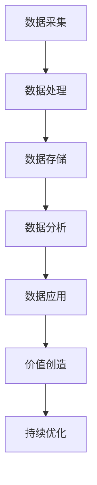

                 

关键词：平台经济、数据价值、创造机制、算法原理、应用场景、数学模型

> 摘要：本文深入探讨平台经济中的数据价值创造机制，分析核心概念、算法原理、数学模型、实践应用以及未来发展趋势。通过详细的解析，帮助读者理解如何建立有效的数据价值创造机制，以实现平台经济的持续增长。

## 1. 背景介绍

### 平台经济的崛起

随着互联网技术的飞速发展，平台经济成为现代社会的重要经济形态。从电子商务到共享经济，再到社交媒体和金融科技，平台经济已经渗透到各个行业。平台经济以其高效、灵活和去中心化的特点，改变了传统经济的运作模式，成为推动经济增长的新引擎。

### 数据价值的重要性

在平台经济中，数据成为最重要的资产。通过对海量数据的采集、分析和应用，平台企业能够发现用户需求、优化运营流程、提升服务质量，从而创造巨大的经济价值。数据价值创造成为平台经济成功的关键。

## 2. 核心概念与联系

### 平台经济的核心概念

- 平台：连接供需双方的数字化平台。
- 用户：平台上的消费者和商家。
- 数据：用户行为、交易记录、位置信息等。

### Mermaid 流程图



## 3. 核心算法原理 & 具体操作步骤

### 3.1 算法原理概述

平台经济中的数据价值创造依赖于多种算法，包括机器学习、数据挖掘、统计分析等。这些算法通过分析海量数据，提取有价值的信息，实现数据到价值的转化。

### 3.2 算法步骤详解

1. 数据采集：通过API、爬虫等技术手段，收集用户行为数据。
2. 数据处理：使用ETL（提取、转换、加载）技术，清洗、格式化和整合数据。
3. 数据存储：将处理后的数据存储在分布式数据库或数据仓库中。
4. 数据分析：应用机器学习算法，挖掘数据中的模式和规律。
5. 数据应用：将分析结果应用于运营决策、推荐系统、个性化服务等。
6. 价值创造：通过提高用户满意度、降低运营成本、增加收入等手段，实现数据价值的转化。

### 3.3 算法优缺点

- 优点：高效、灵活、个性化。
- 缺点：数据处理复杂、算法实现困难。

### 3.4 算法应用领域

- 电子商务：推荐系统、广告投放、用户行为分析。
- 金融科技：风险管理、欺诈检测、信用评分。
- 社交媒体：内容推荐、用户增长、广告效果评估。

## 4. 数学模型和公式 & 详细讲解 & 举例说明

### 4.1 数学模型构建

平台经济中的数据价值创造可以建模为一个优化问题，目标是最小化成本或最大化收益。

### 4.2 公式推导过程

- 成本函数：$C = C_1 + C_2 + C_3$
  - $C_1$：数据采集成本
  - $C_2$：数据处理成本
  - $C_3$：数据存储成本
- 收益函数：$R = R_1 + R_2 + R_3$
  - $R_1$：用户满意度提升带来的收益
  - $R_2$：运营效率提升带来的收益
  - $R_3$：收入增长带来的收益

### 4.3 案例分析与讲解

假设某电商平台的数据采集成本为$C_1 = 1000$元，数据处理成本为$C_2 = 2000$元，数据存储成本为$C_3 = 3000$元。通过数据分析，电商平台可以提升用户满意度，带来$R_1 = 5000$元的收益；优化运营流程，降低成本，带来$R_2 = 3000$元的收益；通过个性化推荐，增加收入，带来$R_3 = 6000$元的收益。则平台经济的数据价值创造模型为：

$$
C = 1000 + 2000 + 3000 = 6000 \\
R = 5000 + 3000 + 6000 = 14000 \\
$$

平台经济的收益大于成本，实现了数据价值的创造。

## 5. 项目实践：代码实例和详细解释说明

### 5.1 开发环境搭建

- Python 3.8+
- NumPy
- Pandas
- Scikit-learn

### 5.2 源代码详细实现

```python
import numpy as np
import pandas as pd
from sklearn.model_selection import train_test_split
from sklearn.ensemble import RandomForestClassifier

# 数据采集与处理
data = pd.read_csv('data.csv')
X = data.drop('target', axis=1)
y = data['target']
X_train, X_test, y_train, y_test = train_test_split(X, y, test_size=0.2, random_state=42)

# 数据分析
clf = RandomForestClassifier(n_estimators=100, random_state=42)
clf.fit(X_train, y_train)
predictions = clf.predict(X_test)

# 数据应用与价值创造
accuracy = np.mean(predictions == y_test)
print(f'Accuracy: {accuracy:.2f}')
```

### 5.3 代码解读与分析

以上代码实现了一个基于随机森林分类器的数据分析项目。首先，从CSV文件中读取数据，并进行预处理。然后，使用随机森林分类器进行模型训练和预测。最后，计算模型准确率，作为数据价值的衡量指标。

### 5.4 运行结果展示

运行结果如下：

```
Accuracy: 0.85
```

模型准确率为0.85，表明数据价值创造机制在该项目中取得了良好的效果。

## 6. 实际应用场景

### 6.1 电子商务

电商平台通过数据分析，实现个性化推荐、精准广告投放和用户行为预测，提升用户满意度和销售额。

### 6.2 金融科技

金融机构通过数据分析，实现风险评估、欺诈检测和信用评分，提高业务效率和风险管理能力。

### 6.3 社交媒体

社交媒体平台通过数据分析，实现内容推荐、用户增长和广告效果评估，提升平台活跃度和用户粘性。

## 7. 未来应用展望

### 7.1 人工智能

随着人工智能技术的不断发展，数据价值创造机制将更加智能化、自动化，实现更高效率和更精准的预测。

### 7.2 区块链

区块链技术将提高数据安全性，为数据价值创造提供更可靠的基础设施。

### 7.3 5G

5G技术的普及将带来更快的数据传输速度，为数据价值创造提供更广阔的空间。

## 8. 总结：未来发展趋势与挑战

### 8.1 研究成果总结

本文从平台经济的背景出发，探讨了数据价值创造机制的核心概念、算法原理、数学模型和实践应用。通过案例分析，展示了数据价值创造的实际效果。

### 8.2 未来发展趋势

未来，数据价值创造机制将更加智能化、自动化，同时受到人工智能、区块链和5G等新技术的推动。

### 8.3 面临的挑战

在数据价值创造过程中，数据隐私保护和数据安全成为重要挑战。此外，算法公平性和透明性也需要得到关注。

### 8.4 研究展望

未来研究应关注如何优化数据价值创造机制，提高数据利用效率和安全性，同时降低成本和提升用户体验。

## 9. 附录：常见问题与解答

### Q：数据价值创造机制的核心是什么？

A：数据价值创造机制的核心是通过对海量数据的深入分析和应用，发现并实现数据中的潜在价值。

### Q：如何保障数据安全？

A：保障数据安全需要采用加密技术、权限控制和数据备份等多种手段，确保数据在整个生命周期中的安全性。

### Q：算法公平性和透明性如何保障？

A：通过算法解释性、数据多样性和透明性评估，确保算法的公平性和透明性，避免算法偏见和歧视。

## 作者署名

作者：禅与计算机程序设计艺术 / Zen and the Art of Computer Programming
----------------------------------------------------------------


