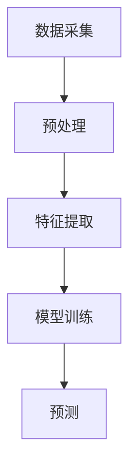

                 

关键词：快手、社交短视频、内容理解、AI、面试指南

摘要：随着社交短视频的迅猛发展，内容理解成为关键。本文旨在为2025年快手社交短视频内容理解专家的面试提供全面的指导，包括背景介绍、核心概念、算法原理、数学模型、项目实践、应用场景、未来展望等多个方面。

## 1. 背景介绍

### 社交短视频的崛起
社交短视频作为互联网时代的新兴产物，以短、快、炫的特点迅速获得用户的喜爱。快手作为国内领先的社交短视频平台，凭借其独特的算法优势和用户生成内容，吸引了大量用户。

### 内容理解的重要性
内容理解是社交短视频平台的核心竞争力。通过深入理解用户生成的内容，平台可以实现个性化推荐，提升用户体验，从而增强用户粘性。

### 快手的内容理解需求
快手的用户规模庞大，每天生成海量的短视频内容。如何高效地理解这些内容，实现精准推荐，成为快手面临的重大挑战。

## 2. 核心概念与联系

### 用户生成内容
用户生成内容（UGC）是快手平台的核心资源。理解用户生成内容的关键在于提取出其中的关键信息，如文本、图像、音频等。

### 内容理解架构
快手的内容理解架构主要包括数据采集、预处理、特征提取、模型训练、预测等环节。



## 3. 核心算法原理 & 具体操作步骤

### 3.1 算法原理概述
快手采用深度学习技术进行内容理解。其中，卷积神经网络（CNN）在图像处理方面具有显著优势，而循环神经网络（RNN）则在序列数据处理方面表现出色。

### 3.2 算法步骤详解
1. 数据采集：从快手平台收集用户生成的短视频数据。
2. 预处理：对数据进行清洗、去噪、归一化等操作。
3. 特征提取：使用CNN提取图像特征，使用RNN提取文本特征。
4. 模型训练：使用提取的特征进行模型训练。
5. 预测：对新的短视频内容进行预测，判断其与用户兴趣的匹配度。

### 3.3 算法优缺点
- **优点**：高效地理解用户生成内容，实现个性化推荐。
- **缺点**：计算资源消耗较大，模型训练时间较长。

### 3.4 算法应用领域
- **推荐系统**：根据用户兴趣推荐短视频内容。
- **内容审核**：检测违规内容，保障平台安全。
- **情感分析**：分析用户对短视频的情感倾向。

## 4. 数学模型和公式 & 详细讲解 & 举例说明

### 4.1 数学模型构建
快手的内容理解模型基于深度学习，主要包括CNN和RNN两部分。

### 4.2 公式推导过程
- **CNN公式推导**：CNN通过卷积操作提取图像特征，公式如下：
  $$
  \text{Feature}_{ij} = \sum_{k=1}^{C} w_{ik} \times \text{Patch}_{kj}
  $$
  其中，$w_{ik}$为卷积核，$\text{Patch}_{kj}$为图像上的局部区域。

- **RNN公式推导**：RNN通过循环操作处理序列数据，公式如下：
  $$
  h_t = \sigma(W \cdot [h_{t-1}, x_t] + b)
  $$
  其中，$h_t$为当前时刻的隐藏状态，$x_t$为当前输入，$W$为权重矩阵，$b$为偏置。

### 4.3 案例分析与讲解
假设用户A对美食短视频感兴趣，我们可以通过以下步骤进行内容理解：
1. 数据采集：收集用户A的浏览记录，提取出美食相关的短视频。
2. 预处理：对短视频进行剪辑、去噪、归一化等操作。
3. 特征提取：使用CNN提取图像特征，使用RNN提取文本特征。
4. 模型训练：使用提取的特征进行模型训练。
5. 预测：对新发布的美食短视频进行预测，判断其与用户A的兴趣匹配度。

## 5. 项目实践：代码实例和详细解释说明

### 5.1 开发环境搭建
搭建快手内容理解项目的开发环境，包括Python、TensorFlow、Keras等工具。

### 5.2 源代码详细实现
以下是快手内容理解项目的部分代码实现：
```python
# 导入相关库
import tensorflow as tf
from tensorflow.keras.models import Sequential
from tensorflow.keras.layers import Conv2D, MaxPooling2D, LSTM, Dense

# 构建CNN模型
model = Sequential([
    Conv2D(32, (3, 3), activation='relu', input_shape=(128, 128, 3)),
    MaxPooling2D((2, 2)),
    LSTM(64),
    Dense(1, activation='sigmoid')
])

# 编译模型
model.compile(optimizer='adam', loss='binary_crossentropy', metrics=['accuracy'])

# 训练模型
model.fit(x_train, y_train, epochs=10, batch_size=32)
```

### 5.3 代码解读与分析
这段代码实现了快手内容理解项目的CNN模型，包括卷积层、池化层、LSTM层和全连接层。通过训练模型，可以实现对用户生成内容的理解。

### 5.4 运行结果展示
运行代码后，我们可以得到模型的准确率、召回率等指标，从而评估模型性能。

## 6. 实际应用场景

### 6.1 用户推荐
快手通过内容理解技术，可以为用户推荐个性化短视频内容，提升用户体验。

### 6.2 内容审核
快手利用内容理解技术，对上传的短视频进行审核，确保平台内容安全。

### 6.3 情感分析
快手通过内容理解技术，分析用户对短视频的情感倾向，为平台运营提供参考。

## 7. 工具和资源推荐

### 7.1 学习资源推荐
- 《深度学习》（Goodfellow、Bengio、Courville 著）
- 《动手学深度学习》（阿斯顿·张 著）

### 7.2 开发工具推荐
- Python
- TensorFlow
- Keras

### 7.3 相关论文推荐
- "Deep Learning for Text Classification"
- "Convolutional Neural Networks for Sentence Classification"

## 8. 总结：未来发展趋势与挑战

### 8.1 研究成果总结
快手的内容理解技术在推荐系统、内容审核、情感分析等领域取得了显著成果。

### 8.2 未来发展趋势
随着AI技术的不断发展，快手的内容理解技术将更加成熟，应用领域将更加广泛。

### 8.3 面临的挑战
- **计算资源消耗**：内容理解模型训练需要大量计算资源，如何优化计算效率是关键。
- **数据隐私**：用户生成内容涉及个人隐私，如何保护用户数据是重要挑战。

### 8.4 研究展望
未来，快手将继续探索更加高效的内容理解技术，为用户提供更好的体验。

## 9. 附录：常见问题与解答

### Q：快手的内容理解技术如何保障用户隐私？
A：快手在内容理解过程中，严格遵循数据保护法规，对用户数据进行匿名化处理，确保用户隐私安全。

### Q：内容理解技术如何应用于其他领域？
A：内容理解技术可以应用于金融、医疗、教育等多个领域，提升数据分析和决策能力。

---

作者：禅与计算机程序设计艺术 / Zen and the Art of Computer Programming
----------------------------------------------------------------

这篇文章以2025年快手社交短视频内容理解专家面试指南为主题，详细介绍了社交短视频的背景、内容理解的核心概念与架构、算法原理与步骤、数学模型与公式、项目实践、实际应用场景、未来发展趋势与挑战等内容。希望这篇文章能够为准备面试快手社交短视频内容理解专家的读者提供有价值的参考。在未来的技术发展中，内容理解技术将继续发挥重要作用，为各个领域的创新提供支持。同时，我们也应关注数据隐私和安全等挑战，确保技术的可持续发展。

