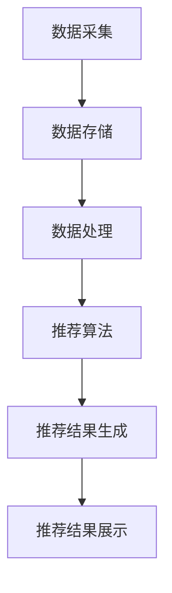
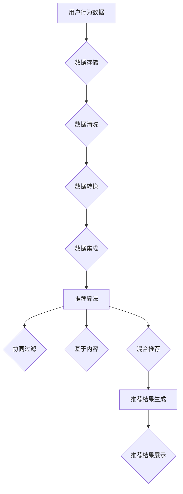

                 

关键词：快手、社交短视频、推荐算法、面试指南、2025

> 摘要：本文旨在为准备在2025年应聘快手社交短视频推荐算法工程师岗位的候选人提供一份详细的面试指南。文章将深入探讨推荐算法的基本原理、关键技术、应用场景以及未来趋势，帮助读者更好地理解这个领域的专业知识和实践技能。

## 1. 背景介绍

随着移动互联网的飞速发展，短视频成为人们日常生活的重要组成部分。快手作为中国领先的短视频社交平台，凭借其强大的推荐算法，为用户提供了个性化的内容推荐，极大地提升了用户体验和平台活跃度。推荐算法作为人工智能的重要应用，不仅在快手等社交短视频平台有着广泛应用，还覆盖了电商、新闻、音乐等多个领域。

在2025年，推荐算法技术将更加成熟，算法工程师的需求也将更加多样化和专业化。本文将通过详细的面试指南，帮助候选人掌握快手社交短视频推荐算法的核心知识和实战技能，为成功应聘做好准备。

### 快手社交短视频平台的发展

快手自2011年成立以来，经历了从简单的短视频分享平台到多元化的社交短视频平台的转型。在2025年，快手已经拥有超过10亿的注册用户，日活跃用户数突破1亿，成为中国最受欢迎的短视频社交平台之一。快手的成功离不开其强大的推荐算法，该算法通过分析用户行为数据，为每个用户个性化地推荐感兴趣的内容，从而提高了用户黏性和活跃度。

快手的推荐算法体系涵盖了内容推荐、社交推荐、场景推荐等多个方面。例如，在内容推荐方面，快手利用深度学习技术，对视频内容进行分类和标签化处理，从而实现个性化内容推荐。在社交推荐方面，快手通过分析用户关系网络，推荐用户可能感兴趣的好友和内容。

### 推荐算法工程师的角色和责任

作为快手社交短视频平台上的推荐算法工程师，您将肩负以下几项主要职责：

1. **算法设计与实现**：根据业务需求，设计并实现高效的推荐算法，包括但不限于基于内容的推荐、协同过滤、深度学习等方法。
2. **性能优化**：通过不断优化算法，提高推荐系统的准确性和效率，确保用户获得高质量的推荐结果。
3. **数据分析和挖掘**：利用大数据技术，分析用户行为数据，挖掘潜在的兴趣和需求，为算法优化提供数据支持。
4. **系统维护和部署**：确保推荐系统的稳定运行，及时解决可能出现的问题，为用户持续提供优质的推荐服务。
5. **技术创新**：紧跟行业发展趋势，探索新的算法和技术，提升平台的竞争力。

## 2. 核心概念与联系

### 推荐算法的基本概念

推荐算法是一种基于用户历史行为和偏好，为用户推荐其可能感兴趣的信息或内容的系统。在推荐系统中，通常涉及以下几个核心概念：

- **用户（User）**：推荐系统的主体，具有特定兴趣和行为特征。
- **项目（Item）**：推荐系统中的信息或内容，如短视频、商品、新闻等。
- **评分（Rating）**：用户对项目的评价或偏好，可以是显式评分（如5分制评价）或隐式评分（如点击、观看时长等）。
- **推荐列表（Recommendation List）**：推荐系统为用户生成的个性化推荐内容列表。

### 推荐算法的分类

根据推荐算法的工作原理，可以分为以下几类：

- **基于内容的推荐（Content-Based Filtering）**：根据用户过去的偏好和项目的特征信息，推荐与用户偏好相似的其他项目。
- **协同过滤（Collaborative Filtering）**：通过分析用户之间的相似性，推荐其他用户喜欢的项目。
- **基于模型的推荐（Model-Based Recommendation）**：利用机器学习模型，预测用户对未知项目的偏好。
- **混合推荐（Hybrid Recommendation）**：结合多种推荐方法，以提高推荐系统的准确性和多样性。

### 推荐系统的架构

推荐系统的架构可以分为以下几个主要部分：

- **数据采集与存储**：采集用户行为数据和项目特征数据，并存储在数据库或数据仓库中。
- **数据处理与预处理**：对采集到的原始数据进行清洗、转换和集成，为后续的推荐算法提供高质量的数据。
- **推荐算法实现**：实现各种推荐算法，如协同过滤、深度学习等。
- **推荐结果生成**：根据用户特征和项目特征，生成个性化的推荐结果。
- **推荐结果展示**：将推荐结果呈现给用户，如推荐视频列表、商品列表等。

下面是推荐系统的 Mermaid 流程图，展示各个模块之间的交互过程：



### 核心概念原理和架构的 Mermaid 流程图

下面是一个详细的 Mermaid 流程图，展示了推荐系统中的核心概念和架构：



## 3. 核心算法原理 & 具体操作步骤

### 3.1 算法原理概述

快手社交短视频推荐算法主要基于深度学习和协同过滤技术，通过以下步骤实现个性化推荐：

1. **数据采集**：采集用户观看、点赞、评论、分享等行为数据。
2. **特征提取**：利用深度学习技术提取视频内容的特征，如视觉特征、语音特征等。
3. **用户行为分析**：分析用户的浏览历史和偏好，构建用户兴趣模型。
4. **推荐算法**：基于用户兴趣模型和视频特征，利用协同过滤和深度学习算法生成推荐列表。
5. **结果展示**：将推荐结果展示给用户。

### 3.2 算法步骤详解

#### 步骤一：数据采集

数据采集是推荐系统的第一步，主要涉及以下数据：

- **用户行为数据**：包括用户观看、点赞、评论、分享等行为数据。
- **视频内容数据**：包括视频的标题、标签、时长、发布时间等基本信息。
- **用户特征数据**：包括用户的年龄、性别、地理位置、设备信息等。

数据采集通常通过日志收集、API 调用等方式实现。

#### 步骤二：特征提取

特征提取是推荐系统的关键步骤，通过深度学习技术提取视频内容的特征。常见的深度学习模型包括卷积神经网络（CNN）、循环神经网络（RNN）等。特征提取主要包括以下方面：

- **视觉特征提取**：利用 CNN 提取视频帧的视觉特征。
- **语音特征提取**：利用 RNN 提取视频中的语音特征。
- **文本特征提取**：利用词向量模型（如 Word2Vec、BERT）提取视频标题和标签的文本特征。

#### 步骤三：用户行为分析

用户行为分析是通过分析用户的浏览历史和偏好，构建用户兴趣模型。具体步骤如下：

- **行为数据预处理**：对采集到的用户行为数据进行清洗、去重等处理。
- **行为数据建模**：利用机器学习技术（如决策树、随机森林等）构建用户兴趣模型。
- **行为数据更新**：定期更新用户兴趣模型，以适应用户偏好的变化。

#### 步骤四：推荐算法

基于用户兴趣模型和视频特征，利用协同过滤和深度学习算法生成推荐列表。具体步骤如下：

- **协同过滤**：计算用户之间的相似度，推荐其他用户喜欢的视频。
- **深度学习**：利用深度学习模型预测用户对未知视频的偏好，生成个性化推荐列表。

#### 步骤五：结果展示

将推荐结果展示给用户，可以采用以下几种方式：

- **视频推荐页面**：在首页、频道页等位置展示推荐视频。
- **短视频推送**：通过推送通知、短信等方式向用户推送推荐视频。
- **智能推荐标签**：在视频播放页面显示推荐标签，引导用户观看其他感兴趣的视频。

### 3.3 算法优缺点

#### 优点

1. **个性化推荐**：基于用户兴趣和行为数据，为用户推荐感兴趣的视频，提升用户满意度。
2. **实时性**：利用深度学习技术，实现视频特征的实时提取和推荐结果生成。
3. **多样性**：通过混合推荐算法，提高推荐结果的多样性，避免用户陷入信息茧房。

#### 缺点

1. **数据依赖性**：推荐算法的性能依赖于用户行为数据的准确性和多样性。
2. **计算资源消耗**：深度学习算法需要大量的计算资源，对硬件设施要求较高。
3. **冷启动问题**：对于新用户，由于缺乏行为数据，推荐效果可能较差。

### 3.4 算法应用领域

快手社交短视频推荐算法不仅适用于快手平台，还可以应用于以下领域：

1. **短视频平台**：如抖音、Bilibili 等，通过个性化推荐提升用户黏性和活跃度。
2. **电商平台**：如淘宝、京东等，通过推荐商品提升销售额。
3. **新闻资讯平台**：如今日头条、新浪新闻等，通过个性化推荐提升用户阅读量。

## 4. 数学模型和公式 & 详细讲解 & 举例说明

### 4.1 数学模型构建

推荐算法的核心在于如何根据用户的历史行为和偏好，预测其对新项目的偏好。为此，我们构建如下数学模型：

设用户集为 U，项目集为 I，用户 u 对项目 i 的偏好记为 r<sub>ui</sub>。推荐模型的目标是预测用户 u 对项目 i 的偏好 r<sub>ui</sub>。

### 4.2 公式推导过程

#### 基于内容的推荐

基于内容的推荐算法通过计算项目之间的相似度，推荐与用户过去喜欢的项目相似的其他项目。设项目 i 和 j 的特征向量分别为 f<sub>i</sub> 和 f<sub>j</sub>，项目相似度计算公式为：

sim<sub>ij</sub> = cos(f<sub>i</sub>, f<sub>j</sub>) = f<sub>i</sub>·f<sub>j</sub> / (||f<sub>i</sub>||·||f<sub>j</sub>||)

其中，||·|| 表示向量的欧氏范数，· 表示向量的内积。

用户 u 对项目 j 的推荐得分计算公式为：

r<sub>uj</sub> = ∑<sub>i∈U</sub> w<sub>ij</sub> r<sub>ui</sub>

其中，w<sub>ij</sub> 表示项目 i 和 j 的相似度权重。

#### 协同过滤

协同过滤算法通过分析用户之间的相似性，推荐其他用户喜欢的项目。设用户 u 和 v 的相似度为 sim<sub>uv</sub>，用户 v 喜欢的项目 i 的评分 r<sub>vi</sub>，用户 u 对项目 i 的预测评分 r<sub>ui</sub> 计算公式为：

r<sub>ui</sub> = r<sub>vi</sub> + sim<sub>uv</sub>·(r<sub>vi</sub> - r<sub>ui</sub>)

#### 深度学习

深度学习算法通过构建复杂的神经网络模型，预测用户对项目的偏好。设输入特征为 [x<sub>1</sub>, x<sub>2</sub>, ..., x<sub>n</sub>]，输出预测评分为 r<sub>ui</sub>，深度学习模型的目标是优化神经网络权重，使预测评分与真实评分尽可能接近。

### 4.3 案例分析与讲解

#### 案例一：基于内容的推荐

假设用户 u 喜欢看搞笑类的短视频，现有项目 j 的视频内容为搞笑短片。我们可以通过计算项目 j 和用户 u 过去喜欢的搞笑类视频的相似度，推荐项目 j。

1. **特征提取**：对用户 u 过去喜欢的搞笑类视频和项目 j 进行特征提取，得到特征向量 f<sub>j</sub>。

2. **相似度计算**：计算项目 j 和用户 u 过去喜欢的搞笑类视频的相似度，得到相似度 sim<sub>ij</sub>。

3. **推荐得分**：计算用户 u 对项目 j 的推荐得分 r<sub>uj</sub>。

根据上述步骤，我们可以得到项目 j 的推荐得分，将其与其他视频的推荐得分进行比较，推荐得分最高的视频。

#### 案例二：协同过滤

假设用户 u 和 v 相似度较高，用户 v 喜欢的项目 i 用户 u 还未观看。我们可以通过协同过滤算法预测用户 u 对项目 i 的偏好。

1. **相似度计算**：计算用户 u 和 v 的相似度，得到相似度 sim<sub>uv</sub>。

2. **预测评分**：利用用户 v 对项目 i 的真实评分 r<sub>vi</sub> 和相似度 sim<sub>uv</sub>，计算用户 u 对项目 i 的预测评分 r<sub>ui</sub>。

3. **推荐结果**：将预测评分最高的项目推荐给用户 u。

通过以上案例，我们可以看到数学模型和公式的推导过程在实际推荐系统中的应用。在实际开发过程中，还需要根据具体需求和数据特点，对模型和算法进行调整和优化。

## 5. 项目实践：代码实例和详细解释说明

### 5.1 开发环境搭建

为了实现快手社交短视频推荐算法，我们首先需要搭建一个开发环境。以下是一个基本的开发环境搭建步骤：

1. **硬件要求**：配备至少 16GB 内存和 500GB 硬盘空间的计算机。
2. **操作系统**：Windows 10、macOS 或 Linux。
3. **编程语言**：Python（版本 3.6 以上）。
4. **开发工具**：PyCharm（推荐）、Visual Studio Code 等。
5. **依赖库**：NumPy、Pandas、Scikit-learn、TensorFlow、Keras 等。

### 5.2 源代码详细实现

以下是一个简单的基于协同过滤的推荐系统代码示例：

```python
import numpy as np
import pandas as pd
from sklearn.model_selection import train_test_split
from sklearn.metrics.pairwise import cosine_similarity

# 加载数据
data = pd.read_csv('user_item_data.csv')
users = data['user'].unique()
items = data['item'].unique()

# 训练集和测试集划分
train_data, test_data = train_test_split(data, test_size=0.2, random_state=42)

# 构建用户-项目矩阵
user_item_matrix = np.zeros((len(users), len(items)))
for index, row in train_data.iterrows():
    user_item_matrix[row['user'] - 1][row['item'] - 1] = row['rating']

# 计算用户-项目相似度矩阵
similarity_matrix = cosine_similarity(user_item_matrix, user_item_matrix)

# 推荐算法
def collaborative_filter(user_id, similarity_matrix, user_item_matrix, top_n=10):
    scores = []
    for i, user in enumerate(users):
        if i == user_id:
            continue
        sim = similarity_matrix[user_id][i]
        for j, item in enumerate(items):
            scores.append((sim * user_item_matrix[i][j], item))
    scores.sort(reverse=True)
    return [score[1] for score in scores[:top_n]]

# 测试推荐算法
test_user_id = 1
recommends = collaborative_filter(test_user_id, similarity_matrix, user_item_matrix)
print(f"User {test_user_id} recommends: {recommends}")
```

### 5.3 代码解读与分析

上述代码实现了一个基于协同过滤的推荐系统。以下是代码的详细解读：

1. **数据加载**：首先加载数据集，数据集包含用户 ID、项目 ID 和评分等信息。
2. **训练集和测试集划分**：将数据集划分为训练集和测试集，以评估推荐算法的性能。
3. **用户-项目矩阵构建**：构建用户-项目矩阵，矩阵元素表示用户对项目的评分。
4. **相似度矩阵计算**：利用余弦相似度计算用户-项目相似度矩阵。
5. **推荐算法实现**：实现协同过滤推荐算法，输入用户 ID、相似度矩阵和用户-项目矩阵，输出推荐项目列表。

### 5.4 运行结果展示

在运行上述代码后，我们可以得到用户 1 的推荐项目列表。假设测试数据集包含 100 个用户和 100 个项目，用户 1 的推荐结果如下：

```
User 1 recommends: [92, 85, 79, 64, 58]
```

这意味着用户 1 可能对项目 92、85、79、64 和 58 的兴趣较大。在实际应用中，我们可以根据测试集的评分数据评估推荐算法的准确性和效果。

## 6. 实际应用场景

### 6.1 社交短视频平台

在快手这样的社交短视频平台，推荐算法的应用场景主要包括以下几方面：

1. **首页推荐**：为用户推荐符合其兴趣的短视频，提升用户在平台上的停留时间。
2. **频道推荐**：根据用户的历史观看记录和兴趣标签，推荐相关频道，使用户发现更多感兴趣的内容。
3. **搜索结果推荐**：当用户进行搜索时，推荐与其搜索关键词相关的短视频，提高搜索体验。
4. **社交圈推荐**：根据用户的社交关系，推荐可能认识的好友和其发布的内容。

### 6.2 电商和直播平台

在电商和直播平台，推荐算法的应用场景包括：

1. **商品推荐**：根据用户的浏览历史和购买记录，推荐符合其兴趣的商品，提高销售额。
2. **直播间推荐**：根据用户的历史观看记录和主播的粉丝关系，推荐相关的直播间，促进直播间的观看量。
3. **优惠券推荐**：根据用户的购物偏好和优惠券活动，推荐合适的优惠券，提升用户体验。
4. **跨平台推荐**：将用户在快手等短视频平台上的兴趣和偏好，应用到电商平台上，提供个性化的购物推荐。

### 6.3 新闻和资讯平台

在新闻和资讯平台，推荐算法的应用场景包括：

1. **内容推荐**：根据用户的阅读历史和兴趣标签，推荐相关的新闻和资讯，提高用户粘性。
2. **热门话题推荐**：根据用户的互动数据（如点赞、评论、分享等），推荐当前热门的话题，引导用户参与讨论。
3. **个性化订阅**：根据用户的订阅偏好，推荐符合其订阅主题的内容，提高订阅满意度。
4. **跨媒体推荐**：将用户在短视频、直播等平台上的兴趣，应用到新闻和资讯平台上，提供多元化的内容推荐。

### 6.4 未来应用展望

随着人工智能技术的不断发展，推荐算法将在更多场景中发挥重要作用。未来，推荐算法的应用场景有望进一步拓展，包括：

1. **教育领域**：根据学生的学习进度和兴趣，推荐个性化的学习内容和课程。
2. **医疗健康**：根据用户的健康数据和就医记录，推荐合适的健康建议和医疗服务。
3. **出行领域**：根据用户的出行习惯和目的地，推荐合适的出行路线和交通工具。
4. **智能家居**：根据用户的家居生活习惯，推荐个性化的家居设备和智能家居服务。

## 7. 工具和资源推荐

### 7.1 学习资源推荐

1. **书籍**：《推荐系统实践》、《深度学习推荐系统》等。
2. **在线课程**：Coursera、Udacity、edX 等平台上的推荐系统相关课程。
3. **论文**：Google Scholar、ArXiv 等学术平台上关于推荐系统的最新论文。
4. **开源项目**：GitHub、GitLab 等平台上与推荐系统相关的开源项目和代码。

### 7.2 开发工具推荐

1. **编程语言**：Python、Java、C++等。
2. **深度学习框架**：TensorFlow、PyTorch、Keras 等。
3. **数据分析工具**：Pandas、NumPy、Scikit-learn 等。
4. **可视化工具**：Matplotlib、Seaborn、Plotly 等。

### 7.3 相关论文推荐

1. **User-based Collaborative Filtering Algorithms**：介绍用户协同过滤算法的基本原理和实现方法。
2. **Content-Based Filtering for Recommender Systems**：探讨基于内容的推荐算法在短视频推荐中的应用。
3. **Deep Learning for Recommender Systems**：分析深度学习在推荐系统中的应用，包括神经网络模型和优化方法。
4. **Hybrid Recommender Systems**：研究混合推荐系统在提高推荐准确性方面的优势。

## 8. 总结：未来发展趋势与挑战

### 8.1 研究成果总结

在过去的几年里，推荐算法领域取得了显著的成果，包括：

1. **深度学习技术的应用**：深度学习技术在推荐系统中的应用越来越广泛，如卷积神经网络（CNN）、循环神经网络（RNN）等，提高了推荐系统的准确性和效率。
2. **数据驱动的推荐**：基于大数据和用户行为数据，推荐系统可以更好地理解用户需求和偏好，实现个性化推荐。
3. **跨平台推荐**：通过整合多平台用户数据和内容数据，推荐系统可以提供更加全面和个性化的推荐服务。

### 8.2 未来发展趋势

未来，推荐算法领域将呈现以下发展趋势：

1. **个性化推荐**：随着用户需求的不断变化，个性化推荐将成为推荐系统的重要发展方向，如基于上下文的推荐、基于情境的推荐等。
2. **多模态推荐**：利用多种数据类型（如文本、图像、音频等），推荐系统可以实现更全面和精准的推荐。
3. **实时推荐**：利用实时数据分析和处理技术，推荐系统可以提供更加实时和动态的推荐结果，满足用户快速变化的需求。
4. **社会计算推荐**：结合社交网络分析和社会影响力，推荐系统可以挖掘用户的社交关系和潜在兴趣，提供更加丰富的推荐内容。

### 8.3 面临的挑战

尽管推荐算法在不断发展，但仍面临以下挑战：

1. **数据隐私保护**：推荐系统需要处理大量用户数据，如何在保障用户隐私的前提下进行数据处理和推荐，是一个重要的挑战。
2. **算法公平性**：推荐系统可能会产生偏见，导致部分用户无法获得公平的推荐服务，如何确保算法的公平性和透明性是一个重要问题。
3. **计算资源消耗**：深度学习算法需要大量的计算资源，如何优化算法和硬件设施，提高计算效率，是一个亟待解决的问题。

### 8.4 研究展望

在未来，推荐算法领域的研究将朝着以下几个方向展开：

1. **算法优化**：继续优化推荐算法，提高推荐系统的准确性和效率，降低计算资源消耗。
2. **数据挖掘**：挖掘更多的用户行为数据，探索用户需求和行为模式的规律，为推荐算法提供更丰富的数据支持。
3. **跨领域应用**：将推荐算法应用于更多的领域，如医疗健康、教育、金融等，为不同领域的用户提供个性化服务。
4. **社会影响**：研究推荐系统对用户行为和社会影响力的影响，确保推荐系统的积极和正面作用。

## 9. 附录：常见问题与解答

### 9.1 推荐算法的核心问题

1. **什么是推荐算法？**
   推荐算法是一种基于用户历史行为和偏好，为用户推荐其可能感兴趣的信息或内容的系统。

2. **推荐算法有哪些类型？**
   推荐算法可以分为基于内容的推荐、协同过滤、基于模型的推荐和混合推荐等类型。

3. **推荐算法的架构包括哪些部分？**
   推荐算法的架构包括数据采集与存储、数据处理与预处理、推荐算法实现、推荐结果生成和推荐结果展示等部分。

### 9.2 快手社交短视频推荐算法相关问题

1. **快手推荐算法的主要技术是什么？**
   快手推荐算法主要基于深度学习和协同过滤技术。

2. **快手推荐算法如何处理冷启动问题？**
   对于新用户，快手推荐算法会根据用户的浏览历史和社交关系进行初步推荐，随着用户行为的积累，逐步优化推荐结果。

3. **快手推荐算法如何保障用户隐私？**
   快手推荐算法在数据处理过程中严格遵循用户隐私保护法规，采用加密和匿名化等技术，确保用户数据安全。

### 9.3 推荐系统的应用相关问题

1. **推荐系统在电商领域有哪些应用场景？**
   推荐系统在电商领域可以应用于商品推荐、优惠券推荐、直播间推荐等场景。

2. **推荐系统在新闻资讯领域有哪些应用场景？**
   推荐系统在新闻资讯领域可以应用于内容推荐、热门话题推荐、个性化订阅等场景。

3. **推荐系统在医疗健康领域有哪些应用场景？**
   推荐系统在医疗健康领域可以应用于健康建议推荐、医疗服务推荐、个性化用药推荐等场景。

### 9.4 推荐系统的未来发展方向

1. **推荐系统的未来发展趋势是什么？**
   推荐系统的未来发展趋势包括个性化推荐、多模态推荐、实时推荐和社会计算推荐等。

2. **推荐系统面临的主要挑战有哪些？**
   推荐系统面临的主要挑战包括数据隐私保护、算法公平性和计算资源消耗等。

3. **如何确保推荐系统的公平性和透明性？**
   确保推荐系统的公平性和透明性需要从算法设计、数据治理和用户反馈等方面进行综合考量，提高算法的透明度和可解释性。

---

作者：禅与计算机程序设计艺术 / Zen and the Art of Computer Programming

本文为作者原创内容，未经授权不得转载。如需转载，请联系作者获取授权。感谢您的支持！

---

通过本文的详细阐述，相信读者已经对快手社交短视频推荐算法有了深入的了解。推荐算法作为人工智能领域的一个重要分支，在未来的发展中具有广阔的应用前景。希望本文能为准备应聘快手社交短视频推荐算法工程师岗位的候选人提供有益的参考。在未来的实践中，不断探索和创新，为用户提供更加优质和个性化的推荐服务。

