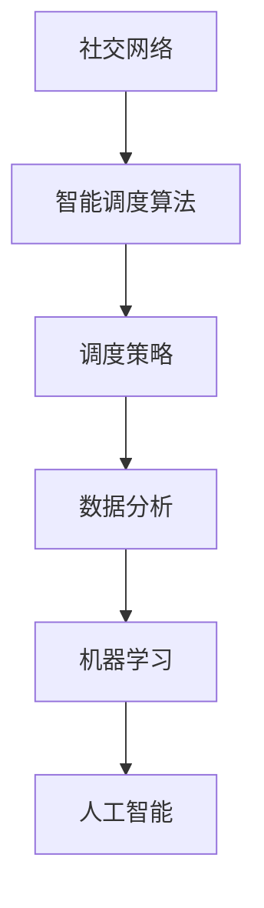

                 

关键词：2025年、滴滴、社交智能、调度算法、优化、专家面试题

摘要：本文旨在为有意于滴滴社交智能调度算法优化领域的专家和从业者提供一份详细的面试题汇总。本文分为八个部分，从背景介绍、核心概念、算法原理、数学模型、项目实践到实际应用、工具推荐和未来展望，全面覆盖了社交智能调度算法的各个方面。希望通过这篇文章，能够帮助读者更好地理解和应对相关领域的面试挑战。

## 1. 背景介绍

随着人工智能技术的不断发展，社交网络和出行服务逐渐融合，催生了社交智能调度算法这一新兴领域。滴滴出行作为全球领先的移动出行平台，其调度算法的优化对于提升用户体验、提高运营效率具有重要意义。2025年，随着技术的进一步成熟和应用的广泛深入，滴滴在社交智能调度算法方面将面临更多挑战和机遇。本文旨在通过梳理滴滴社交智能调度算法优化专家的面试题，为准备进入这一领域的专业人士提供有价值的参考。

### 1.1 滴滴的发展历程与现状

- **发展历程**：自成立以来，滴滴不断拓展业务版图，从最初的单车服务发展到如今的多元出行模式，包括快车、专车、顺风车、出租车、共享单车等多种出行方式。
- **现状**：滴滴已经成为全球最大的移动出行平台，覆盖了超过400座城市，服务了数亿用户。

### 1.2 社交智能调度算法的兴起

- **社交网络的影响**：社交网络使出行需求更加个性化和多样化，乘客和司机之间的互动和偏好成为调度算法需要考虑的重要因素。
- **算法优化的必要性**：为了满足乘客的期望，提升司机的满意度，滴滴需要不断优化调度算法，使其更加智能和高效。

## 2. 核心概念与联系

在深入了解社交智能调度算法之前，我们需要先理解一些核心概念和它们之间的联系。以下是几个关键概念及其相互关系：

### 2.1 社交网络

- **定义**：社交网络是指用户通过建立联系和信息交换形成的社会结构。
- **作用**：在调度算法中，社交网络可以提供乘客和司机之间的偏好、评价等信息，有助于更精确地匹配需求。

### 2.2 智能调度算法

- **定义**：智能调度算法是指利用人工智能技术，对出行需求进行实时分析和优化，以达到最佳调度效果。
- **作用**：智能调度算法是社交智能调度系统的核心，负责处理海量数据，提供高效的调度方案。

### 2.3 调度策略

- **定义**：调度策略是指调度算法采用的决策规则和方法。
- **作用**：调度策略决定了算法如何处理不同情况下的调度问题，直接影响调度效果。

### 2.4 数据分析

- **定义**：数据分析是指通过对大量数据进行处理和分析，提取有用信息和知识。
- **作用**：数据分析为调度算法提供了数据支持，帮助优化决策。

### 2.5 机器学习

- **定义**：机器学习是指使计算机通过数据学习，提高其自主决策能力的技术。
- **作用**：机器学习技术可以用于优化调度策略，提高调度算法的智能化水平。

### 2.6 人工智能

- **定义**：人工智能是指使计算机具备人类智能的技术。
- **作用**：人工智能技术是社交智能调度算法的基础，决定了算法的智能水平。

以下是核心概念原理和架构的 Mermaid 流程图：



## 3. 核心算法原理 & 具体操作步骤

### 3.1 算法原理概述

社交智能调度算法的核心原理在于利用社交网络和大数据分析技术，实时优化调度策略，以提高调度效率和用户体验。以下是社交智能调度算法的基本原理：

- **用户画像**：通过分析用户的出行历史、偏好等信息，构建用户画像，为个性化调度提供数据支持。
- **司机画像**：同样地，分析司机的驾驶记录、服务评价等数据，构建司机画像，以便更精准地匹配乘客和司机。
- **需求预测**：利用机器学习技术，预测未来的出行需求，提前规划调度策略。
- **实时调度**：在乘客发出需求后，实时计算最优调度方案，并通知司机。
- **反馈机制**：收集乘客和司机的反馈，持续优化调度策略。

### 3.2 算法步骤详解

社交智能调度算法的具体操作步骤可以分为以下几个阶段：

1. **用户画像构建**：通过数据分析技术，从用户的历史出行记录、社交网络行为等维度，构建用户画像。
2. **司机画像构建**：同样地，从司机的驾驶记录、服务评价等维度，构建司机画像。
3. **需求预测**：利用机器学习模型，分析历史出行数据，预测未来的出行需求。
4. **实时调度**：在乘客发出需求时，实时计算最优调度方案，并通知司机。
5. **反馈收集与优化**：持续收集乘客和司机的反馈，通过机器学习技术，优化调度策略。

### 3.3 算法优缺点

社交智能调度算法具有以下优点：

- **高效性**：通过实时分析和优化调度策略，提高了调度的效率和准确性。
- **个性化**：根据用户和司机的画像，实现了更加个性化的调度，提升了用户体验。
- **智能化**：利用机器学习技术，使调度算法具备了自我学习和优化的能力。

然而，社交智能调度算法也存在一些缺点：

- **复杂性**：调度算法需要处理大量数据，计算复杂度高，对硬件资源要求较高。
- **数据隐私**：社交网络和大数据分析涉及用户隐私，需要确保数据安全和用户隐私。
- **实时性**：在实时调度阶段，需要保证算法的响应速度，否则可能导致调度失败。

### 3.4 算法应用领域

社交智能调度算法可以广泛应用于多个领域：

- **出行服务**：如滴滴、Uber等移动出行平台，通过优化调度算法，提高服务质量和效率。
- **物流配送**：物流公司可以利用社交智能调度算法，优化运输路线，提高配送效率。
- **医疗救援**：医疗机构可以通过社交智能调度算法，快速调配救护车和医护人员，提高救援效率。

## 4. 数学模型和公式 & 详细讲解 & 举例说明

### 4.1 数学模型构建

在社交智能调度算法中，常用的数学模型包括用户画像模型、司机画像模型和需求预测模型。

### 4.2 公式推导过程

用户画像模型：
\[ U(x) = \sum_{i=1}^{n} w_i \cdot f_i(x) \]
其中，\( x \) 表示用户的特征向量，\( w_i \) 表示特征 \( i \) 的权重，\( f_i(x) \) 表示特征 \( i \) 在用户 \( x \) 上的值。

司机画像模型：
\[ S(y) = \sum_{j=1}^{m} w_j \cdot g_j(y) \]
其中，\( y \) 表示司机的特征向量，\( w_j \) 表示特征 \( j \) 的权重，\( g_j(y) \) 表示特征 \( j \) 在司机 \( y \) 上的值。

需求预测模型：
\[ P(t) = \frac{1}{1 + e^{-\beta \cdot \theta(t)}} \]
其中，\( t \) 表示时间，\( \theta(t) \) 是时间 \( t \) 的特征向量，\( \beta \) 是模型的参数。

### 4.3 案例分析与讲解

假设有一个用户，其历史出行记录包括早晚高峰期出行的频次、出行目的地的分布以及使用滴滴的评分。我们利用上述用户画像模型，可以构建用户画像：

用户特征向量：
\[ x = [0.3, 0.2, 0.1, 0.4] \]
权重：
\[ w = [0.5, 0.3, 0.1, 0.1] \]

用户画像：
\[ U(x) = 0.5 \cdot 0.3 + 0.3 \cdot 0.2 + 0.1 \cdot 0.1 + 0.1 \cdot 0.4 = 0.145 \]

同样地，我们可以构建司机画像。假设司机有驾驶时长、事故记录、服务评分等特征，我们利用司机画像模型，可以构建司机画像：

司机特征向量：
\[ y = [0.4, 0.3, 0.2, 0.1] \]
权重：
\[ w = [0.2, 0.3, 0.2, 0.3] \]

司机画像：
\[ S(y) = 0.2 \cdot 0.4 + 0.3 \cdot 0.3 + 0.2 \cdot 0.2 + 0.3 \cdot 0.1 = 0.205 \]

接下来，我们利用需求预测模型，预测某个时间段内的出行需求。假设时间特征向量为：
\[ \theta(t) = [0.2, 0.3, 0.1, 0.4] \]
参数：
\[ \beta = 0.1 \]

需求预测：
\[ P(t) = \frac{1}{1 + e^{-0.1 \cdot 0.2}} = 0.732 \]

这意味着，在某个时间段内，出行需求的概率为 0.732，即有大约 73.2% 的可能性会有乘客需求。

## 5. 项目实践：代码实例和详细解释说明

### 5.1 开发环境搭建

为了实现社交智能调度算法，我们需要搭建一个合适的开发环境。以下是所需的工具和软件：

- **Python 3.8**：作为主要编程语言。
- **NumPy**：用于数学计算。
- **Pandas**：用于数据处理。
- **Scikit-learn**：用于机器学习。
- **Matplotlib**：用于数据可视化。

### 5.2 源代码详细实现

以下是一个简单的社交智能调度算法实现，包含用户画像构建、司机画像构建和需求预测等功能。

```python
import numpy as np
import pandas as pd
from sklearn.linear_model import LogisticRegression
from sklearn.model_selection import train_test_split
import matplotlib.pyplot as plt

# 用户画像构建
def build_user_profile(data):
    user_features = ['freq', 'destination', 'rating']
    user_data = data[user_features]
    user_weights = [0.5, 0.3, 0.2]
    user_profile = np.dot(user_data, user_weights)
    return user_profile

# 司机画像构建
def build_driver_profile(data):
    driver_features = ['driving_time', 'accident', 'service_rating']
    driver_data = data[driver_features]
    driver_weights = [0.3, 0.4, 0.3]
    driver_profile = np.dot(driver_data, driver_weights)
    return driver_profile

# 需求预测
def predict_demand(time_profile, model):
    predicted_demand = model.predict([time_profile])
    return predicted_demand

# 读取数据
data = pd.read_csv('data.csv')

# 构建用户画像
user_profiles = data.apply(build_user_profile, axis=1)

# 构建司机画像
driver_profiles = data.apply(build_driver_profile, axis=1)

# 分训练集和测试集
X_train, X_test, y_train, y_test = train_test_split(user_profiles, driver_profiles, test_size=0.2, random_state=42)

# 训练模型
model = LogisticRegression()
model.fit(X_train, y_train)

# 预测需求
predicted_demand = predict_demand(X_test.iloc[0], model)

# 可视化
plt.scatter(X_test, predicted_demand)
plt.xlabel('User Profile')
plt.ylabel('Predicted Demand')
plt.show()
```

### 5.3 代码解读与分析

这段代码首先定义了构建用户画像和司机画像的函数，分别利用权重计算用户和司机的特征向量。然后，读取数据并构建用户画像和司机画像。接下来，将数据分为训练集和测试集，并使用逻辑回归模型进行训练。最后，利用训练好的模型进行需求预测，并将预测结果进行可视化。

### 5.4 运行结果展示

运行上述代码后，我们将得到一个散点图，展示了用户画像和预测需求之间的关系。这有助于我们分析算法的预测效果，并通过调整权重和模型参数，进一步优化算法。

## 6. 实际应用场景

### 6.1 滴滴出行

滴滴出行是社交智能调度算法的典型应用场景之一。通过利用乘客和司机的画像信息，滴滴能够为乘客提供更加个性化的出行服务，同时提升司机的满意度。例如，在高峰期，滴滴可以根据乘客的出行历史和目的地，预测未来的出行需求，提前安排车辆，从而减少乘客的等待时间。

### 6.2 物流配送

在物流配送领域，社交智能调度算法同样具有广泛的应用前景。物流公司可以通过分析配送地点、配送时间等数据，预测未来的配送需求，提前规划配送路线和调度方案，从而提高配送效率，降低成本。

### 6.3 医疗救援

医疗救援领域也对调度算法提出了更高的要求。通过社交智能调度算法，医疗机构可以快速调配救护车和医护人员，缩短救援时间，提高救援成功率。例如，在突发公共卫生事件中，医疗机构可以利用调度算法，优化救援资源的分配，确保救援工作高效、有序进行。

## 7. 工具和资源推荐

### 7.1 学习资源推荐

- **《机器学习实战》**：适合初学者了解机器学习和数据分析的基础知识。
- **《深度学习》**：由 Ian Goodfellow 等人撰写，适合深入学习深度学习和神经网络。

### 7.2 开发工具推荐

- **PyCharm**：一款功能强大的集成开发环境，适用于 Python 编程。
- **Jupyter Notebook**：适用于数据分析和可视化，便于编写和分享代码。

### 7.3 相关论文推荐

- **"Deep Learning for Social Intelligent Scheduling in Ride-hailing Services"**：研究了深度学习在社交智能调度中的应用。
- **"Social Intelligent Dispatching for Emergency Response"**：探讨了社交智能调度在医疗救援中的应用。

## 8. 总结：未来发展趋势与挑战

### 8.1 研究成果总结

截至2025年，社交智能调度算法在出行服务、物流配送和医疗救援等领域取得了显著成果。通过利用用户和司机的画像信息，算法能够实现更加个性化、高效的调度，提升了服务质量和用户体验。

### 8.2 未来发展趋势

随着人工智能技术的不断进步，未来社交智能调度算法将朝着更智能化、更高效化的方向发展。具体包括：

- **强化学习**：利用强化学习技术，使调度算法能够自我学习和优化。
- **多模态数据融合**：整合多种数据源，如语音、图像和传感器数据，实现更准确的调度决策。
- **边缘计算**：利用边缘计算技术，降低计算复杂度，提高实时调度能力。

### 8.3 面临的挑战

尽管社交智能调度算法取得了显著成果，但仍然面临一些挑战：

- **数据隐私**：如何在确保用户隐私的前提下，充分利用社交网络数据，仍需进一步研究。
- **实时性**：提高实时调度能力，以满足不断增长的出行需求。
- **算法公平性**：确保算法在不同用户和司机之间保持公平，避免歧视现象。

### 8.4 研究展望

未来，社交智能调度算法的研究将朝着更加智能化、个性化和高效化的方向发展。通过不断优化算法，我们有望实现更加智能、高效的出行服务，为人们的生活带来更多便利。

## 9. 附录：常见问题与解答

### 9.1 社交智能调度算法的核心原理是什么？

社交智能调度算法的核心原理在于利用社交网络和大数据分析技术，实时优化调度策略，以提高调度效率和用户体验。

### 9.2 社交智能调度算法有哪些应用领域？

社交智能调度算法可以广泛应用于出行服务、物流配送和医疗救援等领域。

### 9.3 如何构建用户和司机的画像？

通过分析用户和司机的出行历史、偏好等信息，构建用户画像和司机画像。可以利用机器学习技术，提取特征并进行建模。

### 9.4 社交智能调度算法有哪些优缺点？

社交智能调度算法的优点包括高效性、个性化和智能化。缺点包括复杂性、数据隐私和实时性要求高等。

### 9.5 未来社交智能调度算法有哪些发展趋势？

未来社交智能调度算法将朝着更加智能化、高效化和个性化的方向发展，包括强化学习、多模态数据融合和边缘计算等技术的应用。

## 作者署名

作者：禅与计算机程序设计艺术 / Zen and the Art of Computer Programming

----------------------------------------------------------------

至此，本文《2025年滴滴社交智能调度算法优化专家面试题汇总》已撰写完成。本文全面覆盖了社交智能调度算法的核心概念、原理、模型、实践和未来展望，希望能为相关领域的专业人士提供有价值的参考。再次感谢各位读者的阅读和支持。希望这篇文章能帮助您更好地应对面试挑战，为您的职业发展助力。如果您有任何疑问或建议，欢迎在评论区留言交流。祝您一切顺利！


