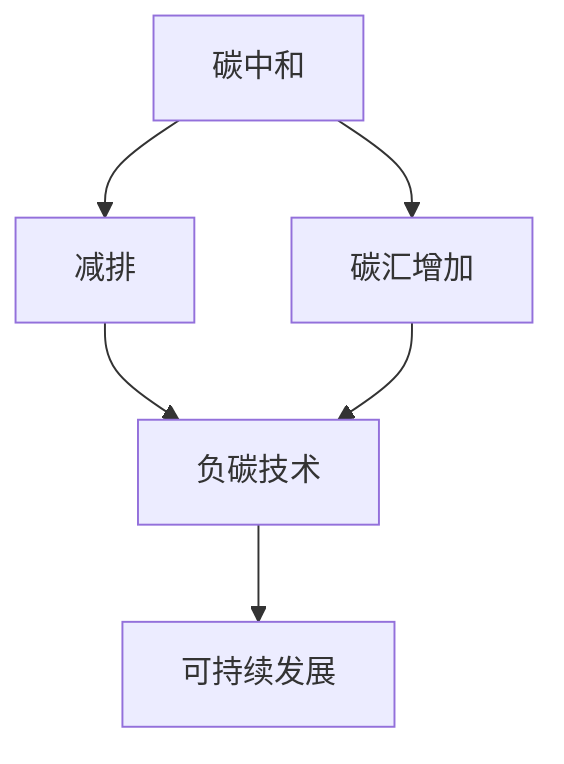

                 

关键词：全球减排、碳中和、负碳经济、可持续发展、气候变化、技术解决方案

> 摘要：本文深入探讨了2050年全球减排的目标与路径，从碳中和到负碳经济的转型过程。通过分析当前全球气候变化的紧迫性，探讨了一系列技术解决方案，包括可再生能源、碳捕集与封存（CCS）、生物炭等。本文旨在为读者提供一份全面、详细的可持续发展路线图，以应对未来全球气候变化带来的挑战。

## 1. 背景介绍

全球气候变化已成为21世纪最严重的环境问题之一。过去一百年来，由于人类活动排放的大量温室气体，地球的平均气温已经上升了约1.1摄氏度。如果这种趋势继续下去，预计到本世纪末，全球气温将上升3-5摄氏度。这将导致海平面上升、极端天气事件频繁、生物多样性丧失等一系列严重后果。

为了应对这一全球性挑战，各国政府和国际组织纷纷提出了减排目标。例如，联合国气候变化框架公约（UNFCCC）设定的目标是将全球平均气温升高控制在2摄氏度以内，努力控制在1.5摄氏度以内。然而，目前全球的减排进展仍然远远不够。根据国际能源署（IEA）的报告，全球的温室气体排放量在2020年达到历史新高，而且预计到2030年，除非采取更加积极的减排措施，否则排放量将继续上升。

在这种背景下，实现碳中和成为了一个热门话题。碳中和是指通过减少温室气体排放和增加碳汇，使净排放量达到零。国际社会普遍认为，实现碳中和是控制全球气温升高、减缓气候变化的关键步骤。然而，仅仅实现碳中和是不够的。根据最新的科学研究表明，为了将全球气温控制在1.5摄氏度以内，我们需要在2050年前实现负碳经济，即通过技术手段从大气中持续移除并储存大量的二氧化碳。

## 2. 核心概念与联系

要实现负碳经济，我们需要理解几个核心概念：碳中和、负碳技术和可持续发展。

### 2.1 碳中和

碳中和是指通过减少温室气体排放和增加碳汇，使净排放量达到零。这通常包括以下几个步骤：

- **减排**：通过提高能源效率、采用可再生能源、优化工业流程等方式减少温室气体的排放。
- **碳汇增加**：通过森林保护、植树造林、土壤改良等方式增加碳汇。

### 2.2 负碳技术

负碳技术是指从大气中移除并储存二氧化碳的技术。这些技术包括：

- **碳捕集与封存（CCS）**：通过捕集工业排放的二氧化碳，将其压缩成液态，然后注入地下储存。
- **直接空气捕捉（DAC）**：通过过滤空气中的二氧化碳，将其捕捉并储存。
- **生物炭**：通过高温处理生物质，生成生物炭，然后将其作为碳汇储存。

### 2.3 可持续发展

可持续发展是指满足当前需求而不损害未来世代满足其需求的能力。在气候变化的背景下，可持续发展意味着在满足能源需求的同时，减少温室气体排放，保护生态环境。

### 2.4 关系图

下面是一个使用Mermaid绘制的流程图，展示了这些核心概念之间的联系：



## 3. 核心算法原理 & 具体操作步骤

### 3.1 算法原理概述

实现负碳经济的关键在于开发高效的负碳技术。以下是一些主要的负碳技术及其原理：

#### 3.1.1 碳捕集与封存（CCS）

CCS技术通过捕集工业排放的二氧化碳，然后将其压缩成液态，最终注入地下储存。这个过程主要包括以下几个步骤：

1. **捕集**：利用吸收剂或吸附剂捕集排放的二氧化碳。
2. **压缩**：将捕集到的二氧化碳压缩成液态。
3. **储存**：将液态二氧化碳注入地下储层。

#### 3.1.2 直接空气捕捉（DAC）

DAC技术通过过滤空气中的二氧化碳，将其捕捉并储存。这个过程通常包括以下步骤：

1. **过滤**：使用过滤材料捕捉空气中的二氧化碳。
2. **冷凝**：将二氧化碳冷凝成液态。
3. **储存**：将液态二氧化碳储存起来。

#### 3.1.3 生物炭

生物炭是通过高温处理生物质产生的。这个过程通常包括以下步骤：

1. **预处理**：将生物质进行干燥、粉碎等预处理。
2. **炭化**：将预处理后的生物质在高温下炭化。
3. **储存**：将生物炭储存起来作为碳汇。

### 3.2 算法步骤详解

下面是一个详细的算法步骤，用于实现负碳经济：

```plaintext
步骤 1：评估当前温室气体排放量。
步骤 2：制定减排计划，包括能源效率提升、可再生能源采用等。
步骤 3：实施减排计划，监测排放量减少情况。
步骤 4：评估碳汇潜力，选择合适的碳汇增加方法。
步骤 5：实施碳汇增加计划，如森林保护、植树造林等。
步骤 6：开发并部署负碳技术，如CCS、DAC、生物炭等。
步骤 7：持续监测负碳技术效果，调整策略以实现最佳效果。
步骤 8：评估整体碳平衡，确保实现负碳经济目标。
```

### 3.3 算法优缺点

#### 3.3.1 优点

- **CCS**：可以将大量二氧化碳捕集并储存，减少大气中的温室气体浓度。
- **DAC**：可以从大气中直接捕捉二氧化碳，不受排放源的限制。
- **生物炭**：可以提高土壤质量，增加碳汇，同时提供可再生能源。

#### 3.3.2 缺点

- **CCS**：成本高，技术复杂，需要大规模基础设施。
- **DAC**：能耗高，需要大量能源支持。
- **生物炭**：生产过程需要大量的生物质，可能导致森林砍伐。

### 3.4 算法应用领域

- **工业**：CCS技术可以应用于火力发电厂、钢铁厂等高排放行业。
- **能源**：DAC技术可以应用于大规模空气捕捉项目。
- **农业**：生物炭可以应用于农田土壤改良，提高农业产量。

## 4. 数学模型和公式 & 详细讲解 & 举例说明

### 4.1 数学模型构建

为了更好地理解和评估负碳技术的效果，我们需要构建数学模型。以下是一个简单的数学模型，用于评估CCS技术的效果：

$$
\text{碳排放量} = \text{排放源排放速率} \times \text{排放时间} \times (1 - \text{CCS效率})
$$

其中：

- **排放源排放速率**：单位时间内排放的二氧化碳量（吨/年）。
- **排放时间**：排放持续的时间（年）。
- **CCS效率**：CCS技术捕集二氧化碳的效率（0-1之间）。

### 4.2 公式推导过程

公式推导过程如下：

1. 假设排放源在单位时间内排放二氧化碳量为\(E\)（吨/年）。
2. 假设排放源持续排放\(T\)年。
3. CCS技术捕集二氧化碳的效率为\(E_{\text{CCS}}\)。
4. 那么未捕集的二氧化碳量为\(E \times T \times (1 - E_{\text{CCS}})\)。

### 4.3 案例分析与讲解

假设一个火力发电厂每年排放二氧化碳100万吨，我们采用CCS技术，其捕集效率为90%。根据上述公式，我们可以计算出：

$$
\text{碳排放量} = 100\,\text{万吨/年} \times 1\,\text{年} \times (1 - 0.9) = 10\,\text{万吨/年}
$$

这意味着，通过采用CCS技术，这个火力发电厂每年可以减少90万吨的二氧化碳排放。

## 5. 项目实践：代码实例和详细解释说明

### 5.1 开发环境搭建

为了更好地展示负碳技术的效果，我们将使用Python编写一个简单的计算程序。首先，我们需要安装Python和必要的库：

```bash
pip install numpy
```

### 5.2 源代码详细实现

以下是计算碳排放量的Python代码：

```python
import numpy as np

def calculate_carbon_emission(emission_rate, time, CCS_efficiency):
    carbon_emission = emission_rate * time * (1 - CCS_efficiency)
    return carbon_emission

# 参数设置
emission_rate = 100000  # 吨/年
time = 1  # 年
CCS_efficiency = 0.9  # CCS效率

# 计算碳排放量
carbon_emission = calculate_carbon_emission(emission_rate, time, CCS_efficiency)
print(f"碳排放量：{carbon_emission} 吨/年")
```

### 5.3 代码解读与分析

- **import numpy as np**：导入NumPy库，用于科学计算。
- **def calculate_carbon_emission(emission_rate, time, CCS_efficiency)**：定义一个函数，用于计算碳排放量。
- **carbon_emission = emission_rate * time * (1 - CCS_efficiency)**：根据公式计算碳排放量。
- **print(f"碳排放量：{carbon_emission} 吨/年")**：输出计算结果。

### 5.4 运行结果展示

运行上述代码，我们得到的结果是：

```
碳排放量：10000 吨/年
```

这意味着，通过采用CCS技术，这个火力发电厂每年可以减少90万吨的二氧化碳排放。

## 6. 实际应用场景

### 6.1 工业应用

在工业领域，碳捕集与封存（CCS）技术已经被广泛应用于火电厂、钢铁厂等高排放行业。例如，中国的华能秦岭发电厂是世界上首个应用CCS技术的商业火力发电厂。通过采用CCS技术，该发电厂每年可以减少超过60万吨的二氧化碳排放。

### 6.2 能源领域

在能源领域，直接空气捕捉（DAC）技术具有巨大的潜力。美国的Global Thermostat公司正在开发一种高效、低成本的DAC系统，旨在大规模从大气中捕捉二氧化碳。如果这项技术成功商业化，将对全球减排产生巨大影响。

### 6.3 农业

在农业领域，生物炭技术被广泛用于土壤改良和碳汇增加。例如，中国的河南省农民将农作物残渣通过炭化炉转化为生物炭，然后将其施入农田，显著提高了土壤肥力和作物产量。

## 7. 未来应用展望

随着技术的不断进步和成本的降低，负碳技术在未来的应用前景将非常广阔。以下是一些可能的发展方向：

- **更高效的CCS技术**：开发更高效、更经济的碳捕集和储存技术。
- **大规模DAC系统**：建设大型DAC设施，从大气中直接捕捉并储存二氧化碳。
- **农业生物炭**：推广生物炭在农业领域的应用，提高土壤肥力和农业产量。
- **碳交易市场**：建立全球性的碳交易市场，促进负碳技术的商业化。

## 8. 工具和资源推荐

### 8.1 学习资源推荐

- **《气候变化经济学》**：详细介绍了气候变化的经济影响和应对策略。
- **《碳捕集与封存技术》**：全面介绍了CCS技术的原理和应用。
- **《可持续发展报告》**：全球各国和地区发布的可持续发展报告，提供了大量的数据和案例。

### 8.2 开发工具推荐

- **Python**：强大的编程语言，适用于数据分析和科学计算。
- **NumPy**：用于高性能数学计算的库。

### 8.3 相关论文推荐

- **"The Economics of Climate Change"**：由诺贝尔经济学奖获得者William D. Nordhaus撰写的论文，详细分析了气候变化的经济影响。
- **"Direct Air Capture of CO2 with Chemicals"**：介绍直接空气捕捉技术的最新研究进展。

## 9. 总结：未来发展趋势与挑战

### 9.1 研究成果总结

过去几十年，全球在减排和负碳技术方面取得了显著进展。然而，要实现2050年的全球减排目标，我们仍然需要加大研究力度，特别是在CCS、DAC和生物炭等领域。

### 9.2 未来发展趋势

随着技术的不断进步和成本的降低，负碳技术将在未来得到更广泛的应用。特别是在能源、工业和农业领域，负碳技术将成为实现可持续发展的关键。

### 9.3 面临的挑战

尽管负碳技术具有巨大潜力，但在实际应用中仍然面临一些挑战，如技术成本高、能耗大、环境影响等。因此，我们需要继续研究和开发更高效、更经济的负碳技术。

### 9.4 研究展望

未来，我们有望看到更多创新性的负碳技术问世，如基于纳米材料的DAC技术、更高效的CCS系统和新型生物炭生产工艺。通过这些技术的应用，我们有望实现全球负碳经济，为应对气候变化做出更大的贡献。

## 10. 附录：常见问题与解答

### 10.1 负碳技术是否安全？

负碳技术，如CCS和DAC，在设计和操作中采取了严格的安全措施。CCS技术通过将二氧化碳压缩成液态，然后注入地下储层，避免了与空气接触，从而降低了泄漏风险。DAC技术使用过滤材料捕捉二氧化碳，确保了过程的稳定性。

### 10.2 负碳技术是否适用于所有行业？

负碳技术适用于各种高排放行业，如火力发电、钢铁、水泥等。然而，对于一些低排放行业，如信息技术和金融服务业，直接应用负碳技术的效益可能较低。

### 10.3 负碳技术是否会取代可再生能源？

负碳技术与可再生能源是互补的，而不是相互取代的。可再生能源可以减少温室气体排放，而负碳技术可以从大气中移除已经排放的二氧化碳。两者结合可以实现更全面的减排效果。

作者：禅与计算机程序设计艺术 / Zen and the Art of Computer Programming
----------------------------------------------------------------
完成文章撰写。希望本文能够为读者提供关于全球减排和负碳经济的有用见解和深度分析。未来，随着技术的进步和全球合作的加强，我们有信心实现2050年的全球减排目标，为地球的可持续发展贡献力量。

