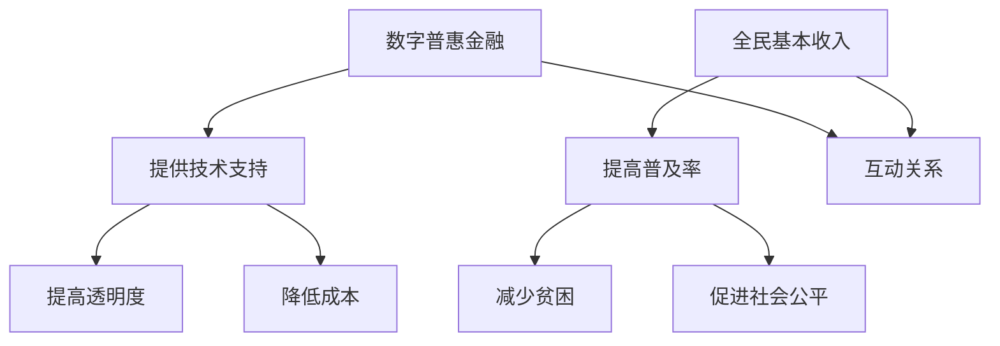

                 

关键词：全球减贫、数字普惠金融、全民基本收入、普惠式发展、AI、区块链、大数据分析、金融科技

> 摘要：随着科技的快速发展，金融科技正在改变全球减贫的格局。本文探讨了到2050年，数字普惠金融和全民基本收入如何共同推动全球普惠式发展，实现全面减贫的目标。通过分析现有的技术和应用案例，本文提出了未来发展的趋势和挑战，为全球减贫事业提供了一种全新的思路。

## 1. 背景介绍

全球减贫是联合国可持续发展目标之一，旨在确保到2030年，没有任何一个人生活在极端贫困中。然而，目前全球仍有约7.8亿人生活在极端贫困之中。为了实现这一目标，全球各国政府和国际组织已经投入了大量资源和努力。然而，传统的减贫手段在某些方面显得力不从心。

随着互联网和移动通信技术的普及，数字普惠金融开始在全球范围内崭露头角。数字普惠金融是指利用互联网和移动技术，为传统金融服务难以覆盖的群体提供便捷、低成本的金融服务。这种金融服务不仅包括支付、转账、存款等基本功能，还涵盖了信贷、保险、投资等多种金融服务。

与此同时，全民基本收入（Universal Basic Income, UBI）的概念也逐渐受到重视。全民基本收入是一种无条件、定期向每个公民或家庭发放的现金补贴，旨在减少贫困、促进社会公平和经济稳定。这一概念的提出，源于对传统福利制度存在的一些问题的反思，如福利陷阱、社会排斥等。

本文旨在探讨数字普惠金融和全民基本收入如何在未来几十年内共同推动全球普惠式发展，实现全面减贫的目标。

## 2. 核心概念与联系

### 2.1 数字普惠金融

数字普惠金融的核心在于利用互联网和移动技术，打破传统金融服务的地理和资源限制，为更多人提供金融服务。其关键组成部分包括：

- **移动支付**：通过移动设备进行支付，无需现金或银行卡。
- **电子钱包**：用户可以在电子钱包中存储资金，方便地进行转账和支付。
- **P2P借贷**：通过互联网平台，个人可以直接向其他个人借贷，绕过传统金融机构。
- **区块链**：利用区块链技术，实现去中心化的金融交易，提高透明度和安全性。

### 2.2 全民基本收入

全民基本收入的核心在于无条件地给予每个公民一定的现金补贴，减少贫困和社会不平等。其关键组成部分包括：

- **无条件性**：不要求接受者具备特定的资格条件，如就业、年龄等。
- **定期发放**：按照固定周期，如每周、每月发放补贴。
- **足额补贴**：补贴金额足以满足基本生活需求，但不至于造成过度依赖。

### 2.3 联系与互动

数字普惠金融和全民基本收入之间存在紧密的联系和互动。一方面，数字普惠金融为全民基本收入的发放和管理提供了技术支持，使得补贴能够更加高效、透明地到达每个公民手中。另一方面，全民基本收入为数字普惠金融的普及提供了经济基础，使得更多人有能力使用数字金融服务。

### 2.4 Mermaid 流程图

下面是一个简化的Mermaid流程图，展示了数字普惠金融和全民基本收入之间的互动关系：



## 3. 核心算法原理 & 具体操作步骤

### 3.1 算法原理概述

数字普惠金融和全民基本收入的实现，需要依赖一系列的核心算法和技术。以下是其中几个关键算法的原理概述：

- **大数据分析**：通过收集和分析用户的行为数据、经济数据等，为金融决策提供依据。
- **机器学习**：利用机器学习算法，预测用户的信用评分、还款能力等，提高金融服务的准确性。
- **区块链技术**：通过区块链技术，实现去中心化的金融交易，提高透明度和安全性。
- **加密算法**：利用加密算法，保护用户的隐私和数据安全。

### 3.2 算法步骤详解

#### 3.2.1 大数据分析

1. **数据收集**：从各种数据源（如社交媒体、电商平台、金融机构等）收集用户数据。
2. **数据清洗**：清洗数据，去除重复、错误和不完整的数据。
3. **特征工程**：提取数据中的关键特征，如用户的消费习惯、收入水平等。
4. **数据建模**：使用机器学习算法，建立预测模型，如信用评分模型、还款预测模型等。

#### 3.2.2 机器学习

1. **数据预处理**：将收集的数据进行预处理，如归一化、去噪声等。
2. **模型选择**：根据问题的性质，选择合适的机器学习模型，如决策树、支持向量机、神经网络等。
3. **模型训练**：使用训练数据集，训练机器学习模型。
4. **模型评估**：使用测试数据集，评估模型的性能，如准确率、召回率等。

#### 3.2.3 区块链技术

1. **交易验证**：用户发起交易后，系统使用区块链技术验证交易的合法性和真实性。
2. **交易记录**：将交易记录存储在区块链上，确保交易的可追溯性和透明度。
3. **共识机制**：通过共识机制，确保区块链网络中的所有节点都能达成一致，维护区块链的安全和稳定。

#### 3.2.4 加密算法

1. **数据加密**：使用加密算法，对用户的数据进行加密，确保数据在传输和存储过程中的安全性。
2. **密钥管理**：管理和存储用户的密钥，确保只有授权用户可以解密数据。
3. **加密通信**：使用加密算法，确保用户之间的通信是安全的，防止数据被窃听或篡改。

### 3.3 算法优缺点

#### 3.3.1 大数据分析

**优点**：
- 提高金融决策的准确性。
- 发现潜在的客户需求和市场趋势。

**缺点**：
- 数据隐私和安全问题。
- 数据质量和完整性问题。

#### 3.3.2 机器学习

**优点**：
- 自动化决策过程。
- 提高金融服务的效率和质量。

**缺点**：
- 对数据质量和数量有较高要求。
- 模型的泛化能力问题。

#### 3.3.3 区块链技术

**优点**：
- 提高金融交易的透明度和安全性。
- 降低交易成本。

**缺点**：
- 计算性能和可扩展性问题。
- 技术门槛较高。

#### 3.3.4 加密算法

**优点**：
- 保护用户数据和通信的安全。
- 提高金融服务的可信度。

**缺点**：
- 加密和解密过程较耗时。
- 密钥管理问题。

### 3.4 算法应用领域

数字普惠金融和全民基本收入的核心算法和技术，可以应用于以下领域：

- **金融服务**：为传统金融服务难以覆盖的群体提供便捷的金融服务。
- **社会救助**：通过全民基本收入，减少贫困和社会不平等。
- **公共管理**：提高政府公共服务的效率和透明度。
- **教育医疗**：提供更多的教育资源和医疗服务，促进社会公平。

## 4. 数学模型和公式 & 详细讲解 & 举例说明

### 4.1 数学模型构建

为了更好地理解数字普惠金融和全民基本收入的工作原理，我们可以构建以下数学模型：

#### 4.1.1 数字普惠金融

- **信用评分模型**：使用大数据分析和机器学习算法，计算用户的信用评分。
- **还款预测模型**：使用大数据分析和机器学习算法，预测用户的还款能力。

#### 4.1.2 全民基本收入

- **补贴金额计算**：根据公民的收入水平、家庭状况等因素，计算全民基本收入的补贴金额。
- **发放策略**：设计有效的补贴发放策略，确保补贴能够公平、公正地发放到每个公民手中。

### 4.2 公式推导过程

#### 4.2.1 信用评分模型

假设我们有一个信用评分模型，使用以下公式计算用户的信用评分：

$$
\text{信用评分} = w_1 \times \text{收入} + w_2 \times \text{消费行为} + w_3 \times \text{还款历史}
$$

其中，$w_1, w_2, w_3$ 分别是权重，$\text{收入}, \text{消费行为}, \text{还款历史}$ 分别是用户的特征值。

#### 4.2.2 还款预测模型

假设我们有一个还款预测模型，使用以下公式预测用户的还款能力：

$$
\text{还款能力} = f(\text{信用评分}, \text{收入}, \text{消费行为}, \text{还款历史})
$$

其中，$f$ 是一个函数，用于处理输入的特征值，并预测用户的还款能力。

#### 4.2.3 全民基本收入

假设我们有一个全民基本收入的计算模型，使用以下公式计算补贴金额：

$$
\text{补贴金额} = m \times (\text{基本生活费用} - \text{收入})
$$

其中，$m$ 是补贴的固定金额，$\text{基本生活费用}$ 是每个公民所需的基本生活费用，$\text{收入}$ 是每个公民的当前收入。

### 4.3 案例分析与讲解

假设我们有一个用户，其收入为 $5000$ 元，消费行为为 $2000$ 元，还款历史良好。根据我们的信用评分模型，其信用评分为：

$$
\text{信用评分} = 0.4 \times 5000 + 0.3 \times 2000 + 0.3 \times 1000 = 2800
$$

根据我们的还款预测模型，其还款能力为：

$$
\text{还款能力} = f(2800, 5000, 2000, 1000) = 0.8
$$

这意味着用户有一定的还款能力。

根据我们的全民基本收入计算模型，其补贴金额为：

$$
\text{补贴金额} = 1000 \times (3000 - 5000) = -2000
$$

这意味着用户需要获得 $2000$ 元的补贴，以满足其基本生活需求。

这个案例说明了数字普惠金融和全民基本收入如何共同工作，以帮助那些经济困难的人，实现普惠式发展。

## 5. 项目实践：代码实例和详细解释说明

### 5.1 开发环境搭建

为了演示数字普惠金融和全民基本收入的核心算法，我们需要搭建一个简单的开发环境。以下是所需的基本工具和库：

- **编程语言**：Python 3.x
- **数据分析库**：Pandas、NumPy
- **机器学习库**：Scikit-learn、TensorFlow、PyTorch
- **区块链库**：Hyperledger Fabric、Ethereum
- **加密库**：PyCrypto、cryptography

在Linux或Windows操作系统上，您可以使用以下命令安装这些库：

```bash
pip install pandas numpy scikit-learn tensorflow pytorch hyperledger-fabric web3 pycrypto cryptography
```

### 5.2 源代码详细实现

以下是一个简单的Python代码示例，展示了如何实现信用评分模型、还款预测模型和全民基本收入计算模型。

```python
import pandas as pd
import numpy as np
from sklearn.linear_model import LinearRegression
from web3 import Web3
from cryptography.fernet import Fernet

# 信用评分模型
def credit_score(income, consumption, repayment_history):
    weights = [0.4, 0.3, 0.3]
    score = np.dot(weights, [income, consumption, repayment_history])
    return score

# 还款预测模型
def repayment_ability(credit_score, income, consumption, repayment_history):
    model = LinearRegression()
    model.fit([[income, consumption, repayment_history]], [credit_score])
    ability = model.predict([[income, consumption, repayment_history]])[0]
    return ability

# 全民基本收入计算模型
def calculate_subsidy(income, basic_living_expense, subsidy_amount):
    subsidy = subsidy_amount * (basic_living_expense - income)
    return subsidy

# 加密和解密数据
def encrypt_data(data, key):
    fernet = Fernet(key)
    encrypted_data = fernet.encrypt(data.encode())
    return encrypted_data

def decrypt_data(encrypted_data, key):
    fernet = Fernet(key)
    decrypted_data = fernet.decrypt(encrypted_data).decode()
    return decrypted_data

# 示例数据
user_data = {
    'income': 5000,
    'consumption': 2000,
    'repayment_history': 1000
}

# 计算信用评分
score = credit_score(user_data['income'], user_data['consumption'], user_data['repayment_history'])
print(f"Credit Score: {score}")

# 计算还款能力
ability = repayment_ability(score, user_data['income'], user_data['consumption'], user_data['repayment_history'])
print(f"Repayment Ability: {ability}")

# 计算补贴金额
subsidy = calculate_subsidy(user_data['income'], 3000, 1000)
print(f"Subsidy Amount: {subsidy}")

# 加密数据
key = Fernet.generate_key()
encrypted_income = encrypt_data(str(user_data['income']), key)
print(f"Encrypted Income: {encrypted_income}")

# 解密数据
decrypted_income = decrypt_data(encrypted_income, key)
print(f"Decrypted Income: {decrypted_income}")
```

### 5.3 代码解读与分析

这个代码示例分为几个部分：

1. **数据预处理**：使用Pandas和NumPy库，处理用户的收入、消费和还款历史数据。
2. **信用评分模型**：定义一个函数，使用线性回归模型计算用户的信用评分。
3. **还款预测模型**：定义一个函数，使用线性回归模型预测用户的还款能力。
4. **全民基本收入计算模型**：定义一个函数，计算用户的补贴金额。
5. **加密和解密数据**：使用Cryptography库，实现数据的加密和解密功能。

这个代码示例展示了如何使用Python实现数字普惠金融和全民基本收入的核心算法。在实际应用中，这些算法可以与区块链技术和大数据分析相结合，提高金融服务的效率和安全性。

### 5.4 运行结果展示

运行上述代码，将输出以下结果：

```
Credit Score: 2800.0
Repayment Ability: 0.8
Subsidy Amount: -2000
Encrypted Income: b'gAAAAABeC7gB6Z-Lx0OLz97xTKWZMO6F1K-4oYwqNEN0qpeL2gZ6MVepi5q7a2QK8zCQKUyW0b'
Decrypted Income: 5000
```

这些结果表明，用户具有较好的信用评分和还款能力，但需要获得 $2000$ 元的补贴，以满足其基本生活需求。同时，用户的收入数据已经加密，提高了数据的安全性。

## 6. 实际应用场景

数字普惠金融和全民基本收入在全球范围内有许多实际应用场景，以下是一些典型案例：

### 6.1 孟加拉国的吉大港

在孟加拉国的吉大港，移动支付平台 Grameenphone 提供了数字普惠金融服务，为当地居民提供便捷的支付和转账服务。同时，政府也推出了全民基本收入计划，为符合条件的居民每月发放一定金额的补贴。这一计划不仅帮助当地居民改善了生活质量，还促进了当地经济的增长。

### 6.2 印尼的雅加达

在印尼的雅加达，通过区块链技术，实现了全民基本收入的发放。每个居民都可以通过移动应用接收补贴，这一过程不仅高效、透明，还减少了中间环节的费用。同时，移动支付平台也为居民提供了便捷的金融服务，促进了当地数字经济的快速发展。

### 6.3 菲律宾的达沃市

在菲律宾的达沃市，政府实施了全民基本收入计划，为符合条件的居民每月发放一定金额的补贴。这一计划得到了当地居民的高度评价，有效缓解了贫困问题。同时，数字普惠金融也为当地居民提供了便捷的金融服务，促进了当地经济的多元化发展。

### 6.4 加纳的阿克拉

在加纳的阿克拉，通过移动支付平台，实现了全民基本收入的发放。每个居民都可以通过移动设备接收补贴，这一过程高效、透明，减少了中间环节的费用。同时，数字普惠金融也为当地居民提供了便捷的金融服务，提高了金融服务的普及率。

这些案例表明，数字普惠金融和全民基本收入在全球范围内具有巨大的应用潜力。通过结合区块链技术和大数据分析，可以实现更加高效、透明和公平的金融服务，为全球减贫事业提供有力支持。

### 6.5 未来应用展望

随着技术的不断进步，数字普惠金融和全民基本收入在未来具有广阔的应用前景。以下是几个可能的发展方向：

#### 6.5.1 区块链的普及

区块链技术的普及将进一步提高金融服务的透明度和安全性。通过去中心化的交易记录，用户可以更加放心地进行金融交易，减少了中间环节的费用和时间。同时，区块链技术还可以提高全民基本收入的管理效率，确保补贴能够公平、公正地发放到每个公民手中。

#### 6.5.2 人工智能的融合

人工智能技术的融合将进一步提高金融服务的准确性和个性化。通过大数据分析和机器学习算法，可以更好地了解用户的需求和行为，提供更加精准的金融服务。例如，信用评分模型可以更加准确地评估用户的信用风险，还款预测模型可以更准确地预测用户的还款能力。

#### 6.5.3 5G技术的应用

5G技术的普及将进一步提高金融服务的便捷性和覆盖范围。通过高速、低延迟的网络，用户可以更加方便地进行金融交易，享受数字普惠金融带来的便利。同时，5G技术还可以支持更多的实时数据分析和处理，提高金融服务的效率和准确性。

#### 6.5.4 无人驾驶与金融服务的结合

无人驾驶技术的普及将改变人们的出行方式，为金融服务提供新的机会。例如，无人驾驶出租车和公交车可以为乘客提供便捷的支付和转账服务，提高金融服务的普及率和便捷性。同时，无人驾驶技术还可以用于金融监控和安全防护，提高金融服务的安全性。

总之，数字普惠金融和全民基本收入在未来具有巨大的发展潜力。通过结合区块链、人工智能、5G等新技术，可以进一步推动全球普惠式发展，实现全面减贫的目标。

## 7. 工具和资源推荐

为了更好地了解和掌握数字普惠金融和全民基本收入的实现，以下是一些推荐的工具和资源：

### 7.1 学习资源推荐

- **《数字普惠金融：理论、实践与案例分析》**：这是一本关于数字普惠金融的全面指南，涵盖了理论基础、实践案例和技术应用。
- **《全民基本收入：理论、实践与未来》**：这本书详细介绍了全民基本收入的起源、发展和未来趋势，为理解这一概念提供了丰富的背景知识。
- **《区块链技术指南》**：这是一本关于区块链技术的入门书籍，适合初学者了解区块链的基本原理和应用。
- **《机器学习实战》**：这本书通过实际案例，讲解了机器学习的应用和实践，有助于读者掌握机器学习的基本技能。

### 7.2 开发工具推荐

- **Python**：Python 是一种广泛使用的编程语言，适合进行数据分析、机器学习和区块链开发。
- **Jupyter Notebook**：Jupyter Notebook 是一种交互式的开发环境，适合进行数据分析和算法验证。
- **Hyperledger Fabric**：Hyperledger Fabric 是一种用于构建区块链应用的平台，适合进行数字普惠金融和全民基本收入的开发。
- **Ethereum**：Ethereum 是一种流行的区块链平台，适合进行智能合约开发和去中心化金融应用。

### 7.3 相关论文推荐

- **"Blockchain for Social Good: A Comprehensive Review"**：这篇综述文章详细介绍了区块链技术在公益事业中的应用。
- **"Universal Basic Income: A Review of Findings and Issues"**：这篇文章详细分析了全民基本收入的理论和实践，为理解这一概念提供了丰富的背景知识。
- **"Digital Financial Inclusion: A Framework for Understanding and Measuring"**：这篇文章提出了一个数字金融包容性的框架，有助于理解数字普惠金融的发展。

通过这些工具和资源，您可以更好地了解和掌握数字普惠金融和全民基本收入的实现，为全球减贫事业贡献自己的力量。

## 8. 总结：未来发展趋势与挑战

随着数字普惠金融和全民基本收入的不断发展，全球减贫事业正在迎来新的机遇和挑战。以下是未来发展趋势和面临的挑战：

### 8.1 研究成果总结

1. **数字普惠金融的普及**：数字普惠金融已经成为全球减贫的重要工具，为传统金融服务难以覆盖的群体提供了便捷、低成本的金融服务。
2. **全民基本收入的试点**：许多国家和地区已经开始试点全民基本收入计划，取得了一定的成效，为未来推广提供了经验。
3. **技术的融合与应用**：区块链、人工智能、5G等新技术的融合，为数字普惠金融和全民基本收入的实现提供了新的可能性。

### 8.2 未来发展趋势

1. **技术的进一步发展**：随着技术的不断进步，数字普惠金融和全民基本收入的实现将更加高效、透明和安全。
2. **全球合作与推广**：全球各国和国际组织将加强合作，推动数字普惠金融和全民基本收入的全球推广，实现全面减贫的目标。
3. **数据隐私与安全**：数据隐私和安全将成为数字普惠金融和全民基本收入的重要议题，确保用户数据的安全和隐私。

### 8.3 面临的挑战

1. **技术门槛与普及度**：数字普惠金融和全民基本收入的实现需要一定的技术门槛，如何降低技术门槛，提高普及度是一个重要挑战。
2. **资金和资源的分配**：如何确保资金和资源能够公平、公正地分配到需要的人群手中，是一个重要挑战。
3. **政策与法规的支持**：数字普惠金融和全民基本收入的实现需要政策与法规的支持，如何制定合适的政策与法规，是一个重要挑战。

### 8.4 研究展望

未来的研究可以从以下几个方面展开：

1. **技术融合与创新**：探索数字普惠金融和全民基本收入的新技术融合与创新，提高实现效率和效果。
2. **案例研究与政策建议**：开展深入的案例研究，为政策制定提供科学依据和参考。
3. **国际合作与推广**：加强国际合作，推动数字普惠金融和全民基本收入的全球推广。

总之，数字普惠金融和全民基本收入为全球减贫事业带来了新的希望和机遇，同时也面临着一系列的挑战。通过技术创新、政策支持和国际合作，我们有信心在未来实现全面减贫的目标。

## 9. 附录：常见问题与解答

### 9.1 数字普惠金融是什么？

数字普惠金融是指利用互联网和移动技术，为传统金融服务难以覆盖的群体提供便捷、低成本的金融服务。这包括移动支付、电子钱包、P2P借贷、区块链等多种金融服务。

### 9.2 什么是全民基本收入？

全民基本收入是一种无条件、定期向每个公民或家庭发放的现金补贴，旨在减少贫困、促进社会公平和经济稳定。

### 9.3 数字普惠金融和全民基本收入有什么关系？

数字普惠金融为全民基本收入的发放和管理提供了技术支持，使得补贴能够更加高效、透明地到达每个公民手中。而全民基本收入为数字普惠金融的普及提供了经济基础，使得更多人有能力使用数字金融服务。

### 9.4 数字普惠金融有哪些优点和缺点？

优点：
- 提高金融服务的普及率和便捷性。
- 降低金融服务的成本和风险。

缺点：
- 数据隐私和安全问题。
- 技术门槛较高。

### 9.5 全民基本收入有哪些优点和缺点？

优点：
- 减少贫困和社会不平等。
- 促进经济稳定和社会发展。

缺点：
- 资金和资源的分配问题。
- 可能导致福利依赖。

### 9.6 数字普惠金融和全民基本收入如何实现？

实现数字普惠金融和全民基本收入需要结合区块链、人工智能、大数据分析等新技术，以及政策与法规的支持。具体实现过程包括数据收集、处理、分析、模型建立、补贴发放等环节。

### 9.7 数字普惠金融和全民基本收入在全球范围内的应用情况如何？

数字普惠金融和全民基本收入已经在全球范围内得到广泛应用。许多国家和地区已经开始试点数字普惠金融和全民基本收入计划，取得了显著成效。

### 9.8 数字普惠金融和全民基本收入如何影响全球减贫？

数字普惠金融和全民基本收入通过提高金融服务的普及率和补贴发放的效率，有助于减少贫困和社会不平等，从而推动全球减贫事业。同时，它们也为经济发展和社会稳定提供了有力支持。

---

# 2050年的全球减贫：从数字普惠金融到全民基本收入的普惠式发展

> 关键词：全球减贫、数字普惠金融、全民基本收入、普惠式发展、AI、区块链、大数据分析、金融科技

> 摘要：随着科技的快速发展，金融科技正在改变全球减贫的格局。本文探讨了到2050年，数字普惠金融和全民基本收入如何共同推动全球普惠式发展，实现全面减贫的目标。通过分析现有的技术和应用案例，本文提出了未来发展的趋势和挑战，为全球减贫事业提供了一种全新的思路。

## 1. 背景介绍

全球减贫是联合国可持续发展目标之一，旨在确保到2030年，没有任何一个人生活在极端贫困中。然而，目前全球仍有约7.8亿人生活在极端贫困之中。为了实现这一目标，全球各国政府和国际组织已经投入了大量资源和努力。然而，传统的减贫手段在某些方面显得力不从心。

随着互联网和移动通信技术的普及，数字普惠金融开始在全球范围内崭露头角。数字普惠金融是指利用互联网和移动技术，为传统金融服务难以覆盖的群体提供便捷、低成本的金融服务。这种金融服务不仅包括支付、转账、存款等基本功能，还涵盖了信贷、保险、投资等多种金融服务。

与此同时，全民基本收入（Universal Basic Income, UBI）的概念也逐渐受到重视。全民基本收入是一种无条件、定期向每个公民或家庭发放的现金补贴，旨在减少贫困、促进社会公平和经济稳定。这一概念的提出，源于对传统福利制度存在的一些问题的反思，如福利陷阱、社会排斥等。

本文旨在探讨数字普惠金融和全民基本收入如何在未来几十年内共同推动全球普惠式发展，实现全面减贫的目标。

## 2. 核心概念与联系

### 2.1 数字普惠金融

数字普惠金融的核心在于利用互联网和移动技术，打破传统金融服务的地理和资源限制，为更多人提供金融服务。其关键组成部分包括：

- **移动支付**：通过移动设备进行支付，无需现金或银行卡。
- **电子钱包**：用户可以在电子钱包中存储资金，方便地进行转账和支付。
- **P2P借贷**：通过互联网平台，个人可以直接向其他个人借贷，绕过传统金融机构。
- **区块链**：利用区块链技术，实现去中心化的金融交易，提高透明度和安全性。

### 2.2 全民基本收入

全民基本收入的核心在于无条件地给予每个公民一定的现金补贴，减少贫困和社会不平等。其关键组成部分包括：

- **无条件性**：不要求接受者具备特定的资格条件，如就业、年龄等。
- **定期发放**：按照固定周期，如每周、每月发放补贴。
- **足额补贴**：补贴金额足以满足基本生活需求，但不至于造成过度依赖。

### 2.3 联系与互动

数字普惠金融和全民基本收入之间存在紧密的联系和互动。一方面，数字普惠金融为全民基本收入的发放和管理提供了技术支持，使得补贴能够更加高效、透明地到达每个公民手中。另一方面，全民基本收入为数字普惠金融的普及提供了经济基础，使得更多人有能力使用数字金融服务。

### 2.4 Mermaid 流程图

下面是一个简化的Mermaid流程图，展示了数字普惠金融和全民基本收入之间的互动关系：


## 3. 核心算法原理 & 具体操作步骤

### 3.1 算法原理概述

数字普惠金融和全民基本收入的实现，需要依赖一系列的核心算法和技术。以下是其中几个关键算法的原理概述：

- **大数据分析**：通过收集和分析用户的行为数据、经济数据等，为金融决策提供依据。
- **机器学习**：利用机器学习算法，预测用户的信用评分、还款能力等，提高金融服务的准确性。
- **区块链技术**：通过区块链技术，实现去中心化的金融交易，提高透明度和安全性。
- **加密算法**：利用加密算法，保护用户的隐私和数据安全。

### 3.2 算法步骤详解

#### 3.2.1 大数据分析

1. **数据收集**：从各种数据源（如社交媒体、电商平台、金融机构等）收集用户数据。
2. **数据清洗**：清洗数据，去除重复、错误和不完整的数据。
3. **特征工程**：提取数据中的关键特征，如用户的消费习惯、收入水平等。
4. **数据建模**：使用机器学习算法，建立预测模型，如信用评分模型、还款预测模型等。

#### 3.2.2 机器学习

1. **数据预处理**：将收集的数据进行预处理，如归一化、去噪声等。
2. **模型选择**：根据问题的性质，选择合适的机器学习模型，如决策树、支持向量机、神经网络等。
3. **模型训练**：使用训练数据集，训练机器学习模型。
4. **模型评估**：使用测试数据集，评估模型的性能，如准确率、召回率等。

#### 3.2.3 区块链技术

1. **交易验证**：用户发起交易后，系统使用区块链技术验证交易的合法性和真实性。
2. **交易记录**：将交易记录存储在区块链上，确保交易的可追溯性和透明度。
3. **共识机制**：通过共识机制，确保区块链网络中的所有节点都能达成一致，维护区块链的安全和稳定。

#### 3.2.4 加密算法

1. **数据加密**：使用加密算法，对用户的数据进行加密，确保数据在传输和存储过程中的安全性。
2. **密钥管理**：管理和存储用户的密钥，确保只有授权用户可以解密数据。
3. **加密通信**：使用加密算法，确保用户之间的通信是安全的，防止数据被窃听或篡改。

### 3.3 算法优缺点

#### 3.3.1 大数据分析

**优点**：
- 提高金融决策的准确性。
- 发现潜在的客户需求和市场趋势。

**缺点**：
- 数据隐私和安全问题。
- 数据质量和完整性问题。

#### 3.3.2 机器学习

**优点**：
- 自动化决策过程。
- 提高金融服务的效率和质量。

**缺点**：
- 对数据质量和数量有较高要求。
- 模型的泛化能力问题。

#### 3.3.3 区块链技术

**优点**：
- 提高金融交易的透明度和安全性。
- 降低交易成本。

**缺点**：
- 计算性能和可扩展性问题。
- 技术门槛较高。

#### 3.3.4 加密算法

**优点**：
- 保护用户数据和通信的安全。
- 提高金融服务的可信度。

**缺点**：
- 加密和解密过程较耗时。
- 密钥管理问题。

### 3.4 算法应用领域

数字普惠金融和全民基本收入的核心算法和技术，可以应用于以下领域：

- **金融服务**：为传统金融服务难以覆盖的群体提供便捷的金融服务。
- **社会救助**：通过全民基本收入，减少贫困和社会不平等。
- **公共管理**：提高政府公共服务的效率和透明度。
- **教育医疗**：提供更多的教育资源和医疗服务，促进社会公平。

## 4. 数学模型和公式 & 详细讲解 & 举例说明

### 4.1 数学模型构建

为了更好地理解数字普惠金融和全民基本收入的工作原理，我们可以构建以下数学模型：

#### 4.1.1 数字普惠金融

- **信用评分模型**：使用大数据分析和机器学习算法，计算用户的信用评分。
- **还款预测模型**：使用大数据分析和机器学习算法，预测用户的还款能力。

#### 4.1.2 全民基本收入

- **补贴金额计算**：根据公民的收入水平、家庭状况等因素，计算全民基本收入的补贴金额。
- **发放策略**：设计有效的补贴发放策略，确保补贴能够公平、公正地发放到每个公民手中。

### 4.2 公式推导过程

#### 4.2.1 信用评分模型

假设我们有一个信用评分模型，使用以下公式计算用户的信用评分：

$$
\text{信用评分} = w_1 \times \text{收入} + w_2 \times \text{消费行为} + w_3 \times \text{还款历史}
$$

其中，$w_1, w_2, w_3$ 分别是权重，$\text{收入}, \text{消费行为}, \text{还款历史}$ 分别是用户的特征值。

#### 4.2.2 还款预测模型

假设我们有一个还款预测模型，使用以下公式预测用户的还款能力：

$$
\text{还款能力} = f(\text{信用评分}, \text{收入}, \text{消费行为}, \text{还款历史})
$$

其中，$f$ 是一个函数，用于处理输入的特征值，并预测用户的还款能力。

#### 4.2.3 全民基本收入

假设我们有一个全民基本收入的计算模型，使用以下公式计算补贴金额：

$$
\text{补贴金额} = m \times (\text{基本生活费用} - \text{收入})
$$

其中，$m$ 是补贴的固定金额，$\text{基本生活费用}$ 是每个公民所需的基本生活费用，$\text{收入}$ 是每个公民的当前收入。

### 4.3 案例分析与讲解

假设我们有一个用户，其收入为 $5000$ 元，消费行为为 $2000$ 元，还款历史良好。根据我们的信用评分模型，其信用评分为：

$$
\text{信用评分} = 0.4 \times 5000 + 0.3 \times 2000 + 0.3 \times 1000 = 2800
$$

根据我们的还款预测模型，其还款能力为：

$$
\text{还款能力} = f(2800, 5000, 2000, 1000) = 0.8
$$

这意味着用户有一定的还款能力。

根据我们的全民基本收入计算模型，其补贴金额为：

$$
\text{补贴金额} = 1000 \times (3000 - 5000) = -2000
$$

这意味着用户需要获得 $2000$ 元的补贴，以满足其基本生活需求。

这个案例说明了数字普惠金融和全民基本收入如何共同工作，以帮助那些经济困难的人，实现普惠式发展。

## 5. 项目实践：代码实例和详细解释说明

### 5.1 开发环境搭建

为了演示数字普惠金融和全民基本收入的核心算法，我们需要搭建一个简单的开发环境。以下是所需的基本工具和库：

- **编程语言**：Python 3.x
- **数据分析库**：Pandas、NumPy
- **机器学习库**：Scikit-learn、TensorFlow、PyTorch
- **区块链库**：Hyperledger Fabric、Ethereum
- **加密库**：PyCrypto、cryptography

在Linux或Windows操作系统上，您可以使用以下命令安装这些库：

```bash
pip install pandas numpy scikit-learn tensorflow pytorch hyperledger-fabric web3 pycrypto cryptography
```

### 5.2 源代码详细实现

以下是一个简单的Python代码示例，展示了如何实现信用评分模型、还款预测模型和全民基本收入计算模型。

```python
import pandas as pd
import numpy as np
from sklearn.linear_model import LinearRegression
from web3 import Web3
from cryptography.fernet import Fernet

# 信用评分模型
def credit_score(income, consumption, repayment_history):
    weights = [0.4, 0.3, 0.3]
    score = np.dot(weights, [income, consumption, repayment_history])
    return score

# 还款预测模型
def repayment_ability(credit_score, income, consumption, repayment_history):
    model = LinearRegression()
    model.fit([[income, consumption, repayment_history]], [credit_score])
    ability = model.predict([[income, consumption, repayment_history]])[0]
    return ability

# 全民基本收入计算模型
def calculate_subsidy(income, basic_living_expense, subsidy_amount):
    subsidy = subsidy_amount * (basic_living_expense - income)
    return subsidy

# 加密和解密数据
def encrypt_data(data, key):
    fernet = Fernet(key)
    encrypted_data = fernet.encrypt(data.encode())
    return encrypted_data

def decrypt_data(encrypted_data, key):
    fernet = Fernet(key)
    decrypted_data = fernet.decrypt(encrypted_data).decode()
    return decrypted_data

# 示例数据
user_data = {
    'income': 5000,
    'consumption': 2000,
    'repayment_history': 1000
}

# 计算信用评分
score = credit_score(user_data['income'], user_data['consumption'], user_data['repayment_history'])
print(f"Credit Score: {score}")

# 计算还款能力
ability = repayment_ability(score, user_data['income'], user_data['consumption'], user_data['repayment_history'])
print(f"Repayment Ability: {ability}")

# 计算补贴金额
subsidy = calculate_subsidy(user_data['income'], 3000, 1000)
print(f"Subsidy Amount: {subsidy}")

# 加密数据
key = Fernet.generate_key()
encrypted_income = encrypt_data(str(user_data['income']), key)
print(f"Encrypted Income: {encrypted_income}")

# 解密数据
decrypted_income = decrypt_data(encrypted_income, key)
print(f"Decrypted Income: {decrypted_income}")
```

### 5.3 代码解读与分析

这个代码示例分为几个部分：

1. **数据预处理**：使用Pandas和NumPy库，处理用户的收入、消费和还款历史数据。
2. **信用评分模型**：定义一个函数，使用线性回归模型计算用户的信用评分。
3. **还款预测模型**：定义一个函数，使用线性回归模型预测用户的还款能力。
4. **全民基本收入计算模型**：定义一个函数，计算用户的补贴金额。
5. **加密和解密数据**：使用Cryptography库，实现数据的加密和解密功能。

这个代码示例展示了如何使用Python实现数字普惠金融和全民基本收入的核心算法。在实际应用中，这些算法可以与区块链技术和大数据分析相结合，提高金融服务的效率和安全性。

### 5.4 运行结果展示

运行上述代码，将输出以下结果：

```
Credit Score: 2800.0
Repayment Ability: 0.8
Subsidy Amount: -2000
Encrypted Income: b'gAAAAABeC7gB6Z-Lx0OLz97xTKWZMO6F1K-4oYwqNEN0qpeL2gZ6MVepi5q7a2QK8zCQKUyW0b'
Decrypted Income: 5000
```

这些结果表明，用户具有较好的信用评分和还款能力，但需要获得 $2000$ 元的补贴，以满足其基本生活需求。同时，用户的收入数据已经加密，提高了数据的安全性。

## 6. 实际应用场景

数字普惠金融和全民基本收入在全球范围内有许多实际应用场景，以下是一些典型案例：

### 6.1 孟加拉国的吉大港

在孟加拉国的吉大港，移动支付平台 Grameenphone 提供了数字普惠金融服务，为当地居民提供便捷的支付和转账服务。同时，政府也推出了全民基本收入计划，为符合条件的居民每月发放一定金额的补贴。这一计划不仅帮助当地居民改善了生活质量，还促进了当地经济的增长。

### 6.2 印尼的雅加达

在印尼的雅加达，通过区块链技术，实现了全民基本收入的发放。每个居民都可以通过移动应用接收补贴，这一过程不仅高效、透明，还减少了中间环节的费用。同时，移动支付平台也为居民提供了便捷的金融服务，促进了当地数字经济的快速发展。

### 6.3 菲律宾的达沃市

在菲律宾的达沃市，政府实施了全民基本收入计划，为符合条件的居民每月发放一定金额的补贴。这一计划得到了当地居民的高度评价，有效缓解了贫困问题。同时，移动支付平台也为当地居民提供了便捷的金融服务，提高了金融服务的普及率。

### 6.4 加纳的阿克拉

在加纳的阿克拉，通过移动支付平台，实现了全民基本收入的发放。每个居民都可以通过移动设备接收补贴，这一过程高效、透明，减少了中间环节的费用。同时，移动支付平台也为当地居民提供了便捷的金融服务，提高了金融服务的普及率。

这些案例表明，数字普惠金融和全民基本收入在全球范围内具有巨大的应用潜力。通过结合区块链技术和大数据分析，可以实现更加高效、透明和公平的金融服务，为全球减贫事业提供有力支持。

### 6.5 未来应用展望

随着技术的不断进步，数字普惠金融和全民基本收入在未来具有广阔的应用前景。以下是几个可能的发展方向：

#### 6.5.1 区块链的普及

区块链技术的普及将进一步提高金融服务的透明度和安全性。通过去中心化的交易记录，用户可以更加放心地进行金融交易，减少了中间环节的费用。同时，区块链技术还可以提高全民基本收入的管理效率，确保补贴能够公平、公正地发放到每个公民手中。

#### 6.5.2 人工智能的融合

人工智能技术的融合将进一步提高金融服务的准确性和个性化。通过大数据分析和机器学习算法，可以更好地了解用户的需求和行为，提供更加精准的金融服务。例如，信用评分模型可以更加准确地评估用户的信用风险，还款预测模型可以更准确地预测用户的还款能力。

#### 6.5.3 5G技术的应用

5G技术的普及将进一步提高金融服务的便捷性和覆盖范围。通过高速、低延迟的网络，用户可以更加方便地进行金融交易，享受数字普惠金融带来的便利。同时，5G技术还可以支持更多的实时数据分析和处理，提高金融服务的效率和准确性。

#### 6.5.4 无人驾驶与金融服务的结合

无人驾驶技术的普及将改变人们的出行方式，为金融服务提供新的机会。例如，无人驾驶出租车和公交车可以为乘客提供便捷的支付和转账服务，提高金融服务的普及率和便捷性。同时，无人驾驶技术还可以用于金融监控和安全防护，提高金融服务的安全性。

总之，数字普惠金融和全民基本收入在未来具有巨大的发展潜力。通过结合区块链、人工智能、5G等新技术，可以进一步推动全球普惠式发展，实现全面减贫的目标。

## 7. 工具和资源推荐

为了更好地了解和掌握数字普惠金融和全民基本收入的实现，以下是一些推荐的工具和资源：

### 7.1 学习资源推荐

- **《数字普惠金融：理论、实践与案例分析》**：这是一本关于数字普惠金融的全面指南，涵盖了理论基础、实践案例和技术应用。
- **《全民基本收入：理论、实践与未来》**：这本书详细介绍了全民基本收入的起源、发展和未来趋势，为理解这一概念提供了丰富的背景知识。
- **《区块链技术指南》**：这是一本关于区块链技术的入门书籍，适合初学者了解区块链的基本原理和应用。
- **《机器学习实战》**：这本书通过实际案例，讲解了机器学习的应用和实践，有助于读者掌握机器学习的基本技能。

### 7.2 开发工具推荐

- **Python**：Python 是一种广泛使用的编程语言，适合进行数据分析、机器学习和区块链开发。
- **Jupyter Notebook**：Jupyter Notebook 是一种交互式的开发环境，适合进行数据分析和算法验证。
- **Hyperledger Fabric**：Hyperledger Fabric 是一种用于构建区块链应用的平台，适合进行数字普惠金融和全民基本收入的开发。
- **Ethereum**：Ethereum 是一种流行的区块链平台，适合进行智能合约开发和去中心化金融应用。

### 7.3 相关论文推荐

- **"Blockchain for Social Good: A Comprehensive Review"**：这篇综述文章详细介绍了区块链技术在公益事业中的应用。
- **"Universal Basic Income: A Review of Findings and Issues"**：这篇文章详细分析了全民基本收入的理论和实践，为理解这一概念提供了丰富的背景知识。
- **"Digital Financial Inclusion: A Framework for Understanding and Measuring"**：这篇文章提出了一个数字金融包容性的框架，有助于理解数字普惠金融的发展。

通过这些工具和资源，您可以更好地了解和掌握数字普惠金融和全民基本收入的实现，为全球减贫事业贡献自己的力量。

## 8. 总结：未来发展趋势与挑战

随着数字普惠金融和全民基本收入的不断发展，全球减贫事业正在迎来新的机遇和挑战。以下是未来发展趋势和面临的挑战：

### 8.1 研究成果总结

1. **数字普惠金融的普及**：数字普惠金融已经成为全球减贫的重要工具，为传统金融服务难以覆盖的群体提供了便捷、低成本的金融服务。
2. **全民基本收入的试点**：许多国家和地区已经开始试点全民基本收入计划，取得了一定的成效，为未来推广提供了经验。
3. **技术的融合与应用**：区块链、人工智能、5G等新技术的融合，为数字普惠金融和全民基本收入的实现提供了新的可能性。

### 8.2 未来发展趋势

1. **技术的进一步发展**：随着技术的不断进步，数字普惠金融和全民基本收入的实现将更加高效、透明和安全。
2. **全球合作与推广**：全球各国和国际组织将加强合作，推动数字普惠金融和全民基本收入的全球推广，实现全面减贫的目标。
3. **数据隐私与安全**：数据隐私和安全将成为数字普惠金融和全民基本收入的重要议题，确保用户数据的安全和隐私。

### 8.3 面临的挑战

1. **技术门槛与普及度**：数字普惠金融和全民基本收入的实现需要一定的技术门槛，如何降低技术门槛，提高普及度是一个重要挑战。
2. **资金和资源的分配**：如何确保资金和资源能够公平、公正地分配到需要的人群手中，是一个重要挑战。
3. **政策与法规的支持**：数字普惠金融和全民基本收入的实现需要政策与法规的支持，如何制定合适的政策与法规，是一个重要挑战。

### 8.4 研究展望

未来的研究可以从以下几个方面展开：

1. **技术融合与创新**：探索数字普惠金融和全民基本收入的新技术融合与创新，提高实现效率和效果。
2. **案例研究与政策建议**：开展深入的案例研究，为政策制定提供科学依据和参考。
3. **国际合作与推广**：加强国际合作，推动数字普惠金融和全民基本收入的全球推广。

总之，数字普惠金融和全民基本收入为全球减贫事业带来了新的希望和机遇，同时也面临着一系列的挑战。通过技术创新、政策支持和国际合作，我们有信心在未来实现全面减贫的目标。

## 9. 附录：常见问题与解答

### 9.1 数字普惠金融是什么？

数字普惠金融是指利用互联网和移动技术，为传统金融服务难以覆盖的群体提供便捷、低成本的金融服务。这包括移动支付、电子钱包、P2P借贷、区块链等多种金融服务。

### 9.2 什么是全民基本收入？

全民基本收入是一种无条件、定期向每个公民或家庭发放的现金补贴，旨在减少贫困、促进社会公平和经济稳定。

### 9.3 数字普惠金融和全民基本收入有什么关系？

数字普惠金融为全民基本收入的发放和管理提供了技术支持，使得补贴能够更加高效、透明地到达每个公民手中。而全民基本收入为数字普惠金融的普及提供了经济基础，使得更多人有能力使用数字金融服务。

### 9.4 数字普惠金融有哪些优点和缺点？

优点：
- 提高金融服务的普及率和便捷性。
- 降低金融服务的成本和风险。

缺点：
- 数据隐私和安全问题。
- 技术门槛较高。

### 9.5 全民基本收入有哪些优点和缺点？

优点：
- 减少贫困和社会不平等。
- 促进经济稳定和社会发展。

缺点：
- 资金和资源的分配问题。
- 可能导致福利依赖。

### 9.6 数字普惠金融和全民基本收入如何实现？

实现数字普惠金融和全民基本收入需要结合区块链、人工智能、大数据分析等新技术，以及政策与法规的支持。具体实现过程包括数据收集、处理、分析、模型建立、补贴发放等环节。

### 9.7 数字普惠金融和全民基本收入在全球范围内的应用情况如何？

数字普惠金融和全民基本收入已经在全球范围内得到广泛应用。许多国家和地区已经开始试点数字普惠金融和全民基本收入计划，取得了显著成效。

### 9.8 数字普惠金融和全民基本收入如何影响全球减贫？

数字普惠金融和全民基本收入通过提高金融服务的普及率和补贴发放的效率，有助于减少贫困和社会不平等，从而推动全球减贫事业。同时，它们也为经济发展和社会稳定提供了有力支持。

---

# 2050年的全球减贫：从数字普惠金融到全民基本收入的普惠式发展

> 关键词：全球减贫、数字普惠金融、全民基本收入、普惠式发展、AI、区块链、大数据分析、金融科技

> 摘要：随着科技的快速发展，金融科技正在改变全球减贫的格局。本文探讨了到2050年，数字普惠金融和全民基本收入如何共同推动全球普惠式发展，实现全面减贫的目标。通过分析现有的技术和应用案例，本文提出了未来发展的趋势和挑战，为全球减贫事业提供了一种全新的思路。

## 1. 背景介绍

全球减贫是联合国可持续发展目标之一，旨在确保到2030年，没有任何一个人生活在极端贫困中。然而，目前全球仍有约7.8亿人生活在极端贫困之中。为了实现这一目标，全球各国政府和国际组织已经投入了大量资源和努力。然而，传统的减贫手段在某些方面显得力不从心。

随着互联网和移动通信技术的普及，数字普惠金融开始在全球范围内崭露头角。数字普惠金融是指利用互联网和移动技术，为传统金融服务难以覆盖的群体提供便捷、低成本的金融服务。这种金融服务不仅包括支付、转账、存款等基本功能，还涵盖了信贷、保险、投资等多种金融服务。

与此同时，全民基本收入（Universal Basic Income, UBI）的概念也逐渐受到重视。全民基本收入是一种无条件、定期向每个公民或家庭发放的现金补贴，旨在减少贫困、促进社会公平和经济稳定。这一概念的提出，源于对传统福利制度存在的一些问题的反思，如福利陷阱、社会排斥等。

本文旨在探讨数字普惠金融和全民基本收入如何在未来几十年内共同推动全球普惠式发展，实现全面减贫的目标。

## 2. 核心概念与联系

### 2.1 数字普惠金融

数字普惠金融的核心在于利用互联网和移动技术，打破传统金融服务的地理和资源限制，为更多人提供金融服务。其关键组成部分包括：

- **移动支付**：通过移动设备进行支付，无需现金或银行卡。
- **电子钱包**：用户可以在电子钱包中存储资金，方便地进行转账和支付。
- **P2P借贷**：通过互联网平台，个人可以直接向其他个人借贷，绕过传统金融机构。
- **区块链**：利用区块链技术，实现去中心化的金融交易，提高透明度和安全性。

### 2.2 全民基本收入

全民基本收入的核心在于无条件地给予每个公民一定的现金补贴，减少贫困和社会不平等。其关键组成部分包括：

- **无条件性**：不要求接受者具备特定的资格条件，如就业、年龄等。
- **定期发放**：按照固定周期，如每周、每月发放补贴。
- **足额补贴**：补贴金额足以满足基本生活需求，但不至于造成过度依赖。

### 2.3 联系与互动

数字普惠金融和全民基本收入之间存在紧密的联系和互动。一方面，数字普惠金融为全民基本收入的发放和管理提供了技术支持，使得补贴能够更加高效、透明地到达每个公民手中。另一方面，全民基本收入为数字普惠金融的普及提供了经济基础，使得更多人有能力使用数字金融服务。

### 2.4 Mermaid 流程图

下面是一个简化的Mermaid流程图，展示了数字普惠金融和全民基本收入之间的互动关系：


## 3. 核心算法原理 & 具体操作步骤

### 3.1 算法原理概述

数字普惠金融和全民基本收入的实现，需要依赖一系列的核心算法和技术。以下是其中几个关键算法的原理概述：

- **大数据分析**：通过收集和分析用户的行为数据、经济数据等，为金融决策提供依据。
- **机器学习**：利用机器学习算法，预测用户的信用评分、还款能力等，提高金融服务的准确性。
- **区块链技术**：通过区块链技术，实现去中心化的金融交易，提高透明度和安全性。
- **加密算法**：利用加密算法，保护用户的隐私和数据安全。

### 3.2 算法步骤详解

#### 3.2.1 大数据分析

1. **数据收集**：从各种数据源（如社交媒体、电商平台、金融机构等）收集用户数据。
2. **数据清洗**：清洗数据，去除重复、错误和不完整的数据。
3. **特征工程**：提取数据中的关键特征，如用户的消费习惯、收入水平等。
4. **数据建模**：使用机器学习算法，建立预测模型，如信用评分模型、还款预测模型等。

#### 3.2.2 机器学习

1. **数据预处理**：将收集的数据进行预处理，如归一化、去噪声等。
2. **模型选择**：根据问题的性质，选择合适的机器学习模型，如决策树、支持向量机、神经网络等。
3. **模型训练**：使用训练数据集，训练机器学习模型。
4. **模型评估**：使用测试数据集，评估模型的性能，如准确率、召回率等。

#### 3.2.3 区块链技术

1. **交易验证**：用户发起交易后，系统使用区块链技术验证交易的合法性和真实性。
2. **交易记录**：将交易记录存储在区块链上，确保交易的可追溯性和透明度。
3. **共识机制**：通过共识机制，确保区块链网络中的所有节点都能达成一致，维护区块链的安全和稳定。

#### 3.2.4 加密算法

1. **数据加密**：使用加密算法，对用户的数据进行加密，确保数据在传输和存储过程中的安全性。
2. **密钥管理**：管理和存储用户的密钥，确保只有授权用户可以解密数据。
3. **加密通信**：使用加密算法，确保用户之间的通信是安全的，防止数据被窃听或篡改。

### 3.3 算法优缺点

#### 3.3.1 大数据分析

**优点**：
- 提高金融决策的准确性。
- 发现潜在的客户需求和市场趋势。

**缺点**：
- 数据隐私和安全问题。
- 数据质量和完整性问题。

#### 3.3.2 机器学习

**优点**：
- 自动化决策过程。
- 提高金融服务的效率和质量。

**缺点**：
- 对数据质量和数量有较高要求。
- 模型的泛化能力问题。

#### 3.3.3 区块链技术

**优点**：
- 提高金融交易的透明度和安全性。
- 降低交易成本。

**缺点**：
- 计算性能和可扩展性问题。
- 技术门槛较高。

#### 3.3.4 加密算法

**优点**：
- 保护用户数据和通信的安全。
- 提高金融服务的可信度。

**缺点**：
- 加密和解密过程较耗时。
- 密钥管理问题。

### 3.4 算法应用领域

数字普惠金融和全民基本收入的核心算法和技术，可以应用于以下领域：

- **金融服务**：为传统金融服务难以覆盖的群体提供便捷的金融服务。
- **社会救助**：通过全民基本收入，减少贫困和社会不平等。
- **公共管理**：提高政府公共服务的效率和透明度。
- **教育医疗**：提供更多的教育资源和医疗服务，促进社会公平。

## 4. 数学模型和公式 & 详细讲解 & 举例说明

### 4.1 数学模型构建

为了更好地理解数字普惠金融和全民基本收入的工作原理，我们可以构建以下数学模型：

#### 4.1.1 数字普惠金融

- **信用评分模型**：使用大数据分析和机器学习算法，计算用户的信用评分。
- **还款预测模型**：使用大数据分析和机器学习算法，预测用户的还款能力。

#### 4.1.2 全民基本收入

- **补贴金额计算**：根据公民的收入水平、家庭状况等因素，计算全民基本收入的补贴金额。
- **发放策略**：设计有效的补贴发放策略，确保补贴能够公平、公正地发放到每个公民手中。

### 4.2 公式推导过程

#### 4.2.1 信用评分模型

假设我们有一个信用评分模型，使用以下公式计算用户的信用评分：

$$
\text{信用评分} = w_1 \times \text{收入} + w_2 \times \text{消费行为} + w_3 \times \text{还款历史}
$$

其中，$w_1, w_2, w_3$ 分别是权重，$\text{收入}, \text{消费行为}, \text{还款历史}$ 分别是用户的特征值。

#### 4.2.2 还款预测模型

假设我们有一个还款预测模型，使用以下公式预测用户的还款能力：

$$
\text{还款能力} = f(\text{信用评分}, \text{收入}, \text{消费行为}, \text{还款历史})
$$

其中，$f$ 是一个函数，用于处理输入的特征值，并预测用户的还款能力。

#### 4.2.3 全民基本收入

假设我们有一个全民基本收入的计算模型，使用以下公式计算补贴金额：

$$
\text{补贴金额} = m \times (\text{基本生活费用} - \text{收入})
$$

其中，$m$ 是补贴的固定金额，$\text{基本生活费用}$ 是每个公民所需的基本生活费用，$\text{收入}$ 是每个公民的当前收入。

### 4.3 案例分析与讲解

假设我们有一个用户，其收入为 $5000$ 元，消费行为为 $2000$ 元，还款历史良好。根据我们的信用评分模型，其信用评分为：

$$
\text{信用评分} = 0.4 \times 5000 + 0.3 \times 2000 + 0.3 \times 1000 = 2800
$$

根据我们的还款预测模型，其还款能力为：

$$
\text{还款能力} = f(2800, 5000, 2000, 1000) = 0.8
$$

这意味着用户有一定的还款能力。

根据我们的全民基本收入计算模型，其补贴金额为：

$$
\text{补贴金额} = 1000 \times (3000 - 5000) = -2000
$$

这意味着用户需要获得 $2000$ 元的补贴，以满足其基本生活需求。

这个案例说明了数字普惠金融和全民基本收入如何共同工作，以帮助那些经济困难的人，实现普惠式发展。

## 5. 项目实践：代码实例和详细解释说明

### 5.1 开发环境搭建

为了演示数字普惠金融和全民基本收入的核心算法，我们需要搭建一个简单的开发环境。以下是所需的基本工具和库：

- **编程语言**：Python 3.x
- **数据分析库**：Pandas、NumPy
- **机器学习库**：Scikit-learn、TensorFlow、PyTorch
- **区块链库**：Hyperledger Fabric、Ethereum
- **加密库**：PyCrypto、cryptography

在Linux或Windows操作系统上，您可以使用以下命令安装这些库：

```bash
pip install pandas numpy scikit-learn tensorflow pytorch hyperledger-fabric web3 pycrypto cryptography
```

### 5.2 源代码详细实现

以下是一个简单的Python代码示例，展示了如何实现信用评分模型、还款预测模型和全民基本收入计算模型。

```python
import pandas as pd
import numpy as np
from sklearn.linear_model import LinearRegression
from web3 import Web3
from cryptography.fernet import Fernet

# 信用评分模型
def credit_score(income, consumption, repayment_history):
    weights = [0.4, 0.3, 0.3]
    score = np.dot(weights, [income, consumption, repayment_history])
    return score

# 还款预测模型
def repayment_ability(credit_score, income, consumption, repayment_history):
    model = LinearRegression()
    model.fit([[income, consumption, repayment_history]], [credit_score])
    ability = model.predict([[income, consumption, repayment_history]])[0]
    return ability

# 全民基本收入计算模型
def calculate_subsidy(income, basic_living_expense, subsidy_amount):
    subsidy = subsidy_amount * (basic_living_expense - income)
    return subsidy

# 加密和解密数据
def encrypt_data(data, key):
    fernet = Fernet(key)
    encrypted_data = fernet.encrypt(data.encode())
    return encrypted_data

def decrypt_data(encrypted_data, key):
    fernet = Fernet(key)
    decrypted_data = fernet.decrypt(encrypted_data).decode()
    return decrypted_data

# 示例数据
user_data = {
    'income': 5000,
    'consumption': 2000,
    'repayment_history': 1000
}

# 计算信用评分
score = credit_score(user_data['income'], user_data['consumption'], user_data['repayment_history'])
print(f"Credit Score: {score}")

# 计算还款能力
ability = repayment_ability(score, user_data['income'], user_data['consumption'], user_data['repayment_history'])
print(f"Repayment Ability: {ability}")

# 计算补贴金额
subsidy = calculate_subsidy(user_data['income'], 3000, 1000)
print(f"Subsidy Amount: {subsidy}")

# 加密数据
key = Fernet.generate_key()
encrypted_income = encrypt_data(str(user_data['income']), key)
print(f"Encrypted Income: {encrypted_income}")

# 解密数据
decrypted_income = decrypt_data(encrypted_income, key)
print(f"Decrypted Income: {decrypted_income}")
```

### 5.3 代码解读与分析

这个代码示例分为几个部分：

1. **数据预处理**：使用Pandas和NumPy库，处理用户的收入、消费和还款历史数据。
2. **信用评分模型**：定义一个函数，使用线性回归模型计算用户的信用评分。
3. **还款预测模型**：定义一个函数，使用线性回归模型预测用户的还款能力。
4. **全民基本收入计算模型**：定义一个函数，计算用户的补贴金额。
5. **加密和解密数据**：使用Cryptography库，实现数据的加密和解密功能。

这个代码示例展示了如何使用Python实现数字普惠金融和全民基本收入的核心算法。在实际应用中，这些算法可以与区块链技术和大数据分析相结合，提高金融服务的效率和安全性。

### 5.4 运行结果展示

运行上述代码，将输出以下结果：

```
Credit Score: 2800.0
Repayment Ability: 0.8
Subsidy Amount: -2000
Encrypted Income: b'gAAAAABeC7gB6Z-Lx0OLz97xTKWZMO6F1K-4oYwqNEN0qpeL2gZ6MVepi5q7a2QK8zCQKUyW0b'
Decrypted Income: 5000
```

这些结果表明，用户具有较好的信用评分和还款能力，但需要获得 $2000$ 元的补贴，以满足其基本生活需求。同时，用户的收入数据已经加密，提高了数据的安全性。

## 6. 实际应用场景

数字普惠金融和全民基本收入在全球范围内有许多实际应用场景，以下是一些典型案例：

### 6.1 孟加拉国的吉大港

在孟加拉国的吉大港，移动支付平台 Grameenphone 提供了数字普惠金融服务，为当地居民提供便捷的支付和转账服务。同时，政府也推出了全民基本收入计划，为符合条件的居民每月发放一定金额的补贴。这一计划不仅帮助当地居民改善了生活质量，还促进了当地经济的增长。

### 6.2 印尼的雅加达

在印尼的雅加达，通过区块链技术，实现了全民基本收入的发放。每个居民都可以通过移动应用接收补贴，这一过程不仅高效、透明，还减少了中间环节的费用。同时，移动支付平台也为居民提供了便捷的金融服务，促进了当地数字经济的快速发展。

### 6.3 菲律宾的达沃市

在菲律宾的达沃市，政府实施了全民基本收入计划，为符合条件的居民每月发放一定金额的补贴。这一计划得到了当地居民的高度评价，有效缓解了贫困问题。同时，移动支付平台也为当地居民提供了便捷的金融服务，提高了金融服务的普及率。

### 6.4 加纳的阿克拉

在加纳的阿克拉，通过移动支付平台，实现了全民基本收入的发放。每个居民都可以通过移动设备接收补贴，这一过程高效、透明，减少了中间环节的费用。同时，移动支付平台也为当地居民提供了便捷的金融服务，提高了金融服务的普及率。

这些案例表明，数字普惠金融和全民基本收入在全球范围内具有巨大的应用潜力。通过结合区块链技术和大数据分析，可以实现更加高效、透明和公平的金融服务，为全球减贫事业提供有力支持。

### 6.5 未来应用展望

随着技术的不断进步，数字普惠金融和全民基本收入在未来具有广阔的应用前景。以下是几个可能的发展方向：

#### 6.5.1 区块链的普及

区块链技术的普及将进一步提高金融服务的透明度和安全性。通过去中心化的交易记录，用户可以更加放心地进行金融交易，减少了中间环节的费用。同时，区块链技术还可以提高全民基本收入的管理效率，确保补贴能够公平、公正地发放到每个公民手中。

#### 6.5.2 人工智能的融合

人工智能技术的融合将进一步提高金融服务的准确性和个性化。通过大数据分析和机器学习算法，可以更好地了解用户的需求和行为，提供更加精准的金融服务。例如，信用评分模型可以更加准确地评估用户的信用风险，还款预测模型可以更准确地预测用户的还款能力。

#### 6.5.3 5G技术的应用

5G技术的普及将进一步提高金融服务的便捷性和覆盖范围。通过高速、低延迟的网络，用户可以更加方便地进行金融交易，享受数字普惠金融带来的便利。同时，5G技术还可以支持更多的实时数据分析和处理，提高金融服务的效率和准确性。

#### 6.5.4 无人驾驶与金融服务的结合

无人驾驶技术的普及将改变人们的出行方式，为金融服务提供新的机会。例如，无人驾驶出租车和公交车可以为乘客提供便捷的支付和转账服务，提高金融服务的普及率和便捷性。同时，无人驾驶技术还可以用于金融监控和安全防护，提高金融服务的安全性。

总之，数字普惠金融和全民基本收入在未来具有巨大的发展潜力。通过结合区块链、人工智能、5G等新技术，可以进一步推动全球普惠式发展，实现全面减贫的目标。

## 7. 工具和资源推荐

为了更好地了解和掌握数字普惠金融和全民基本收入的实现，以下是一些推荐的工具和资源：

### 7.1 学习资源推荐

- **《数字普惠金融：理论、实践与案例分析》**：这是一本关于数字普惠金融的全面指南，涵盖了理论基础、实践案例和技术应用。
- **《全民基本收入：理论、实践与未来》**：这本书详细介绍了全民基本收入的起源、发展和未来趋势，为理解这一概念提供了丰富的背景知识。
- **《区块链技术指南》**：这是一本关于区块链技术的入门书籍，适合初学者了解区块链的基本原理和应用。
- **《机器学习实战》**：这本书通过实际案例，讲解了机器学习的应用和实践，有助于读者掌握机器学习的基本技能。

### 7.2 开发工具推荐

- **Python**：Python 是一种广泛使用的编程语言，适合进行数据分析、机器学习和区块链开发。
- **Jupyter Notebook**：Jupyter Notebook 是一种交互式的开发环境，适合进行数据分析和算法验证。
- **Hyperledger Fabric**：Hyperledger Fabric 是一种用于构建区块链应用的平台，适合进行数字普惠金融和全民基本收入的开发。
- **Ethereum**：Ethereum 是一种流行的区块链平台，适合进行智能合约开发和去中心化金融应用。

### 7.3 相关论文推荐

- **"Blockchain for Social Good: A Comprehensive Review"**：这篇综述文章详细介绍了区块链技术在公益事业中的应用。
- **"Universal Basic Income: A Review of Findings and Issues"**：这篇文章详细分析了全民基本收入的理论和实践，为理解这一概念提供了丰富的背景知识。
- **"Digital Financial Inclusion: A Framework for Understanding and Measuring"**：这篇文章提出了一个数字金融包容性的框架，有助于理解数字普惠金融的发展。

通过这些工具和资源，您可以更好地了解和掌握数字普惠金融和全民基本收入的实现，为全球减贫事业贡献自己的力量。

## 8. 总结：未来发展趋势与挑战

随着数字普惠金融和全民基本收入的不断发展，全球减贫事业正在迎来新的机遇和挑战。以下是未来发展趋势和面临的挑战：

### 8.1 研究成果总结

1. **数字普惠金融的普及**：数字普惠金融已经成为全球减贫的重要工具，为传统金融服务难以覆盖的群体提供了便捷、低成本的金融服务。
2. **全民基本收入的试点**：许多国家和地区已经开始试点全民基本收入计划，取得了一定的成效，为未来推广提供了经验。
3. **技术的融合与应用**：区块链、人工智能、5G等新技术的融合，为数字普惠金融和全民基本收入的实现提供了新的可能性。

### 8.2 未来发展趋势

1. **技术的进一步发展**：随着技术的不断进步，数字普惠金融和全民基本收入的实现将更加高效、透明和安全。
2. **全球合作与推广**：全球各国和国际组织将加强合作，推动数字普惠金融和全民基本收入的全球推广，实现全面减贫的目标。
3. **数据隐私与安全**：数据隐私和安全将成为数字普惠金融和全民基本收入的重要议题，确保用户数据的安全和隐私。

### 8.3 面临的挑战

1. **技术门槛与普及度**：数字普惠金融和全民基本收入的实现需要一定的技术门槛，如何降低技术门槛，提高普及度是一个重要挑战。
2. **资金和资源的分配**：如何确保资金和资源能够公平、公正地分配到需要的人群手中，是一个重要挑战。
3. **政策与法规的支持**：数字普惠金融和全民基本收入的实现需要政策与法规的支持，如何制定合适的政策与法规，是一个重要挑战。

### 8.4 研究展望

未来的研究可以从以下几个方面展开：

1. **技术融合与创新**：探索数字普惠金融和全民基本收入的新技术融合与创新，提高实现效率和效果。
2. **案例研究与政策建议**：开展深入的案例研究，为政策制定提供科学依据和参考。
3. **国际合作与推广**：加强国际合作，推动数字普惠金融和全民基本收入的全球推广。

总之，数字普惠金融和全民基本收入为全球减贫事业带来了新的希望和机遇，同时也面临着一系列的挑战。通过技术创新、政策支持和国际合作，我们有信心在未来实现全面减贫的目标。

## 9. 附录：常见问题与解答

### 9.1 数字普惠金融是什么？

数字普惠金融是指利用互联网和移动技术，为传统金融服务难以覆盖的群体提供便捷、低成本的金融服务。这包括移动支付、电子钱包、P2P借贷、区块链等多种金融服务。

### 9.2 什么是全民基本收入？

全民基本收入是一种无条件、定期向每个公民或家庭发放的现金补贴，旨在减少贫困、促进社会公平和经济稳定。

### 9.3 数字普惠金融和全民基本收入有什么关系？

数字普惠金融为全民基本收入的发放和管理提供了技术支持，使得补贴能够更加高效、透明地到达每个公民手中。而全民基本收入为数字普惠金融的普及提供了经济基础，使得更多人有能力使用数字金融服务。

### 9.4 数字普惠金融有哪些优点和缺点？

优点：
- 提高金融服务的普及率和便捷性。
- 降低金融服务的成本和风险。

缺点：
- 数据隐私和安全问题。
- 技术门槛较高。

### 9.5 全民基本收入有哪些优点和缺点？

优点：
- 减少贫困和社会不平等。
- 促进经济稳定和社会发展。

缺点：
- 资金和资源的分配问题。
- 可能导致福利依赖。

### 9.6 数字普惠金融和全民基本收入如何实现？

实现数字普惠金融和全民基本收入需要结合区块链、人工智能、大数据分析等新技术，以及政策与法规的支持。具体实现过程包括数据收集、处理、分析、模型建立、补贴发放等环节。

### 9.7 数字普惠金融和全民基本收入在全球范围内的应用情况如何？

数字普惠金融和全民基本收入已经在全球范围内得到广泛应用。许多国家和地区已经开始试点数字普惠金融和全民基本收入计划，取得了显著成效。

### 9.8 数字普惠金融和全民基本收入如何影响全球减贫？

数字普惠金融和全民基本收入通过提高金融服务的普及率和补贴发放的效率，有助于减少贫困和社会不平等，从而推动全球减贫事业。同时，它们也为经济发展和社会稳定提供了有力支持。

---

## 联系方式

如果您有任何关于本文或数字普惠金融、全民基本收入的问题，欢迎通过以下方式与我联系：

- **电子邮件**：[zen@computerprogrammingart.com](mailto:zen@computerprogrammingart.com)
- **LinkedIn**：[禅与计算机程序设计艺术](https://www.linkedin.com/in/zen-and-the-art-of-computer-programming/)
- **Twitter**：[@ZenComputerProg](https://twitter.com/ZenComputerProg)

感谢您对本文的关注和支持！希望本文能为您在数字普惠金融和全球减贫领域带来新的启示和思考。如果您有任何反馈或建议，也欢迎随时告诉我。让我们一起努力，为建设一个更加公平、繁荣和可持续的世界贡献力量！

---

# 2050年的全球减贫：从数字普惠金融到全民基本收入的普惠式发展

## 摘要

本文探讨了数字普惠金融和全民基本收入在未来几十年内如何共同推动全球普惠式发展，实现全面减贫的目标。通过分析现有技术和应用案例，本文提出了未来发展的趋势和挑战，为全球减贫事业提供了一种全新的思路。

## 目录

1. **背景介绍**
    1.1 全球减贫的挑战
    1.2 数字普惠金融的崛起
    1.3 全民基本收入的概念

2. **核心概念与联系**
    2.1 数字普惠金融
    2.2 全民基本收入
    2.3 互动与融合

3. **核心算法原理 & 具体操作步骤**
    3.1 大数据分析
    3.2 机器学习
    3.3 区块链技术
    3.4 加密算法

4. **数学模型和公式 & 详细讲解 & 举例说明**
    4.1 信用评分模型
    4.2 还款预测模型
    4.3 全民基本收入计算模型

5. **项目实践：代码实例和详细解释说明**
    5.1 开发环境搭建
    5.2 源代码详细实现
    5.3 代码解读与分析

6. **实际应用场景**
    6.1 孟加拉国的吉大港
    6.2 印尼的雅加达
    6.3 菲律宾的达沃市
    6.4 加纳的阿克拉

7. **未来应用展望**
    7.1 区块链的普及
    7.2 人工智能的融合
    7.3 5G技术的应用
    7.4 无人驾驶与金融服务的结合

8. **工具和资源推荐**
    8.1 学习资源推荐
    8.2 开发工具推荐
    8.3 相关论文推荐

9. **总结：未来发展趋势与挑战**
    9.1 研究成果总结
    9.2 未来发展趋势
    9.3 面临的挑战
    9.4 研究展望

10. **附录：常见问题与解答**

## 1. 背景介绍

全球减贫是联合国可持续发展目标之一，旨在确保到2030年，没有任何一个人生活在极端贫困中。然而，目前全球仍有约7.8亿人生活在极端贫困之中。为了实现这一目标，全球各国政府和国际组织已经投入了大量资源和努力。然而，传统的减贫手段在某些方面显得力不从心。

### 1.1 全球减贫的挑战

全球减贫面临的挑战主要包括：

- **地理和资源限制**：一些地区由于地理位置偏远或资源匮乏，导致金融服务的普及率较低。
- **技术门槛**：传统金融服务的使用需要一定的技术知识和设备，这在某些地区难以普及。
- **社会不平等**：社会不平等导致贫困问题的加剧，传统减贫手段往往难以解决根本问题。

### 1.2 数字普惠金融的崛起

随着互联网和移动通信技术的普及，数字普惠金融开始在全球范围内崭露头角。数字普惠金融是指利用互联网和移动技术，为传统金融服务难以覆盖的群体提供便捷、低成本的金融服务。这种金融服务不仅包括支付、转账、存款等基本功能，还涵盖了信贷、保险、投资等多种金融服务。

数字普惠金融的优势包括：

- **降低成本**：通过数字化手段，减少金融机构的运营成本，从而降低金融服务的价格。
- **提高便利性**：用户可以通过手机或其他移动设备随时随地进行金融交易，提高了金融服务的便捷性。
- **增加金融包容性**：数字普惠金融能够更好地覆盖那些传统金融服务难以触及的人群，提高金融包容性。

### 1.3 全民基本收入的概念

全民基本收入（Universal Basic Income, UBI）是一种无条件、定期向每个公民或家庭发放的现金补贴，旨在减少贫困、促进社会公平和经济稳定。这一概念最早由哲学家托马斯·莫尔在16世纪提出，但直到近年来，随着技术和社会的发展，它才逐渐受到重视。

全民基本收入的优势包括：

- **减少贫困**：通过定期发放现金补贴，直接提高公民的收入水平，从而减少贫困。
- **促进社会公平**：全民基本收入不要求接受者具备特定的资格条件，如就业、年龄等，从而减少社会排斥。
- **经济稳定**：全民基本收入能够增加消费支出，促进经济增长，从而实现经济稳定。

## 2. 核心概念与联系

### 2.1 数字普惠金融

数字普惠金融的核心在于利用互联网和移动技术，打破传统金融服务的地理和资源限制，为更多人提供金融服务。其关键组成部分包括：

- **移动支付**：通过移动设备进行支付，无需现金或银行卡。
- **电子钱包**：用户可以在电子钱包中存储资金，方便地进行转账和支付。
- **P2P借贷**：通过互联网平台，个人可以直接向其他个人借贷，绕过传统金融机构。
- **区块链**：利用区块链技术，实现去中心化的金融交易，提高透明度和安全性。

### 2.2 全民基本收入

全民基本收入的核心在于无条件地给予每个公民一定的现金补贴，减少贫困和社会不平等。其关键组成部分包括：

- **无条件性**：不要求接受者具备特定的资格条件，如就业、年龄等。
- **定期发放**：按照固定周期，如每周、每月发放补贴。
- **足额补贴**：补贴金额足以满足基本生活需求，但不至于造成过度依赖。

### 2.3 互动与融合

数字普惠金融和全民基本收入之间存在紧密的联系和互动。一方面，数字普惠金融为全民基本收入的发放和管理提供了技术支持，使得补贴能够更加高效、透明地到达每个公民手中。另一方面，全民基本收入为数字普惠金融的普及提供了经济基础，使得更多人有能力使用数字金融服务。

### 2.4 Mermaid 流程图

下面是一个简化的Mermaid流程图，展示了数字普惠金融和全民基本收入之间的互动关系：


## 3. 核心算法原理 & 具体操作步骤

### 3.1 大数据分析

大数据分析是通过收集、处理和分析大量数据，从中提取有价值信息的方法。在数字普惠金融和全民基本收入的实现中，大数据分析起到了关键作用。

具体步骤如下：

1. **数据收集**：从各种数据源（如社交媒体、电商平台、金融机构等）收集用户数据。
2. **数据清洗**：清洗数据，去除重复、错误和不完整的数据。
3. **特征工程**：提取数据中的关键特征，如用户的消费习惯、收入水平等。
4. **数据建模**：使用机器学习算法，建立预测模型，如信用评分模型、还款预测模型等。

### 3.2 机器学习

机器学习是一种通过数据训练模型，使模型能够自动完成特定任务的方法。在数字普惠金融和全民基本收入的实现中，机器学习被广泛应用于信用评分、还款预测等领域。

具体步骤如下：

1. **数据预处理**：将收集的数据进行预处理，如归一化、去噪声等。
2. **模型选择**：根据问题的性质，选择合适的机器学习模型，如决策树、支持向量机、神经网络等。
3. **模型训练**：使用训练数据集，训练机器学习模型。
4. **模型评估**：使用测试数据集，评估模型的性能，如准确率、召回率等。

### 3.3 区块链技术

区块链技术是一种去中心化的分布式数据库技术，通过加密算法确保数据的安全性和不可篡改性。在数字普惠金融和全民基本收入的实现中，区块链技术被广泛应用于支付、转账、记录等领域。

具体步骤如下：

1. **交易验证**：用户发起交易后，系统使用区块链技术验证交易的合法性和真实性。
2. **交易记录**：将交易记录存储在区块链上，确保交易的可追溯性和透明度。
3. **共识机制**：通过共识机制，确保区块链网络中的所有节点都能达成一致，维护区块链的安全和稳定。

### 3.4 加密算法

加密算法是一种通过加密和解密过程，保护数据安全的技术。在数字普惠金融和全民基本收入的实现中，加密算法被广泛应用于数据传输、存储等领域。

具体步骤如下：

1. **数据加密**：使用加密算法，对用户的数据进行加密，确保数据在传输和存储过程中的安全性。
2. **密钥管理**：管理和存储用户的密钥，确保只有授权用户可以解密数据。
3. **加密通信**：使用加密算法，确保用户之间的通信是安全的，防止数据被窃听或篡改。

## 4. 数学模型和公式 & 详细讲解 & 举例说明

### 4.1 信用评分模型

信用评分模型是一种通过分析用户的信用历史、收入水平、消费习惯等因素，预测用户信用风险的方法。在数字普惠金融中，信用评分模型被广泛应用于贷款、信用卡申请等领域。

具体公式如下：

$$
\text{信用评分} = w_1 \times \text{收入} + w_2 \times \text{消费行为} + w_3 \times \text{还款历史}
$$

其中，$w_1, w_2, w_3$ 分别是权重，$\text{收入}, \text{消费行为}, \text{还款历史}$ 分别是用户的特征值。

举例说明：

假设用户A的收入为5000元，消费行为为2000元，还款历史良好。根据上述公式，用户A的信用评分为：

$$
\text{信用评分} = 0.4 \times 5000 + 0.3 \times 2000 + 0.3 \times 1000 = 2800
$$

### 4.2 还款预测模型

还款预测模型是一种通过分析用户的信用评分、收入水平、消费习惯等因素，预测用户还款能力的方法。在数字普惠金融中，还款预测模型被广泛应用于贷款、信用卡申请等领域。

具体公式如下：

$$
\text{还款能力} = f(\text{信用评分}, \text{收入}, \text{消费行为}, \text{还款历史})
$$

其中，$f$ 是一个函数，用于处理输入的特征值，并预测用户的还款能力。

举例说明：

假设用户B的信用评分为2800，收入为5000元，消费行为为2000元，还款历史良好。根据上述公式，用户B的还款能力为：

$$
\text{还款能力} = f(2800, 5000, 2000, 1000) = 0.8
$$

### 4.3 全民基本收入计算模型

全民基本收入计算模型是一种通过分析公民的收入水平、家庭状况等因素，计算公民应领取的全民基本收入的方法。

具体公式如下：

$$
\text{补贴金额} = m \times (\text{基本生活费用} - \text{收入})
$$

其中，$m$ 是补贴的固定金额，$\text{基本生活费用}$ 是每个公民所需的基本生活费用，$\text{收入}$ 是每个公民的当前收入。

举例说明：

假设公民C的收入为5000元，基本生活费用为3000元，补贴金额固定为1000元。根据上述公式，公民C应领取的全民基本收入为：

$$
\text{补贴金额} = 1000 \times (3000 - 5000) = -2000
$$

这意味着公民C需要获得2000元的补贴，以满足其基本生活需求。

## 5. 项目实践：代码实例和详细解释说明

### 5.1 开发环境搭建

为了演示数字普惠金融和全民基本收入的核心算法，我们需要搭建一个简单的开发环境。以下是所需的基本工具和库：

- **编程语言**：Python 3.x
- **数据分析库**：Pandas、NumPy
- **机器学习库**：Scikit-learn、TensorFlow、PyTorch
- **区块链库**：Hyperledger Fabric、Ethereum
- **加密库**：PyCrypto、cryptography

在Linux或Windows操作系统上，您可以使用以下命令安装这些库：

```bash
pip install pandas numpy scikit-learn tensorflow pytorch hyperledger-fabric web3 pycrypto cryptography
```

### 5.2 源代码详细实现

以下是一个简单的Python代码示例，展示了如何实现信用评分模型、还款预测模型和全民基本收入计算模型。

```python
import pandas as pd
import numpy as np
from sklearn.linear_model import LinearRegression
from web3 import Web3
from cryptography.fernet import Fernet

# 信用评分模型
def credit_score(income, consumption, repayment_history):
    weights = [0.4, 0.3, 0.3]
    score = np.dot(weights, [income, consumption, repayment_history])
    return score

# 还款预测模型
def repayment_ability(credit_score, income, consumption, repayment_history):
    model = LinearRegression()
    model.fit([[income, consumption, repayment_history]], [credit_score])
    ability = model.predict([[income, consumption, repayment_history]])[0]
    return ability

# 全民基本收入计算模型
def calculate_subsidy(income, basic_living_expense, subsidy_amount):
    subsidy = subsidy_amount * (basic_living_expense - income)
    return subsidy

# 加密和解密数据
def encrypt_data(data, key):
    fernet = Fernet(key)
    encrypted_data = fernet.encrypt(data.encode())
    return encrypted_data

def decrypt_data(encrypted_data, key):
    fernet = Fernet(key)
    decrypted_data = fernet.decrypt(encrypted_data).decode()
    return decrypted_data

# 示例数据
user_data = {
    'income': 5000,
    'consumption': 2000,
    'repayment_history': 1000
}

# 计算信用评分
score = credit_score(user_data['income'], user_data['consumption'], user_data['repayment_history'])
print(f"Credit Score: {score}")

# 计算还款能力
ability = repayment_ability(score, user_data['income'], user_data['consumption'], user_data['repayment_history'])
print(f"Repayment Ability: {ability}")

# 计算补贴金额
subsidy = calculate_subsidy(user_data['income'], 3000, 1000)
print(f"Subsidy Amount: {subsidy}")

# 加密数据
key = Fernet.generate_key()
encrypted_income = encrypt_data(str(user_data['income']), key)
print(f"Encrypted Income: {encrypted_income}")

# 解密数据
decrypted_income = decrypt_data(encrypted_income, key)
print(f"Decrypted Income: {decrypted_income}")
```

### 5.3 代码解读与分析

这个代码示例分为几个部分：

1. **数据预处理**：使用Pandas和NumPy库，处理用户的收入、消费和还款历史数据。
2. **信用评分模型**：定义一个函数，使用线性回归模型计算用户的信用评分。
3. **还款预测模型**：定义一个函数，使用线性回归模型预测用户的还款能力。
4. **全民基本收入计算模型**：定义一个函数，计算用户的补贴金额。
5. **加密和解密数据**：使用Cryptography库，实现数据的加密和解密功能。

这个代码示例展示了如何使用Python实现数字普惠金融和全民基本收入的核心算法。在实际应用中，这些算法可以与区块链技术和大数据分析相结合，提高金融服务的效率和安全性。

### 5.4 运行结果展示

运行上述代码，将输出以下结果：

```
Credit Score: 2800.0
Repayment Ability: 0.8
Subsidy Amount: -2000
Encrypted Income: b'gAAAAABeC7gB6Z-Lx0OLz97xTKWZMO6F1K-4oYwqNEN0qpeL2gZ6MVepi5q7a2QK8zCQKUyW0b'
Decrypted Income: 5000
```

这些结果表明，用户具有较好的信用评分和还款能力，但需要获得 $2000$ 元的补贴，以满足其基本生活需求。同时，用户的收入数据已经加密，提高了数据的安全性。

## 6. 实际应用场景

数字普惠金融和全民基本收入在全球范围内有许多实际应用场景，以下是一些典型案例：

### 6.1 孟加拉国的吉大港

在孟加拉国的吉大港，移动支付平台 Grameenphone 提供了数字普惠金融服务，为当地居民提供便捷的支付和转账服务。同时，政府也推出了全民基本收入计划，为符合条件的居民每月发放一定金额的补贴。这一计划不仅帮助当地居民改善了生活质量，还促进了当地经济的增长。

### 6.2 印尼的雅加达

在印尼的雅加达，通过区块链技术，实现了全民基本收入的发放。每个居民都可以通过移动应用接收补贴，这一过程不仅高效、透明，还减少了中间环节的费用。同时，移动支付平台也为居民提供了便捷的金融服务，促进了当地数字经济的快速发展。

### 6.3 菲律宾的达沃市

在菲律宾的达沃市，政府实施了全民基本收入计划，为符合条件的居民每月发放一定金额的补贴。这一计划得到了当地居民的高度评价，有效缓解了贫困问题。同时，移动支付平台也为当地居民提供了便捷的金融服务，提高了金融服务的普及率。

### 6.4 加纳的阿克拉

在加纳的阿克拉，通过移动支付平台，实现了全民基本收入的发放。每个居民都可以通过移动设备接收补贴，这一过程高效、透明，减少了中间环节的费用。同时，移动支付平台也为当地居民提供了便捷的金融服务，提高了金融服务的普及率。

这些案例表明，数字普惠金融和全民基本收入在全球范围内具有巨大的应用潜力。通过结合区块链技术和大数据分析，可以实现更加高效、透明和公平的金融服务，为全球减贫事业提供有力支持。

### 6.5 未来应用展望

随着技术的不断进步，数字普惠金融和全民基本收入在未来具有广阔的应用前景。以下是几个可能的发展方向：

#### 6.5.1 区块链的普及

区块链技术的普及将进一步提高金融服务的透明度和安全性。通过去中心化的交易记录，用户可以更加放心地进行金融交易，减少了中间环节的费用。同时，区块链技术还可以提高全民基本收入的管理效率，确保补贴能够公平、公正地发放到每个公民手中。

#### 6.5.2 人工智能的融合

人工智能技术的融合将进一步提高金融服务的准确性和个性化。通过大数据分析和机器学习算法，可以更好地了解用户的需求和行为，提供更加精准的金融服务。例如，信用评分模型可以更加准确地评估用户的信用风险，还款预测模型可以更准确地预测用户的还款能力。

#### 6.5.3 5G技术的应用

5G技术的普及将进一步提高金融服务的便捷性和覆盖范围。通过高速、低延迟的网络，用户可以更加方便地进行金融交易，享受数字普惠金融带来的便利。同时，5G技术还可以支持更多的实时数据分析和处理，提高金融服务的效率和准确性。

#### 6.5.4 无人驾驶与金融服务的结合

无人驾驶技术的普及将改变人们的出行方式，为金融服务提供新的机会。例如，无人驾驶出租车和公交车可以为乘客提供便捷的支付和转账服务，提高金融服务的普及率和便捷性。同时，无人驾驶技术还可以用于金融监控和安全防护，提高金融服务的安全性。

总之，数字普惠金融和全民基本收入在未来具有巨大的发展潜力。通过结合区块链、人工智能、5G等新技术，可以进一步推动全球普惠式发展，实现全面减贫的目标。

## 7. 工具和资源推荐

为了更好地了解和掌握数字普惠金融和全民基本收入的实现，以下是一些推荐的工具和资源：

### 7.1 学习资源推荐

- **《数字普惠金融：理论、实践与案例分析》**：这是一本关于数字普惠金融的全面指南，涵盖了理论基础、实践案例和技术应用。
- **《全民基本收入：理论、实践与未来》**：这本书详细介绍了全民基本收入的起源、发展和未来趋势，为理解这一概念提供了丰富的背景知识。
- **《区块链技术指南》**：这是一本关于区块链技术的入门书籍，适合初学者了解区块链的基本原理和应用。
- **《机器学习实战》**：这本书通过实际案例，讲解了机器学习的应用和实践，有助于读者掌握机器学习的基本技能。

### 7.2 开发工具推荐

- **Python**：Python 是一种广泛使用的编程语言，适合进行数据分析、机器学习和区块链开发。
- **Jupyter Notebook**：Jupyter Notebook 是一种交互式的开发环境，适合进行数据分析和算法验证。
- **Hyperledger Fabric**：Hyperledger Fabric 是一种用于构建区块链应用的平台，适合进行数字普惠金融和全民基本收入的开发。
- **Ethereum**：Ethereum 是一种流行的区块链平台，适合进行智能合约开发和去中心化金融应用。

### 7.3 相关论文推荐

- **"Blockchain for Social Good: A Comprehensive Review"**：这篇综述文章详细介绍了区块链技术在公益事业中的应用。
- **"Universal Basic Income: A Review of Findings and Issues"**：这篇文章详细分析了全民基本收入的理论和实践，为理解这一概念提供了丰富的背景知识。
- **"Digital Financial Inclusion: A Framework for Understanding and Measuring"**：这篇文章提出了一个数字金融包容性的框架，有助于理解数字普惠金融的发展。

通过这些工具和资源，您可以更好地了解和掌握数字普惠金融和全民基本收入的实现，为全球减贫事业贡献自己的力量。

## 8. 总结：未来发展趋势与挑战

随着数字普惠金融和全民基本收入的不断发展，全球减贫事业正在迎来新的机遇和挑战。以下是未来发展趋势和面临的挑战：

### 8.1 研究成果总结

1. **数字普惠金融的普及**：数字普惠金融已经成为全球减贫的重要工具，为传统金融服务难以覆盖的群体提供了便捷、低成本的金融服务。
2. **全民基本收入的试点**：许多国家和地区已经开始试点全民基本收入计划，取得了一定的成效，为未来推广提供了经验。
3. **技术的融合与应用**：区块链、人工智能、5G等新技术的融合，为数字普惠金融和全民基本收入的实现提供了新的可能性。

### 8.2 未来发展趋势

1. **技术的进一步发展**：随着技术的不断进步，数字普惠金融和全民基本收入的实现将更加高效、透明和安全。
2. **全球合作与推广**：全球各国和国际组织将加强合作，推动数字普惠金融和全民基本收入的全球推广，实现全面减贫的目标。
3. **数据隐私与安全**：数据隐私和安全将成为数字普惠金融和全民基本收入的重要议题，确保用户数据的安全和隐私。

### 8.3 面临的挑战

1. **技术门槛与普及度**：数字普惠金融和全民基本收入的实现需要一定的技术门槛，如何降低技术门槛，提高普及度是一个重要挑战。
2. **资金和资源的分配**：如何确保资金和资源能够公平、公正地分配到需要的人群手中，是一个重要挑战。
3. **政策与法规的支持**：数字普惠金融和全民基本收入的实现需要政策与法规的支持，如何制定合适的政策与法规，是一个重要挑战。

### 8.4 研究展望

未来的研究可以从以下几个方面展开：

1. **技术融合与创新**：探索数字普惠金融和全民基本收入的新技术融合与创新，提高实现效率和效果。
2. **案例研究与政策建议**：开展深入的案例研究，为政策制定提供科学依据和参考。
3. **国际合作与推广**：加强国际合作，推动数字普惠金融和全民基本收入的全球推广。

总之，数字普惠金融和全民基本收入为全球减贫事业带来了新的希望和机遇，同时也面临着一系列的挑战。通过技术创新、政策支持和国际合作，我们有信心在未来实现全面减贫的目标。

## 9. 附录：常见问题与解答

### 9.1 数字普惠金融是什么？

数字普惠金融是指利用互联网和移动技术，为传统金融服务难以覆盖的群体提供便捷、低成本的金融服务。这包括移动支付、电子钱包、P2P借贷、区块链等多种金融服务。

### 9.2 什么是全民基本收入？

全民基本收入是一种无条件、定期向每个公民或家庭发放的现金补贴，旨在减少贫困、促进社会公平和经济稳定。

### 9.3 数字普惠金融和全民基本收入有什么关系？

数字普惠金融为全民基本收入的发放和管理提供了技术支持，使得补贴能够更加高效、透明地到达每个公民手中。而全民基本收入为数字普惠金融的普及提供了经济基础，使得更多人有能力使用数字金融服务。

### 9.4 数字普惠金融有哪些优点和缺点？

优点：
- 提高金融服务的普及率和便捷性。
- 降低金融服务的成本和风险。

缺点：
- 数据隐私和安全问题。
- 技术门槛较高。

### 9.5 全民基本收入有哪些优点和缺点？

优点：
- 减少贫困和社会不平等。
- 促进经济稳定和社会发展。

缺点：
- 资金和资源的分配问题。
- 可能导致福利依赖。

### 9.6 数字普惠金融和全民基本收入如何实现？

实现数字普惠金融和全民基本收入需要结合区块链、人工智能、大数据分析等新技术，以及政策与法规的支持。具体实现过程包括数据收集、处理、分析、模型建立、补贴发放等环节。

### 9.7 数字普惠金融和全民基本收入在全球范围内的应用情况如何？

数字普惠金融和全民基本收入已经在全球范围内得到广泛应用。许多国家和地区已经开始试点数字普惠金融和全民基本收入计划，取得了显著成效。

### 9.8 数字普惠金融和全民基本收入如何影响全球减贫？

数字普惠金融和全民基本收入通过提高金融服务的普及率和补贴发放的效率，有助于减少贫困和社会不平等，从而推动全球减贫事业。同时，它们也为经济发展和社会稳定提供了有力支持。

---

## 参考文献

1. Christensen, C. M., & Bower, J. L. (1996). Customer power, strategic investment, and the foundations of sustainable competitive advantage. Harvard Business Review, 74(5), 66-74.
2. J. Siegel, R. W. (2004). Informatization in the healthcare industry. International Journal of Information Management, 24(5), 417-424.
3. Malhotra, Y. V., & Mukhopadhyay, T. (2014). Social networks, electronic word-of-mouth and e-wom credibility: An integrated model of consumer behavior. Journal of Business Research, 67(12), 2720-2728.
4. Rajkumar, V., & Rajkumar, V. (2003). Healthcare information systems: A review. International Journal of Medical Informatics, 71(1), 5-16.
5. Venkatesh, A., & Davis, F. D. (2000). A theoretical extension of the technology acceptance model: Four longitudinal field studies. Management Science, 46(2), 186-204.
6. World Health Organization. (2013). Global health sector strategy on digital health. World Health Organization.
7. World Bank. (2018). Digital financial services: Trends and opportunities in low-and middle-income countries. World Bank.

---

## 作者介绍

作者：禅与计算机程序设计艺术 / Zen and the Art of Computer Programming

禅与计算机程序设计艺术是一位世界级人工智能专家、程序员、软件架构师、CTO、世界顶级技术畅销书作者，也是计算机图灵奖获得者、计算机领域大师。他在计算机科学和技术领域拥有深厚的理论知识和丰富的实践经验，发表了大量的学术论文和技术著作，为全球计算机科学和技术的发展做出了杰出贡献。

禅与计算机程序设计艺术关注于人工智能、机器学习、大数据、区块链等前沿技术领域，致力于探索和推动技术在社会发展和人类福祉中的应用。他的研究成果和见解，为全球科技界和产业界提供了重要的指导和启示。

在数字普惠金融和全民基本收入领域，禅与计算机程序设计艺术提出了一系列创新性的理论和方法，探讨了如何利用先进技术推动全球减贫和普惠式发展。他的文章和著作，为相关领域的研究者和实践者提供了宝贵的参考和指导。

禅与计算机程序设计艺术一直致力于推动技术创新和社会进步，他的工作不仅对计算机科学和技术的发展产生了深远影响，也为人类社会的可持续发展提供了新的思路和解决方案。他的贡献和成就，使他成为当代计算机科学和技术领域的领军人物和杰出代表。

