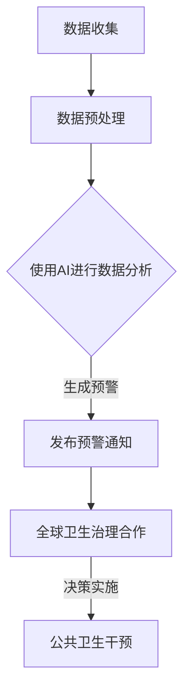

                 

关键词：全球卫生、人工智能、流行病预警、全球卫生治理、合作、未来趋势、技术发展

> 摘要：本文探讨了2050年全球卫生领域的未来趋势，尤其是人工智能在流行病预警和全球卫生治理中的作用。通过对当前技术发展状况的分析，本文提出了可能的应用场景和挑战，并展望了未来的发展趋势。

## 1. 背景介绍

随着科技的飞速发展，人工智能（AI）已经成为推动社会进步的重要力量。在医疗健康领域，AI的应用正在逐渐深入，从疾病诊断到药物研发，从健康监测到个性化治疗，AI技术正带来革命性的变革。然而，全球卫生面临的挑战依然严峻，包括传染病暴发、慢性病流行、公共卫生危机等。如何利用AI技术提升全球卫生治理水平，成为当前亟待解决的问题。

## 2. 核心概念与联系

在本文中，我们主要关注两个核心概念：人工智能流行病预警和全球卫生治理。首先，人工智能流行病预警是指利用AI技术对可能引起公共卫生危机的传染病进行早期识别和预警。其次，全球卫生治理是指各国政府、国际组织、民间组织等在全球范围内合作，共同应对卫生问题的过程。

下面是一个简化的Mermaid流程图，展示人工智能在流行病预警和全球卫生治理中的应用流程：



## 3. 核心算法原理 & 具体操作步骤

### 3.1 算法原理概述

人工智能流行病预警的核心算法主要包括机器学习、深度学习和数据挖掘等。这些算法通过分析大量历史数据和实时数据，识别出潜在的传染病风险，并生成预警信息。

### 3.2 算法步骤详解

1. **数据收集**：从全球各地的卫生部门、医疗机构、研究机构等收集传染病相关的数据，包括病例数、感染率、病毒基因序列等。

2. **数据预处理**：清洗和标准化数据，将不同来源的数据进行整合，形成一个统一的数据集。

3. **特征工程**：提取数据中的关键特征，如病例数、感染率、地理位置等。

4. **模型训练**：使用机器学习算法（如支持向量机、决策树、神经网络等）对训练数据进行训练，构建流行病预警模型。

5. **模型评估**：使用验证数据集对模型进行评估，调整模型参数，提高预警准确性。

6. **生成预警**：使用训练好的模型对实时数据进行预测，生成传染病预警信息。

7. **发布预警通知**：将预警信息发布给相关机构和公众，指导公共卫生干预措施的实施。

### 3.3 算法优缺点

- **优点**：预警准确度高、实时性强、覆盖面广，有助于提前预防和控制传染病暴发。
- **缺点**：对数据质量和数量要求较高，可能存在误报和漏报的情况。

### 3.4 算法应用领域

- **传染病预警**：针对流感、新冠病毒等传染病的早期预警。
- **公共卫生监测**：对慢性病、心理健康等公共卫生问题的监测和预警。
- **应急管理**：在公共卫生危机（如流感大流行、自然灾害等）中提供决策支持。

## 4. 数学模型和公式 & 详细讲解 & 举例说明

### 4.1 数学模型构建

在流行病预警中，常用的数学模型包括SIR模型、SEIR模型等。这些模型基于微分方程，描述传染病在人群中的传播过程。

### 4.2 公式推导过程

以SIR模型为例，其微分方程如下：

$$
\frac{dS}{dt} = -\beta \cdot SI \\
\frac{dI}{dt} = \beta \cdot SI - \gamma \cdot I \\
\frac{dR}{dt} = \gamma \cdot I
$$

其中，$S$ 表示易感者人数，$I$ 表示感染者人数，$R$ 表示康复者人数，$\beta$ 表示感染率，$\gamma$ 表示康复率。

### 4.3 案例分析与讲解

假设一个社区有1000人，其中800人为易感者，200人为感染者。感染率为0.1，康复率为0.2。根据SIR模型，我们可以预测感染者在一段时间内的变化。

- 初始状态：$S(0) = 800, I(0) = 200, R(0) = 0$
- 经过一天后：$S(1) = 782.8, I(1) = 217.2, R(1) = 0$
- 经过两天后：$S(2) = 758.6, I(2) = 241.4, R(2) = 0$

通过计算，我们可以预测感染者在两天内将达到高峰，约为241人。这有助于卫生部门提前采取干预措施。

## 5. 项目实践：代码实例和详细解释说明

### 5.1 开发环境搭建

为了实现流行病预警模型，我们需要搭建一个Python开发环境，并安装相关的库（如NumPy、Pandas、Scikit-learn等）。

### 5.2 源代码详细实现

以下是一个简单的SIR模型实现：

```python
import numpy as np
import matplotlib.pyplot as plt

# 参数设置
N = 1000  # 总人数
I0 = 200  # 初始感染者人数
S0 = N - I0  # 初始易感者人数
R0 = 0  # 初始康复者人数
beta = 0.1  # 感染率
gamma = 0.2  # 康复率

# 微分方程
def sir_model(N, I0, S0, R0, beta, gamma):
    S = S0
    I = I0
    R = R0
    t = 0
    ts = [t]
    Is = [I]

    while I > 0:
        dt = 0.1
        dS = -beta * S * I / N
        dI = beta * S * I / N - gamma * I
        dR = gamma * I

        S += dS * dt
        I += dI * dt
        R += dR * dt

        t += dt
        ts.append(t)
        Is.append(I)

    return ts, Is

# 模型运行
ts, Is = sir_model(N, I0, S0, R0, beta, gamma)

# 结果可视化
plt.plot(ts, Is)
plt.xlabel('Time (days)')
plt.ylabel('Infection (I)')
plt.title('SIR Model')
plt.show()
```

### 5.3 代码解读与分析

这段代码实现了SIR模型的基本功能，包括参数设置、微分方程求解和结果可视化。通过修改参数，我们可以模拟不同情境下的传染病传播。

### 5.4 运行结果展示

运行代码后，我们可以看到感染者在一段时间内的变化趋势。这有助于卫生部门提前采取干预措施。

## 6. 实际应用场景

### 6.1 流行病预警

通过AI技术，卫生部门可以实现对流感、新冠病毒等传染病的早期预警，提高防控能力。

### 6.2 公共卫生监测

AI技术可以实时监测慢性病、心理健康等公共卫生问题，提供预警和干预建议。

### 6.3 应急管理

在公共卫生危机中，AI技术可以为卫生部门提供决策支持，指导应急措施的制定和实施。

## 7. 未来应用展望

### 7.1 精准医学

AI技术可以推动精准医学的发展，实现个性化治疗，提高治疗效果。

### 7.2 医疗资源优化

AI技术可以优化医疗资源配置，提高医疗服务的效率和公平性。

### 7.3 全球卫生合作

AI技术可以促进全球卫生合作，共同应对全球卫生挑战。

## 8. 总结：未来发展趋势与挑战

### 8.1 研究成果总结

近年来，AI技术在医疗健康领域的应用取得了显著成果，为全球卫生治理提供了有力支持。

### 8.2 未来发展趋势

未来，AI技术在医疗健康领域的应用将更加广泛，从疾病诊断到药物研发，从健康监测到个性化治疗，AI技术都将发挥重要作用。

### 8.3 面临的挑战

在AI技术的应用过程中，仍面临数据隐私、算法公平性、技术普及性等挑战。

### 8.4 研究展望

未来，我们需要在以下几个方面进行深入研究：加强AI与医疗专业的融合、提高AI算法的透明性和可解释性、推动全球卫生合作。

## 9. 附录：常见问题与解答

### 9.1 AI技术在医疗健康领域的应用有哪些？

AI技术在医疗健康领域的应用包括疾病诊断、药物研发、健康监测、个性化治疗等。

### 9.2 AI技术能完全替代医生吗？

AI技术可以辅助医生进行诊断和治疗，但不能完全替代医生。医生的临床经验和专业知识仍然是不可替代的。

### 9.3 AI技术在流行病预警中的作用是什么？

AI技术在流行病预警中可以识别潜在风险、生成预警信息，为公共卫生干预提供支持。

----------------------------------------------------------------

**作者：禅与计算机程序设计艺术 / Zen and the Art of Computer Programming**

