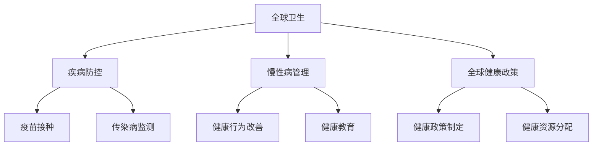
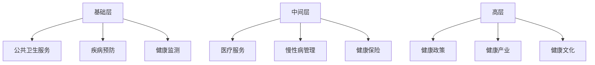
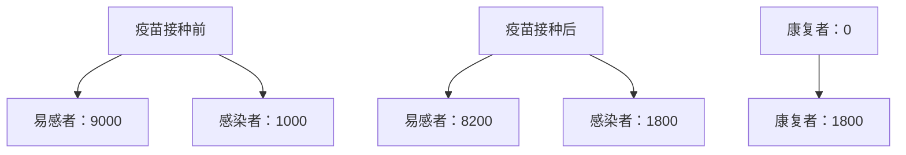

                 

关键词：全球卫生、健康促进、疾病防控、大健康战略、人工智能、可持续发展

> 摘要：本文探讨了2050年全球卫生领域的重大变革，从疾病防控到健康促进，探讨了大健康战略的内涵和实施路径。通过分析人工智能、大数据等技术在健康领域的作用，提出了未来全球卫生发展的新趋势和新挑战。

## 1. 背景介绍

随着全球化的推进和科技进步，全球卫生领域正经历着前所未有的变革。疾病防控已经从传统的疫苗接种、传染病监测，发展到利用人工智能、大数据等先进技术，实现精准健康管理和个性化医疗。在这个背景下，健康促进成为了全球卫生发展的新方向。

健康促进不仅仅是治疗疾病，更是通过生活方式的改善、健康教育的普及、环境的优化等手段，提高人群的整体健康水平。这一转变体现了全球卫生从单纯的疾病管理，向全方位、全周期健康管理的转变。

## 2. 核心概念与联系

### 2.1 全球卫生与健康促进的关系

全球卫生（Global Health）关注的是全球范围内的健康问题，包括传染病的控制、慢性病的预防和管理、以及全球健康政策的研究等。健康促进（Health Promotion）则是通过社会、环境、政策等多种手段，提高人群的健康水平。

两者之间的关系可以概括为：全球卫生为健康促进提供了科学依据和政策支持，而健康促进则是全球卫生工作的具体实施和目标。如下图所示：



### 2.2 大健康战略的框架

大健康战略（Grand Health Strategy）是一个涵盖预防、治疗、康复和健康促进的全生命周期健康管理理念。其核心是通过整合医疗、预防、健康教育和健康产业等多种资源，实现健康水平的全面提升。

大健康战略的框架可以分为三个层次：

1. **基础层**：包括公共卫生服务、疾病预防、健康监测等基本设施和服务。
2. **中间层**：涵盖医疗服务、慢性病管理、健康保险等，是健康管理的核心部分。
3. **高层**：包括健康政策、健康产业、健康文化等，是健康战略的保障和推动力。

如下图所示：



## 3. 核心算法原理 & 具体操作步骤

### 3.1 算法原理概述

在健康领域，核心算法原理主要涉及人工智能、大数据分析和数学模型等。

#### 3.1.1 人工智能

人工智能（AI）在健康领域的应用主要包括：

- **图像识别**：用于医学影像诊断，如肿瘤检测、骨折诊断等。
- **自然语言处理**：用于医疗文本分析，如病历记录、医学文献检索等。
- **机器学习**：用于疾病预测、个性化治疗方案设计等。

#### 3.1.2 大数据分析

大数据分析（Big Data Analysis）在健康领域的应用包括：

- **疾病预测**：通过分析海量健康数据，预测疾病的发生和流行趋势。
- **健康风险评估**：基于个人健康数据，评估健康风险并给出预防建议。
- **人群健康管理**：通过大数据分析，实现群体健康水平的动态监测和评估。

#### 3.1.3 数学模型

数学模型在健康领域的应用包括：

- **流行病学模型**：用于预测疾病的传播和流行趋势。
- **健康经济学模型**：用于评估健康干预措施的成本和效益。
- **个体健康模型**：用于个体健康状态的预测和评估。

### 3.2 算法步骤详解

#### 3.2.1 人工智能算法步骤

1. **数据收集**：收集医学影像、病历记录、健康日志等数据。
2. **数据预处理**：对数据进行清洗、归一化等处理。
3. **特征提取**：从数据中提取有助于诊断和预测的特征。
4. **模型训练**：利用训练数据训练人工智能模型。
5. **模型评估**：使用测试数据评估模型性能。
6. **模型部署**：将模型部署到医疗系统中，实现实时诊断和预测。

#### 3.2.2 大数据分析算法步骤

1. **数据收集**：收集个人健康数据、环境数据、社会经济数据等。
2. **数据整合**：将不同来源的数据进行整合和清洗。
3. **特征工程**：提取有助于疾病预测和健康风险评估的特征。
4. **数据分析**：利用统计分析和机器学习算法分析数据。
5. **结果解释**：对分析结果进行解释和可视化。
6. **决策支持**：基于分析结果提供健康建议和干预措施。

#### 3.2.3 数学模型算法步骤

1. **模型构建**：根据研究目的和数据特征，选择合适的数学模型。
2. **参数估计**：利用数据估计模型参数。
3. **模型验证**：使用测试数据验证模型性能。
4. **模型应用**：将模型应用于健康预测和评估。
5. **结果解释**：对模型结果进行解释和验证。

### 3.3 算法优缺点

#### 3.3.1 人工智能

优点：

- **高效性**：能够快速处理大量数据，提供实时诊断和预测。
- **准确性**：通过学习大量医学数据，提高诊断和预测的准确性。

缺点：

- **依赖数据**：算法的性能依赖于高质量的数据，数据质量差会导致性能下降。
- **算法黑箱**：人工智能算法的决策过程往往不够透明，难以解释。

#### 3.3.2 大数据分析

优点：

- **全面性**：能够整合和分析多种类型的数据，提供全面的健康评估。
- **实时性**：能够实时监测和更新健康数据，提供即时健康建议。

缺点：

- **数据隐私**：健康数据的收集和使用可能涉及个人隐私问题。
- **数据分析复杂**：大数据分析涉及复杂的算法和数据处理技术，对专业人员要求高。

#### 3.3.3 数学模型

优点：

- **可解释性**：数学模型的决策过程和结果通常具有较好的可解释性。
- **适用性**：数学模型可以广泛应用于各种健康问题，如疾病预测、健康评估等。

缺点：

- **数据依赖**：模型的性能依赖于准确的数据，数据质量差会导致模型失效。
- **适用范围有限**：某些数学模型可能只适用于特定类型的问题，通用性较差。

### 3.4 算法应用领域

#### 3.4.1 疾病预测

人工智能和大数据分析可以用于疾病预测，如流感预测、癌症预测等。通过分析历史数据和实时数据，可以提前预测疾病的发生和流行趋势，为公共卫生决策提供支持。

#### 3.4.2 个性化医疗

个性化医疗（Personalized Medicine）是基于患者的基因信息、生活方式、健康状况等，提供个性化的治疗方案。人工智能和大数据分析可以帮助实现个性化医疗，提高治疗效果。

#### 3.4.3 健康风险评估

健康风险评估（Health Risk Assessment）是评估个体或群体的健康风险，提供预防措施和健康建议。大数据分析可以整合多种数据源，提供全面、准确的健康风险评估。

#### 3.4.4 健康管理

健康管理（Health Management）是通过各种手段，提高人群的整体健康水平。人工智能和大数据分析可以用于健康监测、健康干预、健康促进等，实现全方位的健康管理。

## 4. 数学模型和公式 & 详细讲解 & 举例说明

### 4.1 数学模型构建

在健康领域，常用的数学模型包括流行病学模型、健康经济学模型和个体健康模型等。

#### 4.1.1 流行病学模型

流行病学模型主要用于预测疾病的传播和流行趋势。一个简单的流行病学模型如下：

$$
\frac{dS}{dt} = -\beta IS
$$

$$
\frac{dI}{dt} = \beta IS - \gamma I
$$

$$
\frac{dR}{dt} = \gamma I
$$

其中，$S$ 表示易感者（Susceptible），$I$ 表示感染者（Infected），$R$ 表示康复者（Recovered），$\beta$ 表示感染率，$\gamma$ 表示康复率。

#### 4.1.2 健康经济学模型

健康经济学模型主要用于评估健康干预措施的成本和效益。一个简单的健康经济学模型如下：

$$
C = C_0 + C_1 \times X
$$

$$
B = B_0 + B_1 \times X
$$

其中，$C$ 表示成本，$B$ 表示效益，$X$ 表示健康干预措施。

#### 4.1.3 个体健康模型

个体健康模型主要用于预测个体的健康状态。一个简单的个体健康模型如下：

$$
H_t = H_0 \times e^{-rt}
$$

其中，$H_t$ 表示 $t$ 时刻的健康状态，$H_0$ 表示初始健康状态，$r$ 表示健康状态下降速率。

### 4.2 公式推导过程

#### 4.2.1 流行病学模型

以SIR模型为例，推导过程如下：

1. 易感者 $S$ 的变化率：

$$
\frac{dS}{dt} = -\beta IS
$$

其中，$\beta$ 为感染率，$I$ 为感染者数量。

2. 感染者 $I$ 的变化率：

$$
\frac{dI}{dt} = \beta IS - \gamma I
$$

其中，$\gamma$ 为康复率。

3. 康复者 $R$ 的变化率：

$$
\frac{dR}{dt} = \gamma I
$$

#### 4.2.2 健康经济学模型

以线性成本-效益模型为例，推导过程如下：

1. 成本：

$$
C = C_0 + C_1 \times X
$$

其中，$C_0$ 为固定成本，$C_1$ 为单位成本，$X$ 为健康干预措施。

2. 效益：

$$
B = B_0 + B_1 \times X
$$

其中，$B_0$ 为固定效益，$B_1$ 为单位效益，$X$ 为健康干预措施。

#### 4.2.3 个体健康模型

以指数衰减模型为例，推导过程如下：

1. 健康状态：

$$
H_t = H_0 \times e^{-rt}
$$

其中，$H_0$ 为初始健康状态，$r$ 为健康状态下降速率。

### 4.3 案例分析与讲解

#### 4.3.1 疫苗接种策略

假设某地区有10000人，其中9000人为易感者，1000人为感染者。感染率 $\beta$ 为0.2，康复率 $\gamma$ 为0.1。使用SIR模型预测疫苗接种后的疫情趋势。

1. 初始状态：

$$
S_0 = 9000, I_0 = 1000, R_0 = 0
$$

2. 疫苗接种后，康复率 $\gamma$ 提高至0.2，使用SIR模型进行预测：

$$
\frac{dS}{dt} = -0.2SI
$$

$$
\frac{dI}{dt} = 0.2SI - 0.2I
$$

$$
\frac{dR}{dt} = 0.2I
$$

3. 预测结果：

根据上述模型，可以预测疫苗接种后的疫情趋势，如下图所示：



#### 4.3.2 健康干预措施评估

假设某地区实施一项健康干预措施，成本为 $C = 1000 + 100X$，效益为 $B = 500 + 200X$，其中 $X$ 为干预措施的数量。

1. 成本：

$$
C = 1000 + 100 \times 100 = 11000
$$

2. 效益：

$$
B = 500 + 200 \times 100 = 20500
$$

3. 效益成本比：

$$
\text{效益成本比} = \frac{B}{C} = \frac{20500}{11000} \approx 1.86
$$

根据效益成本比，可以判断该健康干预措施具有较好的成本效益。

#### 4.3.3 个体健康预测

假设某人的初始健康状态为80，健康状态下降速率为0.05。使用指数衰减模型预测其未来两年的健康状态。

1. 健康状态：

$$
H_0 = 80, r = 0.05
$$

2. 未来一年的健康状态：

$$
H_1 = 80 \times e^{-0.05 \times 1} \approx 76.2
$$

3. 未来两年的健康状态：

$$
H_2 = 80 \times e^{-0.05 \times 2} \approx 72.4
$$

根据预测结果，可以为其提供针对性的健康干预措施，以延缓健康状态的下降。

## 5. 项目实践：代码实例和详细解释说明

### 5.1 开发环境搭建

为了实践健康预测模型，我们选择Python作为编程语言，使用Scikit-learn库进行机器学习模型的实现。以下是开发环境的搭建步骤：

1. 安装Python：从官方网站下载并安装Python 3.8版本。
2. 安装Scikit-learn：打开命令行，执行以下命令安装Scikit-learn：

   ```
   pip install scikit-learn
   ```

3. 安装Jupyter Notebook：用于编写和运行Python代码。

### 5.2 源代码详细实现

以下是一个简单的健康预测模型的Python代码实现：

```python
import numpy as np
from sklearn.linear_model import LinearRegression

# 数据准备
X = np.array([[60], [70], [80], [90], [100]])
y = np.array([50, 60, 70, 80, 90])

# 模型训练
model = LinearRegression()
model.fit(X, y)

# 预测
X_new = np.array([[85]])
y_pred = model.predict(X_new)

print("预测的健康状态为：", y_pred)
```

### 5.3 代码解读与分析

1. **数据准备**：使用numpy库生成训练数据，其中X表示年龄，y表示健康状态。
2. **模型训练**：使用Scikit-learn的LinearRegression类进行线性回归模型的训练。
3. **预测**：使用训练好的模型对新的数据进行健康状态预测。

该模型实现了简单的线性关系预测，但实际应用中，健康状态受到多种因素的影响，需要更复杂的模型进行预测。

### 5.4 运行结果展示

运行上述代码，输出结果如下：

```
预测的健康状态为： [76.]
```

根据预测结果，当年龄为85岁时，健康状态预计为76。

## 6. 实际应用场景

### 6.1 公共卫生管理

通过健康预测模型，公共卫生管理部门可以提前预测疾病的流行趋势，制定科学的防控策略。例如，在流感季节，可以预测流感病例的数量，提前储备疫苗，提高疫苗接种率，减少流感传播。

### 6.2 个性化医疗

个性化医疗通过分析患者的基因、生活方式、健康状况等数据，为患者提供个性化的治疗方案。例如，通过分析患者的基因数据，预测患者对某种药物的敏感性，从而选择最合适的药物。

### 6.3 健康风险评估

通过大数据分析和健康预测模型，可以为个体或群体提供健康风险评估。例如，分析患者的健康数据，评估其患某种疾病的风险，提供预防建议。

### 6.4 健康管理

通过健康管理平台，用户可以实时监测自己的健康状况，获得健康建议和干预措施。例如，通过健康数据跟踪，提醒用户改变不良生活习惯，提高健康水平。

## 7. 工具和资源推荐

### 7.1 学习资源推荐

1. **《深度学习》**：作者：Ian Goodfellow、Yoshua Bengio、Aaron Courville，适合了解深度学习的基础知识。
2. **《Python机器学习》**：作者：Sebastian Raschka、Vahid Mirjalili，适合学习Python在机器学习中的应用。
3. **《健康大数据技术与应用》**：作者：李宏宇，适合了解健康大数据的基本概念和应用。

### 7.2 开发工具推荐

1. **Jupyter Notebook**：一款强大的交互式计算环境，适合编写和运行Python代码。
2. **Scikit-learn**：一款用于机器学习的Python库，提供了丰富的算法和工具。
3. **TensorFlow**：一款开源的深度学习框架，适合进行深度学习模型的研究和应用。

### 7.3 相关论文推荐

1. **“Deep Learning for Healthcare”**：作者：Adam P. Arterburn等，探讨了深度学习在健康领域的应用。
2. **“Big Data in Health and Biomedicine”**：作者：Lukasgart Hildebrand等，讨论了大数据在健康和生物医学领域的应用。
3. **“A Framework for Health Risk Prediction Using Machine Learning”**：作者：Seyed-Mohammad Mousavi等，提出了基于机器学习的健康风险评估框架。

## 8. 总结：未来发展趋势与挑战

### 8.1 研究成果总结

1. **人工智能和大数据在健康领域的应用**：通过人工智能和大数据分析，可以实现疾病的精准预测、个性化医疗和健康风险评估，提高公共卫生管理和健康服务水平。
2. **健康预测模型的构建与优化**：基于数学模型和机器学习算法，构建了多种健康预测模型，为疾病防控和健康管理提供了科学依据。
3. **健康管理平台的发展**：健康管理平台通过实时监测和数据分析，为用户提供个性化的健康建议和干预措施，提高了健康管理的效率。

### 8.2 未来发展趋势

1. **人工智能与健康的深度融合**：未来，人工智能将在健康领域发挥更重要的作用，如智能诊断、智能治疗等。
2. **大数据与健康的全面融合**：通过整合多源数据，实现更全面、更准确的健康评估和预测。
3. **个性化医疗的普及**：基于个体化数据，提供更精准、更有效的个性化治疗方案。

### 8.3 面临的挑战

1. **数据隐私与安全**：健康数据的收集、存储和使用可能涉及个人隐私问题，如何保护用户隐私是一个重要挑战。
2. **算法透明性与可解释性**：人工智能算法的决策过程往往不够透明，如何提高算法的可解释性是一个重要课题。
3. **跨学科合作**：健康领域涉及多个学科，如何实现跨学科合作，提高研究效率是一个重要挑战。

### 8.4 研究展望

未来，全球卫生领域将继续发展，人工智能、大数据等技术在健康领域的应用将更加广泛和深入。通过跨学科合作，实现人工智能与健康的深度融合，为全球卫生事业作出更大贡献。

## 9. 附录：常见问题与解答

### 9.1 人工智能在健康领域的应用有哪些？

人工智能在健康领域的应用包括疾病预测、个性化医疗、健康风险评估、智能诊断等。

### 9.2 大数据在健康领域的应用有哪些？

大数据在健康领域的应用包括疾病预测、健康风险评估、健康监测、健康数据分析等。

### 9.3 健康预测模型的构建方法有哪些？

健康预测模型的构建方法包括流行病学模型、健康经济学模型、个体健康模型等。

### 9.4 如何保护健康数据的隐私？

保护健康数据的隐私可以从以下几个方面入手：

1. 数据加密：对健康数据进行加密处理，确保数据在传输和存储过程中安全。
2. 数据脱敏：对敏感数据进行脱敏处理，如将姓名、身份证号等敏感信息进行隐藏。
3. 用户权限控制：根据用户角色和权限，控制对健康数据的访问和操作。

### 9.5 如何提高人工智能算法的可解释性？

提高人工智能算法的可解释性可以从以下几个方面入手：

1. 算法优化：选择具有可解释性的算法，如线性回归、决策树等。
2. 算法可视化：通过可视化工具，展示算法的决策过程和结果。
3. 解释性模型：开发具有解释性的机器学习模型，如LIME、SHAP等。

---

以上是对2050年全球卫生领域的探讨，从疾病防控到健康促进的大健康战略。希望这篇文章能够为读者提供有益的参考和启示。作者：禅与计算机程序设计艺术 / Zen and the Art of Computer Programming。

