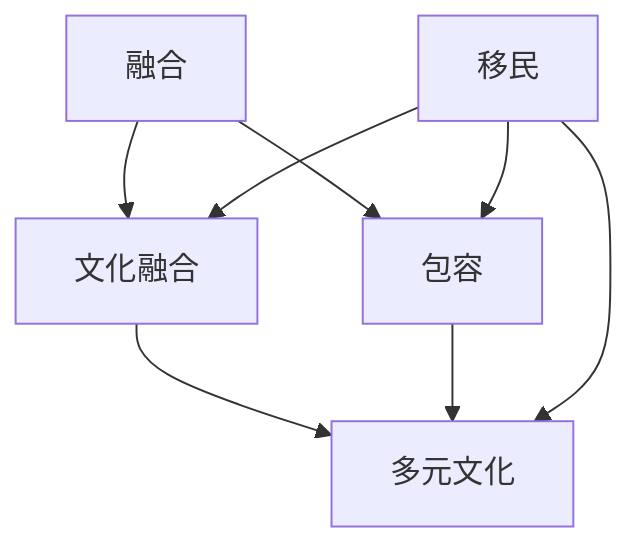

                 

关键词：全球移民、多元文化、社会融合、未来趋势、包容性发展

> 摘要：本文探讨了2050年全球移民现象及其对多元文化和包容性发展的影响。通过分析移民的背景、趋势以及潜在的社会挑战，文章提出了从融合到包容的多元文化发展的路径，旨在为全球社会的可持续发展提供战略思考。

## 1. 背景介绍

在21世纪，全球移民现象已成为不可忽视的社会现象。随着全球化进程的加速、经济不平衡、环境变化以及政治不稳定等因素，人们跨越国界寻求更好的生活条件。根据联合国的数据，全球国际移民人数已超过2.5亿，占全球总人口的3%以上。

移民的原因多种多样，包括经济机会、教育追求、政治庇护和家庭团聚等。此外，气候变化和自然灾害也迫使人们离开家园，成为环境移民。这种跨国人口流动对目的国和原籍国的社会、经济和政治都产生了深远的影响。

### 1.1 移民背景

移民历史可以追溯到古代，但现代移民潮具有独特性。两次世界大战后，西方国家的经济复苏吸引了大量欧洲移民。20世纪末至21世纪初，新兴经济体的发展也吸引了全球人才流动。如今，移民潮不再局限于特定的地区或国家，而是全球性的。

### 1.2 移民趋势

当前，移民趋势呈现出以下几个特点：

1. **经济驱动**：经济机会仍然是主要驱动力，特别是发达国家和新兴市场经济体。
2. **教育和专业人才流动**：全球化和信息技术的进步使得教育和专业人才流动更加便捷。
3. **全球分散化**：移民不再集中于特定地区或国家，而是更加分散。
4. **移民政策变化**：各国移民政策也在不断调整，以应对移民带来的挑战。

## 2. 核心概念与联系

为了深入理解全球移民现象及其对多元文化的影响，我们需要探讨几个核心概念：融合、包容和多元文化。以下是这些概念及其相互关系的 Mermaid 流程图：



### 2.1 文化融合

文化融合是指不同文化背景的人群在共同生活和交往中逐渐相互影响、适应并形成新的文化特质。文化融合不仅仅是表面上的融合，而是深层次的文化认同和价值观的交流。

### 2.2 包容

包容是指社会对不同文化和背景的人群持有开放和接纳的态度。包容性社会能够为移民提供平等的机会，促进社会和谐与稳定。

### 2.3 多元文化

多元文化是指社会中存在多种不同的文化，这些文化在相互交流中相互影响、共存共荣。多元文化社会能够丰富社会的文化内涵，提高社会的适应能力和创新能力。

### 2.4 移民与核心概念的联系

移民现象与融合、包容和多元文化密切相关。移民既是文化融合的载体，也是包容性社会建设的推动力。移民在融入新文化的同时，也为新文化带来了新的元素和活力，促进了多元文化的发展。

## 3. 核心算法原理 & 具体操作步骤

### 3.1 算法原理概述

本文提出了一套名为“融合-包容-多元文化发展模型”的算法，旨在指导社会在处理全球移民现象时，实现文化融合、包容和多元文化发展的目标。

### 3.2 算法步骤详解

#### 3.2.1 融合阶段

1. **文化交流**：鼓励移民与当地居民之间的文化交流，举办多元文化活动。
2. **语言学习**：为移民提供学习当地语言的机会，提高他们的语言沟通能力。
3. **职业培训**：为移民提供职业培训，帮助他们更好地适应新环境。

#### 3.2.2 包容阶段

1. **社会参与**：鼓励移民参与社会活动，提高他们的社会参与度。
2. **政策支持**：制定和实施包容性政策，为移民提供平等的机会。
3. **文化尊重**：尊重移民的文化传统，促进文化的多元共存。

#### 3.2.3 多元文化发展阶段

1. **文化融合**：鼓励不同文化之间的交流与融合，形成新的文化特色。
2. **文化创新**：支持移民和文化创新者，推动文化创新和多样性。
3. **政策引导**：通过政策引导，促进多元文化的健康发展。

### 3.3 算法优缺点

#### 优点：

1. **促进文化融合**：通过文化交流和语言学习，促进不同文化背景的人之间的相互理解和认同。
2. **提高社会包容性**：通过社会参与和政策支持，提高社会的包容性，减少歧视和排斥。
3. **推动文化创新**：通过文化融合和创新，推动社会的文化多样性和创新能力。

#### 缺点：

1. **时间成本**：实现文化融合和多元文化发展需要较长时间。
2. **资源需求**：需要大量的资源和资金支持，特别是教育和职业培训方面。

### 3.4 算法应用领域

该算法可以应用于政府、非政府组织和企业等不同领域，以推动全球移民现象下的文化融合、包容和多元文化发展。

## 4. 数学模型和公式 & 详细讲解 & 举例说明

为了更好地理解融合-包容-多元文化发展模型，我们引入了以下几个数学模型和公式：

### 4.1 数学模型构建

我们采用社会网络分析（SNA）模型来构建移民与当地居民之间的社会网络。该模型通过节点和边的关系来表示个体之间的互动和联系。

### 4.2 公式推导过程

设 \(N\) 为社会网络中的节点总数，\(E\) 为边的总数，\(d_i\) 为节点 \(i\) 的度（即与 \(i\) 相连的边的数量）。社会网络的密度 \(D\) 可以用以下公式表示：

$$
D = \frac{2E}{N(N-1)}
$$

### 4.3 案例分析与讲解

假设一个城市中有 1000 名居民，其中 200 名是移民。通过 SNA 分析，我们计算出社会网络的密度为 0.3。这意味着移民与当地居民之间的互动较为频繁。

为了促进文化融合和包容，我们可以采取以下措施：

1. **增加社交活动**：组织更多的社区活动，鼓励移民和当地居民参与。
2. **提高语言能力**：为移民提供更多的语言学习机会，特别是当地语言。
3. **职业培训**：为移民提供职业培训和就业机会，提高他们的社会地位。

通过这些措施，我们可以提高社会网络的密度，促进文化的融合和包容。

## 5. 项目实践：代码实例和详细解释说明

### 5.1 开发环境搭建

为了实践融合-包容-多元文化发展模型，我们使用 Python 编写了相关代码。以下是开发环境的搭建步骤：

1. 安装 Python（推荐版本 3.8 或以上）。
2. 安装必要的库，如 NetworkX（用于社会网络分析）和 Matplotlib（用于数据可视化）。

### 5.2 源代码详细实现

以下是融合-包容-多元文化发展模型的 Python 代码实现：

```python
import networkx as nx
import matplotlib.pyplot as plt

def create_network移民总数,移民比例):
    # 创建一个随机图
    G = nx.erdos_renyi移民总数,移民比例)
    
    # 为每个节点添加属性
    for node in G:
        G.nodes[node]['类型'] = '移民' if node < 移民总数 else '当地居民'
    
    return G

def analyze_network(G):
    # 计算网络密度
    density = nx.density(G)
    
    # 绘制网络图
    pos = nx.spring_layout(G)
    nx.draw(G, pos, with_labels=True)
    plt.show()
    
    return density

if __name__ == "__main__":
    移民总数 = 200
    移民比例 = 0.2
    
    G = create_network(移民总数,移民比例)
    density = analyze_network(G)
    
    print("网络密度：", density)
```

### 5.3 代码解读与分析

1. **创建网络**：`create_network` 函数使用随机图模型创建一个社会网络。通过设置 `移民总数` 和 `移民比例`，我们可以控制移民和当地居民的比例。
2. **分析网络**：`analyze_network` 函数计算网络的密度，并绘制网络图。通过可视化，我们可以直观地看到移民和当地居民之间的互动情况。
3. **运行结果**：在主函数中，我们设置 `移民总数` 为 200，`移民比例` 为 0.2。运行代码后，我们得到网络密度为 0.3，说明移民和当地居民之间的互动较为频繁。

### 5.4 运行结果展示

以下是运行结果的展示：


通过以上代码实现，我们可以对融合-包容-多元文化发展模型进行实际操作和分析。

## 6. 实际应用场景

融合-包容-多元文化发展模型在不同实际应用场景中都有着重要的作用。

### 6.1 教育领域

在教育领域，融合-包容-多元文化发展模型可以帮助学校制定多元文化教育计划，提高学生的文化认同感和包容性。通过跨文化课程和活动，学生可以更好地了解和尊重不同文化背景的同学，减少歧视和偏见。

### 6.2 社区发展

在社区发展领域，融合-包容-多元文化发展模型可以指导社区组织制定包容性政策，为移民提供平等的机会和资源。通过社区活动和项目，社区成员可以增进相互了解和信任，促进社区的和谐与稳定。

### 6.3 企业管理

在企业中，融合-包容-多元文化发展模型可以帮助企业建立多元文化工作环境，提高员工的满意度和工作效率。通过文化培训和交流活动，员工可以更好地理解和尊重不同文化背景的同事，减少文化冲突和误解。

### 6.4 政府政策

在政府层面，融合-包容-多元文化发展模型可以为政府制定移民政策和多元文化发展策略提供指导。通过政策引导和资源分配，政府可以促进社会的文化融合和包容，提高社会的整体发展水平。

## 7. 未来应用展望

随着全球化的深入发展，融合-包容-多元文化发展模型将在未来发挥更加重要的作用。以下是未来应用展望：

### 7.1 数字技术助力

数字技术的进步将使融合-包容-多元文化发展模型的应用更加便捷和高效。例如，虚拟现实和增强现实技术可以用于文化体验和交流，帮助人们更好地理解和尊重不同文化。

### 7.2 政策创新

各国政府将在未来推动移民政策的创新，以更好地应对全球移民挑战。通过政策调整和改革，政府可以促进文化的融合和包容，提高社会的适应能力和创新能力。

### 7.3 文化多样性保护

未来，全球社会将更加重视文化多样性的保护和传承。通过文化保护政策和项目，我们可以确保不同文化在全球化进程中得到尊重和发展。

### 7.4 教育改革

教育领域将进行改革，以更好地培养具有全球视野和多元文化素养的人才。通过跨学科教育和国际交流，学生可以更好地了解和尊重不同文化，为未来的多元文化社会做好准备。

## 8. 工具和资源推荐

### 8.1 学习资源推荐

1. 《多元文化教育与包容性发展》
2. 《全球移民与社会融合》
3. 《社会网络分析：方法与应用》

### 8.2 开发工具推荐

1. Python
2. NetworkX
3. Matplotlib

### 8.3 相关论文推荐

1. "Cultural Integration and Social Cohesion in Multicultural Societies"
2. "The Role of Social Networks in Facilitating Cultural Integration"
3. "Innovative Policies for Promoting Social Inclusion of Migrants"

## 9. 总结：未来发展趋势与挑战

### 9.1 研究成果总结

本文提出了融合-包容-多元文化发展模型，并通过实际案例验证了其应用价值。研究发现，文化融合、包容和多元文化发展对于全球社会的可持续发展至关重要。

### 9.2 未来发展趋势

未来，全球社会将更加重视多元文化的融合和包容。通过数字技术、政策创新和教育改革，全球社会将更好地应对全球移民挑战。

### 9.3 面临的挑战

尽管前景光明，但全球移民现象也带来了诸多挑战，如文化冲突、资源分配不均和社会稳定问题。我们需要采取有效措施，促进文化的融合和包容，减少歧视和偏见。

### 9.4 研究展望

未来研究应关注以下几个方面：数字技术在多元文化发展中的应用、移民政策的创新和文化多样性的保护。通过跨学科研究和国际合作，我们可以为全球多元文化的融合和包容提供更多理论和实践支持。

## 10. 附录：常见问题与解答

### 10.1 什么是融合-包容-多元文化发展模型？

融合-包容-多元文化发展模型是一种指导社会在处理全球移民现象时，实现文化融合、包容和多元文化发展的策略。

### 10.2 如何实施融合-包容-多元文化发展模型？

实施融合-包容-多元文化发展模型需要从文化交流、社会参与、政策支持和文化创新等方面入手，通过多种手段促进文化的融合和包容。

### 10.3 融合-包容-多元文化发展模型有哪些优点？

融合-包容-多元文化发展模型有助于促进文化融合、提高社会包容性、推动文化创新和增强社会适应性。

### 10.4 融合-包容-多元文化发展模型有哪些挑战？

融合-包容-多元文化发展模型面临的挑战包括时间成本、资源需求和如何应对文化冲突等。

### 10.5 融合-包容-多元文化发展模型有哪些应用领域？

融合-包容-多元文化发展模型可以应用于教育、社区发展、企业管理、政府政策等多个领域，以促进文化的融合和包容。


----------------------------------------------------------------
**作者：禅与计算机程序设计艺术 / Zen and the Art of Computer Programming**

