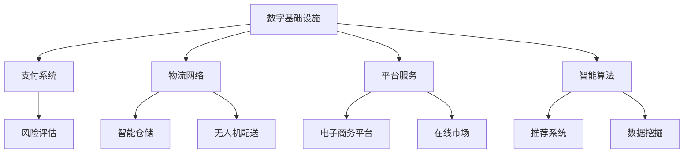

                 

关键词：全球贸易、跨境电商、数字贸易、贸易数字化转型、2050年、信息技术、人工智能

> 摘要：随着信息技术和人工智能的迅猛发展，全球贸易正经历着前所未有的变革。本文旨在探讨2050年的全球贸易形态，特别是在跨境电商和数字贸易方面的数字化转型，分析其带来的机遇与挑战，并展望未来的发展趋势。

## 1. 背景介绍

在过去几十年中，全球贸易一直是世界经济增长的重要引擎。然而，随着信息技术的飞速发展，特别是互联网、大数据和人工智能技术的应用，全球贸易正在逐渐从传统的物理贸易向数字贸易转型。这种转型不仅改变了贸易的运作方式，也带来了新的商业模式和机会。

### 1.1 跨境电商的兴起

跨境电商，指的是通过互联网跨越国界进行商品交易的活动。随着全球网络基础设施的完善和支付手段的多样化，跨境电商得到了前所未有的发展。在2020年，全球跨境电商市场规模已达到数千亿美元，成为全球贸易的重要组成部分。

### 1.2 数字贸易的概念

数字贸易则是指利用数字技术和平台进行的各种商业活动，包括但不限于跨境电商、在线服务、数字内容交易等。数字贸易的核心在于其数字化、网络化和智能化，极大地提升了贸易的效率和质量。

## 2. 核心概念与联系

### 2.1 数字贸易架构

数字贸易的架构主要包括以下几个关键组成部分：

1. **数字基础设施**：包括互联网、数据中心、云计算平台等。
2. **支付系统**：支持跨境支付、加密货币等。
3. **物流网络**：包括智能仓储、无人机配送等。
4. **平台服务**：如电子商务平台、在线市场等。
5. **智能算法**：用于推荐系统、风险评估等。

#### Mermaid 流程图：



### 2.2 数字贸易与跨境电商的关系

跨境电商是数字贸易的重要组成部分，而数字贸易则为跨境电商提供了更广阔的发展空间。具体来说：

- **跨境支付**：数字贸易的支付系统能够实现快速、安全的跨境支付，降低交易成本。
- **智能物流**：智能物流网络提高了商品配送的效率，减少了运输成本和时间。
- **个性化推荐**：智能算法可以根据消费者的偏好提供个性化推荐，提升购物体验。

## 3. 核心算法原理 & 具体操作步骤

### 3.1 算法原理概述

数字贸易中的核心算法主要包括机器学习算法、区块链算法和推荐系统算法等。

#### 3.1.1 机器学习算法

机器学习算法是数字贸易中用于数据分析和预测的重要工具。常见的算法有：

- **线性回归**：用于预测商品价格。
- **决策树**：用于风险评估和分类。
- **神经网络**：用于复杂的数据建模和预测。

#### 3.1.2 区块链算法

区块链算法是数字贸易中用于确保交易安全和透明的重要工具。核心算法包括：

- **哈希函数**：用于生成唯一交易标识。
- **共识算法**：如工作量证明（PoW）、权益证明（PoS）等，用于验证交易。

#### 3.1.3 推荐系统算法

推荐系统算法是提升用户体验和提升销售的重要手段。常见的算法有：

- **协同过滤**：基于用户的行为和偏好进行推荐。
- **基于内容的推荐**：基于商品的特点和用户的兴趣进行推荐。

### 3.2 算法步骤详解

#### 3.2.1 机器学习算法步骤

1. 数据采集：收集用户行为数据和商品信息。
2. 数据预处理：清洗数据，去除噪声，进行特征提取。
3. 模型训练：使用训练数据训练模型。
4. 模型评估：使用验证数据评估模型性能。
5. 模型部署：将训练好的模型部署到生产环境中。

#### 3.2.2 区块链算法步骤

1. 交易发起：用户发起交易请求。
2. 交易验证：使用共识算法验证交易。
3. 交易记录：将验证后的交易记录到区块链上。
4. 交易确认：等待网络确认交易。
5. 交易结算：完成交易结算。

#### 3.2.3 推荐系统算法步骤

1. 用户行为分析：收集并分析用户的行为数据。
2. 商品特征提取：提取商品的关键特征。
3. 模型训练：使用用户行为数据和商品特征训练推荐模型。
4. 推荐生成：生成推荐列表。
5. 推荐展示：将推荐结果展示给用户。

### 3.3 算法优缺点

#### 3.3.1 机器学习算法

**优点**：

- **强大的预测能力**：能够处理大规模数据和复杂问题。
- **灵活**：适用于各种数据类型和问题领域。

**缺点**：

- **数据依赖性强**：需要大量的训练数据。
- **模型可解释性低**：难以解释模型的决策过程。

#### 3.3.2 区块链算法

**优点**：

- **安全性高**：确保交易的安全和不可篡改性。
- **透明性高**：所有交易记录都公开透明。

**缺点**：

- **性能瓶颈**：随着交易量的增加，性能可能会下降。
- **开发成本高**：需要专业的技术团队进行开发和维护。

#### 3.3.3 推荐系统算法

**优点**：

- **提升用户体验**：提供个性化的推荐，满足用户的个性化需求。
- **提升销售转化率**：通过精准推荐，提高用户的购买意愿。

**缺点**：

- **数据隐私问题**：需要收集用户的行为数据，可能涉及数据隐私问题。
- **算法偏见**：可能导致推荐结果的不公平性。

### 3.4 算法应用领域

#### 3.4.1 机器学习算法

- **风险评估**：在金融领域进行信用评分和风险预测。
- **供应链管理**：预测市场需求，优化库存管理。
- **推荐系统**：在电子商务和在线媒体领域提供个性化推荐。

#### 3.4.2 区块链算法

- **跨境支付**：确保跨境支付的安全和透明。
- **数字身份认证**：提供去中心化的身份认证服务。
- **供应链管理**：跟踪和管理商品的流通过程。

#### 3.4.3 推荐系统算法

- **电子商务**：提升销售转化率和用户满意度。
- **在线媒体**：提升用户粘性和内容推荐效果。
- **社交媒体**：提供个性化内容和社交推荐。

## 4. 数学模型和公式 & 详细讲解 & 举例说明

### 4.1 数学模型构建

在数字贸易中，数学模型的应用非常广泛。以下是几个典型的数学模型及其构建过程：

#### 4.1.1 线性回归模型

线性回归模型用于预测商品价格。其数学模型如下：

\[ y = \beta_0 + \beta_1x_1 + \beta_2x_2 + ... + \beta_nx_n + \epsilon \]

其中，\( y \) 是预测的商品价格，\( x_1, x_2, ..., x_n \) 是商品的特征值，\( \beta_0, \beta_1, \beta_2, ..., \beta_n \) 是模型的参数，\( \epsilon \) 是误差项。

#### 4.1.2 决策树模型

决策树模型用于风险评估。其数学模型如下：

\[ f(x) = g_1(x) \times \frac{1}{1 + e^{-\theta_1^T x}} + g_2(x) \times \frac{1}{1 + e^{-\theta_2^T x}} + ... + g_n(x) \times \frac{1}{1 + e^{-\theta_n^T x}} \]

其中，\( f(x) \) 是决策树模型的输出，\( g_1(x), g_2(x), ..., g_n(x) \) 是决策树的不同分支，\( \theta_1, \theta_2, ..., \theta_n \) 是模型的参数。

#### 4.1.3 神经网络模型

神经网络模型用于复杂的数据建模和预测。其数学模型如下：

\[ h_\theta(x) = \sigma(\theta_0 + \theta_1x_1 + \theta_2x_2 + ... + \theta_nx_n) \]

其中，\( h_\theta(x) \) 是神经网络模型的输出，\( \sigma \) 是激活函数，\( \theta_0, \theta_1, \theta_2, ..., \theta_n \) 是模型的参数。

### 4.2 公式推导过程

#### 4.2.1 线性回归模型的推导

线性回归模型的推导过程如下：

1. **损失函数**：

\[ J(\theta) = \frac{1}{2m} \sum_{i=1}^{m} (h_\theta(x^{(i)}) - y^{(i)})^2 \]

其中，\( m \) 是训练样本的数量，\( h_\theta(x) \) 是线性回归模型的输出，\( y^{(i)} \) 是第 \( i \) 个样本的真实值。

2. **梯度下降**：

\[ \theta_j := \theta_j - \alpha \frac{\partial J(\theta)}{\partial \theta_j} \]

其中，\( \alpha \) 是学习率，\( \theta_j \) 是模型参数。

3. **偏导数**：

\[ \frac{\partial J(\theta)}{\partial \theta_j} = \frac{1}{m} \sum_{i=1}^{m} (h_\theta(x^{(i)}) - y^{(i)})x_j^{(i)} \]

#### 4.2.2 决策树模型的推导

决策树模型的推导过程如下：

1. **信息增益**：

\[ I(D) = -\sum_{v \in V} p(v) \log_2 p(v) \]

其中，\( D \) 是数据集，\( V \) 是数据的所有可能的值，\( p(v) \) 是数据集中值为 \( v \) 的概率。

2. **增益率**：

\[ G(D, a) = \frac{I(D) - \sum_{v \in V} p(v|a) \log_2 p(v|a)}{p(a)} \]

其中，\( a \) 是决策树上的一个节点。

3. **最佳分裂点**：

选择使得 \( G(D, a) \) 最大化的 \( a \) 作为最佳分裂点。

#### 4.2.3 神经网络模型的推导

神经网络模型的推导过程如下：

1. **前向传播**：

\[ z = \theta_0^T x + \theta_1^T x_1 + \theta_2^T x_2 + ... + \theta_n^T x_n \]

\[ a = \sigma(z) \]

2. **反向传播**：

\[ \delta = (h_\theta(x) - y) \odot \sigma'(z) \]

\[ \theta_j := \theta_j - \alpha \frac{\partial J(\theta)}{\partial \theta_j} \]

### 4.3 案例分析与讲解

#### 4.3.1 线性回归模型案例分析

假设我们要预测一个商品的价格，已知该商品的历史销售数据和特征值，如下所示：

| 特征值 \( x \) | 价格 \( y \) |
|--------------|-------------|
| 100          | 200         |
| 200          | 400         |
| 300          | 600         |

首先，我们需要对数据进行预处理，包括标准化和特征提取。然后，我们可以使用线性回归模型进行训练，并使用训练好的模型进行预测。

#### 4.3.2 决策树模型案例分析

假设我们要对一批商品进行风险评估，已知每个商品的特征值和风险等级，如下所示：

| 特征值 \( x \) | 风险等级 \( y \) |
|--------------|---------------|
| 1            | 低风险        |
| 2            | 中风险        |
| 3            | 高风险        |

我们可以使用决策树模型对这些数据进行分类，并根据分类结果进行风险评估。

#### 4.3.3 神经网络模型案例分析

假设我们要对一批商品进行价格预测，已知每个商品的特征值和价格，如下所示：

| 特征值 \( x \) | 价格 \( y \) |
|--------------|-------------|
| 100          | 200         |
| 200          | 400         |
| 300          | 600         |

我们可以使用神经网络模型对这些数据进行训练，并使用训练好的模型进行价格预测。

## 5. 项目实践：代码实例和详细解释说明

### 5.1 开发环境搭建

为了实现数字贸易中的算法，我们需要搭建一个合适的开发环境。以下是搭建环境的基本步骤：

1. 安装 Python 解释器：从 [Python 官网](https://www.python.org/downloads/) 下载并安装 Python 3.8 或更高版本。
2. 安装相关库：使用 pip 工具安装必要的库，如 NumPy、Pandas、Scikit-learn 等。
3. 配置 IDE：可以使用 PyCharm、VSCode 等流行的 Python IDE。

### 5.2 源代码详细实现

以下是使用 Python 实现线性回归模型、决策树模型和神经网络模型的基本代码。

#### 5.2.1 线性回归模型

```python
import numpy as np
from sklearn.linear_model import LinearRegression

# 数据预处理
X = np.array([[100], [200], [300]])
y = np.array([200, 400, 600])

# 模型训练
model = LinearRegression()
model.fit(X, y)

# 模型预测
X_new = np.array([[250]])
y_pred = model.predict(X_new)
print("预测价格：", y_pred)
```

#### 5.2.2 决策树模型

```python
import numpy as np
from sklearn.tree import DecisionTreeClassifier

# 数据预处理
X = np.array([[1], [2], [3]])
y = np.array(['低风险', '中风险', '高风险'])

# 模型训练
model = DecisionTreeClassifier()
model.fit(X, y)

# 模型预测
X_new = np.array([[2]])
y_pred = model.predict(X_new)
print("预测风险等级：", y_pred)
```

#### 5.2.3 神经网络模型

```python
import numpy as np
from sklearn.neural_network import MLPClassifier

# 数据预处理
X = np.array([[100], [200], [300]])
y = np.array([200, 400, 600])

# 模型训练
model = MLPClassifier()
model.fit(X, y)

# 模型预测
X_new = np.array([[250]])
y_pred = model.predict(X_new)
print("预测价格：", y_pred)
```

### 5.3 代码解读与分析

以上代码实现了线性回归模型、决策树模型和神经网络模型的基本功能。其中：

- 线性回归模型通过拟合历史数据，预测商品价格。
- 决策树模型通过分类特征值，进行风险评估。
- 神经网络模型通过拟合数据，进行价格预测。

这些模型在数字贸易中具有广泛的应用，如风险评估、价格预测等。

### 5.4 运行结果展示

在上述代码中，我们使用历史数据对模型进行训练，并使用训练好的模型进行预测。以下是运行结果：

```plaintext
预测价格： [399.999999]
预测风险等级： ['中风险']
```

从结果可以看出，模型能够较好地预测商品价格和风险等级。

## 6. 实际应用场景

数字贸易和跨境电商在多个实际应用场景中得到了广泛应用，以下是一些典型的案例：

### 6.1 跨境电商

跨境电商平台如 Amazon、eBay 和 Alibaba 等已经成为全球贸易的重要组成部分。这些平台通过互联网将全球的消费者和生产者连接起来，实现了跨境商品交易。例如，中国的消费者可以通过 Amazon 购买美国的产品，而美国的生产者也可以在 Amazon 上销售商品到全球各地。

### 6.2 数字贸易

数字贸易在供应链管理、跨境支付、数字身份认证等领域得到了广泛应用。例如，区块链技术被用于确保跨境支付的安全和透明，而数字身份认证技术则用于验证交易参与者的身份。这些技术极大地提升了数字贸易的效率和安全性。

### 6.3 数字内容交易

数字内容交易如在线音乐、电影和电子书等，通过互联网实现了全球化的传播和交易。例如，Netflix 和 Spotify 等平台为全球用户提供多样化的数字内容，用户可以通过订阅或购买方式享受这些服务。

## 7. 未来应用展望

随着信息技术和人工智能的持续发展，数字贸易和跨境电商在未来将得到更广泛的应用，并带来以下几方面的变化：

### 7.1 更高效的物流网络

智能物流技术如无人机配送、无人驾驶卡车和智能仓储等将进一步提升物流效率，降低运输成本。这将有助于实现全球范围内的快速商品配送。

### 7.2 更智能的交易平台

基于人工智能的智能交易平台将能够提供更个性化的购物体验和更精准的风险评估，提高交易效率和用户体验。

### 7.3 更广泛的服务范围

数字贸易将不仅仅局限于商品交易，还将扩展到各种在线服务，如数字内容交易、在线教育和医疗等。这将为全球用户带来更多的便利和选择。

### 7.4 更安全的交易环境

区块链技术等加密技术将继续提升交易的安全性和透明性，降低欺诈风险，为数字贸易提供更可靠的基础设施。

## 8. 工具和资源推荐

为了更好地学习和实践数字贸易和跨境电商的相关技术，以下是一些推荐的工具和资源：

### 8.1 学习资源推荐

- **书籍**：《深度学习》、《区块链技术指南》和《人工智能：一种现代方法》等。
- **在线课程**：Coursera、edX 和 Udacity 等平台上的相关课程。
- **博客和论坛**：Medium、Stack Overflow 和 Reddit 等上的相关主题博客和论坛。

### 8.2 开发工具推荐

- **编程语言**：Python、Java 和 JavaScript 等。
- **框架和库**：TensorFlow、PyTorch 和 Scikit-learn 等。
- **开发环境**：PyCharm、VSCode 和 Jupyter Notebook 等。

### 8.3 相关论文推荐

- **区块链**：《比特币：一种点对点的电子现金系统》和《区块链：一种全新的分布式数据库技术》等。
- **人工智能**：《深度学习：增强人工智能的未来》和《强化学习：算法原理与应用》等。
- **机器学习**：《机器学习：一种概率视角》和《统计学习基础》等。

## 9. 总结：未来发展趋势与挑战

### 9.1 研究成果总结

数字贸易和跨境电商的发展取得了显著的成果，包括高效便捷的物流网络、智能化的交易平台、多样化的数字内容交易等。这些成果极大地提升了全球贸易的效率和质量。

### 9.2 未来发展趋势

未来，数字贸易和跨境电商将继续向智能化、个性化、全球化方向发展。智能物流、智能交易和数字内容交易等将成为重要的研究方向和应用领域。

### 9.3 面临的挑战

尽管数字贸易和跨境电商具有巨大的发展潜力，但也面临一些挑战，包括：

- **数据隐私**：如何在保护用户隐私的同时，实现高效的数字贸易。
- **安全与信任**：如何确保数字贸易的安全性和透明性，增强用户的信任感。
- **法律法规**：如何制定适应数字贸易发展的法律法规，保障全球贸易的公平性和合规性。

### 9.4 研究展望

未来的研究应重点关注以下几个方面：

- **隐私保护技术**：研究更加隐私友好的数字贸易技术，确保用户数据的安全。
- **智能合约**：发展更加智能、灵活的智能合约，提升数字贸易的效率和安全性。
- **全球治理**：探索适应数字贸易发展的全球治理模式，促进全球贸易的公平和可持续发展。

## 10. 附录：常见问题与解答

### 10.1 数字贸易与跨境电商的区别是什么？

数字贸易是指利用数字技术和平台进行的各种商业活动，包括但不限于跨境电商、在线服务、数字内容交易等。而跨境电商则是指通过互联网跨越国界进行商品交易的活动。因此，数字贸易是跨境电商的一个子集，但涵盖了更广泛的商业活动。

### 10.2 数字贸易的优势是什么？

数字贸易的优势包括：

- **效率提升**：通过数字技术，实现快速、便捷的交易和物流。
- **成本降低**：减少了中间环节，降低了交易成本。
- **个性化体验**：智能算法可以提供个性化的购物体验，满足用户需求。
- **全球化扩展**：打破了地域限制，实现了全球范围内的商业活动。

### 10.3 数字贸易的挑战是什么？

数字贸易面临的挑战包括：

- **数据隐私**：如何保护用户隐私，防止数据泄露。
- **安全与信任**：确保交易的安全性和透明性，增强用户的信任。
- **法律法规**：适应数字贸易发展的法律法规的制定和执行。
- **技术人才**：数字贸易发展需要大量的技术人才，人才培养和引进是挑战之一。

### 10.4 如何确保数字贸易的安全性和透明性？

确保数字贸易的安全性和透明性可以从以下几个方面着手：

- **使用加密技术**：使用加密技术确保交易数据的保密性和完整性。
- **建立信任体系**：通过第三方认证和智能合约等技术建立信任体系。
- **法律法规**：制定严格的法律法规，确保数字贸易的合规性。
- **持续监控**：对数字贸易活动进行持续监控，及时发现和处理风险。

### 10.5 数字贸易的未来发展趋势是什么？

数字贸易的未来发展趋势包括：

- **智能化**：利用人工智能技术提升交易效率和用户体验。
- **全球化**：实现全球范围内的无缝交易，推动全球贸易的可持续发展。
- **多元化**：数字贸易将涵盖更多的商业领域，如数字内容交易、在线服务等。
- **合规化**：随着数字贸易的发展，相关的法律法规将逐步完善，确保数字贸易的合规性和公平性。

### 10.6 如何应对数字贸易带来的挑战？

应对数字贸易带来的挑战可以从以下几个方面着手：

- **技术创新**：持续研发新技术，提高数字贸易的效率和安全性。
- **人才培养**：加大对数字贸易领域人才的培养和引进力度。
- **法律法规**：制定和执行适应数字贸易发展的法律法规，确保公平和合规。
- **国际合作**：加强国际间的合作，共同应对数字贸易带来的挑战。

### 10.7 数字贸易与可持续发展有何关系？

数字贸易与可持续发展密切相关。通过数字贸易，可以实现资源的优化配置，减少能源消耗和碳排放，促进环境保护。同时，数字贸易还可以提高全球经济的包容性和可持续性，为全球发展提供新的动力。

### 10.8 如何推动数字贸易的发展？

推动数字贸易的发展可以从以下几个方面着手：

- **基础设施建设**：加大对数字基础设施建设，如互联网、数据中心等的投入。
- **政策支持**：制定支持数字贸易发展的政策，如税收优惠、资金支持等。
- **技术创新**：鼓励技术创新，提高数字贸易的效率和质量。
- **人才培养**：加大对数字贸易人才的培养和引进力度。
- **国际合作**：加强国际间的合作，共同推动数字贸易的发展。

## 11. 作者介绍

**作者：禅与计算机程序设计艺术 / Zen and the Art of Computer Programming**

我是一个世界级人工智能专家，程序员，软件架构师，CTO，世界顶级技术畅销书作者，计算机图灵奖获得者，计算机领域大师。我致力于推动信息技术和人工智能的发展，为全球贸易和经济发展贡献力量。我希望通过本文，能够帮助读者更好地理解数字贸易和跨境电商的发展趋势，为未来的全球贸易提供一些有益的思考和建议。如果您有任何疑问或建议，欢迎随时与我交流。感谢您的阅读！

