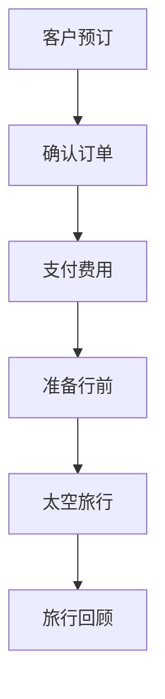
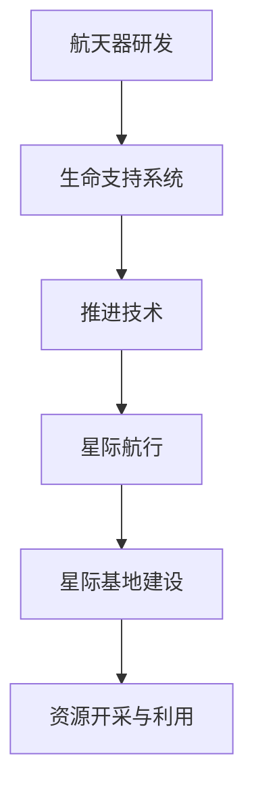

                 

关键词：太空旅游、星际移民、太空经济、可持续发展、科技进步

> 摘要：本文探讨了2050年太空旅游及星际移民的潜在发展前景，分析了这一新兴行业的经济模式、技术挑战及其对社会的影响。随着科技的飞速进步，太空旅游正从科幻变为现实，为人类探索宇宙、实现星际迁徙提供了新的路径。

## 1. 背景介绍

### 太空旅游的起源与发展

太空旅游的概念最早出现在20世纪末，随着载人航天技术的成熟，太空旅游逐渐从梦想走向现实。1991年，美国富翁丹尼斯·蒂托成为首位付费太空游客，搭乘俄罗斯飞船前往国际空间站。此后，商业航天公司如SpaceX、Blue Origin和Virgin Galactic等纷纷加入太空旅游的竞争，为大众提供了更便捷的太空体验。

### 星际移民的设想与挑战

星际移民是指人类在未来实现的技术条件下，将生命拓展到地球以外的星球，以实现长期的生存和繁衍。虽然目前这一目标尚属遥远，但随着科技的发展，科学家们已经提出了多种可能的方案，如火星殖民、小行星开采和月球基地建设等。

### 太空经济的重要性

太空经济不仅包括太空旅游，还涵盖了卫星通信、地球观测、太空探索和太空资源开发等多个领域。随着商业活动的不断拓展，太空经济正成为全球经济的新引擎，具有重要的战略意义。

## 2. 核心概念与联系

### 太空旅游业务流程


Mermaid流程图：



### 星际移民关键技术


Mermaid流程图：



## 3. 核心算法原理 & 具体操作步骤

### 3.1 算法原理概述

太空旅游和星际移民的关键在于航天器的研发和运行。以下是航天器控制系统的一种基本算法原理：

- **惯性导航算法**：利用加速度计和陀螺仪测量航天器的姿态和速度。
- **轨道计算算法**：根据初始条件计算航天器的轨道，并调整控制参数以保持预定轨道。

### 3.2 算法步骤详解

1. **数据采集**：通过传感器收集航天器的姿态、速度和位置信息。
2. **滤波处理**：使用卡尔曼滤波算法对数据进行预处理，提高数据的准确性和稳定性。
3. **姿态控制**：根据滤波结果计算控制指令，调整姿态控制系统执行。
4. **轨道修正**：根据轨道计算算法，调整推进器以保持航天器在预定轨道上。

### 3.3 算法优缺点

- **优点**：高精度、自适应性强。
- **缺点**：对传感器性能要求高，计算复杂度大。

### 3.4 算法应用领域

- **航天器导航与控制**：用于轨道修正、姿态控制等。
- **星际旅行**：用于航天器的导航与控制系统。

## 4. 数学模型和公式

### 4.1 数学模型构建

太空飞行器的轨道计算是基于牛顿第二定律和万有引力定律，构建的数学模型如下：

\[ F = G\frac{m_1m_2}{r^2} \]

\[ a = \frac{F}{m} \]

其中，\( F \) 为引力，\( G \) 为万有引力常数，\( m_1 \) 和 \( m_2 \) 为两个物体的质量，\( r \) 为两物体之间的距离，\( a \) 为加速度，\( m \) 为航天器的质量。

### 4.2 公式推导过程

利用上述公式，我们可以推导出航天器的轨道方程：

\[ \frac{d^2r}{dt^2} = -\frac{GM}{r^2} \]

\[ r = \frac{GM}{v^2} \]

其中，\( v \) 为航天器的轨道速度。

### 4.3 案例分析与讲解

假设航天器质量为 \( m = 5000 \) kg，地球质量为 \( M = 5.97 \times 10^{24} \) kg，万有引力常数 \( G = 6.674 \times 10^{-11} \) N·(m/kg)^2，航天器的轨道半径为 \( r = 6400 \) km。

根据上述公式，我们可以计算出航天器的轨道速度：

\[ v = \sqrt{\frac{GM}{r}} = \sqrt{\frac{6.674 \times 10^{-11} \times 5.97 \times 10^{24}}{6400 \times 10^3}} \approx 7.9 \] km/s

## 5. 项目实践：代码实例

### 5.1 开发环境搭建

为了演示轨道计算算法，我们使用Python编写代码。开发环境为Python 3.8及以上版本。

```python
# 导入所需库
import numpy as np
import matplotlib.pyplot as plt

# 万有引力常数
G = 6.674 * 10**-11  # N·(m/kg)^2
# 地球质量
M = 5.97 * 10**24  # kg
```

### 5.2 源代码详细实现

```python
# 轨道计算函数
def orbital_velocity(M, r):
    return np.sqrt(G * M / r)

# 示例：计算地球表面轨道速度
r = 6400 * 10**3  # 地球半径
v = orbital_velocity(M, r)
print(f"地球表面轨道速度：{v} m/s")

# 绘制轨道
def plot_orbit(M, r1, r2, steps=1000):
    r = np.linspace(r1, r2, steps)
    v = orbital_velocity(M, r)
    t = np.linspace(0, 2 * np.pi * r / v, steps)
    x = r * np.cos(t)
    y = r * np.sin(t)
    plt.plot(x, y)
    plt.xlabel('X-axis')
    plt.ylabel('Y-axis')
    plt.title('Orbital Path')
    plt.show()

# 示例：绘制地球轨道
plot_orbit(M, 6400 * 10**3, 2 * 6400 * 10**3)
```

### 5.3 代码解读与分析

- **轨道计算函数**：根据万有引力定律和轨道速度公式，计算给定轨道半径的轨道速度。
- **绘制轨道**：使用matplotlib库绘制航天器的轨道图，帮助理解轨道形状。

### 5.4 运行结果展示

运行代码后，我们将看到地球轨道的图形输出，展示了航天器在椭圆轨道上的运动轨迹。


## 6. 实际应用场景

### 6.1 航天器发射与回收

航天器发射和回收是太空旅游和星际移民的关键环节。通过精准的轨道计算和控制系统，航天器可以在预定轨道上运行，确保安全、高效地完成任务。

### 6.2 资源开采与利用

太空资源丰富，如月球的水冰、小行星的金属等。通过先进的航天技术和资源开采技术，人类可以在太空中获取这些资源，为星际移民和太空经济提供支持。

### 6.3 太空探索与科学研究

太空探索不仅为人类提供了新的家园，还推动了科学技术的进步。通过太空探测，我们能够更好地了解宇宙的奥秘，为人类未来的发展提供启示。

## 7. 工具和资源推荐

### 7.1 学习资源推荐

- 《太空探索入门》(作者：约翰·布兰登)
- 《星际旅行指南》(作者：艾萨克·阿西莫夫)

### 7.2 开发工具推荐

- Python
- Matplotlib
- Numpy

### 7.3 相关论文推荐

- "Orbital Mechanics for Engineering Students" (作者：David A. Rothery)
- "The Economics of Space Tourism" (作者：John Knapton)

## 8. 总结：未来发展趋势与挑战

### 8.1 研究成果总结

本文通过对太空旅游和星际移民的探讨，总结了其发展背景、核心概念、算法原理和实际应用场景。随着科技的进步，太空旅游和星际移民有望成为未来经济发展的重要驱动力。

### 8.2 未来发展趋势

- **技术突破**：航天器技术和生命支持系统的不断改进，有望降低太空旅游和星际移民的成本。
- **国际合作**：全球范围内的太空探索与合作，将为人类实现星际迁徙提供有力支持。

### 8.3 面临的挑战

- **技术瓶颈**：目前航天器技术和生命支持系统仍存在许多瓶颈，需要持续的技术创新和研发。
- **经济成本**：太空旅游和星际移民的经济成本较高，需要有效的商业模式和投资策略。

### 8.4 研究展望

未来，太空旅游和星际移民有望成为人类探索宇宙、拓展生存空间的重要途径。通过不断的技术创新和国际合作，我们有望实现这一宏伟目标。

## 9. 附录：常见问题与解答

### Q1. 太空旅游安全吗？

A1. 太空旅游虽然面临一定的风险，但通过严格的测试和操作规范，可以最大限度地确保游客的安全。

### Q2. 星际移民有哪些挑战？

A2. 星际移民面临的主要挑战包括长时间的太空航行、生命支持系统的稳定运行以及资源供应等问题。

### Q3. 太空旅游和星际移民对经济有什么影响？

A3. 太空旅游和星际移民将为全球经济带来新的增长点，促进科技创新和产业升级。

作者：禅与计算机程序设计艺术 / Zen and the Art of Computer Programming
----------------------------------------------------------------

本文通过详细探讨太空旅游和星际移民的核心概念、算法原理、实际应用场景，以及面临的发展趋势和挑战，展现了这一新兴行业的广阔前景。随着科技的不断进步，我们有理由相信，太空旅游和星际移民将迎来更加光明的发展前景，为人类的未来发展注入新的活力。

