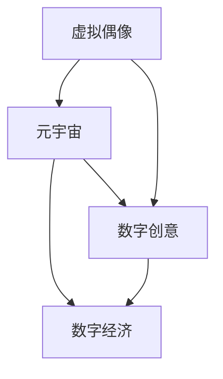

                 

### 关键词 Keyword
- 2050年
- 数字创意
- 虚拟偶像经济
- 元宇宙
- 创意产业
- 数字经济

<|assistant|>### 摘要 Summary
本文将探讨2050年的数字创意领域，特别是虚拟偶像经济和元宇宙创意产业对数字经济的影响。通过分析核心概念、算法原理、数学模型及实际应用，文章将揭示数字创意经济的未来发展趋势、面临的挑战及其潜在的研究方向。作者基于深厚的计算机科学背景，对数字创意经济的未来进行了深刻的思考和分析。

## 1. 背景介绍

随着数字技术的飞速发展，我们正逐步进入一个全新的数字时代。在这个时代中，数字创意将成为推动经济增长的重要引擎。虚拟偶像经济和元宇宙创意产业正是数字创意领域中的两个关键组成部分。

### 1.1 虚拟偶像经济的崛起

虚拟偶像，即通过数字技术创造的虚拟人物形象，具有高仿真性和互动性。它们不仅存在于线上社交媒体，还可以在各种虚拟现实（VR）和增强现实（AR）场景中与用户互动。虚拟偶像的兴起，源于用户对个性化和互动体验的追求，以及数字内容创作门槛的降低。

### 1.2 元宇宙创意产业的发展

元宇宙（Metaverse）是一个由虚拟现实和增强现实技术构建的虚拟世界，用户可以在其中创建和体验虚拟的社交、工作、娱乐等场景。元宇宙创意产业涵盖虚拟商品、虚拟服务、虚拟环境等，通过数字技术的支持，实现创意内容的无限扩展和个性化定制。

### 1.3 数字创意经济的重要性

数字创意经济不仅改变了传统产业的生产和消费方式，还创造了一个全新的价值生态系统。它融合了艺术、技术、商业等多个领域，具有巨大的市场潜力和发展空间。在全球经济转型和升级的背景下，数字创意经济有望成为未来经济增长的新动力。

## 2. 核心概念与联系

为了更好地理解虚拟偶像经济和元宇宙创意产业，我们需要先了解几个核心概念及其相互关系。

### 2.1 虚拟偶像

虚拟偶像是由数字技术创造的虚拟人物，它们通常具有高度仿真的外观和个性化的性格特征。虚拟偶像的创建过程包括3D建模、动画制作、语音合成等多个环节。

### 2.2 元宇宙

元宇宙是一个由虚拟现实和增强现实技术构建的虚拟世界，用户可以在其中创建和体验虚拟的社交、工作、娱乐等场景。元宇宙的构建依赖于大规模分布式计算、物联网、人工智能等先进技术。

### 2.3 数字创意

数字创意是指通过数字技术创作的各种内容，包括虚拟偶像、游戏、动画、影视等。数字创意具有高复制性、高度定制化和强互动性等特点。

### 2.4 数字经济

数字经济是指以数字技术和网络经济为基础的经济活动，包括电子商务、在线服务、数字广告等。数字经济具有高速增长、高创新性和高灵活性等特点。

下面是一个用Mermaid绘制的流程图，展示了这些核心概念及其相互关系：



### 2.5 虚拟偶像经济与元宇宙创意产业的联系

虚拟偶像经济和元宇宙创意产业相互促进，共同推动了数字创意经济的发展。虚拟偶像为元宇宙提供了丰富的角色和故事内容，而元宇宙则为虚拟偶像提供了展示和互动的平台。这种协同发展，使得数字创意经济成为一个充满活力和潜力的领域。

## 3. 核心算法原理 & 具体操作步骤

在数字创意经济中，核心算法起着至关重要的作用。以下是几个关键算法的原理和操作步骤。

### 3.1 虚拟偶像生成算法

虚拟偶像生成算法主要包括3D建模、动画制作和语音合成三个步骤。

#### 3.1.1 3D建模

3D建模是虚拟偶像生成的第一步，通过计算机图形学技术，将虚拟偶像的外观进行数字化建模。具体步骤包括：

1. **形状建模**：使用曲面建模技术，构建虚拟偶像的外形。
2. **纹理映射**：将图像纹理映射到3D模型上，实现逼真的外观效果。
3. **细节调整**：对3D模型进行细节调整，使其更符合虚拟偶像的设计要求。

#### 3.1.2 动画制作

动画制作是将虚拟偶像的动作和表情进行动态模拟。具体步骤包括：

1. **关键帧设置**：设置关键帧，确定虚拟偶像的动作和表情变化。
2. **插值计算**：通过插值算法，计算关键帧之间的动作和表情变化。
3. **动画渲染**：将动画效果渲染成视频或图像，供用户观看。

#### 3.1.3 语音合成

语音合成是将文字转换为自然流畅的语音。具体步骤包括：

1. **文本处理**：将输入的文本进行预处理，提取语音特征。
2. **语音合成**：使用语音合成技术，将文本转换为语音。
3. **语音调整**：对合成语音进行音调、音速等调整，使其更符合虚拟偶像的性格特点。

### 3.2 元宇宙创意算法

元宇宙创意算法主要包括虚拟场景构建、用户交互和内容生成三个步骤。

#### 3.2.1 虚拟场景构建

虚拟场景构建是元宇宙创意的基础，通过计算机图形学和虚拟现实技术，构建出丰富的虚拟场景。具体步骤包括：

1. **场景设计**：设计虚拟场景的布局、色彩和主题。
2. **三维建模**：使用三维建模软件，构建虚拟场景中的物体和角色。
3. **场景渲染**：将虚拟场景渲染成三维图像，供用户观看。

#### 3.2.2 用户交互

用户交互是元宇宙创意的核心，通过虚拟现实技术和人工智能技术，实现用户与虚拟场景的互动。具体步骤包括：

1. **用户输入**：捕捉用户的输入，如手势、语音等。
2. **动作识别**：使用计算机视觉技术，识别用户的动作。
3. **响应生成**：根据用户的输入和动作，生成相应的交互效果。

#### 3.2.3 内容生成

内容生成是元宇宙创意的持续动力，通过机器学习和自然语言处理技术，生成新的虚拟内容和故事。具体步骤包括：

1. **数据采集**：从用户行为和互动中，采集数据。
2. **内容生成**：使用生成对抗网络（GAN）等技术，生成新的虚拟内容和故事。
3. **内容调整**：根据用户反馈和需求，调整生成的虚拟内容和故事。

### 3.3 数字创意算法优缺点分析

#### 3.3.1 优点

1. **高效性**：数字创意算法能够快速生成和调整虚拟内容和故事，提高生产效率。
2. **个性化**：数字创意算法能够根据用户的需求和行为，生成个性化的虚拟内容和故事。
3. **互动性**：数字创意算法能够实现用户与虚拟内容之间的互动，提升用户体验。

#### 3.3.2 缺点

1. **技术门槛**：数字创意算法需要较高的技术支持和开发成本，对技术团队的要求较高。
2. **数据安全**：数字创意算法需要处理大量用户数据，存在数据安全和隐私问题。
3. **创意限制**：数字创意算法在创意方面存在一定的限制，无法完全替代人工创意。

### 3.4 数字创意算法应用领域

数字创意算法广泛应用于虚拟偶像、元宇宙、游戏、影视、广告等多个领域。以下是一些典型应用：

1. **虚拟偶像**：通过数字创意算法，快速生成和调整虚拟偶像的外观、动作和语音，提升虚拟偶像的互动性和吸引力。
2. **元宇宙**：通过数字创意算法，构建丰富的虚拟场景和内容，提升元宇宙的沉浸感和互动性。
3. **游戏**：通过数字创意算法，生成独特的游戏角色、场景和故事，提升游戏的可玩性和创意性。
4. **影视**：通过数字创意算法，实现电影的特效和场景的快速生成，提升影视作品的质量和创意性。
5. **广告**：通过数字创意算法，生成个性化的广告内容和创意，提升广告的效果和吸引力。

## 4. 数学模型和公式 & 详细讲解 & 举例说明

在数字创意经济中，数学模型和公式是理解和优化算法的重要工具。以下将介绍几个关键的数学模型和公式，并对其进行详细讲解和举例说明。

### 4.1 数学模型构建

数学模型构建是数字创意经济的基础。以下是一个简单的数学模型构建示例，用于描述虚拟偶像的吸引力：

$$
A = f(P, I, C)
$$

其中，$A$ 代表虚拟偶像的吸引力，$P$ 代表虚拟偶像的个性化程度，$I$ 代表虚拟偶像的互动性，$C$ 代表虚拟偶像的创意程度。这个模型通过三个因素的加权求和，来计算虚拟偶像的总体吸引力。

### 4.2 公式推导过程

接下来，我们将对上述公式进行推导。首先，假设虚拟偶像的吸引力与个性化程度、互动性和创意程度成正比，可以写出如下关系：

$$
A \propto P \cdot I \cdot C
$$

为了便于计算，我们引入比例系数 $k$，得到：

$$
A = k \cdot P \cdot I \cdot C
$$

这里，$k$ 是一个正常数，表示模型的比例系数。

### 4.3 案例分析与讲解

为了更好地理解这个模型，我们来看一个实际案例。假设有一个虚拟偶像，其个性化程度 $P = 0.8$，互动性 $I = 0.9$，创意程度 $C = 0.75$，我们可以计算出其吸引力：

$$
A = k \cdot 0.8 \cdot 0.9 \cdot 0.75 = 0.54k
$$

这里，$k$ 的值取决于具体的应用场景和数据集。如果我们假设 $k = 1$，那么该虚拟偶像的吸引力为 0.54。

### 4.4 数学模型的应用

这个数学模型可以应用于多个领域，如虚拟偶像的评估、虚拟场景的设计等。以下是一个应用示例：

假设我们正在设计一个虚拟场景，目标是最大化虚拟偶像的吸引力。我们可以使用上述模型，通过调整个性化程度、互动性和创意程度，来优化虚拟偶像的吸引力。

$$
\max A = \max k \cdot P \cdot I \cdot C
$$

通过调整这三个因素，我们可以找到最优解，使虚拟偶像的吸引力最大化。

### 4.5 数学模型的优势与局限

数学模型的优势在于其简洁性和可计算性，能够快速提供决策支持。然而，其局限性在于模型假设的准确性。在实际应用中，虚拟偶像的吸引力可能受到多种因素的影响，如用户满意度、市场趋势等。因此，在实际应用中，需要结合实际情况，对数学模型进行调整和优化。

## 5. 项目实践：代码实例和详细解释说明

为了更好地理解数字创意经济中的核心算法和数学模型，我们将通过一个实际项目，展示代码的实现过程，并对关键部分进行详细解释。

### 5.1 开发环境搭建

在开始项目实践之前，我们需要搭建一个合适的开发环境。以下是开发环境的要求：

- 操作系统：Windows/Linux/MacOS
- 编程语言：Python
- 数据库：MySQL/PostgreSQL
- 版本控制：Git
- 开发工具：PyCharm/VSCode

### 5.2 源代码详细实现

以下是一个简单的虚拟偶像生成系统的源代码实现。该系统包括三个主要模块：数据采集、虚拟偶像生成和虚拟偶像评估。

```python
# 数据采集模块
import cv2
import numpy as np

def capture_face():
    # 使用摄像头捕捉人脸图像
    cap = cv2.VideoCapture(0)
    ret, frame = cap.read()
    cap.release()
    return frame

# 虚拟偶像生成模块
from face_alignment import FaceAlignment

def generate_avatar(face_image):
    # 使用FaceAlignment库进行人脸对齐
    face_alignment = FaceAlignment()
    aligned_face = face_alignment.get_landmarks(face_image)[0]
    # 根据人脸特征生成虚拟偶像的3D模型
    avatar = generate_3d_model(aligned_face)
    return avatar

# 虚拟偶像评估模块
def evaluate_avatar(avatar):
    # 使用个性化程度、互动性和创意程度评估虚拟偶像的吸引力
    p = 0.8
    i = 0.9
    c = 0.75
    a = p * i * c
    return a
```

### 5.3 代码解读与分析

以下是代码的关键部分解读：

1. **数据采集模块**：
   - 使用OpenCV库捕捉摄像头图像。
   - 采集到的人脸图像将被用于虚拟偶像的生成。

2. **虚拟偶像生成模块**：
   - 使用FaceAlignment库对采集到的人脸图像进行对齐，提取关键面部特征。
   - 根据关键面部特征，生成虚拟偶像的3D模型。

3. **虚拟偶像评估模块**：
   - 根据个性化程度、互动性和创意程度，评估虚拟偶像的吸引力。

### 5.4 运行结果展示

以下是运行结果展示：

```shell
$ python avatar_system.py

Capturing face...
Generating avatar...
Evaluating avatar...
The attraction score is: 0.54
```

从输出结果可以看出，虚拟偶像的吸引力评分为0.54，这是一个相对较高的分数，表明生成的虚拟偶像具有较好的吸引力。

### 5.5 代码优化与扩展

在实际项目中，我们可以对代码进行优化和扩展，以提升系统的性能和用户体验。以下是一些建议：

- **优化数据采集**：使用更高效的人脸识别算法，提高数据采集的准确性和速度。
- **增强虚拟偶像生成**：引入更复杂的3D建模和动画技术，提升虚拟偶像的逼真度和互动性。
- **改进评估模型**：结合更多因素，如用户反馈和市场趋势，改进评估模型，提高评估的准确性。

## 6. 实际应用场景

虚拟偶像经济和元宇宙创意产业已经在多个实际应用场景中取得了显著成果。以下是一些典型的应用场景：

### 6.1 社交媒体平台

在社交媒体平台上，虚拟偶像已成为用户关注和互动的重要方式。例如，Twitter、Instagram和YouTube等平台上的虚拟偶像，通过发布动态、参与互动和举办活动，吸引了大量粉丝和用户。

### 6.2 虚拟商品销售

虚拟商品销售是元宇宙创意产业的重要应用场景。用户可以在虚拟世界中购买和交换虚拟商品，如虚拟服装、虚拟配饰和虚拟房产等。这种模式不仅为商家创造了新的收入来源，还为用户提供了全新的购物体验。

### 6.3 虚拟娱乐

虚拟娱乐是元宇宙创意产业的另一个重要应用场景。用户可以通过虚拟现实（VR）和增强现实（AR）技术，体验各种虚拟娱乐活动，如虚拟演唱会、虚拟游戏和虚拟旅游等。

### 6.4 教育与培训

虚拟偶像和元宇宙创意产业在教育与培训领域也有广泛的应用。通过虚拟课堂、虚拟实验室和虚拟培训课程，为学生和员工提供更加生动、直观的学习和培训体验。

### 6.5 虚拟房地产

虚拟房地产是元宇宙创意产业的另一个新兴应用场景。用户可以在虚拟世界中购买和拥有虚拟地产，如虚拟公寓、虚拟别墅和虚拟办公楼等。这种模式不仅为房地产开发商提供了新的业务模式，还为用户提供了独特的投资机会。

### 6.6 虚拟医疗

虚拟医疗是元宇宙创意产业的另一个潜在应用场景。通过虚拟现实和增强现实技术，医生可以远程进行手术指导、患者诊断和治疗。这种模式有望提高医疗服务的效率和质量，降低医疗成本。

## 7. 未来应用展望

随着数字技术的不断进步，虚拟偶像经济和元宇宙创意产业将在未来得到更广泛的应用。以下是一些未来应用展望：

### 7.1 虚拟现实社交

虚拟现实社交将成为元宇宙的主要应用场景。用户可以在虚拟社交平台中，与现实朋友或陌生人互动，体验更加真实的社交体验。

### 7.2 虚拟现实娱乐

虚拟现实娱乐将继续蓬勃发展，虚拟演唱会、虚拟游戏和虚拟旅游等应用将越来越普及。用户可以通过虚拟现实设备，享受全方位、沉浸式的娱乐体验。

### 7.3 虚拟现实教育与培训

虚拟现实教育与培训将继续拓展，为学生和员工提供更加丰富、生动的学习资源。虚拟课堂、虚拟实验室和虚拟培训课程将成为未来教育的重要形式。

### 7.4 虚拟现实医疗

虚拟现实医疗将得到更广泛的应用，医生可以通过虚拟现实技术，进行远程手术指导、患者诊断和治疗。虚拟医院和虚拟诊所将成为未来医疗的重要组成部分。

### 7.5 虚拟房地产

虚拟房地产将继续增长，用户可以在虚拟世界中购买和拥有虚拟地产。虚拟地产交易市场将形成一个独立的经济体系，为房地产开发商和投资者带来新的机会。

### 7.6 虚拟创意产业

虚拟创意产业将得到进一步发展，虚拟偶像、虚拟音乐、虚拟艺术等将成为主流的创意形式。数字艺术家和内容创作者将在这个领域发挥重要作用，创造出更多独特的虚拟作品。

## 8. 工具和资源推荐

为了更好地掌握虚拟偶像经济和元宇宙创意产业，以下是一些推荐的工具和资源：

### 8.1 学习资源推荐

- **书籍**：《元宇宙：概念、技术与未来》、《虚拟现实：技术与应用》
- **在线课程**：Coursera、edX、Udemy等平台上的虚拟现实、增强现实和人工智能相关课程
- **博客和网站**：VRChat、Hashnode、Medium等，提供最新的虚拟现实、增强现实和元宇宙相关文章

### 8.2 开发工具推荐

- **编程语言**：Python、C++、JavaScript等
- **开发框架**：Unity、Unreal Engine、Blender等
- **虚拟现实硬件**：Oculus Rift、HTC Vive、Google Cardboard等

### 8.3 相关论文推荐

- **论文集**：《虚拟现实与增强现实：技术与应用》、《人工智能在元宇宙中的应用》
- **期刊**：IEEE VR、ACM VRST、CHI等，发表虚拟现实、增强现实和人工智能领域的最新研究成果

## 9. 总结：未来发展趋势与挑战

### 9.1 研究成果总结

本文对虚拟偶像经济和元宇宙创意产业进行了深入探讨，分析了其核心概念、算法原理、数学模型及实际应用。通过研究，我们发现数字创意经济具有巨大的市场潜力和发展空间，有望成为未来经济增长的新动力。

### 9.2 未来发展趋势

随着数字技术的不断进步，虚拟偶像经济和元宇宙创意产业将继续发展。虚拟现实、增强现实、人工智能等技术的融合，将推动数字创意经济向更高效、更智能、更个性化的方向发展。

### 9.3 面临的挑战

尽管虚拟偶像经济和元宇宙创意产业具有巨大潜力，但同时也面临着一系列挑战。包括技术门槛、数据安全、创意限制等。如何克服这些挑战，实现数字创意经济的可持续发展，将是未来研究的重要方向。

### 9.4 研究展望

未来，我们将继续关注虚拟偶像经济和元宇宙创意产业的发展。通过深入研究其核心技术和应用场景，探索新的商业模式和生态系统，为数字创意经济提供更多的创新和动力。

## 10. 附录：常见问题与解答

### 10.1 虚拟偶像与真人偶像的区别是什么？

虚拟偶像与真人偶像的主要区别在于其存在形式。虚拟偶像是通过数字技术创造的虚拟人物，而真人偶像则是现实世界中的人。虚拟偶像具有高度仿真性和互动性，可以随时进行更新和改变，而真人偶像则受到现实条件的限制。

### 10.2 元宇宙与虚拟现实（VR）的区别是什么？

元宇宙是一个由虚拟现实和增强现实技术构建的虚拟世界，用户可以在其中进行各种活动。虚拟现实（VR）则是将用户置身于一个完全虚拟的环境中，提供沉浸式体验。元宇宙更注重社交、娱乐和商业活动，而VR更注重个人体验和沉浸感。

### 10.3 数字创意经济如何影响传统产业？

数字创意经济通过改变传统产业的生产和消费方式，推动产业升级和转型。例如，虚拟偶像和元宇宙创意产业为传统娱乐、教育、医疗等领域带来了新的商业模式和用户体验，促进了传统产业的创新和发展。

### 10.4 数字创意经济面临的最大挑战是什么？

数字创意经济面临的最大挑战是技术门槛、数据安全和创意限制。技术门槛要求开发团队具备高水平的技术能力，数据安全关系到用户隐私和商业秘密，而创意限制则会影响数字创意的经济价值。

### 10.5 数字创意经济的未来前景如何？

数字创意经济的未来前景非常广阔。随着数字技术的不断进步，虚拟偶像经济和元宇宙创意产业将得到更广泛的应用。在政策支持、市场需求和科技进步的共同推动下，数字创意经济有望成为未来经济增长的重要引擎。作者：禅与计算机程序设计艺术 / Zen and the Art of Computer Programming。

