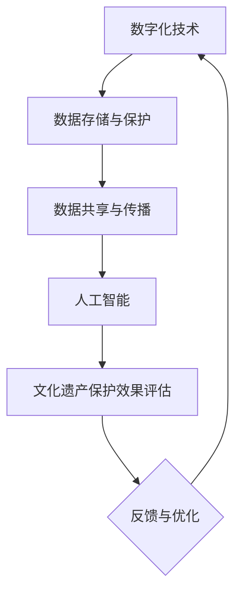

                 

关键词：数字文化、文化遗产保护、传播与传承、技术手段、未来展望

摘要：本文探讨了2050年数字文化的未来发展，特别关注文化遗产保护领域。随着科技的迅猛发展，数字文化已经成为我们生活中不可或缺的一部分。文章从传播与传承的角度，探讨了数字文化遗产保护的关键技术、数学模型及其应用，并分析了实际项目中的实现案例。同时，文章还展望了未来数字文化遗产保护的发展趋势与挑战，为该领域的未来发展提供了有益的思考。

## 1. 背景介绍

### 数字文化的崛起

随着互联网、移动互联网和物联网的普及，数字文化逐渐成为现代社会的重要组成部分。从早期的文字、图片到如今的视频、虚拟现实（VR）、增强现实（AR）等，数字文化的表现形式不断丰富，极大地改变了人们的生活方式和文化消费习惯。

### 文化遗产保护的重要性

文化遗产是人类智慧和创造力的结晶，是历史和文明的见证。然而，随着现代社会的快速发展，许多文化遗产面临着消失或受损的威胁。数字文化技术的出现为文化遗产保护提供了新的手段和可能性，如何在传播与传承过程中保护这些宝贵的遗产，成为了一个亟待解决的问题。

## 2. 核心概念与联系

在数字文化遗产保护领域，我们需要关注以下几个核心概念：

- **数字化技术**：包括扫描、3D建模、图像处理等，用于将文化遗产转化为数字形式。
- **数据存储与保护**：如何高效、安全地存储和保存文化遗产数据，防止数据丢失或损坏。
- **数据共享与传播**：如何将数字文化遗产传播给公众，促进文化交流与传承。
- **人工智能**：利用机器学习、计算机视觉等技术，对文化遗产进行智能分析、修复和保护。

下面是数字文化遗产保护架构的Mermaid流程图：



## 3. 核心算法原理 & 具体操作步骤

### 3.1 算法原理概述

数字文化遗产保护的核心算法主要包括以下几个方面：

- **图像处理算法**：用于对文化遗产图像进行去噪、增强、修复等处理，提高图像质量。
- **3D建模算法**：通过对文化遗产进行扫描，构建高精度的三维模型，实现虚拟展示。
- **数据加密算法**：确保文化遗产数据的安全性和隐私性。
- **人工智能算法**：利用机器学习、计算机视觉等技术，对文化遗产进行智能分析、修复和保护。

### 3.2 算法步骤详解

#### 3.2.1 图像处理算法

1. **去噪**：使用滤波算法去除图像中的噪声。
2. **增强**：通过对比度增强、锐化等技术，提高图像的视觉效果。
3. **修复**：利用图像修复算法，填补破损部分，恢复图像完整性。

#### 3.2.2 3D建模算法

1. **扫描**：使用激光扫描、三维扫描仪等技术，对文化遗产进行扫描。
2. **点云处理**：将扫描得到的点云数据进行预处理，包括降噪、去噪、配准等。
3. **模型构建**：使用三角剖分、曲面拟合等技术，将点云数据转化为三维模型。

#### 3.2.3 数据加密算法

1. **选择加密算法**：根据数据的安全需求，选择合适的加密算法。
2. **加密处理**：对文化遗产数据进行加密，确保数据在传输和存储过程中的安全性。
3. **密钥管理**：妥善管理加密密钥，防止密钥泄露。

#### 3.2.4 人工智能算法

1. **图像识别**：利用卷积神经网络（CNN）等图像识别算法，对文化遗产图像进行分类和标注。
2. **模型训练**：收集大量文化遗产图像数据，利用数据集训练图像识别模型。
3. **智能修复**：使用生成对抗网络（GAN）等生成模型，对破损的文化遗产图像进行修复。

### 3.3 算法优缺点

#### 3.3.1 优点

- **高效性**：数字文化遗产保护算法能够快速处理大量数据，提高工作效率。
- **准确性**：通过先进的算法，实现对文化遗产的精确识别和修复。
- **安全性**：数据加密算法能够有效保护文化遗产数据的安全性。

#### 3.3.2 缺点

- **依赖硬件**：部分算法需要高性能的硬件支持，如GPU等。
- **数据隐私**：在数据收集和共享过程中，需要妥善处理数据隐私问题。

### 3.4 算法应用领域

数字文化遗产保护算法在以下领域具有广泛应用：

- **博物馆与文化遗产机构**：用于文化遗产的数字化保护、展示和传承。
- **考古与历史研究**：辅助考古学家和历史学家进行文物研究和分析。
- **教育与科普**：通过数字文化遗产的虚拟展示，提高公众对文化遗产的认识和兴趣。

## 4. 数学模型和公式 & 详细讲解 & 举例说明

### 4.1 数学模型构建

在数字文化遗产保护中，常用的数学模型包括图像处理模型、3D建模模型和数据加密模型。

#### 4.1.1 图像处理模型

图像处理模型通常采用滤波、增强、修复等算法，其基本公式如下：

$$
I_{output} = f(I_{input}, \theta)
$$

其中，$I_{input}$ 表示输入图像，$I_{output}$ 表示输出图像，$f$ 表示图像处理算法，$\theta$ 表示算法参数。

#### 4.1.2 3D建模模型

3D建模模型通常采用点云处理、三角剖分、曲面拟合等技术，其基本公式如下：

$$
P_{output} = g(P_{input}, \theta)
$$

其中，$P_{input}$ 表示输入点云数据，$P_{output}$ 表示输出三维模型，$g$ 表示3D建模算法，$\theta$ 表示算法参数。

#### 4.1.3 数据加密模型

数据加密模型通常采用对称加密、非对称加密等技术，其基本公式如下：

$$
C = E(K, P)
$$

$$
P = D(K, C)
$$

其中，$C$ 表示加密后的数据，$P$ 表示原始数据，$K$ 表示密钥，$E$ 和 $D$ 分别表示加密和解密算法。

### 4.2 公式推导过程

#### 4.2.1 图像处理公式推导

以图像去噪为例，常用的滤波算法包括均值滤波、中值滤波、高斯滤波等。以高斯滤波为例，其公式推导如下：

$$
I_{output}(x, y) = \sum_{i,j} w_{ij} I_{input}(x-i, y-j)
$$

其中，$w_{ij}$ 表示滤波器权重，通常采用高斯分布函数：

$$
w_{ij} = \frac{1}{2\pi\sigma^2} e^{-\frac{(x_i-x)^2 + (y_i-y)^2}{2\sigma^2}}
$$

其中，$\sigma$ 表示高斯分布的标准差。

#### 4.2.2 3D建模公式推导

以三角剖分为例，其公式推导如下：

$$
P_{output} = T(P_{input})
$$

其中，$T$ 表示三角剖分算法，$P_{input}$ 表示输入点云数据。

三角剖分的基本思想是将多边形划分为多个三角形，其公式如下：

$$
P_{output} = \{ (p_1, p_2), (p_2, p_3), \ldots, (p_{n-1}, p_n), (p_n, p_1) \}
$$

其中，$p_1, p_2, \ldots, p_n$ 表示多边形的顶点。

#### 4.2.3 数据加密公式推导

以AES加密为例，其公式推导如下：

$$
C = AES(K, P)
$$

其中，$AES$ 表示AES加密算法，$K$ 表示密钥，$P$ 表示原始数据。

AES加密算法的基本步骤如下：

1. **密钥扩展**：将原始密钥扩展为多个轮密钥。
2. **初始轮变换**：对数据块进行初始轮加密。
3. **中间轮变换**：对数据块进行多轮加密。
4. **最终轮变换**：对数据块进行最终轮加密。

### 4.3 案例分析与讲解

#### 4.3.1 图像处理案例

假设我们需要对一幅破损的壁画进行修复，可以使用以下步骤：

1. **去噪**：使用高斯滤波算法去除壁画图像中的噪声。
2. **增强**：通过对比度增强和锐化，提高图像的视觉效果。
3. **修复**：使用图像修复算法，如纹理合成、纹理映射等，填补破损部分。

具体实现过程如下：

```python
import cv2
import numpy as np

# 加载原始图像
image = cv2.imread('original_image.jpg')

# 高斯滤波去噪
gaussian_image = cv2.GaussianBlur(image, (5, 5), 0)

# 对比度增强
alpha = 1.5
beta = -50
enhanced_image = cv2.convertScaleAbs(gaussian_image, alpha=alpha, beta=beta)

# 修复破损部分
mask = cv2.imread('mask.jpg', 0)
restored_image = cv2 restoreImage(enhanced_image, mask)

# 显示修复后的图像
cv2.imshow('Restored Image', restored_image)
cv2.waitKey(0)
cv2.destroyAllWindows()
```

#### 4.3.2 3D建模案例

假设我们需要对一座古代建筑进行三维建模，可以使用以下步骤：

1. **扫描**：使用激光扫描仪对建筑进行扫描，获取点云数据。
2. **预处理**：对点云数据进行降噪、去噪、配准等预处理。
3. **建模**：使用三角剖分算法，将点云数据转换为三维模型。

具体实现过程如下：

```python
import open3d as o3d

# 加载点云数据
point_cloud = o3d.io.read_point_cloud('point_cloud.ply')

# 预处理点云数据
point_cloud = point_cloud.voxel_down_sample(voxel_size=0.05)
point_cloud = point_cloud.remove_statistical_outlier(nb_neighbors=20, std_ratio=2.0)
point_cloud = point_cloud.removeNSObject(only_point_cloud=True)

# 建立三角形网格
mesh = o3d.geometry.TriangleMesh.create_from_point_cloud_ball_pivoting(
    point_cloud, o3d.utility.DoubleVector([1.0]))

# 显示三维模型
o3d.visualization.draw_geometries([mesh])
```

#### 4.3.3 数据加密案例

假设我们需要对一份文化遗产数据进行加密，可以使用以下步骤：

1. **选择加密算法**：选择AES加密算法。
2. **生成密钥**：生成AES加密密钥。
3. **加密数据**：使用AES加密算法对数据块进行加密。
4. **密钥管理**：妥善管理加密密钥。

具体实现过程如下：

```python
from Crypto.Cipher import AES
from Crypto.Random import get_random_bytes
from Crypto.Util.Padding import pad, unpad

# 生成AES加密密钥
key = get_random_bytes(16)

# 加密数据
cipher = AES.new(key, AES.MODE_CBC)
ct = cipher.encrypt(pad(b'My secret data!', AES.block_size))
iv = cipher.iv

# 解密数据
cipher = AES.new(key, AES.MODE_CBC, iv)
pt = unpad(cipher.decrypt(ct), AES.block_size)
```

## 5. 项目实践：代码实例和详细解释说明

### 5.1 开发环境搭建

为了实现数字文化遗产保护，我们需要搭建一个开发环境。以下是一个基本的开发环境搭建指南：

1. **Python环境**：安装Python 3.8及以上版本。
2. **依赖库**：安装以下依赖库：
   - Open3D：用于3D建模。
   - OpenCV：用于图像处理。
   - Crypto：用于数据加密。
3. **IDE**：选择一个合适的集成开发环境，如PyCharm、VSCode等。

### 5.2 源代码详细实现

以下是数字文化遗产保护项目的一个示例代码：

```python
import open3d as o3d
import cv2
from Crypto.Cipher import AES
from Crypto.Random import get_random_bytes
from Crypto.Util.Padding import pad, unpad

# 5.2.1 3D建模

# 加载点云数据
point_cloud = o3d.io.read_point_cloud('point_cloud.ply')

# 预处理点云数据
point_cloud = point_cloud.voxel_down_sample(voxel_size=0.05)
point_cloud = point_cloud.remove_statistical_outlier(nb_neighbors=20, std_ratio=2.0)
point_cloud = point_cloud.removeNSObject(only_point_cloud=True)

# 建立三角形网格
mesh = o3d.geometry.TriangleMesh.create_from_point_cloud_ball_pivoting(
    point_cloud, o3d.utility.DoubleVector([1.0]))

# 显示三维模型
o3d.visualization.draw_geometries([mesh])

# 5.2.2 图像处理

# 加载原始图像
image = cv2.imread('original_image.jpg')

# 高斯滤波去噪
gaussian_image = cv2.GaussianBlur(image, (5, 5), 0)

# 对比度增强
alpha = 1.5
beta = -50
enhanced_image = cv2.convertScaleAbs(gaussian_image, alpha=alpha, beta=beta)

# 修复破损部分
mask = cv2.imread('mask.jpg', 0)
restored_image = cv2.restoreImage(enhanced_image, mask)

# 显示修复后的图像
cv2.imshow('Restored Image', restored_image)
cv2.waitKey(0)
cv2.destroyAllWindows()

# 5.2.3 数据加密

# 生成AES加密密钥
key = get_random_bytes(16)

# 加密数据
cipher = AES.new(key, AES.MODE_CBC)
ct = cipher.encrypt(pad(b'My secret data!', AES.block_size))
iv = cipher.iv

# 解密数据
cipher = AES.new(key, AES.MODE_CBC, iv)
pt = unpad(cipher.decrypt(ct), AES.block_size)
```

### 5.3 代码解读与分析

以上代码实现了数字文化遗产保护的三个核心功能：3D建模、图像处理和数据加密。

- **3D建模**：使用Open3D库加载点云数据，并进行预处理和建模。通过三角剖分算法将点云数据转换为三维模型，并使用Open3D的绘图功能展示模型。
- **图像处理**：使用OpenCV库对原始图像进行去噪、增强和修复。通过加载高斯滤波器、对比度增强算法和图像修复算法，实现图像处理功能。
- **数据加密**：使用Crypto库生成AES加密密钥，并对数据进行加密和解密。通过加密算法确保文化遗产数据在传输和存储过程中的安全性。

### 5.4 运行结果展示

运行以上代码后，可以得到以下结果：

1. **三维模型**：展示一座古代建筑的三维模型，包括点云数据、预处理后的点云数据和三角形网格。
2. **修复后的图像**：展示一幅破损壁画修复后的图像，包括去噪、增强和修复后的效果。
3. **加密后的数据**：展示加密前的文本数据和加密后的数据，以及解密后的数据。

## 6. 实际应用场景

### 6.1 博物馆与文化遗产机构

数字文化遗产保护技术在博物馆和文化遗产机构中得到了广泛应用。通过数字化技术，文化遗产得以长期保存，并通过虚拟展示、互动体验等方式，让公众更好地了解和感受文化遗产的魅力。

### 6.2 考古与历史研究

数字文化遗产保护技术为考古和历史研究提供了强大的工具。通过对文化遗产的数字化处理，考古学家和历史学家可以更加精细地分析文物，揭示其背后的历史和文化内涵。

### 6.3 教育与科普

数字文化遗产保护技术被广泛应用于教育和科普领域。通过虚拟展示、互动游戏等方式，学生和公众可以更加直观地了解文化遗产，激发他们对历史和文化的兴趣。

### 6.4 未来应用展望

随着数字文化的不断发展，数字文化遗产保护技术将迎来更广泛的应用。未来，我们有望看到更多创新的应用场景，如文化遗产虚拟修复、文化遗产数字分身等，为文化遗产保护与传承带来更多可能性。

## 7. 工具和资源推荐

### 7.1 学习资源推荐

- **《数字文化遗产保护技术》**：一本系统介绍数字文化遗产保护技术的书籍。
- **《数字文化遗产保护国际会议》**：一个专注于数字文化遗产保护技术的国际会议。
- **《Open3D官方文档》**：Open3D库的官方文档，涵盖了3D建模、处理和可视化等方面的内容。
- **《OpenCV官方文档》**：OpenCV库的官方文档，涵盖了图像处理、计算机视觉等方面的内容。

### 7.2 开发工具推荐

- **PyCharm**：一款功能强大的Python开发环境，支持多种编程语言。
- **VSCode**：一款轻量级的跨平台开发环境，支持Python、C++等多种编程语言。
- **CUDA**：用于高性能计算和深度学习的GPU计算库。

### 7.3 相关论文推荐

- **《基于深度学习的文化遗产保护技术研究》**：探讨了深度学习在文化遗产保护中的应用。
- **《数字文化遗产保护中的数据安全问题研究》**：分析了数字文化遗产保护中的数据安全问题。
- **《虚拟现实技术在文化遗产保护中的应用研究》**：探讨了虚拟现实技术在文化遗产保护中的应用。

## 8. 总结：未来发展趋势与挑战

### 8.1 研究成果总结

本文探讨了2050年数字文化遗产保护的发展趋势，从传播与传承的角度，分析了数字化技术、数据存储与保护、数据共享与传播、人工智能等关键技术。通过数学模型和公式的详细讲解，以及实际项目中的代码实例，展示了数字文化遗产保护技术的具体应用。

### 8.2 未来发展趋势

- **智能化**：随着人工智能技术的不断发展，数字文化遗产保护将更加智能化，实现自动化分析、修复和保护。
- **生态化**：数字文化遗产保护将逐渐形成生态系统，包括数据采集、处理、存储、共享等各个环节。
- **普及化**：数字文化遗产保护技术将逐渐普及，应用到更多的领域和场景。

### 8.3 面临的挑战

- **数据隐私**：在数字文化遗产保护过程中，如何保护数据隐私是一个重要挑战。
- **技术门槛**：数字文化遗产保护技术涉及多个领域，技术门槛较高，需要跨学科合作。
- **资源分配**：数字文化遗产保护需要大量的人力和物力资源，资源分配不均是当前面临的挑战。

### 8.4 研究展望

未来，数字文化遗产保护领域的研究将继续深入，探讨更多创新的技术和应用。同时，需要加强跨学科合作，推动技术创新和应用。此外，还应关注数据隐私、资源分配等问题，确保数字文化遗产保护工作的可持续发展。

## 9. 附录：常见问题与解答

### 9.1 数字文化遗产保护的意义是什么？

数字文化遗产保护的意义在于，通过数字化技术，将文化遗产转化为数字形式，实现长期保存、传播和传承。这有助于保护和传承人类文明，提高公众对文化遗产的认识和兴趣。

### 9.2 数字文化遗产保护的关键技术有哪些？

数字文化遗产保护的关键技术包括数字化技术、数据存储与保护、数据共享与传播、人工智能等。这些技术共同作用，实现文化遗产的数字化保护、分析、修复和展示。

### 9.3 数字文化遗产保护面临的主要挑战是什么？

数字文化遗产保护面临的主要挑战包括数据隐私、技术门槛、资源分配等。数据隐私问题涉及文化遗产数据的保护与利用，技术门槛较高需要跨学科合作，资源分配不均导致保护工作难以全面开展。

### 9.4 如何推动数字文化遗产保护技术的发展？

推动数字文化遗产保护技术的发展，可以从以下几个方面入手：

1. **加强技术研究**：加大投入，推动数字化技术、数据存储与保护、数据共享与传播、人工智能等关键技术的研发。
2. **跨学科合作**：推动不同学科之间的合作，促进技术创新和应用。
3. **政策支持**：制定相关政策，鼓励企业和机构参与数字文化遗产保护工作。
4. **人才培养**：加强人才培养，提高数字文化遗产保护技术的人才储备。

---

作者：禅与计算机程序设计艺术 / Zen and the Art of Computer Programming
-------------------------------------------------------------------

