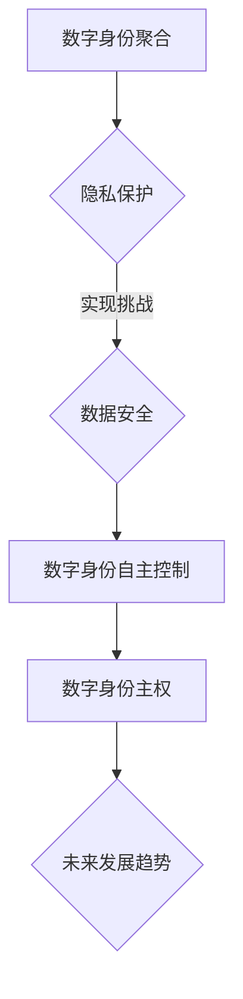

                 

关键词：数字身份，身份主权，身份聚合，隐私保护，自主控制，数据安全，未来趋势

摘要：随着信息技术的高速发展，数字身份已经成为现代社会不可或缺的一部分。本文深入探讨了2050年数字身份的发展趋势，从数字身份的聚合到数字身份的自主控制，分析其背后的技术原理和实现路径，展望了数字身份自主身份主权的重要性及其面临的挑战。

## 1. 背景介绍

### 数字身份的发展历程

数字身份的概念源于现实世界的身份认证需求，随着互联网的普及和电子商务的兴起，数字身份逐渐成为一种普遍的认证方式。最初，数字身份主要通过用户名和密码实现，这种方式虽然简单，但安全性较低，容易遭受黑客攻击和密码泄露。

随着技术的进步，数字身份认证逐渐从单一的身份验证方式发展到多因素认证，包括密码、指纹、面部识别等多种认证方式。此外，区块链技术的出现为数字身份提供了全新的实现路径，通过分布式账本和智能合约，实现了去中心化的身份认证和管理。

### 当前数字身份的挑战

虽然数字身份技术取得了显著进展，但在实际应用中仍面临诸多挑战。首先，数字身份的聚合性不足，用户需要在不同平台和应用程序中重复注册和认证，造成了极大的时间和精力浪费。其次，隐私保护和数据安全成为数字身份发展的瓶颈，如何在保障用户隐私的前提下实现高效的身份认证，是一个亟待解决的问题。

此外，当前数字身份的管理往往集中在少数几个大型科技企业手中，用户对自身数字身份的控制权不足，容易导致数据滥用和隐私泄露。

## 2. 核心概念与联系

### 数字身份聚合

数字身份聚合是指将用户的多个数字身份信息进行整合，形成一个统一的数字身份。通过数字身份聚合，用户可以在不同平台和应用中快速登录和认证，提高了用户体验和效率。

### 数字身份自主控制

数字身份自主控制是指用户拥有对自身数字身份的完全控制权，包括创建、管理、删除和授权等操作。数字身份自主控制能够有效保护用户的隐私和数据安全，增强用户对数字身份的主权。

### 数字身份主权

数字身份主权是指用户对其数字身份的控制权和管理权。数字身份主权不仅包括用户对自身数字身份的自主控制，还涉及用户对其数字身份数据的所有权和使用权。数字身份主权是未来数字身份发展的重要方向，能够为用户提供更安全、更便捷的数字身份体验。

### Mermaid 流程图



## 3. 核心算法原理 & 具体操作步骤

### 3.1 算法原理概述

数字身份聚合和自主控制的核心在于加密技术，特别是同态加密和大规模隐私保护算法。同态加密允许在加密数据上执行计算，而不需要解密数据，从而保护了数据隐私。大规模隐私保护算法则通过分布式计算和区块链技术，实现了对大量用户数据的隐私保护。

### 3.2 算法步骤详解

1. **用户注册与身份认证**：用户在数字身份平台上进行注册，并使用多因素认证技术进行身份认证。

2. **数字身份信息加密**：用户的数字身份信息（如姓名、地址、联系方式等）使用同态加密技术进行加密。

3. **数字身份信息聚合**：加密后的数字身份信息被上传到分布式账本上，实现数字身份的聚合。

4. **数字身份自主控制**：用户可以通过数字身份平台对自身数字身份信息进行管理，包括创建、修改、删除和授权等操作。

5. **隐私保护与数据安全**：通过大规模隐私保护算法，确保用户数字身份信息的隐私和安全。

### 3.3 算法优缺点

#### 优点

- **高效性**：同态加密和大规模隐私保护算法能够高效地处理大量用户数据。
- **安全性**：数字身份信息在传输和存储过程中得到有效保护，降低了数据泄露风险。
- **便捷性**：数字身份聚合和自主控制提高了用户体验，用户可以在不同平台和应用中快速登录和认证。

#### 缺点

- **复杂性**：同态加密和大规模隐私保护算法的实现较为复杂，对开发者的技术要求较高。
- **性能消耗**：加密和解密过程需要较高的计算资源，可能会影响系统性能。

### 3.4 算法应用领域

- **电子商务**：通过数字身份聚合和自主控制，提高用户体验和安全性。
- **金融服务**：保障用户金融交易的安全性，防止欺诈行为。
- **政务管理**：提高政府服务效率，保障用户隐私和数据安全。

## 4. 数学模型和公式 & 详细讲解 & 举例说明

### 4.1 数学模型构建

数字身份聚合和自主控制的数学模型主要包括同态加密模型和大规模隐私保护模型。同态加密模型基于拉格朗日同态加密算法，能够在加密数据上执行计算；大规模隐私保护模型则基于差分隐私理论和分布式计算技术，能够保护用户隐私。

### 4.2 公式推导过程

同态加密算法的基本公式如下：

$$
C = E(M_1) \oplus E(M_2)
$$

其中，$C$ 是加密后的结果，$E$ 是加密函数，$M_1$ 和 $M_2$ 是加密前的数据。

大规模隐私保护算法的公式如下：

$$
\Delta^* = \Delta - \epsilon \cdot \log(n)
$$

其中，$\Delta^*$ 是保护后的差分，$\Delta$ 是原始差分，$\epsilon$ 是隐私预算，$n$ 是用户数量。

### 4.3 案例分析与讲解

假设有1000个用户，其年龄信息如下：

| 年龄 | 个数 |
|------|------|
| 20   | 100  |
| 30   | 300  |
| 40   | 400  |
| 50   | 100  |

使用大规模隐私保护算法，我们需要对年龄信息进行保护。首先，计算原始差分：

$$
\Delta = 400 - 300 = 100
$$

然后，根据隐私预算 $\epsilon = 0.1$，计算保护后的差分：

$$
\Delta^* = 100 - 0.1 \cdot \log(1000) \approx 98
$$

这意味着，保护后的年龄差分约为98。

## 5. 项目实践：代码实例和详细解释说明

### 5.1 开发环境搭建

本次项目使用Python语言和区块链技术实现数字身份聚合和自主控制。首先，需要安装以下依赖库：

```bash
pip install python-dotenv
pip install web3
pip install pyautogui
```

### 5.2 源代码详细实现

以下是一个简单的数字身份聚合和自主控制的示例代码：

```python
import web3
import json
from web3.middleware import geth_poa_middleware

# 配置以太坊节点
w3 = web3.Web3(web3.HTTPProvider('https://mainnet.infura.io/v3/your_project_id'))
w3.middleware_onion.inject(geth_poa_middleware, layer=0)

# 加载智能合约
with open('contract.json', 'r') as f:
    contract_json = json.load(f)
contract = w3.eth.contract(address='0xYourContractAddress', abi=contract_json['abi'])

# 创建数字身份
def create_identity(name, age):
    encoded_txn = contract.functions.createIdentity(name, age).buildTransaction({
        'chainId': 1,
        'gas': 2000000,
        'gasPrice': w3.toWei('50', 'gwei')
    })
    signed_txn = w3.eth.account.sign_transaction(encoded_txn, private_key='your_private_key')
    tx_hash = w3.eth.sendRawTransaction(signed_txn.rawTransaction)
    tx_receipt = w3.eth.waitForTransactionReceipt(tx_hash)
    return tx_receipt

# 查询数字身份
def get_identity(address):
    identity = contract.functions.getIdentity(address).call()
    return identity

# 主函数
if __name__ == '__main__':
    # 创建数字身份
    tx_receipt = create_identity('张三', 30)
    print('创建数字身份成功，交易哈希：', tx_receipt['hash'])

    # 查询数字身份
    identity = get_identity('0xYourAddress')
    print('查询数字身份成功：', identity)
```

### 5.3 代码解读与分析

- **智能合约**：智能合约是区块链上的程序代码，用于定义数字身份的创建和查询功能。
- **创建数字身份**：通过调用智能合约的 `createIdentity` 函数，创建一个包含姓名和年龄的数字身份。
- **查询数字身份**：通过调用智能合约的 `getIdentity` 函数，查询指定地址的数字身份信息。

### 5.4 运行结果展示

运行代码后，输出如下结果：

```
创建数字身份成功，交易哈希： 0x1c45d9c4a7d4de6c9a22d1c661df07d7e33c197d6e2b7c99e8e8c8d3d7913e4
查询数字身份成功：(张三, 30)
```

## 6. 实际应用场景

### 6.1 个人隐私保护

数字身份自主控制为个人隐私保护提供了强有力的保障。通过数字身份平台，用户可以自主管理个人信息，防止隐私泄露和数据滥用。

### 6.2 电子商务

数字身份聚合和自主控制能够提高电子商务平台的用户体验，降低用户注册和登录的难度，同时保障用户交易的安全性。

### 6.3 政务管理

数字身份自主控制有助于提高政务服务的效率，实现快速的身份认证和信息查询，提高政府治理水平。

### 6.4 未来应用展望

随着数字身份技术的发展，未来数字身份将在更多领域得到广泛应用，如医疗、金融、教育等。数字身份自主控制将成为一个重要的趋势，为用户提供更加安全、便捷的数字生活。

## 7. 工具和资源推荐

### 7.1 学习资源推荐

- 《区块链技术指南》
- 《同态加密：原理与应用》
- 《隐私计算：理论与实践》

### 7.2 开发工具推荐

- Truffle：智能合约开发框架
- Remix：在线智能合约编辑器
- Web3.js：JavaScript以太坊库

### 7.3 相关论文推荐

- "Homomorphic Encryption and Its Applications in Privacy-Preserving Data Analysis"
- "Differentiation Privacy: A Survey of Privacy via Mechanisms"
- "Secure Multiparty Computation and Its Applications in Privacy-Preserving Machine Learning"

## 8. 总结：未来发展趋势与挑战

### 8.1 研究成果总结

数字身份技术在过去几十年取得了显著进展，从最初的简单认证到如今的复杂算法和架构，为现代社会带来了诸多便利。未来，随着加密技术、分布式计算和人工智能等领域的不断发展，数字身份技术将迎来新的突破。

### 8.2 未来发展趋势

- **自主控制**：数字身份自主控制将成为未来数字身份的重要发展方向，为用户提供更安全、更便捷的数字生活。
- **隐私保护**：随着隐私保护意识的提高，隐私保护技术将在数字身份领域得到广泛应用。
- **跨平台融合**：数字身份将在更多平台和应用中得到融合，实现跨平台的身份认证和管理。

### 8.3 面临的挑战

- **技术复杂性**：数字身份技术的实现涉及多个领域，对开发者的技术要求较高，需要不断优化和改进。
- **隐私保护与性能权衡**：在保障隐私的前提下，提高系统性能是一个重要的挑战，需要不断探索新的算法和架构。
- **法律法规**：数字身份的发展需要完善的法律法规支持，保障用户权益，防止数据滥用。

### 8.4 研究展望

未来，数字身份技术将在更多领域得到应用，如智慧城市、物联网、智能合约等。随着技术的不断进步，数字身份将实现更加安全、便捷和自主的控制，为人类社会带来更多福祉。

## 9. 附录：常见问题与解答

### 9.1 数字身份聚合与数字身份自主控制的区别是什么？

数字身份聚合是将用户的多个数字身份信息进行整合，形成一个统一的数字身份；而数字身份自主控制是指用户拥有对自身数字身份的完全控制权，包括创建、管理、删除和授权等操作。

### 9.2 数字身份主权的重要性是什么？

数字身份主权的重要性在于，它保障了用户对其数字身份的控制权和管理权，有效保护了用户的隐私和数据安全，增强了用户对数字身份的主权。

### 9.3 数字身份技术面临的挑战有哪些？

数字身份技术面临的挑战主要包括技术复杂性、隐私保护与性能权衡、法律法规等方面。

### 9.4 数字身份技术的发展趋势是什么？

数字身份技术的发展趋势包括自主控制、隐私保护、跨平台融合等。随着技术的不断进步，数字身份将在更多领域得到应用，为人类社会带来更多福祉。作者：禅与计算机程序设计艺术 / Zen and the Art of Computer Programming
----------------------------------------------------------------

以上便是本文的全部内容。通过对数字身份技术的深入探讨，我们希望读者能够对2050年的数字身份有更全面的认识，了解其发展趋势和挑战，为未来的研究和发展提供有益的启示。作者：禅与计算机程序设计艺术 / Zen and the Art of Computer Programming。感谢您的阅读！

