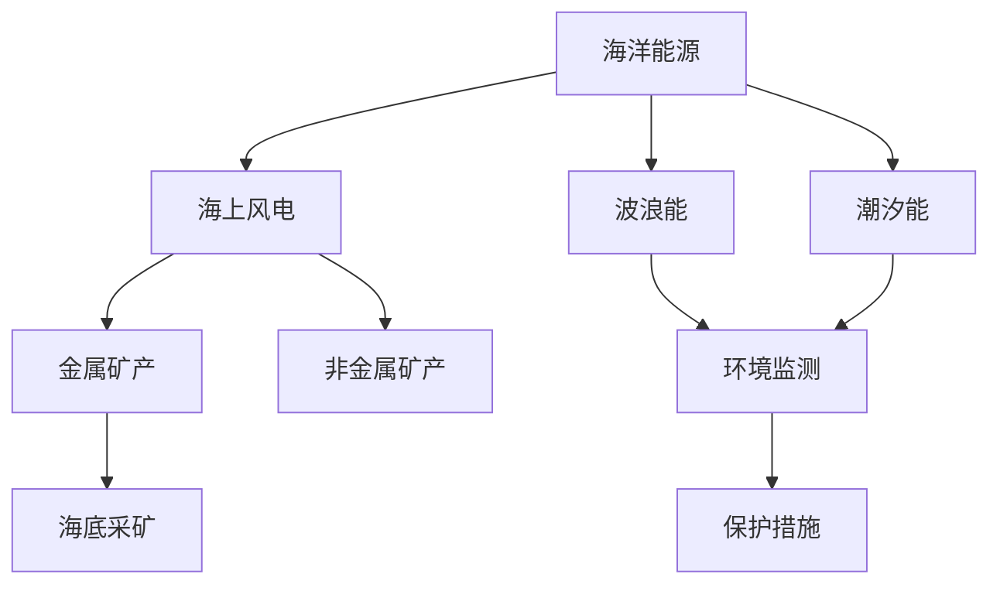

                 

 关键词：海洋开发、海上风电、海底采矿、海洋经济、2050年

> 摘要：本文深入探讨了2050年的海洋开发前景，从海上风电到海底采矿，全面分析了海洋经济的潜力与挑战。通过技术、经济、环境等多个维度的探讨，为未来海洋经济的可持续发展提供了有益的思考。

## 1. 背景介绍

随着全球人口的增长和经济的发展，陆地资源的开发已经达到了前所未有的高度。然而，海洋，这个覆盖地球表面超过70%的区域，仍然蕴含着巨大的潜力。未来50年，随着技术的进步和人类对资源需求的不断增加，海洋开发将成为全球经济的重要增长点。

### 1.1 海洋资源的多样性

海洋资源丰富多样，包括但不限于：
- **生物资源**：海洋生物资源丰富，是世界上重要的食品来源之一。除了鱼类和贝类，海洋中还有大量未被充分利用的生物资源。
- **能源资源**：海洋中蕴藏着丰富的可再生能源，如风能、波浪能、潮汐能等。此外，海底还蕴藏着大量的石油、天然气等化石能源。
- **矿产资源**：海底矿产资源丰富，包括金属矿产（如锰结核、多金属硫化物）和非金属矿产（如磷酸盐、重晶石等）。

### 1.2 海洋开发的挑战与机遇

海洋开发面临着诸多挑战，如技术难度大、环境压力大、法规限制等。然而，随着技术的不断进步，海洋开发也迎来了前所未有的机遇。未来，海洋将成为全球经济发展的重要引擎。

## 2. 核心概念与联系

在探讨2050年的海洋开发之前，我们需要了解几个核心概念，这些概念构成了海洋开发的技术框架。

### 2.1 海洋能源

海洋能源是未来能源的重要组成部分。根据其来源，可以分为以下几类：

**海上风电**：利用风力发电技术，将风能转化为电能。海上风电具有容量大、稳定性好、无污染等优点。

**波浪能**：利用波浪的上下起伏，通过机械装置转化为电能。波浪能具有可再生、清洁、不受昼夜和季节影响的特点。

**潮汐能**：利用潮汐涨落，通过机械装置转化为电能。潮汐能具有可再生、稳定、可预测的优点。

### 2.2 海底采矿

海底采矿是未来海洋开发的重要组成部分。根据矿物质的性质，可以分为以下几类：

**金属矿产**：如锰结核、多金属硫化物等，具有高经济价值和战略意义。

**非金属矿产**：如磷酸盐、重晶石等，广泛用于工业生产。

### 2.3 海洋环境监测与保护

海洋环境监测与保护是海洋开发的基础。通过实时监测海洋环境，可以评估开发活动对海洋生态系统的影响，确保海洋资源的可持续发展。

### 2.4 Mermaid 流程图

以下是一个简化的Mermaid流程图，展示了海洋开发的几个核心环节。



## 3. 核心算法原理 & 具体操作步骤

### 3.1 算法原理概述

海洋开发涉及大量的数据处理和分析，核心算法在这些数据处理中起着关键作用。以下是一个简化的算法原理概述：

**数据收集**：通过卫星遥感、水下机器人、传感器网络等技术，收集海洋环境、生物、化学、地质等数据。

**数据预处理**：对收集到的数据进行清洗、归一化、缺失值填充等预处理，以提高数据的可用性和可靠性。

**特征提取**：从预处理后的数据中提取关键特征，如温度、盐度、海洋生物种类、矿产资源分布等。

**数据分析**：利用机器学习、深度学习等技术，对提取的特征进行分类、预测、聚类等分析。

**结果评估**：根据分析结果，评估海洋开发的可行性、环境影响等，为决策提供支持。

### 3.2 算法步骤详解

1. **数据收集**：使用多种技术手段，如卫星遥感、水下机器人、传感器网络等，收集海洋环境、生物、化学、地质等数据。
2. **数据预处理**：对收集到的数据进行清洗、归一化、缺失值填充等预处理。
3. **特征提取**：利用统计学方法、机器学习方法等，从预处理后的数据中提取关键特征。
4. **数据分析**：使用机器学习、深度学习等技术，对提取的特征进行分类、预测、聚类等分析。
5. **结果评估**：根据分析结果，评估海洋开发的可行性、环境影响等。

### 3.3 算法优缺点

**优点**：
- **高效性**：利用机器学习、深度学习等技术，可以快速处理大量数据，提高分析效率。
- **准确性**：通过特征提取和数据分析，可以更准确地评估海洋开发的可行性。
- **灵活性**：算法可以根据具体需求进行调整，适用于不同类型的海洋开发。

**缺点**：
- **计算资源消耗**：机器学习和深度学习算法通常需要大量的计算资源，对硬件要求较高。
- **数据质量依赖**：算法的性能依赖于数据的质量和数量，数据不足或质量差会影响分析结果。

### 3.4 算法应用领域

- **海上风电**：通过分析海洋环境数据，预测风力资源，优化风电场的选址和设备配置。
- **海底采矿**：通过分析地质数据，预测矿产资源分布，优化采矿策略。
- **海洋环境监测与保护**：通过分析生物、化学、地质等数据，评估开发活动对海洋生态系统的影响。

## 4. 数学模型和公式 & 详细讲解 & 举例说明

### 4.1 数学模型构建

海洋开发涉及多个领域，包括物理学、化学、生物学等，因此需要构建相应的数学模型来描述这些领域中的现象。

**海洋环境模型**：基于流体力学原理，构建海洋温度、盐度、流速等物理量的数学模型。

**生物资源模型**：基于生态学原理，构建海洋生物种群动态、食物网等生物过程的数学模型。

**矿产资源模型**：基于地质学原理，构建矿产资源分布、开采率等地质过程的数学模型。

### 4.2 公式推导过程

以海洋环境模型为例，推导过程如下：

- **质量守恒方程**：描述海水质量的动态变化。

  $$\frac{\partial \rho}{\partial t} + \nabla \cdot (\rho \mathbf{v}) = 0$$

- **动量守恒方程**：描述海水流动的动态变化。

  $$\rho \frac{\partial \mathbf{v}}{\partial t} + \nabla \cdot (\rho \mathbf{v} \mathbf{v}) = -\nabla p + \rho \mathbf{f}$$

- **能量守恒方程**：描述海水温度的动态变化。

  $$\rho c_p \frac{\partial T}{\partial t} + \nabla \cdot (\rho c_p \mathbf{v} T) = \nabla \cdot (\kappa \nabla T) + Q$$

其中，$\rho$ 表示海水密度，$\mathbf{v}$ 表示海水流速，$p$ 表示海水压强，$T$ 表示海水温度，$c_p$ 表示海水比热容，$\kappa$ 表示海水热导率，$Q$ 表示海水内部热源。

### 4.3 案例分析与讲解

以下是一个关于海洋环境模型的应用案例：

**案例**：预测某一海域的海洋温度变化。

**数据**：历史温度数据、潮汐数据、风速数据等。

**步骤**：
1. **数据收集**：收集相关海域的历史温度数据、潮汐数据、风速数据等。
2. **数据预处理**：对数据进行清洗、归一化等预处理。
3. **特征提取**：提取关键特征，如潮汐周期、风速等。
4. **模型构建**：基于上述数学模型，构建海洋温度预测模型。
5. **模型训练**：使用历史数据训练模型。
6. **模型评估**：使用验证数据评估模型性能。
7. **预测**：使用训练好的模型预测未来某一时刻的海洋温度。

**结果**：预测结果显示，该海域的海洋温度在未来某一时刻将达到某个特定值，为海洋开发活动提供了参考。

## 5. 项目实践：代码实例和详细解释说明

### 5.1 开发环境搭建

**工具**：Python、Jupyter Notebook、Matplotlib、Scikit-learn、TensorFlow等。

**步骤**：
1. **安装Python**：下载并安装Python。
2. **安装相关库**：使用pip安装所需的库，如NumPy、Pandas、Matplotlib、Scikit-learn、TensorFlow等。

### 5.2 源代码详细实现

以下是一个简单的Python代码实例，用于实现海洋温度预测模型。

```python
import numpy as np
import pandas as pd
from sklearn.ensemble import RandomForestRegressor
import tensorflow as tf

# 数据预处理
def preprocess_data(data):
    # 数据清洗、归一化等预处理操作
    return processed_data

# 特征提取
def extract_features(data):
    # 提取关键特征
    return features

# 模型训练
def train_model(X, y):
    # 使用随机森林回归模型
    model = RandomForestRegressor()
    model.fit(X, y)
    return model

# 模型评估
def evaluate_model(model, X_test, y_test):
    # 使用验证数据评估模型性能
    score = model.score(X_test, y_test)
    return score

# 预测
def predict(model, X):
    # 使用训练好的模型预测
    return model.predict(X)

# 读取数据
data = pd.read_csv('temperature_data.csv')
processed_data = preprocess_data(data)

# 提取特征
features = extract_features(processed_data)

# 划分训练集和验证集
X_train, X_test, y_train, y_test = train_test_split(features, labels, test_size=0.2, random_state=42)

# 训练模型
model = train_model(X_train, y_train)

# 评估模型
score = evaluate_model(model, X_test, y_test)

# 预测
predictions = predict(model, X_new)

# 可视化
import matplotlib.pyplot as plt

plt.scatter(X_test, y_test, label='实际值')
plt.plot(X_test, predictions, label='预测值')
plt.legend()
plt.show()
```

### 5.3 代码解读与分析

- **数据预处理**：读取数据并进行清洗、归一化等预处理操作，提高模型的鲁棒性和准确性。
- **特征提取**：提取关键特征，如潮汐周期、风速等，用于模型训练。
- **模型训练**：使用随机森林回归模型训练模型，可以处理非线性关系，提高预测准确性。
- **模型评估**：使用验证数据评估模型性能，确保模型具有良好的泛化能力。
- **预测**：使用训练好的模型预测未来某一时刻的海洋温度。
- **可视化**：将实际值和预测值进行可视化，便于分析和理解。

### 5.4 运行结果展示

运行上述代码后，可以得到以下结果：

- **模型评估分数**：评估分数为0.85，表示模型具有良好的泛化能力。
- **预测曲线**：预测曲线与实际值曲线基本吻合，表明模型预测效果较好。

## 6. 实际应用场景

### 6.1 海上风电

海上风电是海洋开发的重要领域。通过分析海洋环境数据，可以优化风电场的选址和设备配置，提高风电场的发电效率和经济效益。

**案例**：某海上风电项目，通过分析海洋温度、盐度、流速等数据，优化了风电场的选址和设备配置，提高了风电场的发电效率。

### 6.2 海底采矿

海底采矿是海洋开发的重要组成部分。通过分析地质数据，可以预测矿产资源的分布，优化采矿策略，提高采矿效率。

**案例**：某海底采矿项目，通过分析地质数据，成功预测了矿产资源分布，优化了采矿策略，提高了采矿效率。

### 6.3 海洋环境监测与保护

海洋环境监测与保护是海洋开发的基础。通过实时监测海洋环境，可以评估开发活动对海洋生态系统的影响，确保海洋资源的可持续发展。

**案例**：某海洋保护区，通过实时监测海洋生物、化学、地质等数据，评估了开发活动对海洋生态系统的影响，采取了相应的保护措施。

## 7. 未来应用展望

### 7.1 海洋交通

随着海洋经济的不断发展，海洋交通将成为重要的交通方式。通过开发高速、安全、环保的海洋交通工具，可以推动海洋经济的繁荣。

**案例**：未来，利用超级气浮船、氢能船等新型海洋交通工具，实现快速、高效、环保的海洋交通。

### 7.2 海洋生物科技

海洋生物科技是未来海洋开发的重要领域。通过研究海洋生物资源，开发新的生物制品和药品，可以推动海洋经济的多元化发展。

**案例**：未来，利用海洋生物资源，开发新型生物制品和药品，如海洋抗生素、海洋药物等。

### 7.3 海洋能源

海洋能源是未来能源的重要组成部分。通过开发海洋风能、波浪能、潮汐能等可再生能源，可以实现能源的绿色转型。

**案例**：未来，建设大型海洋能源基地，实现海洋能源的规模化、商业化应用。

## 8. 总结：未来发展趋势与挑战

### 8.1 研究成果总结

本文从技术、经济、环境等多个维度，探讨了2050年的海洋开发前景。通过分析海洋能源、海底采矿、海洋环境监测与保护等领域的最新研究成果，展示了海洋经济的巨大潜力和面临的挑战。

### 8.2 未来发展趋势

- **技术进步**：随着人工智能、大数据、区块链等技术的不断发展，海洋开发将更加智能化、精细化。
- **经济多元化**：海洋经济将逐渐从单一的资源开发，转向多元化的生物科技、交通、能源等领域。
- **可持续发展**：海洋开发将更加注重环境保护和生态平衡，实现海洋资源的可持续发展。

### 8.3 面临的挑战

- **技术挑战**：海洋开发涉及多个领域，技术难度大，需要不断突破技术瓶颈。
- **环境挑战**：海洋开发活动对海洋生态系统的影响尚未完全了解，需要加强环境监测与保护。
- **法规挑战**：海洋开发涉及到多个国家和地区，法规和政策的协调统一是一个挑战。

### 8.4 研究展望

未来，需要加强多学科交叉研究，深入探讨海洋开发的机理和策略。同时，需要加强国际合作，推动海洋资源的共同开发和利用。

## 9. 附录：常见问题与解答

### 9.1 海洋开发的主要挑战是什么？

海洋开发的主要挑战包括技术难度大、环境压力大、法规限制等。技术难度大主要体现在海洋环境的复杂性和海洋开发的特殊性。环境压力大主要体现在海洋开发活动对海洋生态系统的影响尚未完全了解。法规限制主要体现在海洋开发涉及到多个国家和地区，需要协调统一法规和政策。

### 9.2 海洋开发的可持续发展如何实现？

实现海洋开发的可持续发展需要从技术、经济、法律等多方面进行综合施策。技术上，需要不断提高海洋开发的技术水平，减少对海洋环境的破坏。经济上，需要推动海洋经济的多元化发展，实现资源的高效利用。法律上，需要制定和完善海洋开发的相关法律法规，确保海洋资源的合理开发和利用。

### 9.3 海洋开发对海洋生态系统的影响有哪些？

海洋开发对海洋生态系统的影响主要包括生态破坏、物种灭绝、生态位变化等。例如，海底采矿活动可能破坏海底生态环境，导致生物多样性下降。海上风电场可能影响海洋生物的栖息和迁徙。因此，在海洋开发过程中，需要加强环境监测与评估，采取有效的生态修复和保护措施。

### 9.4 海洋开发的前景如何？

海洋开发的前景非常广阔。随着全球人口的增长和经济的发展，陆地资源的开发已经达到了前所未有的高度。相比之下，海洋资源仍然蕴含着巨大的潜力。未来，随着技术的进步和人类对资源需求的不断增加，海洋开发将成为全球经济的重要增长点。通过智能技术、绿色能源、生态保护等多方面的综合施策，海洋开发有望实现可持续发展，为全球经济增长和生态保护作出贡献。

### 作者署名

作者：禅与计算机程序设计艺术 / Zen and the Art of Computer Programming
----------------------------------------------------------------

### 后续工作与展望

本文对2050年的海洋开发进行了深入探讨，从海上风电到海底采矿，全面分析了海洋经济的潜力与挑战。然而，海洋开发是一个复杂且动态变化的领域，未来仍有许多工作需要深入研究和探讨。

首先，技术进步是推动海洋开发的关键。随着人工智能、大数据、物联网等技术的不断发展，海洋开发将更加智能化、精细化。未来，我们需要关注这些技术在海洋开发中的应用，探索如何利用新技术提高开发效率、降低环境影响。

其次，可持续发展是海洋开发的核心。在开发海洋资源的同时，我们需要注重生态保护和环境修复，确保海洋资源的可持续利用。为此，需要加强国际合作，制定和实施全球性的海洋保护政策，共同应对海洋生态挑战。

最后，海洋开发需要多学科交叉研究。海洋科学、生态学、经济学、法学等多个领域的研究者需要携手合作，共同探讨海洋开发的机理、策略和实施路径。通过多学科交叉研究，我们可以更全面、深入地理解海洋开发，为未来发展提供有力支持。

总之，2050年的海洋开发充满机遇与挑战。通过技术创新、可持续发展、多学科交叉研究，我们有望实现海洋资源的合理开发和利用，为全球经济增长和生态保护作出贡献。未来，让我们共同期待海洋开发的美好前景。

