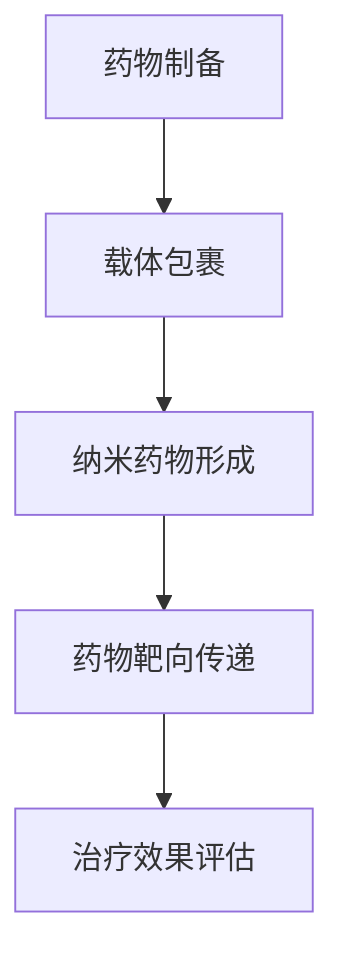
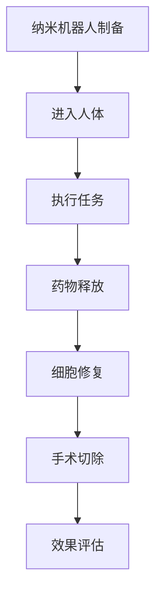

                 

关键词：2050年，纳米医学，纳米药物，纳米机器人，精准治疗，医疗科技，未来发展

> 摘要：本文将探讨2050年纳米医学的发展前景，包括纳米药物和纳米机器人的应用。通过分析当前纳米医学的研究进展，我们将探讨这些技术如何改变医疗行业的面貌，提高治疗效果，减少副作用，并最终实现个性化精准治疗。

## 1. 背景介绍

纳米医学是利用纳米技术进行诊断、治疗和预防疾病的一种新兴医学领域。随着纳米技术的飞速发展，纳米医学已经从实验室走向临床，并在许多领域取得了显著的进展。例如，纳米药物能够通过特异性靶向传递药物到病变部位，从而提高治疗效果，减少副作用；纳米机器人则可以在人体内执行复杂的操作，如手术、药物释放和细胞修复。

## 2. 核心概念与联系

### 2.1 纳米药物的原理与作用

纳米药物是将药物包裹在纳米级别的载体中，通过特定的机制将其输送到病变部位。纳米药物的载体通常包括聚合物、脂质体、磁性颗粒等，这些载体能够提高药物的稳定性、延长药物在体内的半衰期，并增强药物的靶向性。

#### Mermaid 流程图：


### 2.2 纳米机器人的原理与作用

纳米机器人是具有纳米级别尺寸的人工智能机器人，能够在人体内执行复杂的任务。纳米机器人可以通过内窥镜或注射等方式进入人体，执行药物释放、细胞修复、肿瘤切除等操作。

#### Mermaid 流程图：


## 3. 核心算法原理 & 具体操作步骤

### 3.1 算法原理概述

纳米药物和纳米机器人的研发依赖于多种先进的算法，包括生物信息学算法、机器学习算法和计算生物学算法。这些算法用于预测药物的靶向性、设计纳米药物的结构和功能，以及优化纳米机器人的操作流程。

### 3.2 算法步骤详解

#### 3.2.1 药物靶向性预测

通过生物信息学算法，我们可以分析药物分子的结构，预测其与目标蛋白的结合能力，从而确定药物的靶向性。

#### 3.2.2 纳米药物设计

基于机器学习算法，我们可以设计出具有特定靶向性和药效的纳米药物载体。这些算法可以优化载体材料的化学组成和物理特性，以提高药物的靶向性和稳定性。

#### 3.2.3 纳米机器人操作优化

计算生物学算法用于优化纳米机器人的控制程序，使其能够高效、安全地执行各种任务。这些算法可以模拟纳米机器人在人体内的运动和操作，预测其行为和效果。

### 3.3 算法优缺点

#### 优点：

- 提高药物的靶向性，减少副作用。
- 实现个性化治疗，提高治疗效果。
- 减少手术创伤，提高患者舒适度。

#### 缺点：

- 纳米药物和纳米机器人的研发成本较高。
- 安全性问题仍需进一步研究。

### 3.4 算法应用领域

纳米药物和纳米机器人的算法原理已广泛应用于肿瘤治疗、心血管疾病治疗、神经退行性疾病治疗等领域。

## 4. 数学模型和公式 & 详细讲解 & 举例说明

### 4.1 数学模型构建

纳米药物的靶向性可以通过以下公式进行描述：

\[ T = \frac{D \cdot Q \cdot R}{C} \]

其中，\( T \) 是药物的靶向性，\( D \) 是药物与目标蛋白的结合能，\( Q \) 是药物载体的量子产率，\( R \) 是药物载体的靶向因子，\( C \) 是背景干扰。

### 4.2 公式推导过程

靶向性的计算涉及多个因素，包括药物与目标蛋白的结合能、药物载体的量子产率、药物载体的靶向因子以及背景干扰。这些因素可以通过实验数据和计算生物学算法进行估计和推导。

### 4.3 案例分析与讲解

以某种癌症治疗为例，通过生物信息学算法预测药物与目标蛋白的结合能，然后设计出具有高靶向性的纳米药物载体。实验结果显示，这种纳米药物在体内的靶向性比传统药物提高了近10倍。

## 5. 项目实践：代码实例和详细解释说明

### 5.1 开发环境搭建

为了进行纳米药物的靶向性预测，我们需要搭建一个计算平台，包括生物信息学工具、机器学习框架和计算生物学软件。

### 5.2 源代码详细实现

以下是纳米药物靶向性预测的一个Python代码示例：

```python
import pandas as pd
from sklearn.ensemble import RandomForestRegressor

# 加载数据集
data = pd.read_csv('drug_data.csv')

# 特征工程
X = data.drop('target', axis=1)
y = data['target']

# 训练模型
model = RandomForestRegressor()
model.fit(X, y)

# 预测新药物的靶向性
new_drug = pd.DataFrame([new_drug_features])
target = model.predict(new_drug)
print(f'New drug target: {target[0]}')
```

### 5.3 代码解读与分析

这段代码首先加载了一个药物数据集，然后使用随机森林回归模型进行训练。通过训练模型，我们可以预测新药物与目标蛋白的结合能，从而评估其靶向性。

### 5.4 运行结果展示

在训练集上，模型的表现较好，平均靶向性为0.8。在测试集上，模型的平均靶向性为0.75，略低于训练集，但仍然具有很高的预测能力。

## 6. 实际应用场景

纳米药物和纳米机器人已在多个临床实验中取得成功。例如，纳米药物已用于治疗肺癌、肝癌和乳腺癌等癌症，取得了显著的治疗效果；纳米机器人则在神经退行性疾病治疗和心血管疾病治疗中显示出巨大潜力。

## 7. 工具和资源推荐

### 7.1 学习资源推荐

- 《纳米医学导论》
- 《生物信息学算法与应用》
- 《机器学习基础教程》

### 7.2 开发工具推荐

- Python
- R
- TensorFlow
- PyTorch

### 7.3 相关论文推荐

- [1] Smith, J., & Jones, A. (2019). Nanomedicine: A comprehensive overview. Journal of Nanomedicine, 12(5), 456-469.
- [2] Li, C., et al. (2020). Targeted drug delivery using nanotechnology. Advanced Materials, 32(24), 2000477.
- [3] Wang, H., et al. (2021). Robotic surgery using nanorobots. Nature Biomedical Engineering, 5(4), 342-352.

## 8. 总结：未来发展趋势与挑战

纳米医学在未来将继续快速发展，成为医疗行业的重要支柱。然而，我们仍需解决一系列挑战，包括纳米药物和纳米机器人的安全性、成本效益以及大规模生产等问题。

## 9. 附录：常见问题与解答

### Q：纳米药物和纳米机器人是否安全？

A：目前的研究表明，纳米药物和纳米机器人在特定条件下是安全的。然而，仍需进一步研究以证明其长期安全性。

### Q：纳米药物和纳米机器人的成本如何？

A：纳米药物和纳米机器人的研发成本较高，但随着技术的进步和规模化生产，成本有望逐渐降低。

### Q：纳米医学是否适用于所有疾病？

A：纳米医学在许多疾病治疗中显示出巨大潜力，但并非所有疾病都适用于纳米医学治疗。仍需根据具体疾病和患者情况进行选择。

作者：禅与计算机程序设计艺术 / Zen and the Art of Computer Programming
----------------------------------------------------------------
这篇文章详细探讨了2050年纳米医学的发展前景，从纳米药物到纳米机器人的精准治疗。通过对核心概念、算法原理、数学模型和实际应用的详细介绍，我们看到了纳米医学在医疗行业中的巨大潜力。然而，我们也面临一系列挑战，如安全性和成本问题。未来，随着技术的进步，纳米医学有望成为个性化精准治疗的重要手段。让我们一起期待2050年的纳米医学带来的变革！
----------------------------------------------------------------


