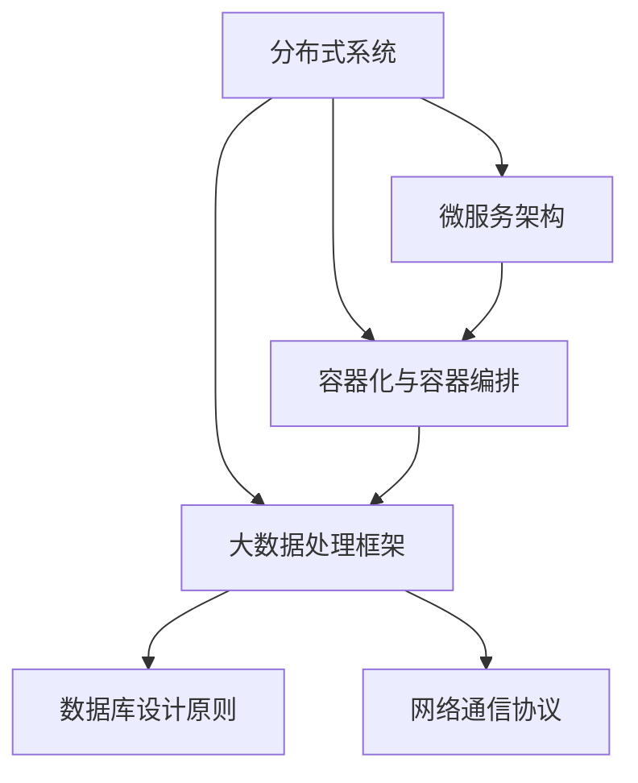

                 

## 1. 背景介绍

随着互联网和大数据技术的发展，系统架构设计在企业的技术架构中扮演着越来越重要的角色。特别是在美团这样的互联网巨头，系统架构师不仅要具备扎实的技术基础，还需要具备全面的系统架构设计能力、项目管理和团队协作能力。为了选拔优秀的系统架构师，美团社招面试题目往往涵盖广泛的技术领域，包括分布式系统、大数据处理、数据库设计、网络通信、性能优化等方面。

本文旨在为广大技术从业者提供一套系统架构师面试题集锦，帮助大家更好地应对美团社招系统架构师面试。本文将分为以下几个部分：

- **核心概念与联系**：介绍系统架构中的核心概念和相互联系。
- **核心算法原理 & 具体操作步骤**：讲解常用的算法原理及其实现步骤。
- **数学模型和公式**：探讨相关数学模型及其推导过程。
- **项目实践**：通过实际代码实例展示系统架构设计的应用。
- **实际应用场景**：分析系统架构在实际应用中的实践案例。
- **工具和资源推荐**：推荐学习资源、开发工具和论文。
- **总结**：总结研究成果、未来发展趋势和挑战。

希望通过本文，读者能够对系统架构设计有更深入的理解，为面试做好准备。

## 2. 核心概念与联系

在系统架构设计中，有几个核心概念是必须掌握的，它们分别是：分布式系统、微服务架构、容器化和容器编排、大数据处理框架、数据库设计原则、网络通信协议等。以下是一个用Mermaid绘制的流程图，展示这些概念之间的联系。



### 分布式系统

分布式系统是指通过网络将多个计算机节点连接起来，共同完成一个任务或提供一种服务。其主要特点包括高可用性、高扩展性和容错性。在分布式系统中，常见的问题包括数据一致性和网络延迟。

### 微服务架构

微服务架构是将应用程序划分为多个小的、自治的服务模块，每个服务模块独立开发、部署和扩展。这种架构模式提高了系统的灵活性、可维护性和可扩展性。

### 容器化与容器编排

容器化是一种轻量级虚拟化技术，通过隔离操作系统环境，实现应用程序的独立部署和运行。容器编排则是对容器进行管理和调度，常见的工具包括Docker和Kubernetes。

### 大数据处理框架

大数据处理框架如Hadoop和Spark，能够处理海量数据，提供高吞吐量和低延迟的数据处理能力。它们分别采用了MapReduce和RDD模型。

### 数据库设计原则

数据库设计原则包括规范化、反规范化、数据库范式等，旨在提高数据库的灵活性和性能。合理的设计原则能够减少数据冗余，提高数据完整性。

### 网络通信协议

网络通信协议如HTTP、TCP、UDP等，是数据在不同计算机之间传输的规则。这些协议保证了数据传输的可靠性和高效性。

## 3. 核心算法原理 & 具体操作步骤

### 3.1 算法原理概述

系统架构师需要熟悉常用的算法原理，如排序算法、查找算法、加密算法等。这些算法在系统性能优化和数据处理中起着关键作用。

### 3.2 算法步骤详解

#### 排序算法

常见的排序算法包括冒泡排序、选择排序、插入排序、快速排序等。下面以快速排序为例，介绍其步骤：

1. 选择一个基准元素。
2. 将比基准元素小的元素放在左边，比基准元素大的元素放在右边。
3. 对左右子数组递归执行以上步骤。

#### 查找算法

查找算法包括二分查找、顺序查找等。以二分查找为例，其步骤如下：

1. 确定中间元素。
2. 如果目标元素等于中间元素，查找成功。
3. 如果目标元素小于中间元素，则在左子数组继续查找。
4. 如果目标元素大于中间元素，则在右子数组继续查找。
5. 重复步骤1-4，直到找到目标元素或子数组为空。

#### 加密算法

加密算法包括对称加密和非对称加密。以AES为例，其步骤如下：

1. 初始化加密密钥和初始化向量。
2. 对数据进行分块处理。
3. 对每个分块进行加密运算。
4. 将加密后的分块合并为加密数据。

### 3.3 算法优缺点

不同算法有其适用的场景和优缺点。例如，快速排序在数据量大时性能较好，但在数据量小或近乎有序时性能较差。二分查找在有序数组中性能优越，但在非有序数组中不适用。

### 3.4 算法应用领域

排序算法广泛应用于数据库索引、数据挖掘等场景。查找算法在搜索引擎、缓存系统中应用广泛。加密算法在网络安全和数据保护中至关重要。

## 4. 数学模型和公式

### 4.1 数学模型构建

在系统架构设计中，数学模型和公式用于描述系统的行为、性能和优化策略。常见的数学模型包括马尔可夫链、队列模型、回归分析等。

### 4.2 公式推导过程

以马尔可夫链为例，其状态转移概率矩阵P可以表示为：

\[ P = \begin{bmatrix}
p_{11} & p_{12} & \dots & p_{1n} \\
p_{21} & p_{22} & \dots & p_{2n} \\
\vdots & \vdots & \ddots & \vdots \\
p_{n1} & p_{n2} & \dots & p_{nn}
\end{bmatrix} \]

其中，\( p_{ij} \) 表示系统从状态i转移到状态j的概率。

### 4.3 案例分析与讲解

假设我们有一个简单的二状态马尔可夫链，状态0表示系统正常运行，状态1表示系统发生故障。状态转移概率矩阵为：

\[ P = \begin{bmatrix}
0.9 & 0.1 \\
0.2 & 0.8
\end{bmatrix} \]

我们可以使用矩阵乘法计算任意时刻的系统状态概率分布：

\[ P^k = \begin{bmatrix}
0.9 & 0.1 \\
0.2 & 0.8
\end{bmatrix}^k \]

例如，计算一天后的系统状态概率分布：

\[ P^{24} = \begin{bmatrix}
0.9 & 0.1 \\
0.2 & 0.8
\end{bmatrix}^{24} \]

通过计算，我们可以得到一天后系统正常运行的概率为0.73，发生故障的概率为0.27。

## 5. 项目实践：代码实例和详细解释说明

### 5.1 开发环境搭建

为了展示系统架构设计的实际应用，我们选择一个常见的场景：基于微服务架构的电商系统。开发环境如下：

- 开发语言：Java
- 框架：Spring Boot、Spring Cloud
- 数据库：MySQL
- 容器化工具：Docker
- 容器编排工具：Kubernetes

### 5.2 源代码详细实现

以下是电商系统的一个简单示例，展示了商品服务（Item Service）的接口和实现。

```java
// 商品服务接口
public interface IItemService {
    Item getItemById(Long itemId);
    List<Item> searchItems(String keyword);
}

// 商品服务实现
@Service
public class ItemServiceImpl implements IItemService {
    private final List<Item> items = Arrays.asList(
        new Item(1L, "苹果", 3.5),
        new Item(2L, "香蕉", 2.5),
        new Item(3L, "橙子", 4.0)
    );

    @Override
    public Item getItemById(Long itemId) {
        return items.stream()
            .filter(item -> item.getId().equals(itemId))
            .findFirst()
            .orElseThrow(() -> new RuntimeException("商品不存在"));
    }

    @Override
    public List<Item> searchItems(String keyword) {
        return items.stream()
            .filter(item -> item.getName().contains(keyword))
            .collect(Collectors.toList());
    }
}

// 商品实体类
public class Item {
    private Long id;
    private String name;
    private double price;

    // 构造函数、getter和setter省略
}
```

### 5.3 代码解读与分析

在代码中，我们定义了商品服务接口`IItemService`，该接口有两个方法：`getItemById`和`searchItems`，分别用于根据商品ID获取商品信息和根据关键词搜索商品。

商品服务实现类`ItemServiceImpl`实现了该接口，并使用了一个静态的`List`来存储商品数据。在实际应用中，我们通常会使用数据库来持久化数据。

`getItemById`方法通过流式处理查找商品，如果找不到商品，则抛出异常。

`searchItems`方法同样使用流式处理，根据关键词搜索匹配的商品。

### 5.4 运行结果展示

假设我们调用`searchItems("苹果")`方法，运行结果将返回包含苹果的商品列表。

## 6. 实际应用场景

系统架构设计在实际应用中有着广泛的应用。以下是一些典型的应用场景：

- **电商平台**：电商平台采用微服务架构，将不同功能模块（如商品管理、订单管理、库存管理）划分为独立的服务，以提高系统的灵活性和可扩展性。
- **金融系统**：金融系统需要处理大量的交易数据，采用分布式系统架构，确保高可用性和高性能。
- **大数据处理**：大数据处理平台如Hadoop和Spark采用分布式架构，处理海量数据，提供高效的数据分析能力。
- **物联网**：物联网设备广泛分布在各个角落，采用边缘计算和分布式系统架构，实现实时数据处理和智能决策。

## 7. 工具和资源推荐

### 7.1 学习资源推荐

- **书籍**：《大话分布式系统》、《分布式系统原理与范型》
- **在线课程**：Coursera的《分布式系统设计》课程、Udacity的《大数据技术基础》课程
- **博客**：Medium上的分布式系统系列文章、Stack Overflow上的技术问答

### 7.2 开发工具推荐

- **IDE**：IntelliJ IDEA、Visual Studio Code
- **版本控制**：Git、GitHub
- **容器化工具**：Docker、Kubernetes
- **数据库**：MySQL、PostgreSQL

### 7.3 相关论文推荐

- **分布式系统**：《The Google File System》、《MapReduce: Simplified Data Processing on Large Clusters》
- **微服务架构**：《Microservices: 构建基于云的服务架构》
- **大数据处理**：《The Design of the Borefs File System》、《Hadoop: The Definitive Guide》

## 8. 总结：未来发展趋势与挑战

### 8.1 研究成果总结

近年来，系统架构设计在分布式系统、微服务架构、容器化和大数据处理等领域取得了显著成果。分布式系统理论和实践不断成熟，微服务架构和容器化技术得到了广泛应用，大数据处理框架如Hadoop和Spark取得了长足发展。

### 8.2 未来发展趋势

未来，系统架构设计将朝着更加分布式、自动化和智能化的方向发展。分布式系统和微服务架构将继续优化，以应对日益复杂的业务需求。容器化和容器编排技术将进一步普及，提高系统部署和运维效率。大数据处理框架将继续演进，提供更高的性能和更丰富的功能。

### 8.3 面临的挑战

尽管系统架构设计取得了显著成果，但仍面临一些挑战。分布式系统的数据一致性和容错性问题仍需进一步解决。微服务架构的复杂性可能导致系统管理和维护难度增加。容器化技术的安全性、网络性能和监控等问题也需要持续关注。

### 8.4 研究展望

未来，研究应重点关注以下几个方面：一是分布式系统和微服务架构的理论与实践创新，二是容器化技术和大数据处理框架的优化与扩展，三是人工智能在系统架构设计中的应用，以提高系统的智能化水平。

## 9. 附录：常见问题与解答

### 9.1 什么是微服务架构？

微服务架构是一种将应用程序划分为多个小的、自治的服务模块的架构模式，每个服务模块独立开发、部署和扩展。这种架构模式提高了系统的灵活性、可维护性和可扩展性。

### 9.2 分布式系统的数据一致性问题如何解决？

分布式系统的数据一致性问题可以通过分布式协议（如Paxos、Raft）和一致性模型（如强一致性、最终一致性）来解决。在实际应用中，根据业务需求和数据重要性选择合适的一致性模型。

### 9.3 容器化技术有哪些优势？

容器化技术的优势包括：轻量级、隔离性、可移植性、易部署、易扩展等。这些优势使得容器化技术成为现代系统架构设计的重要工具。

### 9.4 大数据处理框架如何处理海量数据？

大数据处理框架如Hadoop和Spark采用分布式计算模型，将海量数据划分为小块，分布在多个节点上进行并行处理，从而实现高效的数据处理。

### 9.5 微服务架构如何进行服务发现？

微服务架构中的服务发现可以通过注册中心（如Consul、Zookeeper）实现。服务提供者在启动时将自身信息注册到注册中心，服务消费者从注册中心获取服务提供者信息，实现服务调用。

## 作者署名

本文由禅与计算机程序设计艺术 / Zen and the Art of Computer Programming 撰写。如果您有任何疑问或建议，请随时联系作者。

----------------------------------------------------------------

请注意，以上内容仅为示例，实际文章撰写时应根据题目要求进行详细研究和撰写。

