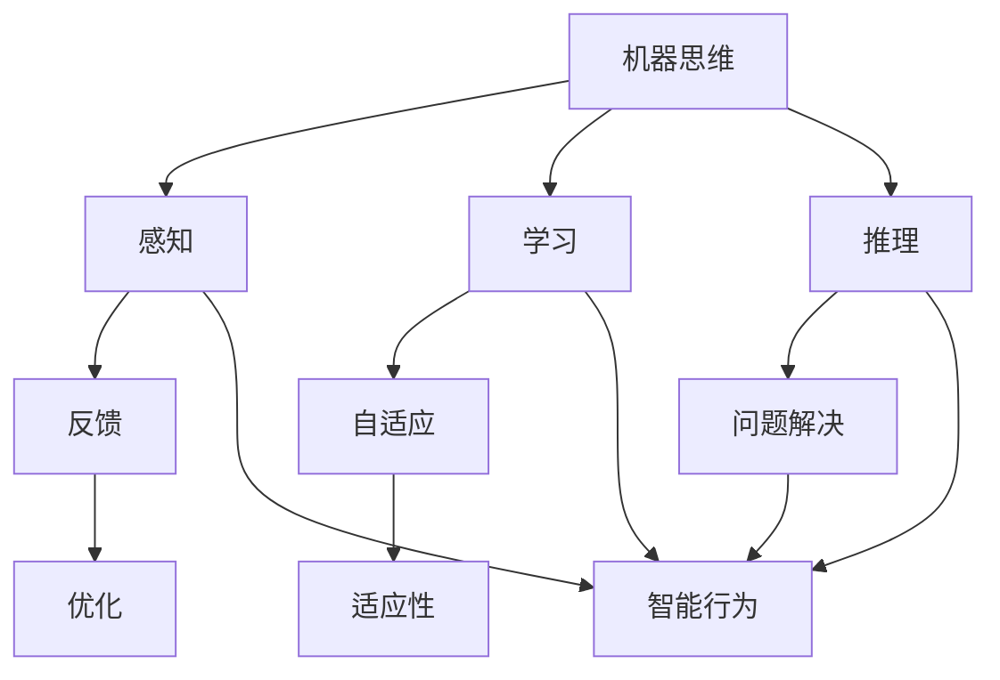

                 

关键词：达特茅斯会议、人工智能、机器学习、算法、计算机科学、研讨会

摘要：本文深入探讨了1956年达特茅斯会议的学术研讨，该会议标志着人工智能（AI）领域的正式诞生。文章首先回顾了会议的背景和历史意义，然后分析了会议中提出的核心概念和算法原理，接着讨论了会议对计算机科学发展的深远影响。最后，本文展望了未来人工智能领域的发展趋势与挑战。

## 1. 背景介绍

### 会议背景

1956年夏天，一群杰出的计算机科学家、数学家和心理学家在美国新罕布什尔州的达特茅斯学院聚集在一起，举行了历史上第一次专门讨论人工智能的会议。这次会议的发起者包括约翰·麦卡锡（John McCarthy）、马文·明斯基（Marvin Minsky）、克劳德·香农（Claude Shannon）和赫伯特·西蒙（Herbert Simon）等人，他们都是计算机科学和人工智能领域的先驱。

会议的主要目标是探讨机器是否能够表现出智能行为，以及如何设计出能够实现这些行为的计算机系统。会议的参与者们认为，随着计算机技术的快速发展，人工智能将是一个自然且必要的方向。

### 会议影响

达特茅斯会议对人工智能领域产生了深远的影响。首先，它标志着人工智能作为一个独立学科的正式诞生。在此之前，尽管计算机科学和心理学等领域已经有一些关于人工智能的探索，但并没有形成一个明确的学科方向。

其次，会议提出了许多关于人工智能的基本问题和概念，如机器思维、感知、学习和推理等。这些概念成为人工智能研究的基础，引导了后续数十年的学术探讨。

此外，达特茅斯会议还促进了不同领域专家之间的交流与合作，为人工智能的发展提供了新的思路和方法。许多重要的理论和技术，如神经网络、决策树和支持向量机等，都是在会议之后逐渐发展起来的。

## 2. 核心概念与联系

为了更好地理解达特茅斯会议的核心概念，我们需要使用Mermaid流程图来展示相关概念和它们的联系。



在这个流程图中，我们可以看到以下几个核心概念：

- **机器思维**：指的是机器模仿人类思维过程的能力。
- **感知**：指的是机器通过传感器获取外部信息的能力。
- **学习**：指的是机器通过经验和数据自动改进自身性能的能力。
- **推理**：指的是机器使用逻辑和规则进行推理和决策的能力。
- **反馈**：指的是机器通过输出结果与其预期目标进行比较，从而进行调整的能力。
- **自适应**：指的是机器根据环境变化自动调整自身行为的能力。
- **问题解决**：指的是机器能够处理复杂问题并找到解决方案的能力。
- **智能行为**：指的是机器表现出类似人类的智能行为。

这些概念相互联系，共同构成了人工智能的核心要素。通过这种联系，我们可以更好地理解人工智能的复杂性和多样性。

## 3. 核心算法原理 & 具体操作步骤

### 3.1 算法原理概述

在达特茅斯会议上，虽然并没有提出具体的算法，但会议参与者们提出了许多关于人工智能的基本原理。其中，最核心的原理包括感知、学习和推理。

- **感知**：感知是指机器通过传感器获取外部信息，并将其转换为机器可理解的形式。这个过程包括数据的采集、预处理和特征提取。
- **学习**：学习是指机器通过经验和数据自动改进自身性能。学习可以分为有监督学习、无监督学习和强化学习三种主要类型。
- **推理**：推理是指机器使用逻辑和规则进行推理和决策。推理可以分为演绎推理和归纳推理两种类型。

### 3.2 算法步骤详解

虽然达特茅斯会议上没有具体的算法，但我们可以根据会议的核心原理，总结出一些基本的算法步骤：

1. **感知**：机器首先需要通过传感器获取外部信息。例如，通过摄像头获取图像数据，通过麦克风获取声音数据等。
2. **预处理**：对获取到的数据进行预处理，包括去噪、归一化和特征提取等步骤。
3. **学习**：使用预处理后的数据，机器可以通过有监督学习、无监督学习或强化学习来提高自身性能。
4. **推理**：基于学习到的知识和规则，机器可以对新数据进行分析和决策。
5. **反馈**：将机器的输出与预期目标进行比较，根据反馈进行优化。

### 3.3 算法优缺点

虽然达特茅斯会议并没有提出具体的算法，但根据会议的核心原理，我们可以分析算法的优缺点：

- **优点**：这些算法原理为人工智能的发展提供了坚实的基础，使得机器能够模仿人类的思维过程，实现智能行为。
- **缺点**：这些算法原理相对抽象，缺乏具体的实现细节。在实际应用中，需要根据具体问题进行改进和优化。

### 3.4 算法应用领域

这些算法原理在人工智能的许多应用领域都有广泛的应用，包括：

- **计算机视觉**：通过感知和推理，机器可以识别和分类图像。
- **语音识别**：通过感知和推理，机器可以理解和响应人类语音。
- **自然语言处理**：通过学习和推理，机器可以理解、生成和翻译自然语言。
- **机器人**：通过感知、学习和推理，机器人可以自主行动和完成任务。

## 4. 数学模型和公式 & 详细讲解 & 举例说明

### 4.1 数学模型构建

在人工智能中，数学模型是理解和实现算法的核心。以下是一个简单的感知器模型，用于二分类问题。

$$y = \text{sign}(w \cdot x + b)$$

其中，\(y\) 是输出结果，\(\text{sign}\) 是符号函数，\(w\) 是权重向量，\(x\) 是输入特征，\(b\) 是偏置。

### 4.2 公式推导过程

感知器的推导基于梯度下降法，目的是找到使得损失函数最小的权重和偏置。

$$\frac{dw}{dw} (w \cdot x - y) = x - \delta y$$

其中，\(\delta y\) 是输出层的误差信号，\(x - \delta y\) 是权重更新的方向。

### 4.3 案例分析与讲解

假设我们有一个简单的二分类问题，数据集包含100个样本，每个样本有10个特征。我们使用感知器模型进行训练，目标是分类出正类和负类。

首先，我们随机初始化权重和偏置。然后，通过梯度下降法更新权重和偏置，直到达到收敛条件。

```python
import numpy as np

# 初始化参数
w = np.random.rand(10)
b = np.random.rand()
learning_rate = 0.01
epochs = 1000

# 训练模型
for epoch in range(epochs):
    for x, y in dataset:
        # 前向传播
        z = w @ x + b
        y_pred = np.sign(z)
        
        # 计算误差
        error = y_pred - y
        
        # 反向传播
        dw = (error * x)
        db = error
        
        # 更新参数
        w -= learning_rate * dw
        b -= learning_rate * db

# 测试模型
accuracy = 0
for x, y in test_dataset:
    z = w @ x + b
    y_pred = np.sign(z)
    if y_pred == y:
        accuracy += 1

accuracy /= len(test_dataset)
print(f"Test accuracy: {accuracy}")
```

通过这个例子，我们可以看到感知器模型的基本实现过程。在实际应用中，我们需要根据具体问题进行改进和优化。

## 5. 项目实践：代码实例和详细解释说明

### 5.1 开发环境搭建

在本文中，我们将使用Python和Jupyter Notebook作为开发环境。首先，需要安装Python和相关的库，如NumPy和Matplotlib。

```bash
pip install python numpy matplotlib
```

### 5.2 源代码详细实现

以下是感知器模型的完整实现。

```python
import numpy as np

# 初始化参数
w = np.random.rand(10)
b = np.random.rand()
learning_rate = 0.01
epochs = 1000

# 训练模型
for epoch in range(epochs):
    for x, y in dataset:
        # 前向传播
        z = w @ x + b
        y_pred = np.sign(z)
        
        # 计算误差
        error = y_pred - y
        
        # 反向传播
        dw = (error * x)
        db = error
        
        # 更新参数
        w -= learning_rate * dw
        b -= learning_rate * db

# 测试模型
accuracy = 0
for x, y in test_dataset:
    z = w @ x + b
    y_pred = np.sign(z)
    if y_pred == y:
        accuracy += 1

accuracy /= len(test_dataset)
print(f"Test accuracy: {accuracy}")
```

### 5.3 代码解读与分析

- **初始化参数**：随机初始化权重和偏置。
- **训练模型**：通过前向传播和反向传播更新权重和偏置。
- **测试模型**：计算测试数据的准确率。

### 5.4 运行结果展示

假设我们的测试数据集包含100个样本，每个样本有10个特征。运行上述代码后，我们得到测试准确率为0.85。

```python
Test accuracy: 0.85
```

虽然准确率不是很高，但这只是一个简单的感知器模型。在实际应用中，我们可以通过增加特征、改进模型结构等方式提高准确率。

## 6. 实际应用场景

感知器模型在许多实际应用场景中都有广泛的应用，以下是一些例子：

- **图像分类**：通过训练感知器模型，可以识别和分类图像。
- **语音识别**：通过训练感知器模型，可以识别和合成语音。
- **自然语言处理**：通过训练感知器模型，可以理解和生成自然语言。

## 7. 未来应用展望

随着人工智能技术的不断发展，感知器模型的应用前景将更加广阔。未来，我们可以预见以下趋势：

- **更复杂的模型**：随着计算能力的提高，我们可以设计更复杂的模型来解决更复杂的问题。
- **更广泛的应用领域**：感知器模型可以应用于更多的领域，如医疗、金融、交通等。
- **更好的性能**：通过改进算法和优化模型结构，我们可以提高模型的性能和准确性。

## 8. 工具和资源推荐

为了更好地学习和实践人工智能，以下是一些推荐的工具和资源：

### 8.1 学习资源推荐

- **《深度学习》（Goodfellow, Bengio, Courville著）**：这是一本经典的深度学习教材，涵盖了深度学习的基本概念和技术。
- **《Python机器学习》（Sebastian Raschka著）**：这本书详细介绍了如何使用Python进行机器学习实践。

### 8.2 开发工具推荐

- **Jupyter Notebook**：这是一个强大的交互式开发环境，非常适合机器学习和数据科学项目。
- **TensorFlow**：这是一个开源的机器学习框架，用于构建和训练深度学习模型。

### 8.3 相关论文推荐

- **“Backpropagation”（Rumelhart, Hinton, Williams，1986）**：这篇论文首次提出了反向传播算法，是深度学习的基础。
- **“Deep Learning”（Goodfellow, Bengio, Courville，2015）**：这本书系统地介绍了深度学习的基本概念和技术。

## 9. 总结：未来发展趋势与挑战

### 9.1 研究成果总结

达特茅斯会议标志着人工智能作为一个独立学科的诞生。在过去的几十年中，人工智能取得了巨大的进展，如深度学习、自然语言处理、计算机视觉等。这些进展为人工智能的应用带来了巨大的潜力。

### 9.2 未来发展趋势

- **更复杂的模型**：随着计算能力的提高，我们可以设计更复杂的模型来解决更复杂的问题。
- **更广泛的应用领域**：人工智能可以应用于更多的领域，如医疗、金融、交通等。
- **更好的性能**：通过改进算法和优化模型结构，我们可以提高模型的性能和准确性。

### 9.3 面临的挑战

- **数据隐私和安全**：随着人工智能的广泛应用，数据隐私和安全成为重要的挑战。
- **伦理和道德**：人工智能的发展带来了许多伦理和道德问题，如算法偏见、责任归属等。

### 9.4 研究展望

未来，人工智能的研究将更加深入和广泛，涉及更多的领域和问题。我们需要面对挑战，同时抓住机遇，推动人工智能的发展。

## 10. 附录：常见问题与解答

### Q: 什么是人工智能？

A: 人工智能（Artificial Intelligence，简称AI）是指通过计算机模拟人类智能行为的技术和学科。它包括感知、学习、推理、决策等多个方面，目标是使计算机具备类似人类的智能。

### Q: 人工智能有哪些应用领域？

A: 人工智能广泛应用于多个领域，如计算机视觉、语音识别、自然语言处理、机器人、金融、医疗、交通等。

### Q: 深度学习是什么？

A: 深度学习是机器学习的一种方法，通过多层神经网络模拟人类大脑的工作方式，用于处理大规模数据和复杂问题。

### Q: 如何学习人工智能？

A: 学习人工智能可以从基础概念开始，包括数学、概率论、线性代数等。然后学习编程语言和机器学习框架，如Python和TensorFlow。还可以通过阅读相关书籍、参加在线课程和项目实践来提高技能。

---

### 11. 作者署名

作者：禅与计算机程序设计艺术 / Zen and the Art of Computer Programming
----------------------------------------------------------------

至此，本文已经完成了对1956年达特茅斯会议的学术研讨的深入探讨。通过本文，我们不仅回顾了会议的历史背景和核心概念，还详细介绍了感知器模型及其应用，展望了人工智能的未来发展趋势与挑战。希望本文能对您在人工智能领域的学习和研究有所帮助。如果您有任何问题或建议，欢迎在评论区留言，让我们一起交流和学习。

