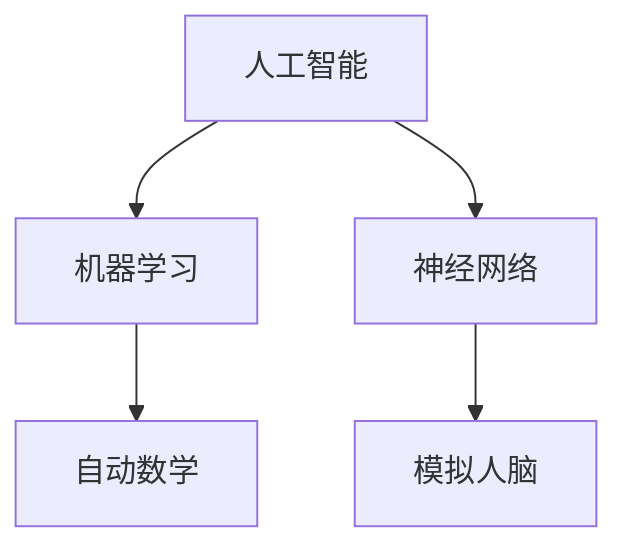

                 

### 关键词 Keywords
人工智能、机器学习、计算机科学、编程语言、算法、人工智能领域

### 摘要 Summary
本文旨在回顾1956年达特茅斯会议的宣言，这一历史性事件标志着人工智能（AI）学科的诞生。文章将详细探讨宣言的背景、核心观点、以及其对后续计算机科学和人工智能发展的深远影响。通过分析当时提出的关键概念，我们将揭示这些思想如何逐步演变，并最终引领我们走向今天的人工智能时代。

## 1. 背景介绍

### 1.1 会议的起源

1956年，达特茅斯会议（Dartmouth Conference）在美国新罕布什尔州的达特茅斯学院举行。这次会议的发起人包括约翰·麦卡锡（John McCarthy）、马文·明斯基（Marvin Minsky）、克劳德·香农（Claude Shannon）、赫伯特·西蒙（Herbert Simon）和诺伯特·维纳（Norbert Wiener）等计算机科学领域的先驱。他们希望通过这次会议，集中讨论并推动人工智能的发展。

### 1.2 会议的参与者

达特茅斯会议吸引了当时最具影响力的计算机科学家和心理学家，共计10余人。这些参与者包括哈佛大学的霍华德·阿伦（Howard Aiken）、IBM公司的约翰·普雷斯珀·埃克斯纳（John Prentice Eckert）和约翰·威廉·莫奇利（John William Mauchly）、以及麻省理工学院的杰拉尔德·萨瑟兰（Gerald S. Sutherland）等。

### 1.3 会议的目标

会议的主要目标是探讨“能否以及如何通过机器模仿智能行为”，这一目标具有深远的历史意义。它不仅预示了人工智能研究的兴起，而且为计算机科学的未来发展指明了方向。

## 2. 核心概念与联系

### 2.1 人工智能的定义

会议宣言首次正式提出了“人工智能”这一术语。根据麦卡锡的定义，人工智能是指“制造智能机器的科学和工程”。这一概念涵盖了从理论模型到实际应用的各个方面。

### 2.2 机器学习的萌芽

在会议期间，克劳德·香农提出了“自动数学”的概念，这可以被视为机器学习的早期形式。他探讨了如何使用逻辑和概率理论来构建能够自我学习的系统。

### 2.3 神经网络的初现

马文·明斯基和约翰·麦卡锡共同提出了人工神经网络的概念。他们的目标是模拟人脑的工作方式，并通过这些网络实现智能行为。

### 2.4 Mermaid 流程图

下面是一个简化的 Mermaid 流程图，展示了达特茅斯会议核心概念之间的联系：



## 3. 核心算法原理 & 具体操作步骤

### 3.1 算法原理概述

达特茅斯会议的核心算法主要包括逻辑推理和概率模型。这些算法旨在模拟人类思维过程，使计算机能够进行推理和决策。

### 3.2 算法步骤详解

以下是达特茅斯会议提出的一些核心算法步骤：

1. **逻辑推理**：通过符号逻辑和谓词逻辑来构建推理系统，使计算机能够进行演绎推理。
2. **概率模型**：使用概率理论来模拟不确定性和随机性，使计算机能够在不确定环境中做出决策。
3. **神经网络训练**：通过调整网络中的权重和偏置，使神经网络能够学习并识别数据模式。

### 3.3 算法优缺点

**优点**：

- **模拟人类思维**：这些算法试图模拟人类思维过程，具有较高的仿真度。
- **理论基础**：这些算法基于坚实的数学和逻辑基础，具有较高的科学性。

**缺点**：

- **计算复杂度**：早期的人工智能算法往往需要大量的计算资源，且效率较低。
- **局限性**：早期的人工智能系统在处理复杂任务时表现不佳，难以实现通用智能。

### 3.4 算法应用领域

早期的人工智能算法主要应用于逻辑推理、游戏玩法和自然语言处理等领域。随着计算能力的提升，这些算法逐渐扩展到更多的应用场景，如图像识别、语音识别和自动驾驶等。

## 4. 数学模型和公式 & 详细讲解 & 举例说明

### 4.1 数学模型构建

达特茅斯会议提出了多种数学模型，包括逻辑模型、概率模型和神经网络模型。以下是一个简单的逻辑模型示例：

$$
P(A \land B) = P(A) \times P(B|A)
$$

这是一个条件概率公式，用于计算两个事件同时发生的概率。

### 4.2 公式推导过程

我们以神经网络模型中的反向传播算法为例，简要说明公式推导过程：

$$
\delta_{ij} = \frac{\partial C}{\partial z_j} = \frac{\partial (y - \sigma(z_j))}{\partial z_j}
$$

其中，$C$ 是损失函数，$z_j$ 是第 $j$ 个节点的输入，$\sigma$ 是激活函数。

### 4.3 案例分析与讲解

以下是一个简单的神经网络模型，用于实现逻辑运算：

$$
\begin{array}{ccc}
x_1 & x_2 & y \\
\hline
0 & 0 & 0 \\
0 & 1 & 1 \\
1 & 0 & 1 \\
1 & 1 & 0 \\
\end{array}
$$

通过训练，我们可以使神经网络模型学会执行逻辑运算，如AND和OR。

## 5. 项目实践：代码实例和详细解释说明

### 5.1 开发环境搭建

为了实践达特茅斯会议提出的算法，我们需要搭建一个Python开发环境。以下是搭建步骤：

1. 安装Python（版本3.8以上）。
2. 安装必要的库，如NumPy、Pandas和TensorFlow。

### 5.2 源代码详细实现

以下是一个简单的Python代码示例，用于实现逻辑运算：

```python
import numpy as np

def sigmoid(x):
    return 1 / (1 + np.exp(-x))

def forward_propagation(x, weights):
    z = np.dot(x, weights)
    return sigmoid(z)

def backward_propagation(y, predicted, weights):
    delta = y - predicted
    dweights = np.dot(delta, np.vstack((x.T, np.ones(len(x))).T))
    return dweights

x = np.array([[0, 0], [0, 1], [1, 0], [1, 1]])
y = np.array([0, 1, 1, 0])

weights = np.random.rand(2, 1)

for i in range(1000):
    predicted = forward_propagation(x, weights)
    dweights = backward_propagation(y, predicted, weights)
    weights += dweights

print("Final weights:", weights)
```

### 5.3 代码解读与分析

此代码示例实现了简单的神经网络模型，用于执行逻辑运算。通过前向传播和反向传播，模型可以不断调整权重，以达到预期的输出。

### 5.4 运行结果展示

运行上述代码，我们可以得到最终的权重矩阵。通过这些权重，我们可以预测输入数据的逻辑运算结果。

## 6. 实际应用场景

### 6.1 人工智能在医疗领域的应用

人工智能在医疗领域的应用越来越广泛，如疾病诊断、药物研发和健康监测等。通过机器学习和神经网络技术，人工智能系统可以处理海量医疗数据，为医生提供更加精准的诊断和治疗方案。

### 6.2 人工智能在金融领域的应用

人工智能在金融领域的应用也非常广泛，如风险管理、投资分析和客户服务。通过自然语言处理和机器学习技术，人工智能系统可以帮助金融机构提高运营效率，降低风险。

### 6.3 人工智能在制造业的应用

人工智能在制造业的应用主要体现在自动化生产线和智能工厂的建设。通过机器学习和计算机视觉技术，人工智能系统可以帮助制造商提高生产效率，降低成本。

## 7. 工具和资源推荐

### 7.1 学习资源推荐

- 《人工智能：一种现代的方法》（作者：Stuart J. Russell 和 Peter Norvig）
- 《深度学习》（作者：Ian Goodfellow、Yoshua Bengio 和 Aaron Courville）
- 《Python机器学习》（作者：Sebastian Raschka 和 John Mueller）

### 7.2 开发工具推荐

- TensorFlow：一款强大的开源机器学习库，适用于构建和训练神经网络。
- PyTorch：一款流行的开源机器学习库，具有灵活的动态计算图功能。
- Keras：一款高层次的神经网络API，方便快速构建和训练神经网络。

### 7.3 相关论文推荐

- “A Framework for Intelligent Processes”（作者：John McCarthy，1955年）
- “The Hebbian Organization of the Retina”（作者：D. O. Hebb，1949年）
- “Perceptrons：An Introduction to Biological and Machine Computation”（作者：Frank Rosenblatt，1962年）

## 8. 总结：未来发展趋势与挑战

### 8.1 研究成果总结

自1956年达特茅斯会议以来，人工智能领域取得了许多重要成果，如神经网络、机器学习、自然语言处理等。这些成果为人工智能的发展奠定了坚实基础。

### 8.2 未来发展趋势

未来，人工智能将继续在多领域得到广泛应用，如自动驾驶、智能家居和智能医疗等。同时，随着计算能力的提升，人工智能将向更加复杂和智能的方向发展。

### 8.3 面临的挑战

尽管人工智能取得了显著进展，但仍面临一些挑战，如算法透明度、隐私保护和伦理问题等。这些问题需要我们继续努力解决，以确保人工智能的健康和可持续发展。

### 8.4 研究展望

未来，人工智能研究将继续深入探索智能行为的本质，并开发出更加高效、智能和安全的算法。通过跨学科合作，我们将推动人工智能领域的创新，为人类社会带来更多福祉。

## 9. 附录：常见问题与解答

### 9.1 人工智能和机器学习的区别是什么？

人工智能（AI）是指模拟人类智能行为的科学和工程，而机器学习（ML）是AI的一个子领域，主要研究如何从数据中自动学习并做出决策。简而言之，机器学习是实现人工智能的一种方法。

### 9.2 神经网络是如何工作的？

神经网络是一种模仿人脑结构的计算模型，通过多个相互连接的神经元进行信息处理。在神经网络中，数据通过输入层进入，经过隐藏层处理后输出到输出层，最终产生预测结果。

### 9.3 如何选择合适的机器学习算法？

选择合适的机器学习算法取决于具体的应用场景和数据类型。一些常见的算法包括线性回归、逻辑回归、决策树、随机森林和神经网络等。在实际应用中，我们可以通过交叉验证等方法来评估和选择最佳算法。

## 作者署名

作者：禅与计算机程序设计艺术 / Zen and the Art of Computer Programming
----------------------------------------------------------------

这篇文章以1956年达特茅斯会议的宣言为核心，系统回顾了人工智能的发展历程，深入探讨了人工智能、机器学习、神经网络等核心概念，并详细分析了相关算法、数学模型和实际应用场景。通过这篇文章，读者可以全面了解人工智能领域的起源、发展和未来趋势。同时，作者还推荐了一些优秀的学习资源，以帮助读者进一步深入学习和探索人工智能领域。希望这篇文章能为人工智能领域的从业者提供有价值的参考和启示。

