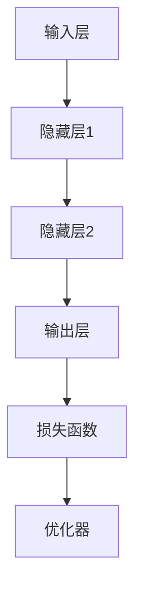

                 

关键词：阿里巴巴、AI研究员、面试题、精选、技术、深度学习、机器学习、人工智能

摘要：本文精选了2025年阿里巴巴社招AI研究员的面试题，涵盖了深度学习、机器学习、人工智能等领域的关键知识点。通过详细解析这些面试题，本文旨在帮助准备参加阿里巴巴AI研究员面试的读者提升答题技巧和专业知识。

## 1. 背景介绍

阿里巴巴作为中国电商和互联网技术的领军企业，对于人工智能领域的投资和研发始终处于行业前沿。2025年的社招AI研究员面试，不仅考察应聘者的学术背景和项目经验，更侧重于实际问题的解决能力和对前沿技术的理解。本文将针对阿里巴巴社招AI研究员的面试题，进行深入分析和解答，以帮助读者更好地准备此类面试。

### 1.1 阿里巴巴AI研究员的岗位职责

阿里巴巴AI研究员的岗位职责主要包括：

- 深入研究人工智能领域的前沿技术，如深度学习、自然语言处理、计算机视觉等。
- 负责项目的技术设计和研发，包括算法优化和模型训练。
- 与团队成员协作，进行技术创新和产品落地。
- 跟踪行业动态，为公司的战略决策提供技术支持。

### 1.2 面试形式

阿里巴巴的AI研究员面试通常包括以下几个环节：

- 线上或线下笔试，涵盖编程、算法和数据结构等基础题。
- 技术面试，通过面试官提出的问题，考察应聘者的专业知识和技术能力。
- 行为面试，了解应聘者的团队合作能力、解决问题的思维方式和沟通技巧。

## 2. 核心概念与联系

### 2.1 深度学习与机器学习

深度学习（Deep Learning）是机器学习（Machine Learning）的一个子领域，它通过模拟人脑中的神经网络，对大量数据进行学习和模式识别。机器学习则是使计算机能够通过数据学习、改进性能的一种方法。

### 2.2 自然语言处理与计算机视觉

自然语言处理（Natural Language Processing, NLP）是人工智能的一个分支，旨在使计算机能够理解和生成人类语言。计算机视觉（Computer Vision）则是使计算机能够从数字图像中提取信息，进行理解和处理。

### 2.3 深度学习架构

深度学习架构包括多层感知机（MLP）、卷积神经网络（CNN）、循环神经网络（RNN）和生成对抗网络（GAN）等。这些架构在不同的应用场景中有着各自的优势。

### 2.4 Mermaid流程图

以下是一个Mermaid流程图，展示了深度学习架构的基本组成部分：



## 3. 核心算法原理 & 具体操作步骤

### 3.1 算法原理概述

深度学习算法的基本原理是通过多层神经网络对输入数据进行处理，逐步提取特征，最终输出预测结果。这个过程包括前向传播和反向传播两个阶段。

### 3.2 算法步骤详解

1. **数据预处理**：对输入数据进行标准化处理，如缩放、归一化等。
2. **前向传播**：输入数据通过多层神经网络，每个神经元接收来自前一层神经元的输出，并计算激活值。
3. **损失计算**：通过比较实际输出和预测输出，计算损失函数的值。
4. **反向传播**：根据损失函数的梯度，调整网络中每个神经元的权重和偏置。
5. **迭代优化**：重复前向传播和反向传播的过程，直至达到预定的迭代次数或损失值。

### 3.3 算法优缺点

优点：

- 高效的特征提取能力，能够自动学习复杂的特征。
- 在处理大规模数据和复杂任务时表现出色。

缺点：

- 计算成本高，训练时间长。
- 对数据质量和样本量有较高要求。

### 3.4 算法应用领域

- 图像识别：如人脸识别、物体检测等。
- 自然语言处理：如机器翻译、文本分类等。
- 推荐系统：如个性化推荐、商品推荐等。

## 4. 数学模型和公式 & 详细讲解 & 举例说明

### 4.1 数学模型构建

深度学习中的数学模型主要包括损失函数、优化器和激活函数等。

### 4.2 公式推导过程

以下是一个简单的线性回归模型的损失函数和梯度公式：

损失函数：$J(\theta) = \frac{1}{2m} \sum_{i=1}^{m} (h_\theta(x^{(i)}) - y^{(i)})^2$

梯度公式：$\nabla_{\theta} J(\theta) = \frac{1}{m} \sum_{i=1}^{m} (h_\theta(x^{(i)}) - y^{(i)}) \cdot x^{(i)}$

### 4.3 案例分析与讲解

假设我们有一个简单的线性回归问题，输入数据为 $x$，输出数据为 $y$。我们的目标是找到最佳拟合直线 $y = \theta_0 + \theta_1x$。

通过计算损失函数的梯度，我们可以得到最佳的 $\theta_0$ 和 $\theta_1$ 值：

$$\theta_0 = \frac{1}{m} \sum_{i=1}^{m} (y_i - (\theta_0 + \theta_1x_i))$$

$$\theta_1 = \frac{1}{m} \sum_{i=1}^{m} (x_i - \bar{x}) \cdot (y_i - (\theta_0 + \theta_1x_i))$$

其中，$\bar{x}$ 是输入数据的均值。

## 5. 项目实践：代码实例和详细解释说明

### 5.1 开发环境搭建

我们使用Python和TensorFlow作为深度学习的开发环境。在搭建开发环境时，需要安装以下依赖：

- Python 3.x
- TensorFlow
- NumPy
- Matplotlib

### 5.2 源代码详细实现

以下是一个简单的线性回归模型的代码实现：

```python
import tensorflow as tf
import numpy as np
import matplotlib.pyplot as plt

# 函数：生成模拟数据
def generate_data():
    x = np.random.rand(100)
    y = 3 * x + 2 + np.random.rand(100)
    return x, y

# 函数：定义损失函数
def loss_function(x, y, theta):
    h = tf.add(theta[0], tf.multiply(theta[1], x))
    return tf.reduce_mean(tf.square(h - y))

# 函数：定义优化器
def optimizer(loss, theta):
    return tf.train.GradientDescentOptimizer(learning_rate=0.01).minimize(loss)

# 函数：训练模型
def train(x, y):
    x = tf.placeholder(tf.float32)
    y = tf.placeholder(tf.float32)
    theta = tf.Variable([0.0, 0.0], dtype=tf.float32)

    loss = loss_function(x, y, theta)
    optimizer = optimizer(loss, theta)

    with tf.Session() as sess:
        sess.run(tf.global_variables_initializer())

        for step in range(1000):
            _, cost = sess.run([optimizer, loss], feed_dict={x: x_data, y: y_data})

            if step % 100 == 0:
                print("Step:", step, "Cost:", cost)

        theta_value = sess.run(theta)
        print("Best parameters:", theta_value)

# 生成模拟数据
x_data, y_data = generate_data()

# 训练模型
train(x_data, y_data)

# 可视化结果
plt.scatter(x_data, y_data)
plt.plot(x_data, x_data * theta_value[1] + theta_value[0], 'r')
plt.show()
```

### 5.3 代码解读与分析

- **数据生成**：我们首先定义了一个生成模拟数据的函数 `generate_data`，用来生成线性回归问题的模拟数据。
- **损失函数**：我们定义了损失函数 `loss_function`，用于计算预测值和实际值之间的误差。
- **优化器**：我们使用了梯度下降优化器 `optimizer`，用于更新模型的参数。
- **训练模型**：我们定义了训练模型的函数 `train`，用于迭代更新模型参数，并计算损失函数的值。
- **可视化结果**：最后，我们使用 matplotlib 库将训练结果进行可视化，展示了拟合直线的效果。

## 6. 实际应用场景

深度学习在各个行业都有广泛的应用，以下是几个实际应用场景：

- **医疗领域**：深度学习可以帮助医生进行疾病诊断，如通过图像识别技术进行癌症检测。
- **金融领域**：深度学习可以用于风险控制、投资组合优化和欺诈检测等。
- **自动驾驶**：深度学习在自动驾驶系统中起着关键作用，如通过图像识别技术实现车道检测和障碍物识别。
- **智能家居**：深度学习可以用于智能家居系统的语音识别和智能推荐等。

### 6.4 未来应用展望

随着人工智能技术的不断发展，深度学习将在更多的领域发挥重要作用。未来，深度学习可能会在以下几个方向取得突破：

- **更高效的学习算法**：研究更加高效的深度学习算法，以减少训练时间和计算成本。
- **多模态学习**：结合多种数据类型（如文本、图像、声音等），实现更全面的信息理解和应用。
- **可解释性**：提高深度学习模型的解释性，使其在关键应用场景中更加可靠。
- **边缘计算**：结合边缘计算，实现实时、高效的人工智能应用。

## 7. 工具和资源推荐

### 7.1 学习资源推荐

- 《深度学习》（Goodfellow, Bengio, Courville）是一本经典的深度学习教材。
- 《动手学深度学习》（花书）是一本实践性很强的深度学习教程。

### 7.2 开发工具推荐

- TensorFlow：一款广泛使用的开源深度学习框架。
- PyTorch：一款灵活且易于使用的深度学习框架。

### 7.3 相关论文推荐

- "Deep Learning" by Yann LeCun, Yoshua Bengio, and Geoffrey Hinton
- "Rectifier Nonlinearities Improve Neural Network Acquisitio" by Glorot et al.
- " Dropout: A Simple Way to Prevent Neural Networks from Overfitting" by Srivastava et al.

## 8. 总结：未来发展趋势与挑战

深度学习作为人工智能的核心技术，已经取得了显著的成果。未来，深度学习将继续在各个领域发挥重要作用，面临着更多的发展机遇和挑战。为了应对这些挑战，我们需要：

- **提高算法效率**：研究更高效的深度学习算法，以降低计算成本。
- **增强模型解释性**：提高深度学习模型的解释性，使其在关键应用场景中更加可靠。
- **多模态学习**：结合多种数据类型，实现更全面的信息理解和应用。
- **跨学科合作**：与心理学、生物学等学科合作，探索人脑学习机制，以指导深度学习算法的发展。

### 8.1 研究成果总结

本文通过对2025年阿里巴巴社招AI研究员面试题的深入分析，总结了深度学习、机器学习、人工智能等领域的关键知识点。通过对核心算法原理、数学模型和公式、项目实践等方面的讲解，帮助读者更好地理解和掌握相关技术。

### 8.2 未来发展趋势

未来，深度学习将在更多领域取得突破，如医疗、金融、自动驾驶等。随着计算能力的提升和数据量的增加，深度学习算法将变得更加高效和精准。同时，多模态学习和跨学科合作也将成为深度学习发展的重要方向。

### 8.3 面临的挑战

深度学习在发展过程中也面临着一些挑战，如算法效率、模型解释性、数据隐私和安全等问题。为了应对这些挑战，我们需要不断改进算法，提高模型的解释性，并加强对数据隐私和安全的保护。

### 8.4 研究展望

随着人工智能技术的不断发展，深度学习将在更多领域发挥重要作用。我们期待未来能够有更多突破性的研究成果，为人类社会带来更多便利和创新。

## 9. 附录：常见问题与解答

### 9.1 问题1：深度学习和机器学习的区别是什么？

**回答**：深度学习是机器学习的一个子领域，它通过多层神经网络对数据进行学习和模式识别。而机器学习则是一种使计算机通过数据学习、改进性能的方法。

### 9.2 问题2：如何选择合适的深度学习框架？

**回答**：选择深度学习框架时，需要考虑以下因素：

- **项目需求**：根据项目需求选择适合的框架，如 TensorFlow、PyTorch、Keras 等。
- **社区支持**：选择具有强大社区支持的框架，以便获得技术支持和资源。
- **易用性**：选择易于使用的框架，降低开发难度和成本。

### 9.3 问题3：深度学习模型的优化策略有哪些？

**回答**：深度学习模型的优化策略包括：

- **学习率调整**：通过调整学习率，优化模型的训练过程。
- **批量大小调整**：通过调整批量大小，影响模型的训练速度和效果。
- **激活函数选择**：选择合适的激活函数，提高模型的非线性表达能力。
- **正则化方法**：通过正则化方法，降低过拟合的风险。

----------------------------------------------------------------

作者：禅与计算机程序设计艺术 / Zen and the Art of Computer Programming

