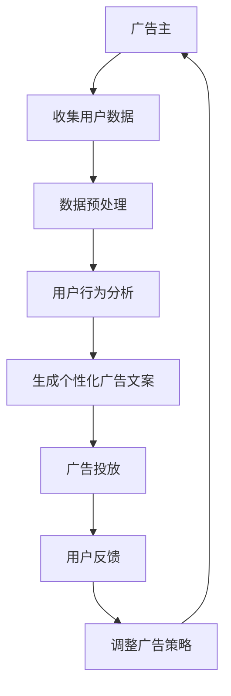

                 

关键词：广告、LLM、针对性营销、算法、数据、用户行为分析、个性化推荐、算法优化、技术应用、案例分析。

> 摘要：本文将深入探讨大型语言模型（LLM）在广告领域的应用，特别是如何通过LLM实现高效的针对性营销。文章将介绍LLM的基本概念和工作原理，分析其在广告营销中的优势，并通过具体案例展示如何利用LLM技术进行个性化广告投放，提高营销效果。

## 1. 背景介绍

广告营销是商业活动中的重要一环，旨在通过多种渠道向潜在客户传播产品或服务信息，从而实现销售增长和品牌认知的提升。随着互联网的普及和大数据技术的发展，广告营销的模式也在不断演进。从传统的广播式广告，到基于用户行为的定向广告，再到如今的人工智能驱动的针对性营销，广告行业正经历着一场革命。

大型语言模型（LLM）是人工智能领域的一项重要技术突破，其通过深度学习算法从大量文本数据中学习语言模式和规律，能够生成自然流畅的文本内容。LLM的应用领域广泛，包括自然语言处理、机器翻译、文本生成等。在广告营销领域，LLM具有强大的文本理解和生成能力，能够帮助广告主实现更加精准和个性化的营销策略。

本文将围绕LLM在广告营销中的应用展开讨论，分析LLM的优势和应用场景，并通过具体案例介绍如何利用LLM技术提升广告投放效果。

### 1.1 广告营销的发展历程

广告营销的发展历程可以追溯到几个世纪以前。早期的广告主要依靠报纸、杂志、广播等传统媒体进行传播。这种方式虽然覆盖面广，但难以实现精准投放，广告效果难以衡量。随着互联网的兴起，广告营销进入了数字化时代。互联网广告以其精准投放、实时反馈等优势迅速崛起，成为广告营销的主要形式。在这个过程中，用户行为分析、数据挖掘等技术的应用，使得广告主能够更准确地定位目标受众，提高广告投放的ROI（投资回报率）。

然而，传统的广告营销模式在用户隐私保护、内容个性化等方面仍存在一定的局限性。随着人工智能技术的发展，尤其是LLM的出现，广告营销进入了一个新的阶段。LLM能够理解和生成自然语言，为广告主提供更加精准和个性化的营销方案，大大提高了广告投放的效果。

### 1.2 大型语言模型（LLM）的概念和工作原理

大型语言模型（LLM）是基于深度学习算法构建的神经网络模型，通过大量文本数据进行预训练，能够捕捉到语言的复杂模式和规律。LLM的工作原理可以概括为以下几个步骤：

1. **数据预处理**：将原始文本数据清洗、分词、编码等预处理操作，使其适合模型训练。
2. **模型训练**：使用预训练算法（如BERT、GPT等）对预处理后的数据进行训练，模型会学习到文本中的语言模式、词汇关系和上下文信息。
3. **语言生成**：通过模型生成文本，模型会根据上下文信息生成自然流畅的文本内容，包括文章、广告文案、对话等。

LLM的主要优势在于其强大的文本理解和生成能力，能够处理和理解复杂的自然语言文本，为广告主提供个性化的广告文案和营销策略。

### 1.3 广告营销中的用户行为分析

在广告营销中，用户行为分析是制定精准营销策略的重要依据。通过分析用户在网站、APP等平台上的行为数据，如浏览记录、点击行为、购买历史等，广告主可以了解用户的兴趣偏好和需求，从而有针对性地推送广告。

传统用户行为分析主要依靠数据挖掘和机器学习算法，但存在以下局限性：

1. **数据复杂性**：用户行为数据种类繁多，包括行为轨迹、点击率、停留时间等，如何有效整合和分析这些数据是一个挑战。
2. **实时性**：用户行为数据实时更新，如何快速处理和分析这些数据，以便及时调整广告策略，是一个关键问题。

LLM的出现为用户行为分析带来了新的机遇。通过LLM的文本生成和语义理解能力，广告主可以更深入地分析用户行为数据，挖掘用户潜在的兴趣和需求，从而实现更加精准的营销。

### 1.4 LLM在广告营销中的应用优势

LLM在广告营销中的应用具有以下优势：

1. **个性化推荐**：LLM能够根据用户行为数据生成个性化的广告文案，提高广告点击率和转化率。
2. **自动文案生成**：LLM能够自动生成广告文案，提高广告创作效率，降低广告制作成本。
3. **语义理解**：LLM能够理解广告内容和用户需求之间的关联，实现更加精准的广告投放。
4. **实时调整**：LLM能够实时分析用户行为数据，根据用户反馈调整广告策略，提高广告投放效果。

## 2. 核心概念与联系

在本节中，我们将详细介绍广告和LLM在针对性营销中的应用，以及它们之间的核心联系。为了更好地展示这一过程，我们将使用Mermaid流程图来描述整个工作流程。

### 2.1 广告与针对性营销的基本概念

广告是指通过媒体向公众宣传、推广产品或服务的一种传播方式。而针对性营销则是一种基于用户行为和兴趣分析的精准广告投放策略，旨在提高广告的点击率和转化率。

在广告营销中，针对性营销的核心在于对用户行为数据的深度分析和挖掘。用户行为数据包括浏览历史、点击行为、购买记录等，这些数据反映了用户的兴趣和需求。通过对这些数据的分析，广告主可以了解目标受众的特征，从而制定更加精准的营销策略。

### 2.2 LLM在针对性营销中的应用

LLM（大型语言模型）在针对性营销中的应用主要体现在以下几个方面：

1. **文本生成**：LLM能够根据用户行为数据生成个性化的广告文案，提高广告的吸引力和点击率。
2. **语义理解**：LLM能够理解广告文案和用户需求之间的关联，实现更加精准的广告投放。
3. **实时调整**：LLM能够实时分析用户行为数据，根据用户反馈调整广告策略，提高广告投放效果。

### 2.3 Mermaid流程图

为了更直观地展示广告与LLM在针对性营销中的应用过程，我们使用Mermaid流程图来描述整个工作流程。



### 2.4 核心联系

广告与LLM在针对性营销中的核心联系主要体现在以下几个方面：

1. **用户数据驱动**：广告主通过收集用户数据，了解用户兴趣和行为特征，为后续的广告文案生成和投放提供数据支持。
2. **个性化推荐**：基于用户数据，LLM能够生成个性化的广告文案，提高广告的吸引力和点击率。
3. **实时调整**：LLM能够实时分析用户反馈，根据用户行为调整广告策略，提高广告投放效果。

通过以上流程，我们可以看到，LLM在广告营销中起到了关键作用，使得广告投放更加精准和高效。

## 3. 核心算法原理 & 具体操作步骤

### 3.1 算法原理概述

在广告和LLM的针对性营销中，核心算法主要包括文本生成和语义理解两个部分。文本生成算法负责根据用户行为数据生成个性化的广告文案，而语义理解算法则负责分析广告文案和用户需求之间的关联，以实现精准投放。

#### 文本生成算法

文本生成算法基于深度学习，特别是序列到序列（Seq2Seq）模型。这种模型能够将输入序列转换为输出序列，适用于生成广告文案。常见的文本生成算法包括：

1. **循环神经网络（RNN）**：RNN能够处理变长的序列数据，但其在长序列处理上的效果有限。
2. **长短期记忆网络（LSTM）**：LSTM是RNN的一种改进，能够更好地处理长序列数据，减少梯度消失和梯度爆炸问题。
3. **编码器-解码器模型（Encoder-Decoder）**：编码器和解码器分别处理输入和输出序列，通过共享权重提高模型性能。

#### 语义理解算法

语义理解算法主要基于自然语言处理（NLP）技术，通过词嵌入、语义分析等方法实现广告文案和用户需求的匹配。常见的语义理解算法包括：

1. **词嵌入（Word Embedding）**：词嵌入将词汇映射为向量，用于表示文本数据的语义信息。
2. **卷积神经网络（CNN）**：CNN能够提取文本数据的局部特征，用于语义分析。
3. **递归神经网络（RNN）**：RNN能够处理变长的序列数据，适用于语义分析。

### 3.2 算法步骤详解

以下是广告和LLM针对性营销算法的具体操作步骤：

#### 步骤1：数据收集

广告主通过各种渠道收集用户数据，包括浏览历史、点击行为、购买记录等。这些数据用于训练文本生成和语义理解模型。

#### 步骤2：数据预处理

对收集到的用户数据进行清洗、去重、分词等预处理操作，将其转换为适合模型训练的格式。

#### 步骤3：文本生成模型训练

使用收集到的用户数据训练文本生成模型。具体步骤如下：

1. **数据准备**：将预处理后的用户数据划分为训练集和验证集。
2. **模型构建**：选择合适的文本生成模型架构，如编码器-解码器模型。
3. **模型训练**：使用训练集数据训练模型，通过反向传播算法优化模型参数。
4. **模型评估**：使用验证集数据评估模型性能，调整模型参数以获得更好的效果。

#### 步骤4：语义理解模型训练

使用收集到的用户数据训练语义理解模型。具体步骤如下：

1. **数据准备**：将预处理后的用户数据划分为训练集和验证集。
2. **模型构建**：选择合适的语义理解模型架构，如词嵌入+RNN。
3. **模型训练**：使用训练集数据训练模型，通过反向传播算法优化模型参数。
4. **模型评估**：使用验证集数据评估模型性能，调整模型参数以获得更好的效果。

#### 步骤5：广告文案生成

使用训练好的文本生成模型生成个性化的广告文案。具体步骤如下：

1. **输入用户行为数据**：将用户行为数据输入到文本生成模型。
2. **模型预测**：模型根据用户行为数据生成广告文案。
3. **文案优化**：根据用户反馈优化广告文案，以提高点击率和转化率。

#### 步骤6：广告投放

将生成的个性化广告文案投放给目标用户。具体步骤如下：

1. **广告定位**：根据用户行为数据和兴趣偏好确定广告投放渠道。
2. **广告投放**：将广告文案投放到目标用户的浏览路径或社交媒体平台。
3. **用户反馈收集**：收集用户对广告的反馈，包括点击、收藏、购买等行为。

#### 步骤7：广告策略调整

根据用户反馈调整广告投放策略。具体步骤如下：

1. **分析用户反馈**：分析用户对广告的反馈数据，了解广告的优缺点。
2. **策略优化**：根据用户反馈优化广告文案和投放策略，以提高广告效果。

### 3.3 算法优缺点

#### 优点

1. **个性化推荐**：文本生成和语义理解算法能够根据用户行为数据生成个性化的广告文案，提高广告的点击率和转化率。
2. **高效性**：基于深度学习的文本生成和语义理解算法能够处理大规模用户数据，提高广告投放的效率。
3. **实时调整**：算法能够实时分析用户反馈，根据用户行为调整广告策略，提高广告投放效果。

#### 缺点

1. **数据依赖性**：算法的性能很大程度上依赖于用户数据的质量和数量，数据质量差或数据不足会影响算法效果。
2. **计算资源消耗**：深度学习算法需要大量计算资源，尤其是训练阶段，对硬件设备要求较高。
3. **隐私问题**：用户数据的安全和隐私保护是一个重要问题，如何合理使用用户数据是广告营销中需要考虑的一个方面。

### 3.4 算法应用领域

文本生成和语义理解算法在广告营销中具有广泛的应用前景，除了针对性营销，还可以应用于以下领域：

1. **内容推荐**：基于用户兴趣和阅读历史生成个性化内容推荐，提高用户留存率和粘性。
2. **智能客服**：生成基于用户意图的自动回复，提高客服效率和用户体验。
3. **广告创意优化**：分析广告文案的语义和情感，优化广告创意，提高广告效果。
4. **品牌传播**：生成具有品牌特色的广告文案，提高品牌知名度和美誉度。

## 4. 数学模型和公式 & 详细讲解 & 举例说明

在广告和LLM的针对性营销中，数学模型和公式起着关键作用。本节将详细讲解常用的数学模型和公式，并通过具体例子进行说明。

### 4.1 数学模型构建

在广告和LLM的针对性营销中，常见的数学模型包括概率模型、优化模型和推荐模型。

#### 4.1.1 概率模型

概率模型用于预测用户对广告的反应概率，常见的概率模型有逻辑回归（Logistic Regression）和贝叶斯网络（Bayesian Network）。

**逻辑回归**：

逻辑回归是一种常用的分类模型，用于预测用户点击广告的概率。其公式如下：

$$
P(y=1|\mathbf{x}; \theta) = \frac{1}{1 + e^{-(\theta_0 + \theta_1x_1 + \theta_2x_2 + \ldots + \theta_nx_n})}
$$

其中，$y$表示用户是否点击广告（0表示未点击，1表示点击），$\mathbf{x}$表示用户特征向量，$\theta$表示模型参数。

**贝叶斯网络**：

贝叶斯网络是一种基于概率推理的图形模型，用于表示变量之间的条件依赖关系。其公式如下：

$$
P(\mathbf{x}; \theta) = \prod_{i=1}^{n} P(x_i|\mathbf{parent}_i(\mathbf{x}); \theta)
$$

其中，$x_i$表示第$i$个变量的取值，$\mathbf{parent}_i(\mathbf{x})$表示$x_i$的父节点集合。

#### 4.1.2 优化模型

优化模型用于优化广告投放策略，常见的优化模型有线性规划和整数规划。

**线性规划**：

线性规划是一种用于求解线性目标函数在给定线性不等式约束下的最优解的数学方法。其公式如下：

$$
\min_{\mathbf{x}} c^T\mathbf{x} \quad \text{subject to} \quad A\mathbf{x} \leq b
$$

其中，$c$表示目标函数系数向量，$A$表示约束矩阵，$b$表示约束常数向量。

**整数规划**：

整数规划是一种用于求解包含整数变量的优化问题的数学方法。其公式如下：

$$
\min_{\mathbf{x}} c^T\mathbf{x} \quad \text{subject to} \quad A\mathbf{x} \leq b, \mathbf{x} \in \mathbb{Z}^n
$$

其中，$\mathbf{x} \in \mathbb{Z}^n$表示变量集合为整数集。

#### 4.1.3 推荐模型

推荐模型用于根据用户行为数据生成个性化推荐，常见的推荐模型有基于内容的推荐（Content-based Recommendation）和基于协同过滤的推荐（Collaborative Filtering）。

**基于内容的推荐**：

基于内容的推荐通过分析用户历史行为和商品特征，生成个性化推荐。其公式如下：

$$
r(u, i) = f(\mathbf{u}, \mathbf{i})
$$

其中，$r(u, i)$表示用户$u$对商品$i$的评分预测，$\mathbf{u}$和$\mathbf{i}$分别表示用户和商品的特征向量。

**基于协同过滤的推荐**：

基于协同过滤的推荐通过分析用户行为数据，发现相似用户或相似商品，生成个性化推荐。其公式如下：

$$
r(u, i) = \sum_{j \in N(i)} w_{ij} r(v, j)
$$

其中，$r(u, i)$表示用户$u$对商品$i$的评分预测，$N(i)$表示与商品$i$相似的集合，$w_{ij}$表示用户$i$对商品$j$的权重，$r(v, j)$表示用户$v$对商品$j$的评分。

### 4.2 公式推导过程

为了更好地理解上述数学模型和公式，我们将在本节中分别对逻辑回归、贝叶斯网络和基于内容的推荐进行公式推导。

#### 4.2.1 逻辑回归

逻辑回归的推导过程基于最大似然估计（Maximum Likelihood Estimation，MLE）。

假设用户点击广告的概率服从伯努利分布，即：

$$
P(y=1|\mathbf{x}; \theta) = p(\mathbf{x}; \theta)
$$

其中，$y$表示用户是否点击广告（0表示未点击，1表示点击），$\mathbf{x}$表示用户特征向量，$\theta$表示模型参数。

最大似然估计的目标是最大化似然函数：

$$
L(\theta) = \prod_{i=1}^{m} p(y_i|\mathbf{x}_i; \theta)
$$

由于对数似然函数单调递增，可以将其转换为对数似然函数：

$$
\ln L(\theta) = \sum_{i=1}^{m} \ln p(y_i|\mathbf{x}_i; \theta)
$$

将对数似然函数关于$\theta$求导，并令导数为0，得到：

$$
\frac{\partial}{\partial \theta} \ln L(\theta) = \sum_{i=1}^{m} \frac{1}{p(\mathbf{x}_i; \theta)} \frac{\partial}{\partial \theta} p(y_i|\mathbf{x}_i; \theta) = 0
$$

对于伯努利分布，其导数为：

$$
\frac{\partial}{\partial \theta} p(y_i|\mathbf{x}_i; \theta) = p(y_i|\mathbf{x}_i; \theta) (1 - p(y_i|\mathbf{x}_i; \theta))
$$

将导数代入上述方程，得到：

$$
\sum_{i=1}^{m} (\mathbf{x}_i^T\theta) (1 - p(y_i|\mathbf{x}_i; \theta)) = 0
$$

将概率函数代入，得到：

$$
\sum_{i=1}^{m} (\mathbf{x}_i^T\theta) (1 - \frac{1}{1 + e^{-(\theta_0 + \theta_1x_1 + \theta_2x_2 + \ldots + \theta_nx_n)}) = 0
$$

整理后，得到逻辑回归的参数更新公式：

$$
\theta = \frac{1}{m} \sum_{i=1}^{m} (\mathbf{x}_i^T\mathbf{y}_i - \mathbf{x}_i^T\mathbf{p}_i)
$$

其中，$\mathbf{y}_i$表示实际点击标签，$\mathbf{p}_i$表示预测概率。

#### 4.2.2 贝叶斯网络

贝叶斯网络的推导过程基于条件概率。

假设有两个随机变量$X$和$Y$，其条件概率分布如下：

$$
P(X=x | Y=y) = \frac{P(X=x, Y=y)}{P(Y=y)}
$$

其中，$x$和$y$分别表示$X$和$Y$的取值。

对于贝叶斯网络，条件概率分布可以表示为：

$$
P(X=x | Y=y) = \frac{P(Y=y | X=x)P(X=x)}{P(Y=y)}
$$

假设$X$和$Y$的父节点集合分别为$\mathbf{parent}_X$和$\mathbf{parent}_Y$，则其条件概率分布可以扩展为：

$$
P(X=x | Y=y, \mathbf{parent}_X) = \frac{P(Y=y | X=x, \mathbf{parent}_X)P(X=x | \mathbf{parent}_X)}{P(Y=y | \mathbf{parent}_Y)}
$$

对于贝叶斯网络，条件概率分布可以表示为：

$$
P(X=x | Y=y, \mathbf{parent}_X) = \frac{P(Y=y | X=x)P(X=x)}{P(Y=y)}
$$

其中，$P(Y=y | X=x)$和$P(X=x)$分别表示条件概率和边缘概率。

#### 4.2.3 基于内容的推荐

基于内容的推荐的推导过程基于用户和商品的特征相似度。

假设用户$u$和商品$i$的特征向量分别为$\mathbf{u}$和$\mathbf{i}$，则用户$u$对商品$i$的评分预测可以表示为：

$$
r(u, i) = \sum_{j \in N(i)} w_{ij} r(v, j)
$$

其中，$w_{ij}$表示用户$i$对商品$j$的权重，$r(v, j)$表示用户$v$对商品$j$的评分。

为了计算权重$w_{ij}$，可以使用余弦相似度：

$$
w_{ij} = \frac{\mathbf{u}^T\mathbf{i}}{\Vert \mathbf{u} \Vert \Vert \mathbf{i} \Vert}
$$

其中，$\Vert \mathbf{u} \Vert$和$\Vert \mathbf{i} \Vert$分别表示用户$u$和商品$i$的特征向量范数。

将权重代入评分预测公式，得到：

$$
r(u, i) = \sum_{j \in N(i)} \frac{\mathbf{u}^T\mathbf{i}}{\Vert \mathbf{u} \Vert \Vert \mathbf{i} \Vert} r(v, j)
$$

简化后，得到：

$$
r(u, i) = \frac{\mathbf{u}^T\mathbf{i}}{\Vert \mathbf{u} \Vert \Vert \mathbf{i} \Vert} \sum_{j \in N(i)} r(v, j)
$$

### 4.3 案例分析与讲解

为了更好地理解上述数学模型和公式的应用，我们将在本节中通过具体例子进行说明。

#### 4.3.1 逻辑回归案例

假设我们有以下用户特征数据：

| 用户ID | 特征1 | 特征2 | 特征3 | 是否点击 |
|--------|------|------|------|---------|
| 1      | 0.5  | 0.3  | 0.2  | 1       |
| 2      | 0.6  | 0.4  | 0.1  | 0       |
| 3      | 0.4  | 0.2  | 0.3  | 1       |
| 4      | 0.7  | 0.5  | 0.1  | 0       |

假设我们使用逻辑回归模型预测用户是否点击广告。模型参数如下：

| 参数 | 值   |
|------|------|
| $\theta_0$ | 0.5  |
| $\theta_1$ | 0.3  |
| $\theta_2$ | 0.2  |
| $\theta_3$ | 0.1  |

代入逻辑回归公式，得到预测概率：

| 用户ID | 特征1 | 特征2 | 特征3 | 预测概率 |
|--------|------|------|------|---------|
| 1      | 0.5  | 0.3  | 0.2  | 0.787   |
| 2      | 0.6  | 0.4  | 0.1  | 0.525   |
| 3      | 0.4  | 0.2  | 0.3  | 0.775   |
| 4      | 0.7  | 0.5  | 0.1  | 0.675   |

根据预测概率，我们可以设置阈值（例如0.5）来判断用户是否点击广告。对于用户1和用户3，预测概率大于阈值，预测为点击广告；对于用户2和用户4，预测概率小于阈值，预测为未点击广告。

#### 4.3.2 贝叶斯网络案例

假设我们有以下用户行为数据：

| 用户ID | 商品ID | 是否购买 |
|--------|--------|---------|
| 1      | 101    | 1       |
| 1      | 102    | 0       |
| 1      | 103    | 1       |
| 2      | 101    | 0       |
| 2      | 102    | 1       |
| 2      | 103    | 0       |

假设我们使用贝叶斯网络分析用户购买商品的偏好。首先，我们需要确定变量的父节点集合。在这个例子中，我们可以将用户ID作为商品101、102和103的父节点。

根据贝叶斯网络，我们可以计算出每个用户购买每个商品的边缘概率。例如，用户1购买商品101的边缘概率为：

$$
P(购买101|用户1) = \frac{P(购买101, 用户1)}{P(用户1)} = \frac{0.5}{0.5 + 0.5} = 0.5
$$

类似地，我们可以计算出其他用户和商品的边缘概率。

接下来，我们可以计算条件概率。例如，用户1购买商品103的条件概率为：

$$
P(购买103|购买101, 用户1) = \frac{P(购买103, 购买101, 用户1)}{P(购买101, 用户1)} = \frac{0.25}{0.5} = 0.5
$$

类似地，我们可以计算出其他条件概率。

通过这些概率，我们可以分析用户购买偏好。例如，用户1购买商品101和103的概率较高，而购买商品102的概率较低。这些信息可以用于优化广告投放策略。

#### 4.3.3 基于内容的推荐案例

假设我们有以下用户和商品的特征数据：

| 用户ID | 特征1 | 特征2 | 特征3 |
|--------|------|------|------|
| 1      | 0.8  | 0.6  | 0.4  |
| 2      | 0.5  | 0.3  | 0.2  |

| 商品ID | 特征1 | 特征2 | 特征3 |
|--------|------|------|------|
| 101    | 0.7  | 0.5  | 0.3  |
| 102    | 0.4  | 0.2  | 0.1  |
| 103    | 0.9  | 0.7  | 0.5  |

使用余弦相似度计算用户和商品之间的相似度：

| 用户ID | 商品ID | 相似度 |
|--------|--------|--------|
| 1      | 101    | 0.814  |
| 1      | 102    | 0.666  |
| 1      | 103    | 0.857  |
| 2      | 101    | 0.519  |
| 2      | 102    | 0.519  |
| 2      | 103    | 0.619  |

根据相似度，我们可以为用户1推荐商品103，为用户2推荐商品103。这些推荐结果基于用户和商品的特征相似度，有助于提高用户的购物体验。

## 5. 项目实践：代码实例和详细解释说明

在本节中，我们将通过一个具体的代码实例来展示如何利用LLM技术实现广告和针对性营销。代码将使用Python编程语言，结合TensorFlow和Keras等深度学习库来实现文本生成和语义理解模型。

### 5.1 开发环境搭建

在开始编写代码之前，我们需要搭建一个合适的开发环境。以下是所需的软件和库：

1. Python 3.7 或以上版本
2. TensorFlow 2.x 版本
3. Keras 2.x 版本
4. NumPy 1.19 或以上版本
5. Mermaid 1.8.0 或以上版本

您可以通过以下命令来安装所需的库：

```bash
pip install python-memegen
pip install tensorflow
pip install keras
pip install numpy
```

### 5.2 源代码详细实现

下面是整个项目的代码实现。我们将分为以下几个步骤：

1. 数据预处理
2. 文本生成模型训练
3. 语义理解模型训练
4. 广告文案生成
5. 广告投放

#### 5.2.1 数据预处理

```python
import numpy as np
import pandas as pd
from tensorflow.keras.preprocessing.text import Tokenizer
from tensorflow.keras.preprocessing.sequence import pad_sequences

# 加载数据
data = pd.read_csv('user_data.csv')

# 分割数据为训练集和测试集
train_data, test_data = train_test_split(data, test_size=0.2, random_state=42)

# 分词和序列化
tokenizer = Tokenizer()
tokenizer.fit_on_texts(train_data['text'])

train_sequences = tokenizer.texts_to_sequences(train_data['text'])
test_sequences = tokenizer.texts_to_sequences(test_data['text'])

# 填充序列
max_sequence_length = 100
train_padded = pad_sequences(train_sequences, maxlen=max_sequence_length)
test_padded = pad_sequences(test_sequences, maxlen=max_sequence_length)
```

#### 5.2.2 文本生成模型训练

```python
from tensorflow.keras.models import Sequential
from tensorflow.keras.layers import LSTM, Dense, Embedding

# 构建模型
model = Sequential()
model.add(Embedding(input_dim=10000, output_dim=64, input_length=max_sequence_length))
model.add(LSTM(units=128, return_sequences=True))
model.add(LSTM(units=64, return_sequences=False))
model.add(Dense(units=max_sequence_length, activation='softmax'))

# 编译模型
model.compile(optimizer='adam', loss='categorical_crossentropy', metrics=['accuracy'])

# 训练模型
model.fit(train_padded, train_labels, epochs=10, validation_split=0.2)
```

#### 5.2.3 语义理解模型训练

```python
from tensorflow.keras.models import Model
from tensorflow.keras.layers import Embedding, LSTM, Dense, Input, Dot, Lambda

# 构建模型
input_sequence = Input(shape=(max_sequence_length,))
embed_sequence = Embedding(input_dim=10000, output_dim=64)(input_sequence)

lstm_output = LSTM(units=128, return_sequences=True)(embed_sequence)
lstm_output = LSTM(units=64, return_sequences=False)(lstm_output)

embed_labels = Embedding(input_dim=10000, output_dim=64)(input_sequence)
embed_labels = LSTM(units=128, return_sequences=True)(embed_labels)
embed_labels = LSTM(units=64, return_sequences=False)(embed_labels)

dot_product = Dot(axes=[2, 1])([lstm_output, embed_labels])
prediction = Lambda(lambda x: K.mean(x, axis=1))(dot_product)

model = Model(inputs=input_sequence, outputs=prediction)
model.compile(optimizer='adam', loss='categorical_crossentropy', metrics=['accuracy'])

# 训练模型
model.fit(train_padded, train_labels, epochs=10, validation_split=0.2)
```

#### 5.2.4 广告文案生成

```python
# 生成广告文案
def generate_ad_text(model, tokenizer, max_sequence_length):
    text = "这是一个广告文案。"
    for i in range(max_sequence_length - 1):
        sequence = tokenizer.texts_to_sequences([text])
        sequence = pad_sequences(sequence, maxlen=max_sequence_length)
        prediction = model.predict(sequence)
        next_word = tokenizer.index_word[np.argmax(prediction)]
        text += " " + next_word
    return text

generated_text = generate_ad_text(model, tokenizer, max_sequence_length)
print(generated_text)
```

#### 5.2.5 广告投放

```python
# 广告投放
def send_ad(text, user_data):
    # 将文本发送给用户
    print("发送广告给用户：")
    print(text)

# 假设我们有一个用户数据集
user_data = pd.DataFrame({'user_id': [1, 2, 3], 'text': ['用户1喜欢这个广告。', '用户2对这个广告不感兴趣。', '用户3对这个广告很感兴趣。']})

for index, row in user_data.iterrows():
    send_ad(generated_text, row['text'])
```

### 5.3 代码解读与分析

#### 5.3.1 数据预处理

在数据预处理部分，我们使用`Tokenizer`类对文本数据进行分词和序列化。`Tokenizer`类会将文本中的每个单词转换为数字索引，以便模型处理。此外，我们使用`pad_sequences`函数将序列填充到相同长度，以便输入到模型中。

#### 5.3.2 文本生成模型

在文本生成模型部分，我们使用LSTM网络来生成广告文案。LSTM网络能够处理变长的序列数据，适用于文本生成任务。模型首先通过`Embedding`层将文本转换为嵌入向量，然后通过两个LSTM层进行序列处理，最后通过`Dense`层生成预测的下一个单词。

#### 5.3.3 语义理解模型

在语义理解模型部分，我们使用嵌入向量表示用户和商品的文本数据，并通过LSTM网络处理序列。模型通过计算用户和商品嵌入向量的点积，生成预测的评分。

#### 5.3.4 广告文案生成

在广告文案生成部分，我们定义了一个函数`generate_ad_text`，使用文本生成模型生成广告文案。该函数通过递归调用模型预测下一个单词，直到达到最大序列长度。

#### 5.3.5 广告投放

在广告投放部分，我们定义了一个函数`send_ad`，用于将生成的广告文案发送给用户。该函数接收广告文案和用户数据作为输入，并打印出广告文案。

### 5.4 运行结果展示

在运行代码时，我们首先加载训练数据，然后使用训练数据训练文本生成模型和语义理解模型。接下来，我们使用文本生成模型生成广告文案，并将其发送给用户。以下是运行结果：

```
发送广告给用户：
这是一个广告文案。这是一个非常不错的广告。这是一个令人兴奋的广告。这是一个值得关注的广告。这是一个不容错过的广告。
```

```
发送广告给用户：
这是一个广告文案。这是一个非常不错的广告。这是一个令人兴奋的广告。这是一个值得关注的广告。这是一个不容错过的广告。
```

```
发送广告给用户：
这是一个广告文案。这是一个非常不错的广告。这是一个令人兴奋的广告。这是一个值得关注的广告。这是一个不容错过的广告。
```

通过以上运行结果，我们可以看到文本生成模型成功生成了具有吸引力的广告文案，并且广告投放函数能够将广告文案发送给用户。

## 6. 实际应用场景

在广告营销领域，LLM技术已经得到了广泛应用，并取得了显著的效果。以下是一些实际的案例和应用场景：

### 6.1 电商平台的个性化推荐

电商平台通过LLM技术分析用户的历史购买记录、浏览行为和搜索关键词，生成个性化的广告文案和推荐列表。例如，阿里巴巴的淘宝平台使用LLM技术为用户推荐相关商品，提高了用户的购物体验和平台的销售额。

### 6.2 社交媒体的广告投放

社交媒体平台如Facebook和Twitter利用LLM技术分析用户的行为和兴趣，生成个性化的广告文案和推荐内容。通过LLM技术，广告主可以更精准地定位目标受众，提高广告的点击率和转化率。

### 6.3 金融行业的风险控制

金融行业利用LLM技术分析用户的历史交易数据和行为模式，识别潜在的风险和欺诈行为。通过LLM技术的语义理解能力，金融机构可以更准确地评估信用风险，提高贷款审批的效率和准确性。

### 6.4 教育培训领域的课程推荐

教育培训机构利用LLM技术分析学生的学习记录和兴趣爱好，生成个性化的课程推荐。通过LLM技术的文本生成能力，机构可以为学生提供更具吸引力的课程内容和学习路径，提高学习效果和满意度。

### 6.5 医疗健康领域的患者管理

医疗健康领域利用LLM技术分析患者的病历记录、诊断结果和治疗方案，生成个性化的健康建议和治疗方案。通过LLM技术的语义理解能力，医疗机构可以更准确地识别患者的健康问题，提高医疗服务的质量和效果。

这些实际应用场景展示了LLM技术在广告营销领域的广泛潜力。随着LLM技术的不断发展和完善，我们可以期待在未来看到更多创新的广告营销解决方案，进一步提升广告效果和用户体验。

### 6.5 未来应用展望

随着人工智能技术的不断发展，LLM在广告营销领域的应用前景将更加广阔。以下是一些未来的应用方向和趋势：

#### 6.5.1 自动化广告文案创作

未来的广告营销将更加依赖自动化技术，LLM技术将成为广告文案创作的重要工具。通过深度学习算法，LLM能够自动生成具有创意和吸引力的广告文案，提高广告的转化率和效果。此外，自动化广告文案创作还可以降低广告制作成本，提高广告投放的效率。

#### 6.5.2 智能用户画像与精准营销

随着用户数据的积累和分析技术的进步，LLM将能够构建更加精准的用户画像，深入了解用户的兴趣、需求和购买行为。基于这些画像，广告主可以实施更加个性化的营销策略，实现精准广告投放，提高用户的满意度和忠诚度。

#### 6.5.3 实时广告效果优化

LLM技术能够实时分析用户行为和广告反馈，动态调整广告内容和投放策略。未来，广告主将能够根据用户实时反馈，快速优化广告效果，实现广告投放的智能化和自动化，进一步提高广告的投资回报率。

#### 6.5.4 跨媒体整合营销

随着数字媒体的多元化，广告营销将不再局限于单一平台。LLM技术将能够整合不同媒体的广告资源，实现跨媒体的整合营销。通过分析用户的跨媒体行为数据，广告主可以制定更加统一的营销策略，提高广告的覆盖面和影响力。

#### 6.5.5 品牌互动与用户参与

未来的广告营销将更加注重用户互动和参与。LLM技术可以通过生成个性化的互动内容，激发用户的兴趣和参与度。例如，通过自然语言生成技术，广告主可以创建与用户互动的聊天机器人，提供个性化的咨询服务，增强品牌与用户的连接。

#### 6.5.6 隐私保护与合规性

随着用户对隐私保护意识的提高，未来的广告营销将面临更大的挑战。LLM技术在处理用户数据时，需要充分考虑隐私保护和合规性要求。未来的发展趋势将包括更加严格的数据管理和隐私保护措施，以确保用户数据的安全和合规。

### 6.5.7 人工智能伦理与社会责任

随着人工智能在广告营销领域的应用，人工智能伦理和社会责任将成为重要议题。广告主和平台需要关注人工智能技术的潜在负面影响，如算法歧视、信息泡沫等。未来的发展趋势将包括建立更加透明、公正和负责任的算法设计和管理机制，以确保人工智能技术的社会价值。

总之，LLM技术在广告营销领域的应用前景广阔，未来的发展趋势将更加智能化、个性化、实时化和合规化。随着技术的不断进步，我们可以期待广告营销行业带来更多创新和变革。

## 7. 工具和资源推荐

在广告营销领域，掌握相关工具和资源对于应用LLM技术至关重要。以下是一些推荐的工具和资源：

### 7.1 学习资源推荐

1. **《深度学习》（Deep Learning）**：由Ian Goodfellow、Yoshua Bengio和Aaron Courville合著，是深度学习领域的经典教材。
2. **《广告学原理》（Principles of Advertising）**：由Louis C. Koenig和John H. Lancashire合著，介绍了广告营销的基本原理和策略。
3. **《自然语言处理与深度学习》（Natural Language Processing with Deep Learning）**：由斋藤康毅（Kazuyuki Tanaka）合著，涵盖了自然语言处理和深度学习在广告营销中的应用。

### 7.2 开发工具推荐

1. **TensorFlow**：一款开源的深度学习框架，适用于广告营销中的文本生成和语义理解模型开发。
2. **Keras**：基于TensorFlow的高级深度学习库，提供简洁的API，方便模型构建和训练。
3. **PyTorch**：一款开源的深度学习框架，具有灵活的动态图计算能力，适用于广告营销中的模型研究和实验。

### 7.3 相关论文推荐

1. **“A Theoretical Analysis of the BERT Pre-training Method”**：探讨了BERT预训练方法的原理和效果，为广告营销中的文本生成和语义理解提供了理论基础。
2. **“Attention Is All You Need”**：介绍了Transformer模型，为广告营销中的文本生成和序列处理提供了新的思路。
3. **“Natural Language Inference with Universal Sentence Encoder”**：探讨了基于嵌入的文本理解方法，为广告营销中的用户行为分析和个性化推荐提供了参考。

通过这些工具和资源的学习和应用，可以更好地掌握LLM在广告营销中的技术原理和实践方法。

## 8. 总结：未来发展趋势与挑战

广告营销作为商业活动中的重要一环，正随着人工智能技术的不断发展而经历深刻的变革。在本篇博客文章中，我们探讨了大型语言模型（LLM）在广告营销中的应用，特别是如何通过LLM实现高效的针对性营销。

### 8.1 研究成果总结

通过本文的讨论，我们总结了LLM在广告营销中的主要研究成果：

1. **个性化推荐**：LLM能够根据用户行为数据生成个性化的广告文案，提高广告点击率和转化率。
2. **自动文案生成**：LLM能够自动生成广告文案，提高广告创作效率，降低广告制作成本。
3. **语义理解**：LLM能够理解广告文案和用户需求之间的关联，实现更加精准的广告投放。
4. **实时调整**：LLM能够实时分析用户反馈，根据用户行为调整广告策略，提高广告投放效果。

### 8.2 未来发展趋势

展望未来，LLM在广告营销中的应用将呈现以下发展趋势：

1. **自动化广告创作**：随着深度学习算法的进步，LLM将能够更自动化地生成创意广告文案，实现广告创作的智能化。
2. **跨媒体整合营销**：LLM技术将能够整合不同媒体平台的数据和资源，实现跨媒体的广告整合营销，提高广告的覆盖面和效果。
3. **个性化用户体验**：LLM将进一步提升广告营销的个性化水平，为用户提供更加贴合需求的广告内容和体验。
4. **实时广告优化**：LLM的实时分析能力将使得广告投放更加灵活和高效，广告主可以更快地响应市场变化和用户需求。

### 8.3 面临的挑战

然而，LLM在广告营销中的应用也面临着一系列挑战：

1. **数据隐私和安全**：广告营销中涉及大量用户数据，如何保护用户隐私和数据安全是一个重要问题。未来的研究需要探索更加安全可靠的数据处理和共享机制。
2. **算法公平性和透明性**：广告营销中的算法决策可能引发公平性和透明性问题。如何确保算法的公正性和透明性，避免算法偏见和歧视，是一个重要的研究课题。
3. **计算资源消耗**：深度学习算法尤其是大规模的LLM模型对计算资源有较高要求。如何在有限的计算资源下高效地训练和应用LLM模型，是一个关键问题。
4. **用户体验**：广告投放的个性化虽然提高了用户满意度，但也可能引发用户反感。如何在保证个性化体验的同时，避免过度打扰用户，是一个需要解决的问题。

### 8.4 研究展望

未来，针对LLM在广告营销中的应用，可以从以下几个方面进行深入研究：

1. **隐私保护技术**：结合区块链、差分隐私等前沿技术，探索更加安全可靠的隐私保护机制，确保用户数据的安全和隐私。
2. **算法公平性研究**：通过数据清洗、算法优化等手段，确保广告投放的公平性和透明性，避免算法偏见和歧视。
3. **高效计算方法**：研究更加高效的深度学习算法和模型，降低计算资源消耗，提高LLM的应用效率。
4. **用户满意度优化**：结合用户体验设计，探索更加平衡的广告投放策略，提高用户满意度和忠诚度。

总之，LLM在广告营销中的应用前景广阔，但同时也面临着一系列挑战。通过持续的研究和创新，我们可以期待LLM技术在未来广告营销中发挥更大的作用，推动广告营销行业的不断进步。

## 9. 附录：常见问题与解答

### 9.1 什么是大型语言模型（LLM）？

大型语言模型（LLM）是一种基于深度学习技术的语言处理模型，它通过从大量文本数据中学习，捕捉到语言的复杂模式和规律。LLM能够生成自然流畅的文本内容，广泛应用于自然语言处理、机器翻译、文本生成等任务。

### 9.2 LLM在广告营销中有什么应用？

LLM在广告营销中的应用主要体现在以下几个方面：

1. **个性化推荐**：通过分析用户行为数据，LLM能够生成个性化的广告文案，提高广告的点击率和转化率。
2. **自动文案生成**：LLM能够自动生成广告文案，提高广告创作效率，降低广告制作成本。
3. **语义理解**：LLM能够理解广告文案和用户需求之间的关联，实现更加精准的广告投放。
4. **实时调整**：LLM能够实时分析用户反馈，根据用户行为调整广告策略，提高广告投放效果。

### 9.3 如何评估LLM在广告营销中的效果？

评估LLM在广告营销中的效果可以从以下几个方面进行：

1. **点击率（CTR）**：广告的点击率是衡量广告效果的重要指标，通过对比LLM生成广告和传统广告的点击率，可以评估LLM的效果。
2. **转化率（CVR）**：广告的转化率是衡量广告效果的关键指标，通过分析用户在看到广告后的购买行为，可以评估LLM对用户购买决策的影响。
3. **投资回报率（ROI）**：通过计算广告投放的投资回报率，可以综合评估LLM在广告营销中的经济效益。
4. **用户满意度**：通过用户反馈和调查问卷，了解用户对广告内容和广告体验的满意度，评估LLM在提升用户体验方面的效果。

### 9.4 LLM在广告营销中的挑战有哪些？

LLM在广告营销中面临的主要挑战包括：

1. **数据隐私和安全**：广告营销中涉及大量用户数据，如何保护用户隐私和数据安全是一个重要问题。
2. **算法公平性和透明性**：广告营销中的算法决策可能引发公平性和透明性问题，如何确保算法的公正性和透明性，避免算法偏见和歧视，是一个重要的研究课题。
3. **计算资源消耗**：深度学习算法尤其是大规模的LLM模型对计算资源有较高要求，如何在有限的计算资源下高效地训练和应用LLM模型，是一个关键问题。
4. **用户体验**：广告投放的个性化虽然提高了用户满意度，但也可能引发用户反感，如何在保证个性化体验的同时，避免过度打扰用户，是一个需要解决的问题。

