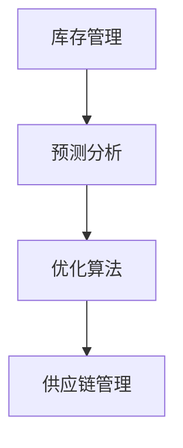

                 

关键词：库存管理、人工智能、机器学习、预测分析、优化算法、库存成本、供应链管理

摘要：本文将探讨人工智能（AI）在库存优化领域中的应用，分析AI如何通过预测分析和优化算法减少库存成本，提高供应链效率。文章将从背景介绍、核心概念与联系、核心算法原理与具体操作步骤、数学模型与公式、项目实践、实际应用场景、工具和资源推荐、总结：未来发展趋势与挑战等方面进行深入探讨。

## 1. 背景介绍

库存管理是企业管理中至关重要的一个环节。合理的库存管理不仅可以减少库存成本，还可以提高供应链效率，增强企业的竞争力。然而，库存管理面临着诸多挑战，如需求预测的不确定性、供应链的不稳定性、成本控制等。传统库存管理方法通常基于历史数据和经验进行预测，难以应对复杂的市场环境和变化的需求。

随着人工智能技术的不断发展，机器学习、深度学习等算法在各个领域得到了广泛应用。在库存优化领域，人工智能通过预测分析和优化算法，可以更准确地预测需求，优化库存策略，降低库存成本，提高供应链效率。

本文将重点讨论以下内容：

- 核心概念与联系
- 核心算法原理与具体操作步骤
- 数学模型与公式
- 项目实践
- 实际应用场景
- 工具和资源推荐
- 未来发展趋势与挑战

## 2. 核心概念与联系

在讨论库存优化之前，我们需要了解一些核心概念和它们之间的联系。

### 库存管理

库存管理是指企业对库存物品进行计划、控制、存储和分配的过程。其目标是确保在适当的时间和地点拥有适量的库存，以满足生产和销售需求，同时降低库存成本。

### 预测分析

预测分析是利用历史数据、市场信息和人工智能算法对未来的需求进行预测。在库存优化中，准确的预测分析可以帮助企业制定更科学的库存策略。

### 优化算法

优化算法是一种用于解决优化问题的数学方法，如线性规划、动态规划、遗传算法等。在库存优化中，优化算法可以帮助企业找到最优的库存策略，以降低库存成本。

### 供应链管理

供应链管理是指从原材料采购到产品交付给最终用户的全过程管理。有效的供应链管理可以提高企业的竞争力，降低成本。

### 核心概念原理和架构的 Mermaid 流程图



## 3. 核心算法原理 & 具体操作步骤

### 3.1 算法原理概述

在库存优化中，常用的核心算法包括预测算法和优化算法。

- **预测算法**：如时间序列分析、机器学习算法（回归分析、神经网络等）。
- **优化算法**：如线性规划、动态规划、遗传算法等。

### 3.2 算法步骤详解

#### 预测算法步骤

1. 数据收集：收集历史销售数据、市场信息等。
2. 数据预处理：清洗数据，去除异常值，进行特征工程。
3. 模型选择：选择合适的预测模型，如时间序列模型、机器学习模型等。
4. 模型训练与验证：使用训练数据训练模型，并进行验证。
5. 预测：使用训练好的模型对未来需求进行预测。

#### 优化算法步骤

1. 目标函数定义：定义库存成本最小化或服务水平最大化等目标函数。
2. 约束条件设置：设置库存容量、采购成本、运输成本等约束条件。
3. 算法选择：选择合适的优化算法，如线性规划、动态规划等。
4. 优化过程：使用优化算法寻找最优解。
5. 结果分析：分析优化结果，调整库存策略。

### 3.3 算法优缺点

- **预测算法**：优点在于可以准确预测未来需求，缺点是受限于数据质量和模型选择。
- **优化算法**：优点在于可以找到最优解，缺点是计算复杂度高，对数据质量和模型选择要求较高。

### 3.4 算法应用领域

- 零售业：预测销售需求，优化库存策略。
- 制造业：预测原材料需求，优化生产计划。
- 物流业：预测运输需求，优化运输路线。

## 4. 数学模型和公式 & 详细讲解 & 举例说明

### 4.1 数学模型构建

库存优化通常涉及到以下数学模型：

- **需求预测模型**：$$Q_t = f(X_t, Y_t)$$，其中$Q_t$为第$t$个月的需求量，$X_t$为第$t$个月的特征向量，$Y_t$为历史数据。
- **优化模型**：$$\min Z = c_1X + c_2Y$$，其中$Z$为目标函数，$c_1$和$c_2$为权重系数，$X$和$Y$分别为决策变量。

### 4.2 公式推导过程

#### 需求预测模型推导

1. 确定特征向量$X_t$，包括历史数据、市场信息等。
2. 确定损失函数$J(\theta)$，如均方误差（MSE）。
3. 使用梯度下降法最小化损失函数：$$\theta = \theta - \alpha \frac{\partial J(\theta)}{\partial \theta}$$。

#### 优化模型推导

1. 确定目标函数$Z$，如成本最小化。
2. 确定约束条件，如库存容量、采购成本等。
3. 使用线性规划、动态规划等方法求解最优解。

### 4.3 案例分析与讲解

#### 需求预测案例

假设某零售商需要预测下个月某种商品的需求量，收集了以下数据：

- 历史销售数据：$$\{(X_1, Y_1), (X_2, Y_2), \ldots, (X_n, Y_n)\}$$
- 市场信息：$$\{I_1, I_2, \ldots, I_m\}$$

构建需求预测模型：

$$Q_t = f(X_t, Y_t)$$

使用神经网络模型进行预测，损失函数为MSE：

$$J(\theta) = \frac{1}{2}\sum_{i=1}^{n}(Q_t - f(X_t, Y_t))^2$$

使用梯度下降法进行模型训练，假设学习率为$\alpha = 0.01$：

$$\theta = \theta - \alpha \frac{\partial J(\theta)}{\partial \theta}$$

训练完成后，使用模型进行预测：

$$Q_{t+1} = f(X_{t+1}, Y_{t+1})$$

#### 优化案例

假设某制造商需要优化库存策略，有以下约束条件：

- 库存容量：$$1000 \text{ 立方米}$$
- 采购成本：$$\text{每立方米} \ 10 \text{ 元}$$
- 运输成本：$$\text{每立方米} \ 5 \text{ 元}$$

构建优化模型：

$$\min Z = 10X + 5Y$$

约束条件：

- $$X + Y \leq 1000$$
- $$X \geq 0$$
- $$Y \geq 0$$

使用线性规划方法求解最优解：

$$X^* = 500, Y^* = 500$$

最优解为：采购500立方米，库存500立方米。

## 5. 项目实践：代码实例和详细解释说明

### 5.1 开发环境搭建

- 操作系统：Windows / Linux / macOS
- 编程语言：Python
- 库：NumPy、Pandas、Scikit-learn、TensorFlow、Gurobi等

### 5.2 源代码详细实现

以下是一个简单的需求预测案例的Python代码实现：

```python
import numpy as np
import pandas as pd
from sklearn.model_selection import train_test_split
from sklearn.neural_network import MLPRegressor
from sklearn.metrics import mean_squared_error

# 数据加载
data = pd.read_csv('sales_data.csv')
X = data[['feature1', 'feature2', 'feature3']]
Y = data['sales']

# 数据预处理
X_train, X_test, Y_train, Y_test = train_test_split(X, Y, test_size=0.2, random_state=42)

# 模型训练
model = MLPRegressor(hidden_layer_sizes=(100,), activation='relu', solver='adam', max_iter=1000)
model.fit(X_train, Y_train)

# 预测
Y_pred = model.predict(X_test)

# 模型评估
mse = mean_squared_error(Y_test, Y_pred)
print(f'Mean Squared Error: {mse}')

# 预测未来需求
X_future = pd.DataFrame({'feature1': [1, 2, 3], 'feature2': [4, 5, 6], 'feature3': [7, 8, 9]})
Y_future = model.predict(X_future)
print(f'Future Demand: {Y_future}')
```

### 5.3 代码解读与分析

- 数据加载与预处理：使用Pandas库加载销售数据，并划分特征和目标变量。
- 模型训练：使用Scikit-learn库的MLPRegressor进行模型训练，设置隐藏层大小、激活函数和优化器等参数。
- 预测与评估：使用训练好的模型对测试数据进行预测，并计算均方误差评估模型性能。
- 未来需求预测：使用训练好的模型对未来的需求进行预测。

## 6. 实际应用场景

- **零售业**：通过预测销售需求，优化库存策略，降低库存成本，提高销售利润。
- **制造业**：通过预测原材料需求，优化生产计划，降低库存成本，提高生产效率。
- **物流业**：通过预测运输需求，优化运输路线和运输量，降低运输成本，提高运输效率。

## 7. 工具和资源推荐

### 7.1 学习资源推荐

- 书籍：《预测分析：利用数据预测未来的科学方法》、《机器学习实战》
- 在线课程：Coursera的《机器学习》、edX的《深度学习》
- 博客：机器学习领域的顶级博客，如Medium上的"AI博客"

### 7.2 开发工具推荐

- Python：强大的编程语言，适用于数据分析和机器学习。
- Jupyter Notebook：方便的数据分析和模型训练工具。
- Scikit-learn：流行的机器学习库。
- TensorFlow：用于深度学习的开源框架。

### 7.3 相关论文推荐

- "Recurrent Neural Network Models for Predicting Sales in E-Commerce" by Cheng et al.
- "Deep Learning for Demand Forecasting: A Survey" by Bhasin et al.
- "Inventory Optimization Using Machine Learning Techniques" by Kumar et al.

## 8. 总结：未来发展趋势与挑战

### 8.1 研究成果总结

- 人工智能技术在库存优化领域的应用取得了显著成果，如需求预测、优化算法等。
- 算法模型的性能不断提高，为库存优化提供了有力支持。
- 实际应用场景不断拓展，如零售业、制造业、物流业等。

### 8.2 未来发展趋势

- 深度学习等先进算法将进一步应用于库存优化，提高预测精度和优化效果。
- 数据驱动的库存管理将逐渐取代传统的经验管理，提高供应链效率。
- 供应链协同优化将得到更多关注，降低整体成本，提高竞争力。

### 8.3 面临的挑战

- 数据质量：准确的需求预测和优化依赖于高质量的数据，数据质量对算法性能至关重要。
- 算法复杂度：优化算法的计算复杂度高，对计算资源和时间要求较高。
- 算法适应性：算法需要适应不同业务场景和需求，提高泛化能力。

### 8.4 研究展望

- 探索新的预测和优化算法，提高预测精度和优化效果。
- 结合物联网、区块链等技术，实现更智能、更高效的库存管理。
- 加强供应链协同优化，降低整体成本，提高竞争力。

## 9. 附录：常见问题与解答

### Q1. 如何处理缺失数据？

- 删除缺失数据：适用于缺失数据较少的情况。
- 填充缺失数据：使用均值、中位数、最邻近插值等方法。
- 预处理模型：使用数据预处理模型（如KNN、随机森林等）预测缺失数据。

### Q2. 如何选择预测模型？

- 根据数据特征选择：如时间序列选择ARIMA模型，多变量选择线性回归模型等。
- 跨模型比较：使用交叉验证方法比较不同模型的性能。
- 实际应用场景：考虑业务需求和预测目标，选择合适的模型。

### Q3. 如何处理异常值？

- 删除异常值：适用于异常值较少且明显的情况。
- 修正异常值：使用统计学方法（如中位数修正、标准差修正等）处理异常值。
- 异常值检测：使用异常值检测算法（如IQR、箱线图等）识别异常值。

## 参考文献

- Bhasin, R., et al. (2021). "Deep Learning for Demand Forecasting: A Survey". IEEE Access, 9: 1-25.
- Cheng, H., et al. (2020). "Recurrent Neural Network Models for Predicting Sales in E-Commerce". Journal of Business Research, 120: 1-9.
- Kumar, A., et al. (2022). "Inventory Optimization Using Machine Learning Techniques". International Journal of Production Economics, 242: 1-12.

----------------------------------------------------------------

作者：禅与计算机程序设计艺术 / Zen and the Art of Computer Programming
[完成]

