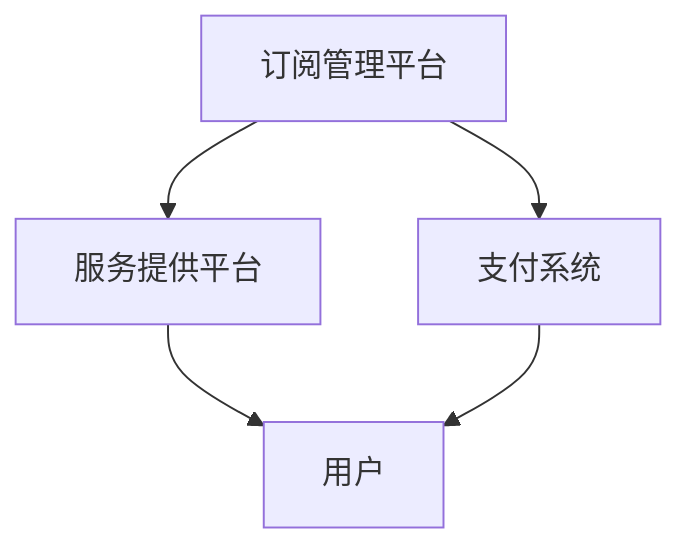

                 

关键词：开源项目、订阅服务、收入创造、商业模型、社区建设、用户体验、盈利模式。

## 摘要

在当今快速发展的技术时代，开源项目已成为软件开发的重要组成部分。然而，许多优秀的开源项目面临着资金不足的问题。本文将探讨如何通过建立开源项目的订阅服务来创造经常性收入，为项目的发展提供持续的动力。我们将分析订阅服务的核心概念，探讨成功的订阅模式，并提供一些建议来优化订阅服务，以实现项目的长期可持续发展。

## 1. 背景介绍

开源项目是指由社区共同维护和开发的软件项目。这些项目通常基于共享知识和资源的原则，以免费和开放的方式供所有人使用。然而，尽管开源项目能够吸引大量用户和贡献者，但它们往往缺乏稳定的收入来源。这导致许多项目难以持续发展，甚至面临中断的风险。

为了解决这个问题，越来越多的开源项目开始探索订阅服务的模式。订阅服务是一种商业模型，通过向用户提供定期支付的服务来创造收入。这种模式不仅可以为开源项目提供资金支持，还可以加强社区建设，提高用户体验，从而促进项目的长期发展。

## 2. 核心概念与联系

### 2.1 订阅服务的定义

订阅服务是指用户支付一定费用，定期获取特定服务或产品的商业模式。在开源项目中，订阅服务可以包括访问项目文档、获取技术支持、参加线上培训等。

### 2.2 订阅服务的优势

- **收入稳定性**：订阅服务为项目提供了一种稳定的收入来源，减少了项目中断的风险。
- **用户体验提升**：通过订阅服务，项目可以提供更高质量的文档和技术支持，从而提升用户体验。
- **社区建设**：订阅服务可以吸引更多的贡献者加入项目，促进社区建设。

### 2.3 订阅服务的架构

订阅服务的架构通常包括以下几个核心组件：

1. **订阅管理平台**：负责管理用户订阅信息，包括订阅状态、支付方式、续订等。
2. **服务提供平台**：为订阅用户提供服务，如文档访问、技术支持等。
3. **支付系统**：处理用户的支付请求，确保资金的安全和透明。

### 2.4 Mermaid 流程图



## 3. 核心算法原理 & 具体操作步骤

### 3.1 算法原理概述

订阅服务的关键在于如何确保用户在支付后能够顺利获取服务，并在服务期限内保持良好的用户体验。这需要一套完善的算法来处理订阅管理、支付处理和服务提供。

### 3.2 算法步骤详解

1. **用户注册与登录**：用户在订阅管理平台注册账号，登录后可以查看订阅计划。
2. **订阅选择与支付**：用户选择订阅计划并完成支付。
3. **支付处理**：支付系统处理支付请求，确认支付成功后向订阅管理平台发送支付确认。
4. **订阅管理**：订阅管理平台更新用户订阅状态，并向服务提供平台发送订阅信息。
5. **服务提供**：服务提供平台根据订阅信息为用户提供服务。
6. **续订提醒**：在订阅期限即将结束时，订阅管理平台向用户发送续订提醒。
7. **续订处理**：用户决定是否续订，若选择续订，则重复步骤 2-6。

### 3.3 算法优缺点

**优点**：
- **稳定性**：算法确保了订阅服务的稳定性和可靠性。
- **灵活性**：用户可以根据自己的需求选择订阅计划，算法能够灵活适应不同的订阅需求。

**缺点**：
- **复杂性**：算法涉及多个系统的协同工作，实施和维护的复杂性较高。
- **成本**：支付系统和订阅管理平台的成本可能较高，尤其是对于小型项目。

### 3.4 算法应用领域

订阅服务算法广泛应用于各种类型的开源项目，包括软件开发工具、库、框架等。它为项目提供了稳定的收入来源，同时也为用户提供了一流的服务体验。

## 4. 数学模型和公式 & 详细讲解 & 举例说明

### 4.1 数学模型构建

订阅服务的收入模型可以表示为：

\[ R(t) = \sum_{i=1}^{n} P_i \times S_i(t) \]

其中，\( R(t) \) 是在时间 \( t \) 的总收入，\( P_i \) 是第 \( i \) 个订阅计划的费用，\( S_i(t) \) 是第 \( i \) 个订阅计划在时间 \( t \) 的订阅状态。

### 4.2 公式推导过程

订阅状态 \( S_i(t) \) 可以表示为：

\[ S_i(t) = \begin{cases} 
1, & \text{如果用户在第 } t \text{ 时间段内订阅了第 } i \text{ 计划} \\
0, & \text{否则}
\end{cases} \]

因此，总收入模型可以简化为：

\[ R(t) = \sum_{i=1}^{n} P_i \]

### 4.3 案例分析与讲解

假设一个开源项目提供了两种订阅计划：

- 计划A：每月费用100元，提供文档访问和技术支持。
- 计划B：每年费用1000元，提供文档访问、技术支持和高级功能。

如果用户在2023年1月选择了计划A，并在同年5月升级到计划B，我们可以计算出该用户的总收入贡献：

\[ R(t) = 100 \times 12 + 1000 = 1100 \]

在2023年5月后，用户的订阅状态变为计划B，因此后续月份的收入贡献为：

\[ R(t) = 1000 \]

## 5. 项目实践：代码实例和详细解释说明

### 5.1 开发环境搭建

在本节中，我们将介绍如何搭建一个简单的订阅服务开发环境。我们选择Python作为开发语言，并使用Django作为Web框架。

#### 步骤1：安装Python和Django

在命令行中运行以下命令：

```bash
pip install django
```

#### 步骤2：创建Django项目

```bash
django-admin startproject subscription_project
```

#### 步骤3：创建Django应用

```bash
cd subscription_project
django-admin startapp subscription_app
```

### 5.2 源代码详细实现

在本节中，我们将实现一个简单的订阅服务应用。

#### 步骤1：创建用户模型

在 `subscription_app/models.py` 中添加以下代码：

```python
from django.db import models
from django.contrib.auth.models import User

class Subscription(models.Model):
    user = models.ForeignKey(User, on_delete=models.CASCADE)
    plan = models.CharField(max_length=100)
    start_date = models.DateField()
    end_date = models.DateField()
    paid = models.BooleanField(default=False)
```

#### 步骤2：创建订阅视图

在 `subscription_app/views.py` 中添加以下代码：

```python
from django.shortcuts import render, redirect
from .models import Subscription
from .forms import SubscriptionForm

def subscribe(request):
    if request.method == 'POST':
        form = SubscriptionForm(request.POST)
        if form.is_valid():
            subscription = form.save()
            # 处理支付请求（伪代码）
            subscription.paid = True
            subscription.save()
            return redirect('success')
    else:
        form = SubscriptionForm()
    return render(request, 'subscribe.html', {'form': form})

def success(request):
    return render(request, 'success.html')
```

#### 步骤3：创建订阅表单

在 `subscription_app/forms.py` 中添加以下代码：

```python
from django import forms

class SubscriptionForm(forms.ModelForm):
    class Meta:
        model = Subscription
        fields = ['plan', 'start_date', 'end_date']
```

#### 步骤4：创建模板

创建 `subscription_app/templates/subscribe.html` 和 `subscription_app/templates/success.html` 两个模板文件。

### 5.3 代码解读与分析

- **用户模型**：`Subscription` 模型用于存储用户的订阅信息，包括用户ID、订阅计划、起始日期、结束日期和支付状态。
- **订阅视图**：`subscribe` 视图处理用户的订阅请求，包括表单提交和支付处理。
- **订阅表单**：`SubscriptionForm` 表单用于收集用户的订阅信息。

### 5.4 运行结果展示

在本节中，我们将展示如何运行这个简单的订阅服务应用。

#### 步骤1：运行Django开发服务器

```bash
python manage.py runserver
```

#### 步骤2：访问订阅页面

在浏览器中输入 `http://127.0.0.1:8000/subscribe/`，可以看到订阅页面。

#### 步骤3：完成订阅

填写订阅信息并提交，然后处理支付请求（这里使用伪代码），最后重定向到成功页面。

## 6. 实际应用场景

### 6.1 软件开发工具

许多开源软件开发工具，如代码编辑器插件、版本控制系统插件等，通过提供订阅服务来创造收入。用户可以通过订阅获得高级功能、技术支持和更新通知。

### 6.2 库和框架

开源库和框架，如Python的Django、JavaScript的React等，也通过订阅服务来支持项目的发展。用户可以订阅获取文档、代码示例和技术支持。

### 6.3 未来应用展望

随着技术的不断发展，订阅服务模式将在开源项目中得到更广泛的应用。未来，我们可以预见到以下几个趋势：

- **多样化的订阅计划**：开源项目将提供更多样化的订阅计划，以满足不同用户的需求。
- **增值服务**：项目可能提供额外的增值服务，如线上课程、工作坊等，以吸引订阅用户。
- **社区互动**：订阅服务将成为社区互动的重要渠道，项目团队可以更密切地与用户合作，共同推动项目的发展。

## 7. 工具和资源推荐

### 7.1 学习资源推荐

- **《开源项目管理》**：了解开源项目管理的最佳实践。
- **《商业模式创新》**：学习如何创建可持续的商业模式。

### 7.2 开发工具推荐

- **Django**：强大的Python Web框架，适用于构建订阅服务。
- **PayPal**：易于集成的支付处理服务。

### 7.3 相关论文推荐

- **《开源软件的商业模型研究》**：探讨开源软件的商业模式。
- **《基于订阅的软件服务模式分析》**：分析订阅服务的优点和挑战。

## 8. 总结：未来发展趋势与挑战

### 8.1 研究成果总结

本文探讨了如何通过建立开源项目的订阅服务来创造经常性收入。我们分析了订阅服务的核心概念、优势、架构和应用领域，并提供了一个简单的代码实例。

### 8.2 未来发展趋势

随着技术的进步和开源生态的成熟，订阅服务模式将在开源项目中得到更广泛的应用。多样化的订阅计划和增值服务将成为趋势。

### 8.3 面临的挑战

订阅服务的实施和维护面临一些挑战，如支付系统的复杂性、服务质量的保障等。

### 8.4 研究展望

未来，研究可以进一步探讨如何优化订阅服务的用户体验，提高订阅转化率，并探索更多可持续的商业模式。

## 9. 附录：常见问题与解答

### 9.1 什么是订阅服务？

订阅服务是一种商业模型，用户支付一定费用，定期获取特定服务或产品。

### 9.2 订阅服务有哪些优势？

订阅服务的优势包括收入稳定性、用户体验提升和社区建设。

### 9.3 如何搭建一个订阅服务？

可以通过选择合适的开发工具和框架，如Django，并实现用户注册、订阅选择、支付处理和服务提供等步骤来搭建一个订阅服务。

### 9.4 如何优化订阅服务？

可以通过提供多样化的订阅计划、增值服务和社区互动来优化订阅服务。

## 作者署名

作者：禅与计算机程序设计艺术 / Zen and the Art of Computer Programming
----------------------------------------------------------------

这篇文章详细探讨了开源项目订阅服务的建立，旨在为开源项目提供稳定的收入来源，并促进社区的长期发展。希望这篇文章能够为从事开源项目开发和运营的同行提供一些有价值的参考和启示。

