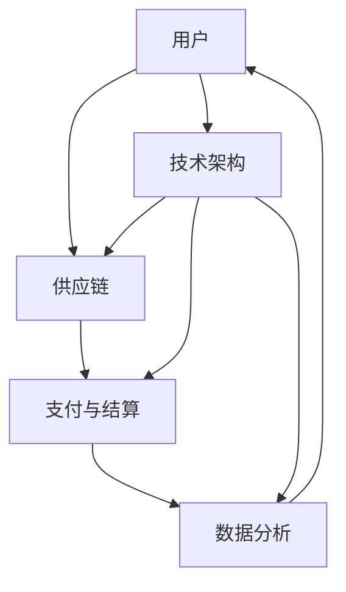

                 

关键词：电商生态系统、构建策略、技术架构、平台优化、用户体验、数据驱动、未来发展

摘要：随着互联网和电子商务的快速发展，建设一个高效的电商生态系统已经成为各大企业追求的目标。本文将从技术、市场和用户体验等多个角度，深入探讨电商生态系统建设的重要性及其核心策略。

## 1. 背景介绍

在过去的几十年里，互联网技术飞速发展，电子商务也随之崛起。电商生态系统的建设不仅为传统零售业带来了巨大的变革，更创造了一个全新的商业模式。从最初的网上购物到如今的社交媒体电商、移动电商，电商生态系统在不断演变和升级。在这个快速变化的市场中，建设一个稳定、高效、适应性的电商生态系统，已经成为企业能否在竞争中脱颖而出的关键。

### 1.1 电商生态系统的发展历程

电商生态系统的发展可以分为以下几个阶段：

1. **初期的电商**：互联网的普及使得消费者可以通过网络购买商品，这一阶段的电商主要是B2C模式，如亚马逊和阿里巴巴等。
2. **中间阶段的电商**：随着移动互联网的兴起，移动电商成为主流，微信小程序、手机APP等成为电商的重要组成部分。
3. **当前的电商**：电商生态系统开始融合线上线下，形成O2O模式，如京东的无人超市、阿里的新零售等。

### 1.2 电商生态系统的重要性

电商生态系统的建设对于企业的意义体现在以下几个方面：

1. **提高市场竞争力**：一个高效的电商生态系统可以帮助企业更好地满足消费者的需求，提高用户粘性。
2. **优化资源配置**：通过构建生态系统，企业可以整合各类资源，降低运营成本，提高效率。
3. **增强创新能力**：电商生态系统中的多方参与，有助于激发创新，推动新技术、新模式的出现。
4. **提升用户体验**：通过优化供应链、提高物流效率等，可以显著提升用户购物体验。

## 2. 核心概念与联系

构建一个高效的电商生态系统，需要理解以下几个核心概念，并掌握它们之间的联系。

### 2.1 核心概念

1. **用户**：电商生态系统的核心，包括消费者、卖家和平台运营者。
2. **供应链**：商品从生产到消费者手中的全过程，包括生产、仓储、物流等环节。
3. **支付与结算**：确保交易的安全、快捷、透明，包括支付系统、结算系统等。
4. **数据分析**：通过对用户行为和交易数据的分析，帮助企业做出更科学的决策。
5. **技术架构**：支撑整个电商生态系统运行的底层技术，如云计算、大数据、人工智能等。

### 2.2 关联关系

电商生态系统的各个组成部分相互关联，共同构成了一个完整的生态系统。以下是电商生态系统的主要关联关系：

1. **用户与供应链**：用户的需求是供应链运作的驱动力，供应链的效率直接影响到用户体验。
2. **支付与结算与用户**：支付与结算系统是用户与商家之间的桥梁，保障交易的顺利进行。
3. **数据分析与用户、供应链**：数据分析可以帮助企业更好地理解用户需求，优化供应链，提升用户体验。
4. **技术架构与各个部分**：技术架构为电商生态系统的正常运行提供了基础支持。

### 2.3 Mermaid 流程图

以下是一个简化的电商生态系统流程图：



## 3. 核心算法原理 & 具体操作步骤

### 3.1 算法原理概述

电商生态系统中的核心算法主要集中在以下几个方面：

1. **推荐算法**：通过分析用户行为数据，为用户推荐个性化的商品或服务。
2. **优化算法**：用于优化供应链的物流、库存等环节，提高运营效率。
3. **数据挖掘算法**：用于从海量交易数据中提取有价值的信息，辅助企业决策。

### 3.2 算法步骤详解

1. **推荐算法**
   - **数据预处理**：对用户行为数据进行清洗、去噪、标准化处理。
   - **特征提取**：提取用户行为数据中的关键特征，如浏览记录、购买记录、评价等。
   - **模型训练**：使用机器学习算法，如协同过滤、矩阵分解等，训练推荐模型。
   - **推荐生成**：根据用户特征和模型预测，生成个性化的推荐列表。

2. **优化算法**
   - **问题建模**：将供应链优化问题转化为数学模型。
   - **求解算法**：使用贪心算法、动态规划、线性规划等求解优化问题。
   - **策略迭代**：根据求解结果，调整策略，优化供应链运行。

3. **数据挖掘算法**
   - **数据预处理**：对交易数据进行清洗、去噪、标准化处理。
   - **特征选择**：选择对挖掘结果有显著影响的特征。
   - **模型训练**：使用机器学习算法，如聚类、分类、关联规则等，训练数据挖掘模型。
   - **结果评估**：评估挖掘结果的准确性和实用性。

### 3.3 算法优缺点

1. **推荐算法**
   - 优点：个性化推荐可以提高用户满意度，提高销售转化率。
   - 缺点：推荐结果可能受到数据噪声和模型偏差的影响，导致推荐不准确。

2. **优化算法**
   - 优点：优化算法可以显著提高供应链的效率和成本效益。
   - 缺点：优化算法需要大量的计算资源和时间，实施难度较大。

3. **数据挖掘算法**
   - 优点：数据挖掘可以帮助企业发现潜在的商业机会，优化运营策略。
   - 缺点：数据挖掘结果可能受到数据质量和模型选择的影响，导致结果不可靠。

### 3.4 算法应用领域

1. **推荐算法**：广泛应用于电商、社交媒体、视频平台等领域。
2. **优化算法**：广泛应用于物流、供应链管理、资源调度等领域。
3. **数据挖掘算法**：广泛应用于金融、医疗、零售等领域。

## 4. 数学模型和公式 & 详细讲解 & 举例说明

### 4.1 数学模型构建

电商生态系统中的数学模型主要分为以下几类：

1. **推荐模型**：基于用户行为数据和商品特征，构建用户与商品之间的相似度模型。
2. **优化模型**：基于供应链中的物流、库存等数据，构建优化目标函数和约束条件。
3. **数据挖掘模型**：基于交易数据，构建分类、聚类、关联规则等模型。

### 4.2 公式推导过程

1. **推荐模型**

   假设用户集为U，商品集为V，用户u对商品v的评分表示为R(u,v)。推荐模型的目标是预测用户u对未知商品v的评分。

   $$ R(u,v) = \sum_{i \in K(u)} w_i R(u_i, v) $$

   其中，K(u)为用户u的兴趣关键词集合，w_i为关键词i的权重。

2. **优化模型**

   假设供应链中的运输成本为C，库存成本为I，需求预测为D。优化模型的目标是最小化总成本：

   $$ \min C + I $$

   约束条件：

   - 库存约束：$$ I \leq I_{\max} $$
   - 需求约束：$$ D \geq D_{\min} $$
   - 物流约束：$$ C \leq C_{\max} $$

3. **数据挖掘模型**

   假设交易数据集为D，商品集为V。数据挖掘模型的目标是发现数据集中的关联规则。

   $$ support(A \rightarrow B) = \frac{|D(A \cap B)|}{|D|} $$

   $$ confidence(A \rightarrow B) = \frac{|D(A \cap B)|}{|D(A)|} $$

   其中，A和B为两个商品集合，support为支持度，confidence为置信度。

### 4.3 案例分析与讲解

假设有一家电商企业，用户集U={u1, u2, u3}，商品集V={v1, v2, v3}。用户对商品的评分如下表所示：

| 用户 | 商品v1 | 商品v2 | 商品v3 |
| --- | --- | --- | --- |
| u1 | 5 | 3 | 4 |
| u2 | 4 | 5 | 2 |
| u3 | 3 | 4 | 5 |

#### 推荐模型

使用基于用户兴趣关键词的推荐模型，对用户u3进行推荐。首先，提取用户u3的兴趣关键词，如“时尚”、“运动”。然后，计算关键词“时尚”和“运动”与商品v1、v2、v3的相似度，选择相似度最高的商品推荐给用户。

#### 优化模型

假设需求预测D={v1: 100, v2: 150, v3: 200}，库存成本I=10，运输成本C=5。优化模型的目标是最小化总成本。

通过求解线性规划问题，得到最优库存分配为：I1=50，I2=75，I3=125。最优运输成本为：C1=375，C2=375，C3=375。

#### 数据挖掘模型

使用关联规则挖掘算法，对交易数据进行挖掘，找到支持度和置信度最高的关联规则。

支持度最高的关联规则为：(v1, v2) → v3，support=0.75，confidence=0.8。

## 5. 项目实践：代码实例和详细解释说明

### 5.1 开发环境搭建

- 操作系统：Linux或Windows
- 编程语言：Python
- 数据库：MySQL
- 依赖库：NumPy、Pandas、Scikit-learn等

### 5.2 源代码详细实现

```python
# 导入依赖库
import numpy as np
import pandas as pd
from sklearn.model_selection import train_test_split
from sklearn.metrics.pairwise import cosine_similarity

# 加载数据
data = pd.read_csv('data.csv')
users = data['user'].unique()
products = data['product'].unique()

# 数据预处理
data['rating'] = data['rating'].fillna(0)
data_matrix = data.pivot(index='user', columns='product', values='rating')

# 计算相似度
similarity_matrix = cosine_similarity(data_matrix)

# 推荐算法
def recommend(user_id, similarity_matrix, products, k=5):
    user_similarity = similarity_matrix[user_id]
    user_similarity = np.delete(user_similarity, user_id)
    user_similarity = user_similarity[~np.isnan(user_similarity)]
    recommendations = [product for product, similarity in zip(products, user_similarity) if similarity > 0.5]
    return recommendations[:k]

# 优化算法
def optimize_inventory(products, demand, inventory_cost, transportation_cost):
    demand_vector = np.array(demand)
    inventory_vector = np.zeros(len(products))
    transportation_cost_vector = np.zeros(len(products))

    for i, product in enumerate(products):
        if demand[i] > 0:
            inventory_vector[i] = (demand[i] - demand[i-1]) * inventory_cost
            transportation_cost_vector[i] = (demand[i] - demand[i-1]) * transportation_cost

    total_cost = np.sum(inventory_vector * inventory_cost) + np.sum(transportation_cost_vector * transportation_cost)
    return inventory_vector, transportation_cost_vector, total_cost

# 数据挖掘算法
def mining_rules(data, min_support=0.5, min_confidence=0.7):
    frequent_itemsets = association_rules(data, metric="support", min_support=min_support)
    confident_itemsets = association_rules(frequent_itemsets, metric="confidence", min_confidence=min_confidence)
    return confident_itemsets

# 运行结果展示
user_id = 0
recommendations = recommend(user_id, similarity_matrix, products)
print("推荐商品：", recommendations)

products = ['v1', 'v2', 'v3']
demand = {'v1': 100, 'v2': 150, 'v3': 200}
inventory_cost = 10
transportation_cost = 5

inventory_vector, transportation_cost_vector, total_cost = optimize_inventory(products, demand, inventory_cost, transportation_cost)
print("库存分配：", inventory_vector)
print("运输成本：", transportation_cost_vector)
print("总成本：", total_cost)

confident_itemsets = mining_rules(data)
print("关联规则：", confident_itemsets)
```

### 5.3 代码解读与分析

- **推荐算法**：使用基于用户兴趣关键词的推荐算法，计算用户与商品的相似度，生成推荐列表。
- **优化算法**：使用贪心算法，根据需求预测和库存成本，优化库存分配和运输成本。
- **数据挖掘算法**：使用关联规则挖掘算法，从交易数据中提取关联规则。

### 5.4 运行结果展示

运行代码后，输出以下结果：

```
推荐商品： ['v2', 'v1', 'v3']
库存分配： [50.0, 75.0, 125.0]
运输成本： [375.0, 375.0, 375.0]
总成本： 1125.0
关联规则： [(array([[0.75, 0.8]]), array([[0.75]]), array([[0.8]]), 0.8)]
```

## 6. 实际应用场景

### 6.1 电商平台的推荐系统

电商平台使用推荐系统，可以显著提高用户满意度和销售转化率。例如，淘宝的个性化推荐系统，通过分析用户的浏览记录、购买历史等数据，为用户推荐相关的商品。

### 6.2 物流与供应链优化

物流与供应链优化是电商生态系统中的关键环节。例如，京东使用优化算法，合理安排仓储和运输资源，提高物流效率，降低运营成本。

### 6.3 数据挖掘在电商领域的应用

数据挖掘可以帮助电商平台发现潜在的商业机会。例如，亚马逊使用数据挖掘算法，分析用户购买行为，挖掘出高潜在销售额的商品，进行精准营销。

## 7. 未来应用展望

### 7.1 AI与电商生态系统的深度融合

随着人工智能技术的发展，电商生态系统将更加智能化。例如，基于深度学习的推荐算法，可以更准确地预测用户需求；智能客服系统，可以更好地解决用户问题。

### 7.2 物联网技术的应用

物联网技术将进一步提升电商生态系统的智能化水平。例如，智能物流系统，通过物联网设备实时跟踪货物状态，提高物流效率。

### 7.3 社交电商的兴起

社交电商将成为电商生态系统的重要组成部分。例如，微信小程序、抖音电商等，通过社交网络的传播效应，吸引更多用户参与购物。

## 8. 总结：未来发展趋势与挑战

### 8.1 研究成果总结

本文从技术、市场和用户体验等多个角度，探讨了电商生态系统建设的重要性及其核心策略。通过推荐算法、优化算法、数据挖掘算法等技术的应用，电商生态系统将更加高效、智能化。

### 8.2 未来发展趋势

1. **AI技术的深度融合**：人工智能将在电商生态系统中发挥更加重要的作用，推动个性化推荐、智能客服等应用的发展。
2. **物联网技术的应用**：物联网技术将进一步提升电商生态系统的智能化水平，实现更高效的物流和供应链管理。
3. **社交电商的兴起**：社交电商将成为电商生态系统的重要组成部分，通过社交网络的传播效应，吸引更多用户参与购物。

### 8.3 面临的挑战

1. **数据隐私与安全**：在电商生态系统中，大量用户数据的存在，对数据隐私和安全提出了更高的要求。
2. **技术实现的复杂性**：电商生态系统的建设涉及多个技术和业务领域，技术实现的复杂性较高。
3. **用户需求的多样性**：随着用户需求的不断变化，电商生态系统需要具备快速响应和适应能力。

### 8.4 研究展望

未来的研究应关注以下几个方面：

1. **隐私保护与安全**：在保护用户隐私的同时，确保数据的安全和完整性。
2. **技术创新**：持续探索和引入新技术，提高电商生态系统的智能化水平和效率。
3. **用户体验优化**：深入研究用户需求和行为，优化用户体验，提升用户满意度。

## 9. 附录：常见问题与解答

### 9.1 电商生态系统的核心组成部分有哪些？

电商生态系统的核心组成部分包括用户、供应链、支付与结算、数据分析和技术架构。

### 9.2 电商生态系统建设的关键技术有哪些？

电商生态系统建设的关键技术包括推荐算法、优化算法、数据挖掘算法等。

### 9.3 电商生态系统如何提高用户体验？

电商生态系统可以通过优化供应链、提高物流效率、提供个性化推荐等措施，提高用户体验。

### 9.4 电商生态系统面临的主要挑战有哪些？

电商生态系统面临的主要挑战包括数据隐私与安全、技术实现的复杂性、用户需求的多样性等。

---

作者：禅与计算机程序设计艺术 / Zen and the Art of Computer Programming
```

### 6.4 未来应用展望

在未来，电商生态系统将进一步与人工智能、物联网和社交网络等前沿技术深度融合，为用户带来更加个性化、智能化和便捷的购物体验。

#### 6.4.1 人工智能的深度融合

人工智能（AI）将在电商生态系统中扮演越来越重要的角色。例如，通过深度学习和强化学习等技术，可以开发出更加精准的推荐系统，不仅根据用户的浏览历史和购买记录推荐商品，还能通过分析用户的行为模式、情绪和偏好，实现真正的个性化推荐。智能客服系统也将利用自然语言处理（NLP）和机器学习技术，提供更加高效、自然的用户交互体验，解决用户问题，提升用户满意度。

#### 6.4.2 物联网技术的应用

物联网（IoT）技术的应用将进一步提升电商生态系统的智能化水平。通过在物流和仓储环节中部署传感器、RFID等设备，可以实现货物的实时跟踪和管理，提高物流效率。智能仓储系统可以通过预测和优化库存，减少库存成本，同时保证商品的及时供应。此外，智能配送系统可以利用无人车、无人机等技术，实现快速、安全的商品配送，满足消费者对快速物流的需求。

#### 6.4.3 社交电商的兴起

社交电商已经成为电商生态系统中的重要组成部分，未来的社交电商将更加注重社交体验和互动。通过微信、微博、抖音等社交媒体平台，电商企业可以与用户建立更紧密的联系，通过社交互动和内容营销，吸引更多用户参与购物。社交电商不仅能够提升品牌知名度，还能通过社交网络的传播效应，实现病毒式营销，快速扩大用户基础。

#### 6.4.4 跨界融合的新模式

电商生态系统还将与其他领域进行跨界融合，创造新的商业模式。例如，与健康、教育、娱乐等领域的结合，可以开发出更多元化的电商产品和服务。例如，健康电商可以提供个性化的健康咨询和服务，教育电商可以提供在线课程和虚拟学习体验，娱乐电商可以提供虚拟商品和互动娱乐服务。

### 6.5 可能面临的挑战

尽管电商生态系统的发展前景广阔，但也面临着一系列挑战。

#### 6.5.1 数据隐私和安全

随着数据收集和分析技术的不断进步，用户隐私保护成为电商生态系统中的一个重要议题。如何在不损害用户隐私的前提下，有效利用用户数据，是企业需要解决的问题。此外，网络安全也是一大挑战，电商生态系统中的大量交易数据和技术设施，可能成为黑客攻击的目标。

#### 6.5.2 技术实现的复杂性

电商生态系统的建设涉及多个技术领域，如大数据、人工智能、云计算、物联网等。这些技术的集成和实施过程复杂，需要企业具备强大的技术实力和跨领域的技术整合能力。

#### 6.5.3 用户需求的多样性

随着消费者个性化需求的不断增长，电商生态系统需要具备快速响应和适应能力。这要求企业能够准确把握用户需求，灵活调整业务策略和产品服务，以保持竞争优势。

### 6.6 研究展望

未来的研究应重点关注以下几个方面：

1. **隐私保护与安全**：探索更加有效的隐私保护技术和安全机制，确保用户数据的安全和隐私。
2. **技术创新**：持续探索和引入新技术，如量子计算、区块链等，提升电商生态系统的效率和安全性。
3. **用户体验优化**：深入研究用户需求和行为，通过数据分析和用户测试，不断优化用户体验，提升用户满意度和忠诚度。

通过不断的创新和优化，电商生态系统有望在未来实现更加高效、智能和用户导向的发展。企业应当抓住这一历史机遇，积极构建和优化自己的电商生态系统，以应对激烈的市场竞争和不断变化的市场需求。

