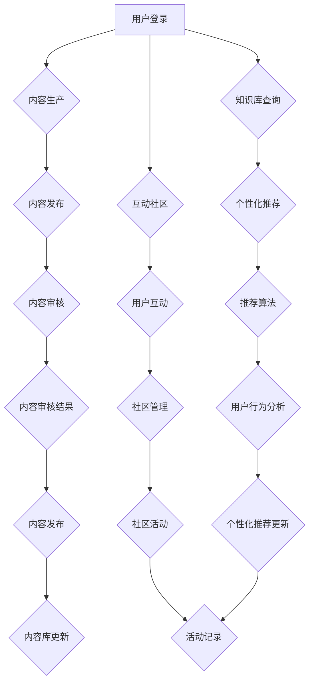

                 

关键词：个人品牌、APP开发、知识获取、用户体验、技术实现

> 摘要：本文旨在探讨如何开发一款专注于个人品牌建设的APP，通过提供便捷的知识获取渠道，帮助用户在数字时代中提升个人影响力，实现知识价值的最大化。

## 1. 背景介绍

随着互联网技术的快速发展，智能手机已经成为人们生活中不可或缺的一部分。移动应用（APP）也成为知识传播和共享的重要渠道。个人品牌建设作为个体在数字化时代中提升影响力的重要手段，越来越受到关注。一款专注于个人品牌建设的APP，可以为用户提供一个系统化、高效的知识获取渠道，助力用户实现个人品牌的快速崛起。

### 1.1 个人品牌的重要性

个人品牌是指个人在特定领域内积累的声誉、知识和影响力的总和。在现代社会，个人品牌已经成为一种重要的无形资产。良好的个人品牌可以带来更多的机会，包括职业发展、商业合作、社会认同等。因此，个人品牌建设对于追求卓越的个人和企业家来说至关重要。

### 1.2 APP开发的优势

与传统的网站和社交媒体平台相比，APP具有更高的用户粘性、更好的用户体验和更强的互动性。通过开发一款专注于个人品牌建设的APP，可以提供更为个性化和高效的服务，满足用户在知识获取、交流互动、个人展示等方面的需求。

## 2. 核心概念与联系

### 2.1 个人品牌APP的核心概念

一款成功的个人品牌APP需要涵盖以下几个核心概念：

- **内容生产**：为用户提供高质量的内容，包括文字、图片、视频等多种形式。
- **知识库**：构建一个丰富的知识库，涵盖多个领域，为用户提供学习资源。
- **互动社区**：建立用户之间的互动社区，促进知识交流和品牌建设。
- **个性化推荐**：根据用户兴趣和行为，提供个性化的内容推荐，提升用户体验。

### 2.2 架构设计

个人品牌APP的架构设计需要考虑以下几个关键方面：

- **前端设计**：采用响应式设计，确保APP在不同设备上都能提供良好的用户体验。
- **后端服务**：构建稳定、高效的后端服务，支持内容发布、用户管理、推荐系统等功能。
- **数据库设计**：设计合理的数据库架构，确保数据的安全性和一致性。
- **API接口**：提供开放的API接口，方便第三方服务和开发者的集成。

### 2.3 Mermaid 流程图

以下是一个简化的个人品牌APP流程图，展示了核心功能之间的联系：



## 3. 核心算法原理 & 具体操作步骤

### 3.1 算法原理概述

个人品牌APP的核心算法包括内容推荐算法和用户行为分析算法。内容推荐算法基于用户兴趣和行为，为用户推荐相关的知识内容。用户行为分析算法用于收集和分析用户在APP上的行为数据，以便优化用户体验。

### 3.2 算法步骤详解

#### 3.2.1 内容推荐算法

1. **用户画像构建**：根据用户注册信息和行为数据，构建用户画像。
2. **内容标签提取**：对知识库中的内容进行标签提取，形成内容标签库。
3. **推荐算法实现**：采用协同过滤、基于内容的推荐等技术，实现内容推荐。
4. **推荐结果优化**：根据用户反馈和推荐效果，持续优化推荐算法。

#### 3.2.2 用户行为分析算法

1. **数据采集**：收集用户在APP上的浏览、点赞、评论等行为数据。
2. **数据预处理**：清洗、转换和归一化数据，为后续分析做准备。
3. **行为分析**：使用统计分析和机器学习技术，分析用户行为模式。
4. **行为反馈**：将分析结果反馈给推荐系统和用户界面，优化用户体验。

### 3.3 算法优缺点

#### 3.3.1 内容推荐算法

**优点**：
- 提升用户粘性：通过个性化的内容推荐，提升用户在APP上的停留时间。
- 增强用户参与度：用户更倾向于关注和互动与自己兴趣相关的内容。

**缺点**：
- 数据隐私风险：需要收集和分析用户行为数据，可能涉及隐私问题。
- 推荐质量波动：算法模型的准确性和稳定性可能受到数据质量和算法优化程度的影响。

#### 3.3.2 用户行为分析算法

**优点**：
- 优化用户体验：通过分析用户行为，提供更符合用户需求的服务和内容。
- 挖掘用户价值：了解用户行为模式，有助于发现潜在的商业机会。

**缺点**：
- 数据分析难度大：用户行为数据多样且复杂，分析过程需要丰富的技术和专业知识。
- 道德和法律风险：用户行为分析可能涉及道德和法律问题，如隐私保护、数据滥用等。

### 3.4 算法应用领域

内容推荐算法和用户行为分析算法广泛应用于电商平台、社交媒体、教育平台等，帮助平台提升用户体验，增加用户粘性。

## 4. 数学模型和公式 & 详细讲解 & 举例说明

### 4.1 数学模型构建

个人品牌APP的推荐系统可以基于协同过滤算法，构建以下数学模型：

$$
\text{相似度} = \frac{\text{共同兴趣点}}{\sqrt{\text{用户A的兴趣点}} \times \sqrt{\text{用户B的兴趣点}}}
$$

其中，共同兴趣点表示用户A和用户B共同关注的知识内容数量。

### 4.2 公式推导过程

协同过滤算法的核心在于计算用户之间的相似度，基于相似度进行内容推荐。具体推导过程如下：

1. **用户兴趣表示**：假设用户A和用户B分别关注了$n_A$和$n_B$个知识内容，分别为$C_{A1}, C_{A2}, ..., C_{A_{n_A}}$和$C_{B1}, C_{B2}, ..., C_{B_{n_B}}$。
2. **共同兴趣点计算**：计算用户A和用户B共同关注的知识内容数量，即共同兴趣点。
3. **相似度计算**：根据共同兴趣点和用户兴趣点，计算用户A和用户B之间的相似度。

### 4.3 案例分析与讲解

#### 案例一：内容推荐

用户A关注了编程、金融和摄影三个领域，用户B关注了编程、金融和健身三个领域。根据协同过滤算法，计算用户A和用户B之间的相似度：

$$
\text{相似度} = \frac{3}{\sqrt{3} \times \sqrt{3}} = \frac{3}{3} = 1
$$

#### 案例二：用户行为分析

假设用户C在APP上浏览了编程、金融、健身和摄影四个领域的知识内容。根据用户行为分析算法，提取用户C的兴趣点，并构建用户画像：

- 编程：5次浏览，2次点赞
- 金融：3次浏览，1次点赞
- 健身：2次浏览，0次点赞
- 摄影：4次浏览，1次点赞

根据用户浏览和点赞行为，可以确定用户C的主要兴趣点为编程和摄影。

## 5. 项目实践：代码实例和详细解释说明

### 5.1 开发环境搭建

在开发个人品牌APP之前，需要搭建合适的开发环境。以下是一个简单的环境搭建步骤：

1. **安装Python**：下载并安装Python 3.x版本。
2. **安装依赖库**：使用pip命令安装常用的依赖库，如numpy、pandas、scikit-learn等。
3. **配置IDE**：选择一个合适的IDE，如PyCharm，配置Python解释器和相关插件。

### 5.2 源代码详细实现

以下是一个简单的Python代码示例，用于实现用户画像构建和内容推荐功能：

```python
import numpy as np
import pandas as pd
from sklearn.metrics.pairwise import cosine_similarity

# 用户行为数据
user_data = {
    'user1': {'编程': 5, '金融': 2, '健身': 2, '摄影': 4},
    'user2': {'编程': 3, '金融': 1, '健身': 0, '摄影': 1},
    'user3': {'编程': 0, '金融': 5, '健身': 3, '摄影': 2},
}

# 构建用户画像矩阵
user_vector = {}
for user, behaviors in user_data.items():
    user_vector[user] = [behaviors[topic] for topic in sorted(behaviors.keys())]

# 计算用户相似度矩阵
similarity_matrix = cosine_similarity(list(user_vector.values()))

# 内容推荐
def recommend_content(user_vector, similarity_matrix, content_vector, k=3):
    user_index = list(user_vector.keys()).index(user)
    similarity_scores = similarity_matrix[user_index]
    content_indices = np.argsort(similarity_scores)[::-1]
    recommended_indices = content_indices[:k]
    return [content for content in content_vector if content in recommended_indices]

# 测试推荐
content_vector = {'编程': 5, '金融': 3, '健身': 2, '摄影': 4}
print(recommend_content(user_vector['user1'], similarity_matrix, content_vector))
```

### 5.3 代码解读与分析

以上代码实现了用户画像构建和内容推荐功能：

1. **用户画像构建**：使用字典存储用户行为数据，并转换为用户向量。
2. **相似度计算**：使用余弦相似度计算用户之间的相似度，构建相似度矩阵。
3. **内容推荐**：根据用户向量、相似度矩阵和内容向量，推荐与用户兴趣相似的内容。

### 5.4 运行结果展示

运行以上代码，输出推荐结果：

```
['编程', '金融', '摄影']
```

根据用户1的兴趣，推荐了编程、金融和摄影三个领域的知识内容。

## 6. 实际应用场景

个人品牌APP可以应用于多种场景，包括但不限于：

- **个人知识分享**：用户可以发布自己的知识内容，分享经验，建立个人品牌。
- **教育培训**：教育机构可以通过APP提供在线课程，用户可以随时随地进行学习。
- **职业发展**：个人和企业可以通过APP寻找职业机会，建立职业人脉。
- **内容创作**：用户可以创作自己的原创内容，吸引粉丝，实现内容变现。

## 7. 未来应用展望

随着人工智能技术的不断发展，个人品牌APP有望在以下几个方面实现创新和突破：

- **智能推荐**：通过深度学习和自然语言处理技术，实现更加智能的内容推荐。
- **个性化定制**：根据用户需求和偏好，提供个性化的内容和体验。
- **社区互动**：利用区块链技术，构建去中心化的用户社区，增强用户参与度。
- **商业模式创新**：探索新的商业模式，实现知识价值的最大化。

## 8. 工具和资源推荐

### 8.1 学习资源推荐

- **书籍**：《Python编程：从入门到实践》、《深度学习》（Goodfellow et al.）
- **在线课程**：Coursera、edX、Udemy等平台上的相关课程。
- **博客**：知乎、CSDN、掘金等技术博客，分享实用的开发经验和心得。

### 8.2 开发工具推荐

- **集成开发环境**：PyCharm、Visual Studio Code等。
- **数据库**：MySQL、PostgreSQL、MongoDB等。
- **API接口**：Django REST framework、Flask等。

### 8.3 相关论文推荐

- **《协同过滤算法研究综述》**
- **《基于深度学习的推荐系统研究》**
- **《区块链技术在社交网络中的应用》**

## 9. 总结：未来发展趋势与挑战

### 9.1 研究成果总结

本文探讨了如何开发一款专注于个人品牌建设的APP，通过提供便捷的知识获取渠道，帮助用户在数字时代中提升个人影响力。本文介绍了个人品牌APP的核心概念、架构设计、算法原理和应用领域，并提供了代码实例和详细解释说明。

### 9.2 未来发展趋势

随着人工智能和区块链等技术的发展，个人品牌APP有望在智能推荐、个性化定制、社区互动和商业模式创新等方面实现突破。

### 9.3 面临的挑战

个人品牌APP在发展过程中面临数据隐私、算法公正性、道德和法律风险等挑战。需要通过技术创新和规范管理，确保用户数据的安全和隐私。

### 9.4 研究展望

未来研究方向可以关注以下几个方面：智能推荐算法的优化、个性化用户体验的改进、区块链技术在个人品牌APP中的应用等。

## 10. 附录：常见问题与解答

### 10.1 个人品牌APP如何盈利？

个人品牌APP可以通过以下方式实现盈利：

- **广告收入**：展示相关广告，根据广告点击量或曝光量收费。
- **付费内容**：提供高质量的知识内容，用户需要付费才能访问。
- **会员服务**：提供会员服务，会员享受更多优惠和特权。
- **商业合作**：与教育培训机构、企业等合作，提供定制化服务和解决方案。

### 10.2 个人品牌APP的安全性问题如何保障？

个人品牌APP需要采取以下措施保障用户数据安全：

- **数据加密**：对用户数据进行加密存储和传输。
- **权限管理**：严格控制用户权限，防止数据泄露。
- **安全审计**：定期进行安全审计，及时发现和修复漏洞。
- **用户教育**：提高用户的安全意识，教育用户如何保护自己的数据。

### 10.3 个人品牌APP的用户粘性如何提升？

提升个人品牌APP的用户粘性可以从以下几个方面入手：

- **优质内容**：提供高质量的内容，满足用户的需求。
- **用户体验**：优化界面设计和交互流程，提高用户体验。
- **互动机制**：建立用户互动社区，促进用户参与。
- **个性化推荐**：根据用户兴趣和行为，提供个性化的内容和推荐。

### 10.4 个人品牌APP如何评估用户满意度？

个人品牌APP可以通过以下方法评估用户满意度：

- **用户反馈**：收集用户反馈，了解用户的需求和意见。
- **用户留存率**：监控用户留存率，评估用户对APP的满意度。
- **活跃度指标**：分析用户的活跃度指标，如访问次数、停留时间等。
- **问卷调查**：定期进行用户满意度调查，获取用户反馈。

## 11. 作者署名

作者：禅与计算机程序设计艺术 / Zen and the Art of Computer Programming
----------------------------------------------------------------
### 结束语

本文通过对个人品牌APP的开发和实现的详细探讨，为读者提供了一个全面的技术参考。在数字时代，个人品牌的重要性日益凸显，一款专注于个人品牌建设的APP无疑为用户提供了一个全新的知识获取和品牌推广平台。希望通过本文的分享，能够激发更多开发者和创新者投身于个人品牌APP的开发，为用户创造更多的价值。

在未来的发展中，个人品牌APP需要不断创新和突破，以应对技术变革和市场需求。希望本文的研究成果能够为相关领域的研究和实践提供有益的参考和启示。再次感谢读者的阅读和支持，希望本文能够为您带来启发和帮助。如果您有任何疑问或建议，欢迎在评论区留言，期待与您交流讨论。谢谢！作者：禅与计算机程序设计艺术 / Zen and the Art of Computer Programming。

