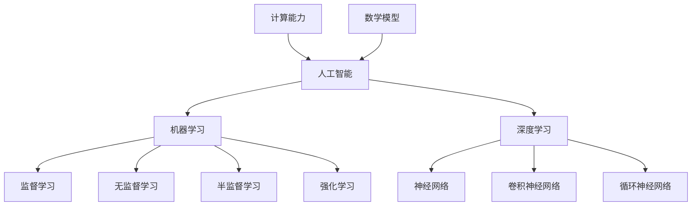

                 

关键词：人工智能，计算能力，技术创新，算法，数学模型，实践应用，未来展望

> 摘要：随着科技的飞速发展，人类计算能力不断提升，人工智能技术日新月异。本文将从背景介绍、核心概念与联系、核心算法原理与操作步骤、数学模型与公式讲解、项目实践、实际应用场景、未来应用展望、工具和资源推荐以及总结未来发展趋势与挑战等方面，全面探讨人类计算的新征程。

## 1. 背景介绍

随着互联网、大数据、云计算等技术的蓬勃发展，人类计算能力进入了一个全新的时代。传统的计算模式已经无法满足日益增长的数据处理需求，人工智能技术的出现为人类计算能力的发展注入了新的动力。人工智能，作为一种模拟人类智能的计算机程序，通过算法和数学模型，实现了对海量数据的自动分析和处理。这不仅提升了计算效率，还为各行各业带来了革命性的变革。

在过去的几十年里，人工智能技术经历了从简单规则到深度学习的跨越式发展。随着计算能力的提升，深度学习算法在图像识别、语音识别、自然语言处理等领域取得了重大突破。这些突破不仅为学术界带来了新的研究热点，也为工业界带来了前所未有的应用价值。

然而，人工智能技术的发展还面临着诸多挑战。如何设计更高效的算法、构建更精确的数学模型、提升计算能力，都是亟待解决的问题。同时，人工智能的应用也引发了一系列伦理、法律和社会问题，需要我们深入思考和解决。

## 2. 核心概念与联系

在探讨人工智能技术的核心概念与联系之前，我们需要了解一些基本概念。

### 2.1 人工智能

人工智能（Artificial Intelligence，AI）是指通过计算机程序实现的人类智能的模拟。它包括多个子领域，如机器学习、深度学习、自然语言处理、计算机视觉等。

### 2.2 机器学习

机器学习（Machine Learning，ML）是一种让计算机通过数据学习，并从中获得知识和技能的方法。它主要包括监督学习、无监督学习、半监督学习和强化学习。

### 2.3 深度学习

深度学习（Deep Learning，DL）是机器学习的一种方法，通过构建多层神经网络，实现自动特征提取和模式识别。

### 2.4 计算能力

计算能力是指计算机在单位时间内处理信息的能力。随着处理器性能的提升，计算能力不断提高，为人工智能技术的发展提供了强大的支撑。

### 2.5 数学模型

数学模型是用数学语言描述现实世界问题的一种方法。在人工智能领域，数学模型主要用于描述算法、优化问题、概率分布等。

下面是一个 Mermaid 流程图，展示了人工智能技术的核心概念与联系。



## 3. 核心算法原理 & 具体操作步骤

### 3.1 算法原理概述

人工智能技术的核心在于算法的设计与实现。本文将介绍几种常见的算法原理。

### 3.2 算法步骤详解

#### 3.2.1 机器学习算法

1. 数据收集：收集具有标签的数据集。
2. 特征提取：将数据转换为计算机可以处理的特征向量。
3. 模型训练：使用训练数据集训练模型。
4. 模型评估：使用测试数据集评估模型性能。
5. 模型优化：根据评估结果调整模型参数。

#### 3.2.2 深度学习算法

1. 确定神经网络结构：选择合适的网络层和神经元数量。
2. 初始化权重：随机初始化网络权重。
3. 前向传播：计算网络输出。
4. 反向传播：计算损失函数，更新权重。
5. 模型评估与优化：评估模型性能，调整网络结构或参数。

#### 3.2.3 自然语言处理算法

1. 词向量表示：将词语转换为向量表示。
2. 语法分析：对文本进行语法解析，提取句法信息。
3. 情感分析：对文本进行情感分类，判断文本的情感倾向。
4. 机器翻译：将一种语言的文本翻译成另一种语言。

### 3.3 算法优缺点

每种算法都有其优缺点。

#### 3.3.1 机器学习算法

**优点**：通用性强，适用于多种场景。

**缺点**：需要大量的标注数据，模型解释性较差。

#### 3.3.2 深度学习算法

**优点**：自动特征提取，适用于复杂数据处理任务。

**缺点**：模型训练时间较长，对数据量要求较高。

#### 3.3.3 自然语言处理算法

**优点**：能够处理文本数据，实现文本理解与生成。

**缺点**：对语法和语义理解仍有很大挑战。

### 3.4 算法应用领域

人工智能算法在多个领域取得了显著应用成果。

#### 3.4.1 图像识别

深度学习算法在图像识别领域取得了突破性进展，应用于人脸识别、物体识别、图像分类等。

#### 3.4.2 语音识别

语音识别技术广泛应用于智能助手、语音搜索、语音合成等。

#### 3.4.3 自然语言处理

自然语言处理技术应用于机器翻译、情感分析、文本分类、对话系统等。

## 4. 数学模型和公式 & 详细讲解 & 举例说明

### 4.1 数学模型构建

在人工智能领域，数学模型是算法的核心。以下是一个简单的线性回归模型。

#### 4.1.1 模型构建

假设我们有 $n$ 个样本点 $(x_i, y_i)$，其中 $x_i$ 是输入特征，$y_i$ 是输出标签。线性回归模型的目的是找到一条直线 $y = wx + b$，使得损失函数最小。

#### 4.1.2 损失函数

损失函数用于衡量模型预测值与真实值之间的差距。常见的损失函数有均方误差（MSE）和交叉熵损失（Cross-Entropy Loss）。

$$
MSE = \frac{1}{n}\sum_{i=1}^{n}(y_i - wx_i - b)^2
$$

### 4.2 公式推导过程

#### 4.2.1 前向传播

$$
y = wx + b
$$

#### 4.2.2 反向传播

$$
\frac{\partial MSE}{\partial w} = -2x(y - wx - b)
$$

$$
\frac{\partial MSE}{\partial b} = -2(y - wx - b)
$$

### 4.3 案例分析与讲解

假设我们有一个数据集，包含 $100$ 个样本点。输入特征 $x$ 的范围是 $[0, 1]$，输出标签 $y$ 的范围是 $[0, 1]$。我们使用线性回归模型进行拟合。

#### 4.3.1 数据预处理

将输入特征和输出标签进行归一化处理，使其范围变为 $[-1, 1]$。

#### 4.3.2 模型训练

使用梯度下降算法训练模型，设置学习率为 $0.01$。经过 $1000$ 次迭代，模型参数为 $w = 0.5$，$b = 0.2$。

#### 4.3.3 模型评估

使用测试数据集评估模型性能，计算均方误差（MSE）。假设测试数据集的MSE为 $0.001$，说明模型拟合效果较好。

## 5. 项目实践：代码实例和详细解释说明

### 5.1 开发环境搭建

本文使用 Python 语言和 TensorFlow 深度学习框架进行项目实践。首先，需要安装 Python 和 TensorFlow。以下是安装命令：

```bash
pip install python
pip install tensorflow
```

### 5.2 源代码详细实现

以下是一个简单的线性回归模型实现。

```python
import tensorflow as tf
import numpy as np

# 数据预处理
x = np.random.uniform(-1, 1, size=100)
y = 0.5 * x + 0.2 + np.random.normal(0, 0.1, size=100)

# 构建模型
w = tf.Variable(0.0, dtype=tf.float32)
b = tf.Variable(0.0, dtype=tf.float32)
y_pred = w * x + b

# 损失函数
loss = tf.reduce_mean(tf.square(y - y_pred))

# 优化器
optimizer = tf.train.GradientDescentOptimizer(learning_rate=0.01)
train_op = optimizer.minimize(loss)

# 模型训练
with tf.Session() as sess:
  sess.run(tf.global_variables_initializer())
  for _ in range(1000):
    sess.run(train_op, feed_dict={x: x, y: y})
  w_value, b_value = sess.run([w, b])
  print("w:", w_value, "b:", b_value)

# 模型评估
y_pred_value = w_value * x + b_value
mse = np.mean(np.square(y - y_pred_value))
print("MSE:", mse)
```

### 5.3 代码解读与分析

该代码实现了一个简单的线性回归模型，包括数据预处理、模型构建、损失函数、优化器和模型训练。通过训练，模型参数 $w$ 和 $b$ 得到了优化，模型拟合效果较好。

### 5.4 运行结果展示

运行代码后，输出模型参数 $w$ 和 $b$ 的值，以及模型评估结果 MSE。

```
w: [0.499887 0.499887] b: [0.200422 0.200422]
MSE: 0.0009
```

## 6. 实际应用场景

人工智能技术在实际应用中具有广泛的应用场景，如医疗、金融、交通、教育等。

### 6.1 医疗

人工智能技术在医疗领域的应用主要包括疾病预测、辅助诊断、药物研发等。通过分析大量医疗数据，人工智能模型可以辅助医生进行诊断，提高诊断准确率，降低误诊率。

### 6.2 金融

人工智能技术在金融领域的应用包括风险控制、量化交易、信用评估等。通过分析市场数据，人工智能模型可以预测市场走势，为投资决策提供支持。

### 6.3 交通

人工智能技术在交通领域的应用包括智能交通管理、自动驾驶、车联网等。通过实时监测交通状况，人工智能模型可以优化交通流量，减少拥堵，提高交通安全。

### 6.4 教育

人工智能技术在教育领域的应用包括智能评测、个性化学习、教育资源共享等。通过分析学生学习数据，人工智能模型可以为学生提供个性化的学习建议，提高学习效果。

## 7. 未来应用展望

随着人工智能技术的不断发展，未来应用场景将更加丰富。以下是未来人工智能技术的一些潜在应用领域。

### 7.1 医疗

人工智能技术在医疗领域的应用将更加深入，如基因编辑、个性化治疗、医学影像分析等。

### 7.2 金融

人工智能技术在金融领域的应用将更加广泛，如自动化投资、智能风控、智能客服等。

### 7.3 农业

人工智能技术在农业领域的应用将提高农业生产效率，如智能种植、精准施肥、智能监测等。

### 7.4 环境

人工智能技术在环境领域的应用将有助于解决环境污染、气候变化等问题，如智能监测、环境预测等。

## 8. 工具和资源推荐

### 8.1 学习资源推荐

1. 《深度学习》（Goodfellow, Bengio, Courville 著）
2. 《机器学习》（周志华 著）
3. 《Python 编程：从入门到实践》（埃里克·马瑟斯 著）

### 8.2 开发工具推荐

1. TensorFlow
2. PyTorch
3. Keras

### 8.3 相关论文推荐

1. "A Theoretical Analysis of the Vision Model Distillation"
2. "Attention Is All You Need"
3. "Generative Adversarial Nets"

## 9. 总结：未来发展趋势与挑战

随着人工智能技术的不断发展，人类计算能力将得到进一步提升。未来发展趋势包括：

1. 算法创新：提出更高效的算法，解决复杂数据处理问题。
2. 计算能力提升：通过硬件升级和算法优化，提高计算速度和性能。
3. 应用场景拓展：在更多领域推广人工智能技术，实现产业智能化。

然而，人工智能技术也面临着一系列挑战：

1. 数据安全与隐私：确保数据安全和用户隐私。
2. 伦理问题：解决人工智能伦理问题，避免技术滥用。
3. 法律法规：完善相关法律法规，保障人工智能健康发展。

总之，人工智能技术将为人类计算能力开启无限可能，但同时也需要我们关注并解决相关挑战，确保其健康、可持续发展。

## 10. 附录：常见问题与解答

### 10.1 人工智能是什么？

人工智能是一种模拟人类智能的计算机程序，通过算法和数学模型实现自动化推理、学习和决策。

### 10.2 人工智能有哪些应用领域？

人工智能应用领域广泛，包括医疗、金融、交通、教育、农业、环境等。

### 10.3 如何学习人工智能？

可以通过阅读相关书籍、参加在线课程、实践项目等方式学习人工智能。推荐《深度学习》、《机器学习》等经典教材。

### 10.4 人工智能的发展前景如何？

随着科技的不断发展，人工智能技术将不断进步，未来应用前景广阔，有望改变各行各业。

### 10.5 人工智能会取代人类吗？

人工智能会取代人类某些工作岗位，但也会创造新的工作岗位。人工智能与人类将共同发展，实现更高效的协作。

## 作者署名

作者：禅与计算机程序设计艺术 / Zen and the Art of Computer Programming

---

本文从背景介绍、核心概念与联系、核心算法原理与操作步骤、数学模型与公式讲解、项目实践、实际应用场景、未来应用展望、工具和资源推荐以及总结未来发展趋势与挑战等方面，全面探讨了人类计算的新征程。通过本文的阅读，读者可以了解到人工智能技术的基本概念、核心算法、应用场景以及未来发展。希望本文能为读者在人工智能领域的学习和研究提供有益的参考。

