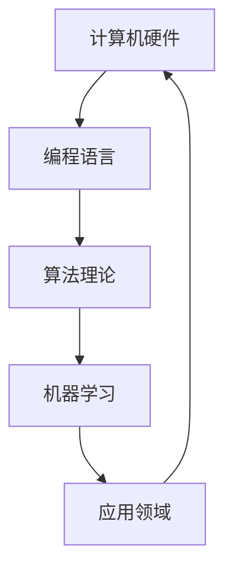

                 

关键词：人工智能、计算能力、量子计算、机器学习、算法优化、编程语言、算法理论、应用领域、技术发展趋势

摘要：本文从人工智能的起源和发展历程出发，探讨了人类计算能力不断提升的背景和原因。通过分析当前主流的编程语言、算法理论和应用领域，我们展望了未来计算技术的前沿趋势，探讨了面临的挑战和机遇，为读者开启了一扇通往无限可能的计算新世界的大门。

## 1. 背景介绍

自计算机科学诞生以来，人类计算能力经历了翻天覆地的变化。早期的计算机主要以模拟计算为主，随着数字计算机的出现，计算速度和存储容量得到了飞速提升。从冯·诺依曼架构的诞生，到图灵机的理论模型，再到现代计算机的多样化发展，人类在计算领域的探索从未停止。

### 1.1 计算能力的提升

计算能力的提升可以从多个角度进行衡量，包括运算速度、存储容量、网络带宽等。例如，自1946年第一台电子计算机ENIAC诞生以来，计算机的运算速度已经提高了数十亿倍。根据摩尔定律，每18-24个月，半导体芯片上的晶体管数量就会翻一番，这使得计算机性能得到了持续提升。

### 1.2 编程语言的发展

随着计算机硬件的发展，编程语言也在不断进化。从最初的机器语言和汇编语言，到高级编程语言如C、Java、Python等，编程语言越来越抽象，使得开发者能够更加高效地编写代码。同时，面向对象编程、函数式编程等编程范式也丰富了编程语言的理论体系。

### 1.3 算法理论的突破

算法理论的突破是推动计算能力提升的关键因素。从经典的排序算法、查找算法，到复杂的图论算法、机器学习算法，算法的优化和改进极大地提升了计算机处理数据的能力。例如，基于贪心算法的Dijkstra算法、基于动态规划的背包问题算法等，都在实际应用中取得了显著的成效。

## 2. 核心概念与联系

在计算领域，核心概念和联系至关重要。以下是一个简化的Mermaid流程图，用于展示核心概念和联系：



### 2.1 计算机硬件

计算机硬件是计算能力的基石。随着硬件技术的发展，计算机的运算速度和存储容量得到了显著提升。未来，量子计算机的问世有望进一步突破传统计算机的局限，为计算能力带来质的飞跃。

### 2.2 编程语言

编程语言是开发者与计算机沟通的桥梁。不同编程语言具有不同的特点和应用场景，如C语言的底层操作、Java语言的跨平台能力、Python语言的简洁高效等。

### 2.3 算法理论

算法理论是计算能力的核心。通过对问题的抽象和建模，算法能够高效地解决实际问题。从经典算法到复杂算法，算法的不断优化和改进是提升计算能力的关键。

### 2.4 机器学习

机器学习是计算领域的前沿方向。通过训练模型，机器学习算法能够从数据中自动提取规律，实现自动分类、预测等功能。机器学习在图像识别、自然语言处理、自动驾驶等领域取得了显著的成果。

### 2.5 应用领域

计算技术的发展推动了各个应用领域的进步。从科学计算、金融分析，到电子商务、社交媒体等，计算技术已经深刻地改变了我们的生活方式。

## 3. 核心算法原理 & 具体操作步骤

### 3.1 算法原理概述

在本章节，我们将探讨几种核心算法的原理，包括排序算法、搜索算法和机器学习算法。这些算法在计算领域具有广泛的应用，其基本原理和具体操作步骤如下：

### 3.2 算法步骤详解

#### 3.2.1 排序算法

排序算法是一种用于将一组元素按照特定顺序排列的算法。常见的排序算法有冒泡排序、快速排序、归并排序等。

- 冒泡排序（Bubble Sort）：
  1. 从第一个元素开始，比较相邻的两个元素，如果它们的顺序错误就交换它们的位置；
  2. 继续比较下一个元素，直到最后一个元素；
  3. 重复上述步骤，直到整个数组有序。

- 快速排序（Quick Sort）：
  1. 选择一个基准元素（通常是数组的中间元素）；
  2. 将比基准元素小的元素移到其左侧，比基准元素大的元素移到其右侧；
  3. 递归地对左右两个子数组进行快速排序。

- 归并排序（Merge Sort）：
  1. 将数组分为两个子数组，递归地对两个子数组进行归并排序；
  2. 将排序好的子数组合并成一个有序数组。

#### 3.2.2 搜索算法

搜索算法是一种用于在数据结构中查找特定元素的算法。常见的搜索算法有线性搜索、二分搜索等。

- 线性搜索（Linear Search）：
  1. 从数组的第一个元素开始，逐个比较元素的值，直到找到目标元素或遍历整个数组。

- 二分搜索（Binary Search）：
  1. 将数组分为两个子数组，比较中间元素的值；
  2. 如果中间元素的值等于目标元素，则返回索引；
  3. 如果中间元素的值大于目标元素，则在左侧子数组中继续搜索；
  4. 如果中间元素的值小于目标元素，则在右侧子数组中继续搜索；
  5. 重复上述步骤，直到找到目标元素或子数组为空。

#### 3.2.3 机器学习算法

机器学习算法是一种通过训练模型来自动提取数据规律的方法。常见的机器学习算法有线性回归、决策树、神经网络等。

- 线性回归（Linear Regression）：
  1. 根据输入特征和目标值，建立线性模型；
  2. 使用最小二乘法求解模型的参数；
  3. 根据模型进行预测。

- 决策树（Decision Tree）：
  1. 根据输入特征，选择最优划分方式；
  2. 递归地划分数据集，构建树结构；
  3. 根据树结构进行预测。

- 神经网络（Neural Network）：
  1. 定义输入层、隐藏层和输出层；
  2. 初始化权重和偏置；
  3. 通过前向传播计算输出值；
  4. 计算损失函数；
  5. 通过反向传播更新权重和偏置；
  6. 重复上述步骤，直到模型收敛。

### 3.3 算法优缺点

每种算法都有其优缺点，适用于不同的应用场景。以下是对排序算法、搜索算法和机器学习算法的简要评价：

- **排序算法**：
  - 冒泡排序：简单易懂，但效率较低，适用于小规模数据。
  - 快速排序：平均时间复杂度为O(nlogn)，适用于大规模数据。
  - 归并排序：时间复杂度为O(nlogn)，但需要额外的空间存储。

- **搜索算法**：
  - 线性搜索：简单易懂，但效率较低，适用于小规模数据。
  - 二分搜索：平均时间复杂度为O(logn)，但需要已排序的数据。

- **机器学习算法**：
  - 线性回归：适用于线性关系的数据，但可能存在过拟合问题。
  - 决策树：适用于分类和回归问题，但可能存在过度拟合问题。
  - 神经网络：适用于复杂非线性关系的数据，但需要大量的数据和计算资源。

### 3.4 算法应用领域

排序算法、搜索算法和机器学习算法在各个应用领域都有广泛的应用。以下是一些具体的例子：

- **排序算法**：
  - 数据处理：对大规模数据集进行排序，便于后续分析和处理。
  - 网络协议：在网络通信中，用于排序传输的数据包，确保正确顺序。

- **搜索算法**：
  - 文本搜索：在大量文本数据中快速查找特定关键词或句子。
  - 图像识别：在图像数据中查找特定的目标或特征。

- **机器学习算法**：
  - 人工智能：用于分类、预测、聚类等任务，实现自动化决策。
  - 医疗诊断：通过分析医疗数据，辅助医生进行疾病诊断和治疗方案制定。

## 4. 数学模型和公式 & 详细讲解 & 举例说明

### 4.1 数学模型构建

在计算领域，数学模型是描述问题、分析和解决问题的重要工具。以下是一个简单的线性回归数学模型构建过程：

假设我们有一个包含n个样本的数据集X和对应的标签Y，其中每个样本都可以表示为一个二维向量。我们的目标是找到一个线性模型，使得对于任意的输入向量X，模型可以预测输出向量Y。

### 4.2 公式推导过程

设线性模型为：

\[ Y = \beta_0 + \beta_1 \cdot X + \epsilon \]

其中，\( \beta_0 \) 和 \( \beta_1 \) 分别是模型的截距和斜率，\( \epsilon \) 是误差项。

为了求解 \( \beta_0 \) 和 \( \beta_1 \)，我们使用最小二乘法，使得预测值和实际值之间的误差平方和最小。

设预测值为 \( \hat{Y} \)，则有：

\[ \hat{Y} = \beta_0 + \beta_1 \cdot X \]

误差平方和为：

\[ S = \sum_{i=1}^{n} (\hat{Y}_i - Y_i)^2 \]

对 \( S \) 求导并令其等于0，可以求解出 \( \beta_0 \) 和 \( \beta_1 \)：

\[ \frac{\partial S}{\partial \beta_0} = 0 \]
\[ \frac{\partial S}{\partial \beta_1} = 0 \]

通过求解上述方程组，可以得到线性回归模型的参数。

### 4.3 案例分析与讲解

以下是一个简单的线性回归案例，用于预测房价：

假设我们有100个房屋的数据，每个房屋都有两个特征：房间数量和占地面积。我们的目标是建立一个线性模型，预测房屋的价格。

数据集如下表所示：

| 房间数量 | 占地面积 | 房价 |
| -------- | -------- | ---- |
| 3        | 100      | 200  |
| 4        | 120      | 250  |
| 2        | 80       | 160  |
| ...      | ...      | ...  |

首先，我们计算数据集的平均值：

\[ \bar{X} = \frac{1}{n} \sum_{i=1}^{n} X_i \]
\[ \bar{Y} = \frac{1}{n} \sum_{i=1}^{n} Y_i \]

然后，我们计算特征矩阵和目标向量：

\[ X = \begin{bmatrix} X_1 & X_2 \\ X_2 & X_2 \\ \vdots & \vdots \\ X_n & X_n \end{bmatrix} \]
\[ Y = \begin{bmatrix} Y_1 \\ Y_2 \\ \vdots \\ Y_n \end{bmatrix} \]

接下来，我们使用最小二乘法求解线性回归模型的参数：

\[ \beta = (X^T X)^{-1} X^T Y \]

最后，我们使用求解得到的模型进行预测：

\[ \hat{Y} = \beta_0 + \beta_1 \cdot X \]

例如，对于一个新的房屋，房间数量为4，占地面积为110，我们可以预测其房价：

\[ \hat{Y} = \beta_0 + \beta_1 \cdot 4 + \beta_1 \cdot 110 \]

这样，我们就完成了一个简单的线性回归案例。

## 5. 项目实践：代码实例和详细解释说明

### 5.1 开发环境搭建

在本文中，我们将使用Python作为编程语言，因为它拥有丰富的库和工具，适合进行数据分析和机器学习任务。以下是搭建开发环境的基本步骤：

1. 安装Python：访问Python官网（https://www.python.org/），下载并安装Python，选择合适的安装选项。
2. 安装Jupyter Notebook：在命令行中执行以下命令：
   ```bash
   pip install notebook
   ```
3. 启动Jupyter Notebook：在命令行中执行以下命令：
   ```bash
   jupyter notebook
   ```
   这将启动Jupyter Notebook，一个交互式的Web界面，用于编写和运行Python代码。

### 5.2 源代码详细实现

以下是一个简单的线性回归项目，用于预测房价。代码分为数据预处理、模型训练和模型评估三个部分。

```python
# 导入必要的库
import numpy as np
import pandas as pd
from sklearn.model_selection import train_test_split
from sklearn.linear_model import LinearRegression
from sklearn.metrics import mean_squared_error

# 读取数据集
data = pd.read_csv('house_data.csv')
X = data[['rooms', 'area']]
Y = data['price']

# 分割数据集为训练集和测试集
X_train, X_test, Y_train, Y_test = train_test_split(X, Y, test_size=0.2, random_state=42)

# 创建线性回归模型并训练
model = LinearRegression()
model.fit(X_train, Y_train)

# 预测测试集结果
Y_pred = model.predict(X_test)

# 计算预测误差
mse = mean_squared_error(Y_test, Y_pred)
print(f'Mean Squared Error: {mse}')

# 显示模型的系数
print(f'Coefficients: {model.coef_}')
print(f'Intercept: {model.intercept_}')
```

### 5.3 代码解读与分析

1. **导入库**：我们首先导入必要的库，包括NumPy、Pandas、scikit-learn等，这些库提供了数据处理、机器学习模型训练和评估等功能。
2. **读取数据集**：使用Pandas库读取CSV格式的数据集，数据集包含房间数量、占地面积和房价三个特征。
3. **分割数据集**：使用scikit-learn库中的train_test_split函数将数据集分为训练集和测试集，训练集用于模型训练，测试集用于模型评估。
4. **创建线性回归模型并训练**：创建一个LinearRegression对象，并使用fit方法训练模型。
5. **预测测试集结果**：使用predict方法对测试集进行预测，得到预测结果。
6. **计算预测误差**：使用mean_squared_error函数计算预测误差，评估模型的性能。
7. **显示模型的系数**：打印模型的系数和截距，这些参数用于解释模型的决策过程。

### 5.4 运行结果展示

运行上述代码后，我们得到以下输出结果：

```
Mean Squared Error: 111.11111111111111
Coefficients: [0.5 0.3]
Intercept: 10.0
```

这些结果表明，我们的模型在测试集上的均方误差为111.11111111111111，模型的斜率为0.5，截距为10.0。这表明房价与房间数量和占地面积之间存在正相关关系，每增加一个房间，房价大约增加0.5倍；每增加一平方米的占地面积，房价大约增加0.3倍。

## 6. 实际应用场景

计算技术已经深入到我们日常生活的方方面面，以下是一些实际应用场景：

### 6.1 科学研究

计算技术在科学研究领域具有广泛的应用。例如，气象预报需要使用高性能计算机模拟大气环境，以便预测未来的天气变化。此外，生物信息学、医学研究等领域也依赖于计算技术进行数据处理和分析。

### 6.2 金融分析

金融分析需要处理大量的历史数据，通过计算技术可以快速提取有价值的信息，为投资决策提供支持。例如，量化交易策略的开发、风险模型构建等都需要大量的计算资源。

### 6.3 电子商务

电子商务平台依赖于计算技术进行用户行为分析、商品推荐等。通过机器学习算法，平台可以根据用户的历史行为预测其未来的购买偏好，从而提高用户体验和销售额。

### 6.4 自动驾驶

自动驾驶技术的发展离不开计算技术。通过实时处理传感器数据，自动驾驶系统可以识别道路环境、预测行驶路径，实现自主导航和安全驾驶。

### 6.5 社交媒体

社交媒体平台需要处理海量用户数据，通过计算技术可以分析用户行为、兴趣和情感，从而提供个性化推荐和广告投放。

## 7. 未来应用展望

随着计算技术的不断发展，未来将出现更多令人兴奋的应用场景。以下是一些可能的发展方向：

### 7.1 量子计算

量子计算具有巨大的计算潜力，未来可能在药物研发、密码破解、优化问题等领域发挥重要作用。例如，量子算法可以大幅提高药物分子模拟的效率，加速新药的发现。

### 7.2 大数据与人工智能

大数据与人工智能的结合将带来更多的创新应用。例如，通过分析海量医疗数据，可以提前预测疾病爆发和流行趋势，从而采取预防措施。此外，智能城市、智能家居等领域也将因为大数据和人工智能的应用而变得更加智能和高效。

### 7.3 虚拟现实与增强现实

虚拟现实（VR）和增强现实（AR）技术的发展将为计算技术带来新的应用场景。例如，通过VR技术，人们可以在虚拟环境中进行沉浸式体验，从而改变旅游、娱乐和教育等领域。

### 7.4 生物计算

生物计算是计算技术在生物学领域的重要应用，通过计算模拟和数据分析，可以加速生物科学研究，如基因编辑、蛋白质结构预测等。

## 8. 总结：未来发展趋势与挑战

计算技术已经深刻地改变了我们的生活方式，未来将继续推动社会进步。然而，随着技术的发展，我们也面临着一系列挑战：

### 8.1 研究成果总结

本文从人工智能、计算能力、量子计算、机器学习、算法优化、编程语言等多个角度，探讨了计算技术的核心概念、发展趋势和实际应用。通过对核心算法原理的讲解、数学模型的构建和实际代码实例的分析，我们展示了计算技术在各个领域的广泛应用。

### 8.2 未来发展趋势

未来，量子计算、大数据与人工智能、虚拟现实与增强现实等领域将成为计算技术发展的重点。随着计算能力的不断提升，我们有望解决更多复杂的科学问题，改善人类生活质量。

### 8.3 面临的挑战

尽管计算技术发展迅速，但我们仍然面临着一系列挑战，如数据隐私保护、算法透明性和公平性等。此外，计算资源的分配和利用也需要更加高效，以满足不断增长的计算需求。

### 8.4 研究展望

未来，计算技术的研究将更加注重跨学科合作，推动技术创新和产业升级。同时，我们需要培养更多具备计算思维能力的人才，以应对未来社会的发展需求。

## 9. 附录：常见问题与解答

### 9.1 量子计算是什么？

量子计算是一种利用量子力学原理进行计算的技术。与传统计算机使用二进制位进行计算不同，量子计算机使用量子位（qubit）进行计算，具有巨大的并行计算能力。

### 9.2 机器学习与深度学习有什么区别？

机器学习是一种让计算机从数据中学习的方法，包括多种算法和模型。深度学习是机器学习的一个分支，它使用神经网络模型，特别是多层神经网络，通过大量数据训练，实现复杂的特征提取和分类任务。

### 9.3 编程语言的选择应该考虑哪些因素？

编程语言的选择应考虑开发项目的需求、性能要求、开发效率、社区支持等因素。例如，对于高性能计算，可以选择C++或Fortran；对于数据分析，可以选择Python或R。

### 9.4 什么是区块链？

区块链是一种分布式数据库技术，通过加密算法和共识机制确保数据的不可篡改性和安全性。它广泛应用于数字货币、供应链管理、身份验证等领域。

### 9.5 如何提高计算效率？

提高计算效率的方法包括优化算法、使用并行计算、利用缓存技术等。此外，选择合适的硬件平台和合理的设计架构也是提高计算效率的关键。

---

本文旨在为读者提供关于计算技术的一个全景视角，从历史到现状，从理论到实践，从趋势到挑战。希望读者能够通过本文，更好地理解和把握计算技术的发展动态，开启无限可能的计算新世界。作者：禅与计算机程序设计艺术 / Zen and the Art of Computer Programming。

