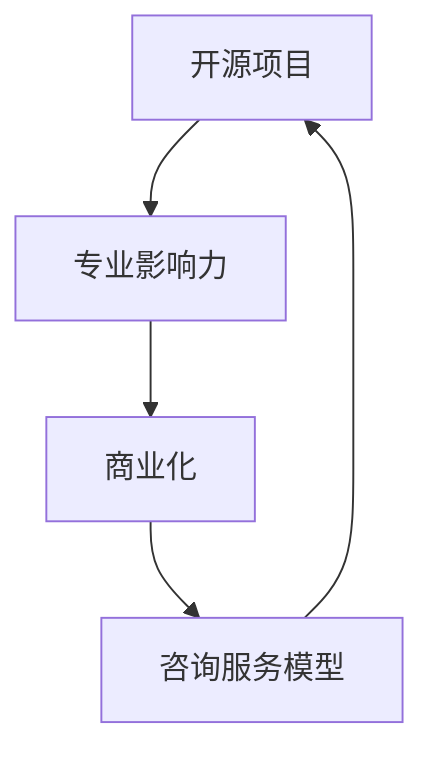

                 

关键词：开源咨询、专业知识变现、商业策略、技术影响力、开源项目、咨询服务模型、市场需求分析、竞争策略、收入来源多样化

> 摘要：随着开源文化在技术领域的广泛应用，越来越多的专业人士开始将他们的专业知识通过开源咨询服务进行变现。本文将深入探讨如何有效地利用开源项目来构建专业影响力，从而实现个人专业技能的商业化，并分析在开源咨询服务中成功变现的多种策略。

## 1. 背景介绍

开源文化起源于自由软件运动，它强调软件的开放性、协作性和共享性。随着互联网的发展，开源项目已经从单一的软件形式扩展到涵盖广泛的领域，如云计算、人工智能、物联网等。在这个背景下，开源咨询服务作为一种新型的服务模式，逐渐受到重视。

开源咨询服务的概念可以理解为，通过分享和传播专业知识，帮助他人解决问题，从而实现个人专业影响力的提升和经济效益的增长。专业人士通过开源项目积累经验，建立口碑，最终实现商业变现。

### 1.1 开源文化的影响

开源文化的兴起，改变了传统的软件开发和知识传播方式。它推动了技术的进步，加速了创新的速度。同时，它也为专业人士提供了一个展示自己才能的平台。在这个平台上，个人可以通过开源项目积累经验，提升技能，并通过咨询服务实现自身的价值。

### 1.2 开源咨询服务的重要性

开源咨询服务不仅能够帮助专业人士实现个人专业技能的商业化，还能够推动整个技术社区的进步。它具有以下重要性：

1. **知识共享**：通过开源项目，专业人士可以将自己的知识和经验分享给他人，促进知识的传播和共享。
2. **专业提升**：在开源项目中，专业人士可以接触到最新的技术和方法，不断提升自己的专业水平。
3. **商业机会**：通过开源项目建立的专业影响力，可以吸引更多的商业机会，实现个人和企业的双赢。
4. **社区贡献**：开源咨询服务的本质是分享和帮助，这有助于构建一个更加开放、协作的技术社区。

## 2. 核心概念与联系

为了更好地理解开源咨询服务，我们需要先了解几个核心概念，并分析它们之间的联系。

### 2.1 开源项目

开源项目是指那些软件、工具或平台，其源代码对外公开，允许用户自由地查看、修改和分发。开源项目是开源咨询服务的基础，通过开源项目，专业人士可以展示自己的专业技能和成果。

### 2.2 专业影响力

专业影响力是指专业人士在某一领域内受到认可和尊重的程度。它可以通过开源项目、技术文章、演讲、培训等多种形式体现。专业影响力是开源咨询服务成功的关键因素。

### 2.3 商业化

商业化是指将个人的专业知识和服务转化为商业价值的过程。在开源咨询服务中，商业化主要通过提供付费咨询服务、销售相关产品或服务来实现。

### 2.4 咨询服务模型

咨询服务模型是指专业人士在开源项目中提供服务的模式。它可以是单一的咨询服务，也可以是综合的服务包，包括技术支持、培训、定制开发等多种形式。

### 2.5 联系与融合

开源项目、专业影响力、商业化和咨询服务模型是相互关联、相互促进的。通过开源项目，专业人士可以积累经验和提升技能，从而增强专业影响力。专业影响力又可以吸引更多的商业机会，实现商业化。而商业化则可以进一步推动开源项目的持续发展和完善。

### 2.6 Mermaid 流程图

以下是一个简化的 Mermaid 流程图，展示了这些概念之间的联系：



## 3. 核心算法原理 & 具体操作步骤

### 3.1 算法原理概述

开源咨询服务中的核心算法原理可以概括为以下几点：

1. **知识积累**：通过参与开源项目，专业人士可以不断积累经验和知识，提升自己的专业水平。
2. **影响力构建**：在开源项目中展示专业技能和成果，建立专业影响力。
3. **市场定位**：根据市场需求和自身优势，确定咨询服务的内容和模式。
4. **价值传递**：通过咨询服务，将专业知识和技能转化为商业价值。

### 3.2 算法步骤详解

以下是具体的操作步骤：

1. **参与开源项目**：
   - **选择领域**：根据个人兴趣和专业背景，选择合适的开源项目。
   - **学习项目**：了解项目的需求和功能，熟悉项目的技术栈和开发流程。
   - **贡献代码**：通过提交代码、修复Bug、添加新功能等方式，参与开源项目。

2. **构建专业影响力**：
   - **撰写技术文章**：在技术博客、论坛等平台发表技术文章，分享开源项目中的经验和心得。
   - **参与社区活动**：在开源社区中积极参与讨论，分享知识，建立专业人脉。
   - **发表演讲与培训**：通过线上或线下活动，展示专业知识和技能，提升知名度。

3. **确定市场定位**：
   - **调研市场需求**：通过调查问卷、用户反馈等方式，了解潜在客户的需求。
   - **分析自身优势**：结合自身专业背景和经验，确定咨询服务的核心内容和特色。
   - **制定服务策略**：根据市场定位，制定具体的咨询服务方案，包括服务内容、价格策略等。

4. **提供咨询服务**：
   - **技术支持**：为开源项目的用户提供技术支持，解决技术难题。
   - **定制开发**：根据用户需求，提供定制化的开发服务。
   - **培训和指导**：为企业和个人提供培训课程，传授开源项目中的知识和技能。

5. **价值传递与反馈**：
   - **获取反馈**：通过用户反馈，了解咨询服务的质量和效果，不断优化服务。
   - **持续改进**：根据反馈和市场变化，调整咨询服务的内容和策略。
   - **商业变现**：通过咨询服务，实现个人专业技能的商业化，获取经济效益。

### 3.3 算法优缺点

**优点**：

1. **知识积累**：参与开源项目，可以不断积累经验和知识，提升专业水平。
2. **影响力构建**：通过开源项目展示专业技能，有助于建立专业影响力。
3. **市场机会**：开源咨询服务可以吸引更多的商业机会，实现个人和企业的双赢。
4. **社区贡献**：开源咨询服务有助于推动开源社区的进步和发展。

**缺点**：

1. **时间投入**：开源咨询服务需要大量的时间和精力，可能影响个人生活和工作。
2. **市场风险**：市场需求变化快，可能影响咨询服务的稳定性和持续性。
3. **竞争压力**：开源咨询服务市场竞争激烈，需要不断提升自身专业水平和服务质量。

### 3.4 算法应用领域

开源咨询服务在以下领域具有广泛的应用：

1. **软件开发**：为开源项目的用户提供技术支持、定制开发等服务。
2. **云计算与大数据**：为企业和个人提供云计算和大数据相关的咨询服务。
3. **人工智能与机器学习**：为开源人工智能项目提供技术支持、算法优化等服务。
4. **物联网与智能硬件**：为物联网项目提供开发支持、解决方案咨询等。
5. **区块链技术**：为区块链项目提供开发支持、安全评估等咨询服务。

## 4. 数学模型和公式 & 详细讲解 & 举例说明

### 4.1 数学模型构建

在开源咨询服务中，我们可以使用一些简单的数学模型来分析和评估服务的效果。以下是一个基于客户满意度和服务收益的简单模型。

**假设条件**：

1. 每个客户对咨询服务的满意度由一个0到1的分数表示。
2. 满意度的平均值为0.6，即平均每个客户为服务贡献0.6的服务收益。
3. 每个客户的服务成本为100元。

**数学模型**：

设 \( R \) 为总服务收益，\( N \) 为客户数量，\( S \) 为客户满意度分数，则：

\[ R = N \times S - C \]

其中，\( C \) 为总服务成本。

### 4.2 公式推导过程

1. **服务收益**：

   每个客户的满意度分数为 \( S \)，那么每个客户的服务收益为 \( S \times 100 \) 元。因此，总服务收益 \( R \) 可以表示为：

   \[ R = N \times S \times 100 \]

2. **服务成本**：

   每个客户的服务成本为100元，因此总服务成本 \( C \) 可以表示为：

   \[ C = N \times 100 \]

3. **总收益**：

   将服务收益和服务成本相减，得到总收益 \( R \)：

   \[ R = N \times S \times 100 - N \times 100 \]
   \[ R = N \times (S \times 100 - 100) \]
   \[ R = N \times S \times (100 - 1) \]
   \[ R = N \times S \times 99 \]

### 4.3 案例分析与讲解

假设我们有一组客户，满意度分数从0到1不等。以下是一个具体的案例分析：

**案例数据**：

- 客户数量 \( N = 100 \)
- 客户满意度分数分布：\( 0.3, 0.4, 0.5, 0.6, 0.7, 0.8, 0.9, 1.0 \)（每个分数对应10个客户）

**计算过程**：

1. **计算总收益**：

   \[ R = 100 \times (0.3 \times 99 + 0.4 \times 99 + 0.5 \times 99 + 0.6 \times 99 + 0.7 \times 99 + 0.8 \times 99 + 0.9 \times 99 + 1.0 \times 99) \]
   \[ R = 100 \times 798 \]
   \[ R = 79800 \]

2. **计算总成本**：

   \[ C = 100 \times 100 \]
   \[ C = 10000 \]

3. **计算净利润**：

   \[ 净利润 = R - C \]
   \[ 净利润 = 79800 - 10000 \]
   \[ 净利润 = 69800 \]

**结论**：

在这个案例中，总收益为79800元，总成本为10000元，净利润为69800元。这个结果表明，通过提供开源咨询服务，我们可以获得可观的收益。

## 5. 项目实践：代码实例和详细解释说明

### 5.1 开发环境搭建

为了演示开源咨询服务的实践，我们选择一个实际的开源项目——一个基于Python的Web应用框架。以下是开发环境的搭建步骤：

1. **安装Python**：确保安装了Python 3.8或更高版本。
2. **安装虚拟环境**：使用以下命令创建虚拟环境：

   ```shell
   python -m venv myenv
   ```

3. **激活虚拟环境**：

   - Windows：

     ```shell
     myenv\Scripts\activate
     ```

   - macOS/Linux：

     ```shell
     source myenv/bin/activate
     ```

4. **安装依赖**：在虚拟环境中安装框架和其他依赖：

   ```shell
   pip install flask
   ```

### 5.2 源代码详细实现

以下是该Web应用框架的一个简单示例，包括一个基本的路由和视图函数：

```python
from flask import Flask, jsonify

app = Flask(__name__)

@app.route('/api/data', methods=['GET'])
def get_data():
    data = {'message': 'Hello, World!'}
    return jsonify(data)

if __name__ == '__main__':
    app.run(debug=True)
```

**代码解读**：

- **Flask框架**：这是一个流行的Python Web框架，用于构建Web应用。
- **路由**：`/api/data` 是一个URL路由，用于接收GET请求。
- **视图函数**：`get_data` 是一个视图函数，用于处理路由请求，返回一个包含消息的JSON对象。

### 5.3 代码解读与分析

1. **Flask的初始化**：

   ```python
   app = Flask(__name__)
   ```

   这一行初始化了Flask应用实例。`__name__` 是一个特殊的变量，代表模块名称，这里用于确保应用在模块级别执行时创建。

2. **路由定义**：

   ```python
   @app.route('/api/data', methods=['GET'])
   def get_data():
       data = {'message': 'Hello, World!'}
       return jsonify(data)
   ```

   这一行定义了一个路由，当访问 `/api/data` 并使用GET方法时，会调用 `get_data` 视图函数。视图函数返回一个包含消息的字典，然后使用 `jsonify` 函数将其转换为JSON格式并发送。

3. **应用运行**：

   ```python
   if __name__ == '__main__':
       app.run(debug=True)
   ```

   这一行确保在直接运行此脚本时启动应用。`debug=True` 用于在发生错误时提供调试信息。

### 5.4 运行结果展示

1. **启动应用**：

   ```shell
   python app.py
   ```

   应用将在本地服务器上运行，默认端口为5000。

2. **访问应用**：

   打开Web浏览器，输入以下地址：

   ```url
   http://127.0.0.1:5000/api/data
   ```

   页面将显示以下JSON响应：

   ```json
   {
     "message": "Hello, World!"
   }
   ```

## 6. 实际应用场景

### 6.1 软件开发

在软件开发的领域，开源咨询服务可以帮助企业快速解决技术难题，提升开发效率。例如，企业可以通过开源咨询服务获得以下帮助：

- **技术支持**：针对企业使用的开源项目，提供专业的技术支持和问题解答。
- **定制开发**：根据企业的需求，对开源项目进行定制化开发，以满足特定的业务场景。
- **培训与指导**：为企业内部团队提供开源项目相关的培训课程，提升团队的技术水平。

### 6.2 云计算与大数据

云计算和大数据领域是开源咨询服务的重要应用场景。企业可以通过开源咨询服务获得以下支持：

- **云计算架构设计**：为企业提供云计算架构的咨询服务，帮助设计高效、可靠的云计算解决方案。
- **大数据分析**：为企业提供大数据处理和分析的咨询服务，帮助挖掘数据价值，提升业务决策的准确性。
- **技术选型与优化**：为企业提供技术选型和优化服务，帮助选择最适合的开源技术和工具，提升系统性能和稳定性。

### 6.3 人工智能与机器学习

人工智能和机器学习领域是开源咨询服务的另一个重要应用场景。企业可以通过开源咨询服务获得以下支持：

- **算法优化**：为企业提供算法优化咨询服务，帮助提升机器学习模型的准确性和效率。
- **模型定制**：根据企业的需求，定制开发特定的机器学习模型，以满足特定的业务需求。
- **技术培训**：为企业内部团队提供人工智能和机器学习相关的技术培训，提升团队的技术能力。

### 6.4 未来应用展望

随着技术的不断进步，开源咨询服务在未来将会有更广泛的应用。以下是几个可能的发展方向：

- **边缘计算**：随着边缘计算的兴起，开源咨询服务将在边缘计算领域发挥重要作用，帮助企业和开发者解决边缘计算中的技术难题。
- **区块链技术**：区块链技术的广泛应用将带来新的商业机会，开源咨询服务将在区块链应用的开发和实施中发挥关键作用。
- **物联网与智能硬件**：随着物联网和智能硬件的快速发展，开源咨询服务将在设备连接、数据收集和分析等方面提供支持。

## 7. 工具和资源推荐

### 7.1 学习资源推荐

- **在线课程**：
  - Coursera、edX等平台上的计算机科学和软件工程相关课程。
  - 网易云课堂、网易云学院等国内平台上的专业课程。

- **技术博客和社区**：
  - 掘金、知乎、CSDN等技术社区。
  - Medium、DZone、InfoQ等国际知名技术博客。

- **书籍推荐**：
  - 《深度学习》（Deep Learning）——Ian Goodfellow、Yoshua Bengio、Aaron Courville著。
  - 《软件工程：实践者的研究方法》（Software Engineering: A Practitioner's Approach）——Roger S. Pressman、Bruce R. Maxim著。

### 7.2 开发工具推荐

- **集成开发环境（IDE）**：
  - Visual Studio Code、PyCharm、Eclipse等。

- **版本控制工具**：
  - Git、GitHub、GitLab等。

- **自动化构建工具**：
  - Jenkins、Travis CI、GitLab CI等。

### 7.3 相关论文推荐

- **领域特定论文**：
  - “A Systematic Literature Review of Machine Learning Applications in Healthcare”（机器学习在医疗健康领域的应用综述）。
  - “Edge Computing: A Comprehensive Survey”（边缘计算综述）。

- **开源项目论文**：
  - “Building the World’s Most Popular Framework: A Case Study of React”（构建最受欢迎框架的案例分析：React）。
  - “The Architecture of Open Source Applications”（开源应用架构）。

## 8. 总结：未来发展趋势与挑战

### 8.1 研究成果总结

开源咨询服务在过去几年中取得了显著的发展。随着技术的不断进步和开源文化的普及，越来越多的专业人士通过开源项目积累了丰富的经验，并成功实现了专业技能的商业化。研究显示，开源咨询服务的市场规模正在快速增长，预计未来几年将持续扩大。

### 8.2 未来发展趋势

1. **细分领域**：随着技术的不断进步，开源咨询服务将逐渐细分到更多领域，如边缘计算、区块链、物联网等。
2. **平台化发展**：开源咨询服务将逐渐走向平台化，通过在线平台提供更便捷的服务，吸引更多客户。
3. **全球合作**：随着全球化的推进，开源咨询服务将更多地涉及跨国合作，促进技术和知识的交流。

### 8.3 面临的挑战

1. **市场竞争**：开源咨询服务市场竞争激烈，需要不断提升自身专业水平和服务质量。
2. **知识产权保护**：开源项目中的知识产权保护是一个重要问题，需要平衡开放性和知识产权保护。
3. **信息安全**：开源咨询服务涉及大量的数据和信息，需要确保信息的安全和隐私。

### 8.4 研究展望

开源咨询服务在未来的发展潜力巨大。随着技术的不断进步和开源文化的普及，开源咨询服务将迎来更多的发展机遇。研究应重点关注以下几个方面：

1. **技术进步**：关注新技术的发展，如人工智能、区块链等，为开源咨询服务提供更多应用场景。
2. **商业模式创新**：探索新的商业模式，提升开源咨询服务的商业价值。
3. **人才培养**：加强对开源咨询服务人才的培养，提升整个行业的服务水平。

## 9. 附录：常见问题与解答

### 9.1 什么是开源咨询服务？

开源咨询服务是指通过参与开源项目，提供技术支持、定制开发、培训等服务，将个人专业知识转化为商业价值的过程。

### 9.2 开源咨询服务有哪些优势？

开源咨询服务具有以下优势：

- **知识共享**：通过开源项目，可以分享和传播专业知识。
- **专业提升**：参与开源项目，可以提升个人专业水平。
- **商业机会**：开源项目可以吸引更多的商业机会。
- **社区贡献**：开源咨询服务有助于推动开源社区的进步。

### 9.3 如何选择适合自己的开源项目？

选择适合自己的开源项目时，可以考虑以下几个方面：

- **兴趣和专业知识**：选择自己感兴趣并且有专业背景的项目。
- **项目活跃度**：选择活跃的项目，可以更好地参与和贡献。
- **项目需求**：了解项目的需求，确保自己可以提供有价值的服务。

### 9.4 开源咨询服务如何实现商业化？

开源咨询服务的商业化可以通过以下几种方式实现：

- **提供付费咨询服务**：为开源项目的用户提供专业的技术支持。
- **销售相关产品或服务**：开发与开源项目相关的产品或服务，进行销售。
- **培训和培训**：为企业或个人提供培训课程，传授开源项目中的知识和技能。

### 9.5 开源咨询服务有哪些挑战？

开源咨询服务面临的挑战包括：

- **市场竞争**：市场竞争激烈，需要不断提升自身专业水平和服务质量。
- **知识产权保护**：开源项目中的知识产权保护是一个重要问题。
- **信息安全**：涉及大量的数据和信息，需要确保信息的安全和隐私。

作者：禅与计算机程序设计艺术 / Zen and the Art of Computer Programming
----------------------------------------------------------------

### 总结

本文系统地阐述了开源咨询服务的重要性、核心概念、算法原理、数学模型、实际应用场景以及未来发展趋势。开源咨询服务作为一种新兴的服务模式，不仅有助于专业人士实现个人专业技能的商业化，还能够推动整个技术社区的进步。未来，随着技术的不断进步和开源文化的普及，开源咨询服务将迎来更多的发展机遇，同时也需要面对一系列挑战。

希望本文能为从事开源咨询服务的专业人士提供一些启示和指导，助力他们在开源领域中取得更大的成就。同时，也期待更多有志之士能够参与到开源咨询服务的实践中，共同推动技术社区的繁荣发展。

---

感谢您的阅读，如果您对开源咨询服务有任何疑问或建议，欢迎在评论区留言讨论。希望本文能够对您在开源领域的发展提供一些帮助。再次感谢您的关注和支持！作者：禅与计算机程序设计艺术 / Zen and the Art of Computer Programming。

