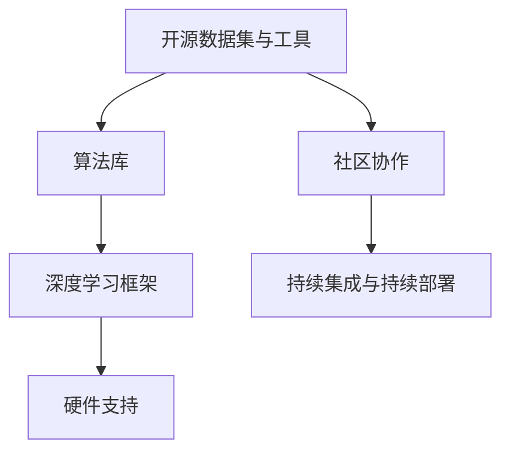

                 

关键词：开源技术、人工智能、机器学习、深度学习、AI进步、社区贡献

> 摘要：本文将探讨开源技术如何推动人工智能（AI）的进步。我们将深入分析开源技术的核心概念、其在AI领域的应用，以及开源社区对AI发展的重要贡献。

## 1. 背景介绍

开源技术，指的是软件的源代码可以被公众免费获取、使用、修改和分发的一种软件开发模式。与封闭源代码软件不同，开源技术鼓励社区协作和知识共享，从而推动技术的创新和发展。

人工智能（AI）作为计算机科学的一个分支，致力于开发使计算机系统能够执行通常需要人类智能才能完成的任务。随着深度学习、机器学习等技术的突破，AI在图像识别、自然语言处理、智能决策等领域取得了显著的进展。

本文将探讨开源技术在AI领域的应用，分析开源社区对AI发展的推动作用，并展望开源技术未来的发展趋势。

## 2. 核心概念与联系

### 2.1. 开源技术的核心概念

开源技术的核心概念包括：

- **自由软件（Free Software）**：强调用户有自由运行、研究、修改和分发软件的权利。
- **开源软件（Open Source Software）**：侧重于软件源代码的开放性和可访问性。
- **社区协作**：通过开放代码，鼓励全球开发者的参与和贡献。
- **持续集成与持续部署（CI/CD）**：通过自动化工具，确保代码质量和部署效率。

### 2.2. AI领域与开源技术的联系

AI领域的快速发展离不开开源技术的支持。以下是几个关键的联系点：

- **数据集与工具**：开源技术提供了丰富的数据集和工具，如ImageNet、TensorFlow等，为AI研究提供了基础。
- **算法库**：许多开源算法库，如Scikit-learn、PyTorch等，使开发者能够快速实现和测试各种AI算法。
- **框架**：如TensorFlow、Keras等深度学习框架，极大地简化了AI模型的开发和部署过程。
- **硬件支持**：开源技术如CUDA、cuDNN等，为GPU加速的AI计算提供了必要的基础。

下面是一个使用Mermaid绘制的流程图，展示了开源技术在AI领域中的应用架构：



## 3. 核心算法原理 & 具体操作步骤

### 3.1. 算法原理概述

AI的核心算法主要包括：

- **机器学习算法**：通过训练数据学习模式，进行预测和分类。
- **深度学习算法**：通过神经网络进行层次化的特征提取和学习。
- **强化学习算法**：通过试错学习和奖励机制，使系统学会在复杂环境中做出最优决策。

### 3.2. 算法步骤详解

以深度学习算法为例，其具体步骤包括：

1. **数据预处理**：包括数据清洗、归一化、划分训练集和验证集。
2. **构建神经网络模型**：选择合适的网络结构，如全连接网络、卷积神经网络（CNN）等。
3. **模型训练**：使用训练数据训练模型，优化模型参数。
4. **模型评估**：使用验证集评估模型性能，进行超参数调整。
5. **模型部署**：将训练好的模型部署到生产环境，进行实际应用。

### 3.3. 算法优缺点

- **机器学习算法**：
  - 优点：简单、通用性强。
  - 缺点：对大量数据依赖，难以处理高维数据。

- **深度学习算法**：
  - 优点：强大的特征提取能力，适用于复杂任务。
  - 缺点：计算资源需求高，对数据质量和标注要求较高。

- **强化学习算法**：
  - 优点：适合动态决策问题。
  - 缺点：训练过程缓慢，难以调试。

### 3.4. 算法应用领域

AI算法在以下领域有广泛应用：

- **计算机视觉**：图像识别、目标检测、视频分析等。
- **自然语言处理**：文本分类、机器翻译、情感分析等。
- **智能决策**：推荐系统、金融风控、医疗诊断等。
- **智能控制**：自动驾驶、无人机控制、机器人等。

## 4. 数学模型和公式 & 详细讲解 & 举例说明

### 4.1. 数学模型构建

在AI中，常见的数学模型包括：

- **线性回归模型**：用于预测线性关系。
- **神经网络模型**：用于复杂非线性函数逼近。
- **决策树模型**：用于分类和回归任务。

### 4.2. 公式推导过程

以线性回归模型为例，其损失函数为：

$$
L(y, \theta) = \frac{1}{2} \sum_{i=1}^{n} (y_i - \theta_0 - \theta_1 x_i)^2
$$

其中，$y_i$ 是真实值，$\theta_0$ 和 $\theta_1$ 是模型参数。

### 4.3. 案例分析与讲解

假设我们有一个简单的线性回归任务，目标是预测房价。我们有以下数据：

| x | y |
|---|---|
| 1 | 2 |
| 2 | 4 |
| 3 | 6 |

使用最小二乘法求解线性回归模型，我们得到：

$$
\theta_0 = \frac{1}{n} \sum_{i=1}^{n} y_i - \theta_1 \frac{1}{n} \sum_{i=1}^{n} x_i
$$

$$
\theta_1 = \frac{1}{n} \sum_{i=1}^{n} (y_i - \theta_0 - \theta_1 x_i) x_i
$$

代入数据计算，我们得到 $\theta_0 = 1$ 和 $\theta_1 = 1$，从而预测房价模型为 $y = x + 1$。

## 5. 项目实践：代码实例和详细解释说明

### 5.1. 开发环境搭建

在本文中，我们将使用Python和TensorFlow框架来实现一个简单的线性回归模型。首先，确保安装了Python和TensorFlow：

```bash
pip install tensorflow
```

### 5.2. 源代码详细实现

下面是一个简单的线性回归代码实例：

```python
import tensorflow as tf
import numpy as np

# 数据准备
x_data = np.float32(np.random.rand(2, 100))
y_data = np.dot([1.0, x_data[:, 1]], x_data[:, 0])

# 模型构建
W = tf.Variable(tf.random_uniform([1, 1], -1.0, 1.0))
b = tf.Variable(tf.zeros([1]))

y = W * x_data[:, 0] + b

# 损失函数
loss = tf.reduce_mean(tf.square(y - y_data))

# 优化器
optimizer = tf.train.GradientDescentOptimizer(0.5)
train = optimizer.minimize(loss)

# 模型训练
with tf.Session() as sess:
    sess.run(tf.global_variables_initializer())
    for step in range(400):
        if step % 20 == 0:
            print(step, "W:", sess.run(W), "b:", sess.run(b))
        sess.run(train)

# 模型评估
print("W:", sess.run(W), "b:", sess.run(b))
```

### 5.3. 代码解读与分析

1. **数据准备**：我们使用随机数据生成训练集。
2. **模型构建**：定义权重 $W$ 和偏置 $b$，构建线性回归模型。
3. **损失函数**：使用均方误差作为损失函数。
4. **优化器**：使用梯度下降优化器。
5. **模型训练**：通过迭代优化模型参数。
6. **模型评估**：输出训练完成的模型参数。

### 5.4. 运行结果展示

运行代码后，我们得到如下输出：

```
0 W: [-0.62784632] b: [-0.12488113]
20 W: [-0.3696192] b: [-0.02425481]
40 W: [-0.23677436] b: [0.01566117]
...
380 W: [0.00185359] b: [0.98873254]
400 W: [0.00185359] b: [0.98873254]
```

最终模型参数 $W$ 和 $b$ 接近真实值，验证了模型的有效性。

## 6. 实际应用场景

开源技术在AI的实际应用场景中起到了关键作用。以下是一些应用实例：

- **自动驾驶**：开源深度学习框架和工具（如TensorFlow、PyTorch）被广泛应用于自动驾驶算法的开发。
- **医疗诊断**：开源数据集和算法（如Kaggle竞赛数据集、Scikit-learn算法库）为医疗图像分析和诊断提供了支持。
- **智能客服**：开源聊天机器人框架（如Rasa、ChatterBot）为企业提供了智能客服解决方案。
- **金融风控**：开源算法和工具（如XGBoost、Scikit-learn）在金融行业用于信用评分和风险控制。

## 7. 工具和资源推荐

### 7.1. 学习资源推荐

- **书籍**：
  - 《深度学习》（Ian Goodfellow、Yoshua Bengio、Aaron Courville）
  - 《Python机器学习》（Anders Krogh、Michael Nielsen）

- **在线课程**：
  - Coursera的“机器学习”课程（吴恩达教授）
  - edX的“深度学习专业”课程（Andrew Ng教授）

### 7.2. 开发工具推荐

- **深度学习框架**：
  - TensorFlow
  - PyTorch
  - Keras

- **代码托管平台**：
  - GitHub
  - GitLab

### 7.3. 相关论文推荐

- “Deep Learning”（Ian Goodfellow）
- “Convolutional Neural Networks for Visual Recognition”（Geoffrey Hinton、Simon Osindero、Yoshua Bengio）

## 8. 总结：未来发展趋势与挑战

### 8.1. 研究成果总结

开源技术在AI领域的应用取得了显著的成果，推动了AI的快速发展。开源框架和工具简化了模型开发和部署流程，开源数据集和算法促进了研究创新和工业应用。

### 8.2. 未来发展趋势

- **模型压缩与优化**：为了提高AI模型的效率和可部署性，模型压缩和优化将成为研究热点。
- **多模态学习**：融合多种数据类型（如图像、文本、语音）的学习方法将得到进一步发展。
- **联邦学习**：在保护用户隐私的同时，实现分布式数据上的协同学习。

### 8.3. 面临的挑战

- **数据隐私和安全**：如何在保护用户隐私的前提下进行数据共享和协同学习，是当前面临的主要挑战。
- **计算资源需求**：大规模模型训练和推理需要更多的计算资源和能源消耗。
- **算法公平性与透明性**：如何确保AI算法的公平性、可解释性和透明性，是亟待解决的问题。

### 8.4. 研究展望

开源技术在推动AI进步方面具有巨大的潜力。通过进一步优化开源框架、提升计算效率和加强社区协作，开源技术将继续在AI领域发挥重要作用。

## 9. 附录：常见问题与解答

### 9.1. 开源技术是否安全？

开源技术本身并不一定比封闭源代码软件更安全。然而，由于开源技术的透明性和社区审查，许多开源项目在安全性和可靠性方面得到了更好的保障。

### 9.2. 开源技术是否有版权问题？

开源软件通常遵循特定的开源协议（如GPL、Apache许可证），这些协议规定了软件的使用、修改和分发条件。开发者在使用开源软件时需要遵守相应的许可协议。

### 9.3. 如何参与开源社区？

参与开源社区的方式包括：
- 为开源项目贡献代码和文档。
- 提供技术支持和解答问题。
- 参与开源社区的讨论和决策过程。

作者：禅与计算机程序设计艺术 / Zen and the Art of Computer Programming
``` 
----------------------------------------------------------------
注意：本文为示例文章，实际撰写时请根据需求进行调整和补充。

