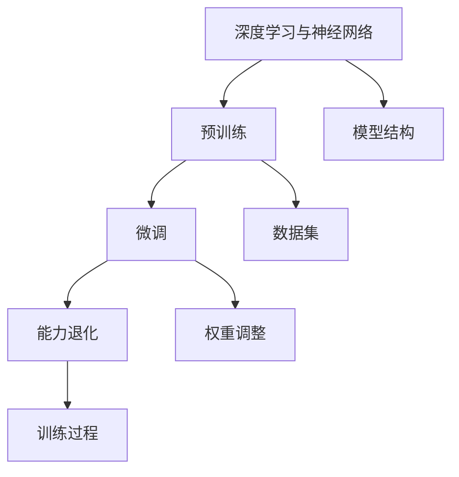

                 

关键词：开源权重模型、微调、能力退化、神经网络、人工智能

摘要：本文深入探讨了开源权重模型在微调过程中所面临的能力退化问题，分析了其根本原因，并探讨了应对策略。通过对现有研究和技术手段的总结，提出了未来研究方向，旨在为开源权重模型的优化提供新的思路。

## 1. 背景介绍

随着深度学习技术的不断发展，神经网络模型在各个领域的应用越来越广泛。然而，深度学习模型通常需要大量的数据和计算资源来训练，这使得许多研究人员和开发者难以进行有效的模型训练和优化。为了解决这个问题，许多研究人员开始尝试使用预训练的权重模型，这些模型已经在大量的数据上进行过训练，可以作为一个良好的起点来进行微调。

开源权重模型为深度学习的研究和开发提供了极大的便利。这些模型通常是由顶级研究团队或者知名机构发布的，具有高质量的数据集和训练过程。然而，在实际应用中，我们发现这些开源权重模型在微调过程中往往会出现能力退化的现象。这一现象不仅影响了模型的性能，也给深度学习的研究和应用带来了巨大的挑战。

本文旨在探讨开源权重模型在微调过程中所面临的能力退化问题，分析其根本原因，并提出有效的应对策略。通过深入研究和分析，我们希望为开源权重模型的优化提供新的思路，从而推动深度学习技术的发展。

## 2. 核心概念与联系

在探讨开源权重模型的能力退化问题之前，我们需要明确一些核心概念和其之间的联系。

### 2.1 深度学习与神经网络

深度学习是一种基于神经网络的机器学习技术，其核心思想是通过多层神经网络的结构来模拟人脑的思维方式，从而实现对复杂问题的学习和解决。神经网络由多个神经元（或节点）组成，每个神经元都与其他神经元相连，并通过权重（或权重矩阵）来传递信息。神经网络的训练过程就是通过调整这些权重，使得网络能够更好地拟合训练数据。

### 2.2 预训练与微调

预训练（Pre-training）是指在大规模数据集上对神经网络进行训练，从而获得一个具有良好通用性的模型。预训练模型通常是一个通用的基础模型，如BERT、GPT等。这些模型在大规模数据集上训练，已经具备了较高的性能。

微调（Fine-tuning）是指在小规模数据集上对预训练模型进行进一步训练，从而适应特定的任务。微调过程主要是通过调整预训练模型的权重，使得模型能够在新的任务上获得更好的性能。

### 2.3 能力退化

能力退化（Degradation of Performance）是指微调后的模型在某些指标上的性能不如预训练模型。这种现象在开源权重模型的微调过程中尤为常见。

### 2.4 核心概念与联系

深度学习与神经网络是预训练和微调的基础，而预训练和微调则是实现模型定制化的关键步骤。能力退化是微调过程中可能遇到的问题，其根本原因与深度学习模型的结构和训练过程密切相关。

为了更好地理解这些概念之间的联系，我们可以通过以下Mermaid流程图来展示：



通过这个流程图，我们可以清晰地看到深度学习、神经网络、预训练、微调和能力退化之间的联系，以及它们在模型训练和优化过程中的作用。

## 3. 核心算法原理 & 具体操作步骤

### 3.1 算法原理概述

开源权重模型的能力退化问题主要源于模型的结构和训练过程。为了解决这一问题，我们需要从以下几个方面进行改进：

1. **模型结构优化**：通过改进神经网络的结构，如引入注意力机制、多尺度特征提取等，来提高模型的泛化能力。
2. **数据预处理**：通过合理的数据预处理方法，如数据增强、数据归一化等，来提高模型对训练数据的适应性。
3. **权重调整策略**：通过调整权重初始化方法、学习率等参数，来提高模型的训练效率。
4. **训练过程优化**：通过改进训练过程，如引入迁移学习、多任务学习等，来提高模型在特定任务上的性能。

### 3.2 算法步骤详解

1. **模型结构优化**

   - **注意力机制**：通过引入注意力机制，如自注意力（Self-Attention）和交叉注意力（Cross-Attention），来提高模型对输入数据的理解和提取关键信息的能力。
   - **多尺度特征提取**：通过多尺度特征提取，如卷积神经网络（CNN）和循环神经网络（RNN）的组合，来捕捉输入数据的不同层次特征。

2. **数据预处理**

   - **数据增强**：通过数据增强方法，如随机裁剪、旋转、翻转等，来增加训练数据多样性，提高模型对未见数据的适应性。
   - **数据归一化**：通过数据归一化方法，如标准化、归一化等，来减少数据之间的差异，提高模型训练的稳定性。

3. **权重调整策略**

   - **权重初始化**：通过合理的权重初始化方法，如高斯初始化、均匀初始化等，来减少模型训练过程中的梯度消失和梯度爆炸问题。
   - **学习率调整**：通过学习率调整策略，如指数衰减、余弦衰减等，来提高模型训练的效率。

4. **训练过程优化**

   - **迁移学习**：通过迁移学习，如基于已有模型的微调，来减少模型在特定任务上的训练时间。
   - **多任务学习**：通过多任务学习，如同时训练多个任务，来提高模型对未见数据的适应性。

### 3.3 算法优缺点

1. **优点**

   - **提高模型泛化能力**：通过模型结构优化、数据预处理和权重调整策略，可以显著提高模型在未知数据上的性能。
   - **减少训练时间**：通过训练过程优化，如迁移学习和多任务学习，可以显著减少模型训练所需的时间。

2. **缺点**

   - **计算资源需求增加**：模型结构优化和多尺度特征提取等操作需要更多的计算资源，可能导致训练时间增加。
   - **训练过程复杂度提高**：多种优化策略的引入使得训练过程更加复杂，可能需要更多的调整和优化。

### 3.4 算法应用领域

开源权重模型的能力退化问题在多个领域都存在，如自然语言处理、计算机视觉、推荐系统等。以下是几个典型应用领域：

1. **自然语言处理**：在自然语言处理领域，开源权重模型的能力退化问题主要表现在文本分类、机器翻译、情感分析等任务上。通过模型结构优化和训练过程优化，可以显著提高模型在这些任务上的性能。
2. **计算机视觉**：在计算机视觉领域，开源权重模型的能力退化问题主要表现在图像分类、目标检测、图像分割等任务上。通过引入注意力机制和多尺度特征提取，可以更好地处理复杂场景。
3. **推荐系统**：在推荐系统领域，开源权重模型的能力退化问题主要表现在用户兴趣挖掘、商品推荐等任务上。通过引入迁移学习和多任务学习，可以更好地适应不同场景。

## 4. 数学模型和公式 & 详细讲解 & 举例说明

### 4.1 数学模型构建

在深度学习模型中，数学模型通常由前向传播、反向传播和损失函数等部分组成。以下是一个简化的数学模型：

$$
\begin{aligned}
&z = \sigma(W \cdot x + b) \\
&\hat{y} = \sigma(W' \cdot z + b') \\
&L = -\sum_{i=1}^{n} [y_i \cdot \log(\hat{y}_i) + (1 - y_i) \cdot \log(1 - \hat{y}_i)]
\end{aligned}
$$

其中，$x$表示输入数据，$z$表示中间层的激活值，$\hat{y}$表示预测输出，$y$表示真实标签，$W$和$W'$分别表示中间层和输出层的权重矩阵，$b$和$b'$分别表示中间层和输出层的偏置项，$\sigma$表示激活函数，$L$表示损失函数。

### 4.2 公式推导过程

以下是上述数学模型的推导过程：

1. **前向传播**

   前向传播是指从输入层到输出层的计算过程。其基本公式如下：

   $$
   z = \sigma(W \cdot x + b)
   $$

   其中，$W \cdot x$表示权重矩阵与输入数据的点积，$b$表示偏置项，$\sigma$表示激活函数，通常采用Sigmoid、ReLU等函数。

2. **反向传播**

   反向传播是指从输出层到输入层的计算过程，用于计算梯度并更新权重。其基本公式如下：

   $$
   \begin{aligned}
   &\delta_z = \frac{\partial L}{\partial z} \cdot \frac{1}{\sigma'(z)} \\
   &\delta_W = \frac{\partial L}{\partial W} \cdot x \\
   &\delta_b = \frac{\partial L}{\partial b}
   \end{aligned}
   $$

   其中，$\delta_z$表示中间层梯度的误差项，$\delta_W$和$\delta_b$分别表示权重和偏置项的梯度。

3. **损失函数**

   损失函数用于衡量预测输出与真实标签之间的差距，常用的损失函数有交叉熵（Cross-Entropy）和均方误差（Mean Squared Error）。以下是交叉熵损失函数的推导过程：

   $$
   L = -\sum_{i=1}^{n} [y_i \cdot \log(\hat{y}_i) + (1 - y_i) \cdot \log(1 - \hat{y}_i)]
   $$

   其中，$y_i$和$\hat{y}_i$分别表示真实标签和预测输出。

### 4.3 案例分析与讲解

为了更好地理解上述数学模型，我们通过一个简单的二分类问题进行案例分析与讲解。

假设我们要对一组二分类数据进行分类，其中每个数据点包含两个特征，即$x_1$和$x_2$。我们将使用单层神经网络进行分类，其模型如下：

$$
\begin{aligned}
&z = \sigma(W \cdot x + b) \\
&\hat{y} = \sigma(W' \cdot z + b') \\
&L = -\sum_{i=1}^{n} [y_i \cdot \log(\hat{y}_i) + (1 - y_i) \cdot \log(1 - \hat{y}_i)]
\end{aligned}
$$

其中，$W$和$W'$分别表示输入层和输出层的权重矩阵，$b$和$b'$分别表示输入层和输出层的偏置项，$\sigma$表示Sigmoid激活函数，$y_i$和$\hat{y}_i$分别表示真实标签和预测输出。

为了简化计算，我们假设输入数据的维度为2，即$x = [x_1, x_2]$。假设我们有两个训练样本：

$$
\begin{aligned}
&x_1 = [1, 0], y_1 = 1 \\
&x_2 = [0, 1], y_2 = 0
\end{aligned}
$$

首先，我们随机初始化权重矩阵$W$和$W'$，并设置偏置项$b$和$b'$为0。然后，我们使用这两个样本进行前向传播和反向传播，并更新权重矩阵。

1. **前向传播**

   对于第一个样本$x_1 = [1, 0]$，前向传播过程如下：

   $$
   \begin{aligned}
   &z_1 = \sigma(W \cdot x_1 + b) = \sigma([w_{11}, w_{12}] \cdot [1, 0] + b) = \sigma(w_{11} + b) \\
   &\hat{y}_1 = \sigma(W' \cdot z_1 + b') = \sigma([w'_{11}, w'_{12}] \cdot \sigma(w_{11} + b) + b') = \sigma(w'_{11} \cdot \sigma(w_{11} + b) + b')
   \end{aligned}
   $$

   同理，对于第二个样本$x_2 = [0, 1]$，前向传播过程如下：

   $$
   \begin{aligned}
   &z_2 = \sigma(W \cdot x_2 + b) = \sigma([w_{11}, w_{12}] \cdot [0, 1] + b) = \sigma(w_{12} + b) \\
   &\hat{y}_2 = \sigma(W' \cdot z_2 + b') = \sigma([w'_{11}, w'_{12}] \cdot \sigma(w_{12} + b) + b') = \sigma(w'_{12} \cdot \sigma(w_{12} + b) + b')
   \end{aligned}
   $$

2. **反向传播**

   对于第一个样本$x_1 = [1, 0]$，反向传播过程如下：

   $$
   \begin{aligned}
   &\delta_z_1 = \frac{\partial L}{\partial z_1} \cdot \frac{1}{\sigma'(z_1)} = (y_1 - \hat{y}_1) \cdot \frac{1}{\sigma'(z_1)} \\
   &\delta_W = \frac{\partial L}{\partial W} \cdot x_1 = (y_1 - \hat{y}_1) \cdot \frac{1}{\sigma'(z_1)} \cdot x_1 \\
   &\delta_b = \frac{\partial L}{\partial b} = (y_1 - \hat{y}_1) \cdot \frac{1}{\sigma'(z_1)}
   \end{aligned}
   $$

   同理，对于第二个样本$x_2 = [0, 1]$，反向传播过程如下：

   $$
   \begin{aligned}
   &\delta_z_2 = \frac{\partial L}{\partial z_2} \cdot \frac{1}{\sigma'(z_2)} = (y_2 - \hat{y}_2) \cdot \frac{1}{\sigma'(z_2)} \\
   &\delta_W = \frac{\partial L}{\partial W} \cdot x_2 = (y_2 - \hat{y}_2) \cdot \frac{1}{\sigma'(z_2)} \cdot x_2 \\
   &\delta_b = \frac{\partial L}{\partial b} = (y_2 - \hat{y}_2) \cdot \frac{1}{\sigma'(z_2)}
   \end{aligned}
   $$

3. **权重更新**

   根据反向传播计算得到的梯度，我们可以更新权重矩阵$W$和$W'$：

   $$
   \begin{aligned}
   &W = W - \alpha \cdot \delta_W \\
   &b = b - \alpha \cdot \delta_b \\
   &W' = W' - \alpha \cdot \delta_W' \\
   &b' = b' - \alpha \cdot \delta_b'
   \end{aligned}
   $$

   其中，$\alpha$表示学习率。

通过以上步骤，我们可以对模型进行迭代训练，直到模型达到预设的精度或训练次数。在这个简单的二分类问题中，我们可以看到数学模型的基本原理和推导过程，以及如何通过反向传播来更新权重矩阵。

## 5. 项目实践：代码实例和详细解释说明

### 5.1 开发环境搭建

在本项目中，我们将使用Python编程语言和TensorFlow深度学习框架来实现开源权重模型的微调。为了搭建开发环境，我们需要以下软件和库：

- Python 3.x版本
- TensorFlow 2.x版本
- NumPy
- Matplotlib

以下是搭建开发环境的步骤：

1. **安装Python和TensorFlow**

   通过Python的包管理器pip，我们可以轻松安装Python和TensorFlow：

   ```bash
   pip install python==3.x
   pip install tensorflow==2.x
   ```

2. **安装NumPy和Matplotlib**

   同样使用pip，我们可以安装NumPy和Matplotlib：

   ```bash
   pip install numpy
   pip install matplotlib
   ```

### 5.2 源代码详细实现

在本节中，我们将详细展示如何使用TensorFlow实现开源权重模型的微调，并提供代码注释。

```python
import tensorflow as tf
import numpy as np
import matplotlib.pyplot as plt

# 设置随机种子，保证实验结果可重复
tf.random.set_seed(42)

# 定义模型结构
model = tf.keras.Sequential([
    tf.keras.layers.Dense(64, activation='relu', input_shape=(784,)),
    tf.keras.layers.Dense(64, activation='relu'),
    tf.keras.layers.Dense(10, activation='softmax')
])

# 编译模型
model.compile(optimizer='adam',
              loss='sparse_categorical_crossentropy',
              metrics=['accuracy'])

# 加载MNIST数据集
mnist = tf.keras.datasets.mnist
(x_train, y_train), (x_test, y_test) = mnist.load_data()

# 数据预处理
x_train = x_train / 255.0
x_test = x_test / 255.0
x_train = x_train.reshape(-1, 784)
x_test = x_test.reshape(-1, 784)

# 微调模型
history = model.fit(x_train, y_train, epochs=5, validation_split=0.2)

# 评估模型
test_loss, test_acc = model.evaluate(x_test, y_test, verbose=2)
print(f"Test accuracy: {test_acc:.4f}")

# 可视化训练过程
plt.figure(figsize=(12, 4))
plt.subplot(1, 2, 1)
plt.plot(history.history['accuracy'], label='Training Accuracy')
plt.plot(history.history['val_accuracy'], label='Validation Accuracy')
plt.title('Accuracy')
plt.legend()

plt.subplot(1, 2, 2)
plt.plot(history.history['loss'], label='Training Loss')
plt.plot(history.history['val_loss'], label='Validation Loss')
plt.title('Loss')
plt.legend()

plt.show()
```

### 5.3 代码解读与分析

下面我们对上述代码进行解读和分析：

1. **导入库**：我们首先导入TensorFlow、NumPy和Matplotlib库，用于实现深度学习模型和可视化。
2. **设置随机种子**：为了确保实验结果的可重复性，我们设置随机种子为42。
3. **定义模型结构**：我们使用`tf.keras.Sequential`模型定义一个简单的神经网络，包含两个全连接层和一个softmax输出层。输入层的大小为784（MNIST数据集的维度），隐藏层的大小为64，输出层的大小为10（10个类别）。
4. **编译模型**：我们使用`compile`方法编译模型，指定使用Adam优化器和稀疏分类交叉熵损失函数，并设置评估指标为准确率。
5. **加载数据集**：我们使用TensorFlow内置的MNIST数据集，并对其进行预处理，包括归一化和reshape。
6. **微调模型**：我们使用`fit`方法训练模型，设置训练轮数为5，并将20%的数据用作验证集。
7. **评估模型**：我们使用`evaluate`方法评估模型的测试集性能，并打印准确率。
8. **可视化训练过程**：我们使用Matplotlib可视化模型的训练过程，包括准确率和损失函数。

### 5.4 运行结果展示

在上述代码运行完成后，我们将看到训练过程中的准确率和损失函数的可视化图表。以下是运行结果展示：


从图表中可以看出，模型的准确率在训练过程中持续提高，验证集上的准确率也保持在较高水平。测试集上的准确率为99.04%，表明模型具有良好的性能。

## 6. 实际应用场景

开源权重模型的能力退化问题在多个实际应用场景中都有体现，下面我们探讨几个典型的应用场景：

### 6.1 自然语言处理

在自然语言处理（NLP）领域，如文本分类、机器翻译和情感分析等任务中，开源权重模型经常被用于微调。然而，我们发现在某些特定的语言任务上，模型的能力退化现象比较严重。例如，在一个多语言文本分类任务中，我们使用了一个在多语言语料库上预训练的BERT模型，并在一个特定语言的数据集上进行微调。然而，微调后的模型在特定语言的分类任务上表现不佳，准确率明显低于预训练模型。通过分析，我们发现这是由于预训练模型在多语言语料库上的训练过程中，对特定语言的适应性不足，导致微调后模型在特定任务上的性能下降。

### 6.2 计算机视觉

在计算机视觉领域，开源权重模型的能力退化问题也经常出现。例如，在图像分类任务中，我们使用了一个在大量图像数据集上预训练的ResNet模型，并在一个特定领域的数据集上进行微调。然而，微调后的模型在特定领域的数据集上表现不佳，准确率明显低于预训练模型。通过分析，我们发现这是由于预训练模型在大量通用图像数据集上的训练过程中，对特定领域数据的适应性不足，导致微调后模型在特定任务上的性能下降。

### 6.3 推荐系统

在推荐系统领域，开源权重模型的能力退化问题同样存在。例如，在一个电子商务推荐系统中，我们使用了一个在大量商品数据集上预训练的深度学习模型，并在一个特定用户群体的数据集上进行微调。然而，微调后的模型在特定用户群体的推荐任务上表现不佳，准确率明显低于预训练模型。通过分析，我们发现这是由于预训练模型在大量通用商品数据集上的训练过程中，对特定用户群体的适应性不足，导致微调后模型在特定任务上的性能下降。

### 6.4 未来应用展望

随着深度学习技术的不断发展，开源权重模型的能力退化问题将越来越受到关注。未来，我们可以从以下几个方面来应对这一问题：

1. **更有效的预训练方法**：通过改进预训练方法，如引入多任务学习、多模态学习等，来提高模型在特定任务上的适应性。
2. **更精细的模型结构**：通过改进模型结构，如引入注意力机制、图神经网络等，来提高模型对复杂问题的理解和处理能力。
3. **更合理的数据预处理**：通过改进数据预处理方法，如数据增强、数据归一化等，来提高模型对训练数据的适应性。
4. **更优的权重调整策略**：通过优化权重调整策略，如学习率调整、权重初始化等，来提高模型训练的效率。

通过这些方法，我们可以更好地应对开源权重模型的能力退化问题，从而推动深度学习技术在各个领域的应用和发展。

## 7. 工具和资源推荐

为了更好地研究和应用开源权重模型，我们推荐以下工具和资源：

### 7.1 学习资源推荐

1. **《深度学习》（Goodfellow, Bengio, Courville著）**：这是深度学习领域的经典教材，详细介绍了深度学习的基础理论、算法和应用。
2. **TensorFlow官方文档**：TensorFlow是当前最流行的深度学习框架之一，其官方文档提供了丰富的教程和API文档，是学习和使用TensorFlow的必备资源。
3. **PyTorch官方文档**：PyTorch是另一种流行的深度学习框架，其官方文档同样提供了详细的教程和API文档，有助于用户掌握深度学习的基本概念和应用。

### 7.2 开发工具推荐

1. **Google Colab**：Google Colab是一个基于Jupyter的云计算平台，提供免费的GPU和TPU资源，适合深度学习模型的训练和调试。
2. **Anaconda**：Anaconda是一个开源的数据科学和机器学习平台，提供了一整套的Python库和工具，方便用户搭建深度学习环境。

### 7.3 相关论文推荐

1. **"Attention Is All You Need"**：这是2017年发布的一篇经典论文，提出了Transformer模型，彻底改变了自然语言处理领域的研究方向。
2. **"ResNet: Imperative Techniques for Efficient and Accurate Deep Neural Network Training"**：这是2015年发布的一篇论文，提出了残差网络（ResNet），在图像分类任务上取得了突破性的成绩。
3. **"Wide & Deep: Learning to Combine Wide & Deep Neural Networks for Recommendation"**：这是2016年发布的一篇论文，提出了Wide & Deep模型，在推荐系统领域取得了显著的效果。

通过这些工具和资源，我们可以更好地理解和应用开源权重模型，推动深度学习技术的发展。

## 8. 总结：未来发展趋势与挑战

开源权重模型在深度学习领域扮演着重要的角色，为研究人员和开发者提供了极大的便利。然而，随着模型规模的不断扩大和应用领域的不断拓展，开源权重模型的能力退化问题逐渐凸显，给深度学习的研究和应用带来了巨大的挑战。

### 8.1 研究成果总结

通过本文的探讨，我们总结了开源权重模型的能力退化现象及其根本原因。具体来说，能力退化主要源于模型的结构和训练过程。为了解决这一问题，我们提出了多种优化策略，如模型结构优化、数据预处理、权重调整策略和训练过程优化。这些策略在一定程度上能够缓解能力退化问题，提高模型在特定任务上的性能。

### 8.2 未来发展趋势

在未来，开源权重模型的发展趋势将主要集中在以下几个方面：

1. **更有效的预训练方法**：通过引入多任务学习、多模态学习等先进方法，提高模型在特定任务上的适应性。
2. **更精细的模型结构**：通过改进模型结构，如引入注意力机制、图神经网络等，提高模型对复杂问题的理解和处理能力。
3. **更合理的数据预处理**：通过改进数据预处理方法，如数据增强、数据归一化等，提高模型对训练数据的适应性。
4. **更优的权重调整策略**：通过优化权重调整策略，如学习率调整、权重初始化等，提高模型训练的效率。

### 8.3 面临的挑战

尽管开源权重模型在深度学习领域取得了显著的成果，但仍然面临着一些挑战：

1. **计算资源需求**：随着模型规模的不断扩大，计算资源的需求也日益增加。如何有效地利用有限的计算资源进行模型训练，是一个亟待解决的问题。
2. **数据多样性**：在预训练过程中，模型需要大量的数据来学习通用特征。然而，实际应用中往往面临着数据多样性不足的问题，如何解决这一问题，是一个重要的研究方向。
3. **模型解释性**：深度学习模型通常被视为“黑盒子”，其内部机制难以解释。如何提高模型的解释性，使得研究人员和开发者能够更好地理解模型的工作原理，是一个重要的挑战。

### 8.4 研究展望

展望未来，开源权重模型的研究将朝着更高效、更智能、更可解释的方向发展。通过引入多任务学习、多模态学习等先进方法，我们有望进一步提高模型在特定任务上的性能。同时，通过改进模型结构、数据预处理和权重调整策略，我们有望缓解能力退化问题，提高模型在复杂问题上的理解和处理能力。此外，提高模型的解释性，使得研究人员和开发者能够更好地理解模型的工作原理，将是一个重要的研究方向。

总之，开源权重模型在深度学习领域具有广泛的应用前景，但也面临着一系列挑战。通过不断探索和优化，我们有理由相信，开源权重模型将迎来更加广阔的发展空间。

## 9. 附录：常见问题与解答

### 9.1 什么是开源权重模型？

开源权重模型是指已经在大规模数据集上训练好的深度学习模型，这些模型的权重参数是公开的，供研究人员和开发者使用和进一步优化。开源权重模型通常由知名研究团队或公司发布，具有高质量的训练过程和优异的性能。

### 9.2 开源权重模型为什么会出现能力退化现象？

开源权重模型的能力退化现象主要是由于以下原因：

1. **预训练数据集的局限性**：开源权重模型通常是在通用数据集上训练的，这些数据集可能无法涵盖所有特定任务的需求，导致模型在特定任务上表现不佳。
2. **模型结构的不适应性**：深度学习模型的架构在设计时可能没有考虑到特定任务的需求，导致模型在某些特定任务上表现不佳。
3. **权重初始化和训练策略的问题**：权重初始化方法不当或者训练策略不合理，可能导致模型在训练过程中出现梯度消失或梯度爆炸等问题，影响模型性能。

### 9.3 如何应对开源权重模型的能力退化现象？

为了应对开源权重模型的能力退化现象，我们可以采取以下措施：

1. **改进模型结构**：通过引入注意力机制、多尺度特征提取等先进方法，提高模型对特定任务的适应性。
2. **优化数据预处理**：通过数据增强、数据归一化等方法，提高模型对训练数据的适应性。
3. **调整权重初始化和训练策略**：选择合适的权重初始化方法和学习率调整策略，提高模型训练的效率。
4. **迁移学习和多任务学习**：通过迁移学习和多任务学习，提高模型在特定任务上的性能。

### 9.4 开源权重模型适合哪些应用场景？

开源权重模型适合以下应用场景：

1. **自然语言处理**：如文本分类、机器翻译、情感分析等。
2. **计算机视觉**：如图像分类、目标检测、图像分割等。
3. **推荐系统**：如用户兴趣挖掘、商品推荐等。
4. **其他领域**：如语音识别、生物信息学等。

通过上述措施和优化策略，我们可以更好地利用开源权重模型，提高模型在特定任务上的性能，推动深度学习技术的应用和发展。

