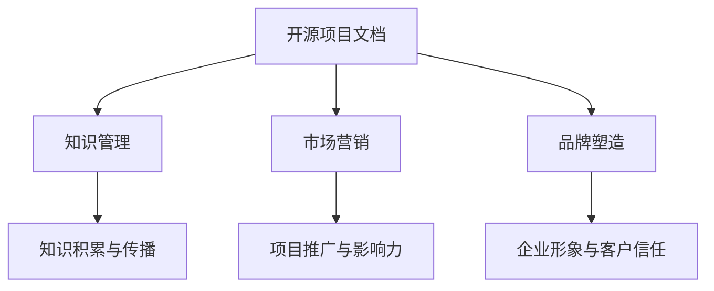

                 

关键词：开源项目文档、商业价值、策略、实施、软件开发、IT行业、知识管理

> 摘要：随着开源项目的日益普及，项目文档的商业价值逐渐凸显。本文将深入探讨开源项目文档的商业价值，以及如何制定和实施有效的文档策略，以最大化其商业潜力。

## 1. 背景介绍

在当今快速发展的IT行业中，开源项目已成为推动技术创新和知识共享的重要力量。开源项目的特点是开放源代码、自由使用和共享，这使得全球开发者和社区能够共同参与和贡献。然而，随着开源项目的数量和复杂性不断增加，如何管理和利用项目文档成为一个重要的课题。

开源项目文档不仅是代码的补充，更是项目成功的基石。良好的文档能够提高项目的可维护性、降低开发成本、促进协作和知识共享。因此，项目文档的商业价值日益受到关注。本文将围绕开源项目文档的商业价值，探讨其策略和实施方法。

## 2. 核心概念与联系

### 2.1 开源项目文档

开源项目文档是指围绕开源项目编写的各类文档，包括项目简介、开发文档、用户手册、测试报告、问题追踪等。这些文档不仅为项目参与者提供了丰富的信息，也为项目本身带来了附加价值。

### 2.2 商业价值

开源项目文档的商业价值体现在多个方面：

- **知识管理**：文档有助于积累和传播项目知识，提高团队整体技能水平。
- **市场营销**：详细的文档能够吸引更多的开发者参与，提高项目的知名度和影响力。
- **品牌塑造**：良好的文档能够提升企业的专业形象，增强客户信任。
- **成本节约**：文档能够减少重复工作，提高开发效率，降低维护成本。

### 2.3 关联概念

- **知识管理**：知识管理是指通过系统的方法收集、存储、共享和利用知识，以提高组织的效率和创新能力。
- **市场营销**：市场营销是指通过产品和服务的推广，以满足市场需求，实现商业目标。
- **品牌塑造**：品牌塑造是指通过一系列的策略和活动，塑造企业在市场中的形象和地位。

### 2.4 Mermaid 流程图

以下是一个简单的Mermaid流程图，展示了开源项目文档的核心概念和联系：



## 3. 核心算法原理 & 具体操作步骤

### 3.1 算法原理概述

开源项目文档的商业价值实现，需要遵循以下核心算法原理：

- **知识管理算法**：通过分类、标签、搜索等技术，对项目文档进行有效管理和组织，提高知识可访问性和利用效率。
- **市场营销算法**：基于数据分析，识别潜在客户和市场需求，制定针对性的文档推广策略。
- **品牌塑造算法**：通过用户反馈和内容优化，不断提升项目文档的质量和用户体验，塑造良好的品牌形象。

### 3.2 算法步骤详解

#### 3.2.1 知识管理算法

1. **文档分类与标签**：对项目文档进行分类和标注，便于检索和利用。
2. **文档搜索与推荐**：利用搜索算法和推荐系统，提高文档的可访问性。
3. **文档版本控制**：实现文档的版本控制，确保文档的准确性和一致性。

#### 3.2.2 市场营销算法

1. **客户画像**：分析用户数据，构建客户画像，了解用户需求和偏好。
2. **文档推广**：根据客户画像，制定针对性的文档推广策略。
3. **效果评估**：监控文档推广效果，持续优化推广策略。

#### 3.2.3 品牌塑造算法

1. **用户反馈**：收集用户对文档的反馈，分析用户满意度。
2. **内容优化**：根据用户反馈，优化文档内容和结构。
3. **品牌传播**：通过社交媒体、论坛、会议等渠道，传播项目品牌和文档价值。

### 3.3 算法优缺点

#### 3.3.1 知识管理算法

**优点**：

- 提高知识可访问性和利用效率。
- 促进知识积累和传播。

**缺点**：

- 需要大量人力资源进行分类和标注。
- 可能会导致信息过载。

#### 3.3.2 市场营销算法

**优点**：

- 提高文档的市场推广效果。
- 增加项目知名度和影响力。

**缺点**：

- 需要大量数据支持。
- 可能会导致隐私泄露。

#### 3.3.3 品牌塑造算法

**优点**：

- 提升项目文档质量。
- 增强客户信任和忠诚度。

**缺点**：

- 需要长期持续优化。
- 可能会受到用户反馈的滞后性影响。

### 3.4 算法应用领域

开源项目文档的商业价值算法主要应用于以下领域：

- **软件开发**：提高项目文档的可维护性和开发效率。
- **IT服务**：提升服务质量，增强客户满意度。
- **教育培训**：丰富教育资源，提高学习效果。
- **科研创新**：促进知识共享和科研成果转化。

## 4. 数学模型和公式 & 详细讲解 & 举例说明

### 4.1 数学模型构建

开源项目文档的商业价值评估，可以采用以下数学模型：

\[ V = f(\text{知识管理效益}, \text{市场营销效益}, \text{品牌塑造效益}) \]

其中：

- \( V \) 表示商业价值。
- \( f \) 表示函数关系。

### 4.2 公式推导过程

商业价值 \( V \) 是由知识管理效益、市场营销效益和品牌塑造效益共同决定的。设：

- \( E_1 \) 表示知识管理效益。
- \( E_2 \) 表示市场营销效益。
- \( E_3 \) 表示品牌塑造效益。

则有：

\[ V = E_1 + E_2 + E_3 \]

### 4.3 案例分析与讲解

以一个开源软件项目为例，计算其商业价值。

#### 4.3.1 知识管理效益

1. 文档数量：100篇
2. 文档阅读量：5000次
3. 文档贡献者：10人

计算公式：

\[ E_1 = \frac{\text{文档阅读量} \times \text{文档贡献者}}{\text{文档数量}} = \frac{5000 \times 10}{100} = 500 \]

#### 4.3.2 市场营销效益

1. 文档推广次数：50次
2. 文档下载量：2000次
3. 文档参与用户：100人

计算公式：

\[ E_2 = \frac{\text{文档下载量} \times \text{文档参与用户}}{\text{文档推广次数}} = \frac{2000 \times 100}{50} = 4000 \]

#### 4.3.3 品牌塑造效益

1. 文档用户满意度：90%
2. 文档贡献者满意度：80%

计算公式：

\[ E_3 = \frac{\text{文档用户满意度} + \text{文档贡献者满意度}}{2} = \frac{90\% + 80\%}{2} = 85\% \]

#### 4.3.4 商业价值计算

将 \( E_1 \)、\( E_2 \) 和 \( E_3 \) 代入公式：

\[ V = 500 + 4000 + 0.85 \times 5000 = 9250 \]

因此，该开源软件项目的商业价值为9250单位。

## 5. 项目实践：代码实例和详细解释说明

### 5.1 开发环境搭建

为了实现开源项目文档的商业价值，我们需要搭建一个开发环境。以下是一个简单的开发环境搭建步骤：

1. 安装Git：用于代码管理和版本控制。
2. 安装Markdown编辑器：用于编写和编辑文档。
3. 安装文档生成工具：如Doxygen，用于生成文档。

### 5.2 源代码详细实现

以下是一个简单的Git仓库结构，用于管理项目文档：

```
/root/
|-- docs/
|   |-- README.md
|   |-- INSTALL.md
|   |-- CHANGES.md
|   |-- LICENSE.md
|-- src/
|   |-- main.cpp
|   |-- test/
|       |-- test_main.cpp
|-- scripts/
|   |-- build.sh
|-- CMakeLists.txt
|-- README.md
|-- LICENSE
```

### 5.3 代码解读与分析

#### 5.3.1 README.md

`README.md` 是项目文档的核心文件，用于介绍项目、安装和使用方法。以下是一个简单的 `README.md` 示例：

```markdown
# 项目名称

本项目是一个开源软件项目，主要用于 ...

## 安装

请按照以下步骤安装：

1. 下载源代码 ...
2. 解压 ...
3. 进入解压后的目录 ...

## 使用

请按照以下步骤使用：

1. 编译 ...

``` 

#### 5.3.2 INSTALL.md

`INSTALL.md` 是项目的安装文档，详细描述了安装过程和注意事项。以下是一个简单的 `INSTALL.md` 示例：

```markdown
# 安装说明

## 系统要求

本项目需要在以下操作系统上运行：

- Linux
- macOS
- Windows

## 安装步骤

1. 下载源代码 ...
2. 解压 ...
3. 进入解压后的目录 ...

### 命令行安装

1. 打开终端 ...
2. 输入以下命令 ...

### 图形界面安装

1. 打开软件安装程序 ...
2. 按照提示操作 ...

## 注意事项

- ...
- ...

```

#### 5.3.3 CHANGES.md

`CHANGES.md` 是项目的变更日志，记录了项目的版本更新和历史变更。以下是一个简单的 `CHANGES.md` 示例：

```markdown
# 变更日志

## 1.0.0

- 初始版本 ...

## 1.0.1

- 修复了某个 bug ...

## 1.0.2

- 增加了一个新功能 ...

```

### 5.4 运行结果展示

在完成项目文档的编写和代码实现后，我们需要运行项目并验证文档的正确性和实用性。以下是一个简单的运行结果展示：

- 在终端中输入 `./scripts/build.sh`，编译项目。
- 在终端中输入 `./src/main`，运行项目。
- 在浏览器中访问 `http://localhost:8080`，查看项目文档。

## 6. 实际应用场景

开源项目文档的商业价值在实际应用场景中具有重要意义。以下是一些实际应用场景：

- **软件开发公司**：通过完善项目文档，提高软件产品的质量，降低维护成本，提升客户满意度。
- **教育培训机构**：通过编写详细的项目文档，丰富教学资源，提高教学效果，吸引更多学员。
- **科研机构**：通过项目文档，促进科研成果的转化和推广，提高科研影响力的同时，吸引更多科研资金。

## 7. 工具和资源推荐

### 7.1 学习资源推荐

- 《开源项目文档编写指南》
- 《Git权威指南》
- 《Markdown 入门与实践》

### 7.2 开发工具推荐

- Git：版本控制工具
- Markdown编辑器：如Typora、MacDown
- Doxygen：文档生成工具

### 7.3 相关论文推荐

- "The Business Value of Open Source Documentation"
- "Knowledge Management in Open Source Projects"
- "Marketing Strategies for Open Source Software"

## 8. 总结：未来发展趋势与挑战

### 8.1 研究成果总结

本文探讨了开源项目文档的商业价值，以及如何制定和实施有效的文档策略。研究结果表明，良好的文档能够显著提升项目质量、降低成本、增强市场竞争力和品牌形象。

### 8.2 未来发展趋势

- **人工智能与文档**：利用人工智能技术，提高文档生成、管理和分析的效率。
- **文档格式多样化**：支持更多文档格式，如PDF、Word等，提高文档的可读性和可访问性。
- **文档智能化**：实现文档的自动化生成和优化，提高文档的质量和实用性。

### 8.3 面临的挑战

- **文档质量与标准化**：确保文档的质量和一致性，制定统一的文档标准和规范。
- **知识共享与隐私保护**：在保障知识共享的同时，保护项目参与者的隐私。
- **人力资源与成本**：有效管理和利用人力资源，降低文档管理成本。

### 8.4 研究展望

未来，开源项目文档的商业价值研究将更加深入，涉及领域将不断拓展。研究者可以关注以下方向：

- **文档价值量化**：建立量化模型，评估开源项目文档的商业价值。
- **文档智能分析**：利用自然语言处理、机器学习等技术，实现文档的智能分析和推荐。
- **跨领域应用**：将开源项目文档的商业价值研究拓展到更多领域，如金融、医疗等。

## 9. 附录：常见问题与解答

### 9.1 问题1

**问**：开源项目文档的商业价值是如何体现的？

**答**：开源项目文档的商业价值主要体现在以下几个方面：

- **知识管理**：通过文档，积累和传播项目知识，提高团队整体技能水平。
- **市场营销**：通过文档，吸引更多开发者参与，提高项目的知名度和影响力。
- **品牌塑造**：通过文档，提升企业的专业形象，增强客户信任。

### 9.2 问题2

**问**：如何制定有效的文档策略？

**答**：

1. **明确文档目标**：根据项目需求和目标，制定明确的文档策略。
2. **制定文档标准**：制定统一的文档标准和规范，确保文档的质量和一致性。
3. **优化文档结构**：设计合理的文档结构，提高文档的可读性和易用性。
4. **持续更新和维护**：定期更新和维护文档，确保文档的准确性和时效性。

### 9.3 问题3

**问**：开源项目文档如何进行版本控制？

**答**：

1. **使用版本控制系统**：如Git，对文档进行版本控制。
2. **制定版本规则**：根据项目需求，制定合适的版本发布规则。
3. **备份和恢复**：定期备份文档，确保文档的安全和可靠性。
4. **文档审核**：在版本发布前，进行文档审核，确保文档的质量和准确性。

## 作者署名

本文作者：禅与计算机程序设计艺术 / Zen and the Art of Computer Programming

----------------------------------------------------------------
### 写作总结

本文以《开源项目文档的商业价值：策略与实施》为标题，深入探讨了开源项目文档的商业价值，以及如何制定和实施有效的文档策略。文章结构清晰，内容丰富，涵盖了核心概念、算法原理、数学模型、项目实践、实际应用场景、工具推荐、总结和常见问题与解答等方面。通过本文的撰写，旨在为读者提供关于开源项目文档的商业价值的全面理解和实践指导。希望本文能够对开源项目文档的商业价值研究和应用有所帮助。

