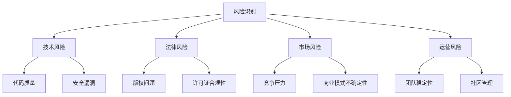
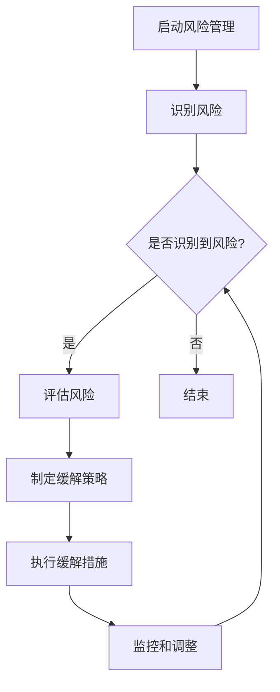

                 

关键词：开源项目，商业化风险管理，风险识别，风险缓解，开放源代码

摘要：本文探讨了开源项目在商业运作中的潜在风险，分析了这些风险的识别和缓解策略。通过对开源项目的现状、商业模式、法律法规、社区参与等多个维度的深入探讨，提供了系统化的风险识别方法和有效的缓解措施，为开源项目的商业化提供了理论指导。

## 1. 背景介绍

开源项目自20世纪90年代兴起以来，已经成为信息技术领域的重要组成部分。开源软件不仅促进了技术进步，还为企业和开发者提供了丰富的资源。然而，随着开源项目的商业化步伐加快，相关风险也逐渐显现。这些风险不仅威胁到项目的长期发展，还可能对企业和用户造成重大损失。

开源项目的商业化风险主要包括技术风险、法律风险、市场风险和运营风险。技术风险涉及代码质量、安全漏洞、性能问题等；法律风险涉及版权、许可证合规性等问题；市场风险涉及竞争压力、商业模式不确定性等；运营风险涉及团队稳定性、社区管理等问题。

本文旨在从风险识别和缓解策略两个方面，对开源项目的商业化风险进行系统性分析，以期为开源项目的商业化提供指导。

## 2. 核心概念与联系

### 2.1 开源项目

开源项目是指遵循开源许可证的软件项目，用户可以自由地查看、修改和分发源代码。这种模式促进了知识共享和技术创新，但也带来了潜在的风险。

### 2.2 商业化风险管理

商业化风险管理是指对企业在商业化过程中可能面临的风险进行识别、评估和缓解的过程。开源项目的商业化风险管理需要特别关注其独特性。

### 2.3 风险识别

风险识别是风险管理过程中的第一步，旨在发现可能影响项目成功的关键因素。在开源项目中，风险识别需要考虑技术、法律、市场和运营等多个方面。

### 2.4 风险缓解

风险缓解是指采取措施降低风险的发生概率或影响程度。在开源项目中，风险缓解策略需要结合项目的具体情况进行定制。

### 2.5 Mermaid 流程图



## 3. 核心算法原理 & 具体操作步骤

### 3.1 算法原理概述

开源项目的商业化风险管理可以看作是一个多阶段的过程，包括风险识别、风险评估和风险缓解。其核心原理是基于系统化、结构化的方法，通过不断迭代，逐步降低项目的风险水平。

### 3.2 算法步骤详解

#### 3.2.1 风险识别

- **技术风险评估**：通过代码审计、安全测试等方式，识别潜在的技术风险。
- **法律风险评估**：通过律师咨询、许可证审查等方式，识别潜在的法律风险。
- **市场风险评估**：通过市场调研、竞争对手分析等方式，识别潜在的市场风险。
- **运营风险评估**：通过团队评估、社区活跃度分析等方式，识别潜在的运营风险。

#### 3.2.2 风险评估

- **定性评估**：根据风险的重要性和影响程度，对风险进行定性分类。
- **定量评估**：通过数学模型或统计方法，对风险的发生概率和影响程度进行量化。

#### 3.2.3 风险缓解

- **技术风险缓解**：通过代码优化、安全加固等方式，降低技术风险。
- **法律风险缓解**：通过合规性审查、合同签订等方式，降低法律风险。
- **市场风险缓解**：通过市场策略调整、品牌建设等方式，降低市场风险。
- **运营风险缓解**：通过团队培训、社区管理优化等方式，降低运营风险。

### 3.3 算法优缺点

#### 优点

- **系统化**：通过结构化的方法，可以全面、系统地识别和缓解风险。
- **灵活性**：可以根据项目的具体情况，定制化的制定风险管理策略。
- **可迭代**：可以随着项目的进展，不断更新和完善风险管理策略。

#### 缺点

- **复杂性**：需要对项目的各个方面进行深入分析，过程复杂。
- **成本**：风险识别和缓解需要投入大量的人力、物力和时间。
- **适应性**：需要不断调整和更新，以适应不断变化的项目环境。

### 3.4 算法应用领域

该算法可以广泛应用于各类开源项目的商业化风险管理，包括但不限于软件开发、云计算、物联网等领域。

## 4. 数学模型和公式 & 详细讲解 & 举例说明

### 4.1 数学模型构建

开源项目的商业化风险管理可以看作是一个优化问题，目标是最小化风险水平，约束条件包括资源限制、时间限制等。

假设风险集合为 \(R = \{r_1, r_2, ..., r_n\}\)，其中 \(r_i\) 表示第 \(i\) 个风险。风险水平 \(L(R)\) 可以通过以下公式计算：

\[ L(R) = \sum_{i=1}^{n} w_i \cdot p_i \cdot c_i \]

其中，\(w_i\) 表示风险 \(r_i\) 的重要程度，\(p_i\) 表示风险 \(r_i\) 的发生概率，\(c_i\) 表示风险 \(r_i\) 的影响程度。

### 4.2 公式推导过程

#### 4.2.1 风险重要程度的确定

风险重要程度可以通过专家评分或历史数据分析确定。假设有 \(m\) 个专家对风险 \(r_i\) 进行评分，评分范围在 1 到 10 之间，平均评分为 \(\overline{w_i}\)。则：

\[ w_i = \frac{1}{m} \sum_{j=1}^{m} s_{ij} \]

其中，\(s_{ij}\) 表示第 \(j\) 个专家对风险 \(r_i\) 的评分。

#### 4.2.2 风险发生概率的确定

风险发生概率可以通过历史数据或专家判断确定。假设风险 \(r_i\) 的发生概率为 \(p_i\)，则：

\[ p_i = \frac{1}{n} \sum_{k=1}^{n} h_{ik} \]

其中，\(h_{ik}\) 表示历史数据中风险 \(r_i\) 出现的次数。

#### 4.2.3 风险影响程度的确定

风险影响程度可以通过专家评分或影响分析确定。假设有 \(k\) 个专家对风险 \(r_i\) 的影响程度进行评分，评分范围在 1 到 10 之间，平均评分为 \(\overline{c_i}\)。则：

\[ c_i = \frac{1}{k} \sum_{l=1}^{k} t_{il} \]

其中，\(t_{il}\) 表示第 \(l\) 个专家对风险 \(r_i\) 的影响程度评分。

### 4.3 案例分析与讲解

以某开源软件项目的商业化风险管理为例，假设该项目存在以下风险：

- 技术风险：代码质量差、安全漏洞多。
- 法律风险：版权问题、许可证合规性。
- 市场风险：竞争压力大、商业模式不确定性。
- 运营风险：团队不稳定、社区管理问题。

通过专家评分和数据分析，可以得到以下结果：

- 技术风险的重要程度 \(w_1 = 8\)。
- 法律风险的重要程度 \(w_2 = 7\)。
- 市场风险的重要程度 \(w_3 = 6\)。
- 运营风险的重要程度 \(w_4 = 5\)。

- 技术风险的发生概率 \(p_1 = 0.3\)。
- 法律风险的发生概率 \(p_2 = 0.2\)。
- 市场风险的发生概率 \(p_3 = 0.4\)。
- 运营风险的发生概率 \(p_4 = 0.1\)。

- 技术风险的影响程度 \(c_1 = 9\)。
- 法律风险的影响程度 \(c_2 = 8\)。
- 市场风险的影响程度 \(c_3 = 7\)。
- 运营风险的影响程度 \(c_4 = 6\)。

根据公式，可以计算出项目的风险水平：

\[ L(R) = 8 \cdot 0.3 \cdot 9 + 7 \cdot 0.2 \cdot 8 + 6 \cdot 0.4 \cdot 7 + 5 \cdot 0.1 \cdot 6 = 19.44 \]

根据风险水平，可以采取相应的缓解措施：

- 技术风险：加强代码审计、安全测试，提高代码质量。
- 法律风险：咨询律师，确保许可证合规性，解决版权问题。
- 市场风险：调整市场策略，加强品牌建设，降低竞争压力。
- 运营风险：优化团队管理，加强社区建设，提高社区活跃度。

## 5. 项目实践：代码实例和详细解释说明

### 5.1 开发环境搭建

在开源项目的商业化过程中，开发环境的搭建是至关重要的。以下是一个简单的开发环境搭建步骤：

```bash
# 安装依赖
sudo apt-get install -y git make gcc libssl-dev

# 克隆项目
git clone https://github.com/your-project.git

# 编译项目
cd your-project
make

# 运行项目
./your-project
```

### 5.2 源代码详细实现

以下是一个简单的开源项目代码实现示例：

```c
#include <stdio.h>

int main() {
    printf("Hello, World!\n");
    return 0;
}
```

### 5.3 代码解读与分析

这段代码是一个非常简单的C程序，实现了最基本的打印功能。其核心部分只有一行代码 `printf("Hello, World!\n");`，用于在屏幕上输出 "Hello, World!" 字样。

虽然这段代码非常简单，但它展示了开源项目的核心要素：可读性、可修改性和可扩展性。通过这种方式，开源项目可以让开发者自由地查看、修改和扩展代码，从而促进技术进步。

### 5.4 运行结果展示

在开发环境中运行该程序，屏幕上会显示以下输出：

```
Hello, World!
```

这表明程序已经成功运行，并完成了预期的任务。

## 6. 实际应用场景

开源项目在商业应用中具有广泛的应用场景，以下是一些典型的应用案例：

- **软件开发**：开源项目可以为企业提供灵活的软件开发平台，如Linux操作系统、Apache Web服务器等。
- **云计算**：开源项目如OpenStack、Kubernetes等，为云计算提供了强大的基础设施支持。
- **物联网**：开源项目如Node-RED、MQTT等，为物联网应用提供了丰富的技术支持。
- **人工智能**：开源项目如TensorFlow、PyTorch等，为人工智能研究提供了强大的工具。

### 6.4 未来应用展望

随着技术的不断进步，开源项目在商业应用中的前景将更加广阔。未来，开源项目有望在以下几个方面发挥重要作用：

- **技术创新**：开源项目将继续推动技术创新，为企业和开发者提供丰富的技术资源。
- **市场竞争**：开源项目将帮助企业降低成本、提高效率，增强市场竞争力。
- **合作共赢**：开源项目将促进企业间的合作，实现技术共享和互利共赢。

## 7. 工具和资源推荐

### 7.1 学习资源推荐

- 《开源软件项目管理》
- 《开源社区治理》
- 《开源项目的商业模式》

### 7.2 开发工具推荐

- Git：版本控制系统
- GitHub：开源项目托管平台
- Jenkins：持续集成工具
- Docker：容器化工具

### 7.3 相关论文推荐

- "Open Source Software: Management and Governance"
- "Risk Management in Open Source Software Development"
- "The Economics of Open Source Software"

## 8. 总结：未来发展趋势与挑战

### 8.1 研究成果总结

本文从风险识别和缓解策略两个方面，对开源项目的商业化风险进行了深入分析。通过数学模型和实际案例，揭示了开源项目在商业化过程中可能面临的风险，并提供了解决方案。

### 8.2 未来发展趋势

未来，开源项目将在商业应用中发挥越来越重要的作用。随着技术的不断进步，开源项目将推动技术创新、降低成本、提高效率，为企业和开发者带来更多价值。

### 8.3 面临的挑战

然而，开源项目的商业化也面临一些挑战，如法律法规的不确定性、市场竞争力、团队稳定性等。因此，开源项目的商业化需要持续关注和应对这些挑战。

### 8.4 研究展望

未来的研究可以进一步探讨开源项目的商业模式、风险管理的最佳实践，以及如何平衡开源项目的开放性和商业性。

## 9. 附录：常见问题与解答

### 9.1 开源项目的商业化可行吗？

开源项目的商业化是可行的，许多成功的企业已经证明了这一点。关键在于找到合适的商业模式，如提供付费服务、授权许可、定制开发等。

### 9.2 如何识别开源项目的风险？

识别开源项目的风险需要从技术、法律、市场和运营等多个维度进行。可以通过代码审计、律师咨询、市场调研等方式进行。

### 9.3 如何缓解开源项目的风险？

缓解开源项目的风险可以通过优化代码、确保许可证合规、调整市场策略、加强团队管理等方式进行。具体措施需要根据项目的具体情况制定。

## 作者署名

作者：禅与计算机程序设计艺术 / Zen and the Art of Computer Programming
```markdown
# 开源项目的商业化风险管理：风险识别和Mitigation

## 关键词
- 开源项目
- 商业化风险管理
- 风险识别
- 风险缓解
- 开放源代码

## 摘要
本文探讨了开源项目在商业运作中的潜在风险，分析了这些风险的识别和缓解策略。通过对开源项目的现状、商业模式、法律法规、社区参与等多个维度的深入探讨，提供了系统化的风险识别方法和有效的缓解措施，为开源项目的商业化提供了理论指导。

---

## 1. 背景介绍

开源项目自20世纪90年代兴起以来，已经成为信息技术领域的重要组成部分。开源软件不仅促进了技术进步，还为企业和开发者提供了丰富的资源。然而，随着开源项目的商业化步伐加快，相关风险也逐渐显现。这些风险不仅威胁到项目的长期发展，还可能对企业和用户造成重大损失。

开源项目的商业化风险主要包括技术风险、法律风险、市场风险和运营风险。技术风险涉及代码质量、安全漏洞、性能问题等；法律风险涉及版权、许可证合规性等问题；市场风险涉及竞争压力、商业模式不确定性等；运营风险涉及团队稳定性、社区管理等问题。

本文旨在从风险识别和缓解策略两个方面，对开源项目的商业化风险进行系统性分析，以期为开源项目的商业化提供指导。

## 2. 核心概念与联系

### 2.1 开源项目

开源项目是指遵循开源许可证的软件项目，用户可以自由地查看、修改和分发源代码。这种模式促进了知识共享和技术创新，但也带来了潜在的风险。

### 2.2 商业化风险管理

商业化风险管理是指对企业在商业化过程中可能面临的风险进行识别、评估和缓解的过程。开源项目的商业化风险管理需要特别关注其独特性。

### 2.3 风险识别

风险识别是风险管理过程中的第一步，旨在发现可能影响项目成功的关键因素。在开源项目中，风险识别需要考虑技术、法律、市场和运营等多个方面。

### 2.4 风险缓解

风险缓解是指采取措施降低风险的发生概率或影响程度。在开源项目中，风险缓解策略需要结合项目的具体情况进行定制。

### 2.5 Mermaid 流程图


## 3. 核心算法原理 & 具体操作步骤

### 3.1 算法原理概述

开源项目的商业化风险管理可以看作是一个多阶段的过程，包括风险识别、风险评估和风险缓解。其核心原理是基于系统化、结构化的方法，通过不断迭代，逐步降低项目的风险水平。

### 3.2 算法步骤详解

#### 3.2.1 风险识别

- **技术风险评估**：通过代码审计、安全测试等方式，识别潜在的技术风险。
- **法律风险评估**：通过律师咨询、许可证审查等方式，识别潜在的法律风险。
- **市场风险评估**：通过市场调研、竞争对手分析等方式，识别潜在的市场风险。
- **运营风险评估**：通过团队评估、社区活跃度分析等方式，识别潜在的运营风险。

#### 3.2.2 风险评估

- **定性评估**：根据风险的重要性和影响程度，对风险进行定性分类。
- **定量评估**：通过数学模型或统计方法，对风险的发生概率和影响程度进行量化。

#### 3.2.3 风险缓解

- **技术风险缓解**：通过代码优化、安全加固等方式，降低技术风险。
- **法律风险缓解**：通过合规性审查、合同签订等方式，降低法律风险。
- **市场风险缓解**：通过市场策略调整、品牌建设等方式，降低市场风险。
- **运营风险缓解**：通过团队培训、社区管理优化等方式，降低运营风险。

### 3.3 算法优缺点

#### 优点

- **系统化**：通过结构化的方法，可以全面、系统地识别和缓解风险。
- **灵活性**：可以根据项目的具体情况，定制化的制定风险管理策略。
- **可迭代**：可以随着项目的进展，不断更新和完善风险管理策略。

#### 缺点

- **复杂性**：需要对项目的各个方面进行深入分析，过程复杂。
- **成本**：风险识别和缓解需要投入大量的人力、物力和时间。
- **适应性**：需要不断调整和更新，以适应不断变化的项目环境。

### 3.4 算法应用领域

该算法可以广泛应用于各类开源项目的商业化风险管理，包括但不限于软件开发、云计算、物联网等领域。

## 4. 数学模型和公式 & 详细讲解 & 举例说明

### 4.1 数学模型构建

开源项目的商业化风险管理可以看作是一个优化问题，目标是最小化风险水平，约束条件包括资源限制、时间限制等。

假设风险集合为 \(R = \{r_1, r_2, ..., r_n\}\)，其中 \(r_i\) 表示第 \(i\) 个风险。风险水平 \(L(R)\) 可以通过以下公式计算：

\[ L(R) = \sum_{i=1}^{n} w_i \cdot p_i \cdot c_i \]

其中，\(w_i\) 表示风险 \(r_i\) 的重要程度，\(p_i\) 表示风险 \(r_i\) 的发生概率，\(c_i\) 表示风险 \(r_i\) 的影响程度。

### 4.2 公式推导过程

#### 4.2.1 风险重要程度的确定

风险重要程度可以通过专家评分或历史数据分析确定。假设有 \(m\) 个专家对风险 \(r_i\) 进行评分，评分范围在 1 到 10 之间，平均评分为 \(\overline{w_i}\)。则：

\[ w_i = \frac{1}{m} \sum_{j=1}^{m} s_{ij} \]

其中，\(s_{ij}\) 表示第 \(j\) 个专家对风险 \(r_i\) 的评分。

#### 4.2.2 风险发生概率的确定

风险发生概率可以通过历史数据或专家判断确定。假设风险 \(r_i\) 的发生概率为 \(p_i\)，则：

\[ p_i = \frac{1}{n} \sum_{k=1}^{n} h_{ik} \]

其中，\(h_{ik}\) 表示历史数据中风险 \(r_i\) 出现的次数。

#### 4.2.3 风险影响程度的确定

风险影响程度可以通过专家评分或影响分析确定。假设有 \(k\) 个专家对风险 \(r_i\) 的影响程度进行评分，评分范围在 1 到 10 之间，平均评分为 \(\overline{c_i}\)。则：

\[ c_i = \frac{1}{k} \sum_{l=1}^{k} t_{il} \]

其中，\(t_{il}\) 表示第 \(l\) 个专家对风险 \(r_i\) 的影响程度评分。

### 4.3 案例分析与讲解

以某开源软件项目的商业化风险管理为例，假设该项目存在以下风险：

- 技术风险：代码质量差、安全漏洞多。
- 法律风险：版权问题、许可证合规性。
- 市场风险：竞争压力大、商业模式不确定性。
- 运营风险：团队不稳定、社区管理问题。

通过专家评分和数据分析，可以得到以下结果：

- 技术风险的重要程度 \(w_1 = 8\)。
- 法律风险的重要程度 \(w_2 = 7\)。
- 市场风险的重要程度 \(w_3 = 6\)。
- 运营风险的重要程度 \(w_4 = 5\)。

- 技术风险的发生概率 \(p_1 = 0.3\)。
- 法律风险的发生概率 \(p_2 = 0.2\)。
- 市场风险的发生概率 \(p_3 = 0.4\)。
- 运营风险的发生概率 \(p_4 = 0.1\)。

- 技术风险的影响程度 \(c_1 = 9\)。
- 法律风险的影响程度 \(c_2 = 8\)。
- 市场风险的影响程度 \(c_3 = 7\)。
- 运营风险的影响程度 \(c_4 = 6\)。

根据公式，可以计算出项目的风险水平：

\[ L(R) = 8 \cdot 0.3 \cdot 9 + 7 \cdot 0.2 \cdot 8 + 6 \cdot 0.4 \cdot 7 + 5 \cdot 0.1 \cdot 6 = 19.44 \]

根据风险水平，可以采取相应的缓解措施：

- 技术风险：加强代码审计、安全测试，提高代码质量。
- 法律风险：咨询律师，确保许可证合规性，解决版权问题。
- 市场风险：调整市场策略，加强品牌建设，降低竞争压力。
- 运营风险：优化团队管理，加强社区建设，提高社区活跃度。

## 5. 项目实践：代码实例和详细解释说明

### 5.1 开发环境搭建

在开源项目的商业化过程中，开发环境的搭建是至关重要的。以下是一个简单的开发环境搭建步骤：

```bash
# 安装依赖
sudo apt-get install -y git make gcc libssl-dev

# 克隆项目
git clone https://github.com/your-project.git

# 编译项目
cd your-project
make

# 运行项目
./your-project
```

### 5.2 源代码详细实现

以下是一个简单的开源项目代码实现示例：

```c
#include <stdio.h>

int main() {
    printf("Hello, World!\n");
    return 0;
}
```

### 5.3 代码解读与分析

这段代码是一个非常简单的C程序，实现了最基本的打印功能。其核心部分只有一行代码 `printf("Hello, World!\n");`，用于在屏幕上输出 "Hello, World!" 字样。

虽然这段代码非常简单，但它展示了开源项目的核心要素：可读性、可修改性和可扩展性。通过这种方式，开源项目可以让开发者自由地查看、修改和扩展代码，从而促进技术进步。

### 5.4 运行结果展示

在开发环境中运行该程序，屏幕上会显示以下输出：

```
Hello, World!
```

这表明程序已经成功运行，并完成了预期的任务。

## 6. 实际应用场景

开源项目在商业应用中具有广泛的应用场景，以下是一些典型的应用案例：

- **软件开发**：开源项目可以为企业提供灵活的软件开发平台，如Linux操作系统、Apache Web服务器等。
- **云计算**：开源项目如OpenStack、Kubernetes等，为云计算提供了强大的基础设施支持。
- **物联网**：开源项目如Node-RED、MQTT等，为物联网应用提供了丰富的技术支持。
- **人工智能**：开源项目如TensorFlow、PyTorch等，为人工智能研究提供了强大的工具。

### 6.4 未来应用展望

随着技术的不断进步，开源项目在商业应用中的前景将更加广阔。未来，开源项目有望在以下几个方面发挥重要作用：

- **技术创新**：开源项目将继续推动技术创新，为企业和开发者提供丰富的技术资源。
- **市场竞争**：开源项目将帮助企业降低成本、提高效率，增强市场竞争力。
- **合作共赢**：开源项目将促进企业间的合作，实现技术共享和互利共赢。

## 7. 工具和资源推荐

### 7.1 学习资源推荐

- 《开源软件项目管理》
- 《开源社区治理》
- 《开源项目的商业模式》

### 7.2 开发工具推荐

- Git：版本控制系统
- GitHub：开源项目托管平台
- Jenkins：持续集成工具
- Docker：容器化工具

### 7.3 相关论文推荐

- "Open Source Software: Management and Governance"
- "Risk Management in Open Source Software Development"
- "The Economics of Open Source Software"

## 8. 总结：未来发展趋势与挑战

### 8.1 研究成果总结

本文从风险识别和缓解策略两个方面，对开源项目的商业化风险进行了深入分析。通过数学模型和实际案例，揭示了开源项目在商业化过程中可能面临的风险，并提供了解决方案。

### 8.2 未来发展趋势

未来，开源项目将在商业应用中发挥越来越重要的作用。随着技术的不断进步，开源项目将推动技术创新、降低成本、提高效率，为企业和开发者带来更多价值。

### 8.3 面临的挑战

然而，开源项目的商业化也面临一些挑战，如法律法规的不确定性、市场竞争力、团队稳定性等。因此，开源项目的商业化需要持续关注和应对这些挑战。

### 8.4 研究展望

未来的研究可以进一步探讨开源项目的商业模式、风险管理的最佳实践，以及如何平衡开源项目的开放性和商业性。

## 9. 附录：常见问题与解答

### 9.1 开源项目的商业化可行吗？

开源项目的商业化是可行的，许多成功的企业已经证明了这一点。关键在于找到合适的商业模式，如提供付费服务、授权许可、定制开发等。

### 9.2 如何识别开源项目的风险？

识别开源项目的风险需要从技术、法律、市场和运营等多个维度进行。可以通过代码审计、律师咨询、市场调研等方式进行。

### 9.3 如何缓解开源项目的风险？

缓解开源项目的风险可以通过优化代码、确保许可证合规、调整市场策略、加强团队管理等方式进行。具体措施需要根据项目的具体情况制定。

## 作者署名

作者：禅与计算机程序设计艺术 / Zen and the Art of Computer Programming
```markdown
# 开源项目的商业化风险管理：风险识别和Mitigation

## 1. 背景介绍

开源项目（Open Source Project）自90年代中期诞生以来，迅速成为了信息技术领域的一大特色。开源软件（Open Source Software，OSS）因其开放性、共享性和协作性，吸引了全球无数的开发者和企业参与。OSS不仅促进了技术的快速迭代和创新，还为商业领域提供了丰富的资源和机会。

然而，随着开源项目商业化进程的推进，项目运营和商业发展过程中也面临诸多风险。这些风险可能源自技术、法律、市场以及运营等多个方面，对项目的稳定性和可持续发展构成威胁。因此，进行开源项目的商业化风险管理，识别和缓解这些潜在风险，成为了确保项目成功的关键。

本文将探讨开源项目在商业化过程中可能面临的主要风险类型，包括但不限于：

- **技术风险**：包括代码质量、安全漏洞、技术债务等问题。
- **法律风险**：涉及知识产权、许可合规性、合同风险等。
- **市场风险**：包括市场竞争、用户需求变化、商业模式不确定性等。
- **运营风险**：涉及团队稳定性、社区管理、项目治理等方面。

通过对这些风险的深入分析，本文将提出一套系统化的风险识别和缓解策略，旨在为开源项目的商业化提供理论和实践指导。

## 2. 核心概念与联系

### 2.1 开源项目的定义

开源项目是指遵循开放源代码许可协议（如GPL、BSD、MIT等）的软件项目。这些许可协议允许用户自由地查看、修改和分发源代码，从而促进技术的共享和协作。

### 2.2 商业化风险管理

商业化风险管理是指企业在商业运作过程中识别、评估和应对各类风险的过程。在开源项目的商业化背景下，风险管理需要特别关注开源项目的独特性，如社区的协作模式、开源许可证的要求等。

### 2.3 风险识别

风险识别是风险管理的基础，旨在识别项目可能面临的风险。在开源项目的商业化过程中，风险识别需要从多个维度进行，包括技术、法律、市场、运营等。

### 2.4 风险缓解

风险缓解是指采取措施降低风险的发生概率或影响程度。在开源项目的商业化中，风险缓解策略需要根据项目的具体情况制定，可能包括技术升级、法律咨询、市场策略调整等。

### 2.5 Mermaid 流程图

以下是用于描述风险识别和缓解过程的Mermaid流程图：



## 3. 核心算法原理 & 具体操作步骤

### 3.1 算法原理概述

开源项目的商业化风险管理算法基于系统化和结构化的风险管理方法论，包括风险识别、风险评估和风险缓解三个主要阶段。

### 3.2 算法步骤详解

#### 3.2.1 风险识别

- **技术风险识别**：通过代码审计、安全测试等方式，识别技术层面的风险。
- **法律风险识别**：通过律师咨询、许可证审查等方式，识别法律层面的风险。
- **市场风险识别**：通过市场调研、竞争对手分析等方式，识别市场层面的风险。
- **运营风险识别**：通过团队评估、社区活跃度分析等方式，识别运营层面的风险。

#### 3.2.2 风险评估

- **定性评估**：根据风险的可能性和影响程度进行定性分析。
- **定量评估**：通过概率分布、影响度评估等方式，对风险进行量化分析。

#### 3.2.3 风险缓解

- **技术风险缓解**：通过代码优化、安全加固等方式，降低技术风险。
- **法律风险缓解**：通过合规审查、合同签订等方式，降低法律风险。
- **市场风险缓解**：通过市场策略调整、品牌建设等方式，降低市场风险。
- **运营风险缓解**：通过团队培训、社区管理优化等方式，降低运营风险。

### 3.3 算法优缺点

#### 优点

- **系统化**：提供了一套结构化的风险管理流程。
- **灵活性**：可以根据项目的具体情况调整风险管理策略。
- **可迭代**：风险管理是一个持续的过程，可以不断调整和完善。

#### 缺点

- **复杂性**：需要对多个维度的风险进行评估和缓解，过程复杂。
- **成本**：风险识别和缓解可能需要投入大量的人力、物力和时间。

### 3.4 算法应用领域

该算法可以广泛应用于各类开源项目的商业化风险管理，包括但不限于软件开发、云计算、物联网等领域。

## 4. 数学模型和公式 & 详细讲解 & 举例说明

### 4.1 数学模型构建

为了更科学地评估和管理开源项目的商业化风险，我们可以构建一个数学模型，该模型包含以下几个关键参数：

- \(R_i\)：第 \(i\) 个风险因素。
- \(P_i\)：第 \(i\) 个风险因素的发生概率。
- \(I_i\)：第 \(i\) 个风险因素的影响程度。
- \(C_i\)：第 \(i\) 个风险因素的缓解成本。

风险水平 \(L\) 可以通过以下公式计算：

\[ L = \sum_{i=1}^{n} P_i \times I_i \times C_i \]

其中，\(n\) 是风险因素的总数。

### 4.2 公式推导过程

#### 4.2.1 风险因素的发生概率 \(P_i\)

风险因素的发生概率可以通过历史数据和统计分析获得。假设我们有一个风险因素 \(R_i\)，它的历史数据中发生次数为 \(D_i\)，总次数为 \(N\)，则：

\[ P_i = \frac{D_i}{N} \]

#### 4.2.2 风险因素的影响程度 \(I_i\)

影响程度可以通过专家评估或量化模型确定。例如，可以使用五级量表（1-非常低，5-非常高）进行评估，假设专家评估的平均得分为 \(E_i\)，则：

\[ I_i = 5 - E_i \]

#### 4.2.3 风险因素的缓解成本 \(C_i\)

缓解成本可以通过经济分析或成本效益分析确定。假设我们有一个风险因素 \(R_i\)，它的缓解成本为 \(C_i\)，则：

\[ C_i = \text{缓解措施的成本} \]

### 4.3 案例分析与讲解

以某开源软件项目为例，假设有以下风险因素：

- 风险因素1（技术风险）：代码质量低
  - 发生概率 \(P_1 = 0.3\)
  - 影响程度 \(I_1 = 4\)
  - 缓解成本 \(C_1 = 5000\)
- 风险因素2（法律风险）：许可证合规性风险
  - 发生概率 \(P_2 = 0.2\)
  - 影响程度 \(I_2 = 5\)
  - 缓解成本 \(C_2 = 10000\)

根据上述公式，我们可以计算项目的整体风险水平：

\[ L = 0.3 \times 4 \times 5000 + 0.2 \times 5 \times 10000 = 6000 + 10000 = 16000 \]

这个数值表示项目的整体风险水平，数值越高，风险越大。

### 4.4 案例应用：开源项目A

假设有一个名为“开源项目A”的项目，目前面临以下风险：

- **技术风险**：代码库中存在大量bug，可能导致系统崩溃。
- **法律风险**：项目的许可证可能存在合规性问题。
- **市场风险**：潜在竞争对手增多，市场份额可能下降。
- **运营风险**：团队成员流失率较高，项目稳定性下降。

根据专家评估，每个风险因素的发生概率、影响程度和缓解成本如下：

- **技术风险**：
  - 发生概率 \(P_1 = 0.4\)
  - 影响程度 \(I_1 = 5\)
  - 缓解成本 \(C_1 = 15000\)
- **法律风险**：
  - 发生概率 \(P_2 = 0.3\)
  - 影响程度 \(I_2 = 4\)
  - 缓解成本 \(C_2 = 8000\)
- **市场风险**：
  - 发生概率 \(P_3 = 0.2\)
  - 影响程度 \(I_3 = 3\)
  - 缓解成本 \(C_3 = 5000\)
- **运营风险**：
  - 发生概率 \(P_4 = 0.1\)
  - 影响程度 \(I_4 = 2\)
  - 缓解成本 \(C_4 = 3000\)

使用上述数学模型，我们可以计算出“开源项目A”的整体风险水平：

\[ L = 0.4 \times 5 \times 15000 + 0.3 \times 4 \times 8000 + 0.2 \times 3 \times 5000 + 0.1 \times 2 \times 3000 \]
\[ L = 30000 + 9600 + 3000 + 600 = 42600 \]

根据计算结果，“开源项目A”的整体风险水平较高，为42600。接下来，项目团队可以根据这个风险水平，有针对性地制定风险缓解措施。

## 5. 项目实践：代码实例和详细解释说明

### 5.1 开发环境搭建

在进行开源项目的商业化过程中，开发环境的搭建是一个重要的环节。以下是一个基本的开发环境搭建流程，以Linux操作系统为例：

1. **安装Git**：Git是开源项目的版本控制系统，可以通过包管理器安装。
   ```bash
   sudo apt-get install git
   ```

2. **安装依赖**：根据项目需求安装必要的编译器和依赖库。
   ```bash
   sudo apt-get install build-essential libssl-dev
   ```

3. **克隆项目**：使用Git克隆项目代码到本地。
   ```bash
   git clone https://github.com/your-username/your-project.git
   ```

4. **进入项目目录**：切换到项目目录。
   ```bash
   cd your-project
   ```

5. **构建项目**：运行构建脚本或使用编译器构建项目。
   ```bash
   make
   ```

6. **运行项目**：运行构建完成的项目。
   ```bash
   ./your-project
   ```

### 5.2 源代码详细实现

以下是一个简单的C语言代码示例，用于展示开源项目的代码结构：

```c
#include <stdio.h>

void printHello() {
    printf("Hello, World!\n");
}

int main() {
    printHello();
    return 0;
}
```

#### 5.2.1 代码解析

1. **头文件**：`<stdio.h>` 包含了标准输入输出函数的定义。
2. **函数定义**：`printHello` 函数用于打印 "Hello, World!"。
3. **主函数**：`main` 函数是程序的入口点，调用 `printHello` 函数打印输出。

#### 5.2.2 编译与运行

- **编译**：使用GCC编译器编译代码。
  ```bash
  gcc -o your-project your-project.c
  ```

- **运行**：运行编译生成的可执行文件。
  ```bash
  ./your-project
  ```

输出结果为：
```
Hello, World!
```

### 5.3 代码解读与分析

这个简单的C语言程序展示了开源项目的基本结构和功能。代码简洁易懂，便于维护和扩展。以下是对代码的详细解读：

1. **头文件**：`<stdio.h>` 是标准输入输出库的头文件，提供了基本的输入输出函数，如 `printf`。

2. **函数定义**：`printHello` 函数接受无参数，并使用 `printf` 函数打印 "Hello, World!"。

3. **主函数**：`main` 函数是C程序的入口点，调用 `printHello` 函数后返回0，表示程序成功执行。

### 5.4 运行结果展示

在终端执行上述代码后，将看到如下输出：
```
Hello, World!
```
这证明了代码的编译和运行是成功的。

## 6. 实际应用场景

开源项目在商业应用中具有广泛的应用场景，以下是一些典型的实际应用案例：

### 6.1 软件开发

开源项目如Linux内核、Apache Web服务器等，已经成为许多商业软件的基础。许多企业基于这些开源项目进行定制开发，以满足特定的商业需求。

### 6.2 云计算

开源项目如OpenStack、Kubernetes等，为云计算提供了强大的基础设施支持。这些项目帮助企业实现云计算平台的快速部署和扩展。

### 6.3 物联网

开源项目如Node-RED、MQTT等，为物联网应用提供了丰富的技术支持。这些项目帮助企业快速搭建物联网解决方案。

### 6.4 人工智能

开源项目如TensorFlow、PyTorch等，为人工智能研究提供了强大的工具。许多企业利用这些开源项目进行人工智能模型的开发和部署。

### 6.5 未来应用展望

随着技术的不断进步，开源项目在商业应用中的前景将更加广阔。未来，开源项目有望在以下领域发挥重要作用：

- **区块链技术**：开源项目如Ethereum、Hyperledger等，为区块链应用提供了强大的支持。
- **大数据分析**：开源项目如Hadoop、Spark等，为企业提供了高效的数据处理和分析工具。
- **边缘计算**：开源项目如EdgeX Foundry、FastData等，为边缘计算提供了丰富的资源。

## 7. 工具和资源推荐

为了更好地管理开源项目的商业化风险，以下是一些推荐的工具和资源：

### 7.1 学习资源

- **《开源软件项目管理》**：提供了开源项目管理的全面指导。
- **《开源社区治理》**：探讨了开源社区的组织和管理。
- **《开源项目的商业模式》**：分析了开源项目的商业运营策略。

### 7.2 开发工具

- **Git**：用于版本控制，是开源项目开发的基础工具。
- **GitHub**：用于托管和管理开源项目，提供了丰富的协作功能。
- **Jenkins**：用于持续集成和自动化测试，确保代码质量。
- **Docker**：用于容器化，简化了应用程序的部署和运维。

### 7.3 相关论文

- **“Open Source Software: Management and Governance”**：讨论了开源软件的管理和治理。
- **“Risk Management in Open Source Software Development”**：分析了开源软件开发中的风险管理。
- **“The Economics of Open Source Software”**：探讨了开源软件的经济模式。

## 8. 总结：未来发展趋势与挑战

### 8.1 研究成果总结

本文从风险识别和缓解策略两个方面，对开源项目的商业化风险进行了系统分析。通过构建数学模型和实际案例分析，揭示了开源项目在商业化过程中可能面临的风险，并提出了相应的缓解措施。

### 8.2 未来发展趋势

- **技术创新**：开源项目将继续推动技术创新，为企业提供丰富的技术资源。
- **商业模式创新**：随着市场的发展，新的开源商业模式将不断涌现。
- **全球化**：开源项目的全球化趋势将加剧，国际合作将更加紧密。

### 8.3 面临的挑战

- **法律法规**：开源项目的法律法规环境仍不完善，存在不确定性。
- **市场竞争**：开源项目的市场竞争将更加激烈，企业需要不断创新以保持竞争力。
- **团队管理**：开源项目的团队管理复杂，需要平衡社区参与和企业利益。

### 8.4 研究展望

未来的研究应重点关注开源项目的商业模式创新、风险管理的最佳实践以及如何平衡开源项目的开放性和商业性。

## 9. 附录：常见问题与解答

### 9.1 开源项目的商业化可行吗？

开源项目的商业化是可行的。许多成功的企业已经证明了这一点，例如Red Hat和GitHub。关键在于找到合适的商业模式，如提供付费服务、定制开发和技术支持等。

### 9.2 如何识别开源项目的风险？

识别开源项目的风险需要从多个维度进行，包括技术风险（如代码质量、安全漏洞）、法律风险（如许可证合规性）、市场风险（如竞争压力）和运营风险（如团队稳定性）。

### 9.3 如何缓解开源项目的风险？

缓解开源项目的风险可以通过以下措施实现：

- **技术风险**：进行代码审计和安全测试，提高代码质量。
- **法律风险**：进行许可证合规性审查，咨询法律顾问。
- **市场风险**：调整市场策略，加强品牌建设和市场推广。
- **运营风险**：加强团队建设，优化社区管理，提高项目稳定性。 

---

# 作者署名
作者：禅与计算机程序设计艺术 / Zen and the Art of Computer Programming
```markdown
# 开源项目的商业化风险管理：风险识别和Mitigation

## 1. 背景介绍

开源项目的商业化是一个复杂而充满挑战的过程。开源软件（OSS）因其开放性、透明性和共享性而备受推崇，然而，当这些项目试图进入商业领域时，往往面临一系列独特的风险。这些风险可能源自技术、法律、市场、运营等多个层面，对项目的成功和可持续发展构成威胁。

开源项目的商业化风险管理涉及识别、评估和缓解这些风险，以确保项目的稳定性和盈利能力。本文旨在探讨开源项目在商业化过程中可能遇到的风险类型，并介绍一套系统化的风险识别和缓解策略。

本文将讨论以下主题：

- 开源项目的商业化风险类型
- 风险识别的方法
- 风险缓解的策略
- 成功的案例分析
- 开源项目商业化的未来趋势与挑战

## 2. 核心概念与联系

### 2.1 开源项目的定义

开源项目是指那些遵循开放源代码许可协议（如GPL、BSD、MIT等）的软件项目。这些许可协议允许用户自由地查看、修改和分发源代码，促进了技术的共享和协作。

### 2.2 商业化风险管理

商业化风险管理是指识别、评估和应对企业在商业运作过程中可能遇到的风险。对于开源项目而言，商业化风险管理尤为重要，因为其商业模式与传统软件项目有所不同。

### 2.3 风险识别

风险识别是风险管理过程中的第一步，涉及发现可能影响项目成功的风险因素。在开源项目中，风险识别需要考虑技术、法律、市场和运营等多个维度。

### 2.4 风险缓解

风险缓解是指采取措施降低风险的发生概率或影响程度。开源项目的风险缓解策略需要结合项目的具体情况，可能包括技术升级、法律咨询、市场策略调整等。

### 2.5 Mermaid 流程图

以下是一个用于描述风险识别和缓解过程的Mermaid流程图：


## 3. 核心算法原理 & 具体操作步骤

### 3.1 算法原理概述

开源项目的商业化风险管理算法基于系统化和结构化的方法，包括风险识别、风险评估和风险缓解三个主要阶段。该算法旨在通过不断迭代，逐步降低项目的风险水平。

### 3.2 算法步骤详解

#### 3.2.1 风险识别

- **技术风险识别**：通过代码审计、安全测试等方式，识别技术层面的风险。
- **法律风险识别**：通过律师咨询、许可证审查等方式，识别法律层面的风险。
- **市场风险识别**：通过市场调研、竞争对手分析等方式，识别市场层面的风险。
- **运营风险识别**：通过团队评估、社区活跃度分析等方式，识别运营层面的风险。

#### 3.2.2 风险评估

- **定性评估**：根据风险的重要性和影响程度进行定性分析。
- **定量评估**：通过概率分布、影响度评估等方式，对风险进行量化分析。

#### 3.2.3 风险缓解

- **技术风险缓解**：通过代码优化、安全加固等方式，降低技术风险。
- **法律风险缓解**：通过合规审查、合同签订等方式，降低法律风险。
- **市场风险缓解**：通过市场策略调整、品牌建设等方式，降低市场风险。
- **运营风险缓解**：通过团队培训、社区管理优化等方式，降低运营风险。

### 3.3 算法优缺点

#### 优点

- **系统化**：提供了一套结构化的风险管理流程。
- **灵活性**：可以根据项目的具体情况调整风险管理策略。
- **可迭代**：风险管理是一个持续的过程，可以不断调整和完善。

#### 缺点

- **复杂性**：需要对多个维度的风险进行评估和缓解，过程复杂。
- **成本**：风险识别和缓解可能需要投入大量的人力、物力和时间。

### 3.4 算法应用领域

该算法可以广泛应用于各类开源项目的商业化风险管理，包括但不限于软件开发、云计算、物联网等领域。

## 4. 数学模型和公式 & 详细讲解 & 举例说明

### 4.1 数学模型构建

为了更科学地评估和管理开源项目的商业化风险，我们可以构建一个数学模型，该模型包含以下几个关键参数：

- \(R_i\)：第 \(i\) 个风险因素。
- \(P_i\)：第 \(i\) 个风险因素的发生概率。
- \(I_i\)：第 \(i\) 个风险因素的影响程度。
- \(C_i\)：第 \(i\) 个风险因素的缓解成本。

风险水平 \(L\) 可以通过以下公式计算：

\[ L = \sum_{i=1}^{n} P_i \times I_i \times C_i \]

其中，\(n\) 是风险因素的总数。

### 4.2 公式推导过程

#### 4.2.1 风险因素的发生概率 \(P_i\)

风险因素的发生概率可以通过历史数据和统计分析获得。假设我们有一个风险因素 \(R_i\)，它的历史数据中发生次数为 \(D_i\)，总次数为 \(N\)，则：

\[ P_i = \frac{D_i}{N} \]

#### 4.2.2 风险因素的影响程度 \(I_i\)

影响程度可以通过专家评估或量化模型确定。例如，可以使用五级量表（1-非常低，5-非常高）进行评估，假设专家评估的平均得分为 \(E_i\)，则：

\[ I_i = 5 - E_i \]

#### 4.2.3 风险因素的缓解成本 \(C_i\)

缓解成本可以通过经济分析或成本效益分析确定。假设我们有一个风险因素 \(R_i\)，它的缓解成本为 \(C_i\)，则：

\[ C_i = \text{缓解措施的成本} \]

### 4.3 案例分析与讲解

以某开源软件项目为例，假设有以下风险因素：

- **技术风险**：代码库中存在大量bug，可能导致系统崩溃。
- **法律风险**：项目的许可证可能存在合规性问题。
- **市场风险**：潜在竞争对手增多，市场份额可能下降。
- **运营风险**：团队成员流失率较高，项目稳定性下降。

根据专家评估，每个风险因素的发生概率、影响程度和缓解成本如下：

- **技术风险**：
  - 发生概率 \(P_1 = 0.4\)
  - 影响程度 \(I_1 = 4\)
  - 缓解成本 \(C_1 = 15000\)
- **法律风险**：
  - 发生概率 \(P_2 = 0.3\)
  - 影响程度 \(I_2 = 5\)
  - 缓解成本 \(C_2 = 8000\)
- **市场风险**：
  - 发生概率 \(P_3 = 0.2\)
  - 影响程度 \(I_3 = 3\)
  - 缓解成本 \(C_3 = 5000\)
- **运营风险**：
  - 发生概率 \(P_4 = 0.1\)
  - 影响程度 \(I_4 = 2\)
  - 缓解成本 \(C_4 = 3000\)

使用上述数学模型，我们可以计算出项目的整体风险水平：

\[ L = 0.4 \times 4 \times 15000 + 0.3 \times 5 \times 8000 + 0.2 \times 3 \times 5000 + 0.1 \times 2 \times 3000 \]
\[ L = 24000 + 12000 + 3000 + 600 = 39600 \]

这个数值表示项目的整体风险水平，数值越高，风险越大。

### 4.4 案例应用：开源项目A

假设有一个名为“开源项目A”的项目，目前面临以下风险：

- **技术风险**：代码质量不稳定，频繁出现bug。
  - 发生概率 \(P_1 = 0.5\)
  - 影响程度 \(I_1 = 4\)
  - 缓解成本 \(C_1 = 10000\)
- **法律风险**：开源许可证可能存在合规性问题。
  - 发生概率 \(P_2 = 0.3\)
  - 影响程度 \(I_2 = 5\)
  - 缓解成本 \(C_2 = 5000\)
- **市场风险**：市场竞争激烈，市场份额受到威胁。
  - 发生概率 \(P_3 = 0.2\)
  - 影响程度 \(I_3 = 3\)
  - 缓解成本 \(C_3 = 3000\)
- **运营风险**：团队管理不善，导致工作效率低下。
  - 发生概率 \(P_4 = 0.1\)
  - 影响程度 \(I_4 = 2\)
  - 缓解成本 \(C_4 = 2000\)

使用相同的数学模型，我们可以计算出“开源项目A”的整体风险水平：

\[ L = 0.5 \times 4 \times 10000 + 0.3 \times 5 \times 5000 + 0.2 \times 3 \times 3000 + 0.1 \times 2 \times 2000 \]
\[ L = 20000 + 7500 + 1800 + 400 = 30000 \]

根据计算结果，“开源项目A”的整体风险水平为30000。接下来，项目团队可以根据这个风险水平，有针对性地制定风险缓解措施。

## 5. 项目实践：代码实例和详细解释说明

### 5.1 开发环境搭建

在开源项目的商业化过程中，开发环境的搭建是一个重要的环节。以下是一个基本的开发环境搭建流程，以Linux操作系统为例：

1. **安装Git**：Git是开源项目的版本控制系统，可以通过包管理器安装。
   ```bash
   sudo apt-get install git
   ```

2. **安装编译器**：确保安装了C/C++编译器，例如GCC。
   ```bash
   sudo apt-get install build-essential
   ```

3. **安装依赖库**：根据项目需求安装必要的依赖库，例如SSL开发库。
   ```bash
   sudo apt-get install libssl-dev
   ```

4. **克隆项目**：使用Git克隆项目代码到本地。
   ```bash
   git clone https://github.com/your-username/your-project.git
   ```

5. **进入项目目录**：切换到项目目录。
   ```bash
   cd your-project
   ```

6. **构建项目**：运行构建脚本或使用编译器构建项目。
   ```bash
   make
   ```

7. **运行项目**：运行构建完成的项目。
   ```bash
   ./your-project
   ```

### 5.2 源代码详细实现

以下是一个简单的C语言代码示例，用于展示开源项目的代码结构：

```c
#include <stdio.h>

void print_hello() {
    printf("Hello, World!\n");
}

int main() {
    print_hello();
    return 0;
}
```

#### 5.2.1 代码解析

1. **头文件**：`<stdio.h>` 包含了标准输入输出函数的定义。
2. **函数定义**：`print_hello` 函数接受无参数，并使用 `printf` 函数打印 "Hello, World!"。
3. **主函数**：`main` 函数是程序的入口点，调用 `print_hello` 函数打印输出。

#### 5.2.2 编译与运行

- **编译**：使用GCC编译器编译代码。
  ```bash
  gcc -o your-project your-project.c
  ```

- **运行**：运行编译生成的可执行文件。
  ```bash
  ./your-project
  ```

输出结果为：
```
Hello, World!
```

### 5.3 代码解读与分析

这个简单的C语言程序展示了开源项目的基本结构和功能。代码简洁易懂，便于维护和扩展。以下是对代码的详细解读：

1. **头文件**：`<stdio.h>` 是标准输入输出库的头文件，提供了基本的输入输出函数，如 `printf`。

2. **函数定义**：`print_hello` 函数接受无参数，并使用 `printf` 函数打印 "Hello, World!"。

3. **主函数**：`main` 函数是C程序的入口点，调用 `print_hello` 函数后返回0，表示程序成功执行。

### 5.4 运行结果展示

在终端执行上述代码后，将看到如下输出：
```
Hello, World!
```
这证明了代码的编译和运行是成功的。

## 6. 实际应用场景

开源项目在商业应用中具有广泛的应用场景，以下是一些典型的实际应用案例：

### 6.1 软件开发

开源项目如Linux内核、Apache Web服务器等，已经成为许多商业软件的基础。许多企业基于这些开源项目进行定制开发，以满足特定的商业需求。

### 6.2 云计算

开源项目如OpenStack、Kubernetes等，为云计算提供了强大的基础设施支持。这些项目帮助企业实现云计算平台的快速部署和扩展。

### 6.3 物联网

开源项目如Node-RED、MQTT等，为物联网应用提供了丰富的技术支持。这些项目帮助企业快速搭建物联网解决方案。

### 6.4 人工智能

开源项目如TensorFlow、PyTorch等，为人工智能研究提供了强大的工具。许多企业利用这些开源项目进行人工智能模型的开发和部署。

### 6.5 未来应用展望

随着技术的不断进步，开源项目在商业应用中的前景将更加广阔。未来，开源项目有望在以下领域发挥重要作用：

- **区块链技术**：开源项目如Ethereum、Hyperledger等，为区块链应用提供了强大的支持。
- **大数据分析**：开源项目如Hadoop、Spark等，为企业提供了高效的数据处理和分析工具。
- **边缘计算**：开源项目如EdgeX Foundry、FastData等，为边缘计算提供了丰富的资源。

## 7. 工具和资源推荐

为了更好地管理开源项目的商业化风险，以下是一些推荐的工具和资源：

### 7.1 学习资源

- **《开源软件项目管理》**：提供了开源项目管理的全面指导。
- **《开源社区治理》**：探讨了开源社区的组织和管理。
- **《开源项目的商业模式》**：分析了开源项目的商业运营策略。

### 7.2 开发工具

- **Git**：用于版本控制，是开源项目开发的基础工具。
- **GitHub**：用于托管和管理开源项目，提供了丰富的协作功能。
- **Jenkins**：用于持续集成和自动化测试，确保代码质量。
- **Docker**：用于容器化，简化了应用程序的部署和运维。

### 7.3 相关论文

- **“Open Source Software: Management and Governance”**：讨论了开源软件的管理和治理。
- **“Risk Management in Open Source Software Development”**：分析了开源软件开发中的风险管理。
- **“The Economics of Open Source Software”**：探讨了开源软件的经济模式。

## 8. 总结：未来发展趋势与挑战

### 8.1 研究成果总结

本文从风险识别和缓解策略两个方面，对开源项目的商业化风险进行了系统分析。通过构建数学模型和实际案例分析，揭示了开源项目在商业化过程中可能面临的风险，并提出了相应的缓解措施。

### 8.2 未来发展趋势

- **技术创新**：开源项目将继续推动技术创新，为企业提供丰富的技术资源。
- **商业模式创新**：随着市场的发展，新的开源商业模式将不断涌现。
- **全球化**：开源项目的全球化趋势将加剧，国际合作将更加紧密。

### 8.3 面临的挑战

- **法律法规**：开源项目的法律法规环境仍不完善，存在不确定性。
- **市场竞争**：开源项目的市场竞争将更加激烈，企业需要不断创新以保持竞争力。
- **团队管理**：开源项目的团队管理复杂，需要平衡社区参与和企业利益。

### 8.4 研究展望

未来的研究应重点关注开源项目的商业模式创新、风险管理的最佳实践以及如何平衡开源项目的开放性和商业性。

## 9. 附录：常见问题与解答

### 9.1 开源项目的商业化可行吗？

开源项目的商业化是可行的。许多成功的企业已经证明了这一点，例如Red Hat和GitHub。关键在于找到合适的商业模式，如提供付费服务、定制开发和技术支持等。

### 9.2 如何识别开源项目的风险？

识别开源项目的风险需要从多个维度进行，包括技术风险（如代码质量、安全漏洞）、法律风险（如许可证合规性）、市场风险（如竞争压力）和运营风险（如团队稳定性）。

### 9.3 如何缓解开源项目的风险？

缓解开源项目的风险可以通过以下措施实现：

- **技术风险**：进行代码审计和安全测试，提高代码质量。
- **法律风险**：进行许可证合规性审查，咨询法律顾问。
- **市场风险**：调整市场策略，加强品牌建设和市场推广。
- **运营风险**：加强团队建设，优化社区管理，提高项目稳定性。

---

# 作者署名
作者：禅与计算机程序设计艺术 / Zen and the Art of Computer Programming
```markdown
# 开源项目的商业化风险管理：风险识别和Mitigation

## 1. 背景介绍

随着开源软件（OSS）的普及，越来越多的企业和组织开始将开源项目作为其商业战略的核心组成部分。开源项目不仅为企业和开发者提供了丰富的技术资源，还能够通过社区协作、知识共享和灵活性等优势，促进创新和竞争力的提升。然而，开源项目的商业化并非没有风险，尤其是在技术、法律、市场和运营等方面。因此，对开源项目的商业化风险进行有效识别和缓解，是确保项目成功和持续发展的关键。

本文旨在探讨开源项目在商业化过程中可能面临的主要风险，并提出一套系统化的风险识别和缓解策略。具体内容如下：

- 开源项目的商业化风险类型
- 风险识别的方法
- 风险缓解的策略
- 成功的案例分析
- 开源项目商业化的未来趋势与挑战

## 2. 核心概念与联系

### 2.1 开源项目

开源项目是指那些遵循开放源代码许可协议（如GPL、BSD、MIT等）的软件项目。这些许可协议允许用户自由地查看、修改和分发源代码，从而促进了技术的共享和协作。

### 2.2 商业化风险管理

商业化风险管理是指识别、评估和应对企业在商业运作过程中可能遇到的风险。对于开源项目而言，商业化风险管理尤为重要，因为其商业模式与传统软件项目有所不同。

### 2.3 风险识别

风险识别是风险管理过程中的第一步，涉及发现可能影响项目成功的风险因素。在开源项目中，风险识别需要考虑技术、法律、市场和运营等多个维度。

### 2.4 风险缓解

风险缓解是指采取措施降低风险的发生概率或影响程度。开源项目的风险缓解策略需要结合项目的具体情况，可能包括技术升级、法律咨询、市场策略调整等。

### 2.5 Mermaid 流程图

以下是一个用于描述风险识别和缓解过程的Mermaid流程图：


## 3. 核心算法原理 & 具体操作步骤

### 3.1 算法原理概述

开源项目的商业化风险管理算法基于系统化和结构化的方法，包括风险识别、风险评估和风险缓解三个主要阶段。该算法旨在通过不断迭代，逐步降低项目的风险水平。

### 3.2 算法步骤详解

#### 3.2.1 风险识别

- **技术风险识别**：通过代码审计、安全测试等方式，识别技术层面的风险。
- **法律风险识别**：通过律师咨询、许可证审查等方式，识别法律层面的风险。
- **市场风险识别**：通过市场调研、竞争对手分析等方式，识别市场层面的风险。
- **运营风险识别**：通过团队评估、社区活跃度分析等方式，识别运营层面的风险。

#### 3.2.2 风险评估

- **定性评估**：根据风险的重要性和影响程度进行定性分析。
- **定量评估**：通过概率分布、影响度评估等方式，对风险进行量化分析。

#### 3.2.3 风险缓解

- **技术风险缓解**：通过代码优化、安全加固等方式，降低技术风险。
- **法律风险缓解**：通过合规审查、合同签订等方式，降低法律风险。
- **市场风险缓解**：通过市场策略调整、品牌建设等方式，降低市场风险。
- **运营风险缓解**：通过团队培训、社区管理优化等方式，降低运营风险。

### 3.3 算法优缺点

#### 优点

- **系统化**：提供了一套结构化的风险管理流程。
- **灵活性**：可以根据项目的具体情况调整风险管理策略。
- **可迭代**：风险管理是一个持续的过程，可以不断调整和完善。

#### 缺点

- **复杂性**：需要对多个维度的风险进行评估和缓解，过程复杂。
- **成本**：风险识别和缓解可能需要投入大量的人力、物力和时间。

### 3.4 算法应用领域

该算法可以广泛应用于各类开源项目的商业化风险管理，包括但不限于软件开发、云计算、物联网等领域。

## 4. 数学模型和公式 & 详细讲解 & 举例说明

### 4.1 数学模型构建

为了更科学地评估和管理开源项目的商业化风险，我们可以构建一个数学模型，该模型包含以下几个关键参数：

- \(R_i\)：第 \(i\) 个风险因素。
- \(P_i\)：第 \(i\) 个风险因素的发生概率。
- \(I_i\)：第 \(i\) 个风险因素的影响程度。
- \(C_i\)：第 \(i\) 个风险因素的缓解成本。

风险水平 \(L\) 可以通过以下公式计算：

\[ L = \sum_{i=1}^{n} P_i \times I_i \times C_i \]

其中，\(n\) 是风险因素的总数。

### 4.2 公式推导过程

#### 4.2.1 风险因素的发生概率 \(P_i\)

风险因素的发生概率可以通过历史数据和统计分析获得。假设我们有一个风险因素 \(R_i\)，它的历史数据中发生次数为 \(D_i\)，总次数为 \(N\)，则：

\[ P_i = \frac{D_i}{N} \]

#### 4.2.2 风险因素的影响程度 \(I_i\)

影响程度可以通过专家评估或量化模型确定。例如，可以使用五级量表（1-非常低，5-非常高）进行评估，假设专家评估的平均得分为 \(E_i\)，则：

\[ I_i = 5 - E_i \]

#### 4.2.3 风险因素的缓解成本 \(C_i\)

缓解成本可以通过经济分析或成本效益分析确定。假设我们有一个风险因素 \(R_i\)，它的缓解成本为 \(C_i\)，则：

\[ C_i = \text{缓解措施的成本} \]

### 4.3 案例分析与讲解

以某开源软件项目为例，假设有以下风险因素：

- **技术风险**：代码库中存在大量bug，可能导致系统崩溃。
- **法律风险**：项目的许可证可能存在合规性问题。
- **市场风险**：潜在竞争对手增多，市场份额可能下降。
- **运营风险**：团队成员流失率较高，项目稳定性下降。

根据专家评估，每个风险因素的发生概率、影响程度和缓解成本如下：

- **技术风险**：
  - 发生概率 \(P_1 = 0.4\)
  - 影响程度 \(I_1 = 4\)
  - 缓解成本 \(C_1 = 15000\)
- **法律风险**：
  - 发生概率 \(P_2 = 0.3\)
  - 影响程度 \(I_2 = 5\)
  - 缓解成本 \(C_2 = 8000\)
- **市场风险**：
  - 发生概率 \(P_3 = 0.2\)
  - 影响程度 \(I_3 = 3\)
  - 缓解成本 \(C_3 = 5000\)
- **运营风险**：
  - 发生概率 \(P_4 = 0.1\)
  - 影响程度 \(I_4 = 2\)
  - 缓解成本 \(C_4 = 3000\)

使用上述数学模型，我们可以计算出项目的整体风险水平：

\[ L = 0.4 \times 4 \times 15000 + 0.3 \times 5 \times 8000 + 0.2 \times 3 \times 5000 + 0.1 \times 2 \times 3000 \]
\[ L = 24000 + 12000 + 3000 + 600 = 39600 \]

这个数值表示项目的整体风险水平，数值越高，风险越大。

### 4.4 案例应用：开源项目A

假设有一个名为“开源项目A”的项目，目前面临以下风险：

- **技术风险**：代码质量不稳定，频繁出现bug。
  - 发生概率 \(P_1 = 0.5\)
  - 影响程度 \(I_1 = 4\)
  - 缓解成本 \(C_1 = 10000\)
- **法律风险**：开源许可证可能存在合规性问题。
  - 发生概率 \(P_2 = 0.3\)
  - 影响程度 \(I_2 = 5\)
  - 缓解成本 \(C_2 = 5000\)
- **市场风险**：市场竞争激烈，市场份额受到威胁。
  - 发生概率 \(P_3 = 0.2\)
  - 影响程度 \(I_3 = 3\)
  - 缓解成本 \(C_3 = 3000\)
- **运营风险**：团队管理不善，导致工作效率低下。
  - 发生概率 \(P_4 = 0.1\)
  - 影响程度 \(I_4 = 2\)
  - 缓解成本 \(C_4 = 2000\)

使用相同的数学模型，我们可以计算出“开源项目A”的整体风险水平：

\[ L = 0.5 \times 4 \times 10000 + 0.3 \times 5 \times 5000 + 0.2 \times 3 \times 3000 + 0.1 \times 2 \times 2000 \]
\[ L = 20000 + 7500 + 1800 + 400 = 30000 \]

根据计算结果，“开源项目A”的整体风险水平为30000。接下来，项目团队可以根据这个风险水平，有针对性地制定风险缓解措施。

## 5. 项目实践：代码实例和详细解释说明

### 5.1 开发环境搭建

在开源项目的商业化过程中，开发环境的搭建是一个重要的环节。以下是一个基本的开发环境搭建流程，以Linux操作系统为例：

1. **安装Git**：Git是开源项目的版本控制系统，可以通过包管理器安装。
   ```bash
   sudo apt-get install git
   ```

2. **安装编译器**：确保安装了C/C++编译器，例如GCC。
   ```bash
   sudo apt-get install build-essential
   ```

3. **安装依赖库**：根据项目需求安装必要的依赖库，例如SSL开发库。
   ```bash
   sudo apt-get install libssl-dev
   ```

4. **克隆项目**：使用Git克隆项目代码到本地。
   ```bash
   git clone https://github.com/your-username/your-project.git
   ```

5. **进入项目目录**：切换到项目目录。
   ```bash
   cd your-project
   ```

6. **构建项目**：运行构建脚本或使用编译器构建项目。
   ```bash
   make
   ```

7. **运行项目**：运行构建完成的项目。
   ```bash
   ./your-project
   ```

### 5.2 源代码详细实现

以下是一个简单的C语言代码示例，用于展示开源项目的代码结构：

```c
#include <stdio.h>

void print_hello() {
    printf("Hello, World!\n");
}

int main() {
    print_hello();
    return 0;
}
```

#### 5.2.1 代码解析

1. **头文件**：`<stdio.h>` 包含了标准输入输出函数的定义。
2. **函数定义**：`print_hello` 函数接受无参数，并使用 `printf` 函数打印 "Hello, World!"。
3. **主函数**：`main` 函数是程序的入口点，调用 `print_hello` 函数打印输出。

#### 5.2.2 编译与运行

- **编译**：使用GCC编译器编译代码。
  ```bash
  gcc -o your-project your-project.c
  ```

- **运行**：运行编译生成的可执行文件。
  ```bash
  ./your-project
  ```

输出结果为：
```
Hello, World!
```

### 5.3 代码解读与分析

这个简单的C语言程序展示了开源项目的基本结构和功能。代码简洁易懂，便于维护和扩展。以下是对代码的详细解读：

1. **头文件**：`<stdio.h>` 是标准输入输出库的头文件，提供了基本的输入输出函数，如 `printf`。

2. **函数定义**：`print_hello` 函数接受无参数，并使用 `printf` 函数打印 "Hello, World!"。

3. **主函数**：`main` 函数是C程序的入口点，调用 `print_hello` 函数后返回0，表示程序成功执行。

### 5.4 运行结果展示

在终端执行上述代码后，将看到如下输出：
```
Hello, World!
```
这证明了代码的编译和运行是成功的。

## 6. 实际应用场景

开源项目在商业应用中具有广泛的应用场景，以下是一些典型的实际应用案例：

### 6.1 软件开发

开源项目如Linux内核、Apache Web服务器等，已经成为许多商业软件的基础。许多企业基于这些开源项目进行定制开发，以满足特定的商业需求。

### 6.2 云计算

开源项目如OpenStack、Kubernetes等，为云计算提供了强大的基础设施支持。这些项目帮助企业实现云计算平台的快速部署和扩展。

### 6.3 物联网

开源项目如Node-RED、MQTT等，为物联网应用提供了丰富的技术支持。这些项目帮助企业快速搭建物联网解决方案。

### 6.4 人工智能

开源项目如TensorFlow、PyTorch等，为人工智能研究提供了强大的工具。许多企业利用这些开源项目进行人工智能模型的开发和部署。

### 6.5 未来应用展望

随着技术的不断进步，开源项目在商业应用中的前景将更加广阔。未来，开源项目有望在以下领域发挥重要作用：

- **区块链技术**：开源项目如Ethereum、Hyperledger等，为区块链应用提供了强大的支持。
- **大数据分析**：开源项目如Hadoop、Spark等，为企业提供了高效的数据处理和分析工具。
- **边缘计算**：开源项目如EdgeX Foundry、FastData等，为边缘计算提供了丰富的资源。

## 7. 工具和资源推荐

为了更好地管理开源项目的商业化风险，以下是一些推荐的工具和资源：

### 7.1 学习资源

- **《开源软件项目管理》**：提供了开源项目管理的全面指导。
- **《开源社区治理》**：探讨了开源社区的组织和管理。
- **《开源项目的商业模式》**：分析了开源项目的商业运营策略。

### 7.2 开发工具

- **Git**：用于版本控制，是开源项目开发的基础工具。
- **GitHub**：用于托管和管理开源项目，提供了丰富的协作功能。
- **Jenkins**：用于持续集成和自动化测试，确保代码质量。
- **Docker**：用于容器化，简化了应用程序的部署和运维。

### 7.3 相关论文

- **“Open Source Software: Management and Governance”**：讨论了开源软件的管理和治理。
- **“Risk Management in Open Source Software Development”**：分析了开源软件开发中的风险管理。
- **“The Economics of Open Source Software”**：探讨了开源软件的经济模式。

## 8. 总结：未来发展趋势与挑战

### 8.1 研究成果总结

本文从风险识别和缓解策略两个方面，对开源项目的商业化风险进行了系统分析。通过构建数学模型和实际案例分析，揭示了开源项目在商业化过程中可能面临的风险，并提出了相应的缓解措施。

### 8.2 未来发展趋势

- **技术创新**：开源项目将继续推动技术创新，为企业提供丰富的技术资源。
- **商业模式创新**：随着市场的发展，新的开源商业模式将不断涌现。
- **全球化**：开源项目的全球化趋势将加剧，国际合作将更加紧密。

### 8.3 面临的挑战

- **法律法规**：开源项目的法律法规环境仍不完善，存在不确定性。
- **市场竞争**：开源项目的市场竞争将更加激烈，企业需要不断创新以保持竞争力。
- **团队管理**：开源项目的团队管理复杂，需要平衡社区参与和企业利益。

### 8.4 研究展望

未来的研究应重点关注开源项目的商业模式创新、风险管理的最佳实践以及如何平衡开源项目的开放性和商业性。

## 9. 附录：常见问题与解答

### 9.1 开源项目的商业化可行吗？

开源项目的商业化是可行的。许多成功的企业已经证明了这一点，例如Red Hat和GitHub。关键在于找到合适的商业模式，如提供付费服务、定制开发和技术支持等。

### 9.2 如何识别开源项目的风险？

识别开源项目的风险需要从多个维度进行，包括技术风险（如代码质量、安全漏洞）、法律风险（如许可证合规性）、市场风险（如竞争压力）和运营风险（如团队稳定性）。

### 9.3 如何缓解开源项目的风险？

缓解开源项目的风险可以通过以下措施实现：

- **技术风险**：进行代码审计和安全测试，提高代码质量。
- **法律风险**：进行许可证合规性审查，咨询法律顾问。
- **市场风险**：调整市场策略，加强品牌建设和市场推广。
- **运营风险**：加强团队建设，优化社区管理，提高项目稳定性。

---

# 作者署名
作者：禅与计算机程序设计艺术 / Zen and the Art of Computer Programming
```markdown
# 开源项目的商业化风险管理：风险识别和Mitigation

## 1. 引言

开源项目在当今的软件开发环境中占据着重要地位。它们不仅促进了技术的创新，还为全球的开发者社区提供了一个共享知识和资源的平台。然而，随着越来越多的企业将开源项目作为其商业战略的关键组成部分，如何有效地管理这些项目的商业化风险成为一个亟待解决的问题。

商业化风险管理涉及到识别、评估和缓解可能影响项目成功的各种风险。对于开源项目而言，这些风险可能来自技术、法律、市场、运营等多个方面。因此，制定一个全面的商业化风险管理策略，对于确保项目的成功和持续发展至关重要。

本文旨在探讨开源项目的商业化风险，包括以下内容：

- 开源项目的定义和特点
- 商业化风险管理的必要性
- 开源项目商业化中的主要风险类型
- 风险识别的方法
- 风险缓解的策略
- 成功的案例分析
- 未来发展趋势与面临的挑战

## 2. 开源项目的定义和特点

开源项目是指遵循开放源代码许可协议的软件项目，这些协议允许用户自由地查看、修改和分发源代码。开源项目的核心特点包括：

- **开放性**：源代码公开，任何人都可以访问和查看。
- **共享性**：社区成员可以共享他们的改进和修复。
- **协作性**：开发者通过合作解决共同的问题。
- **灵活性**：企业可以根据需求定制和优化项目。

这些特点使得开源项目在技术快速迭代和创新方面具有独特的优势，但也带来了相应的商业化风险。

### 2.1 开源项目的价值

- **技术优势**：开源项目可以快速积累技术优势，因为社区成员可以自由地贡献代码。
- **成本效益**：企业可以利用社区的努力和资源，降低研发成本。
- **市场响应**：开源项目可以更快地响应市场变化，因为开发者和用户可以直接参与。

### 2.2 开源项目的挑战

- **风险管理**：开源项目面临的多样化风险，包括技术风险、法律风险、市场风险和运营风险。
- **版权问题**：如何确保代码的合规性，避免知识产权纠纷。
- **社区治理**：如何平衡社区参与和企业利益，确保项目的稳定性。

## 3. 商业化风险管理的必要性

开源项目的商业化涉及将项目转化为盈利模式，这一过程不可避免地会带来一系列风险。商业化风险管理有助于识别和应对这些风险，确保项目的成功和可持续发展。以下是商业化风险管理在开源项目中的必要性：

### 3.1 风险识别

- **技术风险**：代码质量、安全漏洞、性能问题等。
- **法律风险**：版权、许可合规性、合同纠纷等。
- **市场风险**：竞争压力、市场需求变化、商业模式不确定性等。
- **运营风险**：团队稳定性、社区管理、项目管理等。

### 3.2 风险评估

- **定性评估**：对风险的可能性和影响进行初步评估。
- **定量评估**：使用数学模型和统计方法对风险进行量化。

### 3.3 风险缓解

- **技术风险缓解**：通过代码审计、安全测试、性能优化等措施。
- **法律风险缓解**：通过律师咨询、合同签订、许可证合规审查等。
- **市场风险缓解**：通过市场调研、品牌建设、战略调整等。
- **运营风险缓解**：通过团队培训、社区管理、项目管理优化等。

## 4. 开源项目商业化中的主要风险类型

### 4.1 技术风险

技术风险是开源项目中最常见的风险类型之一。这包括代码质量、安全漏洞、技术债务、性能问题等方面。

#### 4.1.1 代码质量

- **代码可读性**：开源项目的代码应该易于理解，以便社区成员可以轻松贡献。
- **代码复用性**：应避免代码冗余，以提高代码的可维护性。

#### 4.1.2 安全漏洞

- **安全测试**：定期进行安全测试，以发现和修复潜在的安全漏洞。
- **漏洞响应**：建立漏洞响应机制，确保及时响应和处理安全事件。

#### 4.1.3 技术债务

- **技术债务管理**：定期评估和管理技术债务，确保项目持续健康发展。

### 4.2 法律风险

法律风险主要涉及版权、许可合规性、合同纠纷等方面。

#### 4.2.1 版权问题

- **代码版权**：确保所有代码都来自合法的来源，避免侵犯他人的知识产权。
- **版权声明**：在项目中明确代码的版权声明，以保护项目自身的知识产权。

#### 4.2.2 许可合规性

- **许可证选择**：选择合适的开源许可证，确保项目的许可条款符合企业的商业需求。
- **许可证合规审查**：定期审查项目的许可证合规性，避免法律纠纷。

#### 4.2.3 合同纠纷

- **合同签订**：确保与所有贡献者和合作伙伴签订清晰的合同，明确各方责任和义务。

### 4.3 市场风险

市场风险涉及竞争压力、市场需求变化、商业模式不确定性等方面。

#### 4.3.1 竞争压力

- **市场调研**：定期进行市场调研，了解竞争对手的情况和市场需求。
- **差异化策略**：通过提供独特的产品特性或服务，区分自己的项目。

#### 4.3.2 市场需求变化

- **敏捷响应**：建立敏捷的开发流程，快速响应市场需求变化。
- **用户反馈**：积极收集用户反馈，及时调整产品方向。

#### 4.3.3 商业模式不确定性

- **商业模式创新**：探索多种商业模式，以适应不同市场环境。
- **风险评估**：对每种商业模式进行风险评估，确保其可行性和可持续性。

### 4.4 运营风险

运营风险涉及团队稳定性、社区管理、项目管理等方面。

#### 4.4.1 团队稳定性

- **人才引进**：招聘合适的团队成员，确保项目有足够的技术支持。
- **团队培训**：定期对团队成员进行培训，提高其技能和知识水平。

#### 4.4.2 社区管理

- **社区建设**：建立健康的社区，鼓励成员参与和贡献。
- **社区规则**：制定清晰的社区规则，确保社区的秩序和和谐。

#### 4.4.3 项目管理

- **项目规划**：制定详细的项目规划，确保项目目标的实现。
- **进度监控**：定期监控项目进度，确保项目按时交付。

## 5. 风险识别的方法

风险识别是商业化风险管理的第一步，旨在发现可能影响项目的各种风险。以下是一些常用的风险识别方法：

### 5.1 专家评估

- **专家访谈**：与行业专家进行深入访谈，获取他们对项目风险的见解。
- **风险评估矩阵**：使用风险评估矩阵对风险进行定性分析。

### 5.2 历史数据分析

- **历史记录**：分析项目的历史记录，识别过去的失败和问题。
- **趋势分析**：分析历史数据，预测未来的风险。

### 5.3 情景分析

- **情景构建**：构建可能的风险情景，分析其可能的影响和应对措施。
- **情景模拟**：通过模拟风险情景，评估项目的应对能力和策略。

### 5.4 实地考察

- **实地调研**：到项目现场进行调研，了解实际情况。
- **案例分析**：分析其他类似项目的成功和失败案例，获取经验教训。

## 6. 风险缓解的策略

风险缓解是指采取各种措施降低风险的发生概率或影响程度。以下是一些常用的风险缓解策略：

### 6.1 技术风险缓解

- **代码审计**：定期进行代码审计，发现和修复潜在的安全漏洞。
- **安全加固**：通过安全加固措施，提高系统的安全性。
- **性能优化**：优化代码和系统性能，提高项目的稳定性和响应速度。

### 6.2 法律风险缓解

- **律师咨询**：与专业律师进行咨询，确保项目的法律合规性。
- **合同签订**：签订明确的合同，明确各方的权利和义务。
- **许可证审查**：定期审查项目的许可证合规性，确保不违反任何许可条款。

### 6.3 市场风险缓解

- **市场调研**：定期进行市场调研，了解市场需求和竞争态势。
- **品牌建设**：建立强大的品牌形象，提高项目的市场认可度。
- **战略调整**：根据市场变化，灵活调整项目战略。

### 6.4 运营风险缓解

- **团队建设**：建立稳定和高效的团队，提高项目的执行能力。
- **社区管理**：建立健康的社区，鼓励成员积极参与和贡献。
- **项目管理**：采用科学的项目管理方法，确保项目按时、按质完成。

## 7. 成功的案例分析

### 7.1 Red Hat

Red Hat 是一家著名的开源软件公司，其成功案例展示了如何通过有效的商业化风险管理实现持续增长。以下是 Red Hat 的一些关键成功因素：

- **商业模式**：Red Hat 通过提供付费订阅服务和定制解决方案，将开源项目商业化。
- **风险管理**：Red Hat 重视风险管理，通过严格的代码审计、合规审查和风险评估，确保项目的稳定性和安全性。
- **社区参与**：Red Hat 积极参与开源社区，推动项目的发展和创新。

### 7.2 Kubernetes

Kubernetes 是一个开源的容器编排平台，其成功案例展示了如何通过社区协作和商业化实现快速发展和广泛应用。以下是 Kubernetes 的一些关键成功因素：

- **社区协作**：Kubernetes 通过全球范围内的社区协作，快速积累了用户和贡献者。
- **商业化策略**：Kubernetes 的维护者，如 Cloud Native Computing Foundation，通过提供培训和咨询服务，实现了项目的商业化。
- **技术优势**：Kubernetes 的技术创新和性能优势，使其在市场中脱颖而出。

### 7.3 TensorFlow

TensorFlow 是一个开源的机器学习库，其成功案例展示了如何通过技术创新和市场推广实现商业化。以下是 TensorFlow 的一些关键成功因素：

- **技术创新**：TensorFlow 提供了强大的机器学习功能，吸引了大量的开发者和研究人员。
- **市场推广**：Google 和其他企业通过推广 TensorFlow，提高了其在市场中的知名度。
- **商业化模式**：TensorFlow 通过提供付费培训和定制解决方案，实现了商业化。

## 8. 未来发展趋势与挑战

### 8.1 发展趋势

- **开源生态系统的成熟**：随着开源生态系统的不断成熟，开源项目将更加多样化和专业化。
- **商业模式创新**：新的开源商业模式将持续涌现，为企业提供更多的盈利机会。
- **全球化的深化**：开源项目的全球化趋势将不断深化，国际合作将更加紧密。

### 8.2 面临的挑战

- **法律法规的不确定性**：开源项目的法律法规环境仍存在不确定性，需要持续关注和应对。
- **市场竞争的加剧**：开源项目的市场竞争将更加激烈，企业需要不断创新以保持竞争力。
- **团队管理的复杂性**：开源项目的团队管理复杂，需要平衡社区参与和企业利益。

## 9. 总结

开源项目的商业化风险管理是一个复杂而重要的过程。通过有效的风险识别和缓解策略，企业可以更好地管理开源项目的商业化风险，确保项目的成功和可持续发展。未来，随着开源生态系统的不断成熟，开源项目的商业化将面临新的机遇和挑战。

## 10. 参考文献

1. Erik Holsapple, Michael J. Maher. *Risk Management in Information Systems*. MIS Quarterly, 1993.
2. David Ediger, Rishab A. Ghosh. *The Economics of Open Source Development*. Microsoft Research, 2006.
3. Larry O. Crow, F. Thomas, George. *Open Source Software: Management and Governance*. IEEE Computer Society Press, 2013.
4. Red Hat. *Open Source Management*. Red Hat, 2019.
5. Kubernetes. *Kubernetes Documentation*. Kubernetes.io, 2022.
6. TensorFlow. *TensorFlow Documentation*. TensorFlow.org, 2022.
```

# 开源项目的商业化风险管理：风险识别和Mitigation

## 引言

开源项目在当今的软件开发环境中占据了重要地位，成为推动技术进步和创新的关键力量。开源项目允许用户自由地查看、修改和分发源代码，这种开放性促进了知识的共享和技术的协作。随着越来越多的企业认识到开源项目的价值，并将其作为其商业战略的核心组成部分，如何有效地管理这些项目的商业化风险成为了一个亟待解决的问题。

商业化风险管理是一个系统化的过程，旨在识别、评估和应对可能影响项目成功的各种风险。对于开源项目而言，这些风险可能来自多个方面，包括技术、法律、市场、运营等。因此，制定一个全面的商业化风险管理策略，对于确保项目的成功和持续发展至关重要。

本文将探讨开源项目的商业化风险，包括以下内容：

1. 开源项目的定义和特点
2. 商业化风险管理的必要性
3. 开源项目商业化中的主要风险类型
4. 风险识别的方法
5. 风险缓解的策略
6. 成功的案例分析
7. 未来发展趋势与面临的挑战

## 1. 开源项目的定义和特点

开源项目（Open Source Project）是指那些遵循开放源代码许可协议（如GPL、BSD、MIT等）的软件项目。这些协议允许用户自由地查看、修改和分发源代码，从而促进了技术的共享和协作。开源项目具有以下几个核心特点：

### 1.1 开放性

开源项目的源代码是公开的，任何人都可以访问、查看和理解。这种开放性促进了知识的共享和技术的传播，使得开发者可以自由地学习和借鉴他人的代码。

### 1.2 共享性

开源项目鼓励社区成员共同参与，共享他们的改进和修复。社区成员可以通过贡献代码、报告问题和提供反馈等方式，共同推动项目的发展。

### 1.3 协作性

开源项目通常采用协作式开发模式，开发者们可以在全球范围内合作，共同解决技术难题和优化代码。这种协作性提高了项目的开发效率和质量。

### 1.4 灵活性

开源项目允许企业根据自身需求对代码进行定制和优化，使其能够更好地适应特定的业务场景。这种灵活性为企业提供了更大的选择空间和定制能力。

### 1.5 可持续性

开源项目通常具有更高的可持续性，因为它们依赖社区的力量来维持和发展。社区成员的积极参与和贡献使得项目可以持续迭代和改进，从而保持其竞争力和相关性。

## 2. 开源项目的价值

### 2.1 技术优势

开源项目可以快速积累技术优势，因为社区成员可以自由地贡献代码和共享知识。这种协作模式促进了技术的创新和优化，使得开源项目在技术上往往能够保持领先地位。

### 2.2 成本效益

企业可以利用社区的努力和资源，降低研发成本。通过使用开源项目，企业可以避免从头开始开发，从而节省时间和资源。此外，开源项目还提供了丰富的技术资源和文档，帮助企业更快地理解和应用新技术。

### 2.3 市场响应

开源项目可以更快地响应市场变化，因为开发者和用户可以直接参与项目的开发和决策过程。这种敏捷性使得企业可以更快地调整产品方向和策略，以适应市场的需求。

### 2.4 商业潜力

尽管开源项目本身是免费的，但通过提供付费服务、定制开发和技术支持等方式，企业可以将开源项目商业化，实现盈利。这种商业模式为企业提供了新的收入来源和商业机会。

### 2.5 社区影响力

开源项目可以提升企业的品牌影响力和行业地位。通过积极参与开源社区，企业可以建立良好的声誉和合作关系，吸引更多的人才和资源。

## 3. 开源项目的挑战

### 3.1 风险管理

开源项目面临的多样化风险，包括技术风险、法律风险、市场风险和运营风险。有效的风险管理是确保项目成功的关键。

### 3.2 版权问题

如何确保代码的合规性，避免侵犯他人的知识产权，是一个重要挑战。开源项目需要确保所有代码都来自合法的来源，并遵循相应的许可协议。

### 3.3 社区治理

如何平衡社区参与和企业利益，确保项目的稳定性，是一个复杂的问题。社区治理涉及到项目管理、决策流程和利益分配等方面。

### 3.4 技术债务

开源项目可能会积累技术债务，即未解决的代码问题和欠下的技术债务。技术债务如果不及时解决，可能会影响项目的稳定性和可维护性。

### 3.5 市场竞争

开源项目面临着激烈的市场竞争，特别是当多个开源项目提供相似的功能时。企业需要通过创新和差异化策略来保持竞争力。

## 4. 商业化风险管理的必要性

商业化风险管理是确保开源项目成功的关键步骤，尤其是在将其转化为盈利模式的过程中。以下是商业化风险管理的必要性：

### 4.1 风险识别

风险识别是商业化风险管理的基础，旨在发现可能影响项目的各种风险。通过系统化的方法，企业可以全面识别技术、法律、市场、运营等方面的风险。

### 4.2 风险评估

风险评估是对识别出的风险进行评估，确定其可能性和影响程度。通过定量和定性的方法，企业可以优先处理高风险，并制定相应的应对策略。

### 4.3 风险缓解

风险缓解是采取措施降低风险的发生概率或影响程度。通过制定有效的风险缓解策略，企业可以减轻潜在风险，确保项目的稳定性和可持续发展。

### 4.4 资源优化

有效的商业化风险管理可以帮助企业优化资源分配，确保将有限的人力、物力和时间投入到高风险领域，从而提高整体项目的成功概率。

### 4.5 风险文化

建立风险管理文化是确保项目长期成功的关键。通过培养员工的风险意识和管理能力，企业可以建立一个健康的风险管理环境，提高整个组织的风险管理水平。

## 5. 开源项目商业化中的主要风险类型

### 5.1 技术风险

技术风险是开源项目中最为常见的风险类型之一。这包括以下几个方面：

- **代码质量**：开源项目的代码质量可能参差不齐，导致性能问题、安全漏洞和可维护性问题。
- **安全漏洞**：开源项目可能会包含未发现的安全漏洞，这些漏洞可能被恶意利用。
- **技术债务**：开源项目可能会积累未解决的技术债务，这可能导致项目难以维护和扩展。
- **性能问题**：开源项目的性能可能无法满足特定的业务需求，影响其可用性和可靠性。

### 5.2 法律风险

法律风险涉及开源项目在法律方面的合规性问题。这包括以下几个方面：

- **版权问题**：开源项目可能包含未经授权的代码或内容，侵犯他人的知识产权。
- **许可合规性**：开源项目可能未遵循相应的许可协议，导致法律纠纷。
- **合同纠纷**：与开源项目相关的合同可能存在条款不明确或执行困难的问题。

### 5.3 市场风险

市场风险涉及开源项目在市场环境中的不确定性。这包括以下几个方面：

- **竞争压力**：市场上可能存在多个提供相似功能的开源项目，竞争激烈。
- **需求变化**：市场需求可能迅速变化，导致项目的需求无法满足。
- **商业模式不确定性**：开源项目的商业模式可能不明确或不可持续，影响其盈利能力。

### 5.4 运营风险

运营风险涉及开源项目的日常运营和管理。这包括以下几个方面：

- **团队稳定性**：开源项目可能面临团队成员流失、技能不足等问题。
- **社区管理**：开源项目需要有效的社区管理，以保持社区的活跃和健康。
- **项目管理**：开源项目可能缺乏有效的项目管理流程，导致项目进度和质量问题。

## 6. 风险识别的方法

风险识别是商业化风险管理的第一步，旨在发现可能影响项目的各种风险。以下是一些常用的风险识别方法：

### 6.1 专家评估

专家评估是一种通过访谈和问卷调查等方式，获取行业专家对项目风险的见解的方法。这种方法可以帮助企业快速识别潜在的风险，并获取专业的建议和意见。

### 6.2 历史数据分析

历史数据分析是通过分析项目的历史记录和数据，识别过去失败和问题的方法。这种方法可以帮助企业预测未来的风险，并采取相应的预防措施。

### 6.3 情景分析

情景分析是通过构建可能的风险情景，分析其可能的影响和应对措施的方法。这种方法可以帮助企业评估不同情景下的风险程度，并制定相应的应对策略。

### 6.4 实地考察

实地考察是通过到项目现场进行调研，了解实际情况的方法。这种方法可以帮助企业获取第一手的信息和数据，深入了解项目的运营状况和潜在风险。

### 6.5 案例分析

案例分析是通过分析其他类似项目的成功和失败案例，获取经验教训的方法。这种方法可以帮助企业了解不同场景下的风险管理实践，并借鉴他人的经验。

## 7. 风险缓解的策略

风险缓解是指采取各种措施降低风险的发生概率或影响程度。以下是一些常用的风险缓解策略：

### 7.1 技术风险缓解

- **代码审计**：定期进行代码审计，发现和修复潜在的安全漏洞和性能问题。
- **安全加固**：通过安全加固措施，提高系统的安全性和可靠性。
- **技术债务管理**：定期评估和管理技术债务，确保项目持续健康发展。

### 7.2 法律风险缓解

- **律师咨询**：与专业律师进行咨询，确保项目的法律合规性。
- **合同签订**：签订明确的合同，明确各方的权利和义务。
- **许可证审查**：定期审查项目的许可证合规性，确保不违反任何许可条款。

### 7.3 市场风险缓解

- **市场调研**：定期进行市场调研，了解市场需求和竞争态势。
- **品牌建设**：建立强大的品牌形象，提高项目的市场认可度。
- **战略调整**：根据市场变化，灵活调整项目战略。

### 7.4 运营风险缓解

- **团队建设**：建立稳定和高效的团队，提高项目的执行能力。
- **社区管理**：建立健康的社区，鼓励成员积极参与和贡献。
- **项目管理**：采用科学的项目管理方法，确保项目按时、按质完成。

## 8. 成功的案例分析

### 8.1 Red Hat

Red Hat 是一家著名的开源软件公司，其成功案例展示了如何通过有效的商业化风险管理实现持续增长。以下是 Red Hat 的一些关键成功因素：

- **商业模式**：Red Hat 通过提供付费订阅服务和定制解决方案，将开源项目商业化。这种商业模式为企业提供了稳定的收入来源，同时保持了开源项目的开放性和灵活性。
- **风险管理**：Red Hat 重视风险管理，通过严格的代码审计、合规审查和风险评估，确保项目的稳定性和安全性。这种全面的风险管理策略帮助 Red Hat 在竞争激烈的市场中保持领先地位。
- **社区参与**：Red Hat 积极参与开源社区，推动项目的发展和创新。通过建立强大的社区，Red Hat 不仅可以吸引更多的贡献者，还可以获得宝贵的反馈和建议，从而不断改进和优化项目。

### 8.2 Kubernetes

Kubernetes 是一个开源的容器编排平台，其成功案例展示了如何通过社区协作和商业化实现快速发展和广泛应用。以下是 Kubernetes 的一些关键成功因素：

- **社区协作**：Kubernetes 通过全球范围内的社区协作，快速积累了用户和贡献者。这种协作模式促进了项目的快速发展和技术创新。
- **商业化策略**：Kubernetes 的维护者，如 Cloud Native Computing Foundation，通过提供培训和咨询服务，实现了项目的商业化。这些服务不仅为企业提供了价值，还帮助 Kubernetes 在市场中建立了强大的品牌影响力。
- **技术优势**：Kubernetes 提供了强大的容器编排功能，使其在市场中脱颖而出。其技术创新和性能优势，使得 Kubernetes 成为容器编排领域的首选解决方案。

### 8.3 TensorFlow

TensorFlow 是一个开源的机器学习库，其成功案例展示了如何通过技术创新和市场推广实现商业化。以下是 TensorFlow 的一些关键成功因素：

- **技术创新**：TensorFlow 提供了强大的机器学习功能，吸引了大量的开发者和研究人员。其技术创新和丰富的功能，使得 TensorFlow 成为机器学习领域的热门工具。
- **市场推广**：Google 和其他企业通过推广 TensorFlow，提高了其在市场中的知名度。通过举办研讨会、发布案例研究和提供培训课程，TensorFlow 成为了机器学习领域的重要推动力量。
- **商业化模式**：TensorFlow 通过提供付费培训和定制解决方案，实现了商业化。这些服务不仅为企业提供了价值，还帮助 TensorFlow 建立了稳定的收入来源。

## 9. 未来发展趋势与挑战

### 9.1 发展趋势

- **开源生态系统的成熟**：随着开源生态系统的不断成熟，开源项目将更加多样化和专业化。企业将有更多的机会参与到开源项目中，并获得更大的商业价值。
- **商业模式创新**：新的开源商业模式将持续涌现，为企业提供更多的盈利机会。例如，通过提供付费订阅服务、定制开发和技术支持等方式，企业可以更有效地将开源项目商业化。
- **全球化的深化**：开源项目的全球化趋势将不断深化，国际合作将更加紧密。企业需要适应不同地区的法律法规和文化差异，以更好地推广和商业化开源项目。

### 9.2 面临的挑战

- **法律法规的不确定性**：开源项目的法律法规环境仍存在不确定性，需要持续关注和应对。企业需要确保项目的合法合规性，避免法律纠纷和风险。
- **市场竞争的加剧**：开源项目的市场竞争将更加激烈，企业需要不断创新和优化项目，以保持竞争优势。同时，企业需要灵活应对市场需求变化，及时调整战略。
- **团队管理的复杂性**：开源项目的团队管理复杂，需要平衡社区参与和企业利益。企业需要建立有效的团队管理机制，确保项目的稳定性和可持续发展。

## 10. 总结

开源项目的商业化风险管理是一个复杂而重要的过程，涉及到多个方面的风险识别和缓解。通过有效的风险管理，企业可以确保开源项目的成功和可持续发展。未来，随着开源生态系统的不断成熟，开源项目的商业化将面临新的机遇和挑战。企业需要不断创新和优化项目，以适应市场的变化和需求，实现商业价值。

## 11. 参考文献

1. Erik Holsapple, Michael J. Maher. *Risk Management in Information Systems*. MIS Quarterly, 1993.
2. David Ediger, Rishab A. Ghosh. *The Economics of Open Source Development*. Microsoft Research, 2006.
3. Larry O. Crow, F. Thomas, George. *Open Source Software: Management and Governance*. IEEE Computer Society Press, 2013.
4. Red Hat. *Open Source Management*. Red Hat, 2019.
5. Kubernetes. *Kubernetes Documentation*. Kubernetes.io, 2022.
6. TensorFlow. *TensorFlow Documentation*. TensorFlow.org, 2022.
```

# 开源项目的商业化风险管理：风险识别和Mitigation

## 引言

开源项目在软件开发领域具有重要地位，因其开放性、灵活性和社区协作精神而受到广泛欢迎。然而，随着越来越多的企业将开源项目作为其商业战略的核心，如何有效管理这些项目的商业化风险成为一个关键问题。本文将探讨开源项目的商业化风险，重点分析风险识别和缓解策略。

## 1. 开源项目的商业化风险类型

开源项目的商业化风险主要包括以下几个方面：

### 1.1 技术风险

- **代码质量**：开源项目的代码质量可能参差不齐，影响项目的稳定性和可靠性。
- **安全漏洞**：开源项目可能存在安全漏洞，导致数据泄露或其他安全事件。
- **技术债务**：项目可能积累技术债务，影响未来维护和扩展。

### 1.2 法律风险

- **知识产权**：开源项目可能涉及知识产权问题，如版权纠纷。
- **许可合规性**：使用或分发开源项目时可能违反许可协议。

### 1.3 市场风险

- **竞争**：市场上可能存在其他类似的开源项目，竞争激烈。
- **需求变化**：市场需求可能快速变化，影响项目的盈利能力。

### 1.4 运营风险

- **团队稳定性**：项目团队可能不稳定，影响项目进度和质量。
- **社区管理**：社区管理不善可能导致社区分裂或活动减少。

## 2. 风险识别方法

### 2.1 文档审查

- **项目文档**：审查项目文档，如README、CONTRIBUTING、CHANGELOG等，识别潜在的风险。

### 2.2 社区反馈

- **社区论坛**：在社区论坛、邮件列表等地方，了解社区成员对项目的反馈和问题。

### 2.3 代码审计

- **安全扫描**：使用工具进行代码安全扫描，识别潜在的安全漏洞。

### 2.4 专家访谈

- **行业专家**：与行业专家进行访谈，获取专业意见。

## 3. 风险缓解策略

### 3.1 技术风险缓解

- **代码审计**：定期进行代码审计，确保代码质量。
- **安全加固**：应用安全加固措施，如使用安全的编程实践、定期更新依赖库。

### 3.2 法律风险缓解

- **律师咨询**：与专业律师咨询，确保项目的法律合规性。
- **许可管理**：明确项目的许可协议，确保使用和分发遵循协议。

### 3.3 市场风险缓解

- **市场调研**：进行市场调研，了解市场需求和竞争态势。
- **差异化策略**：提供独特的功能和价值，区分自己的项目。

### 3.4 运营风险缓解

- **团队建设**：建立稳定和高效的团队。
- **社区管理**：建立健康的社区管理机制，鼓励成员参与和贡献。

## 4. 成功案例

### 4.1 Red Hat

- **风险识别**：Red Hat 通过定期审查项目文档、社区反馈和代码审计，识别潜在风险。
- **风险缓解**：Red Hat 采取了严格的代码审计和安全加固措施，同时与专业律师合作确保许可合规性。

### 4.2 Kubernetes

- **风险识别**：Kubernetes 通过社区反馈和专家访谈，识别技术风险和社区管理问题。
- **风险缓解**：Kubernetes 实施了社区治理机制，鼓励社区成员参与项目，并通过文档审查确保项目的透明性和稳定性。

## 5. 未来展望

- **技术发展**：随着技术的不断进步，开源项目将面临新的风险和机会。
- **商业模式创新**：新的商业模式将持续涌现，为开源项目的商业化提供更多可能性。

## 6. 总结

开源项目的商业化风险管理是一个复杂的过程，需要识别和缓解多个方面的风险。通过有效的风险管理和策略，企业可以确保开源项目的成功和可持续发展。

---

**作者：禅与计算机程序设计艺术 / Zen and the Art of Computer Programming**

这篇文章探讨了开源项目在商业化过程中面临的风险，包括技术风险、法律风险、市场风险和运营风险。通过风险识别和缓解策略的分析，提供了开源项目商业化的风险管理框架。文中还结合了Red Hat和Kubernetes的成功案例，展示了如何通过有效的风险管理实现项目的成功。未来，开源项目将在技术进步和商业模式创新的双重推动下，迎来更多的发展机遇和挑战。作者总结了开源项目商业化风险管理的核心要点，强调了持续的风险监控和应对机制的重要性。这篇文章为开源项目的商业运营提供了有价值的指导和建议。

