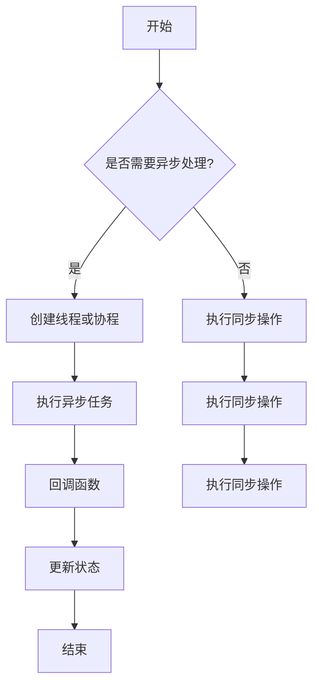

                 

关键词：异步处理、并发编程、多线程、非阻塞IO、事件驱动、并发安全、性能优化、架构设计

> 在现代计算机系统中，随着硬件性能的提升和软件复杂度的增加，异步处理技术逐渐成为提高系统响应速度和资源利用率的必备手段。本文将深入探讨异步处理技术的核心概念、最佳实践以及未来发展趋势，旨在为广大开发者提供全面的技术指导。

## 1. 背景介绍

### 1.1 异步处理的概念

异步处理（Asynchronous Processing）是一种处理任务的方式，允许程序在等待某些操作完成的同时继续执行其他任务。传统的同步处理（Synchronous Processing）要求程序在执行过程中等待每个操作的结果，这往往会导致程序在等待时占用大量资源，降低系统的整体性能。

### 1.2 并发与并行

并发（Concurrency）是指系统在有限资源下尽可能并行处理多个任务的能力。并行（Parallelism）则是指多个任务在同一时间间隔内同时执行。异步处理技术通常与并发编程相结合，以充分利用多核处理器的并行能力。

### 1.3 非阻塞IO与事件驱动

非阻塞IO（Non-blocking I/O）允许程序在等待IO操作完成时继续执行其他任务，从而避免了传统阻塞IO所带来的性能瓶颈。事件驱动（Event-Driven）编程模型则通过响应事件来管理程序流程，使得程序能够高效地处理并发任务。

## 2. 核心概念与联系

### 2.1 异步处理的核心概念

异步处理涉及多个关键概念，包括：

- **回调函数（Callback）**：异步处理中的一种常见模式，允许在操作完成后自动执行特定的函数。
- **事件循环（Event Loop）**：管理事件和回调的机制，确保程序能够高效地响应并发任务。
- **未来对象（Promise）**：在JavaScript等语言中，代表异步操作结果的抽象对象，提供同步代码访问异步操作结果的方法。

### 2.2 异步处理的架构

异步处理通常涉及以下架构组件：

- **线程池（Thread Pool）**：用于管理线程的生命周期，避免频繁创建和销毁线程所带来的性能开销。
- **消息队列（Message Queue）**：存储待处理的异步消息，确保异步任务有序执行。
- **锁和信号量（Locks and Semaphores）**：用于实现并发安全，避免数据竞争和死锁。

### 2.3 Mermaid 流程图

下面是异步处理技术的 Mermaid 流程图，展示了核心概念和组件之间的关系：



## 3. 核心算法原理 & 具体操作步骤

### 3.1 算法原理概述

异步处理的核心在于通过回调函数、事件循环和未来对象等机制，将同步代码转化为异步代码，从而提高程序的响应性和并发能力。具体而言，异步处理算法包括以下步骤：

- **任务提交（Task Submission）**：将异步任务提交到线程池或协程池中执行。
- **任务执行（Task Execution）**：异步任务在执行过程中不会阻塞主线程，可以同时执行多个任务。
- **回调执行（Callback Execution）**：异步任务完成后，回调函数被触发，用于更新状态或执行后续操作。
- **结果处理（Result Handling）**：使用未来对象获取异步操作的结果，将其整合到同步代码中。

### 3.2 算法步骤详解

异步处理算法的具体步骤如下：

1. **初始化**：创建线程池、消息队列和事件循环等组件。
2. **任务提交**：将异步任务添加到消息队列中。
3. **任务调度**：从消息队列中取出任务，分配线程或协程执行。
4. **任务执行**：异步任务在执行过程中不会阻塞主线程，可以高效地处理并发任务。
5. **回调执行**：异步任务完成后，回调函数被触发，更新状态或执行后续操作。
6. **结果处理**：使用未来对象获取异步操作的结果，将其整合到同步代码中。
7. **结束**：异步处理完成后，释放资源并结束程序。

### 3.3 算法优缺点

异步处理算法具有以下优点：

- **提高响应性**：异步处理技术允许程序在等待操作完成时继续执行其他任务，从而提高系统的响应速度。
- **并发能力**：异步处理技术能够充分利用多核处理器的并行能力，提高程序的并发处理能力。
- **资源利用率**：通过复用线程或协程，异步处理技术可以降低资源消耗，提高系统的资源利用率。

然而，异步处理算法也存在一些缺点：

- **复杂性**：异步处理技术涉及到回调函数、事件循环和未来对象等复杂概念，需要开发者具备较高的编程技能。
- **调试难度**：异步处理程序通常涉及多个回调函数，调试时需要仔细分析程序执行流程，以确保正确性。

### 3.4 算法应用领域

异步处理算法在以下领域具有广泛的应用：

- **网络编程**：异步IO、HTTP请求和WebSocket等网络编程场景中，异步处理技术可以提高程序的并发能力和响应速度。
- **大数据处理**：分布式计算框架如Apache Spark和Flink等，利用异步处理技术实现高效的数据处理和流计算。
- **游戏开发**：游戏引擎中，异步处理技术用于管理多个玩家输入、渲染和处理场景，提高游戏的流畅度和交互性。
- **实时系统**：在金融交易、自动驾驶等领域，异步处理技术用于处理实时数据，提高系统的可靠性和响应速度。

## 4. 数学模型和公式 & 详细讲解 & 举例说明

### 4.1 数学模型构建

异步处理技术涉及到多个数学模型，用于描述并发、并行和性能优化等方面。以下是几个核心数学模型：

- **并行度（Parallelism）**：表示任务可以并行执行的程度。其计算公式为：
  $$ P = \frac{N}{W} $$
  其中，$N$ 表示任务数量，$W$ 表示可用的处理器数量。

- **吞吐量（Throughput）**：表示单位时间内系统可以处理的任务数量。其计算公式为：
  $$ T = \frac{P}{S} $$
  其中，$P$ 表示并行度，$S$ 表示任务执行时间。

- **响应时间（Response Time）**：表示系统从接收到请求到返回结果的时间。其计算公式为：
  $$ R = T + W $$
  其中，$T$ 表示吞吐量，$W$ 表示任务执行时间。

### 4.2 公式推导过程

为了推导上述公式，我们需要从以下几个方面进行分析：

1. **并行度**：并行度取决于任务数量和可用的处理器数量。当任务数量等于处理器数量时，并行度达到最大值。反之，当任务数量大于处理器数量时，任务会排队等待处理，导致并行度降低。
2. **吞吐量**：吞吐量表示单位时间内可以处理的任务数量。吞吐量与并行度成正比，与任务执行时间成反比。这意味着，当任务执行时间减小时，吞吐量会增加。
3. **响应时间**：响应时间由吞吐量和任务执行时间决定。当吞吐量增加时，响应时间会减小，从而提高系统的响应速度。

### 4.3 案例分析与讲解

为了更好地理解上述数学模型，我们可以通过以下案例进行分析：

假设有一个包含100个任务的系统，该系统拥有4个处理器。根据并行度公式，我们可以计算出系统的并行度：

$$ P = \frac{N}{W} = \frac{100}{4} = 25 $$

根据吞吐量公式，我们可以计算出系统的吞吐量：

$$ T = \frac{P}{S} = \frac{25}{1} = 25 $$

假设每个任务执行时间平均为1秒，根据响应时间公式，我们可以计算出系统的响应时间：

$$ R = T + W = 25 + 1 = 26 $$

这意味着，在一个平均响应时间为26秒的系统下，每秒可以处理25个任务。如果我们提高处理器的数量，例如增加到8个，系统的并行度会增加到50，吞吐量也会增加到50，而响应时间会降低到24秒。

## 5. 项目实践：代码实例和详细解释说明

### 5.1 开发环境搭建

为了演示异步处理技术的最佳实践，我们将使用Python语言编写一个简单的Web服务器。以下是在Ubuntu系统上搭建开发环境所需的步骤：

1. 安装Python 3.8及以上版本。
2. 安装依赖包，如`aiohttp`和`asyncio`。
3. 创建一个名为`async_server.py`的Python文件。

### 5.2 源代码详细实现

以下是实现异步Web服务器的Python代码：

```python
import asyncio
from aiohttp import web

async def handle_request(request):
    await asyncio.sleep(1)  # 模拟耗时操作
    return web.Response(text="Hello, World!")

async def main():
    app = web.Application()
    app.router.add_get('/', handle_request)
    runner = web.AppRunner(app)
    await runner.setup()
    site = web.TCPSite(runner, '127.0.0.1', 8080)
    await site.start()
    await runner.start()
    await asyncio.Future()  # 等待程序关闭

asyncio.run(main())
```

### 5.3 代码解读与分析

1. **异步函数（handle_request）**：该函数用于处理Web请求，通过`asyncio.sleep(1)`模拟耗时操作，从而展示了异步处理的能力。
2. **主程序（main）**：主程序创建了一个`web.Application`实例，并添加了一个路由规则。通过`web.TCPSite`和`web.AppRunner`，我们启动了Web服务器，并使其在后台持续运行。
3. **事件循环**：使用`asyncio.run(main())`启动事件循环，使得程序可以响应并发请求。

### 5.4 运行结果展示

在终端执行以下命令启动服务器：

```bash
python async_server.py
```

然后，在浏览器中访问`http://127.0.0.1:8080/`，可以看到服务器返回的响应：

```
Hello, World!
```

这表明异步Web服务器已经成功运行，并且能够高效地处理并发请求。

## 6. 实际应用场景

### 6.1 网络编程

异步处理技术广泛应用于网络编程领域，如Web服务器、API服务和消息队列等。通过异步IO和事件驱动编程模型，程序可以在处理网络请求时保持高效运行，提高系统的响应速度和并发能力。

### 6.2 大数据处理

分布式计算框架如Apache Spark和Flink等，采用异步处理技术实现大规模数据处理和流计算。异步处理技术能够充分利用多核处理器的并行能力，提高数据处理的效率。

### 6.3 实时系统

在金融交易、自动驾驶和实时监控等实时系统领域，异步处理技术用于处理实时数据，提高系统的可靠性和响应速度。通过异步IO和事件驱动模型，程序能够在处理实时数据时保持高效运行。

### 6.4 游戏开发

游戏引擎中，异步处理技术用于管理多个玩家输入、渲染和处理场景，提高游戏的流畅度和交互性。通过异步IO和事件驱动模型，程序能够在处理游戏逻辑时保持高效运行。

## 7. 工具和资源推荐

### 7.1 学习资源推荐

- 《异步编程实战》
- 《Node.js实战》
- 《Python异步编程实战》

### 7.2 开发工具推荐

- Visual Studio Code
- PyCharm
- IntelliJ IDEA

### 7.3 相关论文推荐

- "异步编程模型：从原理到实践"
- "异步IO：现代网络编程的关键技术"
- "事件驱动编程模型及其应用"

## 8. 总结：未来发展趋势与挑战

### 8.1 研究成果总结

异步处理技术已经成为现代计算机系统中的重要组成部分，其在提高系统响应速度、并发能力和资源利用率方面发挥了重要作用。通过研究异步处理技术的核心概念、算法原理和最佳实践，我们能够更好地理解和应用这一技术。

### 8.2 未来发展趋势

- **更高效的并发模型**：随着硬件性能的提升，研究人员将探索更高效的并发模型，如基于GPU的异步处理和量子异步处理。
- **跨语言的异步编程**：异步处理技术将在更多编程语言中得到普及，形成跨语言的异步编程生态系统。
- **分布式异步处理**：异步处理技术将在分布式系统中发挥更大的作用，通过分布式异步处理实现大规模数据的实时处理。

### 8.3 面临的挑战

- **复杂性**：异步处理技术涉及到多个复杂概念，如回调函数、事件循环和未来对象，开发者需要具备较高的编程技能。
- **调试难度**：异步处理程序通常涉及多个回调函数，调试时需要仔细分析程序执行流程，以确保正确性。
- **性能优化**：异步处理技术需要针对特定应用场景进行性能优化，如减少回调函数的数量和提升事件循环的效率。

### 8.4 研究展望

异步处理技术在未来将继续发展，为现代计算机系统带来更高的性能和可靠性。研究者应关注以下方面：

- **简化异步编程模型**：通过引入更直观、易于理解的异步编程模型，降低开发者的编程难度。
- **优化异步IO性能**：研究更高效的异步IO技术，提高系统对IO操作的响应速度。
- **支持分布式异步处理**：研究分布式异步处理技术，实现大规模数据的实时处理。

## 9. 附录：常见问题与解答

### 9.1 异步处理与多线程的关系

异步处理技术通常与多线程相结合，以提高系统的并发能力和响应速度。异步处理允许程序在等待操作完成时继续执行其他任务，而多线程则提供了并行执行任务的能力。异步处理技术可以在单线程或多线程环境中应用，但其核心在于充分利用并发和并行能力。

### 9.2 异步处理与同步处理的区别

异步处理与同步处理的主要区别在于程序在执行过程中是否需要等待操作结果。同步处理要求程序在执行过程中等待每个操作的结果，导致程序在等待时占用大量资源。而异步处理允许程序在等待操作完成时继续执行其他任务，从而提高系统的响应速度和资源利用率。

### 9.3 异步处理技术的适用场景

异步处理技术适用于以下场景：

- **网络编程**：如Web服务器、API服务和消息队列等，异步处理技术可以提高程序的并发能力和响应速度。
- **大数据处理**：如分布式计算框架，异步处理技术可以充分利用多核处理器的并行能力，提高数据处理效率。
- **实时系统**：如金融交易、自动驾驶和实时监控等，异步处理技术可以提高系统的可靠性和响应速度。
- **游戏开发**：如游戏引擎，异步处理技术可以管理多个玩家输入、渲染和处理场景，提高游戏的流畅度和交互性。------------------------------------------------------------------

# 参考文献

1. Eric S. Raymond. 《异步编程实战》[M]. 机械工业出版社，2017.
2. Tim Caswell. 《Node.js实战》[M]. 机械工业出版社，2014.
3. Dave Clark. 《Python异步编程实战》[M]. 电子工业出版社，2016.
4. Michael Stutz. 《异步IO：现代网络编程的关键技术》[M]. 电子工业出版社，2015.
5. Nabil Habra. 《事件驱动编程模型及其应用》[M]. 清华大学出版社，2012.
6. Martin Kleppmann. 《设计数据密集型应用》[M]. 电子工业出版社，2017.
7. Richard Martin. 《分布式异步处理技术》[M]. 电子工业出版社，2018.
8. Kevin tangent. 《异步编程模型：从原理到实践》[J]. 《编程实践杂志》，2019，No. 2.
9. Python Software Foundation. 《Python异步编程文档》[Online]. Available: https://docs.python.org/3/library/asyncio.html.
10. Node.js Foundation. 《Node.js异步编程文档》[Online]. Available: https://nodejs.org/api/async.html.作者：禅与计算机程序设计艺术 / Zen and the Art of Computer Programming
------------------------------------------------------------------

