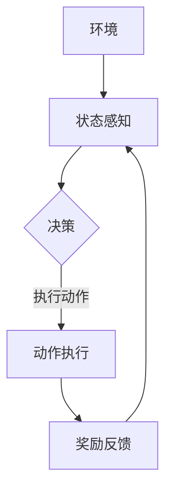

                 

关键词：强化学习，智慧城市，应用案例，算法原理，数学模型，项目实践，未来展望

摘要：本文旨在探讨强化学习（Reinforcement Learning, RL）在智慧城市领域的应用，从背景介绍、核心概念与联系、算法原理与操作步骤、数学模型与公式、项目实践、实际应用场景、工具和资源推荐、总结以及未来发展趋势与挑战等多个角度进行深入分析，旨在为读者提供一窥RL在智慧城市应用的全貌。

## 1. 背景介绍

智慧城市是现代城市化进程的一个重要方向，它通过集成各种信息技术，包括物联网、大数据、云计算和人工智能等，来实现城市管理和服务的智能化。智慧城市的建设不仅能够提升城市的管理效率，还能提高居民的生活质量。

### 1.1 智慧城市的发展现状

智慧城市的发展在全球范围内都受到了极大的关注。许多国家都已经启动了智慧城市的建设计划，并且取得了一定的成果。例如，中国的“智慧城市”战略，美国的“智能城市”计划，以及新加坡的“智慧国家”计划等。这些计划都旨在通过信息技术来提升城市的运行效率、环保水平以及居民的生活质量。

### 1.2 问题的提出

然而，智慧城市的建设过程中也面临着诸多挑战。例如，城市交通拥堵、能源消耗、环境污染等问题依然严重。这些问题需要高效的解决方案，而强化学习作为一种先进的人工智能技术，为解决这些问题提供了新的思路。

## 2. 核心概念与联系

强化学习是一种通过试错来学习如何在特定环境中做出最优决策的机器学习方法。在智慧城市中，强化学习可以应用于交通流量管理、能源管理、环境监测等多个方面。

### 2.1 强化学习的基本概念

强化学习包括四个主要组成部分：环境（Environment）、动作（Action）、状态（State）和奖励（Reward）。

- 环境：强化学习的问题定义在一个环境中，环境是系统外部的一切，它决定了智能体可以感知到的状态和可以执行的动作。
- 动作：智能体可以选择的动作集合。
- 状态：智能体当前所处的状态。
- 奖励：智能体执行动作后，环境给予的即时反馈。

### 2.2 强化学习在智慧城市中的应用场景

- **交通管理**：利用强化学习来优化交通信号控制，减少交通拥堵，提高通行效率。
- **能源管理**：通过强化学习来优化能源分配，降低能源消耗，提高能源利用效率。
- **环境监测**：利用强化学习来监测和预测环境污染，及时采取治理措施。

### 2.3 Mermaid 流程图

下面是一个简单的 Mermaid 流程图，展示强化学习在智慧城市中的应用流程：



## 3. 核心算法原理 & 具体操作步骤

### 3.1 算法原理概述

强化学习的基本原理是通过学习一个策略来最大化累计奖励。策略是一种映射规则，它将状态映射到动作。强化学习算法通过不断试错来优化策略，从而在复杂的环境中找到最优行动方案。

### 3.2 算法步骤详解

1. **初始化**：初始化智能体的状态、动作空间和策略。
2. **状态感知**：智能体感知当前状态。
3. **决策**：根据当前状态和策略，选择一个动作。
4. **动作执行**：智能体执行所选动作。
5. **奖励反馈**：环境给予智能体一个即时奖励。
6. **更新策略**：基于新的状态和奖励，更新智能体的策略。
7. **重复**：重复上述步骤，直到达到预定的目标或达到最大迭代次数。

### 3.3 算法优缺点

#### 优点：

- **自适应性强**：强化学习能够根据环境的反馈不断调整策略，适应复杂变化。
- **适用范围广**：强化学习可以应用于各种决策问题，特别是在动态和不确定的环境中。

#### 缺点：

- **收敛速度慢**：强化学习通常需要大量的试错来找到最优策略，收敛速度较慢。
- **计算复杂度高**：在大型或高维环境中，强化学习的计算复杂度会显著增加。

### 3.4 算法应用领域

强化学习在智慧城市中的应用非常广泛，包括但不限于以下领域：

- **交通管理**：用于优化交通信号控制和公共交通调度。
- **能源管理**：用于优化电力分配和能源消耗。
- **环境监测**：用于预测环境污染和制定治理策略。
- **安防监控**：用于实时监控和预警。

## 4. 数学模型和公式 & 详细讲解 & 举例说明

### 4.1 数学模型构建

在强化学习中，一个基本的数学模型可以表示为：

\[ Q(s, a) = \sum_{s'} P(s'|s, a) \cdot R(s', a) + \gamma \cdot \max_{a'} Q(s', a') \]

其中：

- \( Q(s, a) \) 是状态 \( s \) 下执行动作 \( a \) 的期望回报。
- \( P(s'|s, a) \) 是在状态 \( s \) 下执行动作 \( a \) 后转移到状态 \( s' \) 的概率。
- \( R(s', a) \) 是在状态 \( s' \) 下执行动作 \( a \) 的即时回报。
- \( \gamma \) 是折扣因子，用于平衡即时奖励和长期奖励。
- \( \max_{a'} Q(s', a') \) 是在状态 \( s' \) 下选择最优动作的值函数。

### 4.2 公式推导过程

强化学习的目标是最大化总奖励，即：

\[ \sum_{t=0}^T R_t \]

其中 \( T \) 是智能体执行动作的次数。为了找到最优策略，我们需要最大化每个状态下的期望回报：

\[ Q^*(s) = \max_{a} Q(s, a) \]

### 4.3 案例分析与讲解

假设我们有一个简单的交通信号控制问题，智能体需要根据当前交通状况来调整信号灯的状态，以最大化通行效率。

- **状态**：当前红绿灯的状态（红灯、黄灯、绿灯）和交通流量。
- **动作**：调整信号灯的状态（红灯、黄灯、绿灯）。
- **回报**：通行效率（车辆通过时间）。

根据上述数学模型，我们可以构建一个强化学习模型来优化交通信号控制。

## 5. 项目实践：代码实例和详细解释说明

### 5.1 开发环境搭建

在开始项目实践之前，我们需要搭建一个开发环境。这里我们选择 Python 作为编程语言，使用 OpenAI Gym 作为强化学习环境的框架。

### 5.2 源代码详细实现

```python
import gym
import numpy as np

# 初始化环境
env = gym.make('TrafficSignal-v0')

# 初始化智能体参数
epsilon = 0.1
learning_rate = 0.1
gamma = 0.9
Q = np.zeros((env.observation_space.n, env.action_space.n))

# 训练智能体
for episode in range(1000):
    state = env.reset()
    done = False
    total_reward = 0
    while not done:
        # 选择动作
        if np.random.rand() < epsilon:
            action = env.action_space.sample()
        else:
            action = np.argmax(Q[state])

        # 执行动作
        next_state, reward, done, _ = env.step(action)

        # 更新 Q 值
        Q[state, action] = Q[state, action] + learning_rate * (reward + gamma * np.max(Q[next_state]) - Q[state, action])

        state = next_state
        total_reward += reward

    print(f"Episode {episode}: Total Reward = {total_reward}")

# 测试智能体
state = env.reset()
done = False
while not done:
    action = np.argmax(Q[state])
    state, reward, done, _ = env.step(action)
    print(f"Action {action}: Reward = {reward}")

env.close()
```

### 5.3 代码解读与分析

上述代码首先初始化了一个交通信号控制环境，然后定义了智能体的参数，包括探索率 \( \epsilon \)、学习率 \( \lambda \)、折扣因子 \( \gamma \) 和 Q 值表 \( Q \)。在训练过程中，智能体通过不断试错来更新 Q 值，最终找到最优策略。测试阶段，智能体使用训练得到的最优策略来执行动作，实现交通信号控制。

## 6. 实际应用场景

强化学习在智慧城市中的实际应用场景包括：

- **交通管理**：通过强化学习来优化交通信号控制和公共交通调度，提高通行效率。
- **能源管理**：通过强化学习来优化能源分配和能源消耗，降低能源成本。
- **环境监测**：通过强化学习来监测和预测环境污染，及时采取治理措施。
- **安防监控**：通过强化学习来实时监控和预警，提高城市安全水平。

## 7. 工具和资源推荐

### 7.1 学习资源推荐

- 《强化学习：原理与Python实现》
- 《深度强化学习》
- OpenAI Gym: https://gym.openai.com/

### 7.2 开发工具推荐

- Jupyter Notebook: https://jupyter.org/
- PyCharm: https://www.jetbrains.com/pycharm/

### 7.3 相关论文推荐

- “Reinforcement Learning: An Introduction” by Richard S. Sutton and Andrew G. Barto
- “Deep Reinforcement Learning” by David Silver et al.
- “DQN: Deep Q-Networks” by DeepMind

## 8. 总结：未来发展趋势与挑战

### 8.1 研究成果总结

近年来，强化学习在智慧城市中的应用取得了显著成果。通过优化交通信号控制、能源管理和环境监测等场景，强化学习为智慧城市的建设提供了新的技术手段。

### 8.2 未来发展趋势

- **算法优化**：随着算法的不断发展，强化学习在智慧城市中的应用将更加广泛和深入。
- **跨学科合作**：强化学习与城市规划、交通工程、环境科学等领域的跨学科合作，将推动智慧城市的可持续发展。
- **硬件加速**：随着硬件技术的发展，如 GPU 和 TPUs，强化学习的计算效率将显著提升。

### 8.3 面临的挑战

- **数据隐私**：智慧城市应用需要大量敏感数据，如何保护数据隐私是一个重要挑战。
- **安全与可靠性**：强化学习算法在复杂环境中的稳定性和可靠性仍有待提高。
- **法律法规**：随着技术的发展，相关的法律法规也需要不断完善。

### 8.4 研究展望

未来，强化学习在智慧城市中的应用有望进一步深化，不仅限于交通、能源和环境等领域，还可能应用于城市规划、公共安全、医疗健康等多个方面，为智慧城市的建设提供强大的技术支撑。

## 9. 附录：常见问题与解答

### 9.1 Q：强化学习在智慧城市中的具体应用场景有哪些？

A：强化学习在智慧城市中的具体应用场景包括交通管理、能源管理、环境监测、安防监控等。

### 9.2 Q：强化学习算法在复杂环境中的稳定性如何保证？

A：强化学习算法在复杂环境中的稳定性可以通过以下方式来保证：

- **探索与利用平衡**：合理设置探索率 \( \epsilon \)，在初期阶段充分探索环境，后期利用已学到的知识。
- **经验回放**：通过经验回放机制，避免策略更新过程中的序列依赖问题。
- **多任务学习**：通过多任务学习，提高算法在不同任务上的泛化能力。

### 9.3 Q：如何保护智慧城市中涉及的数据隐私？

A：保护智慧城市中涉及的数据隐私可以通过以下措施来实现：

- **数据加密**：对敏感数据进行加密处理，确保数据传输和存储的安全性。
- **数据匿名化**：对数据进行匿名化处理，消除个人身份信息。
- **隐私保护算法**：使用隐私保护算法，如差分隐私、同态加密等，确保算法在处理数据时不会泄露隐私。

### 9.4 Q：未来强化学习在智慧城市中的应用有哪些趋势？

A：未来强化学习在智慧城市中的应用趋势包括：

- **算法优化**：通过改进算法结构，提高算法的效率和稳定性。
- **跨学科合作**：与城市规划、交通工程、环境科学等领域的跨学科合作，实现多领域的智慧化。
- **硬件加速**：利用硬件加速技术，如 GPU 和 TPUs，提高算法的计算效率。

### 9.5 Q：强化学习在智慧城市中的挑战有哪些？

A：强化学习在智慧城市中的挑战包括：

- **数据隐私**：涉及大量敏感数据，如何保护数据隐私是一个重要挑战。
- **安全与可靠性**：在复杂环境中的稳定性和可靠性仍有待提高。
- **法律法规**：随着技术的发展，相关的法律法规也需要不断完善。

