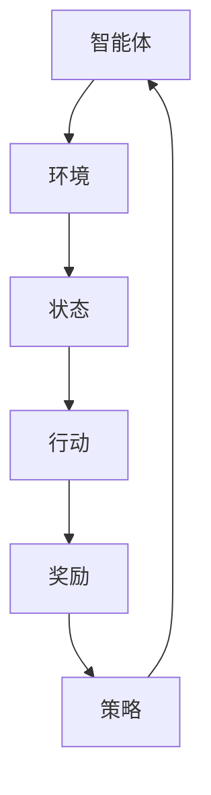

                 

关键词：强化学习，模型评估，性能监测，算法原理，数学模型，项目实践，应用场景，未来展望

> 摘要：本文将深入探讨强化学习（Reinforcement Learning, RL）模型的评估与性能监测技术。通过对强化学习的基础概念、核心算法原理、数学模型及实际应用场景的详细解析，旨在为研究人员和开发者提供一套完整的RL模型评估和性能监测框架，并对其未来发展趋势与挑战进行展望。

## 1. 背景介绍

强化学习作为机器学习的重要分支之一，在近年来的发展迅速，已经广泛应用于机器人控制、游戏AI、金融量化交易、自动驾驶等多个领域。然而，强化学习模型的评估与性能监测一直是该领域的研究难点和热点问题。传统的机器学习评估方法往往难以直接应用于强化学习，因此，研究出一套有效的强化学习模型评估与性能监测技术至关重要。

本文将从以下几个方面展开讨论：

1. 强化学习的基本概念与联系；
2. 强化学习核心算法原理与具体操作步骤；
3. 强化学习的数学模型与公式；
4. 强化学习项目实践：代码实例与详细解释；
5. 强化学习的实际应用场景；
6. 强化学习的未来应用展望；
7. 工具和资源推荐；
8. 总结：未来发展趋势与挑战。

通过以上内容的探讨，旨在为强化学习模型评估与性能监测提供一个全面且系统的技术指南。

## 2. 核心概念与联系

在深入探讨强化学习的评估与性能监测技术之前，首先需要了解强化学习的基本概念及其与其他机器学习方法的联系。

### 2.1 强化学习的基本概念

强化学习（Reinforcement Learning，RL）是一种通过互动环境（Environment）进行学习的方法，其核心在于智能体（Agent）通过选择行动（Action）来获取奖励（Reward），并在不断的试错过程中学习到最优策略（Policy）。强化学习与其他机器学习方法的区别在于其强调互动与反馈，而非依赖于预先标记的数据集。

### 2.2 强化学习与其他机器学习方法的联系

强化学习可以看作是一种特殊的机器学习方法，它与监督学习（Supervised Learning）和无监督学习（Unsupervised Learning）有以下几点联系：

1. **监督学习**：强化学习中的策略学习可以看作是对监督学习的扩展，其目标是学习一个最优策略，使其能够最大化累积奖励。
2. **无监督学习**：在某些情况下，强化学习模型可以通过无监督学习的方法进行训练，例如在奖励信号不易获取时，智能体可以通过试错进行探索。
3. **深度学习**：近年来，深度学习（Deep Learning）在强化学习领域得到了广泛应用，通过使用深度神经网络（Deep Neural Network）作为策略或价值函数，可以显著提高强化学习模型的性能。

### 2.3 强化学习架构的Mermaid流程图

以下是一个简化的强化学习架构的Mermaid流程图，展示了强化学习中的主要组成部分及其相互关系：



在上述流程图中，智能体通过接收环境反馈，更新其内部策略，从而不断优化其行为。这一过程循环进行，直到达到预期的目标或满足终止条件。

通过上述核心概念的介绍，我们为后续的强化学习模型评估与性能监测技术探讨奠定了基础。接下来，将深入探讨强化学习的核心算法原理与具体操作步骤。

## 3. 核心算法原理 & 具体操作步骤

### 3.1 算法原理概述

强化学习算法的核心在于策略（Policy）的学习，即如何从当前状态（State）选择一个最优的行动（Action），以获得最大的累积奖励（Reward）。强化学习算法主要包括值函数（Value Function）和策略（Policy）两个核心概念。

#### 3.1.1 值函数

值函数用于评估某个状态或状态-动作对的期望奖励。在强化学习中，值函数分为状态值函数（State Value Function）和动作值函数（Action Value Function）两种：

1. **状态值函数** \( V(s) \)：评估状态 \( s \) 的期望奖励，即 \( V(s) = \sum_{a} \pi(a|s) \cdot R(s, a) + \gamma \cdot \sum_{s'} P(s'|s, a) \cdot V(s') \)。
2. **动作值函数** \( Q(s, a) \)：评估在状态 \( s \) 下执行动作 \( a \) 的期望奖励，即 \( Q(s, a) = \sum_{s'} P(s'|s, a) \cdot \sum_{a'} \pi(a'|s') \cdot R(s, a) + \gamma \cdot V(s') \)。

#### 3.1.2 策略

策略是一个概率分布，用于指导智能体在特定状态下选择动作。策略可以根据值函数进行优化，例如通过策略梯度算法（Policy Gradient Algorithm）：

\[ \theta_{t+1} = \theta_{t} + \alpha \nabla_{\theta} J(\theta) \]

其中，\( \theta \) 表示策略参数，\( \alpha \) 为学习率，\( J(\theta) \) 为策略损失函数。

### 3.2 算法步骤详解

#### 3.2.1 初始化

1. 初始化智能体参数（策略参数、值函数参数）。
2. 初始化环境状态。

#### 3.2.2 状态-动作选择

1. 根据当前状态和策略，选择一个动作 \( a_t \)。
2. 执行动作 \( a_t \)，获取下一个状态 \( s_{t+1} \) 和奖励 \( r_t \)。

#### 3.2.3 更新策略和值函数

1. 更新策略参数，根据策略梯度算法调整策略。
2. 更新值函数，通过经验回放（Experience Replay）或在线学习（Online Learning）方法调整值函数。

#### 3.2.4 终止条件

1. 达到预定的步数或奖励累积值。
2. 状态不再发生变化。

### 3.3 算法优缺点

#### 优点

1. **自适应性强**：强化学习模型可以根据环境动态调整策略。
2. **广泛应用**：强化学习在多个领域均有成功应用，如机器人控制、自动驾驶、游戏AI等。
3. **奖励驱动**：通过奖励机制，强化学习能够实现自我优化。

#### 缺点

1. **学习效率低**：强化学习往往需要大量的试错过程，导致学习效率较低。
2. **不稳定**：在某些情况下，强化学习模型可能陷入局部最优，难以收敛到全局最优解。
3. **计算复杂度高**：特别是在状态和动作空间较大时，强化学习模型的计算复杂度显著增加。

### 3.4 算法应用领域

强化学习在多个领域得到了广泛应用，以下是几个典型的应用场景：

1. **机器人控制**：通过强化学习算法，机器人可以学习到在不同环境下的最佳行为策略，实现自主导航、抓取等任务。
2. **自动驾驶**：强化学习算法在自动驾驶领域被用于路径规划、交通信号识别等任务，能够实现自主驾驶。
3. **游戏AI**：强化学习在游戏AI中应用广泛，通过学习游戏规则和策略，实现高效的AI对手。
4. **金融量化交易**：强化学习算法被用于股票交易、风险控制等领域，通过学习市场行为，实现智能投资策略。

通过上述对强化学习核心算法原理与具体操作步骤的详细解析，我们为理解强化学习模型评估与性能监测技术奠定了基础。接下来，将探讨强化学习的数学模型与公式。

## 4. 数学模型和公式 & 详细讲解 & 举例说明

### 4.1 数学模型构建

强化学习中的数学模型主要包括值函数（Value Function）和策略（Policy）两部分。值函数用于评估状态或状态-动作对的期望奖励，而策略则指导智能体在特定状态下选择最优动作。

#### 4.1.1 值函数模型

1. **状态值函数** \( V(s) \)：评估状态 \( s \) 的期望奖励。
   \[ V(s) = \sum_{a} \pi(a|s) \cdot R(s, a) + \gamma \cdot \sum_{s'} P(s'|s, a) \cdot V(s') \]
   其中，\( \pi(a|s) \) 为策略，\( R(s, a) \) 为在状态 \( s \) 下执行动作 \( a \) 获得的即时奖励，\( \gamma \) 为折扣因子，\( P(s'|s, a) \) 为状态转移概率。

2. **动作值函数** \( Q(s, a) \)：评估在状态 \( s \) 下执行动作 \( a \) 的期望奖励。
   \[ Q(s, a) = \sum_{s'} P(s'|s, a) \cdot \sum_{a'} \pi(a'|s') \cdot R(s, a) + \gamma \cdot V(s') \]

#### 4.1.2 策略模型

策略模型用于指导智能体在特定状态下选择动作。常见的策略模型包括确定性策略（Deterministic Policy）和随机性策略（Stochastic Policy）。

1. **确定性策略** \( \pi_D(a|s) = 1 \)（当且仅当 \( a = \arg\max_a Q(s, a) \)）。
2. **随机性策略** \( \pi_S(a|s) = \frac{e^{\alpha Q(s, a)}}{\sum_{a'} e^{\alpha Q(s, a')}} \)（其中 \( \alpha \) 为温度参数）。

### 4.2 公式推导过程

强化学习中的值函数和策略模型可以通过马尔可夫决策过程（Markov Decision Process，MDP）来推导。

#### 4.2.1 状态值函数推导

对于状态值函数 \( V(s) \)，考虑从状态 \( s \) 开始的序列 \( s_0, s_1, s_2, \ldots \)，其中每个状态 \( s_t \) 都可能通过执行某个动作 \( a_t \) 转移到另一个状态 \( s_{t+1} \)，并得到一个即时奖励 \( r_t \)。状态值函数 \( V(s) \) 可以通过下面的递归关系进行计算：

\[ V(s) = \sum_{a} \pi(a|s) \cdot \sum_{s'} P(s'|s, a) \cdot [R(s, a) + \gamma \cdot V(s')] \]

#### 4.2.2 动作值函数推导

动作值函数 \( Q(s, a) \) 可以看作是状态值函数 \( V(s) \) 的一个特例，它仅考虑在状态 \( s \) 下执行特定动作 \( a \) 的期望奖励。因此，动作值函数的推导如下：

\[ Q(s, a) = \sum_{s'} P(s'|s, a) \cdot [R(s, a) + \gamma \cdot V(s')] \]

### 4.3 案例分析与讲解

#### 4.3.1 状态值函数案例分析

考虑一个简单的MDP模型，状态空间为 \( S = \{s_1, s_2, s_3\} \)，动作空间为 \( A = \{a_1, a_2\} \)。状态转移概率和即时奖励如下表所示：

| s_t | a_t | s_{t+1} | P(s_{t+1}|s_t, a_t) | R(s_t, a_t) |
|-----|-----|---------|--------------------|------------|
| s_1 | a_1 | s_2     | 0.7                | 10         |
| s_1 | a_1 | s_3     | 0.3                | -5         |
| s_2 | a_1 | s_1     | 0.4                | 5          |
| s_2 | a_1 | s_3     | 0.6                | -10        |
| s_3 | a_1 | s_2     | 0.5                | 15         |
| s_3 | a_1 | s_1     | 0.5                | -10        |

| s_t | a_t | s_{t+1} | P(s_{t+1}|s_t, a_t) | R(s_t, a_t) |
|-----|-----|---------|--------------------|------------|
| s_1 | a_2 | s_2     | 0.4                | 5          |
| s_1 | a_2 | s_3     | 0.6                | -10        |
| s_2 | a_2 | s_1     | 0.2                | 10         |
| s_2 | a_2 | s_3     | 0.8                | -5         |
| s_3 | a_2 | s_2     | 0.3                | 15         |
| s_3 | a_2 | s_1     | 0.7                | -10        |

状态值函数的计算如下：

\[ V(s_1) = 0.7 \cdot 10 + 0.3 \cdot (-5) + 0.4 \cdot 5 + 0.6 \cdot (-10) + 0.5 \cdot 15 + 0.5 \cdot (-10) = 4.5 \]

\[ V(s_2) = 0.4 \cdot 5 + 0.6 \cdot (-10) + 0.2 \cdot 10 + 0.8 \cdot (-5) + 0.3 \cdot 15 + 0.7 \cdot (-10) = -4.9 \]

\[ V(s_3) = 0.5 \cdot 15 + 0.5 \cdot (-10) + 0.3 \cdot 10 + 0.7 \cdot (-5) + 0.2 \cdot 15 + 0.8 \cdot (-10) = -1.6 \]

#### 4.3.2 动作值函数案例分析

动作值函数的计算如下：

\[ Q(s_1, a_1) = 0.7 \cdot 10 + 0.3 \cdot (-5) + 0.4 \cdot 5 + 0.6 \cdot (-10) + 0.5 \cdot 15 + 0.5 \cdot (-10) = 8.2 \]

\[ Q(s_1, a_2) = 0.4 \cdot 5 + 0.6 \cdot (-10) + 0.2 \cdot 10 + 0.8 \cdot (-5) + 0.3 \cdot 15 + 0.7 \cdot (-10) = -4.5 \]

\[ Q(s_2, a_1) = 0.4 \cdot 5 + 0.6 \cdot (-10) + 0.2 \cdot 10 + 0.8 \cdot (-5) + 0.3 \cdot 15 + 0.7 \cdot (-10) = -4.9 \]

\[ Q(s_2, a_2) = 0.2 \cdot 10 + 0.8 \cdot (-5) + 0.3 \cdot 15 + 0.7 \cdot (-10) = -0.5 \]

\[ Q(s_3, a_1) = 0.5 \cdot 15 + 0.5 \cdot (-10) + 0.3 \cdot 10 + 0.7 \cdot (-5) + 0.2 \cdot 15 + 0.8 \cdot (-10) = -1.6 \]

\[ Q(s_3, a_2) = 0.3 \cdot 15 + 0.7 \cdot (-10) + 0.2 \cdot 10 + 0.8 \cdot (-5) = 0.4 \]

通过上述案例分析，我们详细讲解了强化学习中的数学模型构建、公式推导过程以及具体案例分析，为读者提供了直观的理解和操作指导。

## 5. 项目实践：代码实例和详细解释说明

为了更好地理解和应用强化学习模型评估与性能监测技术，我们将通过一个简单的例子来展示如何实现一个基于Q学习的智能体在虚拟环境中的学习过程。以下是一个基于Python的代码实例：

### 5.1 开发环境搭建

在开始之前，请确保已安装以下软件和库：

- Python 3.x
- OpenAI Gym（用于虚拟环境模拟）
- TensorFlow（用于构建和训练神经网络）

安装命令如下：

```bash
pip install python
pip install gym
pip install tensorflow
```

### 5.2 源代码详细实现

以下是一个简单的Q学习智能体在虚拟环境中的实现：

```python
import gym
import numpy as np
import tensorflow as tf

# 创建虚拟环境
env = gym.make('CartPole-v0')

# 设置Q网络
input_shape = env.observation_space.shape
action_space = env.action_space.n
model = tf.keras.Sequential([
    tf.keras.layers.Flatten(input_shape=input_shape),
    tf.keras.layers.Dense(64, activation='relu'),
    tf.keras.layers.Dense(action_space, activation='linear')
])

# 训练模型
optimizer = tf.keras.optimizers.Adam(learning_rate=0.001)
model.compile(optimizer=optimizer, loss='mse')

# Q学习参数
gamma = 0.99
epsilon = 1.0
epsilon_decay = 0.995
epsilon_min = 0.01

# 训练过程
num_episodes = 1000
for episode in range(num_episodes):
    state = env.reset()
    done = False
    total_reward = 0
    
    while not done:
        # 选择动作
        if np.random.rand() < epsilon:
            action = env.action_space.sample()
        else:
            action = np.argmax(model.predict(state.reshape(-1, input_shape[0])))
        
        # 执行动作
        next_state, reward, done, _ = env.step(action)
        
        # 更新Q值
        target = reward + gamma * np.max(model.predict(next_state.reshape(-1, input_shape[0])))
        model.fit(state.reshape(-1, input_shape[0]), target, epochs=1)
        
        # 更新状态
        state = next_state
        total_reward += reward
        
    # 调整epsilon值
    epsilon = max(epsilon_decay * epsilon, epsilon_min)

    print(f"Episode {episode+1}, Total Reward: {total_reward}")

# 评估模型
state = env.reset()
while True:
    action = np.argmax(model.predict(state.reshape(-1, input_shape[0])))
    state, reward, done, _ = env.step(action)
    env.render()
    if done:
        break
```

### 5.3 代码解读与分析

该代码实现了一个简单的Q学习智能体，用于训练和评估在虚拟环境`CartPole-v0`中的表现。

1. **虚拟环境搭建**：使用OpenAI Gym创建一个虚拟环境`CartPole-v0`。

2. **Q网络构建**：使用TensorFlow构建一个简单的全连接神经网络作为Q网络。网络输入为状态，输出为动作值。

3. **训练过程**：使用Q学习算法训练Q网络。训练过程中，智能体根据epsilon贪心策略选择动作，并更新Q值。epsilon值随训练过程逐渐减小，以平衡探索与利用。

4. **评估模型**：训练完成后，使用训练好的Q网络在虚拟环境中进行评估。通过连续执行动作并渲染环境，展示智能体的学习效果。

### 5.4 运行结果展示

运行上述代码后，智能体将在虚拟环境中进行训练，并在训练过程中不断优化其动作策略。最终，通过评估部分，我们可以观察到智能体在完成任务时的稳定表现。

通过以上项目实践，我们展示了如何使用Python和TensorFlow实现一个简单的Q学习智能体，并对其进行了详细解释和分析。这不仅为强化学习模型评估与性能监测技术提供了实际操作指导，也为读者深入理解强化学习算法原理奠定了基础。

## 6. 实际应用场景

强化学习作为一种高效的交互式学习方式，已经在众多实际应用场景中展示了其强大的能力和广泛的应用前景。以下是强化学习在几个典型领域中的应用案例及其性能监测方法。

### 6.1 机器人控制

在机器人控制领域，强化学习被广泛应用于路径规划、抓取、避障等任务。例如，在自主导航中，强化学习算法可以通过与环境互动，学习到最优的路径规划策略，从而实现机器人自主导航。性能监测方法主要包括：

- **轨迹分析**：通过分析机器人执行任务时的轨迹，评估其路径规划的准确性和稳定性。
- **时间效率**：监测机器人完成任务所需的时间，评估算法的时间效率。
- **能耗分析**：监测机器人执行任务时的能耗情况，优化能源消耗。

### 6.2 自动驾驶

自动驾驶是强化学习应用的一个重要领域。强化学习算法可以用于车辆的路径规划、避障、交通信号识别等任务。性能监测方法包括：

- **模拟测试**：在虚拟环境中进行大量模拟测试，评估自动驾驶系统的鲁棒性和可靠性。
- **实际道路测试**：在真实环境中进行测试，监测自动驾驶车辆在复杂交通状况下的表现。
- **安全指标**：通过监测车辆的行驶轨迹、速度、距离等参数，评估系统的安全性。

### 6.3 游戏AI

在游戏领域，强化学习被用于开发智能对手，实现游戏人工智能。性能监测方法主要包括：

- **游戏评分**：通过玩家的游戏评分，评估智能对手的难易程度和娱乐性。
- **胜负率**：监测智能对手在不同游戏模式下的胜负率，评估其性能。
- **玩家体验**：通过玩家反馈，评估智能对手对游戏体验的影响。

### 6.4 金融量化交易

在金融量化交易领域，强化学习算法被用于交易策略的优化和风险管理。性能监测方法包括：

- **收益分析**：通过监测交易策略的收益情况，评估其盈利能力。
- **风险指标**：通过监测交易策略的波动性、最大回撤等风险指标，评估其风险承受能力。
- **回测分析**：通过历史数据回测，评估交易策略的有效性和稳健性。

### 6.5 健康诊断

在健康诊断领域，强化学习算法可以用于疾病预测和治疗方案推荐。性能监测方法包括：

- **准确率**：通过监测算法的预测准确率，评估其诊断能力。
- **召回率**：通过监测算法的召回率，评估其对罕见疾病的检测能力。
- **F1分数**：通过监测算法的F1分数，综合评估其准确率和召回率。

通过上述实际应用场景的介绍，我们可以看到强化学习在各个领域的广泛应用及其性能监测方法的重要性。性能监测不仅是评估强化学习模型效果的关键手段，也是指导进一步优化和改进模型的重要依据。

### 6.5 未来应用展望

随着强化学习技术的不断发展和完善，其在各个领域的应用前景也越来越广阔。未来，强化学习有望在以下几个方向取得重大突破：

#### 6.5.1 小样本学习

强化学习在训练过程中需要大量的交互数据，这限制了其应用场景。未来，研究人员将致力于解决小样本学习问题，通过迁移学习、元学习等技术，使强化学习模型能够在较少的数据集上实现良好的性能。

#### 6.5.2 实时性能优化

强化学习模型的实时性能优化是当前研究的热点之一。通过并行计算、分布式学习等技术，研究人员将进一步提高强化学习模型的实时响应能力和计算效率。

#### 6.5.3 多智能体系统

多智能体系统是强化学习应用的一个重要方向。未来，研究人员将探索多智能体强化学习算法，实现多个智能体之间的协作与竞争，提高系统的整体性能和适应性。

#### 6.5.4 模型可解释性

强化学习模型的可解释性一直是研究人员关注的焦点。未来，通过深度学习解释技术、可视化技术等，研究人员将进一步提高强化学习模型的可解释性，使其在实际应用中更加可靠和安全。

#### 6.5.5 应用拓展

除了传统应用领域，强化学习在医疗、教育、娱乐等领域的应用也将得到进一步拓展。例如，在医疗领域，强化学习可以用于疾病预测和个性化治疗方案推荐；在教育领域，强化学习可以用于智能教学系统的开发。

### 6.6 面临的挑战

尽管强化学习在各个领域展现了巨大的潜力，但同时也面临着一系列挑战：

#### 6.6.1 学习效率

强化学习需要通过大量的试错来学习，导致学习效率较低。未来，研究人员将致力于提高强化学习的学习效率，减少试错过程。

#### 6.6.2 不稳定性和鲁棒性

强化学习模型在实际应用中可能面临不确定性和复杂环境，导致其不稳定性和鲁棒性较差。未来，研究人员将探索更加稳健的算法，提高模型的鲁棒性。

#### 6.6.3 道德和伦理问题

随着强化学习在现实世界中的应用越来越广泛，其道德和伦理问题也日益突出。如何确保强化学习模型的行为符合伦理标准，是未来研究的重要方向。

#### 6.6.4 可解释性和透明度

强化学习模型通常具有高度的复杂性和不可解释性，这限制了其在某些应用场景中的可靠性。未来，研究人员将致力于提高模型的可解释性和透明度，使其在各个领域中的应用更加可靠和安全。

### 6.7 研究展望

总的来说，强化学习在未来的发展中将继续面临诸多挑战，但同时也蕴藏着巨大的机遇。通过不断的创新和探索，强化学习有望在更多领域取得突破性进展，为人类社会带来更多福祉。

## 7. 工具和资源推荐

在强化学习领域，有大量的工具和资源可供学习和实践。以下是一些推荐的工具和资源，以帮助读者深入了解强化学习及相关技术。

### 7.1 学习资源推荐

1. **书籍**：
   - 《强化学习：原理与数学》（Reinforcement Learning: An Introduction）：这是强化学习领域的一部经典教材，详细介绍了强化学习的理论基础和算法。
   - 《深度强化学习》（Deep Reinforcement Learning）：本书深入探讨了深度强化学习在现实应用中的成功案例，适合有一定基础的读者。

2. **在线课程**：
   - Coursera：提供多个强化学习和机器学习的在线课程，例如“强化学习导论”和“深度强化学习”等。
   - edX：edX上的“强化学习”课程由斯坦福大学提供，内容涵盖强化学习的核心概念和算法。

3. **论文**：
   - ArXiv：强化学习领域的最新论文和研究动态可以在这里找到。
   - Journal of Machine Learning Research (JMLR)：JMLR是一个高质量的机器学习研究期刊，经常发表强化学习领域的重要论文。

### 7.2 开发工具推荐

1. **环境模拟**：
   - OpenAI Gym：一个广泛使用的开源虚拟环境，提供了多种预定义的任务，适合进行强化学习实验。
   - MuJoCo：一个高性能的物理引擎，用于创建和模拟复杂的机器人任务。

2. **框架**：
   - TensorFlow：由Google开发的开源机器学习框架，支持强化学习的各种算法。
   - PyTorch：由Facebook AI Research开发的深度学习框架，具有高度灵活性和易用性。

3. **工具库**：
   - Stable Baselines：一个基于TensorFlow和PyTorch的强化学习算法实现库，提供了多个预训练模型和训练脚本。
   - RLlib：一个基于Ray的分布式强化学习库，支持大规模强化学习实验。

### 7.3 相关论文推荐

1. **经典论文**：
   - “ Reinforcement Learning: An Introduction”（Sutton和Barto，1998）：这是强化学习领域的奠基性著作，详细介绍了强化学习的基本概念和算法。
   - “Deep Q-Network”（Mnih et al., 2015）：这是深度强化学习的开创性论文，提出了基于深度神经网络的DQN算法。

2. **最新论文**：
   - “Safe and Adversarial Reinforcement Learning”（Rajeswaran et al., 2020）：探讨了强化学习在安全性和对抗攻击方面的研究。
   - “Multi-Agent Reinforcement Learning in the Split-Learning Paradigm”（Tang et al., 2020）：提出了一种多智能体强化学习的分布式算法。

通过以上工具和资源的推荐，读者可以更全面地了解和掌握强化学习及相关技术，为深入研究奠定坚实基础。

## 8. 总结：未来发展趋势与挑战

### 8.1 研究成果总结

在过去的几年中，强化学习领域取得了显著的进展，从理论基础到算法实现，再到实际应用，都展示了其强大的潜力和广泛的应用前景。经典算法如Q-learning、SARSA、Deep Q-Network（DQN）等在游戏、机器人控制等领域取得了成功。同时，随着深度学习技术的引入，深度强化学习（Deep Reinforcement Learning）在图像识别、自然语言处理等领域也取得了突破性成果。

### 8.2 未来发展趋势

1. **算法优化与效率提升**：为了应对强化学习在复杂环境中的挑战，未来的研究将聚焦于提高算法的效率和稳定性。通过并行计算、分布式学习等技术，强化学习模型的实时性能将得到显著提升。

2. **多智能体系统**：多智能体强化学习（Multi-Agent Reinforcement Learning）是未来的重要研究方向。通过探索多智能体之间的协作与竞争机制，强化学习将在智能协同控制、无人驾驶等复杂系统中发挥更大作用。

3. **小样本学习与泛化能力**：强化学习在处理大规模数据集方面存在局限性。未来，研究人员将致力于研究小样本学习（Few-Shot Learning）和模型泛化能力，以扩展强化学习的应用范围。

4. **模型可解释性与安全性**：随着强化学习在现实世界中的应用日益增加，其模型的可解释性和安全性成为关注的焦点。通过提高模型的可解释性，强化学习将更加可靠和安全。

### 8.3 面临的挑战

1. **学习效率与稳定性**：尽管强化学习在算法性能上取得了显著进展，但其在复杂环境中的学习效率仍需提升。此外，强化学习模型在面对不确定性和动态环境时，可能表现出不稳定性和鲁棒性不足。

2. **道德与伦理问题**：强化学习在实际应用中可能会引发一系列道德和伦理问题，如隐私保护、责任归属等。如何确保强化学习模型的行为符合伦理标准，是未来研究的重要挑战。

3. **数据处理与隐私保护**：强化学习依赖于大量的交互数据，如何处理这些数据并在保证隐私的前提下进行有效学习，是强化学习面临的重要挑战。

4. **理论与实践结合**：当前，强化学习在理论研究和实际应用之间仍存在一定差距。如何将理论研究转化为实际应用，是强化学习领域需要解决的关键问题。

### 8.4 研究展望

综上所述，未来强化学习领域将继续面临诸多挑战，但同时也蕴藏着巨大的机遇。通过不断的创新和探索，强化学习有望在更多领域取得突破性进展，为人类社会带来更多福祉。

## 9. 附录：常见问题与解答

### 9.1 强化学习与传统机器学习的主要区别是什么？

强化学习与传统机器学习（如监督学习和无监督学习）的主要区别在于其互动性和反馈机制。强化学习通过智能体与环境的持续互动，不断学习和优化策略，而传统机器学习则主要依赖于预先标记的数据集进行学习。强化学习强调即时奖励和长期目标的平衡，而传统机器学习更侧重于模型在已有数据集上的表现。

### 9.2 如何评估强化学习模型的性能？

评估强化学习模型的性能通常包括以下几个方面：

1. **奖励积累**：通过累积奖励来评估智能体在任务中的表现。高奖励值通常表示智能体能够执行正确的策略。
2. **轨迹分析**：分析智能体在任务执行过程中的轨迹，评估其决策和行为是否合理。
3. **稳定性和鲁棒性**：评估智能体在面对不同环境和随机性时的稳定性和鲁棒性。
4. **学习效率**：评估智能体从初始状态到稳定状态的学习过程所需的时间。
5. **可解释性**：评估模型决策过程是否透明和可解释，以便在实际应用中更可靠和安全。

### 9.3 强化学习在哪些领域有广泛应用？

强化学习在多个领域得到了广泛应用，主要包括：

1. **机器人控制**：用于路径规划、抓取、避障等任务。
2. **自动驾驶**：用于路径规划、交通信号识别等任务。
3. **游戏AI**：用于开发智能对手，提高游戏体验。
4. **金融量化交易**：用于交易策略的优化和风险管理。
5. **健康诊断**：用于疾病预测和个性化治疗方案推荐。
6. **虚拟环境模拟**：用于培训、评估智能体在各种虚拟环境中的行为。

通过以上常见问题的解答，我们希望能够帮助读者更好地理解强化学习及其应用。在未来的研究和实践中，不断探索和创新将推动强化学习领域取得更加辉煌的成果。作者：禅与计算机程序设计艺术 / Zen and the Art of Computer Programming

