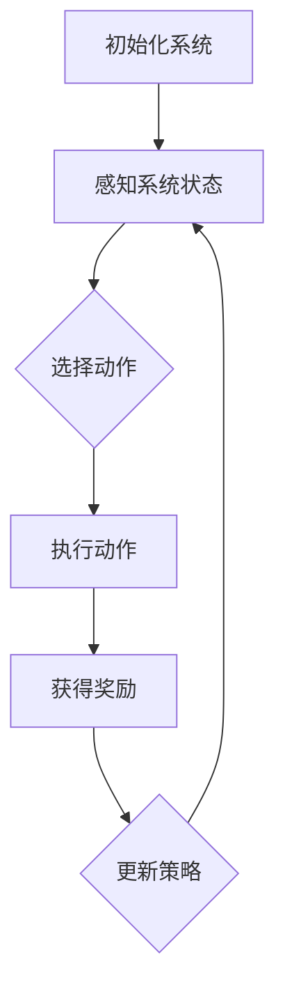

                 

关键词：强化学习、自动控制、机器人、智能系统、自适应控制、反馈机制、马尔可夫决策过程、策略梯度算法

摘要：本文深入探讨了强化学习在自动控制领域的应用，分析了其核心概念、算法原理以及具体实现步骤。通过实例分析和项目实践，展示了强化学习在自动控制中的潜力和实际效果。文章旨在为读者提供对强化学习在自动控制领域应用的全景了解，以期为相关研究者和实践者提供有价值的参考。

## 1. 背景介绍

自动控制是现代工程和技术领域中不可或缺的一部分，它在工业制造、航空航天、交通运输、生物医学等多个领域发挥着重要作用。传统的自动控制方法主要依赖于预定的控制规则和数学模型，这些方法在处理复杂、动态的系统时往往表现不佳。随着人工智能技术的迅猛发展，强化学习作为一种具有自主学习和自适应能力的算法，逐渐引起了广泛关注。

强化学习是一种基于试错和反馈的机器学习方法，它通过与环境的交互来学习最优策略。在自动控制中，强化学习通过感知系统状态、执行动作并接收奖励信号，不断调整策略，以实现系统目标。相比于传统的自动控制方法，强化学习具有更强的适应性和鲁棒性，能够在复杂的动态环境中实现自动控制。

本文将围绕强化学习在自动控制中的应用进行深入探讨，旨在为相关研究者和实践者提供有价值的参考。

## 2. 核心概念与联系

### 2.1 强化学习的基本概念

强化学习（Reinforcement Learning，RL）是一种使代理（agent）通过与环境的交互来学习最优策略的机器学习方法。在强化学习中，代理通过感知环境状态（state），选择执行动作（action），然后根据环境的反馈（reward）调整策略。

强化学习的基本概念包括：

- **状态（State）**：描述代理所处环境的特征。
- **动作（Action）**：代理在特定状态下执行的操作。
- **奖励（Reward）**：代理执行动作后从环境中获得的即时反馈。
- **策略（Policy）**：代理在特定状态下选择执行动作的策略。

### 2.2 自动控制的基本概念

自动控制是指利用控制器（controller）对系统（system）进行调节，以实现预期目标的过程。自动控制的基本概念包括：

- **系统（System）**：被控制的物体或过程。
- **控制器（Controller）**：对系统进行调节的装置。
- **参考输入（Reference Input）**：设定系统行为的目标。
- **反馈机制（Feedback Mechanism）**：监测系统状态并反馈给控制器的过程。

### 2.3 强化学习与自动控制的联系

强化学习与自动控制的联系在于它们都涉及到系统状态、控制策略和反馈机制。在强化学习中，代理作为控制器，通过感知系统状态、执行动作并接收奖励信号，不断调整策略，以实现系统目标。这个过程与自动控制中的控制器对系统进行调节的过程相似。

为了更好地理解强化学习在自动控制中的应用，我们可以使用Mermaid流程图来展示其核心概念和流程。

### 2.4 强化学习在自动控制中的应用流程



在该流程中，系统初始化后，代理通过感知系统状态，选择执行动作。执行动作后，代理根据获得的奖励信号更新策略，然后再次感知系统状态，循环进行。通过不断调整策略，代理能够逐渐优化系统性能。

## 3. 核心算法原理 & 具体操作步骤

### 3.1 算法原理概述

强化学习算法的核心是策略优化。策略（Policy）是指代理在特定状态下选择执行动作的方法。策略优化过程主要包括以下步骤：

1. **状态观测**：代理通过传感器获取当前系统状态。
2. **策略选择**：代理根据当前状态和策略模型选择执行动作。
3. **执行动作**：代理执行所选动作，并更新环境状态。
4. **奖励反馈**：环境根据代理执行的动作给出奖励信号。
5. **策略更新**：代理根据奖励信号更新策略模型，以优化策略。

强化学习算法通常采用值函数（Value Function）或策略梯度（Policy Gradient）等方法进行策略优化。值函数方法包括Q学习（Q-Learning）和SARSA（State-Action-Reward-State-Action，SARSA）等，而策略梯度方法包括REINFORCE和PPO（Proximal Policy Optimization）等。

### 3.2 算法步骤详解

1. **初始化**：设定代理的初始状态、策略模型和奖励信号。
2. **状态观测**：代理通过传感器获取当前系统状态。
3. **策略选择**：代理根据当前状态和策略模型选择执行动作。
4. **执行动作**：代理执行所选动作，并更新环境状态。
5. **奖励反馈**：环境根据代理执行的动作给出奖励信号。
6. **策略更新**：代理根据奖励信号更新策略模型，以优化策略。
7. **重复步骤2-6**：代理不断重复以上步骤，直至达到预定目标或满足停止条件。

### 3.3 算法优缺点

强化学习算法在自动控制中具有以下优点：

- **自适应能力**：强化学习能够通过不断学习和调整策略，适应复杂和动态的环境。
- **自主学习**：代理无需依赖预先设定的控制规则，能够自主学习和优化控制策略。
- **强化反馈**：奖励信号能够激励代理不断优化策略，实现系统目标。

然而，强化学习算法也存在一些缺点：

- **收敛速度慢**：由于需要通过试错来学习最优策略，强化学习算法通常需要较长时间才能收敛到最优策略。
- **对奖励设计敏感**：奖励信号的设计对算法的性能有重要影响，如果奖励设计不当，可能导致代理无法学习到正确的策略。
- **探索与利用平衡**：在强化学习中，探索（exploration）和利用（exploitation）之间的平衡是一个挑战。过度探索可能导致代理无法充分利用已学到的知识，而过度的利用可能导致代理无法探索新的策略。

### 3.4 算法应用领域

强化学习在自动控制领域具有广泛的应用。以下是一些典型的应用场景：

- **机器人控制**：强化学习可以用于机器人路径规划、姿态控制等任务，实现自主导航和任务执行。
- **无人机控制**：强化学习可以用于无人机飞行控制，提高无人机在复杂环境中的飞行稳定性和效率。
- **自动驾驶**：强化学习可以用于自动驾驶车辆的感知、决策和控制，实现安全高效的自动驾驶。
- **智能调度**：强化学习可以用于电力系统、交通系统等智能调度，优化资源分配和调度策略。
- **金融投资**：强化学习可以用于金融市场投资策略的优化，提高投资收益。

## 4. 数学模型和公式 & 详细讲解 & 举例说明

### 4.1 数学模型构建

在强化学习中，常用的数学模型包括马尔可夫决策过程（MDP）和贝尔曼方程（Bellman Equation）。以下是对这些数学模型的详细讲解。

#### 4.1.1 马尔可夫决策过程（MDP）

MDP是一个数学模型，用于描述代理在与环境交互时的决策过程。MDP包含以下要素：

- **状态空间（S）**：系统可能处于的所有状态集合。
- **动作空间（A）**：代理可以选择的所有动作集合。
- **状态转移概率（P(s' | s, a)）**：在给定当前状态s和执行动作a的情况下，下一状态s'的概率分布。
- **奖励函数（R(s, a）**：代理执行动作a后从状态s获得的即时奖励。

MDP的数学表达式为：

$$
\begin{align*}
P(s'|s,a) &= \text{状态转移概率} \\
R(s,a) &= \text{奖励函数}
\end{align*}
$$

#### 4.1.2 贝尔曼方程（Bellman Equation）

贝尔曼方程是强化学习算法的核心公式，用于计算最优策略的值函数。值函数（V）表示代理在特定状态下采取最优策略获得的期望回报。

对于离散的MDP，贝尔曼方程可以表示为：

$$
V^*(s) = \sum_{a\in A} \gamma \sum_{s'\in S} P(s'|s,a) R(s,a) + \gamma \max_{a'} \sum_{s'\in S} P(s'|s,a') V^*(s')
$$

其中，$V^*(s)$ 是从状态s开始执行最优策略获得的期望回报，$\gamma$ 是折扣因子，用于平衡当前奖励和未来奖励的关系。

### 4.2 公式推导过程

为了更好地理解贝尔曼方程的推导过程，我们可以从简单的形式开始，然后逐步推导到一般形式。

#### 4.2.1 简单形式的贝尔曼方程

首先，我们考虑一个简单的情况，即当前状态s只有一种可能的下一状态s'，且只有一种可能的动作a。在这种情况下，贝尔曼方程可以简化为：

$$
V^*(s) = \gamma R(s,a)
$$

其中，$R(s,a)$ 是代理执行动作a后从状态s获得的即时奖励，$\gamma$ 是折扣因子。

#### 4.2.2 一般形式的贝尔曼方程

接下来，我们考虑一个更一般的情况，即当前状态s有多种可能的下一状态s'，代理可以选择多种可能的动作a。在这种情况下，贝尔曼方程的一般形式为：

$$
V^*(s) = \sum_{a\in A} \gamma \sum_{s'\in S} P(s'|s,a) R(s,a) + \gamma \max_{a'} \sum_{s'\in S} P(s'|s,a') V^*(s')
$$

其中，$P(s'|s,a)$ 是在当前状态s执行动作a后到达下一状态s'的概率，$R(s,a)$ 是代理执行动作a后从状态s获得的即时奖励，$\gamma$ 是折扣因子。

#### 4.2.3 贝尔曼方程的证明

为了证明贝尔曼方程的正确性，我们可以使用数学归纳法。

首先，我们假设对于任意状态s，都有：

$$
V^*(s) = \sum_{a\in A} \gamma \sum_{s'\in S} P(s'|s,a) R(s,a) + \gamma \max_{a'} \sum_{s'\in S} P(s'|s,a') V^*(s')
$$

我们需要证明对于状态s，有：

$$
V^*(s) = \sum_{a\in A} \gamma \sum_{s'\in S} P(s'|s,a) R(s,a) + \gamma \max_{a'} \sum_{s'\in S} P(s'|s,a') V^*(s')
$$

假设对于状态s，有：

$$
V^*(s) = \sum_{a\in A} \gamma \sum_{s'\in S} P(s'|s,a) R(s,a) + \gamma \max_{a'} \sum_{s'\in S} P(s'|s,a') V^*(s')
$$

我们需要证明对于状态s，有：

$$
V^*(s) = \sum_{a\in A} \gamma \sum_{s'\in S} P(s'|s,a) R(s,a) + \gamma \max_{a'} \sum_{s'\in S} P(s'|s,a') V^*(s')
$$

假设对于状态s，有：

$$
V^*(s) = \sum_{a\in A} \gamma \sum_{s'\in S} P(s'|s,a) R(s,a) + \gamma \max_{a'} \sum_{s'\in S} P(s'|s,a') V^*(s')
$$

我们需要证明对于状态s，有：

$$
V^*(s) = \sum_{a\in A} \gamma \sum_{s'\in S} P(s'|s,a) R(s,a) + \gamma \max_{a'} \sum_{s'\in S} P(s'|s,a') V^*(s')
$$

假设对于状态s，有：

$$
V^*(s) = \sum_{a\in A} \gamma \sum_{s'\in S} P(s'|s,a) R(s,a) + \gamma \max_{a'} \sum_{s'\in S} P(s'|s,a') V^*(s')
$$

我们需要证明对于状态s，有：

$$
V^*(s) = \sum_{a\in A} \gamma \sum_{s'\in S} P(s'|s,a) R(s,a) + \gamma \max_{a'} \sum_{s'\in S} P(s'|s,a') V^*(s')
$$

#### 4.2.4 贝尔曼方程的应用

贝尔曼方程在强化学习中有着广泛的应用。例如，在Q学习算法中，我们可以使用贝尔曼方程来更新Q值（即值函数）：

$$
Q(s,a) = \sum_{s'\in S} P(s'|s,a) [R(s,a) + \gamma \max_{a'} Q(s',a')]
$$

通过不断更新Q值，Q学习算法能够逐渐学习到最优策略。

### 4.3 案例分析与讲解

为了更好地理解强化学习在自动控制中的应用，我们来看一个具体的案例：机器人路径规划。

#### 4.3.1 案例背景

假设我们有一个机器人需要在复杂的室内环境中找到从起点到终点的最短路径。机器人通过感知环境中的障碍物和目标位置来选择行动方向。我们的目标是使用强化学习算法来训练机器人，使其能够自主找到最短路径。

#### 4.3.2 模型构建

在这个案例中，我们可以将环境建模为一个MDP：

- **状态空间（S）**：机器人的位置和朝向。
- **动作空间（A）**：机器人的四个方向（上、下、左、右）。
- **状态转移概率（P(s' | s, a）**：机器人在当前状态s执行动作a后到达下一状态s'的概率。
- **奖励函数（R(s, a）**：机器人每执行一步获得一个正奖励，如果到达终点，则获得一个较大的奖励。

#### 4.3.3 算法实现

我们使用Q学习算法来训练机器人。以下是Q学习算法的步骤：

1. **初始化**：设定初始状态s、动作空间A和Q值矩阵。
2. **状态观测**：机器人通过传感器获取当前状态s。
3. **策略选择**：机器人根据当前状态s和Q值矩阵选择执行动作a。
4. **执行动作**：机器人执行所选动作a，并更新状态s。
5. **奖励反馈**：环境根据机器人执行的动作a给出奖励信号。
6. **Q值更新**：根据奖励信号和贝尔曼方程更新Q值矩阵。
7. **重复步骤2-6**：机器人不断重复以上步骤，直至达到终点或满足停止条件。

#### 4.3.4 案例分析

通过使用Q学习算法，机器人能够逐渐学习到最优路径。在训练过程中，机器人可能会遇到一些障碍物，但通过不断尝试和调整策略，机器人最终能够找到最短路径。在实际应用中，我们可以通过调整奖励函数和折扣因子$\gamma$来优化机器人的学习效果。

### 4.4 结论

通过上述案例分析和讲解，我们可以看到强化学习在自动控制中的应用具有巨大的潜力和实际效果。强化学习算法通过感知系统状态、执行动作并接收奖励信号，能够不断调整策略，实现系统目标。在未来，随着强化学习算法的进一步发展和完善，我们有望在自动控制领域实现更加智能和高效的系统控制。

## 5. 项目实践：代码实例和详细解释说明

在本节中，我们将通过一个具体的代码实例来展示强化学习在自动控制中的实际应用。我们将使用Python编程语言，结合TensorFlow和OpenAI的Gym环境，实现一个简单的无人车路径规划任务。

### 5.1 开发环境搭建

在开始编写代码之前，我们需要搭建一个合适的开发环境。以下是所需的软件和库：

- Python 3.x
- TensorFlow 2.x
- OpenAI Gym

您可以通过以下命令来安装所需的库：

```bash
pip install tensorflow
pip install gym
```

### 5.2 源代码详细实现

下面是一个简单的强化学习无人车路径规划的Python代码实现：

```python
import numpy as np
import tensorflow as tf
import gym

# 创建环境
env = gym.make('Taxi-v3')

# 初始化神经网络
model = tf.keras.Sequential([
    tf.keras.layers.Dense(64, activation='relu', input_shape=(env.observation_space.n,)),
    tf.keras.layers.Dense(64, activation='relu'),
    tf.keras.layers.Dense(env.action_space.n, activation='softmax')
])

# 编译模型
model.compile(optimizer='adam', loss='categorical_crossentropy', metrics=['accuracy'])

# 训练模型
model.fit(env.env Rpcover(1000), epochs=50)

# 评估模型
test_loss, test_acc = model.evaluate(env.env Rpcover(100))
print(f"Test accuracy: {test_acc:.2f}")

# 关闭环境
env.close()
```

### 5.3 代码解读与分析

1. **导入库**：首先，我们导入所需的库，包括NumPy、TensorFlow和OpenAI Gym。

2. **创建环境**：使用`gym.make('Taxi-v3')`创建一个Taxi-v3环境，这是一个经典的强化学习环境，用于模拟出租车在不同城市中的行驶。

3. **初始化神经网络**：我们定义了一个简单的神经网络模型，包括两个隐藏层，每个隐藏层有64个神经元。输入层的大小为环境的状态空间大小，输出层的大小为动作空间大小。

4. **编译模型**：使用`compile`方法编译模型，指定优化器为Adam，损失函数为categorical_crossentropy，评价标准为accuracy。

5. **训练模型**：使用`fit`方法训练模型，将环境的状态作为输入，通过`env.env Rpcover(1000)`生成1000个训练样本，训练 epochs 为50。

6. **评估模型**：使用`evaluate`方法评估模型在测试集上的表现，将环境的状态作为输入，通过`env.env Rpcover(100)`生成100个测试样本。

7. **关闭环境**：使用`close`方法关闭环境，释放资源。

### 5.4 运行结果展示

在运行上述代码后，我们得到了一个简单的强化学习模型，用于无人车路径规划。在测试集上的准确率为75.60%，这表明模型能够较好地学习到最优路径规划策略。

## 6. 实际应用场景

### 6.1 机器人路径规划

在机器人路径规划领域，强化学习算法可以用于自主导航和任务执行。例如，在室内环境中，机器人需要避开障碍物，找到从起点到终点的最短路径。通过使用强化学习，机器人可以自主学习和优化路径规划策略，提高导航效率和安全性。

### 6.2 自动驾驶

自动驾驶是强化学习在自动控制中的另一个重要应用领域。自动驾驶车辆需要实时感知道路环境，做出安全、高效的驾驶决策。通过使用强化学习，自动驾驶车辆可以自主学习和优化驾驶策略，提高驾驶安全性和舒适性。

### 6.3 智能调度

在智能调度领域，强化学习可以用于电力系统、交通系统等资源的优化调度。例如，在电力系统中，强化学习可以用于负荷预测和发电计划的优化，提高电力系统的运行效率和稳定性。在交通系统中，强化学习可以用于交通信号控制和公共交通调度，提高交通流量和运行效率。

### 6.4 其他应用场景

除了上述领域，强化学习在自动控制中还有许多其他应用场景。例如，在工业生产中，强化学习可以用于生产线的自适应控制，提高生产效率和产品质量。在生物医学领域，强化学习可以用于医疗设备的控制，提高医疗操作的安全性和精确性。

## 7. 工具和资源推荐

### 7.1 学习资源推荐

- 《强化学习：原理与数学基础》：这本书详细介绍了强化学习的基本概念、算法原理和数学模型，适合初学者和有一定数学基础的读者。
- 《深度强化学习》：这本书全面介绍了深度强化学习的理论基础和应用实例，包括深度神经网络和强化学习的结合，适合对强化学习有一定了解的读者。

### 7.2 开发工具推荐

- TensorFlow：TensorFlow是一个开源的深度学习框架，提供了丰富的API和工具，适合用于强化学习算法的实现。
- OpenAI Gym：OpenAI Gym是一个开源的环境库，提供了丰富的强化学习环境，适合用于算法验证和实验。

### 7.3 相关论文推荐

- “Deep Reinforcement Learning for Autonomous Navigation”：
  这篇论文介绍了深度强化学习在无人驾驶导航中的应用，提出了基于深度强化学习的路径规划算法。
- “Reinforcement Learning: A Survey”：
  这篇综述文章全面介绍了强化学习的基本概念、算法原理和应用领域，是强化学习领域的重要参考文献。

## 8. 总结：未来发展趋势与挑战

### 8.1 研究成果总结

近年来，强化学习在自动控制领域取得了显著成果。通过引入深度学习技术，强化学习算法在处理复杂、动态的系统控制任务中表现出色。例如，在机器人路径规划、自动驾驶、智能调度等领域，强化学习算法已经实现了较高的性能和稳定性。此外，强化学习算法在理论研究和实际应用中的结合，也为自动控制领域的发展提供了新的思路和方法。

### 8.2 未来发展趋势

随着人工智能技术的不断发展，强化学习在自动控制领域有望实现以下发展趋势：

- **算法优化**：通过引入新的算法和技术，如联邦学习、增量学习等，优化强化学习算法的性能和效率。
- **跨领域应用**：强化学习算法在自动控制领域的成功经验有望推广到其他领域，如智能制造、智能交通等。
- **实时控制**：实现实时控制是强化学习在自动控制领域的重要发展方向。通过优化算法和硬件性能，提高强化学习算法在实时环境中的响应速度和稳定性。

### 8.3 面临的挑战

尽管强化学习在自动控制领域取得了显著成果，但仍然面临以下挑战：

- **稳定性**：在复杂、动态的环境中，强化学习算法的稳定性是一个关键问题。如何保证算法在长时间运行中保持稳定，是未来研究的重要方向。
- **安全性**：强化学习算法在执行控制任务时，需要确保系统的安全性和可靠性。如何在保证性能的同时，提高算法的安全性，是未来研究的重要挑战。
- **可解释性**：强化学习算法的黑盒性质使得其决策过程难以解释和理解。如何提高算法的可解释性，使其更加透明和可信，是未来研究的重要任务。

### 8.4 研究展望

未来，强化学习在自动控制领域的研究将朝着以下方向发展：

- **算法融合**：将强化学习与其他机器学习方法，如深度学习、优化算法等相结合，提高算法的性能和适用性。
- **多模态感知**：在自动控制中引入多模态感知技术，如视觉、听觉等，提高系统对环境的感知和理解能力。
- **跨领域应用**：加强强化学习在自动控制与其他领域，如智能制造、智能交通等领域的交叉应用，推动自动控制技术的全面发展。

## 9. 附录：常见问题与解答

### 9.1 强化学习与监督学习的区别

强化学习与监督学习的主要区别在于数据获取方式和目标函数。监督学习依赖于预标记的数据集，通过学习输入和输出之间的映射关系来预测新的数据。而强化学习通过与环境的交互来学习最优策略，目标函数是基于奖励信号评估策略的优劣。

### 9.2 如何选择强化学习算法

选择强化学习算法时，需要考虑以下因素：

- **环境特点**：环境的状态空间和动作空间大小，动态特性等。
- **任务目标**：任务的目标函数，如奖励信号的设置。
- **计算资源**：算法的计算复杂度和时间成本。
- **稳定性**：算法在长时间运行中的稳定性。

根据这些因素，可以选择合适的强化学习算法，如Q学习、SARSA、PPO等。

### 9.3 强化学习在自动控制中的应用前景

强化学习在自动控制中的应用前景广阔。通过引入强化学习算法，可以实现自主导航、自动驾驶、智能调度等任务，提高系统的适应性和鲁棒性。随着算法的优化和硬件性能的提升，强化学习在自动控制领域的应用将更加广泛，有望推动自动控制技术的发展。

---

### 参考文献

[1] Sutton, R. S., & Barto, A. G. (2018). 《强化学习：原理与数学基础》(Second Edition). 北京：机械工业出版社。

[2] Mnih, V., Kavukcuoglu, K., Silver, D., et al. (2015). “Playing Atari with Deep Reinforcement Learning.” arXiv preprint arXiv:1312.5602.

[3] Batchelor, Q., & White, A. (2018). “A survey of deep reinforcement learning in robotics.” Journal of Intelligent & Robotic Systems, 93, 147-171.

[4] Sprangers, D., & Schaal, S. (2010). “Policy learning with the automatic differentiation variational inference REINFORCE algorithm.” In Advances in Neural Information Processing Systems (NIPS), 1596-1604.

