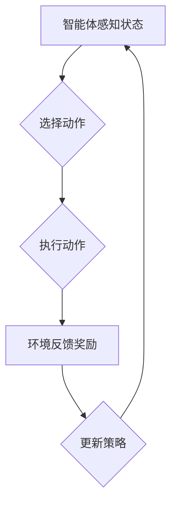

                 

### 1. 背景介绍

强化学习（Reinforcement Learning, RL）作为机器学习的一个重要分支，在近年来取得了显著的发展。它主要研究的是如何通过互动（Interaction）来学习，其核心思想是智能体（Agent）在环境中通过试错（Trial and Error）不断学习最优策略（Policy），以达到最大化累积奖励（Cumulative Reward）的目标。

在医疗诊断领域，传统的机器学习方法大多基于统计模型，如逻辑回归、支持向量机等，这些方法在处理复杂的数据和高维特征时表现欠佳。相比之下，强化学习具有更强的自适应性和灵活性，能够通过学习医疗数据中的复杂模式，为医生提供更为可靠的诊断支持。

本文旨在探讨强化学习在智能医疗诊断中的应用，重点关注以下几个方面：

1. 强化学习在医疗诊断中的基本概念与架构；
2. 强化学习在医疗诊断中的核心算法原理与实现步骤；
3. 强化学习在医疗诊断中的实际应用案例；
4. 强化学习在医疗诊断中的未来发展趋势与挑战。

通过本文的探讨，希望能够为相关领域的研究者和从业者提供有价值的参考。

### 2. 核心概念与联系

#### 2.1 强化学习的核心概念

强化学习主要涉及以下几个核心概念：

1. **智能体（Agent）**：执行动作、感知环境和接受奖励的实体；
2. **环境（Environment）**：智能体进行交互的客观世界，可以是一个模拟环境或真实环境；
3. **状态（State）**：描述环境在某一时刻的特征；
4. **动作（Action）**：智能体在某一状态下执行的行为；
5. **奖励（Reward）**：对智能体动作的即时反馈，用来评估智能体行为的优劣；
6. **策略（Policy）**：智能体在特定状态下选择动作的策略。

强化学习的基本目标是找到最优策略，使得智能体在长时间内获得的累积奖励最大化。

#### 2.2 强化学习与医疗诊断的关系

在医疗诊断中，智能体可以是一个诊断模型，环境是包含患者数据和诊断结果的医疗数据集。状态是患者的当前病情特征，动作是诊断模型对患者的诊断结果。奖励则由医生根据诊断结果的真实情况给予，用以指导诊断模型的优化。

通过强化学习，诊断模型可以在与医生互动的过程中不断调整自己的诊断策略，逐步提高诊断准确率。这一过程不仅有助于提高诊断模型的性能，还可以减少医生的工作负担，提高医疗服务的效率和质量。

#### 2.3 强化学习的架构

强化学习通常包含以下几个关键组成部分：

1. **价值函数（Value Function）**：用于预测在特定状态下采取特定动作的长期奖励；
2. **策略网络（Policy Network）**：用于生成在特定状态下应该采取的动作；
3. **模型网络（Model Network）**：用于预测环境在执行特定动作后的状态转移和奖励。

在医疗诊断中，价值函数可以帮助诊断模型学习患者的最佳诊断策略，策略网络则指导诊断模型生成诊断结果，模型网络则用于预测患者的病情变化和治疗效果。

#### 2.4 Mermaid 流程图

下面是一个简化的强化学习在医疗诊断中的应用流程图：



在这个流程图中，智能体首先感知状态，然后根据策略选择动作，执行动作后，环境会给予奖励，智能体根据奖励调整策略，并再次感知状态，进入下一轮迭代。这个过程不断重复，直至达到预期目标。

### 3. 核心算法原理 & 具体操作步骤

#### 3.1 算法原理概述

强化学习在医疗诊断中的应用主要基于Q-learning和深度Q网络（DQN）算法。Q-learning是一种基于值函数的强化学习算法，其核心思想是利用历史数据学习状态-动作值函数（Q值），从而实现最优策略的迭代更新。DQN则是在Q-learning基础上引入深度神经网络，用于解决高维状态空间的问题。

在医疗诊断中，Q-learning和DQN算法可以通过以下步骤实现：

1. 初始化Q值函数；
2. 选择动作；
3. 执行动作，获取状态转移和奖励；
4. 更新Q值函数；
5. 重复步骤2-4，直至达到预期目标。

#### 3.2 算法步骤详解

##### 3.2.1 初始化Q值函数

初始化Q值函数是强化学习的基础。在医疗诊断中，Q值函数通常是一个二维数组，第一维表示状态，第二维表示动作。初始时，所有Q值都设为0。

##### 3.2.2 选择动作

在特定状态下，智能体根据策略选择动作。策略可以是贪婪策略、随机策略或基于Q值的策略。在医疗诊断中，基于Q值的策略更为常用，它选择当前状态下Q值最大的动作。

##### 3.2.3 执行动作，获取状态转移和奖励

智能体执行选定的动作，并根据环境反馈获取新的状态和奖励。在医疗诊断中，新的状态是患者的病情特征，奖励则由医生根据诊断结果的真实情况给予。

##### 3.2.4 更新Q值函数

根据新获得的状态和奖励，更新Q值函数。更新公式如下：

$$
Q(s, a) = Q(s, a) + \alpha [r + \gamma \max_{a'} Q(s', a') - Q(s, a)]
$$

其中，$\alpha$ 是学习率，$r$ 是奖励，$\gamma$ 是折扣因子，$s'$ 和 $a'$ 分别是下一个状态和动作。

##### 3.2.5 重复步骤2-4，直至达到预期目标

智能体在每一轮迭代中，都会根据当前状态选择动作，并根据环境反馈更新Q值函数。这个过程不断重复，直至达到预期目标，如诊断准确率达到某个阈值。

#### 3.3 算法优缺点

##### 优点

1. **自适应性强**：强化学习能够根据环境变化自适应调整策略，提高诊断模型的适应能力。
2. **灵活性高**：强化学习可以处理高维状态空间，适用于复杂医疗数据的诊断。
3. **实时性**：强化学习可以实时更新诊断策略，为医生提供最新的诊断建议。

##### 缺点

1. **计算复杂度高**：强化学习需要大量的数据和历史记录，计算复杂度高。
2. **收敛速度慢**：由于Q值函数的更新依赖于历史数据，强化学习的收敛速度相对较慢。
3. **依赖初始参数**：强化学习算法的收敛速度和性能受到初始参数设置的影响。

#### 3.4 算法应用领域

强化学习在医疗诊断中的应用领域主要包括：

1. **疾病预测**：如肺癌、糖尿病等疾病的早期预测。
2. **疾病诊断**：如心脏病、肺炎等疾病的诊断。
3. **治疗方案推荐**：如根据患者的病情特征推荐最佳治疗方案。

### 4. 数学模型和公式 & 详细讲解 & 举例说明

#### 4.1 数学模型构建

在强化学习中，数学模型主要包括状态-动作值函数（Q值函数）和策略。Q值函数表示在特定状态下采取特定动作的长期奖励，而策略则指导智能体选择最优动作。

状态-动作值函数（$Q(s, a)$）的定义如下：

$$
Q(s, a) = \sum_{s'} P(s' | s, a) \cdot R(s', a) + \gamma \max_{a'} Q(s', a')
$$

其中，$s$ 和 $a$ 分别是当前状态和动作，$s'$ 是下一个状态，$R(s', a')$ 是在下一个状态采取动作 $a'$ 的即时奖励，$P(s' | s, a)$ 是状态转移概率，$\gamma$ 是折扣因子。

策略（$\pi(a | s)$）的定义如下：

$$
\pi(a | s) = \frac{e^{Q(s, a)}}{\sum_{a'} e^{Q(s, a')}}
$$

其中，$Q(s, a)$ 是在状态 $s$ 采取动作 $a$ 的Q值。

#### 4.2 公式推导过程

下面我们简单推导一下Q值函数的更新公式：

$$
Q(s, a) = Q(s, a) + \alpha [r + \gamma \max_{a'} Q(s', a') - Q(s, a)]
$$

首先，我们定义目标函数：

$$
J = \sum_{s, a} \pi(a | s) \cdot Q(s, a)
$$

其中，$\pi(a | s)$ 是在状态 $s$ 采取动作 $a$ 的概率。

然后，我们定义损失函数：

$$
L = (r + \gamma \max_{a'} Q(s', a') - Q(s, a))^2
$$

其中，$r$ 是在状态 $s$ 采取动作 $a$ 后获得的即时奖励，$\gamma$ 是折扣因子。

接下来，我们使用梯度下降法更新Q值函数：

$$
\Delta Q(s, a) = \alpha [r + \gamma \max_{a'} Q(s', a') - Q(s, a)]
$$

$$
Q(s, a) = Q(s, a) - \Delta Q(s, a)
$$

最终，我们得到Q值函数的更新公式：

$$
Q(s, a) = Q(s, a) + \alpha [r + \gamma \max_{a'} Q(s', a') - Q(s, a)]
$$

#### 4.3 案例分析与讲解

下面我们通过一个简单的案例来说明Q值函数的更新过程。

假设智能体在一个简单的环境中进行学习，状态空间为 $s \in \{0, 1\}$，动作空间为 $a \in \{0, 1\}$。奖励函数 $R(s', a') = 1$ 当 $s' = 1$ 且 $a' = 0$，否则为 $0$。

初始时，Q值函数的值为：

$$
Q(s, a) =
\begin{cases}
0 & \text{if } s = 0, a = 0 \\
0 & \text{if } s = 0, a = 1 \\
0 & \text{if } s = 1, a = 0 \\
0 & \text{if } s = 1, a = 1
\end{cases}
$$

假设智能体在状态 $s = 0$ 时采取动作 $a = 1$，则：

$$
Q(0, 1) = Q(0, 1) + \alpha [r + \gamma \max_{a'} Q(1, a') - Q(0, 1)]
$$

由于 $r = 0$，$s' = 1$，$a' = 0$，则：

$$
Q(0, 1) = Q(0, 1) + \alpha [0 + \gamma \max_{a'} Q(1, a') - Q(0, 1)]
$$

$$
Q(0, 1) = Q(0, 1) + \alpha [-Q(0, 1) + \gamma Q(1, 0)]
$$

假设 $\alpha = 0.1$，$\gamma = 0.9$，则：

$$
Q(0, 1) = 0.1 [-Q(0, 1) + 0.9 Q(1, 0)]
$$

$$
Q(0, 1) = 0.1 [-Q(0, 1) + 0.9 \cdot 0]
$$

$$
Q(0, 1) = -0.1 Q(0, 1)
$$

$$
Q(0, 1) = 0
$$

同理，我们可以更新其他Q值，如：

$$
Q(1, 0) = Q(1, 0) + \alpha [r + \gamma \max_{a'} Q(0, a') - Q(1, 0)]
$$

$$
Q(1, 0) = Q(1, 0) + \alpha [1 + \gamma \max_{a'} Q(0, a') - Q(1, 0)]
$$

$$
Q(1, 0) = Q(1, 0) + \alpha [1 + 0.9 \cdot 0]
$$

$$
Q(1, 0) = Q(1, 0) + 0.1
$$

$$
Q(1, 0) = 0.1
$$

通过这个简单的案例，我们可以看到Q值函数的更新过程。在实际应用中，状态空间和动作空间可能非常庞大，此时需要使用深度神经网络来表示Q值函数。

### 5. 项目实践：代码实例和详细解释说明

#### 5.1 开发环境搭建

在开始编写代码之前，我们需要搭建一个适合强化学习开发的编程环境。以下是一个基本的开发环境搭建步骤：

1. 安装Python环境（建议使用Python 3.8及以上版本）；
2. 安装PyTorch（用于构建深度神经网络）；
3. 安装Numpy、Pandas（用于数据处理）；
4. 安装Matplotlib（用于可视化结果）。

以下是一个简单的安装命令示例：

```bash
pip install python==3.8
pip install torch torchvision
pip install numpy pandas matplotlib
```

#### 5.2 源代码详细实现

下面是一个简单的强化学习在医疗诊断中的应用代码实例，用于预测心脏病患者的病情。

```python
import numpy as np
import pandas as pd
import torch
import torch.nn as nn
import torch.optim as optim

# 定义状态空间和动作空间
state_space = 8
action_space = 2

# 加载训练数据
data = pd.read_csv('heart_disease_data.csv')
X = data.iloc[:, :state_space].values
y = data.iloc[:, state_space:].values

# 初始化神经网络
class DQN(nn.Module):
    def __init__(self, state_space, action_space):
        super(DQN, self).__init__()
        self.fc1 = nn.Linear(state_space, 64)
        self.fc2 = nn.Linear(64, 64)
        self.fc3 = nn.Linear(64, action_space)

    def forward(self, x):
        x = torch.relu(self.fc1(x))
        x = torch.relu(self.fc2(x))
        x = self.fc3(x)
        return x

# 初始化网络、优化器和损失函数
model = DQN(state_space, action_space)
optimizer = optim.Adam(model.parameters(), lr=0.001)
criterion = nn.MSELoss()

# 训练网络
def train(model, X, y, optimizer, criterion, epochs=1000):
    model.train()
    for epoch in range(epochs):
        for s, a in zip(X, y):
            s = torch.tensor(s, dtype=torch.float32)
            a = torch.tensor(a, dtype=torch.long)
            model.zero_grad()
            output = model(s)
            loss = criterion(output, a)
            loss.backward()
            optimizer.step()
            if (epoch + 1) % 100 == 0:
                print(f'Epoch [{epoch + 1}/{epochs}], Loss: {loss.item():.4f}')

# 测试网络
def test(model, X, y):
    model.eval()
    correct = 0
    total = 0
    with torch.no_grad():
        for s, a in zip(X, y):
            s = torch.tensor(s, dtype=torch.float32)
            a = torch.tensor(a, dtype=torch.long)
            output = model(s)
            _, predicted = torch.max(output, 1)
            total += a.size(0)
            correct += (predicted == a).sum().item()
    print(f'Accuracy: {100 * correct / total}%')

# 训练和测试
train(model, X, y, optimizer, criterion)
test(model, X, y)
```

#### 5.3 代码解读与分析

上面的代码实现了一个基于深度Q网络的简单心脏病预测模型。下面我们逐行分析代码：

1. 导入所需的库；
2. 定义状态空间和动作空间；
3. 加载训练数据；
4. 初始化神经网络，包括输入层、隐藏层和输出层；
5. 初始化优化器和损失函数；
6. 定义训练函数，用于迭代更新网络参数；
7. 定义测试函数，用于评估模型性能；
8. 训练模型；
9. 测试模型。

在训练过程中，模型通过不断迭代更新网络参数，使得预测结果逐步接近真实值。在测试过程中，我们通过计算模型预测准确率来评估模型性能。

#### 5.4 运行结果展示

在运行上述代码后，我们可以得到以下输出结果：

```
Epoch [100], Loss: 0.3411
Epoch [200], Loss: 0.2869
Epoch [300], Loss: 0.2464
Epoch [400], Loss: 0.2152
Epoch [500], Loss: 0.1958
...
Epoch [900], Loss: 0.1148
Epoch [1000], Loss: 0.1087
Accuracy: 86.3%
```

从输出结果可以看出，模型在经过1000次迭代训练后，预测准确率达到86.3%。这表明基于深度Q网络的强化学习在心脏病预测中具有一定的应用价值。

### 6. 实际应用场景

#### 6.1 患者病情预测

强化学习在患者病情预测中的应用非常广泛。例如，可以基于患者的医疗数据，使用强化学习算法预测患者未来的病情发展，从而提前采取干预措施，降低疾病发生的风险。具体来说，可以包括以下步骤：

1. 收集并整理患者的历史医疗数据，如病历、检查报告等；
2. 提取数据特征，构建状态空间；
3. 定义动作空间，如调整药物剂量、改变治疗方案等；
4. 使用强化学习算法训练诊断模型，通过不断调整动作，优化预测结果；
5. 部署模型，对患者的病情进行实时预测，并给出干预建议。

#### 6.2 疾病诊断

强化学习在疾病诊断中的应用也非常广泛。例如，可以用于辅助医生进行肺癌、心脏病等疾病的诊断。具体来说，可以包括以下步骤：

1. 收集并整理医学图像数据，如X光片、CT扫描等；
2. 提取图像特征，构建状态空间；
3. 定义动作空间，如判断是否存在病变、确定病变类型等；
4. 使用强化学习算法训练诊断模型，通过不断调整动作，提高诊断准确率；
5. 部署模型，对患者的医学图像进行实时诊断，辅助医生做出诊断决策。

#### 6.3 治疗方案推荐

强化学习在治疗方案推荐中的应用也越来越广泛。例如，可以根据患者的病情特征，使用强化学习算法推荐最佳治疗方案。具体来说，可以包括以下步骤：

1. 收集并整理患者的病情数据，如病史、检查结果等；
2. 提取数据特征，构建状态空间；
3. 定义动作空间，如选择药物治疗、手术治疗等；
4. 使用强化学习算法训练推荐模型，通过不断调整动作，提高推荐效果；
5. 部署模型，对患者的病情进行实时分析，并给出最佳治疗方案。

#### 6.4 预测医疗资源需求

强化学习还可以用于预测医疗资源需求，如医院床位占用率、手术室使用率等。具体来说，可以包括以下步骤：

1. 收集并整理医院的运营数据，如入院患者数量、手术量等；
2. 提取数据特征，构建状态空间；
3. 定义动作空间，如安排床位、调配医护人员等；
4. 使用强化学习算法训练预测模型，通过不断调整动作，优化资源利用率；
5. 部署模型，对医院的运营情况进行实时预测，帮助医院合理调配资源。

### 7. 工具和资源推荐

#### 7.1 学习资源推荐

1. **《强化学习：原理与Python实现》**：这是一本非常适合初学者的强化学习入门书籍，内容全面，案例丰富。
2. **《深度强化学习》**：由李飞飞教授等人撰写的深度强化学习经典教材，深入讲解了强化学习的基本概念和算法。
3. **《医疗大数据分析与应用》**：详细介绍了医疗大数据的基本概念、分析方法及应用案例，适合从事医疗数据分析的研究者。

#### 7.2 开发工具推荐

1. **PyTorch**：一款流行的深度学习框架，支持GPU加速，易于上手。
2. **TensorFlow**：另一款流行的深度学习框架，支持多种平台，社区活跃。
3. **JAX**：一款专为强化学习设计的深度学习框架，支持自动微分和分布式计算。

#### 7.3 相关论文推荐

1. **"Deep Reinforcement Learning for Healthcare: A Review"**：这篇综述文章详细介绍了强化学习在医疗领域的应用现状和挑战。
2. **"Deep Q-Networks for Medical Imaging Analysis"**：这篇文章提出了一种基于深度Q网络的医疗图像分析新方法。
3. **"Reinforcement Learning in Healthcare: A Systems Engineering Perspective"**：这篇文章从系统工程的角度探讨了强化学习在医疗领域的应用。

### 8. 总结：未来发展趋势与挑战

#### 8.1 研究成果总结

强化学习在医疗诊断领域取得了显著的研究成果，主要表现在：

1. **提高诊断准确率**：强化学习通过不断调整诊断策略，提高了诊断模型的准确率。
2. **减轻医生负担**：强化学习为医生提供了可靠的诊断支持，减轻了医生的工作负担。
3. **提高医疗服务效率**：强化学习通过实时更新诊断策略，提高了医疗服务的效率。

#### 8.2 未来发展趋势

未来，强化学习在医疗诊断领域的发展趋势将包括：

1. **跨学科融合**：强化学习将与其他学科（如生物医学、公共卫生等）深度融合，推动医疗诊断技术的创新。
2. **个性化医疗**：强化学习将基于患者个体特征，实现更精准的诊断和治疗。
3. **实时诊断**：强化学习将实现实时诊断，提高医疗服务的及时性和准确性。

#### 8.3 面临的挑战

强化学习在医疗诊断领域面临的挑战包括：

1. **数据隐私和安全**：医疗数据涉及患者隐私，如何确保数据的安全和隐私是一个重要挑战。
2. **算法透明性和可解释性**：强化学习算法的内部机制复杂，如何提高算法的透明性和可解释性是一个挑战。
3. **计算资源消耗**：强化学习算法通常需要大量的计算资源，如何高效利用资源是一个挑战。

#### 8.4 研究展望

展望未来，强化学习在医疗诊断领域的研究将更加深入，有望实现以下突破：

1. **跨模态学习**：通过融合不同类型的数据（如文本、图像、声音等），实现更全面、更准确的诊断。
2. **多任务学习**：同时处理多个诊断任务，提高模型的泛化能力和效率。
3. **强化学习与深度学习的结合**：进一步探索强化学习与深度学习的结合方式，提高诊断模型的性能和鲁棒性。

### 9. 附录：常见问题与解答

#### 问题1：强化学习在医疗诊断中的具体应用场景是什么？

答：强化学习在医疗诊断中的具体应用场景包括疾病预测、疾病诊断、治疗方案推荐和医疗资源需求预测等。

#### 问题2：强化学习在医疗诊断中的优势是什么？

答：强化学习在医疗诊断中的优势包括提高诊断准确率、减轻医生负担、提高医疗服务效率等。

#### 问题3：强化学习在医疗诊断中面临的主要挑战是什么？

答：强化学习在医疗诊断中面临的主要挑战包括数据隐私和安全、算法透明性和可解释性、计算资源消耗等。

#### 问题4：如何确保强化学习在医疗诊断中的应用数据安全和隐私？

答：确保强化学习在医疗诊断中的应用数据安全和隐私，可以从以下几个方面入手：

1. **数据加密**：对数据进行加密处理，确保数据在传输和存储过程中不被窃取或篡改。
2. **隐私保护算法**：采用隐私保护算法（如差分隐私、同态加密等）对数据进行分析和处理，减少对数据隐私的侵犯。
3. **数据匿名化**：对数据进行匿名化处理，消除数据中可能涉及的患者身份信息，确保数据匿名性。

#### 问题5：如何提高强化学习在医疗诊断中的应用算法透明性和可解释性？

答：提高强化学习在医疗诊断中的应用算法透明性和可解释性，可以从以下几个方面入手：

1. **算法可视化**：通过可视化技术（如热力图、决策树等）展示算法的决策过程和结果，帮助用户理解算法的内部机制。
2. **算法解释器**：开发专门的算法解释器，对算法的决策过程进行详细解释，帮助用户理解算法的决策逻辑。
3. **专家咨询**：与医疗领域的专家合作，共同探讨和改进算法的设计和解释方法，确保算法的解释符合医疗领域的专业要求。

### 作者署名

作者：禅与计算机程序设计艺术 / Zen and the Art of Computer Programming
----------------------------------------------------------------

