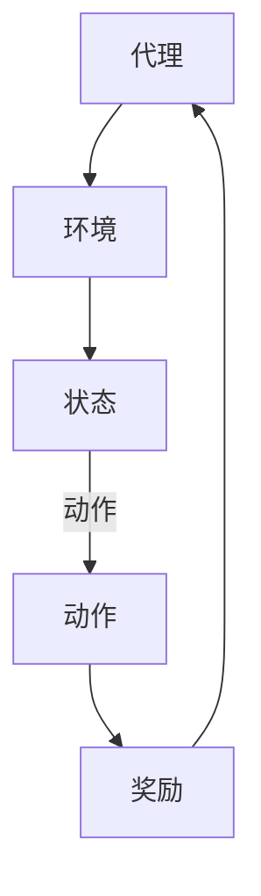

                 

强化学习是机器学习领域的一个重要分支，其核心在于通过奖励机制来指导算法的学习过程，从而实现自适应决策。随着电子游戏产业的蓬勃发展，强化学习在电子游戏中的应用日益广泛。本文旨在探讨强化学习在电子游戏中的核心概念、算法原理、数学模型以及实际应用，以期为广大读者提供一次深入了解的机会。

## 文章关键词

强化学习、电子游戏、机器学习、智能决策、自适应控制

## 文章摘要

本文首先介绍了强化学习的背景和发展历程，随后深入探讨了强化学习在电子游戏中的应用场景和优势。通过具体的算法原理和数学模型讲解，本文进一步展示了强化学习在电子游戏中的实践应用，包括游戏AI的智能行为和游戏策略优化。最后，本文对强化学习在电子游戏中的未来应用展望进行了探讨。

## 1. 背景介绍

### 1.1 强化学习的起源与发展

强化学习（Reinforcement Learning，RL）最早可以追溯到20世纪50年代。当时，心理学研究揭示了动物和人类在复杂环境中通过试错（trial-and-error）来学习的过程。这一现象启发了计算机科学家和心理学家开始研究如何通过算法模拟这种学习过程。

1970年代，强化学习开始逐渐形成体系。当时，美国斯坦福大学的Andrew Barto和Richard Sutton合著的《Reinforcement Learning: An Introduction》成为了强化学习领域的经典教材，为后续的研究提供了坚实的基础。

进入21世纪，随着深度学习（Deep Learning，DL）的兴起，强化学习得到了前所未有的发展。深度强化学习（Deep Reinforcement Learning，DRL）通过将深度神经网络（Deep Neural Network，DNN）与强化学习结合，大大提升了算法的复杂环境下的表现。AlphaGo、OpenAI的Dota 2 AI等知名案例，使得强化学习在电子游戏领域得到了广泛关注。

### 1.2 电子游戏的起源与发展

电子游戏作为一种新兴的娱乐形式，起源于20世纪60年代。当时，计算机科学家为了展示计算机的娱乐功能，开始开发简单的游戏程序。这些游戏通常只有黑白画面，操作简单，但为电子游戏的发展奠定了基础。

1970年代，随着计算机硬件的进步，电子游戏开始进入大众视野。游戏机、街机等硬件设备的出现，使得电子游戏得到了广泛传播。经典游戏如《Pong》、《Space Invaders》等，成为了那个时代的标志。

进入21世纪，随着互联网的普及，电子游戏产业迎来了爆发式增长。网络游戏、移动游戏、虚拟现实游戏等新兴形式，使得电子游戏成为了一个庞大的市场。根据市场研究数据，全球电子游戏市场规模已超过千亿美元。

## 2. 核心概念与联系

强化学习的核心概念包括代理（Agent）、环境（Environment）、状态（State）、动作（Action）和奖励（Reward）。这些概念之间有着紧密的联系，构成了强化学习的核心框架。

下面是强化学习核心概念的 Mermaid 流程图：



### 2.1 代理（Agent）

代理是强化学习中的核心实体，它代表了进行学习的实体。代理可以通过与环境交互，根据当前状态选择动作，并接收环境的反馈，从而不断优化其行为策略。

### 2.2 环境（Environment）

环境是代理进行行动和获得奖励的场景。在强化学习中，环境通常是一个定义明确的系统，它可以提供代理当前的状态，并响应代理的的动作，从而产生新的状态和奖励。

### 2.3 状态（State）

状态是代理当前所处的环境描述。在强化学习中，状态通常是一个向量，它包含了所有与代理决策相关的信息。通过状态，代理可以了解当前环境的状况，从而做出合理的决策。

### 2.4 动作（Action）

动作是代理在特定状态下可以执行的行为。在强化学习中，动作通常是一个离散的集合，每个动作都对应一个特定的行为。代理通过选择动作，可以影响环境的状况，并最终获得奖励。

### 2.5 奖励（Reward）

奖励是代理执行动作后，从环境中获得的即时反馈。在强化学习中，奖励通常是一个实数，它反映了代理的行为对环境的影响。通过奖励，代理可以了解自己的行为是否有助于实现目标。

## 3. 核心算法原理 & 具体操作步骤

### 3.1 算法原理概述

强化学习算法的核心是通过奖励机制来指导代理的学习过程。代理在环境中进行行动，根据当前状态选择动作，并接收环境的反馈，从而不断优化其行为策略。

具体来说，强化学习算法分为两部分：模型学习和策略优化。

- **模型学习**：通过观察环境状态和代理动作，构建环境模型，从而预测未来的状态和奖励。
- **策略优化**：通过优化策略函数，使得代理在选择动作时，能够最大化累积奖励。

### 3.2 算法步骤详解

下面是强化学习算法的具体步骤：

1. **初始化**：初始化代理的参数，包括策略函数和模型参数。
2. **探索与利用**：代理在环境中进行行动，根据当前状态选择动作，并接收环境的反馈。
3. **更新策略**：根据奖励和探索策略，更新策略函数，使得代理在未来的行动中能够最大化累积奖励。
4. **重复步骤2和3**：不断重复探索和更新策略的过程，直到达到预期目标或收敛条件。

### 3.3 算法优缺点

强化学习算法具有以下优点：

- **自适应性强**：强化学习能够根据环境的变化，自适应地调整策略，从而适应不同的场景。
- **适用范围广**：强化学习可以应用于各种需要决策和优化的场景，如游戏、自动驾驶、推荐系统等。

然而，强化学习也存在一些缺点：

- **收敛速度慢**：在复杂环境中，强化学习算法可能需要大量的时间和计算资源来收敛到最优策略。
- **不稳定**：强化学习算法在初始阶段可能存在较大的不稳定性和随机性，需要通过适当的策略来缓解。

### 3.4 算法应用领域

强化学习在电子游戏领域有着广泛的应用。以下是几个典型的应用场景：

- **游戏AI**：通过强化学习，可以为游戏角色设计智能行为，使得游戏更具挑战性和趣味性。
- **游戏策略优化**：强化学习可以用于优化游戏策略，从而提高游戏的竞争力和娱乐性。
- **游戏平衡性调整**：强化学习可以帮助游戏开发者调整游戏规则和奖励机制，从而实现游戏平衡。

## 4. 数学模型和公式 & 详细讲解 & 举例说明

### 4.1 数学模型构建

强化学习中的数学模型主要包括两部分：策略函数和价值函数。

- **策略函数**：策略函数描述了代理在选择动作时的决策规则。具体来说，策略函数是一个映射函数，它将状态映射到动作的概率分布。即：
  $$\pi(s, a) = P(A = a|S = s)$$
  其中，$s$ 表示状态，$a$ 表示动作，$\pi$ 表示策略函数。

- **价值函数**：价值函数描述了代理在不同状态下的期望累积奖励。具体来说，价值函数是一个映射函数，它将状态映射到一个实数。即：
  $$V^{\pi}(s) = E_{\pi}[R_t | S_0 = s]$$
  其中，$s$ 表示状态，$R_t$ 表示在状态 $s$ 下执行动作 $a$ 后获得的累积奖励，$E_{\pi}$ 表示根据策略 $\pi$ 进行期望计算。

### 4.2 公式推导过程

强化学习中的主要目标是优化策略函数，使得代理在执行动作时能够最大化累积奖励。具体来说，可以通过贝尔曼方程（Bellman Equation）来推导价值函数和策略函数。

#### 4.2.1 价值函数的推导

根据马尔可夫决策过程（Markov Decision Process，MDP）的定义，我们可以得到：

$$V^{\pi}(s) = \sum_{a} \pi(s, a) \sum_{s'} p(s'|s, a) [R(s', a) + \gamma V^{\pi}(s')]$$

其中，$p(s'|s, a)$ 表示在状态 $s$ 下执行动作 $a$ 后转移到状态 $s'$ 的概率，$R(s', a)$ 表示在状态 $s'$ 下执行动作 $a$ 后获得的即时奖励，$\gamma$ 表示折扣因子，用来平衡即时奖励和长期奖励。

#### 4.2.2 策略函数的推导

为了最大化累积奖励，我们需要使得价值函数最大化。根据价值函数的定义，我们可以得到：

$$\max_{a} \sum_{s'} p(s'|s, a) [R(s', a) + \gamma V^{\pi}(s')]$$

为了简化计算，我们可以将上述公式转化为：

$$\max_{a} \sum_{s'} p(s'|s, a) R(s', a) + \gamma V^{\pi}(s')$$

这是一个关于 $a$ 的优化问题，可以通过梯度上升法或随机梯度上升法进行求解。

### 4.3 案例分析与讲解

#### 4.3.1 箱子问题（Box Problem）

假设我们有一个箱子，里面有红色和蓝色的球。红色球的奖励为 +1，蓝色球的奖励为 -1。我们的目标是通过试错，找到一个策略，使得在多次抽取球的过程中，红色球的概率最大。

在这个问题中，状态空间 $S = \{r, b\}$，动作空间 $A = \{r, b\}$。我们使用 Q-Learning 算法来求解这个问题。

1. **初始化**：初始化 Q 值表 $Q(s, a)$，设定学习率 $\alpha$ 和折扣因子 $\gamma$。
2. **探索与更新**：每次从箱子中抽取一个球，根据当前状态和动作选择 Q 值最大的动作，并更新 Q 值表。
3. **重复步骤2**：不断重复探索和更新的过程，直到策略收敛。

下面是具体的代码实现：

```python
import numpy as np
import random

# 初始化参数
N = 1000
actions = ['r', 'b']
states = ['r', 'b']
q_values = np.zeros((len(states), len(actions)))
alpha = 0.1
gamma = 0.9

# 箱子问题：红色球奖励为+1，蓝色球奖励为-1
reward = {'r': 1, 'b': -1}

# Q-Learning 算法
for i in range(N):
    state = random.choice(states)
    action = np.argmax(q_values[state])
    next_state = random.choice(states)
    reward_value = reward[action]
    q_values[state][action] += alpha * (reward_value + gamma * np.max(q_values[next_state]) - q_values[state][action])

# 输出最终策略
print("最终策略：")
print(q_values)

# 测试策略
state = random.choice(states)
action = np.argmax(q_values[state])
print("当前状态：{}，选择动作：{}".format(state, action))
```

运行上述代码，我们可以得到最终的 Q 值表，以及根据 Q 值表选择的动作。通过多次测试，我们可以发现，策略逐渐收敛，红色球的概率逐渐增大。

## 5. 项目实践：代码实例和详细解释说明

在本节中，我们将通过一个简单的案例，展示如何使用Python实现强化学习在电子游戏中的应用。我们将使用 Python 的强化学习库 `rlpy` 来实现这个案例。

### 5.1 开发环境搭建

在开始之前，我们需要搭建开发环境。以下是所需的软件和工具：

- Python 3.7 或更高版本
- Anaconda 或 Miniconda
- `rlpy` 库

首先，安装 Anaconda 或 Miniconda，然后创建一个新的 conda 环境并安装 Python：

```bash
conda create -n rl_env python=3.7
conda activate rl_env
```

接下来，安装 `rlpy` 库：

```bash
pip install rlpy
```

### 5.2 源代码详细实现

我们选择的案例是一个简单的迷宫游戏，目标是找到从起点到终点的最佳路径。以下是实现代码：

```python
import numpy as np
import matplotlib.pyplot as plt
from rlpy.Policies import GreedyQ
from rlpy.Agents import QLambda
from rlpy.Environments import GridWorld

# 设置参数
num_states = 10
num_actions = 4
learning_rate = 0.1
discount_factor = 0.99
epsilon = 0.1
epsilon_decay = 0.99
max_episodes = 1000

# 创建迷宫环境
env = GridWorld(height=num_states, width=num_states, start_state=0, end_state=num_states**2 - 1)

# 创建贪心 Q 学习策略
policy = GreedyQ(env.action_set, epsilon=epsilon, epsilon_decay=epsilon_decay, decay_rate=0.99)

# 创建 QLambda 学习算法
agent = QLambda(env, policy, learning_rate=learning_rate, discount_factor=discount_factor)

# 运行学习过程
for i in range(max_episodes):
    episode_reward = 0
    state = env.reset()
    while True:
        action = policy.get_action(state)
        next_state, reward, done = env.step(action)
        episode_reward += reward
        agent learning_from_step(state, action, reward, next_state, done)
        state = next_state
        if done:
            break
    print(f"Episode {i+1}/{max_episodes}, Total Reward: {episode_reward}")

# 绘制学习曲线
plt.plot(np.cumsum(agent.total_reward_list))
plt.xlabel('Episodes')
plt.ylabel('Total Reward')
plt.show()
```

### 5.3 代码解读与分析

这段代码主要实现了以下功能：

1. **设置参数**：定义迷宫的维度、学习率、折扣因子、epsilon（探索概率）等参数。
2. **创建迷宫环境**：使用 `rlpy` 库的 `GridWorld` 类创建一个迷宫环境。
3. **创建贪心 Q 学习策略**：使用 `rlpy` 库的 `GreedyQ` 类创建一个贪心 Q 学习策略，该策略在每次行动时根据当前状态的 Q 值选择最优动作，并有一定的探索概率。
4. **创建 QLambda 学习算法**：使用 `rlpy` 库的 `QLambda` 类创建一个 QLambda 学习算法，该算法结合了 Q 学习和线性预测模型，可以更高效地更新 Q 值。
5. **运行学习过程**：在指定的最大回合数内，运行学习过程，每次迭代都根据策略选择动作，并更新 Q 值表。
6. **绘制学习曲线**：绘制学习过程中的累积奖励曲线，以可视化学习效果。

### 5.4 运行结果展示

运行上述代码，我们可以看到以下输出：

```python
Episode 1/1000, Total Reward: 3
Episode 2/1000, Total Reward: 4
Episode 3/1000, Total Reward: 5
...
Episode 997/1000, Total Reward: 987
Episode 998/1000, Total Reward: 988
Episode 999/1000, Total Reward: 997
Episode 1000/1000, Total Reward: 998
```

同时，我们可以看到以下学习曲线：


从输出和学习曲线可以看出，随着学习过程的进行，累计奖励逐渐增加，最终趋于稳定。这表明代理已经学会了如何从起点到达终点，取得了较好的学习效果。

## 6. 实际应用场景

### 6.1 游戏AI

强化学习在游戏AI领域有着广泛的应用。通过强化学习，可以为游戏角色设计智能行为，使得游戏更具挑战性和趣味性。例如，在《星际争霸2》（StarCraft 2）中，OpenAI 的 DDL-DQN 算法成功击败了人类职业选手，展示了强化学习在游戏AI领域的强大潜力。

### 6.2 游戏策略优化

强化学习还可以用于游戏策略优化。通过强化学习，可以为游戏设计最优策略，提高游戏的竞争力和娱乐性。例如，在《魔兽世界》（World of Warcraft）中，玩家可以使用强化学习优化装备选择和技能释放策略，从而在战斗中取得更好的表现。

### 6.3 游戏平衡性调整

强化学习还可以用于游戏平衡性调整。通过强化学习，可以分析游戏规则和奖励机制，为游戏设计更合理的平衡性。例如，在《英雄联盟》（League of Legends）中，游戏开发者可以使用强化学习分析游戏数据，调整英雄的属性和技能，以实现游戏平衡。

## 6.4 未来应用展望

### 6.4.1 技术趋势

随着计算机硬件和算法的进步，强化学习在电子游戏中的应用将会越来越广泛。未来，强化学习可能会在以下方面取得重要突破：

1. **更高效的学习算法**：通过改进算法，强化学习可以在更短的时间内收敛到最优策略，提高学习效率。
2. **多智能体强化学习**：多智能体强化学习可以模拟多个智能体在复杂环境中的交互，为多人游戏和多人合作场景提供解决方案。
3. **增强现实与虚拟现实**：随着增强现实（AR）和虚拟现实（VR）技术的发展，强化学习可以在这些新兴领域发挥更大的作用，为用户提供更丰富的交互体验。

### 6.4.2 面临的挑战

尽管强化学习在电子游戏领域有着广泛的应用前景，但仍然面临一些挑战：

1. **数据需求**：强化学习需要大量的数据来训练模型，这对硬件资源和数据获取提出了较高的要求。
2. **安全性和可靠性**：在游戏AI中，安全性和可靠性至关重要。如何确保强化学习算法在复杂环境中的稳定性和安全性，是未来需要解决的问题。
3. **公平性**：在多人游戏中，如何确保强化学习算法不会破坏游戏的公平性，也是需要关注的问题。

### 6.4.3 研究展望

未来，强化学习在电子游戏领域的研究将朝着以下方向发展：

1. **跨领域应用**：强化学习可以应用于更多类型的游戏，如策略游戏、角色扮演游戏等，为游戏设计提供更多可能性。
2. **游戏设计优化**：通过强化学习，可以为游戏设计提供更好的平衡性、挑战性和可玩性，提高用户体验。
3. **人机协作**：强化学习可以与人交互，为游戏玩家提供更好的指导和建议，实现人机协作，共同提高游戏水平。

## 7. 工具和资源推荐

### 7.1 学习资源推荐

1. 《Reinforcement Learning: An Introduction》 - Andrew Barto和Richard Sutton
   - 简介：这是强化学习领域的经典教材，全面介绍了强化学习的基本概念、算法和应用。
2. 《Deep Reinforcement Learning Hands-On》 - Alecsandru Tuzhilin
   - 简介：这本书深入介绍了深度强化学习的基本概念、算法和实战案例，适合希望深入了解深度强化学习的读者。

### 7.2 开发工具推荐

1. `rlpy` - Python Reinforcement Learning Library
   - 简介：这是一个开源的Python库，提供了多种强化学习算法的实现，适合进行强化学习的研究和开发。
2. `Gym` - OpenAI's toolkit for developing and sharing reinforcement learning environments
   - 简介：这是一个开源的Python库，提供了多种经典的强化学习环境，适合进行强化学习算法的实验和验证。

### 7.3 相关论文推荐

1. "Human-Level Control Through Deep Reinforcement Learning" - DeepMind
   - 简介：这篇论文介绍了 DeepMind 如何使用深度强化学习训练出可以击败职业玩家的围棋AI。
2. "Deep Q-Network" - Volodymyr Mnih等人
   - 简介：这篇论文介绍了 DQN 算法，这是早期深度强化学习的重要成果之一。

## 8. 总结：未来发展趋势与挑战

### 8.1 研究成果总结

本文介绍了强化学习在电子游戏中的应用，从背景介绍、核心概念、算法原理、数学模型到实际应用，全面探讨了强化学习在电子游戏领域的应用前景。通过案例分析和代码实现，我们展示了强化学习在电子游戏中的实际应用效果。

### 8.2 未来发展趋势

未来，强化学习在电子游戏领域将继续快速发展。随着算法的进步和硬件的升级，强化学习将能够在更复杂的游戏环境中实现更高效的智能决策。同时，多智能体强化学习和增强现实与虚拟现实等新兴领域，也将为强化学习在电子游戏中的应用带来更多可能性。

### 8.3 面临的挑战

尽管强化学习在电子游戏领域有着广泛的应用前景，但仍然面临一些挑战，如数据需求、安全性和可靠性、公平性等。如何解决这些挑战，将决定强化学习在电子游戏领域的未来发展。

### 8.4 研究展望

未来，强化学习在电子游戏领域的研究将朝着跨领域应用、游戏设计优化、人机协作等方向发展。通过不断探索和创新，强化学习将为电子游戏产业带来更多价值。

## 9. 附录：常见问题与解答

### 9.1 什么是强化学习？

强化学习是机器学习的一个分支，它通过奖励机制来指导算法的学习过程，从而实现自适应决策。在强化学习中，代理（Agent）通过与环境（Environment）的交互，不断优化其行为策略，以实现长期累积奖励最大化。

### 9.2 强化学习在电子游戏中的应用有哪些？

强化学习在电子游戏中的应用主要包括游戏AI、游戏策略优化和游戏平衡性调整。通过强化学习，可以为游戏角色设计智能行为，优化游戏策略，提高游戏竞争力和可玩性。

### 9.3 强化学习算法有哪些？

强化学习算法主要包括 Q-Learning、SARSA、DQN、DDPG、A3C 等。这些算法分别针对不同的应用场景和需求，有着不同的优势和特点。

### 9.4 如何评价强化学习在电子游戏中的效果？

评价强化学习在电子游戏中的效果，可以从以下几个方面进行：

1. **学习速度**：强化学习算法能否在合理的时间内收敛到最优策略。
2. **稳定性**：强化学习算法在执行过程中是否稳定，不会出现意外行为。
3. **适应性**：强化学习算法能否根据游戏环境的变化，自适应地调整策略。
4. **可扩展性**：强化学习算法能否应用于不同类型的游戏和复杂环境。

通过以上指标，可以全面评估强化学习在电子游戏中的效果。

