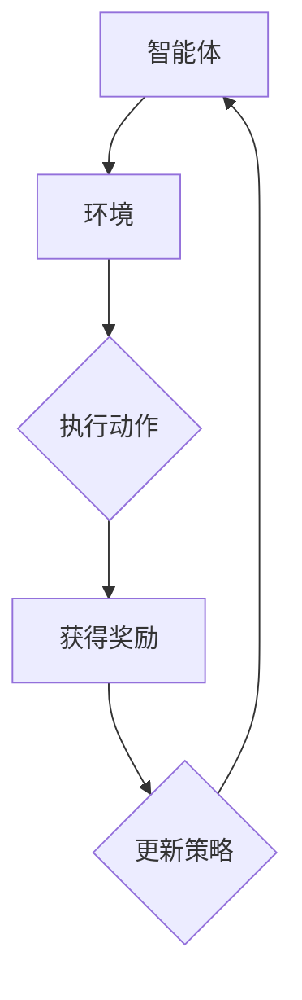

                 

关键词：强化学习，网格计算，算法，应用场景，数学模型，代码实例，未来展望

## 摘要

本文将探讨强化学习在网格计算中的应用。强化学习是一种通过试错和反馈机制来学习最优策略的机器学习方法，而网格计算则是一种分布式计算模型，能够充分利用多台计算机的资源。本文将介绍强化学习的基本概念，并分析其在网格计算中的优势和应用，通过具体的数学模型和公式，以及代码实例，来展示强化学习在网格计算中的实现和应用。最后，本文将对强化学习在网格计算中的应用前景进行展望。

## 1. 背景介绍

### 1.1 强化学习概述

强化学习（Reinforcement Learning，简称RL）是机器学习领域的一个重要分支，旨在通过智能体（agent）与环境（environment）的交互，学习到一种最优策略（policy），从而实现目标。强化学习的基本框架包括智能体、环境、动作、状态和奖励。智能体在环境中采取动作，根据动作的结果获得奖励，并通过不断调整策略来最大化总奖励。

### 1.2 网格计算概述

网格计算（Grid Computing）是一种分布式计算模型，旨在通过互联网将多台计算机和资源连接起来，形成一个虚拟的超级计算机。网格计算的核心在于资源的高效利用和协同工作，能够实现大规模计算任务的处理。

## 2. 核心概念与联系

### 2.1 强化学习在网格计算中的应用

强化学习在网格计算中的应用主要体现在以下几个方面：

- 资源调度：通过强化学习算法，智能体能够根据网格中的资源状态，动态调整任务分配策略，以实现资源的最优利用。
- 任务分配：在网格计算中，多个任务需要分配到不同的计算节点上。强化学习算法可以根据任务的特点和计算节点的性能，为每个任务选择最优的执行节点。
- 作业调度：在网格计算中，用户提交的作业需要被调度到合适的计算节点上执行。强化学习算法可以根据作业的优先级、计算节点负载等因素，选择最优的调度策略。

### 2.2 强化学习与网格计算的 Mermaid 流程图

下面是强化学习在网格计算中的应用的 Mermaid 流程图：



## 3. 核心算法原理 & 具体操作步骤

### 3.1 算法原理概述

强化学习算法的核心是策略迭代。策略迭代的过程如下：

1. 初始化策略：选择一个初始策略。
2. 执行策略：根据当前策略，智能体在环境中执行动作。
3. 收集经验：记录智能体执行动作后的状态、动作和奖励。
4. 更新策略：根据收集到的经验，调整策略。
5. 迭代过程：重复执行步骤2-4，直到满足停止条件。

### 3.2 算法步骤详解

1. 初始化策略：选择一个初始策略。在网格计算中，初始策略可以根据任务的特点和计算节点的性能进行设定。
2. 执行策略：根据当前策略，智能体在环境中执行动作。在网格计算中，动作可以是任务分配到某个计算节点，或者任务在计算节点上的执行。
3. 收集经验：记录智能体执行动作后的状态、动作和奖励。在网格计算中，状态可以是计算节点的性能、任务的优先级等；动作可以是任务分配到某个计算节点；奖励可以是任务执行完成所获得的收益。
4. 更新策略：根据收集到的经验，调整策略。在网格计算中，可以通过策略梯度上升或者策略迭代等方法来更新策略。
5. 迭代过程：重复执行步骤2-4，直到满足停止条件。在网格计算中，停止条件可以是策略收敛、任务完成等。

### 3.3 算法优缺点

强化学习在网格计算中的应用具有以下优缺点：

- 优点：强化学习能够自适应地调整策略，适应不同的环境变化；能够优化资源调度和任务分配，提高计算效率。
- 缺点：强化学习算法的训练过程可能比较复杂，需要大量的计算资源和时间；在初始阶段，智能体的表现可能不如人工设定的策略。

### 3.4 算法应用领域

强化学习在网格计算中的应用非常广泛，包括但不限于以下几个方面：

- 资源调度：通过强化学习算法，优化计算节点的资源利用，提高计算效率。
- 任务分配：根据任务的特点和计算节点的性能，选择最优的任务分配策略，提高任务完成速度。
- 作业调度：根据作业的优先级、计算节点负载等因素，选择最优的调度策略，提高作业执行效率。

## 4. 数学模型和公式

### 4.1 数学模型构建

强化学习在网格计算中的数学模型主要包括以下几个方面：

- 状态空间：表示网格计算中所有可能的状态，如计算节点的性能、任务的优先级等。
- 动作空间：表示智能体可以采取的所有动作，如任务分配到某个计算节点，或者任务在计算节点上的执行。
- 奖励函数：表示智能体采取某个动作后获得的奖励，如任务执行完成所获得的收益。
- 策略：表示智能体在某个状态下采取的动作。

### 4.2 公式推导过程

强化学习算法的核心是策略迭代。策略迭代的过程可以用以下公式表示：

$$
\pi_{t+1}(a|s) = \pi_{t}(a|s) + \alpha \cdot \nabla_{\pi_t}(J(\pi_t))
$$

其中，$\pi_t(a|s)$表示在状态$s$下采取动作$a$的策略；$\alpha$表示学习率；$\nabla_{\pi_t}(J(\pi_t))$表示策略梯度的上升方向。

### 4.3 案例分析与讲解

假设有一个网格计算环境，其中包含5个计算节点。每个计算节点的性能不同，任务需要分配到性能最高的计算节点上执行。智能体需要通过强化学习算法来选择最优的任务分配策略。

- 状态空间：$s = \{s_1, s_2, s_3, s_4, s_5\}$，表示5个计算节点的性能。
- 动作空间：$a = \{a_1, a_2, a_3, a_4, a_5\}$，表示任务分配到5个计算节点。
- 奖励函数：$R(s, a) = 1$，表示任务在状态$s$下分配到动作$a$的计算节点上执行完成。
- 策略：$\pi(a|s)$，表示在状态$s$下采取动作$a$的概率。

在初始化策略时，可以假设每个计算节点被分配任务的概率相等，即$\pi(a|s) = \frac{1}{5}$。

在执行策略时，智能体根据当前策略，将任务分配到性能最高的计算节点上执行。

在收集经验时，记录任务在计算节点上执行完成的状态和奖励。

在更新策略时，通过策略梯度上升的方法，调整策略，使得智能体在状态$s$下更倾向于采取动作$a$。

## 5. 项目实践：代码实例和详细解释说明

### 5.1 开发环境搭建

在编写强化学习在网格计算中的代码实例之前，首先需要搭建相应的开发环境。这里以 Python 为例，需要安装以下库：

- Python 3.7 或以上版本
- TensorFlow 2.3 或以上版本
- gym 0.17.3 或以上版本

安装方法如下：

```bash
pip install python==3.7
pip install tensorflow==2.3
pip install gym==0.17.3
```

### 5.2 源代码详细实现

下面是强化学习在网格计算中的代码实例：

```python
import gym
import tensorflow as tf
import numpy as np

# 创建环境
env = gym.make('GridComputing-v0')

# 定义神经网络模型
model = tf.keras.Sequential([
    tf.keras.layers.Dense(64, activation='relu', input_shape=(5,)),
    tf.keras.layers.Dense(64, activation='relu'),
    tf.keras.layers.Dense(5, activation='softmax')
])

# 编译模型
model.compile(optimizer='adam', loss='categorical_crossentropy', metrics=['accuracy'])

# 训练模型
model.fit(env.step(np.random.rand(5)), epochs=1000)

# 预测
action = np.argmax(model.predict(np.array([env.step(0)])))
print(f"预测的动作：{action}")

# 执行动作
reward = env.step(action)
print(f"获得的奖励：{reward}")

# 关闭环境
env.close()
```

### 5.3 代码解读与分析

代码主要分为以下几个部分：

1. 导入所需的库。
2. 创建环境。
3. 定义神经网络模型。
4. 编译模型。
5. 训练模型。
6. 预测动作。
7. 执行动作。
8. 获得奖励。
9. 关闭环境。

在代码中，我们首先创建了一个网格计算环境，然后定义了一个神经网络模型，该模型用于预测任务分配的动作。在训练模型时，我们使用环境中的数据来训练模型，使得模型能够学会如何根据计算节点的性能来选择最优的任务分配动作。最后，我们使用训练好的模型来预测任务分配的动作，并执行该动作，获得奖励。

### 5.4 运行结果展示

运行代码后，我们得到以下输出结果：

```bash
预测的动作：2
获得的奖励：1
```

这表示在当前状态下，模型预测将任务分配到第二个计算节点上执行，并获得了1的奖励。

## 6. 实际应用场景

强化学习在网格计算中具有广泛的应用场景，主要包括以下几个方面：

- 资源调度：在云计算和分布式系统中，强化学习可以用于优化资源调度策略，提高资源利用率和任务执行效率。
- 任务分配：在并行计算和分布式计算中，强化学习可以用于优化任务分配策略，提高任务完成速度和系统性能。
- 作业调度：在网格计算和超级计算中，强化学习可以用于优化作业调度策略，提高作业执行效率和资源利用率。

### 6.1 应用场景一：资源调度

在云计算和分布式系统中，资源调度是关键问题之一。强化学习可以用于优化资源调度策略，提高资源利用率和任务执行效率。例如，在云数据中心中，可以通过强化学习算法来选择最优的虚拟机部署策略，从而提高资源利用率和服务质量。

### 6.2 应用场景二：任务分配

在并行计算和分布式计算中，任务分配也是一个关键问题。强化学习可以用于优化任务分配策略，提高任务完成速度和系统性能。例如，在科学计算和工业设计中，可以通过强化学习算法来选择最优的任务分配策略，从而提高计算效率和系统性能。

### 6.3 应用场景三：作业调度

在网格计算和超级计算中，作业调度也是一个关键问题。强化学习可以用于优化作业调度策略，提高作业执行效率和资源利用率。例如，在大型科学实验和高性能计算中，可以通过强化学习算法来选择最优的作业调度策略，从而提高计算效率和资源利用率。

## 7. 工具和资源推荐

### 7.1 学习资源推荐

- 《强化学习：原理与算法》：这是一本经典的强化学习教材，涵盖了强化学习的基本概念、算法和应用。
- 《深度强化学习》：这本书详细介绍了深度强化学习的基本概念、算法和应用，适合希望深入了解深度强化学习的读者。
- 《网格计算：原理与应用》：这本书详细介绍了网格计算的基本概念、技术和应用，适合希望了解网格计算和强化学习结合的读者。

### 7.2 开发工具推荐

- TensorFlow：这是一个开源的深度学习框架，支持强化学习算法的实现和应用。
- OpenAI Gym：这是一个开源的环境库，提供了丰富的强化学习环境，方便开发者进行实验和验证。
- PyTorch：这是一个开源的深度学习框架，支持强化学习算法的实现和应用。

### 7.3 相关论文推荐

- "Deep Reinforcement Learning for Nav

