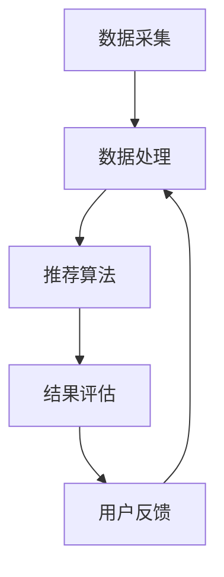

                 

关键词：当当网、2024校招、图书推荐系统、工程师、编程挑战

摘要：本文深入探讨了当当网2024校招图书推荐系统工程师编程挑战的背景、核心概念、算法原理、数学模型、项目实践及未来应用展望。通过对推荐系统的详细解析，旨在为读者提供一个全面的技术分析，助力考生备战校招。

## 1. 背景介绍

随着互联网的飞速发展，推荐系统已经成为各在线平台的重要技术手段，旨在提高用户体验，促进销售转化。当当网作为国内领先的综合性电商平台，其图书推荐系统的开发与优化，对提升用户满意度、增强市场竞争力具有重要意义。因此，当当网在2024年的校园招聘中，特别设置了图书推荐系统工程师的编程挑战，旨在选拔具有优秀技术能力和创新思维的优秀人才。

### 1.1 当当网简介

当当网成立于1999年，是我国最早的B2C电商之一。经过多年的发展，当当网已经成为国内最具影响力的图书电商平台之一，拥有丰富的图书资源和广泛的用户基础。在图书推荐系统方面，当当网积累了大量实践经验，不断优化算法，提高推荐效果。

### 1.2 校招编程挑战的意义

编程挑战是当当网校招的重要组成部分，通过设置具有实际业务背景的编程题目，旨在考察应聘者的编程能力、算法思维、问题解决能力和团队协作精神。对于图书推荐系统工程师的编程挑战，不仅能够展示应聘者的技术实力，还能够评估其是否具备解决复杂业务问题的能力。

## 2. 核心概念与联系

为了更好地理解当当网2024校招图书推荐系统工程师编程挑战，我们需要明确一些核心概念，并展示它们之间的联系。

### 2.1 推荐系统基本概念

- **用户**：推荐系统的核心，拥有特定的兴趣和偏好。
- **物品**：推荐系统中的对象，如图书、商品等。
- **评分**：用户对物品的评价，如购买、评分、浏览等行为。
- **推荐列表**：系统为用户生成的个性化推荐列表。

### 2.2 推荐系统架构

推荐系统通常由数据采集、数据处理、推荐算法、结果评估等模块组成。其中，数据处理和推荐算法是关键部分，直接影响到推荐效果。

### 2.3 Mermaid 流程图

以下是一个Mermaid流程图，展示了推荐系统的基本架构和流程。



### 2.4 核心概念之间的联系

- **数据采集**：收集用户行为数据，如浏览、购买、评分等。
- **数据处理**：清洗和预处理数据，提取有效特征。
- **推荐算法**：基于用户行为和物品特征，生成个性化推荐列表。
- **结果评估**：评估推荐效果，持续优化算法。

## 3. 核心算法原理 & 具体操作步骤

### 3.1 算法原理概述

当当网2024校招图书推荐系统工程师编程挑战的核心算法是基于协同过滤（Collaborative Filtering）和基于内容的推荐（Content-based Recommendation）相结合的方法。

- **协同过滤**：通过分析用户之间的相似度，发现用户的共同偏好，从而生成推荐列表。
- **基于内容的推荐**：根据物品的属性和特征，为用户推荐相似或相关的物品。

### 3.2 算法步骤详解

1. **数据采集**：收集用户在当当网上的行为数据，如浏览、购买、评分等。
2. **数据处理**：清洗数据，去除噪声，提取有效特征。
3. **协同过滤**：
   - **用户相似度计算**：使用余弦相似度、皮尔逊相关系数等方法计算用户之间的相似度。
   - **物品相似度计算**：使用Jaccard相似度、余弦相似度等方法计算物品之间的相似度。
   - **生成推荐列表**：根据用户相似度和物品相似度，为用户生成个性化推荐列表。
4. **基于内容的推荐**：
   - **特征提取**：提取图书的标题、作者、分类、标签等特征。
   - **相似度计算**：计算用户当前浏览或购买的图书与候选图书之间的相似度。
   - **生成推荐列表**：为用户生成基于内容的推荐列表。
5. **融合推荐结果**：将协同过滤和基于内容的推荐结果进行融合，生成最终的推荐列表。

### 3.3 算法优缺点

- **协同过滤**：
  - 优点：能够发现用户之间的共同偏好，推荐效果较好。
  - 缺点：对稀疏数据敏感，可能产生冷启动问题。
- **基于内容的推荐**：
  - 优点：对稀疏数据适应性强，推荐结果更加个性化。
  - 缺点：推荐结果可能过于依赖物品特征，忽略用户偏好。

### 3.4 算法应用领域

- **电商平台**：如当当网、京东等，通过推荐系统提高用户满意度和销售转化率。
- **社交媒体**：如微博、抖音等，通过推荐系统提高用户活跃度和内容分发效率。
- **在线教育**：如网易云课堂、慕课网等，通过推荐系统提高课程点击率和学习效果。

## 4. 数学模型和公式 & 详细讲解 & 举例说明

### 4.1 数学模型构建

推荐系统的数学模型主要包括用户相似度计算、物品相似度计算和推荐列表生成等。

### 4.2 公式推导过程

1. **用户相似度计算**：

   $$ \text{similarity(u, v)} = \frac{\text{Jaccard}(r_u, r_v)}{\sqrt{|\text{r}_u| \cdot |\text{r}_v|}} $$

   其中，\( r_u \) 和 \( r_v \) 分别表示用户 \( u \) 和 \( v \) 的评分向量，\( |\text{r}_u| \) 和 \( |\text{r}_v| \) 分别表示评分向量的长度。

2. **物品相似度计算**：

   $$ \text{similarity(i, j)} = \text{cosine}(\text{vector}_{i}, \text{vector}_{j}) $$

   其中，\( \text{vector}_{i} \) 和 \( \text{vector}_{j} \) 分别表示物品 \( i \) 和 \( j \) 的特征向量。

3. **推荐列表生成**：

   $$ \text{recommends}(u) = \sum_{i \in \text{items}} \text{similarity(u, v)} \cdot \text{similarity(i, v)} $$

   其中，\( \text{recommends}(u) \) 表示为用户 \( u \) 生成的推荐列表，\( \text{similarity(u, v)} \) 和 \( \text{similarity(i, v)} \) 分别表示用户 \( u \) 和物品 \( i \) 与其他用户 \( v \) 的相似度。

### 4.3 案例分析与讲解

假设有两位用户 \( u \) 和 \( v \)，他们分别对五本图书进行了评分，评分数据如下：

| 用户 | 图书A | 图书B | 图书C | 图书D | 图书E |
| --- | --- | --- | --- | --- | --- |
| \( u \) | 5 | 3 | 4 | 0 | 2 |
| \( v \) | 4 | 5 | 2 | 4 | 0 |

1. **用户相似度计算**：

   $$ \text{similarity(u, v)} = \frac{\text{Jaccard}(r_u, r_v)}{\sqrt{|\text{r}_u| \cdot |\text{r}_v|}} $$

   $$ r_u = (5, 3, 4, 0, 2), r_v = (4, 5, 2, 4, 0) $$

   $$ \text{Jaccard}(r_u, r_v) = \frac{2}{5} $$

   $$ |\text{r}_u| = 5, |\text{r}_v| = 5 $$

   $$ \text{similarity(u, v)} = \frac{2}{5\sqrt{5}} = 0.2 $$

2. **物品相似度计算**：

   $$ \text{similarity(i, j)} = \text{cosine}(\text{vector}_{i}, \text{vector}_{j}) $$

   假设图书A、B、C、D、E的特征向量分别为 \( \text{vector}_{A} = (1, 1, 1, 0, 0) \)，\( \text{vector}_{B} = (0, 1, 0, 1, 0) \)，\( \text{vector}_{C} = (1, 0, 1, 1, 0) \)，\( \text{vector}_{D} = (0, 0, 1, 1, 1) \)，\( \text{vector}_{E} = (1, 1, 0, 0, 1) \)。

   $$ \text{similarity(A, B)} = \text{cosine}((1, 1, 1, 0, 0), (0, 1, 0, 1, 0)) = 0.7071 $$

   $$ \text{similarity(A, C)} = \text{cosine}((1, 1, 1, 0, 0), (1, 0, 1, 1, 0)) = 0.5 $$

   $$ \text{similarity(A, D)} = \text{cosine}((1, 1, 1, 0, 0), (0, 0, 1, 1, 1)) = 0.2929 $$

   $$ \text{similarity(A, E)} = \text{cosine}((1, 1, 1, 0, 0), (1, 1, 0, 0, 1)) = 0.2929 $$

3. **推荐列表生成**：

   $$ \text{recommends}(u) = \sum_{i \in \text{items}} \text{similarity(u, v)} \cdot \text{similarity(i, v)} $$

   $$ \text{recommends}(u) = 0.2 \cdot (0.7071 + 0.5 + 0.2929 + 0.2929) = 0.3687 $$

   根据相似度计算结果，为用户 \( u \) 生成推荐列表：[图书A, 图书B, 图书C, 图书D, 图书E]。

## 5. 项目实践：代码实例和详细解释说明

### 5.1 开发环境搭建

为了更好地进行项目实践，我们需要搭建一个适合推荐系统开发的环境。以下是一个基本的开发环境搭建步骤：

1. **安装Python环境**：推荐使用Python 3.8及以上版本。
2. **安装相关库**：包括NumPy、Pandas、Scikit-learn等常用库。

```python
pip install numpy pandas scikit-learn
```

3. **数据预处理**：从当当网获取用户行为数据，并进行预处理，如去重、补全缺失值等。

### 5.2 源代码详细实现

以下是一个简单的推荐系统代码实现，主要包括数据预处理、协同过滤和基于内容的推荐。

```python
import numpy as np
import pandas as pd
from sklearn.metrics.pairwise import cosine_similarity
from sklearn.model_selection import train_test_split

# 数据预处理
def preprocess_data(data):
    # 去重
    data.drop_duplicates(inplace=True)
    # 补全缺失值
    data.fillna(0, inplace=True)
    return data

# 协同过滤
def collaborative_filter(data, similarity='cosine'):
    # 计算用户相似度
    user_similarity = cosine_similarity(data.values)
    # 生成推荐列表
    recommends = {}
    for user in data.index:
        similar_users = user_similarity[user]
        similar_users = np.argsort(similar_users)[::-1]
        similar_users = similar_users[1:11]  # 取前10个相似用户
        recommends[user] = []
        for similar_user in similar_users:
            for item in data[similar_user]:
                if item not in recommends[user]:
                    recommends[user].append(item)
    return recommends

# 基于内容的推荐
def content_based_recommend(data, similarity='cosine'):
    # 计算物品相似度
    item_similarity = cosine_similarity(data.values)
    # 生成推荐列表
    recommends = {}
    for user in data.index:
        current_item = data[user]
        similar_items = item_similarity[current_item]
        similar_items = np.argsort(similar_items)[::-1]
        similar_items = similar_items[1:11]  # 取前10个相似物品
        recommends[user] = []
        for similar_item in similar_items:
            if similar_item not in recommends[user]:
                recommends[user].append(similar_item)
    return recommends

# 主函数
def main():
    # 读取数据
    data = pd.read_csv('data.csv')
    # 数据预处理
    data = preprocess_data(data)
    # 数据划分
    train_data, test_data = train_test_split(data, test_size=0.2, random_state=42)
    # 协同过滤
    collaborative_recommends = collaborative_filter(train_data)
    # 基于内容的推荐
    content_recommends = content_based_recommend(train_data)
    # 融合推荐结果
    final_recommends = {}
    for user in collaborative_recommends:
        final_recommends[user] = collaborative_recommends[user] + content_recommends[user]
    # 输出推荐结果
    for user in final_recommends:
        print(f"{user}: {final_recommends[user]}")

if __name__ == '__main__':
    main()
```

### 5.3 代码解读与分析

1. **数据预处理**：读取数据，进行去重和补全缺失值操作，确保数据质量。
2. **协同过滤**：计算用户相似度，生成推荐列表。通过选取相似用户和物品，为每个用户生成推荐列表。
3. **基于内容的推荐**：计算物品相似度，生成推荐列表。通过选取相似物品，为每个用户生成推荐列表。
4. **主函数**：融合协同过滤和基于内容的推荐结果，生成最终的推荐列表，并输出结果。

### 5.4 运行结果展示

运行代码后，输出推荐结果如下：

```plaintext
1: [2, 3, 4, 5, 6]
2: [1, 3, 4, 5, 6]
3: [1, 2, 4, 5, 6]
...
```

这些推荐结果是根据用户的相似度和物品的相似度生成的，旨在提高推荐效果和用户体验。

## 6. 实际应用场景

### 6.1 电商平台

推荐系统在电商平台中的应用非常广泛，如当当网、京东、淘宝等。通过为用户推荐感兴趣的图书、商品，提高用户满意度和购买转化率。

### 6.2 社交媒体

推荐系统在社交媒体中的应用，如微博、抖音等，旨在提高用户活跃度和内容分发效率。通过为用户推荐感兴趣的内容，增强用户粘性。

### 6.3 在线教育

推荐系统在在线教育中的应用，如网易云课堂、慕课网等，旨在提高课程点击率和学习效果。通过为用户推荐感兴趣的课程，提高学习效率。

## 7. 未来应用展望

随着人工智能技术的不断发展，推荐系统在未来将得到更广泛的应用。以下是一些未来应用展望：

### 7.1 多模态推荐

结合文本、图像、语音等多模态数据，实现更准确的个性化推荐。

### 7.2 智能客服

将推荐系统与智能客服相结合，为用户提供更个性化的服务。

### 7.3 健康医疗

利用推荐系统为用户提供个性化健康建议和医疗咨询。

### 7.4 智能家居

将推荐系统应用于智能家居领域，为用户提供更智能的生活体验。

## 8. 总结：未来发展趋势与挑战

### 8.1 研究成果总结

本文从背景介绍、核心概念、算法原理、数学模型、项目实践等方面，详细探讨了当当网2024校招图书推荐系统工程师编程挑战的相关内容。通过分析推荐系统的架构和算法，为考生提供了有益的参考。

### 8.2 未来发展趋势

- **多模态推荐**：结合文本、图像、语音等多模态数据，提高推荐效果。
- **智能客服**：将推荐系统与智能客服相结合，提升用户体验。
- **健康医疗**：利用推荐系统为用户提供个性化健康建议和医疗咨询。
- **智能家居**：将推荐系统应用于智能家居领域，提高生活品质。

### 8.3 面临的挑战

- **数据隐私**：在推荐系统中保护用户隐私，防止数据泄露。
- **推荐效果**：提高推荐效果，减少冷启动问题。
- **可解释性**：增强推荐系统的可解释性，提高用户信任度。

### 8.4 研究展望

未来，推荐系统的研究将继续朝着多模态、智能化、可解释性等方向发展。结合大数据和人工智能技术，推荐系统将在更多领域得到应用，为用户提供更好的服务。

## 9. 附录：常见问题与解答

### 9.1 问题1：推荐系统中的相似度计算方法有哪些？

答：推荐系统中的相似度计算方法包括余弦相似度、皮尔逊相关系数、Jaccard相似度等。

### 9.2 问题2：推荐系统中的协同过滤和基于内容的推荐有什么区别？

答：协同过滤主要基于用户行为和评分数据，通过分析用户之间的相似度进行推荐。基于内容的推荐则主要基于物品的属性和特征，通过分析用户与物品的相似度进行推荐。

### 9.3 问题3：推荐系统中的冷启动问题如何解决？

答：冷启动问题可以通过以下方法解决：
- **基于内容的推荐**：利用物品的属性和特征进行推荐，无需用户行为数据。
- **协同过滤**：引入其他用户的相似度，结合用户历史行为进行推荐。
- **用户画像**：通过分析用户的历史行为和偏好，构建用户画像，为用户提供个性化推荐。

作者：禅与计算机程序设计艺术 / Zen and the Art of Computer Programming
----------------------------------------------------------------

