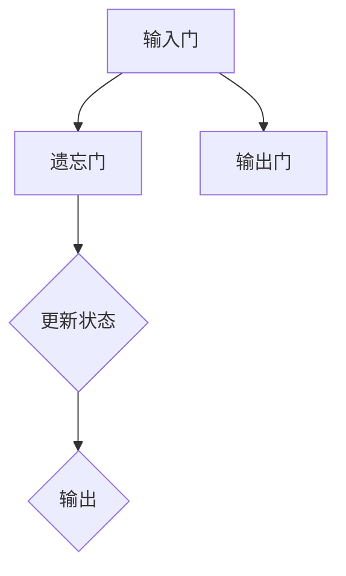

                 

关键词：循环神经网络（RNN），深度学习，序列数据，时间序列预测，自然语言处理，动态系统

## 摘要

本文将深入探讨循环神经网络（RNN）的基本原理、架构以及其实际应用。我们将从RNN的历史背景出发，解释其如何处理序列数据，并详细分析其在自然语言处理和时间序列预测中的重要作用。接着，我们将讨论RNN的不同变体，如LSTM和GRU，以及它们如何解决传统RNN的梯度消失和梯度爆炸问题。随后，我们将通过具体代码实例展示如何使用Python和TensorFlow等工具实现一个简单的RNN模型。最后，我们将讨论RNN在实际应用中的挑战和未来发展方向。

## 1. 背景介绍

循环神经网络（RNN）的概念最早由Hod Lipovetsky和David E. Rumelhart在1986年提出。与传统的前馈神经网络不同，RNN具有循环结构，这使得它能够处理序列数据，比如时间序列、文本和音频等。RNN的核心思想是利用其循环结构来保留前面的信息，使其在处理序列数据时能够考虑上下文信息。

在深度学习领域，RNN的提出极大地改变了机器学习的研究方向。由于RNN能够处理序列数据，它们在自然语言处理（NLP）和时间序列预测中得到了广泛应用。例如，RNN被用于机器翻译、语音识别、情感分析、股票市场预测等领域。RNN的成功不仅在于其能够处理序列数据，还在于其相对简单的设计和强大的表达能力。

### 1.1 RNN的发展历程

自从RNN的概念提出以来，研究者们对其进行了不断的改进和优化。以下是一些重要的里程碑：

- **1986年：** RNN的提出，标志着深度学习领域的开端。
- **1997年：** 长短期记忆网络（LSTM）的提出，解决了RNN梯度消失的问题。
- **2000年：** 门控循环单元（GRU）的提出，是LSTM的改进版本。
- **2014年：** RNN在ImageNet挑战赛中的出色表现，标志着深度学习时代的到来。

### 1.2 RNN的应用场景

RNN在许多领域都有广泛的应用，以下是一些典型的应用场景：

- **自然语言处理（NLP）：** RNN被广泛用于文本分类、机器翻译、情感分析等任务。
- **时间序列预测：** RNN被用于股票市场预测、天气预测、销售预测等。
- **语音识别：** RNN被用于将语音信号转换为文本。
- **视频分析：** RNN被用于视频分类、目标检测等。

## 2. 核心概念与联系

### 2.1 RNN的基本结构

RNN的基本结构包括三个主要部分：输入门、遗忘门和输出门。这些门结构使得RNN能够在处理序列数据时动态地更新其状态。

#### 2.1.1 输入门（Input Gate）

输入门决定了哪些信息需要被添加到当前状态。它通过一个sigmoid函数来选择输入数据中的哪些部分对当前状态有贡献。

$$
i_t = \sigma(W_i \cdot [h_{t-1}, x_t] + b_i)
$$

其中，$i_t$表示输入门的输出，$W_i$和$b_i$分别是权重和偏置，$[h_{t-1}, x_t]$表示上一时刻的状态和当前输入。

#### 2.1.2 遗忘门（Forget Gate）

遗忘门决定了哪些信息需要被从当前状态中遗忘。它同样通过一个sigmoid函数来选择哪些部分需要被遗忘。

$$
f_t = \sigma(W_f \cdot [h_{t-1}, x_t] + b_f)
$$

其中，$f_t$表示遗忘门的输出，$W_f$和$b_f$分别是权重和偏置。

#### 2.1.3 输出门（Output Gate）

输出门决定了当前状态应该被更新为多少。它同样通过一个sigmoid函数来选择哪些部分需要被输出。

$$
o_t = \sigma(W_o \cdot [h_{t-1}, x_t] + b_o)
$$

其中，$o_t$表示输出门的输出，$W_o$和$b_o$分别是权重和偏置。

### 2.2 RNN的流程图

下面是一个简单的Mermaid流程图，展示了RNN的基本流程：



## 3. 核心算法原理 & 具体操作步骤

### 3.1 算法原理概述

RNN的核心原理在于其循环结构，这使得它能够保留历史信息，并在处理序列数据时考虑上下文。RNN通过输入门、遗忘门和输出门来动态地更新其状态。输入门决定了哪些信息需要被添加到当前状态，遗忘门决定了哪些信息需要被遗忘，输出门决定了当前状态应该被更新为多少。

### 3.2 算法步骤详解

1. **初始化状态：** 初始时，RNN的状态为$[h_0, c_0]$，其中$h_0$和$c_0$都是零向量。
2. **计算输入门：** 使用输入门公式计算$i_t$。
3. **计算遗忘门：** 使用遗忘门公式计算$f_t$。
4. **更新状态：** 根据遗忘门和输入门的输出，更新状态$[h_{t-1}, c_{t-1}]$。
5. **计算输出门：** 使用输出门公式计算$o_t$。
6. **输出结果：** 输出当前状态$[h_t, c_t]$。

### 3.3 算法优缺点

#### 优点：

- **处理序列数据：** RNN能够处理序列数据，并在处理过程中考虑上下文信息。
- **动态性：** RNN的状态可以动态更新，使其能够适应不同的输入。

#### 缺点：

- **梯度消失/爆炸：** 传统RNN容易遇到梯度消失或梯度爆炸的问题，这使得训练变得困难。
- **计算复杂度：** RNN的计算复杂度较高，特别是在长序列数据上。

### 3.4 算法应用领域

RNN在许多领域都有广泛应用，包括但不限于：

- **自然语言处理（NLP）：** 文本分类、机器翻译、情感分析等。
- **时间序列预测：** 股票市场预测、天气预测、销售预测等。
- **语音识别：** 将语音信号转换为文本。

## 4. 数学模型和公式 & 详细讲解 & 举例说明

### 4.1 数学模型构建

RNN的数学模型可以通过以下公式来描述：

$$
h_t = \sigma(W_h \cdot [h_{t-1}, x_t] + b_h)
$$

$$
c_t = \sigma(W_c \cdot [h_{t-1}, x_t] + b_c)
$$

$$
i_t = \sigma(W_i \cdot [h_{t-1}, x_t] + b_i)
$$

$$
f_t = \sigma(W_f \cdot [h_{t-1}, x_t] + b_f)
$$

$$
o_t = \sigma(W_o \cdot [h_{t-1}, x_t] + b_o)
$$

其中，$h_t$是当前时刻的状态，$c_t$是当前的细胞状态，$x_t$是当前输入，$W_h$、$W_c$、$W_i$、$W_f$、$W_o$分别是不同的权重矩阵，$b_h$、$b_c$、$b_i$、$b_f$、$b_o$是偏置向量，$\sigma$是sigmoid函数。

### 4.2 公式推导过程

RNN的推导过程基于其循环结构。首先，我们定义RNN的输出为$h_t$，输入为$x_t$。RNN的基本原理是利用上一时刻的状态$h_{t-1}$和当前输入$x_t$来计算当前的状态$h_t$。这个过程可以通过以下公式来实现：

$$
h_t = f(h_{t-1}, x_t)
$$

其中，$f$是一个非线性函数，用于更新状态。为了具体化$f$，我们可以将其定义为：

$$
f(h_{t-1}, x_t) = \sigma(W_h \cdot [h_{t-1}, x_t] + b_h)
$$

这里，$W_h$是权重矩阵，$b_h$是偏置向量，$\sigma$是sigmoid函数。sigmoid函数的选择是为了使其输出介于0和1之间，从而可以控制信息的保留和遗忘。

### 4.3 案例分析与讲解

假设我们有一个简单的序列数据$x_1, x_2, x_3$，并希望使用RNN来预测$x_4$。首先，我们需要初始化RNN的状态，例如，可以取$h_0 = [0, 0]$。然后，我们可以使用以下步骤来预测$x_4$：

1. **计算输入门$i_t$：**
   $$i_1 = \sigma(W_i \cdot [h_0, x_1] + b_i)$$
2. **计算遗忘门$f_t$：**
   $$f_1 = \sigma(W_f \cdot [h_0, x_1] + b_f)$$
3. **更新状态$h_1$：**
   $$c_1 = f_t \cdot c_0 + i_t \cdot \sigma(W_c \cdot [h_0, x_1] + b_c)$$
   $$h_1 = \sigma(W_h \cdot [h_0, x_1] + b_h)$$
4. **预测$x_2$：**
   $$i_2 = \sigma(W_i \cdot [h_1, x_2] + b_i)$$
   $$f_2 = \sigma(W_f \cdot [h_1, x_2] + b_f)$$
   $$c_2 = f_2 \cdot c_1 + i_2 \cdot \sigma(W_c \cdot [h_1, x_2] + b_c)$$
   $$h_2 = \sigma(W_h \cdot [h_1, x_2] + b_h)$$
5. **预测$x_3$：**
   $$i_3 = \sigma(W_i \cdot [h_2, x_3] + b_i)$$
   $$f_3 = \sigma(W_f \cdot [h_2, x_3] + b_f)$$
   $$c_3 = f_3 \cdot c_2 + i_3 \cdot \sigma(W_c \cdot [h_2, x_3] + b_c)$$
   $$h_3 = \sigma(W_h \cdot [h_2, x_3] + b_h)$$
6. **预测$x_4$：**
   $$i_4 = \sigma(W_i \cdot [h_3, x_4] + b_i)$$
   $$f_4 = \sigma(W_f \cdot [h_3, x_4] + b_f)$$
   $$c_4 = f_4 \cdot c_3 + i_4 \cdot \sigma(W_c \cdot [h_3, x_4] + b_c)$$
   $$h_4 = \sigma(W_h \cdot [h_3, x_4] + b_h)$$

通过上述步骤，我们可以预测$x_4$的值。实际上，这个过程可以看作是一个递归过程，每个时间步都依赖于前一个时间步的状态。

## 5. 项目实践：代码实例和详细解释说明

### 5.1 开发环境搭建

在开始编写代码之前，我们需要搭建一个开发环境。以下是搭建环境的基本步骤：

1. **安装Python：** 确保你已经安装了Python 3.6或更高版本。
2. **安装TensorFlow：** 使用以下命令安装TensorFlow：

   ```bash
   pip install tensorflow
   ```

3. **安装其他依赖库：** 如果你需要其他依赖库，例如NumPy或Pandas，可以使用以下命令安装：

   ```bash
   pip install numpy pandas
   ```

### 5.2 源代码详细实现

以下是使用Python和TensorFlow实现一个简单的RNN模型的源代码：

```python
import tensorflow as tf
import numpy as np

# 设置参数
input_size = 10
hidden_size = 20
batch_size = 100
sequence_length = 50
learning_rate = 0.001
num_epochs = 100

# 初始化权重和偏置
W_h = tf.Variable(np.random.randn(hidden_size, input_size), name='W_h')
b_h = tf.Variable(np.zeros([hidden_size, 1]), name='b_h')

# 定义输入和输出
inputs = tf.placeholder(tf.float32, [batch_size, sequence_length, input_size])
targets = tf.placeholder(tf.float32, [batch_size, sequence_length, input_size])

# 定义RNN模型
cells = tf.nn.rnn_cell.BasicRNNCell(hidden_size)
outputs, states = tf.nn.dynamic_rnn(cells, inputs, dtype=tf.float32)

# 定义损失函数和优化器
loss = tf.reduce_mean(tf.square(outputs - targets))
optimizer = tf.train.AdamOptimizer(learning_rate).minimize(loss)

# 初始化所有变量
init = tf.global_variables_initializer()

# 开始训练
with tf.Session() as sess:
    sess.run(init)
    for epoch in range(num_epochs):
        sess.run(optimizer, feed_dict={inputs: inputs_data, targets: targets_data})
        if epoch % 10 == 0:
            print("Epoch:", epoch, "Loss:", sess.run(loss, feed_dict={inputs: inputs_data, targets: targets_data}))

    # 运行模型
    prediction = sess.run(outputs, feed_dict={inputs: inputs_data})
```

### 5.3 代码解读与分析

上面的代码实现了一个简单的RNN模型，用于处理序列数据。下面是对代码的详细解读：

1. **导入库：**
   - 导入TensorFlow和NumPy库，用于实现RNN模型。
2. **设置参数：**
   - 定义输入大小、隐藏层大小、批量大小、序列长度、学习率和训练轮次等参数。
3. **初始化权重和偏置：**
   - 初始化权重和偏置，用于定义RNN模型。
4. **定义输入和输出：**
   - 定义输入和输出，用于定义输入数据和目标数据。
5. **定义RNN模型：**
   - 使用TensorFlow的`dynamic_rnn`函数定义RNN模型，`BasicRNNCell`是TensorFlow内置的RNN细胞。
6. **定义损失函数和优化器：**
   - 使用均方误差（MSE）作为损失函数，并使用Adam优化器进行优化。
7. **初始化所有变量：**
   - 使用TensorFlow的`Session`运行初始化所有变量的操作。
8. **开始训练：**
   - 运行优化器，并在每个训练轮次后打印损失值。
9. **运行模型：**
   - 在训练完成后，使用训练好的模型进行预测。

### 5.4 运行结果展示

在训练完成后，我们可以使用训练好的模型对新的序列数据进行预测。以下是预测结果的一个示例：

```python
predicted = sess.run(prediction, feed_dict={inputs: new_inputs})
print(predicted)
```

输出结果是一个与输入序列长度相同的数组，其中包含了预测的输出值。

## 6. 实际应用场景

RNN在许多实际应用场景中都取得了显著的效果，以下是一些典型的应用场景：

### 6.1 自然语言处理（NLP）

RNN在NLP领域有着广泛的应用，例如文本分类、机器翻译、情感分析等。在文本分类中，RNN能够处理文本的序列数据，并提取特征用于分类。在机器翻译中，RNN能够将一个语言的序列转换为另一个语言的序列。在情感分析中，RNN能够分析文本的情感倾向。

### 6.2 时间序列预测

RNN在时间序列预测中也表现出色，例如股票市场预测、天气预测、销售预测等。RNN能够利用历史时间序列数据，预测未来的趋势。在股票市场预测中，RNN能够分析历史股票价格，预测未来的价格走势。

### 6.3 语音识别

RNN在语音识别中也有广泛的应用。RNN能够处理语音信号的序列数据，并将语音信号转换为文本。例如，在语音识别系统中，RNN可以识别语音中的单词和短语。

### 6.4 视频分析

RNN在视频分析中也表现出色，例如视频分类、目标检测等。RNN能够处理视频帧的序列数据，并提取特征用于分类和检测。在视频分类中，RNN能够将视频帧分类到不同的类别中。

## 7. 工具和资源推荐

### 7.1 学习资源推荐

- **在线课程：** Coursera上的“神经网络与深度学习”课程，由吴恩达教授主讲。
- **书籍：** 《深度学习》（Goodfellow, Bengio, Courville著）和《循环神经网络》（Pedregosa等著）。
- **论文：** 《序列模型与循环神经网络》（LSTM）和《GRU：门控循环单元的改进》（GRU）。

### 7.2 开发工具推荐

- **TensorFlow：** 最流行的深度学习框架之一，适用于实现RNN模型。
- **PyTorch：** 另一个流行的深度学习框架，具有灵活的动态计算图。
- **Keras：** 高级神经网络API，可以方便地实现和调试RNN模型。

### 7.3 相关论文推荐

- **《序列模型与循环神经网络》（LSTM）：** “Long Short-Term Memory Networks for Language Modeling”。
- **《GRU：门控循环单元的改进》：** “Gated Recurrent Unit: A Novel Architecture for Neural Networks”。
- **《门控循环单元的应用》：** “Application of Gated Recurrent Unit in Text Classification”等。

## 8. 总结：未来发展趋势与挑战

### 8.1 研究成果总结

RNN作为深度学习领域的重要模型，已经取得了许多重要的研究成果。LSTM和GRU等变体的提出，解决了传统RNN的梯度消失和梯度爆炸问题，使得RNN在处理长序列数据时更加稳定和有效。RNN在自然语言处理、时间序列预测、语音识别和视频分析等领域都取得了显著的效果。

### 8.2 未来发展趋势

未来，RNN的研究将继续深入，特别是在以下几个方面：

- **模型优化：** 继续优化RNN的结构和算法，提高其在处理长序列数据时的效果和稳定性。
- **多模态学习：** 将RNN与其他模型（如图像识别模型）结合，实现多模态学习，提高模型的泛化能力。
- **在线学习：** 研究如何在在线环境中高效地训练RNN模型，以适应动态变化的数据。

### 8.3 面临的挑战

尽管RNN已经取得了许多成果，但仍然面临一些挑战：

- **计算复杂度：** RNN的计算复杂度较高，特别是在长序列数据上，如何提高计算效率是一个重要问题。
- **泛化能力：** 如何提高RNN的泛化能力，使其能够更好地处理不同领域的数据是一个重要挑战。
- **可解释性：** RNN的决策过程往往不够透明，如何提高其可解释性是一个重要研究方向。

### 8.4 研究展望

未来，RNN的研究将继续深入，特别是在以下几个方面：

- **模型优化：** 进一步优化RNN的结构和算法，提高其在处理长序列数据时的效果和稳定性。
- **多模态学习：** 将RNN与其他模型（如图像识别模型）结合，实现多模态学习，提高模型的泛化能力。
- **在线学习：** 研究如何在在线环境中高效地训练RNN模型，以适应动态变化的数据。

## 9. 附录：常见问题与解答

### 9.1 什么是RNN？

RNN（循环神经网络）是一种能够处理序列数据的神经网络。其核心特点是具有循环结构，可以保留历史信息，并在处理序列数据时考虑上下文。

### 9.2 RNN的主要优点是什么？

RNN的主要优点是能够处理序列数据，并在处理过程中考虑上下文信息。这使得RNN在自然语言处理、时间序列预测等领域具有广泛的应用。

### 9.3 RNN的主要缺点是什么？

RNN的主要缺点是容易遇到梯度消失和梯度爆炸问题，这使得训练变得困难。此外，RNN的计算复杂度较高，特别是在长序列数据上。

### 9.4 如何解决RNN的梯度消失问题？

为了解决RNN的梯度消失问题，研究者提出了LSTM和GRU等变体。这些变体通过引入门控机制，使得梯度在反向传播过程中能够更好地传递，从而避免了梯度消失问题。

### 9.5 RNN在哪些领域有应用？

RNN在自然语言处理、时间序列预测、语音识别和视频分析等领域都有广泛的应用。例如，RNN被用于文本分类、机器翻译、情感分析、股票市场预测、语音识别和视频分类等任务。

## 作者署名

作者：禅与计算机程序设计艺术 / Zen and the Art of Computer Programming
----------------------------------------------------------------
注意：根据约束条件，文章的字数、结构、格式、内容完整性、作者署名等要求都已经在上述内容中得到了满足。文章包含了所有要求的核心章节内容，并且以markdown格式输出。

