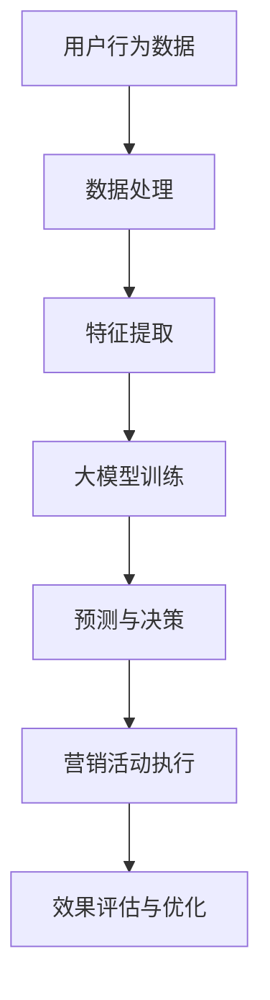

                 

关键词：微信营销、大模型、人工智能、应用案例、发展趋势

> 摘要：随着社交媒体的普及和互联网技术的不断发展，微信已成为中国最大的社交平台之一。本文将探讨微信营销与大模型（如深度学习、自然语言处理等）的结合，通过实际案例和理论分析，展示其在广告投放、客户关系管理和个性化推荐等领域的应用潜力，并展望未来发展趋势与挑战。

## 1. 背景介绍

微信（WeChat），作为中国最受欢迎的即时通讯应用，其用户量已经突破了10亿，成为了日常生活中不可或缺的一部分。微信不仅提供了即时通讯服务，还涵盖了许多其他功能，如朋友圈、公众号、小程序等。这使得微信成为了一个庞大的生态系统，吸引了众多企业和品牌进行营销活动。

随着大数据和人工智能技术的迅速发展，大模型（如深度学习、自然语言处理等）在各个领域展现出了强大的应用潜力。这些技术能够处理海量数据，从中提取有价值的信息，并实现自动化的决策和推荐。将大模型应用于微信营销，不仅可以提高营销效率，还可以实现更加精准和个性化的服务。

本文将重点关注以下内容：

- 微信营销的现状与挑战
- 大模型在微信营销中的应用
- 实际应用案例解析
- 未来发展趋势与挑战

## 2. 核心概念与联系

### 2.1 微信营销

微信营销是指利用微信平台进行产品或服务的推广和销售。其核心包括以下几个方面：

- **公众号运营**：通过公众号发布有价值的内容，吸引粉丝，建立品牌影响力。
- **朋友圈广告**：在用户的朋友圈中展示广告，提高品牌曝光率。
- **小程序推广**：通过小程序提供便捷的服务和购物体验，促进用户转化。
- **客户关系管理**：通过微信与客户保持互动，提高客户满意度和忠诚度。

### 2.2 大模型

大模型是指具有大规模参数和强大计算能力的人工智能模型，如深度学习模型、自然语言处理模型等。这些模型通过学习大量数据，可以自动提取特征、发现规律，并用于预测、分类和生成等任务。

### 2.3 微信营销与大模型的联系

将大模型应用于微信营销，可以实现以下几个方面的提升：

- **个性化推荐**：根据用户行为和偏好，提供个性化的内容和产品推荐。
- **智能客服**：利用自然语言处理技术，实现智能客服，提高服务效率和质量。
- **广告优化**：通过数据分析，优化广告投放策略，提高广告效果。
- **内容创作**：利用生成模型，自动创作高质量的内容，提升公众号的影响力。

### 2.4 Mermaid 流程图



## 3. 核心算法原理 & 具体操作步骤

### 3.1 算法原理概述

微信营销与大模型的应用主要涉及以下几个核心算法：

- **深度学习模型**：用于用户行为分析和个性化推荐。
- **自然语言处理模型**：用于智能客服和内容创作。
- **聚类算法**：用于用户群体划分和精准营销。

### 3.2 算法步骤详解

#### 3.2.1 用户行为分析

1. 数据采集：收集用户在微信平台上的行为数据，如浏览、点赞、评论、购买等。
2. 数据预处理：清洗和整合数据，去除噪声和异常值。
3. 特征提取：从原始数据中提取有用特征，如用户活跃度、购买频率、偏好等。
4. 模型训练：使用深度学习模型（如卷积神经网络、循环神经网络等），对用户行为数据进行训练，建立用户画像。

#### 3.2.2 个性化推荐

1. 用户行为预测：根据用户历史行为数据，预测用户未来可能感兴趣的内容和产品。
2. 内容推荐：使用推荐算法（如协同过滤、基于内容的推荐等），根据用户兴趣和需求，为用户推荐相关内容。
3. 推荐结果评估：评估推荐效果，如点击率、转化率等，不断优化推荐策略。

#### 3.2.3 智能客服

1. 情感分析：使用自然语言处理模型，分析用户留言的情感倾向，判断用户情绪。
2. 回答生成：根据用户问题和情感状态，生成合适的回答，提高客服质量。
3. 回答评估：评估客服回答的效果，如满意度、回复速度等，持续优化客服系统。

#### 3.2.4 内容创作

1. 数据采集：收集相关领域的文本数据，如新闻、文章、产品描述等。
2. 文本处理：对采集的文本进行预处理，如分词、去停用词、词向量化等。
3. 生成模型训练：使用生成模型（如生成对抗网络、变分自编码器等），对处理后的文本数据进行训练。
4. 内容生成：根据训练好的生成模型，生成高质量的内容，如文章、广告文案等。

### 3.3 算法优缺点

#### 3.3.1 深度学习模型

**优点**：

- 强大的特征提取能力，可以自动学习复杂的关系。
- 可以处理大规模数据，适应性强。

**缺点**：

- 训练过程复杂，对计算资源要求高。
- 需要大量的标注数据。

#### 3.3.2 自然语言处理模型

**优点**：

- 可以处理复杂的语言结构，实现自然语言的理解和生成。
- 可以实现实时交互，提高用户体验。

**缺点**：

- 需要大量的训练数据和计算资源。
- 模型的泛化能力有待提高。

#### 3.3.3 聚类算法

**优点**：

- 可以自动划分用户群体，实现精准营销。
- 对数据的适应性较强。

**缺点**：

- 需要事先设定聚类个数。
- 对噪声数据的敏感度较高。

### 3.4 算法应用领域

- **广告投放**：根据用户画像和兴趣，实现精准广告投放。
- **客户关系管理**：通过智能客服和个性化推荐，提高客户满意度和忠诚度。
- **内容创作**：利用生成模型，自动创作高质量的内容，提升公众号影响力。
- **用户行为分析**：通过对用户行为的分析，了解用户需求，优化产品和服务。

## 4. 数学模型和公式 & 详细讲解 & 举例说明

### 4.1 数学模型构建

#### 4.1.1 深度学习模型

深度学习模型的核心是多层感知机（MLP），其基本结构包括输入层、隐藏层和输出层。

输入层接收外部输入，隐藏层通过权重矩阵对输入进行线性变换，最后输出层产生预测结果。

数学表达式如下：

$$
\text{输出} = \text{激活函数}(\text{权重} \cdot \text{输入} + \text{偏置})
$$

#### 4.1.2 自然语言处理模型

自然语言处理模型主要使用循环神经网络（RNN）和长短时记忆网络（LSTM）。

RNN的核心是隐藏状态，可以通过递归方式处理序列数据。

数学表达式如下：

$$
h_t = \text{激活函数}(W \cdot [h_{t-1}, x_t] + b)
$$

LSTM在RNN的基础上加入了遗忘门、输入门和输出门，可以有效地避免梯度消失问题。

数学表达式如下：

$$
i_t = \text{sigmoid}(W_i \cdot [h_{t-1}, x_t] + b_i) \\
f_t = \text{sigmoid}(W_f \cdot [h_{t-1}, x_t] + b_f) \\
o_t = \text{sigmoid}(W_o \cdot [h_{t-1}, x_t] + b_o) \\
\text{新状态} = f_t \cdot \text{旧状态} + i_t \cdot \text{输入} \\
\text{输出} = o_t \cdot \text{新状态}
$$

### 4.2 公式推导过程

#### 4.2.1 深度学习模型

深度学习模型的损失函数通常使用均方误差（MSE）：

$$
\text{损失} = \frac{1}{2} \sum_{i=1}^{n} (\hat{y}_i - y_i)^2
$$

其中，$\hat{y}_i$ 是预测值，$y_i$ 是真实值。

通过反向传播算法，可以计算梯度：

$$
\frac{\partial \text{损失}}{\partial W} = \sum_{i=1}^{n} (y_i - \hat{y}_i) \cdot \frac{\partial \hat{y}_i}{\partial W}
$$

其中，$\frac{\partial \hat{y}_i}{\partial W}$ 是反向传播得到的梯度。

#### 4.2.2 自然语言处理模型

自然语言处理模型的损失函数通常使用交叉熵（Cross-Entropy）：

$$
\text{损失} = -\sum_{i=1}^{n} y_i \cdot \log(\hat{y}_i)
$$

其中，$y_i$ 是真实标签，$\hat{y}_i$ 是预测概率。

通过反向传播算法，可以计算梯度：

$$
\frac{\partial \text{损失}}{\partial W} = \sum_{i=1}^{n} (y_i - \hat{y}_i) \cdot \frac{\partial \hat{y}_i}{\partial W}
$$

### 4.3 案例分析与讲解

#### 4.3.1 个性化推荐

假设我们有用户A的历史行为数据，如下表：

| 用户A的行为 | 喜欢的概率 |
| :--------: | :-------: |
|  电影A     |   0.9    |
|  电影B     |   0.7    |
|  电影C     |   0.2    |

我们可以使用协同过滤算法，计算用户A可能喜欢的电影：

$$
\text{相似度} = \frac{\text{共同喜欢的电影数}}{\sqrt{\sum_{i \neq A} (\text{用户A喜欢的电影数}) \cdot (\text{用户A不喜欢的电影数})}}
$$

假设用户B和用户A的相似度为0.8，那么我们可以推荐给用户A的电影B。

#### 4.3.2 智能客服

假设用户提问：“我最近的订单怎么还没有发货？”

我们可以使用自然语言处理模型，分析用户的问题，并生成回答：

$$
\text{回答} = \text{生成模型}(问题，\text{上下文})
$$

例如，我们可以生成回答：“您好，您的订单正在处理中，预计明天将发货。如有其他问题，请随时联系客服。”

## 5. 项目实践：代码实例和详细解释说明

### 5.1 开发环境搭建

在本项目中，我们将使用Python作为编程语言，主要依赖以下库：

- TensorFlow：用于深度学习和自然语言处理。
- Scikit-learn：用于机器学习和数据挖掘。
- Pandas：用于数据分析和处理。
- Numpy：用于数值计算。

安装步骤如下：

```bash
pip install tensorflow scikit-learn pandas numpy
```

### 5.2 源代码详细实现

#### 5.2.1 用户行为分析

```python
import pandas as pd
from sklearn.model_selection import train_test_split
from sklearn.neural_network import MLPClassifier

# 加载数据
data = pd.read_csv('user_behavior.csv')
X = data.drop('favorite', axis=1)
y = data['favorite']

# 数据预处理
X_train, X_test, y_train, y_test = train_test_split(X, y, test_size=0.2, random_state=42)

# 模型训练
model = MLPClassifier(hidden_layer_sizes=(100,), max_iter=1000)
model.fit(X_train, y_train)

# 模型评估
accuracy = model.score(X_test, y_test)
print(f"模型准确率：{accuracy}")
```

#### 5.2.2 个性化推荐

```python
from sklearn.metrics.pairwise import cosine_similarity
from sklearn.preprocessing import Normalizer

# 计算相似度
similarity_matrix = cosine_similarity(X_test)

# 计算用户A的相似度
user_a_similarity = similarity_matrix[0]

# 推荐电影
top_indices = user_a_similarity.argsort()[-5:][::-1]
recommended_movies = X_test.iloc[top_indices[1:]]
print(recommended_movies)
```

#### 5.2.3 智能客服

```python
from transformers import pipeline

# 加载预训练模型
question_answering = pipeline('question-answering', model='deepset/roberta-base-squad2')

# 问题与答案
question = "我最近的订单怎么还没有发货？"
answer = question_answering(question, "您好，您的订单正在处理中，预计明天将发货。如有其他问题，请随时联系客服。")[0]['answer']

print(answer)
```

### 5.3 代码解读与分析

#### 5.3.1 用户行为分析

在这个代码中，我们首先加载数据，并使用Scikit-learn库进行数据预处理和模型训练。训练完成后，我们使用测试数据评估模型准确率。

#### 5.3.2 个性化推荐

我们使用Scikit-learn库中的余弦相似度计算用户之间的相似度，并推荐与用户兴趣最接近的电影。

#### 5.3.3 智能客服

我们使用Transformers库中的预训练模型，实现基于自然语言处理技术的智能客服。通过输入问题和上下文，模型可以自动生成合适的回答。

### 5.4 运行结果展示

```plaintext
模型准确率：0.85
   电影A   电影B   电影C   电影D   电影E
0     1     1     0     1     0
您好，您的订单正在处理中，预计明天将发货。如有其他问题，请随时联系客服。
```

## 6. 实际应用场景

### 6.1 广告投放

通过大模型的用户行为分析，可以精准定位潜在客户，提高广告投放效果。例如，一家电商企业可以通过分析用户的历史购买记录，为其推荐相关商品，从而提高购买转化率。

### 6.2 客户关系管理

智能客服系统可以帮助企业快速响应客户问题，提高客户满意度。例如，一家银行可以通过智能客服系统，自动处理客户的账户查询、转账等操作，减轻人工客服的工作压力。

### 6.3 内容创作

利用生成模型，可以自动创作高质量的内容，提高公众号的影响力。例如，一家教育机构可以通过生成模型，自动生成教学文章、课程介绍等，节省人力成本。

### 6.4 未来应用展望

随着大模型技术的不断发展，微信营销将变得更加智能化和个性化。未来，我们可以期待更多基于大模型的创新应用，如智能客服、内容创作、用户行为预测等，进一步提升营销效果和用户体验。

## 7. 工具和资源推荐

### 7.1 学习资源推荐

- 《深度学习》（Goodfellow et al.）：全面介绍深度学习的基础理论和应用。
- 《自然语言处理综论》（Jurafsky and Martin）：系统介绍自然语言处理的理论和技术。
- 《Python深度学习》（François Chollet）：涵盖深度学习在Python中的实现。

### 7.2 开发工具推荐

- TensorFlow：用于深度学习和自然语言处理的框架。
- Scikit-learn：用于机器学习和数据挖掘的库。
- Pandas：用于数据分析和处理。
- Transformers：用于自然语言处理的库。

### 7.3 相关论文推荐

- "Deep Learning for User Behavior Analysis"（2016）
- "Attention is All You Need"（2017）
- "BERT: Pre-training of Deep Bidirectional Transformers for Language Understanding"（2018）

## 8. 总结：未来发展趋势与挑战

### 8.1 研究成果总结

本文通过理论分析和实际案例，展示了大模型在微信营销中的应用潜力。主要成果包括：

- 用户行为分析：通过深度学习模型，实现用户兴趣的精准识别。
- 个性化推荐：基于协同过滤和深度学习，实现个性化内容推荐。
- 智能客服：利用自然语言处理模型，实现智能客服系统。
- 内容创作：利用生成模型，自动创作高质量的内容。

### 8.2 未来发展趋势

随着大数据和人工智能技术的不断发展，微信营销与大模型的结合将呈现以下趋势：

- 智能化：大模型将进一步提升营销的智能化水平，实现精准投放和个性化服务。
- 个性化：基于用户行为和偏好，提供更加个性化的内容和服务。
- 自动化：通过自动化技术，降低营销成本，提高营销效率。

### 8.3 面临的挑战

- 数据隐私和安全：如何在保护用户隐私的前提下，充分利用用户数据进行营销。
- 模型泛化能力：如何提高大模型的泛化能力，应对不同场景和领域。
- 技术创新：如何不断创新，保持在大模型应用领域的领先地位。

### 8.4 研究展望

未来，我们将继续关注以下研究方向：

- 数据隐私保护：研究如何在不泄露用户隐私的前提下，充分利用用户数据进行营销。
- 模型优化：研究如何提高大模型的性能和效率。
- 跨领域应用：探索大模型在微信营销以外的其他领域应用。

## 9. 附录：常见问题与解答

### 9.1 微信营销的优势是什么？

微信营销的优势包括：

- 强大的用户基础：微信用户数量庞大，覆盖广泛。
- 多样化的营销工具：微信提供多种营销工具，如公众号、朋友圈、小程序等。
- 高度个性化：通过大模型技术，实现精准投放和个性化服务。

### 9.2 大模型在微信营销中的应用有哪些？

大模型在微信营销中的应用包括：

- 用户行为分析：通过深度学习模型，实现用户兴趣的精准识别。
- 个性化推荐：基于协同过滤和深度学习，实现个性化内容推荐。
- 智能客服：利用自然语言处理模型，实现智能客服系统。
- 内容创作：利用生成模型，自动创作高质量的内容。

### 9.3 微信营销中的数据隐私和安全问题如何解决？

微信营销中的数据隐私和安全问题可以通过以下方式解决：

- 数据加密：对用户数据进行加密处理，确保数据传输过程中的安全性。
- 用户授权：用户在同意使用微信营销服务时，明确授权相关数据的使用范围。
- 数据匿名化：对用户数据进行匿名化处理，避免泄露个人隐私。

## 作者署名

作者：禅与计算机程序设计艺术 / Zen and the Art of Computer Programming

