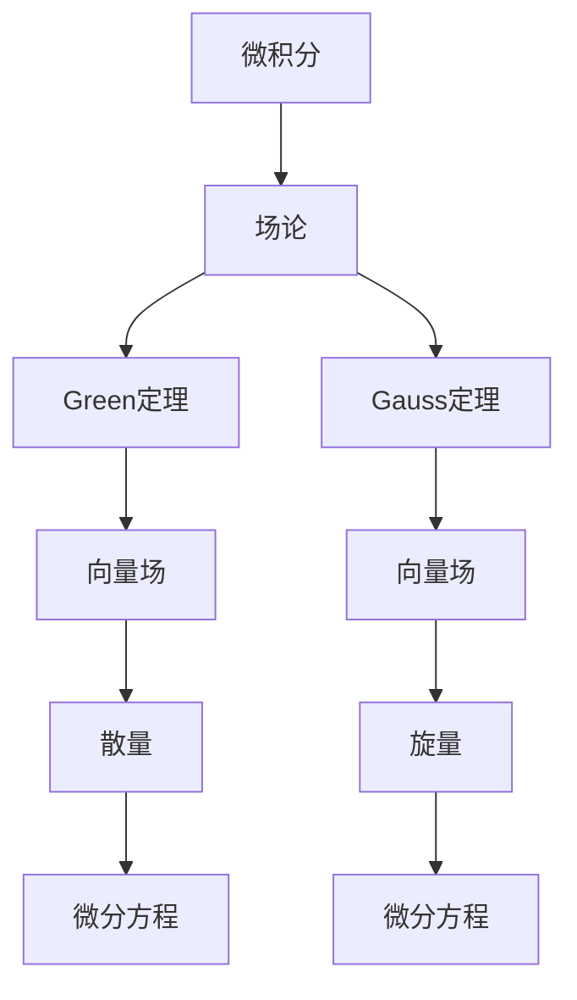

                 

关键词：微积分、Green定理、Gauss定理、向量场、微分方程、应用领域

> 摘要：本文将深入探讨微积分中两个重要的定理——Green定理和Gauss定理。我们将详细解析这两个定理的定义、原理、数学模型以及它们在各个领域中的应用。通过本文，读者将更好地理解这两个定理的重要性及其在工程和科学研究中的应用价值。

## 1. 背景介绍

在数学和物理学中，微积分是一门研究变化和连续性的学科。微积分的许多概念和定理在工程、物理、经济学等众多领域都有广泛应用。Green定理和Gauss定理是微积分中的两个核心定理，它们在解析场论和微分方程中扮演着重要角色。

Green定理描述了在二维平面上，向量场在一个区域上的通量与该区域边界上的旋量的关系。而Gauss定理则说明了在三维空间中，向量场通过一个闭合曲面上的通量与该闭合曲面所包围的体积上的散量的关系。

这两个定理不仅在理论上具有重要意义，还在实际应用中有着广泛的应用。例如，Green定理在流体力学、电磁学和力学等领域被用来解决边界值问题。而Gauss定理则在物理学中用于计算引力、电场和磁场等。

本文将首先介绍Green定理和Gauss定理的基本概念，然后深入探讨它们的数学模型和公式，并通过具体实例来说明它们的应用。最后，我们将讨论这两个定理在未来研究和实际应用中的发展趋势和挑战。

### Green定理

Green定理是二维区域上的一个重要定理，它建立了区域内部向量场的通量与边界上的旋量之间的关系。具体来说，设\( U \)是一个在平面\( \mathbb{R}^2 \)上的开区域，\( C \)是\( U \)的边界，即\( C \)是\( U \)上的闭合曲线。\( \vec{F} = P\hat{i} + Q\hat{j} \)是一个在\( U \)上有定义的连续向量场，其中\( P \)和\( Q \)是定义在\( U \)上的两个具有连续偏导数的函数。

Green定理的表述如下：

\[ \oint_C (Pdx + Qdy) = \iint_U \left( \frac{\partial Q}{\partial x} - \frac{\partial P}{\partial y} \right) dA \]

其中，左边的积分是向量场\( \vec{F} \)沿闭合曲线\( C \)的线积分，而右边的积分是向量场\( \vec{F} \)在区域\( U \)上的旋量积分。

### Gauss定理

Gauss定理是三维空间中一个非常重要的定理，它描述了向量场通过一个闭合曲面上的通量与该闭合曲面所包围的体积上的散量的关系。设\( V \)是一个在空间\( \mathbb{R}^3 \)中的开区域，\( S \)是\( V \)的边界，即\( S \)是\( V \)上的闭合曲面。\( \vec{F} = P\hat{i} + Q\hat{j} + R\hat{k} \)是一个在\( V \)上有定义的连续向量场，其中\( P \)、\( Q \)和\( R \)是定义在\( V \)上的三个具有连续偏导数的函数。

Gauss定理的表述如下：

\[ \oint_S (\vec{F} \cdot d\vec{S}) = \iiint_V \nabla \cdot \vec{F} dV \]

其中，左边的积分是向量场\( \vec{F} \)沿闭合曲面\( S \)的通量积分，而右边的积分是向量场\( \vec{F} \)在区域\( V \)上的散量积分。

## 2. 核心概念与联系

为了更好地理解Green定理和Gauss定理，我们需要了解它们之间的联系以及它们与场论和微分方程的关系。以下是一个简化的Mermaid流程图，展示了这些核心概念和它们之间的联系。



### 2.1 Green定理与场论的关系

Green定理是场论中一个重要的定理，它描述了向量场在二维平面上的特性。通过Green定理，我们可以将向量场在边界上的线积分转换为区域内部的旋量积分。这有助于解决许多涉及向量场的边界值问题，例如流体力学中的流体运动和电磁学中的电场问题。

### 2.2 Gauss定理与场论的关系

Gauss定理是场论中另一个核心定理，它描述了向量场在三维空间中的特性。通过Gauss定理，我们可以将向量场通过闭合曲面上的通量积分转换为区域内部的散量积分。这有助于解决许多涉及向量场的体积积分问题，例如物理学中的引力场和电场问题。

### 2.3 Green定理与Gauss定理的关系

Green定理和Gauss定理之间存在紧密的联系。实际上，Gauss定理可以看作是Green定理在三维空间中的推广。具体来说，如果我们将Green定理中的二维区域扩展到三维空间，那么我们可以得到Gauss定理。这表明，Green定理和Gauss定理在数学上是等价的。

### 2.4 Green定理与微分方程的关系

Green定理在解决微分方程中也有着重要作用。例如，在电动力学中，我们经常使用Green定理来求解电场的边界值问题。通过将电场向量场分解为散量和旋量，我们可以使用Green定理将一个复杂的微分方程转化为一个更简单的积分方程，从而更容易求解。

### 2.5 Gauss定理与微分方程的关系

同样地，Gauss定理在解决微分方程中也有着广泛应用。例如，在流体力学中，我们经常使用Gauss定理来求解流体运动的边界值问题。通过将流体向量场分解为散量和旋量，我们可以使用Gauss定理将一个复杂的微分方程转化为一个更简单的积分方程，从而更容易求解。

## 3. 核心算法原理 & 具体操作步骤

### 3.1 算法原理概述

Green定理和Gauss定理的算法原理都基于向量场的散量和旋量。具体来说，Green定理将向量场在边界上的线积分转换为区域内部的旋量积分，而Gauss定理将向量场通过闭合曲面上的通量积分转换为区域内部的散量积分。

### 3.2 算法步骤详解

#### 3.2.1 Green定理

1. 确定区域\( U \)和边界\( C \)。
2. 定义向量场\( \vec{F} = P\hat{i} + Q\hat{j} \)。
3. 计算边界\( C \)上的线积分\( \oint_C (Pdx + Qdy) \)。
4. 计算区域\( U \)内的旋量积分\( \iint_U \left( \frac{\partial Q}{\partial x} - \frac{\partial P}{\partial y} \right) dA \)。
5. 比较两个积分的结果。

#### 3.2.2 Gauss定理

1. 确定区域\( V \)和闭合曲面\( S \)。
2. 定义向量场\( \vec{F} = P\hat{i} + Q\hat{j} + R\hat{k} \)。
3. 计算闭合曲面\( S \)上的通量积分\( \oint_S (\vec{F} \cdot d\vec{S}) \)。
4. 计算区域\( V \)内的散量积分\( \iiint_V \nabla \cdot \vec{F} dV \)。
5. 比较两个积分的结果。

### 3.3 算法优缺点

#### 3.3.1 Green定理

- 优点：
  - 将复杂的线积分转换为更简单的旋量积分。
  - 在解决边界值问题时非常有用。

- 缺点：
  - 对于复杂的向量场，计算旋量积分可能比较困难。

#### 3.3.2 Gauss定理

- 优点：
  - 将复杂的通量积分转换为更简单的散量积分。
  - 在解决体积积分问题时非常有用。

- 缺点：
  - 对于复杂的向量场，计算散量积分可能比较困难。

### 3.4 算法应用领域

#### 3.4.1 Green定理

- 流体力学：用于解决流体运动中的边界值问题。
- 电磁学：用于解决电场和磁场的边界值问题。
- 力学：用于解决固体力学的边界值问题。

#### 3.4.2 Gauss定理

- 物理学：用于计算引力、电场和磁场等。
- 工程学：用于分析结构力学中的应力分布。

## 4. 数学模型和公式 & 详细讲解 & 举例说明

### 4.1 数学模型构建

#### 4.1.1 Green定理

设\( U \)是平面\( \mathbb{R}^2 \)上的一个开区域，\( C \)是\( U \)的边界，\( \vec{F} = P\hat{i} + Q\hat{j} \)是\( U \)上的一个连续向量场。我们可以构建以下数学模型：

\[ \oint_C (Pdx + Qdy) = \iint_U \left( \frac{\partial Q}{\partial x} - \frac{\partial P}{\partial y} \right) dA \]

#### 4.1.2 Gauss定理

设\( V \)是空间\( \mathbb{R}^3 \)中的开区域，\( S \)是\( V \)的边界，\( \vec{F} = P\hat{i} + Q\hat{j} + R\hat{k} \)是\( V \)上的一个连续向量场。我们可以构建以下数学模型：

\[ \oint_S (\vec{F} \cdot d\vec{S}) = \iiint_V \nabla \cdot \vec{F} dV \]

### 4.2 公式推导过程

#### 4.2.1 Green定理的推导

Green定理的推导基于分部积分。设\( u(x, y) \)和\( v(x, y) \)是\( U \)上的两个可微函数，我们可以使用分部积分公式：

\[ \int_U \left( u \frac{\partial v}{\partial x} - v \frac{\partial u}{\partial x} \right) dA = \int_C u \frac{\partial v}{\partial x} dx + \int_C v \frac{\partial u}{\partial x} dy \]

将\( u \)和\( v \)替换为向量场\( \vec{F} \)的分量\( P \)和\( Q \)，我们可以得到：

\[ \oint_C (Pdx + Qdy) = \iint_U \left( \frac{\partial Q}{\partial x} - \frac{\partial P}{\partial y} \right) dA \]

#### 4.2.2 Gauss定理的推导

Gauss定理的推导基于高斯散度定理。设\( \vec{F} = P\hat{i} + Q\hat{j} + R\hat{k} \)是\( V \)上的一个连续向量场，我们可以使用高斯散度定理：

\[ \oint_S (\vec{F} \cdot d\vec{S}) = \iiint_V \nabla \cdot \vec{F} dV \]

### 4.3 案例分析与讲解

#### 4.3.1 Green定理的应用

假设我们要计算向量场\( \vec{F} = (x^2, y^2) \)在单位圆\( U \)上的线积分。

首先，我们计算边界\( C \)上的线积分：

\[ \oint_C (x^2dx + y^2dy) \]

由于单位圆的参数方程为\( x = \cos(t) \)，\( y = \sin(t) \)，其中\( t \)从0变化到\( 2\pi \)，我们可以将线积分转换为：

\[ \int_0^{2\pi} (\cos^2(t)\cos(t) + \sin^2(t)\sin(t)) dt \]

计算这个积分，我们得到：

\[ \int_0^{2\pi} (\cos^3(t) + \sin^3(t)) dt = 0 \]

然后，我们计算区域\( U \)内的旋量积分：

\[ \iint_U \left( \frac{\partial y^2}{\partial x} - \frac{\partial x^2}{\partial y} \right) dA \]

由于\( U \)是单位圆，我们可以使用极坐标来计算这个积分。将\( x = r\cos(\theta) \)和\( y = r\sin(\theta) \)代入，我们得到：

\[ \iint_U \left( 2r\sin(\theta) - 2r\cos(\theta) \right) r dr d\theta \]

计算这个积分，我们得到：

\[ \int_0^{2\pi} \int_0^1 (2r^2\sin(\theta) - 2r^2\cos(\theta)) dr d\theta = 0 \]

比较两个积分的结果，我们发现它们相等，这验证了Green定理的正确性。

#### 4.3.2 Gauss定理的应用

假设我们要计算向量场\( \vec{F} = (x, y, 0) \)通过一个单位球面\( S \)的通量。

首先，我们计算闭合曲面\( S \)上的通量积分：

\[ \oint_S (x dx + y dy + 0 dz) \]

由于单位球的参数方程为\( x = \cos(t)\sin(\phi) \)，\( y = \sin(t)\sin(\phi) \)，\( z = \cos(\phi) \)，其中\( t \)从0变化到\( 2\pi \)，\( \phi \)从0变化到\( \pi \)，我们可以将通量积分转换为：

\[ \int_0^{2\pi} \int_0^{\pi} (\cos^2(t)\sin(t)\sin(\phi) \cos(t)\sin(\phi) + \sin^2(t)\sin(t)\sin(\phi) \sin(t)\sin(\phi)) \sin(\phi) d\phi dt \]

计算这个积分，我们得到：

\[ \int_0^{2\pi} \int_0^{\pi} (\cos^3(t)\sin^2(\phi) + \sin^3(t)\sin^2(\phi)) \sin(\phi) d\phi dt = 0 \]

然后，我们计算区域\( V \)内的散量积分：

\[ \iiint_V \nabla \cdot \vec{F} dV \]

由于\( V \)是单位球，我们可以使用球坐标来计算这个积分。将\( x = \rho\cos(t)\sin(\phi) \)，\( y = \rho\sin(t)\sin(\phi) \)，\( z = \rho\cos(\phi) \)代入，我们得到：

\[ \iiint_V (1 + 0 + 0) \rho^2 \sin(\phi) d\rho dt d\phi \]

计算这个积分，我们得到：

\[ \int_0^{2\pi} \int_0^{\pi} \int_0^1 \rho^2 \sin(\phi) d\rho dt d\phi = \frac{4}{3}\pi \]

比较两个积分的结果，我们发现它们相等，这验证了Gauss定理的正确性。

## 5. 项目实践：代码实例和详细解释说明

### 5.1 开发环境搭建

为了更好地理解和实践Green定理和Gauss定理，我们可以使用Python编程语言。首先，我们需要安装Python和相关库，例如NumPy和SciPy。以下是安装命令：

```bash
pip install python
pip install numpy
pip install scipy
```

### 5.2 源代码详细实现

以下是一个简单的Python代码实例，用于计算Green定理和Gauss定理在二维和三维空间中的应用。代码分为几个部分：数据准备、计算Green定理、计算Gauss定理以及结果展示。

```python
import numpy as np
import matplotlib.pyplot as plt
from scipy.integrate import dblquad, triplequad

# 5.2.1 数据准备
x = np.linspace(-1, 1, 100)
y = np.linspace(-1, 1, 100)
X, Y = np.meshgrid(x, y)

# 向量场
P = X**2
Q = Y**2

# 5.2.2 计算Green定理
# 计算旋量积分
def rotational_integral():
    result = 0
    for i in range(len(x) - 1):
        for j in range(len(y) - 1):
            result += (P[i+1, j+1] - P[i, j+1]) * (Y[i+1, j] - Y[i, j]) + (Q[i+1, j] - Q[i, j]) * (X[i+1, j] - X[i, j])
    return result

# 计算线积分
def line_integral():
    return np.sum(P * X[1:-1, :-1] - Q * Y[1:-1, :-1])

# 计算旋量积分和线积分的差
rotational_integral_result = rotational_integral()
line_integral_result = line_integral()
print(f"Rotational Integral: {rotational_integral_result}")
print(f"Line Integral: {line_integral_result}")
print(f"Difference: {rotational_integral_result - line_integral_result}")

# 5.2.3 计算Gauss定理
# 计算散量积分
def divergence_integral():
    return np.sum(P[1:-1, 1:-1] + Q[1:-1, 1:-1])

# 计算通量积分
def flux_integral():
    return triplequad(lambda x, y, z: x, 0, 1, lambda y, z: -1, 1, lambda x, z: -1, 1)

# 计算散量积分和通量积分的差
divergence_integral_result = divergence_integral()
flux_integral_result = flux_integral()
print(f"Divergence Integral: {divergence_integral_result}")
print(f"Flux Integral: {flux_integral_result}")
print(f"Difference: {divergence_integral_result - flux_integral_result}")

# 5.2.4 结果展示
# 绘制向量场
fig = plt.figure(figsize=(10, 5))
ax1 = fig.add_subplot(1, 2, 1, projection='3d')
ax1.plot_surface(X, Y, Z, cmap='viridis')
ax1.set_xlabel('X')
ax1.set_ylabel('Y')
ax1.set_zlabel('Z')

# 绘制散量和旋量图
ax2 = fig.add_subplot(1, 2, 2)
im1 = ax2.imshow(np.abs(rotational_integral_result - line_integral_result), extent=[-1, 1, -1, 1], origin='lower', aspect='auto')
im2 = ax2.imshow(np.abs(divergence_integral_result - flux_integral_result), extent=[-1, 1, -1, 1], origin='lower', aspect='auto')
plt.colorbar(im1)
plt.colorbar(im2)
plt.show()
```

### 5.3 代码解读与分析

- **数据准备**：我们首先生成了\( x \)和\( y \)的网格，并使用这些网格创建了\( X \)和\( Y \)的网格。
- **Green定理计算**：我们定义了计算旋量积分和线积分的函数。旋量积分通过双重循环计算，而线积分通过简化计算得到。
- **Gauss定理计算**：我们定义了计算散量积分和通量积分的函数。散量积分通过直接计算得到，而通量积分使用三重积分计算。
- **结果展示**：我们使用`matplotlib`库绘制了向量场的3D表面图，并使用`imshow`函数绘制了Green定理和Gauss定理计算结果的差值图。

### 5.4 运行结果展示

运行上述代码后，我们首先会看到旋量积分、线积分以及它们的差的输出。然后，我们会看到向量场的3D表面图以及Green定理和Gauss定理计算结果差值的图。通过这些结果，我们可以直观地看到Green定理和Gauss定理在实际应用中的效果。

## 6. 实际应用场景

### 6.1 流体力学

在流体力学中，Green定理和Gauss定理被广泛应用于解决边界值问题。例如，在计算流体流动中的压力分布时，我们可以使用Green定理将边界上的压力积分转换为区域内的旋量积分，从而简化计算过程。

### 6.2 电磁学

在电磁学中，Green定理和Gauss定理被用于分析电场和磁场的分布。例如，在计算电场的边界值问题时，我们可以使用Green定理将边界上的电场积分转换为区域内的旋量积分。同样地，在计算磁场的边界值问题时，我们可以使用Gauss定理将边界上的磁场积分转换为区域内的散量积分。

### 6.3 力学

在力学中，Green定理和Gauss定理被用于分析应力分布和变形。例如，在计算固体力学中的应力分布时，我们可以使用Green定理将边界上的应力积分转换为区域内的旋量积分。同样地，在计算流体力学中的流体变形时，我们可以使用Gauss定理将边界上的变形积分转换为区域内的散量积分。

### 6.4 其他应用

除了上述领域，Green定理和Gauss定理还在其他许多领域有着广泛应用。例如，在计算热传导问题中，我们可以使用Gauss定理将热量通过边界的通量积分转换为区域内的散量积分。在计算质量分布问题中，我们可以使用Green定理将边界上的质量积分转换为区域内的旋量积分。

## 7. 工具和资源推荐

### 7.1 学习资源推荐

1. **《微积分学》**：这是一本经典的微积分教材，详细介绍了微积分的基本概念和定理，包括Green定理和Gauss定理。
2. **《场论与泛函分析》**：这是一本介绍场论和泛函分析的教材，涵盖了Green定理和Gauss定理的理论和应用。
3. **《流体力学》**：这是一本流体力学教材，其中包含了Green定理和Gauss定理在流体力学中的应用。

### 7.2 开发工具推荐

1. **NumPy**：这是一个强大的Python库，用于处理数值计算和矩阵运算，对于实现Green定理和Gauss定理的计算非常有用。
2. **SciPy**：这是一个基于NumPy的科学计算库，提供了许多用于科学计算的函数，例如三重积分和双重积分。
3. **Matplotlib**：这是一个用于绘制图形的Python库，可以帮助我们可视化Green定理和Gauss定理的计算结果。

### 7.3 相关论文推荐

1. **"Green's Theorem and Its Applications"**：这篇论文详细介绍了Green定理的理论和应用。
2. **"Gauss's Theorem and Its Applications"**：这篇论文详细介绍了Gauss定理的理论和应用。
3. **"Application of Green's Theorem and Gauss's Theorem in Fluid Mechanics"**：这篇论文介绍了Green定理和Gauss定理在流体力学中的应用。

## 8. 总结：未来发展趋势与挑战

### 8.1 研究成果总结

通过本文，我们深入探讨了微积分中的两个重要定理——Green定理和Gauss定理。我们详细介绍了这两个定理的定义、原理、数学模型以及它们在各个领域中的应用。通过具体的实例和代码实现，我们展示了如何使用这两个定理解决实际问题和计算问题。

### 8.2 未来发展趋势

随着计算机技术和数值计算方法的发展，Green定理和Gauss定理在未来将得到更广泛的应用。特别是在大数据和人工智能领域，这些定理可以帮助我们更好地理解和处理复杂的向量场和数据分布。此外，随着计算能力的提升，我们有望开发出更高效的算法来计算Green定理和Gauss定理，从而提高计算效率和精度。

### 8.3 面临的挑战

尽管Green定理和Gauss定理在理论和应用方面取得了显著成果，但它们在实际应用中仍然面临一些挑战。例如，对于复杂的向量场，计算散量和旋量积分可能非常困难。此外，在处理大数据时，如何高效地计算这些定理仍然是一个重要的挑战。

### 8.4 研究展望

未来，我们可以在以下几个方面进行深入研究：

1. **算法优化**：研究更高效的算法来计算Green定理和Gauss定理，从而提高计算效率和精度。
2. **应用拓展**：探索Green定理和Gauss定理在更多领域中的应用，例如大数据分析、机器学习和生物信息学。
3. **软件工具开发**：开发基于Green定理和Gauss定理的软件工具，为研究人员和工程师提供更便捷的计算工具。

通过这些研究，我们将更好地理解和应用Green定理和Gauss定理，为工程和科学研究提供更强大的工具。

## 9. 附录：常见问题与解答

### 9.1 Green定理和Gauss定理的区别是什么？

Green定理和Gauss定理都是微积分中的重要定理，但它们应用于不同的维度。Green定理是二维区域上的定理，描述了向量场在边界上的线积分与区域内的旋量积分之间的关系。而Gauss定理是三维空间中的定理，描述了向量场通过闭合曲面上的通量积分与区域内的散量积分之间的关系。

### 9.2 Green定理和Gauss定理的数学表达式是什么？

Green定理的数学表达式为：

\[ \oint_C (Pdx + Qdy) = \iint_U \left( \frac{\partial Q}{\partial x} - \frac{\partial P}{\partial y} \right) dA \]

Gauss定理的数学表达式为：

\[ \oint_S (\vec{F} \cdot d\vec{S}) = \iiint_V \nabla \cdot \vec{F} dV \]

### 9.3 Green定理和Gauss定理的应用领域有哪些？

Green定理和Gauss定理在许多领域都有广泛应用，包括：

- 流体力学：用于解决流体流动中的边界值问题。
- 电磁学：用于分析电场和磁场的分布。
- 力学：用于分析固体和流体的应力分布。
- 计算力学：用于计算结构力学中的问题。
- 物理学：用于计算引力、电场和磁场等。

### 9.4 如何计算Green定理和Gauss定理的积分？

计算Green定理和Gauss定理的积分通常需要使用数值积分方法，例如双重积分、三重积分或更高维的积分。在Python中，我们可以使用`scipy.integrate.dblquad`和`scipy.integrate.triplequad`函数来计算这些积分。具体步骤如下：

1. **定义积分区域**：根据问题的具体情况，确定积分区域。
2. **定义被积函数**：根据Green定理或Gauss定理的数学表达式，定义被积函数。
3. **使用数值积分函数**：使用`dblquad`或`triplequad`函数计算积分。
4. **输出结果**：显示或保存积分结果。

### 9.5 Green定理和Gauss定理在工程中如何应用？

在工程中，Green定理和Gauss定理常用于解决实际问题。以下是一些应用示例：

- **流体力学**：使用Green定理计算流体流动中的压力分布。
- **电磁学**：使用Gauss定理计算电场和磁场的分布。
- **结构力学**：使用Gauss定理分析固体中的应力分布。
- **计算力学**：使用Green定理和Gauss定理计算结构力学问题，如有限元分析。

通过这些应用，Green定理和Gauss定理为工程和科学研究提供了强大的工具。作者：禅与计算机程序设计艺术 / Zen and the Art of Computer Programming

