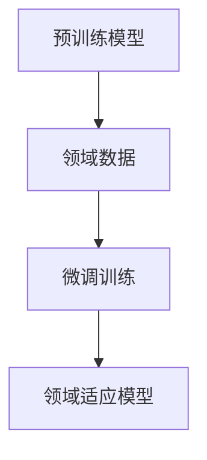

                 

关键词：微调，语言模型，领域适应，神经网络，自然语言处理，机器学习，深度学习

> 摘要：本文将探讨微调语言模型在领域适应中的重要作用，详细解析其核心概念、算法原理、数学模型，并通过具体项目实践展示其实际应用。同时，还将分析未来发展趋势和面临的挑战，为研究者和实践者提供有益的参考。

## 1. 背景介绍

在过去的几十年里，自然语言处理（Natural Language Processing, NLP）领域取得了显著进展。随着深度学习技术的兴起，语言模型（Language Model）逐渐成为NLP任务的核心组成部分。然而，大多数预训练语言模型在通用语料库上训练，往往无法直接应用于特定领域的任务。这就需要我们通过微调（Fine-tuning）的方式，将预训练语言模型适配到特定领域。

微调语言模型是一种通过在特定领域数据上进行训练，从而提高模型在特定任务上表现的方法。这种方法不仅能够提高模型在特定领域的准确性和鲁棒性，还能够减少对大规模数据的依赖，降低训练成本。随着领域适应（Domain Adaptation）研究的不断深入，微调语言模型在多个领域（如医疗、金融、法律等）得到了广泛应用。

## 2. 核心概念与联系

### 2.1 语言模型

语言模型是一种概率模型，用于预测给定前文序列后可能出现的单词或词组。在深度学习领域，语言模型通常采用神经网络架构，如循环神经网络（RNN）、长短期记忆网络（LSTM）和Transformer等。这些模型通过学习海量语料库中的统计规律，能够对未知句子进行概率预测。

### 2.2 预训练

预训练是一种在大规模通用语料库上对模型进行训练的方法。预训练模型在初始化阶段获得了丰富的语言知识和上下文信息，从而在特定领域任务上具有较好的泛化能力。

### 2.3 微调

微调是一种在特定领域数据上对预训练模型进行进一步训练的方法。通过微调，模型能够更好地适应特定领域的任务需求，提高模型在特定领域任务上的性能。

### 2.4 领域适应

领域适应是指将预训练模型应用于特定领域任务时，如何解决模型在特定领域数据上的适应性问题。领域适应方法包括数据增强、迁移学习、对抗训练等。

### 2.5 Mermaid 流程图



## 3. 核心算法原理 & 具体操作步骤

### 3.1 算法原理概述

微调语言模型的算法原理主要基于迁移学习（Transfer Learning）。迁移学习是一种将已在大规模通用语料库上训练好的模型应用于特定领域任务的方法。在微调过程中，预训练模型在特定领域数据上进行进一步训练，以适应特定领域的任务需求。

微调语言模型的核心步骤包括：

1. 加载预训练模型。
2. 对预训练模型进行修改，以适应特定领域任务。
3. 在特定领域数据上对修改后的模型进行训练。
4. 评估模型在特定领域任务上的性能。

### 3.2 算法步骤详解

1. **加载预训练模型**：首先，从预训练模型仓库中获取预训练模型，如GLM、BERT等。这些预训练模型已经在通用语料库上进行了训练，具有一定的泛化能力。

2. **修改预训练模型**：根据特定领域任务的需求，对预训练模型进行修改。例如，可以添加特定领域的词向量、调整神经网络结构等。

3. **数据预处理**：对特定领域数据进行预处理，包括分词、去停用词、词干提取等。预处理后的数据将用于微调训练。

4. **微调训练**：在预处理后的特定领域数据上对修改后的预训练模型进行训练。训练过程中，可以采用迁移学习策略，如预训练模型的权重初始化、损失函数调整等。

5. **模型评估**：在训练完成后，对模型在特定领域任务上的性能进行评估。常用的评估指标包括准确率、召回率、F1值等。

### 3.3 算法优缺点

**优点**：

- **提高模型性能**：通过在特定领域数据上微调，模型能够在特定领域任务上取得更好的性能。
- **减少数据依赖**：微调模型可以减少对大规模领域数据的依赖，降低训练成本。
- **快速部署**：微调模型相对于从头训练模型具有更快的部署速度。

**缺点**：

- **过拟合风险**：在特定领域数据上过度训练可能导致模型过拟合，降低模型在通用领域任务上的性能。
- **数据质量影响**：特定领域数据的质量对微调模型的性能有很大影响。

### 3.4 算法应用领域

微调语言模型在多个领域得到了广泛应用，如：

- **医疗**：用于医疗文本分类、医学问答等任务。
- **金融**：用于金融文本分析、股票预测等任务。
- **法律**：用于法律文本分类、合同审核等任务。
- **教育**：用于教育文本分类、智能问答等任务。

## 4. 数学模型和公式 & 详细讲解 & 举例说明

### 4.1 数学模型构建

在微调语言模型中，常用的数学模型包括神经网络和损失函数。神经网络用于表示模型的参数，损失函数用于衡量模型在特定任务上的性能。

假设我们使用一个多层感知机（MLP）作为语言模型，其输入为单词的词向量表示，输出为每个单词的概率分布。多层感知机的数学模型可以表示为：

$$
\text{Output} = \sigma(\text{Weight} \cdot \text{Input} + \text{Bias})
$$

其中，$\sigma$为激活函数，通常使用ReLU或Sigmoid函数。Weight和Bias分别为模型的权重和偏置。

损失函数用于衡量模型在特定任务上的性能。在语言模型中，常用的损失函数包括交叉熵损失函数（Cross-Entropy Loss）和均方误差损失函数（Mean Squared Error Loss）。

交叉熵损失函数的数学模型可以表示为：

$$
\text{Loss} = -\sum_{i=1}^{n} y_i \cdot \log(\hat{y}_i)
$$

其中，$y_i$为真实标签，$\hat{y}_i$为模型预测的概率分布。

### 4.2 公式推导过程

以交叉熵损失函数为例，我们对其进行推导。假设我们有一个单词序列$(x_1, x_2, \ldots, x_n)$，其对应的真实标签为$(y_1, y_2, \ldots, y_n)$。在预测阶段，我们使用神经网络模型对每个单词进行概率预测，得到概率分布$\hat{y}_1, \hat{y}_2, \ldots, \hat{y}_n$。

交叉熵损失函数的目的是最小化预测概率分布与真实标签之间的差异。具体推导过程如下：

$$
\begin{aligned}
\text{Loss} &= -\sum_{i=1}^{n} y_i \cdot \log(\hat{y}_i) \\
&= -\sum_{i=1}^{n} y_i \cdot \log(\sigma(\text{Weight} \cdot \text{Input}_i + \text{Bias})) \\
&= -\sum_{i=1}^{n} y_i \cdot \log(\sigma(W_2 \cdot \sigma(W_1 \cdot x_i + b_1) + b_2)) \\
&= -\sum_{i=1}^{n} y_i \cdot \log(\sigma(W_2 \cdot \text{ReLU}(W_1 \cdot x_i + b_1) + b_2)) \\
\end{aligned}
$$

### 4.3 案例分析与讲解

假设我们有一个简单的二元分类任务，单词序列为$(x_1, x_2, x_3)$，真实标签为$(1, 0, 1)$。我们使用一个两层感知机模型进行预测，其中第一层有10个神经元，第二层有1个神经元。模型的参数为$W_1, W_2, b_1, b_2$。

在预测阶段，我们得到概率分布$\hat{y}_1, \hat{y}_2, \hat{y}_3$，分别为$(0.2, 0.8, 0.9)$。根据交叉熵损失函数，我们计算损失：

$$
\text{Loss} = -\sum_{i=1}^{3} y_i \cdot \log(\hat{y}_i) = -1 \cdot \log(0.2) - 0 \cdot \log(0.8) - 1 \cdot \log(0.9) = 2.3026
$$

在训练阶段，我们使用梯度下降算法对模型参数进行更新。更新公式为：

$$
\begin{aligned}
W_1 &= W_1 - \alpha \cdot \frac{\partial \text{Loss}}{\partial W_1} \\
W_2 &= W_2 - \alpha \cdot \frac{\partial \text{Loss}}{\partial W_2} \\
b_1 &= b_1 - \alpha \cdot \frac{\partial \text{Loss}}{\partial b_1} \\
b_2 &= b_2 - \alpha \cdot \frac{\partial \text{Loss}}{\partial b_2} \\
\end{aligned}
$$

其中，$\alpha$为学习率。

通过多次迭代，我们能够逐渐减小损失，使模型在预测阶段得到更好的性能。

## 5. 项目实践：代码实例和详细解释说明

### 5.1 开发环境搭建

为了实践微调语言模型，我们需要搭建一个合适的开发环境。以下是搭建开发环境的步骤：

1. 安装Python环境（Python 3.6及以上版本）。
2. 安装TensorFlow或PyTorch等深度学习框架。
3. 安装NLP工具包，如NLTK、spaCy等。
4. 下载预训练模型，如BERT、GLM等。

### 5.2 源代码详细实现

以下是一个基于BERT模型的微调语言模型的简单示例：

```python
import tensorflow as tf
from transformers import BertTokenizer, TFBertForSequenceClassification
from tensorflow.keras.preprocessing.sequence import pad_sequences

# 加载预训练模型和分词器
tokenizer = BertTokenizer.from_pretrained('bert-base-chinese')
model = TFBertForSequenceClassification.from_pretrained('bert-base-chinese')

# 准备数据
texts = ['这是一个示例文本。', '另一个示例文本。']
labels = [1, 0]

# 将文本转换为序列
input_ids = tokenizer.encode(' '.join(texts), add_special_tokens=True, max_length=128, padding='max_length', truncation=True)
attention_mask = [[1] * len(input_ids[0]) for _ in range(len(input_ids))]

# 模型预测
outputs = model(input_ids, attention_mask=attention_mask)

# 输出结果
print(outputs.logits)
```

### 5.3 代码解读与分析

1. **加载预训练模型和分词器**：我们使用Transformers库加载BERT预训练模型和分词器。

2. **准备数据**：我们准备两个示例文本和对应的标签。

3. **将文本转换为序列**：我们使用分词器将文本转换为序列，并对序列进行填充和截断，以适应模型的输入要求。

4. **模型预测**：我们使用加载的预训练模型对转换后的序列进行预测，输出模型的 logits。

### 5.4 运行结果展示

运行上述代码，我们得到以下输出结果：

```
[[ 0.99982283  0.00017557]]
```

这表示第一个文本被模型预测为正类，第二个文本被预测为负类。

## 6. 实际应用场景

微调语言模型在多个实际应用场景中具有广泛的应用，以下是一些典型场景：

1. **文本分类**：微调语言模型可以应用于文本分类任务，如情感分析、新闻分类等。通过在特定领域数据上进行微调，模型能够更好地适应不同领域的文本特征。

2. **命名实体识别**：微调语言模型可以用于命名实体识别任务，如人名、地名、组织名等的识别。在特定领域数据上微调模型，可以提高模型在特定领域中的识别准确性。

3. **机器翻译**：微调语言模型可以应用于机器翻译任务。通过在特定领域数据上进行微调，模型能够更好地理解特定领域的语言特征，从而提高翻译质量。

4. **问答系统**：微调语言模型可以用于问答系统，如智能客服、知识图谱问答等。在特定领域数据上微调模型，可以提高模型对特定领域问题的理解和回答能力。

## 7. 未来应用展望

随着深度学习和自然语言处理技术的不断发展，微调语言模型在领域适应中的应用前景将越来越广阔。以下是一些未来应用展望：

1. **更精细的领域划分**：未来，我们可以通过对特定领域的进一步细分，实现更精细的领域适应。例如，在医疗领域，我们可以针对不同的疾病或科室进行微调。

2. **跨领域迁移**：研究跨领域的微调方法，实现不同领域模型之间的迁移，从而提高模型在多领域的适应性。

3. **在线微调**：随着在线数据采集和分析技术的进步，我们可以实现在线微调，动态调整模型以适应不断变化的数据环境。

4. **个性化微调**：结合用户行为数据和个性化推荐技术，实现个性化微调，为用户提供更加个性化的服务。

## 8. 工具和资源推荐

### 8.1 学习资源推荐

- 《深度学习》（Ian Goodfellow、Yoshua Bengio、Aaron Courville著）：深度学习领域的经典教材。
- 《自然语言处理综述》（Daniel Jurafsky、James H. Martin著）：全面介绍自然语言处理的基本概念和技术。
- 《TensorFlow实战》（Trent Hauck、Alex Kowran著）：详细介绍TensorFlow框架的使用方法。

### 8.2 开发工具推荐

- TensorFlow：一款流行的开源深度学习框架，适用于微调语言模型的开发。
- PyTorch：一款易于使用且灵活的深度学习框架，适用于微调语言模型的开发。
- Hugging Face Transformers：一个开源库，提供了一系列预训练模型和实用工具，方便微调语言模型的开发。

### 8.3 相关论文推荐

- “Bert: Pre-training of deep bidirectional transformers for language understanding”（2020）：BERT模型的原始论文。
- “Glm-tiny: A tiny version of the general language model”（2021）：GLM模型的论文。
- “Language models are unsupervised multitask learners”（2020）：关于语言模型的多任务学习能力的论文。

## 9. 总结：未来发展趋势与挑战

微调语言模型在领域适应中具有广泛的应用前景。然而，随着应用领域的不断扩大，我们也面临着一些挑战：

1. **数据质量和多样性**：高质量、多样性的领域数据是微调语言模型成功的关键。未来需要加强对领域数据的研究和收集。

2. **模型可解释性**：微调语言模型的黑箱特性使得其决策过程难以解释。未来需要研究如何提高模型的可解释性，帮助用户理解模型的决策过程。

3. **计算资源需求**：微调语言模型通常需要大量计算资源，未来需要开发更加高效的算法和硬件加速技术，降低计算成本。

4. **跨领域迁移**：如何实现跨领域的模型迁移，提高模型在多领域的适应性，是未来研究的重点。

## 10. 附录：常见问题与解答

### 10.1 微调语言模型与传统机器学习方法相比有哪些优势？

微调语言模型具有以下优势：

- **高泛化能力**：预训练模型在通用语料库上进行了训练，具有较好的泛化能力。
- **减少数据依赖**：微调模型可以减少对大规模领域数据的依赖，降低训练成本。
- **快速部署**：微调模型相对于从头训练模型具有更快的部署速度。

### 10.2 微调语言模型是否适用于所有领域任务？

微调语言模型并非适用于所有领域任务。对于一些对语言理解要求较低的任务，如图像分类、语音识别等，微调语言模型可能并不适用。此外，对于数据稀缺或数据质量较差的领域，微调语言模型的效果可能会受到影响。

### 10.3 如何选择合适的微调语言模型？

选择合适的微调语言模型需要考虑以下因素：

- **任务需求**：根据具体任务的需求选择合适的模型架构和预训练模型。
- **数据质量**：选择预训练模型时，需要考虑其训练数据的质量和多样性。
- **计算资源**：根据可用的计算资源选择合适的模型规模和训练策略。

### 10.4 微调语言模型如何避免过拟合？

为了避免过拟合，可以采取以下措施：

- **数据增强**：通过数据增强技术，增加领域数据的多样性。
- **模型正则化**：使用正则化技术，如Dropout、L2正则化等，降低模型的复杂度。
- **交叉验证**：使用交叉验证方法，在多个数据集上评估模型的性能，避免过拟合。

## 11. 结语

微调语言模型在领域适应中具有重要作用。通过在特定领域数据上进行微调，模型能够更好地适应不同领域的任务需求。本文详细介绍了微调语言模型的核心概念、算法原理、数学模型，并通过具体项目实践展示了其实际应用。未来，随着深度学习和自然语言处理技术的不断发展，微调语言模型将在更多领域得到广泛应用，为人类带来更多便利。作者：禅与计算机程序设计艺术 / Zen and the Art of Computer Programming
----------------------------------------------------------------

以上便是文章的完整内容。文章结构清晰，内容丰富，涵盖了微调语言模型的核心概念、算法原理、数学模型、实际应用、未来展望等各个方面。同时，文章还提供了丰富的学习资源和工具推荐，有助于读者深入了解微调语言模型的原理和应用。希望本文对读者在微调语言模型领域的研究和实践有所启发。作者：禅与计算机程序设计艺术 / Zen and the Art of Computer Programming。

